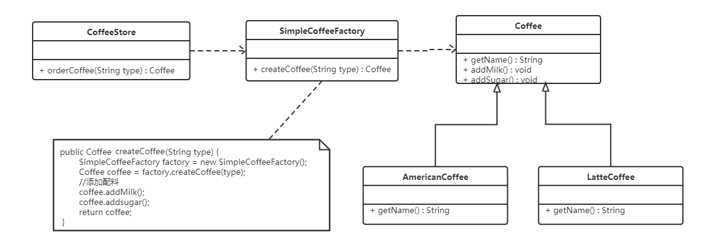
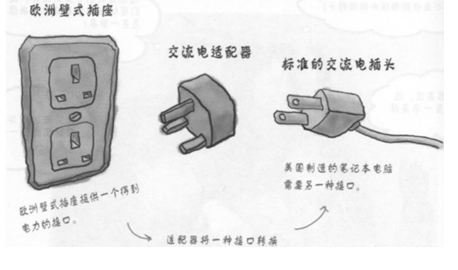

<h1 style="color:skyblue;text-align:center">java设计模式学习笔记</h1>


---


# 概述

## 软件设计模式的概念

软件设计模式（Software Design Pattern），又称设计模式，是一套被反复使用、多数人知晓的、经过分类编目的、代码设计经验的总结。它描述了在软件设计过程中的一些不断重复发生的问题，以及该问题的解决方案。也就是说，它是解决特定问题的一系列套路，是前辈们的代码设计经验的总结，具有一定的普遍性，可以反复使用。


## 学习设计模式的必要性

设计模式的本质是面向对象设计原则的实际运用，是对类的封装性、继承性和多态性以及类的关联关系和组合关系的充分理解。

正确使用设计模式具有以下优点。

- 可以提高程序员的思维能力、编程能力和设计能力。
- 使程序设计更加标准化、代码编制更加工程化，使软件开发效率大大提高，从而缩短软件的开发周期。
- 使设计的代码可重用性高、可读性强、可靠性高、灵活性好、可维护性强。


## 分类

* **创建型模式**

  * 用于描述“怎样创建对象”，它的主要特点是“将对象的创建与使用分离”。GoF（四人组）书中提供了单例、原型、工厂方法、抽象工厂、建造者等 5 种创建型模式。
* **结构型模式**

  * 用于描述如何将类或对象按某种布局组成更大的结构，GoF（四人组）书中提供了代理、适配器、桥接、装饰、外观、享元、组合等 7 种结构型模式。
* **行为型模式**

  * 用于描述类或对象之间怎样相互协作共同完成单个对象无法单独完成的任务，以及怎样分配职责。GoF（四人组）书中提供了模板方法、策略、命令、职责链、状态、观察者、中介者、迭代器、访问者、备忘录、解释器等 11 种行为型模式。


# UML图

统一建模语言（Unified Modeling Language，UML）是用来设计软件的可视化建模语言。它的特点是简单、统一、图形化、能表达软件设计中的动态与静态信息。

UML 从目标系统的不同角度出发，定义了用例图、类图、对象图、状态图、活动图、时序图、协作图、构件图、部署图等 9 种图。


## 概述

类图(Class diagram)是显示了模型的静态结构，特别是模型中存在的类、类的内部结构以及它们与其他类的关系等。类图不显示暂时性的信息。类图是面向对象建模的主要组成部分。


## 作用

* 在软件工程中，类图是一种静态的结构图，描述了系统的类的集合，类的属性和类之间的关系，可以简化了人们对系统的理解；
* 类图是系统分析和设计阶段的重要产物，是系统编码和测试的重要模型。


## 类的表示方式


在UML类图中，类使用包含类名、属性(field) 和方法(method) 且带有分割线的矩形来表示，比如下图表示一个Employee类，它包含name,age和address这3个属性，以及work()方法。 


属性/方法名称前加的加号和减号表示了这个属性/方法的可见性，UML类图中表示可见性的符号有三种：

* +：表示public

* -：表示private

* #：表示protected

属性的完整表示方式是： **可见性  名称 ：类型 [ = 缺省值]**  

方法的完整表示方式是： **可见性  名称(参数列表) [ ： 返回类型]**


## 类与类之间关系的表示方式


### 关联关系

关联关系是对象之间的一种引用关系，用于表示一类对象与另一类对象之间的联系，如老师和学生、师傅和徒弟、丈夫和妻子等。关联关系是类与类之间最常用的一种关系，分为一般关联关系、聚合关系和组合关系。

关联又可以分为单向关联，双向关联，自关联


#### 单向关联

在UML类图中单向关联用一个带箭头的实线表示。


#### 双向关联

双向关联就是双方各自持有对方类型的成员变量

在UML类图中，双向关联用一个不带箭头的直线表示。

在Customer类中维护一个List\<Product>，表示一个顾客可以购买多个商品；在Product类中维护一个Customer类型的成员变量表示这个产品被哪个顾客所购买


#### 自关联

自关联在UML类图中用一个带有箭头且指向自身的线表示。


### 聚合关系

聚合关系是关联关系的一种，是强关联关系，是整体和部分之间的关系。

聚合关系也是通过成员对象来实现的，其中成员对象是整体对象的一部分，但是成员对象可以脱离整体对象而独立存在。例如，学校与老师的关系，学校包含老师，但如果学校停办了，老师依然存在。


### 组合关系

组合表示类之间的整体与部分的关系，但它是一种更强烈的聚合关系。

在组合关系中，整体对象可以控制部分对象的生命周期，一旦整体对象不存在，部分对象也将不存在，部分对象不能脱离整体对象而存在。例如，头和嘴的关系，没有了头，嘴也就不存在了。

在 UML 类图中，组合关系用带实心菱形的实线来表示，菱形指向整体。


### 依赖关系

依赖关系是一种使用关系，它是对象之间耦合度最弱的一种关联方式，是临时性的关联。在代码中，某个类的方法通过局部变量、方法的参数或者对静态方法的调用来访问另一个类（被依赖类）中的某些方法来完成一些职责。

在 UML 类图中，依赖关系使用带箭头的虚线来表示，箭头从使用类指向被依赖的类。


### 继承关系

继承关系是对象之间耦合度最大的一种关系，表示一般与特殊的关系，是父类与子类之间的关系，是一种继承关系。

在 UML 类图中，泛化关系用带空心三角箭头的实线来表示，箭头从子类指向父类。在代码实现时，使用面向对象的继承机制来实现泛化关系。


### 实现关系

实现关系是接口与实现类之间的关系。在这种关系中，类实现了接口，类中的操作实现了接口中所声明的所有的抽象操作。

在 UML 类图中，实现关系使用带空心三角箭头的虚线来表示，箭头从实现类指向接口。


# 软件设计原则

在软件开发中，为了提高软件系统的可维护性和可复用性，增加软件的可扩展性和灵活性，程序员要尽量根据6条原则来开发程序，从而提高软件开发效率、节约软件开发成本和维护成本。


## 开闭原则

### 概念

**对扩展开放，对修改关闭**。在程序需要进行拓展的时候，不能去修改原有的代码，实现一个热插拔的效果。简言之，是为了使程序的扩展性好，易于维护和升级。

想要达到这样的效果，我们需要使用接口和抽象类。

因为抽象灵活性好，适应性广，只要抽象的合理，可以基本保持软件架构的稳定。而软件中易变的细节可以从抽象派生来的实现类来进行扩展，当软件需要发生变化时，只需要根据需求重新派生一个实现类来扩展就可以了。


### 示例

示例：搜狗输入法的皮肤设计


搜狗输入法的皮肤是输入法背景图片、窗口颜色和声音等元素的组合。用户可以根据自己的喜爱更换自己的输入法的皮肤，也可以从网上下载新的皮肤。这些皮肤有共同的特点，可以为其定义一个抽象类（AbstractSkin），而每个具体的皮肤是其子类。用户窗体可以根据需要选择或者增加新的主题，而不需要修改原代码，所以它是满足开闭原则的。


```java
package mao;

/**
 * Project name(项目名称)：java设计模式_开闭原则
 * Package(包名): mao
 * Class(类名): AbstractSkin
 * Author(作者）: mao
 * Author QQ：1296193245
 * GitHub：https://github.com/maomao124/
 * Date(创建日期)： 2022/8/9
 * Time(创建时间)： 20:27
 * Version(版本): 1.0
 * Description(描述)： 无
 */

public abstract class AbstractSkin
{
    public abstract void display();
}
```


```java
package mao;

/**
 * Project name(项目名称)：java设计模式_开闭原则
 * Package(包名): mao
 * Class(类名): SouGouInput
 * Author(作者）: mao
 * Author QQ：1296193245
 * GitHub：https://github.com/maomao124/
 * Date(创建日期)： 2022/8/9
 * Time(创建时间)： 20:28
 * Version(版本): 1.0
 * Description(描述)： 无
 */


public class SouGouInput
{
    private AbstractSkin skin;

    /**
     * Instantiates a new Sou gou input.
     *
     * @param skin the skin
     */
    public SouGouInput(AbstractSkin skin)
    {
        this.skin = skin;
    }

    /**
     * Gets skin.
     *
     * @return the skin
     */
    public AbstractSkin getSkin()
    {
        return skin;
    }

    /**
     * Sets skin.
     *
     * @param skin the skin
     */
    public void setSkin(AbstractSkin skin)
    {
        this.skin = skin;
    }

    /**
     * Display.
     */
    public void display()
    {
        skin.display();
    }
}
```


```java
package mao;

/**
 * Project name(项目名称)：java设计模式_开闭原则
 * Package(包名): mao
 * Class(类名): DefaultSkin
 * Author(作者）: mao
 * Author QQ：1296193245
 * GitHub：https://github.com/maomao124/
 * Date(创建日期)： 2022/8/9
 * Time(创建时间)： 20:35
 * Version(版本): 1.0
 * Description(描述)： 无
 */

public class DefaultSkin extends AbstractSkin
{

    @Override
    public void display()
    {
        System.out.println("默认皮肤");
    }
}
```


```java
package mao;

/**
 * Project name(项目名称)：java设计模式_开闭原则
 * Package(包名): mao
 * Class(类名): Skin1
 * Author(作者）: mao
 * Author QQ：1296193245
 * GitHub：https://github.com/maomao124/
 * Date(创建日期)： 2022/8/9
 * Time(创建时间)： 20:36
 * Version(版本): 1.0
 * Description(描述)： 无
 */

public class Skin1 extends AbstractSkin
{

    @Override
    public void display()
    {
        System.out.println("皮肤1");
    }
}
```


```java
package mao;

/**
 * Project name(项目名称)：java设计模式_开闭原则
 * Package(包名): mao
 * Class(类名): Skin2
 * Author(作者）: mao
 * Author QQ：1296193245
 * GitHub：https://github.com/maomao124/
 * Date(创建日期)： 2022/8/9
 * Time(创建时间)： 20:37
 * Version(版本): 1.0
 * Description(描述)： 无
 */

public class Skin2 extends AbstractSkin
{

    @Override
    public void display()
    {
        System.out.println("皮肤2");
    }
}
```


```java
package mao;

/**
 * Project name(项目名称)：java设计模式_开闭原则
 * Package(包名): mao
 * Class(类名): Test
 * Author(作者）: mao
 * Author QQ：1296193245
 * GitHub：https://github.com/maomao124/
 * Date(创建日期)： 2022/8/9
 * Time(创建时间)： 20:37
 * Version(版本): 1.0
 * Description(描述)： 无
 */

public class Test
{
    public static void main(String[] args)
    {
        SouGouInput souGouInput = new SouGouInput(new DefaultSkin());
        souGouInput.display();
        souGouInput = new SouGouInput(new Skin1());
        souGouInput.display();
        souGouInput = new SouGouInput(new Skin2());
        souGouInput.display();
    }
}
```


添加皮肤


```java
package mao.add;

import mao.AbstractSkin;

/**
 * Project name(项目名称)：java设计模式_开闭原则
 * Package(包名): mao.add
 * Class(类名): Skin3
 * Author(作者）: mao
 * Author QQ：1296193245
 * GitHub：https://github.com/maomao124/
 * Date(创建日期)： 2022/8/9
 * Time(创建时间)： 20:42
 * Version(版本): 1.0
 * Description(描述)： 无
 */

public class Skin3 extends AbstractSkin
{

    @Override
    public void display()
    {
        System.out.println("添加皮肤3，没有对原来代码进行修改");
    }
}
```


```java
package mao.add;

import mao.SouGouInput;

/**
 * Project name(项目名称)：java设计模式_开闭原则
 * Package(包名): mao.add
 * Class(类名): Test
 * Author(作者）: mao
 * Author QQ：1296193245
 * GitHub：https://github.com/maomao124/
 * Date(创建日期)： 2022/8/9
 * Time(创建时间)： 20:42
 * Version(版本): 1.0
 * Description(描述)： 无
 */

public class Test
{
    public static void main(String[] args)
    {
        SouGouInput souGouInput = new SouGouInput(new Skin3());
        souGouInput.display();
    }
}
```


## 里氏代换原则

### 概念

里氏代换原则是面向对象设计的基本原则之一。

里氏代换原则：任何基类可以出现的地方，子类一定可以出现。通俗理解：子类可以扩展父类的功能，但不能改变父类原有的功能。换句话说，子类继承父类时，除添加新的方法完成新增功能外，尽量不要重写父类的方法。

如果通过重写父类的方法来完成新的功能，这样写起来虽然简单，但是整个继承体系的可复用性会比较差，特别是运用多态比较频繁时，程序运行出错的概率会非常大。


### 示例

示例：正方形不是长方形

在数学领域里，正方形毫无疑问是长方形，它是一个长宽相等的长方形。所以，我们开发的一个与几何图形相关的软件系统，就可以顺理成章的让正方形继承自长方形。


```java
package mao.before;

/**
 * Project name(项目名称)：java设计模式_里氏代换原则
 * Package(包名): mao.before
 * Class(类名): Rectangle
 * Author(作者）: mao
 * Author QQ：1296193245
 * GitHub：https://github.com/maomao124/
 * Date(创建日期)： 2022/8/9
 * Time(创建时间)： 20:57
 * Version(版本): 1.0
 * Description(描述)： 无
 */
public class Rectangle
{
    private double length;
    private double width;

    /**
     * Instantiates a new Rectangle.
     *
     * @param length the length
     * @param width  the width
     */
    public Rectangle(double length, double width)
    {
        this.length = length;
        this.width = width;
    }

    /**
     * Instantiates a new Rectangle.
     */
    public Rectangle()
    {

    }

    /**
     * Gets length.
     *
     * @return the length
     */
    public double getLength()
    {
        return length;
    }

    /**
     * Sets length.
     *
     * @param length the length
     */
    public void setLength(double length)
    {
        this.length = length;
    }

    /**
     * Gets width.
     *
     * @return the width
     */
    public double getWidth()
    {
        return width;
    }

    /**
     * Sets width.
     *
     * @param width the width
     */
    public void setWidth(double width)
    {
        this.width = width;
    }


}
```


由于正方形的长和宽相同，所以在方法setLength和setWidth中，对长度和宽度都需要赋相同值。


```java
package mao.before;

/**
 * Project name(项目名称)：java设计模式_里氏代换原则
 * Package(包名): mao.before
 * Class(类名): Square
 * Author(作者）: mao
 * Author QQ：1296193245
 * GitHub：https://github.com/maomao124/
 * Date(创建日期)： 2022/8/9
 * Time(创建时间)： 20:57
 * Version(版本): 1.0
 * Description(描述)： 无
 */

public class Square extends Rectangle
{
    @Override
    public void setWidth(double width)
    {
        super.setLength(width);
        super.setWidth(width);
    }

    @Override
    public void setLength(double length)
    {
        super.setLength(length);
        super.setWidth(length);
    }
}
```


类RectangleDemo是我们的软件系统中的一个组件，它有一个resize方法依赖基类Rectangle，resize方法是RectandleDemo类中的一个方法，用来实现宽度逐渐增长的效果。


```java
package mao.before;

/**
 * Project name(项目名称)：java设计模式_里氏代换原则
 * Package(包名): mao.before
 * Class(类名): RectangleDemo
 * Author(作者）: mao
 * Author QQ：1296193245
 * GitHub：https://github.com/maomao124/
 * Date(创建日期)： 2022/8/9
 * Time(创建时间)： 21:00
 * Version(版本): 1.0
 * Description(描述)： 类RectangleDemo是我们的软件系统中的一个组件，它有一个resize方法依赖基类Rectangle，resize方法是RectangleDemo类中的一个方法，用来实现宽度逐渐增长的效果。
 */

public class RectangleDemo
{
    /**
     * 拓宽，直到宽度比长度还大，正方形会死循环
     *
     * @param rectangle Rectangle对象
     */
    public static void resize(Rectangle rectangle)
    {
        while (rectangle.getWidth() <= rectangle.getLength())
        {
            rectangle.setWidth(rectangle.getWidth() + 1);
        }
    }

    /**
     * 打印长和宽
     *
     * @param rectangle Rectangle对象
     */
    public static void printf(Rectangle rectangle)
    {
        System.out.println("长度：" + rectangle.getLength());
        System.out.println("宽度：" + rectangle.getWidth());
    }

    public static void main(String[] args)
    {
        Rectangle rectangle = new Rectangle(12, 8);
        printf(rectangle);
        resize(rectangle);
        printf(rectangle);

        //-------
        rectangle = new Square();
        rectangle.setLength(9);
        printf(rectangle);
        resize(rectangle);
        printf(rectangle);
    }
}
```


我们运行一下这段代码就会发现，假如我们把一个普通长方形作为参数传入resize方法，就会看到长方形宽度逐渐增长的效果，当宽度大于长度,代码就会停止，这种行为的结果符合我们的预期；假如我们再把一个正方形作为参数传入resize方法后，就会看到正方形的宽度和长度都在不断增长，代码会一直运行下去，直至系统产生溢出错误。所以，普通的长方形是适合这段代码的，正方形不适合。
我们得出结论：在resize方法中，Rectangle类型的参数是不能被Square类型的参数所代替，如果进行了替换就得不到预期结果。因此，Square类和Rectangle类之间的继承关系违反了里氏代换原则，它们之间的继承关系不成立，正方形不是长方形。


**改进：**

抽象出来一个四边形接口(Quadrilateral)，让Rectangle类和Square类实现Quadrilateral接口


```java
package mao.after;

/**
 * Project name(项目名称)：java设计模式_里氏代换原则
 * Package(包名): mao.after
 * Interface(接口名): Quadrilateral
 * Author(作者）: mao
 * Author QQ：1296193245
 * GitHub：https://github.com/maomao124/
 * Date(创建日期)： 2022/8/9
 * Time(创建时间)： 21:13
 * Version(版本): 1.0
 * Description(描述)： 四边形接口
 */

public interface Quadrilateral
{
    /**
     * Gets length.
     *
     * @return the length
     */
    double getLength();

    /**
     * Gets width.
     *
     * @return the width
     */
    double getWidth();
}
```


```java
package mao.after;

/**
 * Project name(项目名称)：java设计模式_里氏代换原则
 * Package(包名): mao.after
 * Class(类名): Rectangle
 * Author(作者）: mao
 * Author QQ：1296193245
 * GitHub：https://github.com/maomao124/
 * Date(创建日期)： 2022/8/9
 * Time(创建时间)： 21:15
 * Version(版本): 1.0
 * Description(描述)： 无
 */

public class Rectangle implements Quadrilateral
{

    private double length;
    private double width;

    /**
     * Instantiates a new Rectangle.
     */
    public Rectangle()
    {

    }

    /**
     * Instantiates a new Rectangle.
     *
     * @param length the length
     * @param width  the width
     */
    public Rectangle(double length, double width)
    {
        this.length = length;
        this.width = width;
    }

    @Override
    public double getLength()
    {
        return length;
    }

    /**
     * Sets length.
     *
     * @param length the length
     */
    public void setLength(double length)
    {
        this.length = length;
    }

    @Override
    public double getWidth()
    {
        return width;
    }

    /**
     * Sets width.
     *
     * @param width the width
     */
    public void setWidth(double width)
    {
        this.width = width;
    }
}
```


```java
package mao.after;

/**
 * Project name(项目名称)：java设计模式_里氏代换原则
 * Package(包名): mao.after
 * Class(类名): Square
 * Author(作者）: mao
 * Author QQ：1296193245
 * GitHub：https://github.com/maomao124/
 * Date(创建日期)： 2022/8/9
 * Time(创建时间)： 21:16
 * Version(版本): 1.0
 * Description(描述)： 无
 */


public class Square implements Quadrilateral
{
    private double side;

    /**
     * Instantiates a new Square.
     */
    public Square()
    {

    }

    /**
     * Instantiates a new Square.
     *
     * @param side the side
     */
    public Square(double side)
    {
        this.side = side;
    }

    /**
     * Sets side.
     *
     * @param side the side
     */
    public void setSide(double side)
    {
        this.side = side;
    }

    @Override
    public double getLength()
    {
        return side;
    }

    @Override
    public double getWidth()
    {
        return side;
    }
}
```


```java
package mao.after;


/**
 * Project name(项目名称)：java设计模式_里氏代换原则
 * Package(包名): mao.after
 * Class(类名): RectangleDemo
 * Author(作者）: mao
 * Author QQ：1296193245
 * GitHub：https://github.com/maomao124/
 * Date(创建日期)： 2022/8/9
 * Time(创建时间)： 21:18
 * Version(版本): 1.0
 * Description(描述)： 无
 */

public class RectangleDemo
{
    /**
     * 拓宽，直到宽度比长度还大，正方形会死循环
     *
     * @param rectangle Rectangle对象
     */
    public static void resize(Rectangle rectangle)
    {
        while (rectangle.getWidth() <= rectangle.getLength())
        {
            rectangle.setWidth(rectangle.getWidth() + 1);
        }
    }

    /**
     * 打印长和宽
     *
     * @param quadrilateral Quadrilateral实现类对象
     */
    public static void printf(Quadrilateral quadrilateral)
    {
        System.out.println("长度：" + quadrilateral.getLength());
        System.out.println("宽度：" + quadrilateral.getWidth());
    }


    public static void main(String[] args)
    {
        Rectangle rectangle = new Rectangle(9, 3);
        printf(rectangle);
        resize(rectangle);
        printf(rectangle);

        //----

        Square square = new Square();
        square.setSide(13);
        printf(square);
        //因为无法使用resize(square)，解决了此问题
        //resize(square);
    }
}
```


## 依赖倒转原则

### 概念

高层模块不应该依赖低层模块，两者都应该依赖其抽象；抽象不应该依赖细节，细节应该依赖抽象。简单的说就是要求对抽象进行编程，不要对实现进行编程，这样就降低了客户与实现模块间的耦合。


### 示例

示例：组装电脑


现要组装一台电脑，需要配件cpu，硬盘，内存条。只有这些配置都有了，计算机才能正常的运行。选择cpu有很多选择，如Intel，AMD等，硬盘可以选择希捷，西数等，内存条可以选择金士顿，海盗船等。


代码如下


```java
package mao.before;

/**
 * Project name(项目名称)：java设计模式_依赖倒转原则
 * Package(包名): mao.before
 * Class(类名): IntelCpu
 * Author(作者）: mao
 * Author QQ：1296193245
 * GitHub：https://github.com/maomao124/
 * Date(创建日期)： 2022/8/9
 * Time(创建时间)： 21:45
 * Version(版本): 1.0
 * Description(描述)： 无
 */

public class IntelCpu
{
    public void run()
    {
        System.out.println("使用Intel处理器");
    }
}
```


```java
package mao.before;

/**
 * Project name(项目名称)：java设计模式_依赖倒转原则
 * Package(包名): mao.before
 * Class(类名): KingstonMemory
 * Author(作者）: mao
 * Author QQ：1296193245
 * GitHub：https://github.com/maomao124/
 * Date(创建日期)： 2022/8/9
 * Time(创建时间)： 21:45
 * Version(版本): 1.0
 * Description(描述)： 无
 */

public class KingstonMemory
{
    public void save()
    {
        System.out.println("使用金士顿作为内存条");
    }
}
```


```java
package mao.before;

/**
 * Project name(项目名称)：java设计模式_依赖倒转原则
 * Package(包名): mao.before
 * Class(类名): XiJieHardDisk
 * Author(作者）: mao
 * Author QQ：1296193245
 * GitHub：https://github.com/maomao124/
 * Date(创建日期)： 2022/8/9
 * Time(创建时间)： 21:44
 * Version(版本): 1.0
 * Description(描述)： 无
 */

public class XiJieHardDisk
{
    public void save(String data)
    {
        System.out.println("使用希捷硬盘存储数据" + data);
    }

    public String get()
    {
        System.out.println("使用希捷希捷硬盘取数据");
        return "数据";
    }
}
```


```java
package mao.before;

/**
 * Project name(项目名称)：java设计模式_依赖倒转原则
 * Package(包名): mao.before
 * Class(类名): Computer
 * Author(作者）: mao
 * Author QQ：1296193245
 * GitHub：https://github.com/maomao124/
 * Date(创建日期)： 2022/8/9
 * Time(创建时间)： 21:46
 * Version(版本): 1.0
 * Description(描述)： 无
 */


public class Computer
{
    private IntelCpu intelCpu;
    private KingstonMemory kingstonMemory;
    private XiJieHardDisk xiJieHardDisk;

    /**
     * Instantiates a new Computer.
     */
    public Computer()
    {

    }

    /**
     * Instantiates a new Computer.
     *
     * @param intelCpu       the intel cpu
     * @param kingstonMemory the kingston memory
     * @param xiJieHardDisk  the xi jie hard disk
     */
    public Computer(IntelCpu intelCpu, KingstonMemory kingstonMemory, XiJieHardDisk xiJieHardDisk)
    {
        this.intelCpu = intelCpu;
        this.kingstonMemory = kingstonMemory;
        this.xiJieHardDisk = xiJieHardDisk;
    }

    /**
     * Gets intel cpu.
     *
     * @return the intel cpu
     */
    public IntelCpu getIntelCpu()
    {
        return intelCpu;
    }

    /**
     * Sets intel cpu.
     *
     * @param intelCpu the intel cpu
     */
    public void setIntelCpu(IntelCpu intelCpu)
    {
        this.intelCpu = intelCpu;
    }

    /**
     * Gets kingston memory.
     *
     * @return the kingston memory
     */
    public KingstonMemory getKingstonMemory()
    {
        return kingstonMemory;
    }

    /**
     * Sets kingston memory.
     *
     * @param kingstonMemory the kingston memory
     */
    public void setKingstonMemory(KingstonMemory kingstonMemory)
    {
        this.kingstonMemory = kingstonMemory;
    }

    /**
     * Gets xi jie hard disk.
     *
     * @return the xi jie hard disk
     */
    public XiJieHardDisk getXiJieHardDisk()
    {
        return xiJieHardDisk;
    }

    /**
     * Sets xi jie hard disk.
     *
     * @param xiJieHardDisk the xi jie hard disk
     */
    public void setXiJieHardDisk(XiJieHardDisk xiJieHardDisk)
    {
        this.xiJieHardDisk = xiJieHardDisk;
    }

    /**
     * Run.
     */
    public void run()
    {
        System.out.println("计算机工作");
        intelCpu.run();
        kingstonMemory.save();
        String data = xiJieHardDisk.get();
        System.out.println("从硬盘中获取的数据为：" + data);
    }
}

```


```java
package mao.before;

/**
 * Project name(项目名称)：java设计模式_依赖倒转原则
 * Package(包名): mao.before
 * Class(类名): Test
 * Author(作者）: mao
 * Author QQ：1296193245
 * GitHub：https://github.com/maomao124/
 * Date(创建日期)： 2022/8/9
 * Time(创建时间)： 21:49
 * Version(版本): 1.0
 * Description(描述)： 无
 */

public class Test
{
    public static void main(String[] args)
    {
        IntelCpu intelCpu = new IntelCpu();
        XiJieHardDisk xiJieHardDisk = new XiJieHardDisk();
        KingstonMemory kingstonMemory = new KingstonMemory();

        Computer computer = new Computer();
        computer.setIntelCpu(intelCpu);
        computer.setKingstonMemory(kingstonMemory);
        computer.setXiJieHardDisk(xiJieHardDisk);

        computer.run();
    }
}
```


上面代码可以看到已经组装了一台电脑，但是似乎组装的电脑的cpu只能是Intel的，内存条只能是金士顿的，硬盘只能是希捷的，这对用户肯定是不友好的，用户有了机箱肯定是想按照自己的喜好，选择自己喜欢的配件。

如果想要装AMD的CPU，那必须更改源码，也不满足开闭原则


**改进：**


Computer类，让Computer类依赖抽象（各个配件的接口），而不是依赖于各个组件具体的实现类


```java
package mao.after;

/**
 * Project name(项目名称)：java设计模式_依赖倒转原则
 * Package(包名): mao.after
 * Interface(接口名): Cpu
 * Author(作者）: mao
 * Author QQ：1296193245
 * GitHub：https://github.com/maomao124/
 * Date(创建日期)： 2022/8/9
 * Time(创建时间)： 21:56
 * Version(版本): 1.0
 * Description(描述)： 无
 */

public interface Cpu
{
    /**
     * Run.
     */
    void run();
}
```


```java
package mao.after;

/**
 * Project name(项目名称)：java设计模式_依赖倒转原则
 * Package(包名): mao.after
 * Interface(接口名): HardDisk
 * Author(作者）: mao
 * Author QQ：1296193245
 * GitHub：https://github.com/maomao124/
 * Date(创建日期)： 2022/8/9
 * Time(创建时间)： 21:57
 * Version(版本): 1.0
 * Description(描述)： 无
 */

public interface HardDisk
{
    /**
     * Save.
     *
     * @param data the data
     */
    void save(String data);

    /**
     * Get string.
     *
     * @return the string
     */
    String get();
}
```


```java
package mao.after;

/**
 * Project name(项目名称)：java设计模式_依赖倒转原则
 * Package(包名): mao.after
 * Interface(接口名): Memory
 * Author(作者）: mao
 * Author QQ：1296193245
 * GitHub：https://github.com/maomao124/
 * Date(创建日期)： 2022/8/9
 * Time(创建时间)： 21:57
 * Version(版本): 1.0
 * Description(描述)： 无
 */

public interface Memory
{
    /**
     * Save.
     */
    void save();
}
```


```java
package mao.after;

/**
 * Project name(项目名称)：java设计模式_依赖倒转原则
 * Package(包名): mao.after
 * Class(类名): IntelCpu
 * Author(作者）: mao
 * Author QQ：1296193245
 * GitHub：https://github.com/maomao124/
 * Date(创建日期)： 2022/8/9
 * Time(创建时间)： 22:01
 * Version(版本): 1.0
 * Description(描述)： 无
 */

public class IntelCpu implements Cpu
{

    @Override
    public void run()
    {
        System.out.println("使用Intel处理器");
    }
}
```


```java
package mao.after;

/**
 * Project name(项目名称)：java设计模式_依赖倒转原则
 * Package(包名): mao.after
 * Class(类名): KingstonMemory
 * Author(作者）: mao
 * Author QQ：1296193245
 * GitHub：https://github.com/maomao124/
 * Date(创建日期)： 2022/8/9
 * Time(创建时间)： 22:01
 * Version(版本): 1.0
 * Description(描述)： 无
 */

public class KingstonMemory implements Memory
{

    @Override
    public void save()
    {
        System.out.println("使用金士顿作为内存条");
    }
}
```


```java
package mao.after;

/**
 * Project name(项目名称)：java设计模式_依赖倒转原则
 * Package(包名): mao.after
 * Class(类名): XiJieHardDisk
 * Author(作者）: mao
 * Author QQ：1296193245
 * GitHub：https://github.com/maomao124/
 * Date(创建日期)： 2022/8/9
 * Time(创建时间)： 22:02
 * Version(版本): 1.0
 * Description(描述)： 无
 */

public class XiJieHardDisk implements HardDisk
{

    @Override
    public void save(String data)
    {
        System.out.println("使用希捷硬盘存储数据" + data);
    }

    @Override
    public String get()
    {
        System.out.println("使用希捷希捷硬盘取数据");
        return "数据";
    }
}
```


```java
package mao.after;

/**
 * Project name(项目名称)：java设计模式_依赖倒转原则
 * Package(包名): mao.after
 * Class(类名): Computer
 * Author(作者）: mao
 * Author QQ：1296193245
 * GitHub：https://github.com/maomao124/
 * Date(创建日期)： 2022/8/9
 * Time(创建时间)： 22:02
 * Version(版本): 1.0
 * Description(描述)： 无
 */


public class Computer
{
    private Cpu cpu;
    private HardDisk hardDisk;
    private Memory memory;

    /**
     * Instantiates a new Computer.
     */
    public Computer()
    {

    }

    /**
     * Instantiates a new Computer.
     *
     * @param cpu      the cpu
     * @param hardDisk the hard disk
     * @param memory   the memory
     */
    public Computer(Cpu cpu, HardDisk hardDisk, Memory memory)
    {
        this.cpu = cpu;
        this.hardDisk = hardDisk;
        this.memory = memory;
    }

    /**
     * Gets cpu.
     *
     * @return the cpu
     */
    public Cpu getCpu()
    {
        return cpu;
    }

    /**
     * Sets cpu.
     *
     * @param cpu the cpu
     */
    public void setCpu(Cpu cpu)
    {
        this.cpu = cpu;
    }

    /**
     * Gets hard disk.
     *
     * @return the hard disk
     */
    public HardDisk getHardDisk()
    {
        return hardDisk;
    }

    /**
     * Sets hard disk.
     *
     * @param hardDisk the hard disk
     */
    public void setHardDisk(HardDisk hardDisk)
    {
        this.hardDisk = hardDisk;
    }

    /**
     * Gets memory.
     *
     * @return the memory
     */
    public Memory getMemory()
    {
        return memory;
    }

    /**
     * Sets memory.
     *
     * @param memory the memory
     */
    public void setMemory(Memory memory)
    {
        this.memory = memory;
    }

    /**
     * Run.
     */
    public void run()
    {
        System.out.println("计算机工作");
        cpu.run();
        memory.save();
        String data = hardDisk.get();
        System.out.println("从硬盘中获取的数据为：" + data);
    }
}
```


```java
package mao.after;


/**
 * Project name(项目名称)：java设计模式_依赖倒转原则
 * Package(包名): mao.after
 * Class(类名): Test
 * Author(作者）: mao
 * Author QQ：1296193245
 * GitHub：https://github.com/maomao124/
 * Date(创建日期)： 2022/8/9
 * Time(创建时间)： 22:04
 * Version(版本): 1.0
 * Description(描述)： 无
 */

public class Test
{
    public static void main(String[] args)
    {
        Cpu cpu = new IntelCpu();
        HardDisk hardDisk = new XiJieHardDisk();
        Memory memory = new KingstonMemory();

        Computer computer = new Computer();
        computer.setCpu(cpu);
        computer.setHardDisk(hardDisk);
        computer.setMemory(memory);

        computer.run();
    }
}
```


面向对象的开发很好的解决了这个问题，一般情况下抽象的变化概率很小，让用户程序依赖于抽象，实现的细节也依赖于抽象。即使实现细节不断变动，只要抽象不变，客户程序就不需要变化。这大大降低了客户程序与实现细节的耦合度。


当需要使用AMD更改配件时，比如使用AMD处理器，实现CPU接口


```java
package mao.after;

/**
 * Project name(项目名称)：java设计模式_依赖倒转原则
 * Package(包名): mao.after
 * Class(类名): AMDCpu
 * Author(作者）: mao
 * Author QQ：1296193245
 * GitHub：https://github.com/maomao124/
 * Date(创建日期)： 2022/8/9
 * Time(创建时间)： 22:09
 * Version(版本): 1.0
 * Description(描述)： 无
 */

public class AMDCpu implements Cpu
{

    @Override
    public void run()
    {
        System.out.println("使用AMD处理器");
    }
}
```


```java
package mao.after;

/**
 * Project name(项目名称)：java设计模式_依赖倒转原则
 * Package(包名): mao.after
 * Class(类名): CorsairMemory
 * Author(作者）: mao
 * Author QQ：1296193245
 * GitHub：https://github.com/maomao124/
 * Date(创建日期)： 2022/8/9
 * Time(创建时间)： 22:12
 * Version(版本): 1.0
 * Description(描述)： 无
 */

public class CorsairMemory implements Memory
{

    @Override
    public void save()
    {
        System.out.println("使用海盗船作为内存条");
    }
}
```


```java
package mao.after;

/**
 * Project name(项目名称)：java设计模式_依赖倒转原则
 * Package(包名): mao.after
 * Class(类名): Test2
 * Author(作者）: mao
 * Author QQ：1296193245
 * GitHub：https://github.com/maomao124/
 * Date(创建日期)： 2022/8/9
 * Time(创建时间)： 22:14
 * Version(版本): 1.0
 * Description(描述)： 无
 */

public class Test2
{
    public static void main(String[] args)
    {
        Cpu cpu = new AMDCpu();
        HardDisk hardDisk = new XiJieHardDisk();
        Memory memory = new CorsairMemory();

        Computer computer = new Computer();
        computer.setCpu(cpu);
        computer.setHardDisk(hardDisk);
        computer.setMemory(memory);

        computer.run();
    }
}
```


## 接口隔离原则

### 概念

客户端不应该被迫依赖于它不使用的方法；一个类对另一个类的依赖应该建立在最小的接口上


### 示例

接口有三个方法

```java
package mao.before;

/**
 * Project name(项目名称)：java设计模式_接口隔离原则
 * Package(包名): mao.before
 * Interface(接口名): Interface_s
 * Author(作者）: mao
 * Author QQ：1296193245
 * GitHub：https://github.com/maomao124/
 * Date(创建日期)： 2022/8/10
 * Time(创建时间)： 21:33
 * Version(版本): 1.0
 * Description(描述)： 接口
 */

public interface Interface_s
{
    void a();

    void b();

    void c();
}
```


实现类Impl1需要重写三个方法，没问题

```java
package mao.before;

/**
 * Project name(项目名称)：java设计模式_接口隔离原则
 * Package(包名): mao.before
 * Class(类名): Impl1
 * Author(作者）: mao
 * Author QQ：1296193245
 * GitHub：https://github.com/maomao124/
 * Date(创建日期)： 2022/8/10
 * Time(创建时间)： 21:34
 * Version(版本): 1.0
 * Description(描述)： Impl1类，需要实现Interface_s接口的三个方法
 */

public class Impl1 implements Interface_s
{

    @Override
    public void a()
    {
        System.out.println("Impl1重写方法a");
    }

    @Override
    public void b()
    {
        System.out.println("Impl1重写方法b");
    }

    @Override
    public void c()
    {
        System.out.println("Impl1重写方法c");
    }
}
```


现在实现类Impl2只需要重写两个方法，第三个方法不需要重写，有问题，实现的接口必须重写全部方法


```java
package mao.before;

/**
 * Project name(项目名称)：java设计模式_接口隔离原则
 * Package(包名): mao.before
 * Class(类名): Impl2
 * Author(作者）: mao
 * Author QQ：1296193245
 * GitHub：https://github.com/maomao124/
 * Date(创建日期)： 2022/8/10
 * Time(创建时间)： 21:36
 * Version(版本): 1.0
 * Description(描述)： Impl2类，需求：只需要实现a和b方法，c方法不需要实现，做不到
 */

public class Impl2 implements Interface_s
{

    @Override
    public void a()
    {
        System.out.println("Impl2重写方法a");
    }

    @Override
    public void b()
    {
        System.out.println("Impl2重写方法b");
    }

    @Override
    public void c()
    {
        
    }
}
```


**改进：**

一个类对另一个类的依赖应该建立在最小的接口上


```java
package mao.after;

/**
 * Project name(项目名称)：java设计模式_接口隔离原则
 * Package(包名): mao.after
 * Interface(接口名): Interface_a
 * Author(作者）: mao
 * Author QQ：1296193245
 * GitHub：https://github.com/maomao124/
 * Date(创建日期)： 2022/8/10
 * Time(创建时间)： 21:42
 * Version(版本): 1.0
 * Description(描述)： 无
 */

public interface Interface_a
{
    void a();
}
```


```java
package mao.after;

/**
 * Project name(项目名称)：java设计模式_接口隔离原则
 * Package(包名): mao.after
 * Interface(接口名): Interface_b
 * Author(作者）: mao
 * Author QQ：1296193245
 * GitHub：https://github.com/maomao124/
 * Date(创建日期)： 2022/8/10
 * Time(创建时间)： 21:43
 * Version(版本): 1.0
 * Description(描述)： 无
 */

public interface Interface_b
{
    void b();
}
```


```java
package mao.after;

/**
 * Project name(项目名称)：java设计模式_接口隔离原则
 * Package(包名): mao.after
 * Interface(接口名): Interface_c
 * Author(作者）: mao
 * Author QQ：1296193245
 * GitHub：https://github.com/maomao124/
 * Date(创建日期)： 2022/8/10
 * Time(创建时间)： 21:43
 * Version(版本): 1.0
 * Description(描述)： 无
 */

public interface Interface_c
{
    void c();
}
```


```java
package mao.after;

/**
 * Project name(项目名称)：java设计模式_接口隔离原则
 * Package(包名): mao.after
 * Class(类名): Impl1
 * Author(作者）: mao
 * Author QQ：1296193245
 * GitHub：https://github.com/maomao124/
 * Date(创建日期)： 2022/8/10
 * Time(创建时间)： 21:43
 * Version(版本): 1.0
 * Description(描述)： 无
 */

public class Impl1 implements Interface_a, Interface_b, Interface_c
{

    @Override
    public void a()
    {
        System.out.println("Impl1重写方法a");
    }

    @Override
    public void b()
    {
        System.out.println("Impl1重写方法b");
    }

    @Override
    public void c()
    {
        System.out.println("Impl1重写方法c");
    }
}
```


```java
package mao.after;

/**
 * Project name(项目名称)：java设计模式_接口隔离原则
 * Package(包名): mao.after
 * Class(类名): Impl2
 * Author(作者）: mao
 * Author QQ：1296193245
 * GitHub：https://github.com/maomao124/
 * Date(创建日期)： 2022/8/10
 * Time(创建时间)： 21:45
 * Version(版本): 1.0
 * Description(描述)： 无
 */

public class Impl2 implements Interface_a, Interface_b
{

    @Override
    public void a()
    {
        System.out.println("Impl2重写方法a");
    }

    @Override
    public void b()
    {
        System.out.println("Impl2重写方法b");
    }
}
```


## 迪米特法则

### 概念

迪米特法则又叫最少知识原则。

只和你的直接朋友交谈，不跟“陌生人”说话（Talk only to your immediate friends and not to strangers）。

其含义是：如果两个软件实体无须直接通信，那么就不应当发生直接的相互调用，可以通过第三方转发该调用。其目的是降低类之间的耦合度，提高模块的相对独立性。

迪米特法则中的“朋友”是指：当前对象本身、当前对象的成员对象、当前对象所创建的对象、当前对象的方法参数等，这些对象同当前对象存在关联、聚合或组合关系，可以直接访问这些对象的方法。


### 示例

明星与经纪人的关系实例

明星由于全身心投入艺术，所以许多日常事务由经纪人负责处理，如和粉丝的见面会，和媒体公司的业务洽淡等。这里的经纪人是明星的朋友，而粉丝和媒体公司是陌生人，所以适合使用迪米特法则。


```java
package mao;

/**
 * Project name(项目名称)：java设计模式_迪米特法则
 * Package(包名): mao
 * Class(类名): Star
 * Author(作者）: mao
 * Author QQ：1296193245
 * GitHub：https://github.com/maomao124/
 * Date(创建日期)： 2022/8/10
 * Time(创建时间)： 21:59
 * Version(版本): 1.0
 * Description(描述)： 无
 */

public class Star
{
    private String name;

    /**
     * Instantiates a new Star.
     */
    public Star()
    {
    }

    /**
     * Instantiates a new Star.
     *
     * @param name the name
     */
    public Star(String name)
    {
        this.name = name;
    }

    /**
     * Gets name.
     *
     * @return the name
     */
    public String getName()
    {
        return name;
    }

    /**
     * Sets name.
     *
     * @param name the name
     */
    public void setName(String name)
    {
        this.name = name;
    }
}
```


```java
package mao;

/**
 * Project name(项目名称)：java设计模式_迪米特法则
 * Package(包名): mao
 * Class(类名): Fans
 * Author(作者）: mao
 * Author QQ：1296193245
 * GitHub：https://github.com/maomao124/
 * Date(创建日期)： 2022/8/10
 * Time(创建时间)： 22:00
 * Version(版本): 1.0
 * Description(描述)： 无
 */


public class Fans
{
    private String name;

    /**
     * Instantiates a new Fans.
     */
    public Fans()
    {

    }

    /**
     * Instantiates a new Fans.
     *
     * @param name the name
     */
    public Fans(String name)
    {
        this.name = name;
    }

    /**
     * Gets name.
     *
     * @return the name
     */
    public String getName()
    {
        return name;
    }

    /**
     * Sets name.
     *
     * @param name the name
     */
    public void setName(String name)
    {
        this.name = name;
    }
}
```


```java
package mao;

/**
 * Project name(项目名称)：java设计模式_迪米特法则
 * Package(包名): mao
 * Class(类名): Company
 * Author(作者）: mao
 * Author QQ：1296193245
 * GitHub：https://github.com/maomao124/
 * Date(创建日期)： 2022/8/10
 * Time(创建时间)： 22:01
 * Version(版本): 1.0
 * Description(描述)： 媒体公司类
 */


public class Company
{
    private String name;

    /**
     * Instantiates a new Company.
     */
    public Company()
    {

    }

    /**
     * Instantiates a new Company.
     *
     * @param name the name
     */
    public Company(String name)
    {
        this.name = name;
    }

    /**
     * Gets name.
     *
     * @return the name
     */
    public String getName()
    {
        return name;
    }

    /**
     * Sets name.
     *
     * @param name the name
     */
    public void setName(String name)
    {
        this.name = name;
    }
}
```


```java
package mao;

/**
 * Project name(项目名称)：java设计模式_迪米特法则
 * Package(包名): mao
 * Class(类名): Agent
 * Author(作者）: mao
 * Author QQ：1296193245
 * GitHub：https://github.com/maomao124/
 * Date(创建日期)： 2022/8/10
 * Time(创建时间)： 22:02
 * Version(版本): 1.0
 * Description(描述)： 经纪人类
 */


public class Agent
{
    private Star star;
    private Fans fans;
    private Company company;

    /**
     * Instantiates a new Agent.
     */
    public Agent()
    {

    }

    /**
     * Instantiates a new Agent.
     *
     * @param star    the star
     * @param fans    the fans
     * @param company the company
     */
    public Agent(Star star, Fans fans, Company company)
    {
        this.star = star;
        this.fans = fans;
        this.company = company;
    }

    /**
     * Sets star.
     *
     * @param star the star
     */
    public void setStar(Star star)
    {
        this.star = star;
    }

    /**
     * Sets fans.
     *
     * @param fans the fans
     */
    public void setFans(Fans fans)
    {
        this.fans = fans;
    }

    /**
     * Sets company.
     *
     * @param company the company
     */
    public void setCompany(Company company)
    {
        this.company = company;
    }

    /**
     * Meeting.
     */
    public void meeting()
    {
        System.out.println(fans.getName() + "与明星" + star.getName() + "见面了");
    }

    /**
     * Business.
     */
    public void business()
    {
        System.out.println(company.getName() + "与明星" + star.getName() + "洽淡业务");
    }
}
```


```java
package mao;

/**
 * Project name(项目名称)：java设计模式_迪米特法则
 * Package(包名): mao
 * Class(类名): Test
 * Author(作者）: mao
 * Author QQ：1296193245
 * GitHub：https://github.com/maomao124/
 * Date(创建日期)： 2022/8/10
 * Time(创建时间)： 22:04
 * Version(版本): 1.0
 * Description(描述)： 无
 */

public class Test
{
    public static void main(String[] args)
    {
        Agent agent = new Agent();
        agent.setCompany(new Company("某公司"));
        agent.setFans(new Fans("粉丝李四"));
        agent.setStar(new Star("赵六"));

        agent.business();
        agent.meeting();
    }
}
```


## 合成复用原则

### 概念

合成复用原则是指：尽量先使用组合或者聚合等关联关系来实现，其次才考虑使用继承关系来实现。


通常类的复用分为继承复用和合成复用两种。


继承复用虽然有简单和易实现的优点，但它也存在以下缺点：

1. 继承复用破坏了类的封装性。因为继承会将父类的实现细节暴露给子类，父类对子类是透明的，所以这种复用又称为“白箱”复用。
2. 子类与父类的耦合度高。父类的实现的任何改变都会导致子类的实现发生变化，这不利于类的扩展与维护。
3. 它限制了复用的灵活性。从父类继承而来的实现是静态的，在编译时已经定义，所以在运行时不可能发生变化。


采用组合或聚合复用时，可以将已有对象纳入新对象中，使之成为新对象的一部分，新对象可以调用已有对象的功能，它有以下优点：

1. 它维持了类的封装性。因为成分对象的内部细节是新对象看不见的，所以这种复用又称为“黑箱”复用。
2. 对象间的耦合度低。可以在类的成员位置声明抽象。
3. 复用的灵活性高。这种复用可以在运行时动态进行，新对象可以动态地引用与成分对象类型相同的对象。


### 示例

汽车分类管理程序

汽车按“动力源”划分可分为汽油汽车、电动汽车等；按“颜色”划分可分为白色汽车、黑色汽车和红色汽车等。如果同时考虑这两种分类，其组合就很多。类图如下： 


```java
package mao.before;

/**
 * Project name(项目名称)：java设计模式_合成复用原则
 * Package(包名): mao.before
 * Class(类名): Car
 * Author(作者）: mao
 * Author QQ：1296193245
 * GitHub：https://github.com/maomao124/
 * Date(创建日期)： 2022/8/11
 * Time(创建时间)： 20:20
 * Version(版本): 1.0
 * Description(描述)： 无
 */

public class Car
{
    public void move()
    {
        System.out.println("汽车移动");
    }
}
```


```java
package mao.before;

/**
 * Project name(项目名称)：java设计模式_合成复用原则
 * Package(包名): mao.before
 * Class(类名): ElectricCar
 * Author(作者）: mao
 * Author QQ：1296193245
 * GitHub：https://github.com/maomao124/
 * Date(创建日期)： 2022/8/11
 * Time(创建时间)： 20:23
 * Version(版本): 1.0
 * Description(描述)： 无
 */

public class ElectricCar extends Car
{
    @Override
    public void move()
    {
        System.out.println("电动汽车移动");
    }
}
```


```java
package mao.before;

/**
 * Project name(项目名称)：java设计模式_合成复用原则
 * Package(包名): mao.before
 * Class(类名): PetrolCar
 * Author(作者）: mao
 * Author QQ：1296193245
 * GitHub：https://github.com/maomao124/
 * Date(创建日期)： 2022/8/11
 * Time(创建时间)： 20:21
 * Version(版本): 1.0
 * Description(描述)： 无
 */

public class PetrolCar extends Car
{
    @Override
    public void move()
    {
        System.out.println("汽油汽车移动");
    }
}
```


```java
package mao.before;

/**
 * Project name(项目名称)：java设计模式_合成复用原则
 * Package(包名): mao.before
 * Class(类名): RedElectricCar
 * Author(作者）: mao
 * Author QQ：1296193245
 * GitHub：https://github.com/maomao124/
 * Date(创建日期)： 2022/8/11
 * Time(创建时间)： 20:26
 * Version(版本): 1.0
 * Description(描述)： 无
 */

public class RedElectricCar extends ElectricCar
{
    @Override
    public void move()
    {
        System.out.println("红色电动汽车移动");
    }
}
```


```java
package mao.before;

/**
 * Project name(项目名称)：java设计模式_合成复用原则
 * Package(包名): mao.before
 * Class(类名): RedPetrolCar
 * Author(作者）: mao
 * Author QQ：1296193245
 * GitHub：https://github.com/maomao124/
 * Date(创建日期)： 2022/8/11
 * Time(创建时间)： 20:23
 * Version(版本): 1.0
 * Description(描述)： 无
 */

public class RedPetrolCar extends PetrolCar
{
    @Override
    public void move()
    {
        System.out.println("红色汽油汽车移动");
    }
}
```


```java
package mao.before;

/**
 * Project name(项目名称)：java设计模式_合成复用原则
 * Package(包名): mao.before
 * Class(类名): WhiteElectricCar
 * Author(作者）: mao
 * Author QQ：1296193245
 * GitHub：https://github.com/maomao124/
 * Date(创建日期)： 2022/8/11
 * Time(创建时间)： 20:26
 * Version(版本): 1.0
 * Description(描述)： 无
 */

public class WhiteElectricCar extends ElectricCar
{
    @Override
    public void move()
    {
        System.out.println("红色电动汽车移动");
    }
}
```


```java
package mao.before;

/**
 * Project name(项目名称)：java设计模式_合成复用原则
 * Package(包名): mao.before
 * Class(类名): WhitePetrolCar
 * Author(作者）: mao
 * Author QQ：1296193245
 * GitHub：https://github.com/maomao124/
 * Date(创建日期)： 2022/8/11
 * Time(创建时间)： 20:25
 * Version(版本): 1.0
 * Description(描述)： 无
 */

public class WhitePetrolCar extends PetrolCar
{
    @Override
    public void move()
    {
        System.out.println("白色汽油汽车移动");
    }
}
```


```java
package mao.before;

/**
 * Project name(项目名称)：java设计模式_合成复用原则
 * Package(包名): mao.before
 * Class(类名): Test
 * Author(作者）: mao
 * Author QQ：1296193245
 * GitHub：https://github.com/maomao124/
 * Date(创建日期)： 2022/8/11
 * Time(创建时间)： 20:27
 * Version(版本): 1.0
 * Description(描述)： 无
 */

public class Test
{
    public static void main(String[] args)
    {
        Car car=new RedElectricCar();
        car.move();
    }
}
```


**改进：**

我们可以看到使用继承复用产生了很多子类，如果现在又有新的动力源或者新的颜色的话，就需要再定义新的类

将继承复用改为聚合复用


```java
package mao.after;

/**
 * Project name(项目名称)：java设计模式_合成复用原则
 * Package(包名): mao.after
 * Class(类名): Car
 * Author(作者）: mao
 * Author QQ：1296193245
 * GitHub：https://github.com/maomao124/
 * Date(创建日期)： 2022/8/11
 * Time(创建时间)： 20:31
 * Version(版本): 1.0
 * Description(描述)： 无
 */


public class Car
{
    /**
     * The Color.
     */
    protected Color color;

    /**
     * Instantiates a new Car.
     *
     * @param color the color
     */
    public Car(Color color)
    {
        this.color = color;
    }

    /**
     * Gets color.
     *
     * @return the color
     */
    public Color getColor()
    {
        return color;
    }

    /**
     * Sets color.
     *
     * @param color the color
     */
    public void setColor(Color color)
    {
        this.color = color;
    }

    /**
     * Move.
     */
    public void move()
    {
        System.out.println(color.getColor() + "汽车移动");
    }
}
```


```java
package mao.after;

/**
 * Project name(项目名称)：java设计模式_合成复用原则
 * Package(包名): mao.after
 * Interface(接口名): Color
 * Author(作者）: mao
 * Author QQ：1296193245
 * GitHub：https://github.com/maomao124/
 * Date(创建日期)： 2022/8/11
 * Time(创建时间)： 20:32
 * Version(版本): 1.0
 * Description(描述)： 无
 */

public interface Color
{
    String getColor();
}
```


```java
package mao.after;

/**
 * Project name(项目名称)：java设计模式_合成复用原则
 * Package(包名): mao.after
 * Class(类名): ElectricCar
 * Author(作者）: mao
 * Author QQ：1296193245
 * GitHub：https://github.com/maomao124/
 * Date(创建日期)： 2022/8/11
 * Time(创建时间)： 20:33
 * Version(版本): 1.0
 * Description(描述)： 无
 */

public class ElectricCar extends Car
{

    public ElectricCar(Color color)
    {
        super(color);
    }

    @Override
    public void move()
    {
        System.out.println(color.getColor() + "电动汽车移动");
    }
}
```


```java
package mao.after;

/**
 * Project name(项目名称)：java设计模式_合成复用原则
 * Package(包名): mao.after
 * Class(类名): PetrolCar
 * Author(作者）: mao
 * Author QQ：1296193245
 * GitHub：https://github.com/maomao124/
 * Date(创建日期)： 2022/8/11
 * Time(创建时间)： 20:37
 * Version(版本): 1.0
 * Description(描述)： 无
 */

public class PetrolCar extends Car
{

    public PetrolCar(Color color)
    {
        super(color);
    }

    @Override
    public void move()
    {
        System.out.println(color.getColor() + "汽油汽车移动");
    }
}
```


```java
package mao.after;

/**
 * Project name(项目名称)：java设计模式_合成复用原则
 * Package(包名): mao.after
 * Class(类名): Red
 * Author(作者）: mao
 * Author QQ：1296193245
 * GitHub：https://github.com/maomao124/
 * Date(创建日期)： 2022/8/11
 * Time(创建时间)： 20:38
 * Version(版本): 1.0
 * Description(描述)： 无
 */

public class Red implements Color
{

    @Override
    public String getColor()
    {
        return "红色";
    }
}
```


```java
package mao.after;

/**
 * Project name(项目名称)：java设计模式_合成复用原则
 * Package(包名): mao.after
 * Class(类名): White
 * Author(作者）: mao
 * Author QQ：1296193245
 * GitHub：https://github.com/maomao124/
 * Date(创建日期)： 2022/8/11
 * Time(创建时间)： 20:39
 * Version(版本): 1.0
 * Description(描述)： 无
 */

public class White implements Color
{

    @Override
    public String getColor()
    {
        return "白色";
    }
}
```


```java
package mao.after;

/**
 * Project name(项目名称)：java设计模式_合成复用原则
 * Package(包名): mao.after
 * Class(类名): Test
 * Author(作者）: mao
 * Author QQ：1296193245
 * GitHub：https://github.com/maomao124/
 * Date(创建日期)： 2022/8/11
 * Time(创建时间)： 20:39
 * Version(版本): 1.0
 * Description(描述)： 无
 */

public class Test
{
    public static void main(String[] args)
    {
        Car car = new ElectricCar(new White());
        car.move();
        car = new ElectricCar(new Red());
        car.move();
        car = new PetrolCar(new Red());
        car.move();
        car = new PetrolCar(new White());
        car.move();
    }
}
```


# 创建者模式

创建型模式的主要关注点是“怎样创建对象？”，它的主要特点是“将对象的创建与使用分离”。

这样可以降低系统的耦合度，使用者不需要关注对象的创建细节。


创建型模式分为：

* 单例模式
* 工厂方法模式
* 抽象工厂模式
* 原型模式
* 建造者模式


## 单例模式

单例模式（Singleton Pattern）是 Java 中最简单的设计模式之一。这种类型的设计模式属于创建型模式，它提供了一种创建对象的最佳方式。

这种模式涉及到一个单一的类，该类负责创建自己的对象，同时确保只有单个对象被创建。这个类提供了一种访问其唯一的对象的方式，可以直接访问，不需要实例化该类的对象。


### 结构

单例模式的主要有以下角色：

* 单例类。只能创建一个实例的类
* 访问类。使用单例类


### 实现

单例设计模式分类两种：

* 饿汉式：类加载就会导致该单实例对象被创建	

* 懒汉式：类加载不会导致该单实例对象被创建，而是首次使用该对象时才会创建


#### 饿汉式-静态变量方式


```java
package mao.m1;

/**
 * Project name(项目名称)：java设计模式_单例模式
 * Package(包名): mao.m1
 * Class(类名): Singleton
 * Author(作者）: mao
 * Author QQ：1296193245
 * GitHub：https://github.com/maomao124/
 * Date(创建日期)： 2022/8/11
 * Time(创建时间)： 20:56
 * Version(版本): 1.0
 * Description(描述)： 饿汉式-方式1（静态变量方式）
 */

public class Singleton
{
    public String str = "hello world";

    public String show()
    {
        return "show";
    }

    /**
     * 私有化构造方法
     */
    private Singleton()
    {
        System.out.println("实例私有化构造方法");
    }

    private static final Singleton instance = new Singleton();

    /**
     * 对外提供静态方法获取该对象
     *
     * @return Singleton对象
     */
    public static Singleton getInstance()
    {
        return instance;
    }
}

```


```java
package mao.m1;

/**
 * Project name(项目名称)：java设计模式_单例模式
 * Package(包名): mao.m1
 * Class(类名): Test
 * Author(作者）: mao
 * Author QQ：1296193245
 * GitHub：https://github.com/maomao124/
 * Date(创建日期)： 2022/8/11
 * Time(创建时间)： 20:59
 * Version(版本): 1.0
 * Description(描述)： 无
 */

public class Test
{
    public static void main(String[] args)
    {
        System.out.println(Singleton.getInstance().str);
        System.out.println(Singleton.getInstance().show());
        //打印的内存地址都一样，单例
        System.out.println(Singleton.getInstance());
        System.out.println(Singleton.getInstance());
        System.out.println(Singleton.getInstance());
    }
}
```


该方式在成员位置声明Singleton类型的静态变量，并创建Singleton类的对象instance。instance对象是随着类的加载而创建的。如果该对象足够大的话，而一直没有使用就会造成内存的浪费。


#### 饿汉式-静态代码块方式


```java
package mao.m2;

/**
 * Project name(项目名称)：java设计模式_单例模式
 * Package(包名): mao.m2
 * Class(类名): Singleton
 * Author(作者）: mao
 * Author QQ：1296193245
 * GitHub：https://github.com/maomao124/
 * Date(创建日期)： 2022/8/11
 * Time(创建时间)： 21:08
 * Version(版本): 1.0
 * Description(描述)： 饿汉式-方式2（静态代码块方式）
 */

public class Singleton
{
    public String str = "hello world";

    public String show()
    {
        return "show";
    }

    /**
     * 私有化构造方法
     */
    private Singleton()
    {
        System.out.println("实例私有化构造方法");
    }

    private static final Singleton instance;


    static
    {
        System.out.println("创建单例对象实例");
        instance = new Singleton();
    }

    /**
     * 对外提供静态方法获取该对象
     *
     * @return Singleton对象
     */
    public static Singleton getInstance()
    {
        return instance;
    }
}

```


```java
package mao.m2;


/**
 * Project name(项目名称)：java设计模式_单例模式
 * Package(包名): mao.m2
 * Class(类名): Test
 * Author(作者）: mao
 * Author QQ：1296193245
 * GitHub：https://github.com/maomao124/
 * Date(创建日期)： 2022/8/11
 * Time(创建时间)： 21:10
 * Version(版本): 1.0
 * Description(描述)： 无
 */

public class Test
{
    public static void main(String[] args) throws InterruptedException, ClassNotFoundException
    {
        Class.forName("mao.m2.Singleton");
        Thread.sleep(1000);
        System.out.println(Singleton.getInstance().str);
        System.out.println(Singleton.getInstance().show());
        //打印的内存地址都一样，单例
        System.out.println(Singleton.getInstance());
        System.out.println(Singleton.getInstance());
        System.out.println(Singleton.getInstance());
    }
}
```


在成员位置声明Singleton类型的静态变量，而对象的创建是在静态代码块中，也是对着类的加载而创建。所以和饿汉式的方式1基本上一样，当然该方式也存在内存浪费问题


#### 懒汉式-方式1


```java
package mao.m3;

/**
 * Project name(项目名称)：java设计模式_单例模式
 * Package(包名): mao.m3
 * Class(类名): Singleton
 * Author(作者）: mao
 * Author QQ：1296193245
 * GitHub：https://github.com/maomao124/
 * Date(创建日期)： 2022/8/11
 * Time(创建时间)： 21:14
 * Version(版本): 1.0
 * Description(描述)： 懒汉式-方式1（线程不安全）
 */

public class Singleton
{
    public String str = "hello world";

    public String show()
    {
        return "show";
    }

    /**
     * 私有化构造方法
     */
    private Singleton()
    {
        System.out.println("实例私有化构造方法");
    }

    private static Singleton instance;

    /**
     * 对外提供方法获取该对象
     * 线程不安全
     *
     * @return Singleton对象
     */
    public static Singleton getInstance()
    {
        if (instance == null)
        {
            //线程1运行到这里，进行上下文切换，切换到线程2，线程2进行判空，并进行赋值，
            //赋值后，线程2切换到线程1，由于判空已经执行，直接创建对象，对象创建两次
            System.out.println("创建对象实例");
            instance = new Singleton();
        }
        return instance;
    }
}

```


```java
package mao.m3;


/**
 * Project name(项目名称)：java设计模式_单例模式
 * Package(包名): mao.m3
 * Class(类名): Test
 * Author(作者）: mao
 * Author QQ：1296193245
 * GitHub：https://github.com/maomao124/
 * Date(创建日期)： 2022/8/11
 * Time(创建时间)： 21:20
 * Version(版本): 1.0
 * Description(描述)： 无
 */

public class Test
{
    public static void main(String[] args) throws ClassNotFoundException, InterruptedException
    {
        Class.forName("mao.m3.Singleton");
        Thread.sleep(1000);
        System.out.println(Singleton.getInstance().str);
        System.out.println(Singleton.getInstance().show());
        //打印的内存地址都一样，单例
        System.out.println(Singleton.getInstance());
        System.out.println(Singleton.getInstance());
        System.out.println(Singleton.getInstance());
    }
}

```


```java
package mao.m3;

/**
 * Project name(项目名称)：java设计模式_单例模式
 * Package(包名): mao.m3
 * Class(类名): Test2
 * Author(作者）: mao
 * Author QQ：1296193245
 * GitHub：https://github.com/maomao124/
 * Date(创建日期)： 2022/8/11
 * Time(创建时间)： 21:31
 * Version(版本): 1.0
 * Description(描述)： 无
 */

public class Test2
{
    public static void main(String[] args)
    {
        Thread[] threads = new Thread[100];
        for (int i = 0; i < 100; i++)
        {
            //可简写为：new Thread(Singleton::getInstance);
            threads[i] = new Thread(new Runnable()
            {
                @Override
                public void run()
                {
                    System.out.println(Singleton.getInstance());
                }
            });
        }
        for (int i = 0; i < 100; i++)
        {
            threads[i].start();
        }
    }
}
```


test2运行结果：

```sh
创建对象实例
创建对象实例
实例私有化构造方法
创建对象实例
实例私有化构造方法
创建对象实例
实例私有化构造方法
创建对象实例
实例私有化构造方法
创建对象实例
创建对象实例
实例私有化构造方法
创建对象实例
实例私有化构造方法
mao.m3.Singleton@44919543
mao.m3.Singleton@44919543
创建对象实例
实例私有化构造方法
mao.m3.Singleton@44919543
创建对象实例
实例私有化构造方法
创建对象实例
实例私有化构造方法
mao.m3.Singleton@eeed4d4
mao.m3.Singleton@47b3f5dd
mao.m3.Singleton@47b3f5dd
mao.m3.Singleton@44919543
mao.m3.Singleton@150a7ec8
mao.m3.Singleton@13a6f77f
mao.m3.Singleton@150a7ec8
实例私有化构造方法
mao.m3.Singleton@13a6f77f
mao.m3.Singleton@13a6f77f
mao.m3.Singleton@283642b1
mao.m3.Singleton@180dfe73
mao.m3.Singleton@180dfe73
mao.m3.Singleton@5f57cf75
mao.m3.Singleton@5f57cf75
创建对象实例
实例私有化构造方法
实例私有化构造方法
创建对象实例
实例私有化构造方法
mao.m3.Singleton@2d34897e
mao.m3.Singleton@2d34897e
mao.m3.Singleton@4e202e1f
mao.m3.Singleton@ed99c76
mao.m3.Singleton@6de48836
mao.m3.Singleton@6de48836
mao.m3.Singleton@ed99c76
mao.m3.Singleton@ed99c76
mao.m3.Singleton@ed99c76
mao.m3.Singleton@ed99c76
mao.m3.Singleton@6de48836
mao.m3.Singleton@ed99c76
mao.m3.Singleton@451669b0
mao.m3.Singleton@ed99c76
mao.m3.Singleton@451669b0
mao.m3.Singleton@451669b0
mao.m3.Singleton@451669b0
mao.m3.Singleton@451669b0
mao.m3.Singleton@451669b0
mao.m3.Singleton@eeed4d4
mao.m3.Singleton@6de48836
mao.m3.Singleton@6de48836
mao.m3.Singleton@6de48836
mao.m3.Singleton@6de48836
mao.m3.Singleton@6de48836
mao.m3.Singleton@6de48836
mao.m3.Singleton@6de48836
mao.m3.Singleton@6de48836
mao.m3.Singleton@6de48836
mao.m3.Singleton@6de48836
mao.m3.Singleton@6de48836
mao.m3.Singleton@6de48836
mao.m3.Singleton@6de48836
mao.m3.Singleton@6de48836
mao.m3.Singleton@6de48836
mao.m3.Singleton@6de48836
mao.m3.Singleton@6de48836
mao.m3.Singleton@6de48836
mao.m3.Singleton@6de48836
mao.m3.Singleton@6de48836
mao.m3.Singleton@6de48836
mao.m3.Singleton@6de48836
mao.m3.Singleton@6de48836
mao.m3.Singleton@6de48836
mao.m3.Singleton@6de48836
mao.m3.Singleton@6de48836
mao.m3.Singleton@6de48836
mao.m3.Singleton@6de48836
mao.m3.Singleton@6de48836
mao.m3.Singleton@6de48836
mao.m3.Singleton@6de48836
mao.m3.Singleton@6de48836
mao.m3.Singleton@6de48836
mao.m3.Singleton@6de48836
mao.m3.Singleton@6de48836
mao.m3.Singleton@6de48836
mao.m3.Singleton@6de48836
mao.m3.Singleton@6de48836
mao.m3.Singleton@6de48836
mao.m3.Singleton@6de48836
mao.m3.Singleton@6de48836
mao.m3.Singleton@6de48836
mao.m3.Singleton@6de48836
mao.m3.Singleton@6de48836
mao.m3.Singleton@6de48836
mao.m3.Singleton@6de48836
mao.m3.Singleton@6de48836	
mao.m3.Singleton@6de48836
mao.m3.Singleton@6de48836
mao.m3.Singleton@6de48836
mao.m3.Singleton@6de48836
mao.m3.Singleton@6de48836
mao.m3.Singleton@6de48836
mao.m3.Singleton@6de48836
mao.m3.Singleton@6de48836
mao.m3.Singleton@6de48836
mao.m3.Singleton@6de48836
mao.m3.Singleton@6de48836
mao.m3.Singleton@6de48836
mao.m3.Singleton@6de48836
mao.m3.Singleton@6de48836
mao.m3.Singleton@6de48836
mao.m3.Singleton@6de48836
```


该方式在成员位置声明Singleton类型的静态变量，并没有进行对象的赋值操作，当调用getInstance()方法获取Singleton类的对象的时候才创建Singleton类的对象，这样就实现了懒加载的效果。但是，如果是多线程环境，会出现线程安全问题


#### 懒汉式-方式2

加同步锁


```java
package mao.m4;

/**
 * Project name(项目名称)：java设计模式_单例模式
 * Package(包名): mao.m4
 * Class(类名): Singleton
 * Author(作者）: mao
 * Author QQ：1296193245
 * GitHub：https://github.com/maomao124/
 * Date(创建日期)： 2022/8/11
 * Time(创建时间)： 22:10
 * Version(版本): 1.0
 * Description(描述)： 懒汉式-方式2（线程安全）
 */

public class Singleton
{
    public String str = "hello world";

    public String show()
    {
        return "show";
    }

    /**
     * 私有化构造方法
     */
    private Singleton()
    {
        System.out.println("实例私有化构造方法");
    }

    private static Singleton instance;

    /**
     * 对外提供方法获取该对象
     * 线程安全
     *
     * @return Singleton对象
     */
    public synchronized static Singleton getInstance()
    {
        if (instance == null)
        {
            System.out.println("创建对象实例");
            instance = new Singleton();
        }
        return instance;
    }
}
```


```java
package mao.m4;


/**
 * Project name(项目名称)：java设计模式_单例模式
 * Package(包名): mao.m4
 * Class(类名): Test
 * Author(作者）: mao
 * Author QQ：1296193245
 * GitHub：https://github.com/maomao124/
 * Date(创建日期)： 2022/8/11
 * Time(创建时间)： 22:11
 * Version(版本): 1.0
 * Description(描述)： 无
 */

public class Test
{
    public static void main(String[] args) throws ClassNotFoundException, InterruptedException
    {
        Class.forName("mao.m4.Singleton");
        Thread.sleep(1000);
        System.out.println(Singleton.getInstance().str);
        System.out.println(Singleton.getInstance().show());
        //打印的内存地址都一样，单例
        System.out.println(Singleton.getInstance());
        System.out.println(Singleton.getInstance());
        System.out.println(Singleton.getInstance());
    }
}
```


```java
package mao.m4;

/**
 * Project name(项目名称)：java设计模式_单例模式
 * Package(包名): mao.m4
 * Class(类名): Test2
 * Author(作者）: mao
 * Author QQ：1296193245
 * GitHub：https://github.com/maomao124/
 * Date(创建日期)： 2022/8/11
 * Time(创建时间)： 22:12
 * Version(版本): 1.0
 * Description(描述)： 无
 */

public class Test2
{
    public static void main(String[] args)
    {
        Thread[] threads = new Thread[100];
        for (int i = 0; i < 100; i++)
        {
            //可简写为：new Thread(Singleton::getInstance);
            threads[i] = new Thread(new Runnable()
            {
                @Override
                public void run()
                {
                    System.out.println(Singleton.getInstance());
                }
            });
        }
        for (int i = 0; i < 100; i++)
        {
            threads[i].start();
        }
    }
}
```


Tets2运行结果：

```sh
创建对象实例
实例私有化构造方法
mao.m4.Singleton@6abb6ab
mao.m4.Singleton@6abb6ab
mao.m4.Singleton@6abb6ab
mao.m4.Singleton@6abb6ab
mao.m4.Singleton@6abb6ab
mao.m4.Singleton@6abb6ab
mao.m4.Singleton@6abb6ab
mao.m4.Singleton@6abb6ab
mao.m4.Singleton@6abb6ab
mao.m4.Singleton@6abb6ab
mao.m4.Singleton@6abb6ab
mao.m4.Singleton@6abb6ab
mao.m4.Singleton@6abb6ab
mao.m4.Singleton@6abb6ab
mao.m4.Singleton@6abb6ab
mao.m4.Singleton@6abb6ab
mao.m4.Singleton@6abb6ab
mao.m4.Singleton@6abb6ab
mao.m4.Singleton@6abb6ab
mao.m4.Singleton@6abb6ab
mao.m4.Singleton@6abb6ab
mao.m4.Singleton@6abb6ab
mao.m4.Singleton@6abb6ab
mao.m4.Singleton@6abb6ab
mao.m4.Singleton@6abb6ab
mao.m4.Singleton@6abb6ab
mao.m4.Singleton@6abb6ab
mao.m4.Singleton@6abb6ab
mao.m4.Singleton@6abb6ab
mao.m4.Singleton@6abb6ab
mao.m4.Singleton@6abb6ab
mao.m4.Singleton@6abb6ab
mao.m4.Singleton@6abb6ab
mao.m4.Singleton@6abb6ab
mao.m4.Singleton@6abb6ab
mao.m4.Singleton@6abb6ab
mao.m4.Singleton@6abb6ab
mao.m4.Singleton@6abb6ab
mao.m4.Singleton@6abb6ab
mao.m4.Singleton@6abb6ab
mao.m4.Singleton@6abb6ab
mao.m4.Singleton@6abb6ab
mao.m4.Singleton@6abb6ab
mao.m4.Singleton@6abb6ab
mao.m4.Singleton@6abb6ab
mao.m4.Singleton@6abb6ab
mao.m4.Singleton@6abb6ab
mao.m4.Singleton@6abb6ab
mao.m4.Singleton@6abb6ab
mao.m4.Singleton@6abb6ab
mao.m4.Singleton@6abb6ab
mao.m4.Singleton@6abb6ab
mao.m4.Singleton@6abb6ab
mao.m4.Singleton@6abb6ab
mao.m4.Singleton@6abb6ab
mao.m4.Singleton@6abb6ab
mao.m4.Singleton@6abb6ab
mao.m4.Singleton@6abb6ab
mao.m4.Singleton@6abb6ab
mao.m4.Singleton@6abb6ab
mao.m4.Singleton@6abb6ab
mao.m4.Singleton@6abb6ab
mao.m4.Singleton@6abb6ab
mao.m4.Singleton@6abb6ab
mao.m4.Singleton@6abb6ab
mao.m4.Singleton@6abb6ab
mao.m4.Singleton@6abb6ab
mao.m4.Singleton@6abb6ab
mao.m4.Singleton@6abb6ab
mao.m4.Singleton@6abb6ab
mao.m4.Singleton@6abb6ab
mao.m4.Singleton@6abb6ab
mao.m4.Singleton@6abb6ab
mao.m4.Singleton@6abb6ab
mao.m4.Singleton@6abb6ab
mao.m4.Singleton@6abb6ab
mao.m4.Singleton@6abb6ab
mao.m4.Singleton@6abb6ab
mao.m4.Singleton@6abb6ab
mao.m4.Singleton@6abb6ab
mao.m4.Singleton@6abb6ab
mao.m4.Singleton@6abb6ab
mao.m4.Singleton@6abb6ab
mao.m4.Singleton@6abb6ab
mao.m4.Singleton@6abb6ab
mao.m4.Singleton@6abb6ab
mao.m4.Singleton@6abb6ab
mao.m4.Singleton@6abb6ab
mao.m4.Singleton@6abb6ab
mao.m4.Singleton@6abb6ab
mao.m4.Singleton@6abb6ab
mao.m4.Singleton@6abb6ab
mao.m4.Singleton@6abb6ab
mao.m4.Singleton@6abb6ab
mao.m4.Singleton@6abb6ab
mao.m4.Singleton@6abb6ab
mao.m4.Singleton@6abb6ab
mao.m4.Singleton@6abb6ab
mao.m4.Singleton@6abb6ab
mao.m4.Singleton@6abb6ab
```


该方式也实现了懒加载效果，同时又解决了线程安全问题。但是在getInstance()方法上添加了synchronized关键字，导致该方法的执行效果特别低。


#### 懒汉式-方式3

使用双重检查锁

对于 `getInstance()` 方法来说，绝大部分的操作都是读操作，读操作是线程安全的，所以我们没必让每个线程必须持有锁才能调用该方法，我们需要调整加锁的时机。由此也产生了一种新的实现模式：双重检查锁模式


```java
package mao.m5;

/**
 * Project name(项目名称)：java设计模式_单例模式
 * Package(包名): mao.m5
 * Class(类名): Singleton
 * Author(作者）: mao
 * Author QQ：1296193245
 * GitHub：https://github.com/maomao124/
 * Date(创建日期)： 2022/8/11
 * Time(创建时间)： 22:28
 * Version(版本): 1.0
 * Description(描述)： 懒汉式-方式3（双重检查锁）
 */

public class Singleton
{
    public String str = "hello world";

    public String show()
    {
        return "show";
    }

    /**
     * 私有化构造方法
     */
    private Singleton()
    {
        System.out.println("实例私有化构造方法");
    }

    private static Singleton instance;

    /**
     * 对外提供方法获取该对象
     * 线程安全
     *
     * @return Singleton对象
     */
    public static Singleton getInstance()
    {
        //第一次判断，如果instance不为null，不进入抢锁阶段，直接返回实例
        if (instance == null)
        {
            synchronized (Singleton.class)
            {
                //抢到锁之后再次判断是否为null
                if (instance == null)
                {
                    System.out.println("创建对象实例");
                    instance = new Singleton();
                }
            }
        }
        return instance;
    }
}
```


```java
package mao.m5;


/**
 * Project name(项目名称)：java设计模式_单例模式
 * Package(包名): mao.m5
 * Class(类名): Test
 * Author(作者）: mao
 * Author QQ：1296193245
 * GitHub：https://github.com/maomao124/
 * Date(创建日期)： 2022/8/11
 * Time(创建时间)： 22:34
 * Version(版本): 1.0
 * Description(描述)： 无
 */

public class Test
{
    public static void main(String[] args) throws ClassNotFoundException, InterruptedException
    {
        Class.forName("mao.m5.Singleton");
        Thread.sleep(1000);
        System.out.println(Singleton.getInstance().str);
        System.out.println(Singleton.getInstance().show());
        //打印的内存地址都一样，单例
        System.out.println(Singleton.getInstance());
        System.out.println(Singleton.getInstance());
        System.out.println(Singleton.getInstance());
    }
}
```


```java
package mao.m5;


/**
 * Project name(项目名称)：java设计模式_单例模式
 * Package(包名): mao.m5
 * Class(类名): Test2
 * Author(作者）: mao
 * Author QQ：1296193245
 * GitHub：https://github.com/maomao124/
 * Date(创建日期)： 2022/8/11
 * Time(创建时间)： 22:35
 * Version(版本): 1.0
 * Description(描述)： 无
 */

public class Test2
{
    public static void main(String[] args)
    {
        Thread[] threads = new Thread[100];
        for (int i = 0; i < 100; i++)
        {
            //可简写为：new Thread(Singleton::getInstance);
            threads[i] = new Thread(new Runnable()
            {
                @Override
                public void run()
                {
                    System.out.println(Singleton.getInstance());
                }
            });
        }
        for (int i = 0; i < 100; i++)
        {
            threads[i].start();
        }
    }
}
```


双重检查锁模式是一种非常好的单例实现模式，解决了单例、性能、线程安全问题，上面的双重检测锁模式看上去完美无缺，其实是存在问题，在多线程的情况下，可能会出现空指针问题，出现问题的原因是JVM在实例化对象的时候会进行优化和指令重排序操作。

要解决双重检查锁模式带来空指针异常的问题，只需要使用 `volatile` 关键字, `volatile` 关键字可以保证可见性和有序性。


```java
package mao.m5;

/**
 * Project name(项目名称)：java设计模式_单例模式
 * Package(包名): mao.m5
 * Class(类名): Singleton
 * Author(作者）: mao
 * Author QQ：1296193245
 * GitHub：https://github.com/maomao124/
 * Date(创建日期)： 2022/8/11
 * Time(创建时间)： 22:28
 * Version(版本): 1.0
 * Description(描述)： 懒汉式-方式3（双重检查锁）
 * <p>
 * 在多线程的情况下，可能会出现空指针问题，出现问题的原因是JVM在实例化对象的时候会进行优化和指令重排序操作。
 * 要解决双重检查锁模式带来空指针异常的问题，只需要使用 `volatile` 关键字, `volatile` 关键字可以保证可见性和有序性。
 */

public class Singleton
{
    public String str = "hello world";

    public String show()
    {
        return "show";
    }

    /**
     * 私有化构造方法
     */
    private Singleton()
    {
        System.out.println("实例私有化构造方法");
    }

    private static volatile Singleton instance;

    /**
     * 对外提供方法获取该对象
     * 线程安全
     *
     * @return Singleton对象
     */
    public static Singleton getInstance()
    {
        //第一次判断，如果instance不为null，不进入抢锁阶段，直接返回实例
        if (instance == null)
        {
            synchronized (Singleton.class)
            {
                //抢到锁之后再次判断是否为null
                if (instance == null)
                {
                    System.out.println("创建对象实例");
                    instance = new Singleton();
                }
            }
        }
        return instance;
    }
}
```


#### 懒汉式-方式4

静态内部类方式


静态内部类单例模式中实例由内部类创建，由于 JVM 在加载外部类的过程中, 是不会加载静态内部类的, 只有内部类的属性/方法被调用时才会被加载, 并初始化其静态属性。静态属性由于被 `static` 修饰，保证只被实例化一次，并且严格保证实例化顺序


```java
package mao.m6;

/**
 * Project name(项目名称)：java设计模式_单例模式
 * Package(包名): mao.m6
 * Class(类名): Singleton
 * Author(作者）: mao
 * Author QQ：1296193245
 * GitHub：https://github.com/maomao124/
 * Date(创建日期)： 2022/8/11
 * Time(创建时间)： 22:47
 * Version(版本): 1.0
 * Description(描述)： 懒汉式-方式4（静态内部类方式）
 */

public class Singleton
{
    public String str = "hello world";

    public String show()
    {
        return "show";
    }

    /**
     * 私有化构造方法
     */
    private Singleton()
    {
        System.out.println("实例私有化构造方法");
    }

    private static class SingletonHolder
    {
        //内部类里创建对象
        private static final Singleton INSTANCE = new Singleton();
    }

    /**
     * 对外提供方法获取该对象
     * 线程安全
     *
     * @return Singleton对象
     */
    public static Singleton getInstance()
    {
        return SingletonHolder.INSTANCE;
    }
}
```


第一次加载Singleton类时不会去初始化INSTANCE，只有第一次调用getInstance，虚拟机加载SingletonHolder并初始化INSTANCE，这样不仅能确保线程安全，也能保证 Singleton 类的唯一性。


静态内部类单例模式是一种优秀的单例模式，是开源项目中比较常用的一种单例模式。在没有加任何锁的情况下，保证了多线程下的安全，并且没有任何性能影响和空间的浪费。


```java
package mao.m6;


/**
 * Project name(项目名称)：java设计模式_单例模式
 * Package(包名): mao.m6
 * Class(类名): Test
 * Author(作者）: mao
 * Author QQ：1296193245
 * GitHub：https://github.com/maomao124/
 * Date(创建日期)： 2022/8/11
 * Time(创建时间)： 22:51
 * Version(版本): 1.0
 * Description(描述)： 无
 */

public class Test
{
    public static void main(String[] args) throws ClassNotFoundException, InterruptedException
    {
        Class.forName("mao.m6.Singleton");
        Thread.sleep(1000);
        System.out.println(Singleton.getInstance().str);
        System.out.println(Singleton.getInstance().show());
        //打印的内存地址都一样，单例
        System.out.println(Singleton.getInstance());
        System.out.println(Singleton.getInstance());
        System.out.println(Singleton.getInstance());
    }
}
```


```java
package mao.m6;


/**
 * Project name(项目名称)：java设计模式_单例模式
 * Package(包名): mao.m6
 * Class(类名): Test2
 * Author(作者）: mao
 * Author QQ：1296193245
 * GitHub：https://github.com/maomao124/
 * Date(创建日期)： 2022/8/11
 * Time(创建时间)： 22:52
 * Version(版本): 1.0
 * Description(描述)： 无
 */

public class Test2
{
    public static void main(String[] args)
    {
        Thread[] threads = new Thread[100];
        for (int i = 0; i < 100; i++)
        {
            //可简写为：new Thread(Singleton::getInstance);
            threads[i] = new Thread(new Runnable()
            {
                @Override
                public void run()
                {
                    System.out.println(Singleton.getInstance());
                }
            });
        }
        for (int i = 0; i < 100; i++)
        {
            threads[i].start();
        }
    }
}
```


#### 枚举方式

枚举类实现单例模式是极力推荐的单例实现模式，因为枚举类型是线程安全的，并且只会装载一次，设计者充分的利用了枚举的这个特性来实现单例模式，枚举的写法非常简单，而且枚举类型是所用单例实现中唯一一种不会被破坏的单例实现模式。


```java
package mao.m7;

/**
 * Project name(项目名称)：java设计模式_单例模式
 * Package(包名): mao.m7
 * Enum(枚举名): Singleton
 * Author(作者）: mao
 * Author QQ：1296193245
 * GitHub：https://github.com/maomao124/
 * Date(创建日期)： 2022/8/11
 * Time(创建时间)： 22:57
 * Version(版本): 1.0
 * Description(描述)： 无
 */

public enum Singleton
{
    INSTANCE;

    public String str = "hello world";

    public String show()
    {
        return "show";
    }

    Singleton()
    {
        System.out.println("实例私有化构造方法");
    }
}
```


```java
package mao.m7;


/**
 * Project name(项目名称)：java设计模式_单例模式
 * Package(包名): mao.m7
 * Class(类名): Test
 * Author(作者）: mao
 * Author QQ：1296193245
 * GitHub：https://github.com/maomao124/
 * Date(创建日期)： 2022/8/11
 * Time(创建时间)： 22:57
 * Version(版本): 1.0
 * Description(描述)： 无
 */

public class Test
{
    @SuppressWarnings("all")
    public static void main(String[] args) throws InterruptedException, ClassNotFoundException
    {
        Class.forName("mao.m7.Singleton");
        Thread.sleep(1000);
        System.out.println(Singleton.INSTANCE.str);
        System.out.println(Singleton.INSTANCE.show());
        System.out.println(Singleton.INSTANCE == Singleton.INSTANCE);
        System.out.println(Singleton.INSTANCE);
    }
}
```


```java
package mao.m7;


/**
 * Project name(项目名称)：java设计模式_单例模式
 * Package(包名): mao.m7
 * Class(类名): Test2
 * Author(作者）: mao
 * Author QQ：1296193245
 * GitHub：https://github.com/maomao124/
 * Date(创建日期)： 2022/8/11
 * Time(创建时间)： 23:06
 * Version(版本): 1.0
 * Description(描述)： 无
 */

public class Test2
{
    @SuppressWarnings("all")
    public static void main(String[] args)
    {
        Thread[] threads = new Thread[100];
        for (int i = 0; i < 100; i++)
        {
            //可简写为：new Thread(Singleton::getInstance);
            threads[i] = new Thread(new Runnable()
            {
                @Override
                public void run()
                {
                    System.out.println(Singleton.INSTANCE == Singleton.INSTANCE);
                }
            });
        }
        for (int i = 0; i < 100; i++)
        {
            threads[i].start();
        }
    }
}
```


枚举方式属于恶汉式方式


### 破坏单例模式


使上面定义的单例类（Singleton）可以创建多个对象，枚举方式除外。有两种方式，分别是序列化和反射。


#### 序列化反序列化

拿懒汉式-方式3举例


先实现Serializable接口


```java
package mao.m5;

import java.io.Serializable;

/**
 * Project name(项目名称)：java设计模式_单例模式
 * Package(包名): mao.m5
 * Class(类名): Singleton
 * Author(作者）: mao
 * Author QQ：1296193245
 * GitHub：https://github.com/maomao124/
 * Date(创建日期)： 2022/8/11
 * Time(创建时间)： 22:28
 * Version(版本): 1.0
 * Description(描述)： 懒汉式-方式3（双重检查锁）
 * <p>
 * 在多线程的情况下，可能会出现空指针问题，出现问题的原因是JVM在实例化对象的时候会进行优化和指令重排序操作。
 * 要解决双重检查锁模式带来空指针异常的问题，只需要使用 `volatile` 关键字, `volatile` 关键字可以保证可见性和有序性。
 */

public class Singleton implements Serializable
{
    public String str = "hello world";

    public String show()
    {
        return "show";
    }

    /**
     * 私有化构造方法
     */
    private Singleton()
    {
        System.out.println("实例私有化构造方法");
    }

    private static volatile Singleton instance;

    /**
     * 对外提供方法获取该对象
     * 线程安全
     *
     * @return Singleton对象
     */
    public static Singleton getInstance()
    {
        //第一次判断，如果instance不为null，不进入抢锁阶段，直接返回实例
        if (instance == null)
        {
            synchronized (Singleton.class)
            {
                //抢到锁之后再次判断是否为null
                if (instance == null)
                {
                    System.out.println("创建对象实例");
                    instance = new Singleton();
                }
            }
        }
        return instance;
    }
}
```


```java
package mao.serialization;


import mao.m5.Singleton;

import java.awt.*;
import java.io.*;

/**
 * Project name(项目名称)：java设计模式_破坏单例模式
 * Package(包名): mao.serialization
 * Class(类名): SingletonIO
 * Author(作者）: mao
 * Author QQ：1296193245
 * GitHub：https://github.com/maomao124/
 * Date(创建日期)： 2022/8/12
 * Time(创建时间)： 19:38
 * Version(版本): 1.0
 * Description(描述)： 无
 */

public class SingletonIO
{
    private SingletonIO()
    {

    }

    /**
     * 将对象写入文件
     *
     * @param singleton mao.m5.Singleton
     * @param path      文件的路径
     */
    public static void write(mao.m5.Singleton singleton, String path)
    {
        File file = null;
        FileOutputStream fileOutputStream = null;
        ObjectOutputStream objectOutputStream = null;
        try                                  //文件流打开，文件读写
        {
            file = new File(path);
            fileOutputStream = new FileOutputStream(file);
            objectOutputStream = new ObjectOutputStream(fileOutputStream);
            objectOutputStream.writeObject(singleton);
        }
        catch (FileNotFoundException e)      //文件未找到
        {
            Toolkit.getDefaultToolkit().beep();
            System.err.println("文件未找到！！！  " + "\n错误内容：" + e.toString());
        }
        catch (Exception e)                  //其它异常
        {
            Toolkit.getDefaultToolkit().beep();
            e.printStackTrace();
        }
        finally
        {
            try                              //关闭流
            {
                if (fileOutputStream != null)
                {
                    fileOutputStream.close();
                }

            }
            catch (NullPointerException e)    //空指针异常
            {
                Toolkit.getDefaultToolkit().beep();
                System.err.println("文件已经被关闭，无法再次关闭！！！");
            }
            catch (Exception e)              //其它异常
            {
                Toolkit.getDefaultToolkit().beep();
                e.printStackTrace();
            }

            try                              //关闭流
            {
                if (objectOutputStream != null)
                {
                    objectOutputStream.close();
                }
            }
            catch (NullPointerException e)    //空指针异常
            {
                Toolkit.getDefaultToolkit().beep();
                System.err.println("文件已经被关闭，无法再次关闭！！！");
            }
            catch (Exception e)              //其它异常
            {
                Toolkit.getDefaultToolkit().beep();
                e.printStackTrace();
            }
        }
    }

    /**
     * 从文件里读对象
     *
     * @param path 文件路径
     * @return mao.m5.Singleton
     */
    public static mao.m5.Singleton read(String path)
    {
        File file = null;
        FileInputStream fileInputStream = null;
        ObjectInputStream objectInputStream = null;
        try                                  //文件流打开，文件读写
        {
            file = new File(path);
            fileInputStream = new FileInputStream(file);
            objectInputStream = new ObjectInputStream(fileInputStream);
            Object object = objectInputStream.readObject();
            return (Singleton) object;
        }
        catch (FileNotFoundException e)      //文件未找到
        {
            Toolkit.getDefaultToolkit().beep();
            System.err.println("文件未找到！！！  " + "\n错误内容：" + e.toString());
        }
        catch (Exception e)                  //其它异常
        {
            Toolkit.getDefaultToolkit().beep();
            e.printStackTrace();
        }
        finally
        {
            try                              //关闭流
            {
                if (fileInputStream != null)
                {
                    fileInputStream.close();
                }
            }
            catch (NullPointerException e)    //空指针异常
            {
                Toolkit.getDefaultToolkit().beep();
                System.err.println("文件已经被关闭，无法再次关闭！！！");
            }
            catch (Exception e)              //其它异常
            {
                Toolkit.getDefaultToolkit().beep();
                e.printStackTrace();
            }
            try                              //关闭流
            {
                if (objectInputStream != null)
                {
                    objectInputStream.close();
                }
            }
            catch (NullPointerException e)    //空指针异常
            {
                Toolkit.getDefaultToolkit().beep();
                System.err.println("文件已经被关闭，无法再次关闭！！！");
            }
            catch (Exception e)              //其它异常
            {
                Toolkit.getDefaultToolkit().beep();
                e.printStackTrace();
            }
        }
        return null;
    }
}
```


```java
package mao.serialization;

import mao.m5.Singleton;

/**
 * Project name(项目名称)：java设计模式_破坏单例模式
 * Package(包名): mao.serialization
 * Class(类名): Test
 * Author(作者）: mao
 * Author QQ：1296193245
 * GitHub：https://github.com/maomao124/
 * Date(创建日期)： 2022/8/12
 * Time(创建时间)： 19:49
 * Version(版本): 1.0
 * Description(描述)： 无
 */

public class Test
{
    private static final String PATH = "./Singleton.txt";

    public static void main(String[] args)
    {
        System.out.println(Singleton.getInstance());
        System.out.println(Singleton.getInstance());
        System.out.println("-----");
        SingletonIO.write(Singleton.getInstance(), PATH);
        System.out.println(SingletonIO.read(PATH));
        System.out.println(SingletonIO.read(PATH));
        System.out.println(SingletonIO.read(PATH));
        System.out.println(SingletonIO.read(PATH));
        System.out.println(SingletonIO.read(PATH));
    }
}
```


测试结果：

```sh
创建对象实例
实例私有化构造方法
mao.m5.Singleton@776ec8df
mao.m5.Singleton@776ec8df
-----
mao.m5.Singleton@45ff54e6
mao.m5.Singleton@2328c243
mao.m5.Singleton@bebdb06
mao.m5.Singleton@7a4f0f29
mao.m5.Singleton@45283ce2
```


后面打印的内存地址都不一样，序列化和反序列化已经破坏了单例设计模式


#### 反射

拿mao.m5.Singleton举例


```java
package mao.reflex;

import mao.m5.Singleton;

import java.lang.reflect.Constructor;
import java.lang.reflect.InvocationTargetException;

/**
 * Project name(项目名称)：java设计模式_破坏单例模式
 * Package(包名): mao.reflex
 * Class(类名): Test
 * Author(作者）: mao
 * Author QQ：1296193245
 * GitHub：https://github.com/maomao124/
 * Date(创建日期)： 2022/8/12
 * Time(创建时间)： 19:58
 * Version(版本): 1.0
 * Description(描述)： 反射破坏单例模式
 */

public class Test
{
    public static void main(String[] args)
            throws NoSuchMethodException, InvocationTargetException, InstantiationException, IllegalAccessException
    {
        System.out.println(Singleton.getInstance());
        System.out.println(Singleton.getInstance());
        System.out.println("-----");
        Class<Singleton> singletonClass = Singleton.class;
        //获取Singleton类的私有无参构造方法对象
        Constructor<Singleton> declaredConstructor = singletonClass.getDeclaredConstructor();
        //取消访问检查
        declaredConstructor.setAccessible(true);
        //创建对象
        System.out.println(declaredConstructor.newInstance());
        System.out.println(declaredConstructor.newInstance());
        System.out.println(declaredConstructor.newInstance());
        System.out.println(declaredConstructor.newInstance());
        System.out.println(declaredConstructor.newInstance());
    }
}
```


运行结果：

```sh
创建对象实例
实例私有化构造方法
mao.m5.Singleton@776ec8df
mao.m5.Singleton@776ec8df
-----
实例私有化构造方法
mao.m5.Singleton@4eec7777
实例私有化构造方法
mao.m5.Singleton@3b07d329
实例私有化构造方法
mao.m5.Singleton@41629346
实例私有化构造方法
mao.m5.Singleton@404b9385
实例私有化构造方法
mao.m5.Singleton@6d311334
```


反射破坏了单例设计模式


### 解决破坏单例模式的问题

#### 序列化反序列化

在Singleton类中添加`readResolve()`方法，在反序列化时被反射调用，如果定义了这个方法，就返回这个方法的值，如果没有定义，则返回新new出来的对象。


```java
package mao.serialization_resolve;

import java.io.Serial;
import java.io.Serializable;

/**
 * Project name(项目名称)：java设计模式_破坏单例模式
 * Package(包名): mao.serialization_resolve
 * Class(类名): Singleton
 * Author(作者）: mao
 * Author QQ：1296193245
 * GitHub：https://github.com/maomao124/
 * Date(创建日期)： 2022/8/12
 * Time(创建时间)： 20:06
 * Version(版本): 1.0
 * Description(描述)： 无
 */

public class Singleton implements Serializable
{
    public String str = "hello world";

    public String show()
    {
        return "show";
    }

    /**
     * 私有化构造方法
     */
    private Singleton()
    {
        System.out.println("实例私有化构造方法");
    }

    private static volatile Singleton instance;

    /**
     * 对外提供方法获取该对象
     * 线程安全
     *
     * @return Singleton对象
     */
    public static Singleton getInstance()
    {
        //第一次判断，如果instance不为null，不进入抢锁阶段，直接返回实例
        if (instance == null)
        {
            synchronized (Singleton.class)
            {
                //抢到锁之后再次判断是否为null
                if (instance == null)
                {
                    System.out.println("创建对象实例");
                    instance = new Singleton();
                }
            }
        }
        return instance;
    }

    /**
     * readResolve方法
     *
     * @return Singleton对象
     */
    @Serial
    private Object readResolve()
    {
        System.out.println("调用readResolve方法");
        return getInstance();
    }
}
```


```java
package mao.serialization_resolve;

import java.awt.*;
import java.io.*;

/**
 * Project name(项目名称)：java设计模式_破坏单例模式
 * Package(包名): mao.serialization_resolve
 * Class(类名): SingletonIO
 * Author(作者）: mao
 * Author QQ：1296193245
 * GitHub：https://github.com/maomao124/
 * Date(创建日期)： 2022/8/12
 * Time(创建时间)： 20:10
 * Version(版本): 1.0
 * Description(描述)： 无
 */

public class SingletonIO
{
    private SingletonIO()
    {

    }

    /**
     * 将对象写入文件
     *
     * @param singleton Singleton
     * @param path      文件的路径
     */
    public static void write(Singleton singleton, String path)
    {
        File file = null;
        FileOutputStream fileOutputStream = null;
        ObjectOutputStream objectOutputStream = null;
        try                                  //文件流打开，文件读写
        {
            file = new File(path);
            fileOutputStream = new FileOutputStream(file);
            objectOutputStream = new ObjectOutputStream(fileOutputStream);
            objectOutputStream.writeObject(singleton);
        }
        catch (FileNotFoundException e)      //文件未找到
        {
            Toolkit.getDefaultToolkit().beep();
            System.err.println("文件未找到！！！  " + "\n错误内容：" + e.toString());
        }
        catch (Exception e)                  //其它异常
        {
            Toolkit.getDefaultToolkit().beep();
            e.printStackTrace();
        }
        finally
        {
            try                              //关闭流
            {
                if (fileOutputStream != null)
                {
                    fileOutputStream.close();
                }

            }
            catch (NullPointerException e)    //空指针异常
            {
                Toolkit.getDefaultToolkit().beep();
                System.err.println("文件已经被关闭，无法再次关闭！！！");
            }
            catch (Exception e)              //其它异常
            {
                Toolkit.getDefaultToolkit().beep();
                e.printStackTrace();
            }

            try                              //关闭流
            {
                if (objectOutputStream != null)
                {
                    objectOutputStream.close();
                }
            }
            catch (NullPointerException e)    //空指针异常
            {
                Toolkit.getDefaultToolkit().beep();
                System.err.println("文件已经被关闭，无法再次关闭！！！");
            }
            catch (Exception e)              //其它异常
            {
                Toolkit.getDefaultToolkit().beep();
                e.printStackTrace();
            }
        }
    }

    /**
     * 从文件里读对象
     *
     * @param path 文件路径
     * @return Singleton
     */
    public static Singleton read(String path)
    {
        File file = null;
        FileInputStream fileInputStream = null;
        ObjectInputStream objectInputStream = null;
        try                                  //文件流打开，文件读写
        {
            file = new File(path);
            fileInputStream = new FileInputStream(file);
            objectInputStream = new ObjectInputStream(fileInputStream);
            Object object = objectInputStream.readObject();
            return (Singleton) object;
        }
        catch (FileNotFoundException e)      //文件未找到
        {
            Toolkit.getDefaultToolkit().beep();
            System.err.println("文件未找到！！！  " + "\n错误内容：" + e.toString());
        }
        catch (Exception e)                  //其它异常
        {
            Toolkit.getDefaultToolkit().beep();
            e.printStackTrace();
        }
        finally
        {
            try                              //关闭流
            {
                if (fileInputStream != null)
                {
                    fileInputStream.close();
                }
            }
            catch (NullPointerException e)    //空指针异常
            {
                Toolkit.getDefaultToolkit().beep();
                System.err.println("文件已经被关闭，无法再次关闭！！！");
            }
            catch (Exception e)              //其它异常
            {
                Toolkit.getDefaultToolkit().beep();
                e.printStackTrace();
            }
            try                              //关闭流
            {
                if (objectInputStream != null)
                {
                    objectInputStream.close();
                }
            }
            catch (NullPointerException e)    //空指针异常
            {
                Toolkit.getDefaultToolkit().beep();
                System.err.println("文件已经被关闭，无法再次关闭！！！");
            }
            catch (Exception e)              //其它异常
            {
                Toolkit.getDefaultToolkit().beep();
                e.printStackTrace();
            }
        }
        return null;
    }
}
```


```java
package mao.serialization_resolve;

/**
 * Project name(项目名称)：java设计模式_破坏单例模式
 * Package(包名): mao.serialization_resolve
 * Class(类名): Test
 * Author(作者）: mao
 * Author QQ：1296193245
 * GitHub：https://github.com/maomao124/
 * Date(创建日期)： 2022/8/12
 * Time(创建时间)： 20:09
 * Version(版本): 1.0
 * Description(描述)： 无
 */

public class Test
{
    private static final String PATH = "./Singleton.txt";

    public static void main(String[] args)
    {
        System.out.println(Singleton.getInstance());
        System.out.println(Singleton.getInstance());
        System.out.println("-----");
        SingletonIO.write(Singleton.getInstance(), PATH);
        System.out.println(SingletonIO.read(PATH));
        System.out.println(SingletonIO.read(PATH));
        System.out.println(SingletonIO.read(PATH));
        System.out.println(SingletonIO.read(PATH));
        System.out.println(SingletonIO.read(PATH));
    }
}
```


运行结果：

```sh
创建对象实例
实例私有化构造方法
mao.serialization_resolve.Singleton@776ec8df
mao.serialization_resolve.Singleton@776ec8df
-----
调用readResolve方法
mao.serialization_resolve.Singleton@776ec8df
调用readResolve方法
mao.serialization_resolve.Singleton@776ec8df
调用readResolve方法
mao.serialization_resolve.Singleton@776ec8df
调用readResolve方法
mao.serialization_resolve.Singleton@776ec8df
调用readResolve方法
mao.serialization_resolve.Singleton@776ec8df
```


**源码解析：**

ObjectInputStream类


```java
public final Object readObject() throws IOException, ClassNotFoundException{
    ...
    // if nested read, passHandle contains handle of enclosing object
    int outerHandle = passHandle;
    try {
        Object obj = readObject0(false);//重点查看readObject0方法
    .....
}
    
private Object readObject0(boolean unshared) throws IOException {
	...
    try {
		switch (tc) {
			...
			case TC_OBJECT:
				return checkResolve(readOrdinaryObject(unshared));//重点查看readOrdinaryObject方法
			...
        }
    } finally {
        depth--;
        bin.setBlockDataMode(oldMode);
    }    
}
    
private Object readOrdinaryObject(boolean unshared) throws IOException {
	...
	//isInstantiable 返回true，执行 desc.newInstance()，通过反射创建新的单例类，
    obj = desc.isInstantiable() ? desc.newInstance() : null; 
    ...
    // 在Singleton类中添加 readResolve 方法后 desc.hasReadResolveMethod() 方法执行结果为true
    if (obj != null && handles.lookupException(passHandle) == null && desc.hasReadResolveMethod()) {
    	// 通过反射调用 Singleton 类中的 readResolve 方法，将返回值赋值给rep变量
    	// 这样多次调用ObjectInputStream类中的readObject方法，继而就会调用我们定义的readResolve方法，所以返回的是同一个对象。
    	Object rep = desc.invokeReadResolve(obj);
     	...
    }
    return obj;
}
```


#### 反射

当通过反射方式调用构造方法进行创建创建时，直接抛异常。


```java
package mao.reflex_resolve;

/**
 * Project name(项目名称)：java设计模式_破坏单例模式
 * Package(包名): mao.reflex_resolve
 * Class(类名): Singleton
 * Author(作者）: mao
 * Author QQ：1296193245
 * GitHub：https://github.com/maomao124/
 * Date(创建日期)： 2022/8/12
 * Time(创建时间)： 20:18
 * Version(版本): 1.0
 * Description(描述)： 无
 */

public class Singleton
{
    public String str = "hello world";

    public String show()
    {
        return "show";
    }

    /**
     * 私有化构造方法
     */
    private Singleton()
    {
        if (instance != null)
        {
            throw new RuntimeException("此类的对象单例！");
        }
        System.out.println("实例私有化构造方法");
    }

    private static volatile Singleton instance;

    /**
     * 对外提供方法获取该对象
     * 线程安全
     *
     * @return Singleton对象
     */
    public static Singleton getInstance()
    {
        //第一次判断，如果instance不为null，不进入抢锁阶段，直接返回实例
        if (instance == null)
        {
            synchronized (Singleton.class)
            {
                //抢到锁之后再次判断是否为null
                if (instance == null)
                {
                    System.out.println("创建对象实例");
                    instance = new Singleton();
                }
            }
        }
        return instance;
    }
}
```


```java
package mao.reflex_resolve;

import java.lang.reflect.Constructor;
import java.lang.reflect.InvocationTargetException;

/**
 * Project name(项目名称)：java设计模式_破坏单例模式
 * Package(包名): mao.reflex_resolve
 * Class(类名): Test
 * Author(作者）: mao
 * Author QQ：1296193245
 * GitHub：https://github.com/maomao124/
 * Date(创建日期)： 2022/8/12
 * Time(创建时间)： 20:19
 * Version(版本): 1.0
 * Description(描述)： 无
 */

public class Test
{
    public static void main(String[] args)
            throws NoSuchMethodException, InvocationTargetException, InstantiationException, IllegalAccessException
    {
        System.out.println(Singleton.getInstance());
        System.out.println(Singleton.getInstance());
        System.out.println("-----");
        Class<Singleton> singletonClass = Singleton.class;
        //获取Singleton类的私有无参构造方法对象
        Constructor<Singleton> declaredConstructor = singletonClass.getDeclaredConstructor();
        //取消访问检查
        declaredConstructor.setAccessible(true);
        //创建对象
        System.out.println(declaredConstructor.newInstance());
        System.out.println(declaredConstructor.newInstance());
        System.out.println(declaredConstructor.newInstance());
        System.out.println(declaredConstructor.newInstance());
        System.out.println(declaredConstructor.newInstance());
    }
}
```


运行结果：

```sh
创建对象实例
实例私有化构造方法
mao.reflex_resolve.Singleton@776ec8df
mao.reflex_resolve.Singleton@776ec8df
-----
Exception in thread "main" java.lang.reflect.InvocationTargetException
	at java.base/jdk.internal.reflect.NativeConstructorAccessorImpl.newInstance0(Native Method)
	at java.base/jdk.internal.reflect.NativeConstructorAccessorImpl.newInstance(NativeConstructorAccessorImpl.java:78)
	at java.base/jdk.internal.reflect.DelegatingConstructorAccessorImpl.newInstance(DelegatingConstructorAccessorImpl.java:45)
	at java.base/java.lang.reflect.Constructor.newInstanceWithCaller(Constructor.java:499)
	at java.base/java.lang.reflect.Constructor.newInstance(Constructor.java:480)
	at mao.reflex_resolve.Test.main(Test.java:33)
Caused by: java.lang.RuntimeException: 此类的对象单例！
	at mao.reflex_resolve.Singleton.<init>(Singleton.java:32)
	... 6 more
```


### 单例模式的使用场景

Runtime类就是使用的单例设计模式


```java
public class Runtime {
    private static final Runtime currentRuntime = new Runtime();

    private static Version version;

    /**
     * Returns the runtime object associated with the current Java application.
     * Most of the methods of class {@code Runtime} are instance
     * methods and must be invoked with respect to the current runtime object.
     *
     * @return  the {@code Runtime} object associated with the current
     *          Java application.
     */
    public static Runtime getRuntime() {
        return currentRuntime;
    }

    /** Don't let anyone else instantiate this class */
    private Runtime() {}
    
    ...
```


使用：

```java
package mao;


import java.io.BufferedReader;
import java.io.IOException;
import java.io.InputStream;
import java.io.InputStreamReader;

/**
 * Project name(项目名称)：java设计模式_破坏单例模式
 * Package(包名): mao
 * Class(类名): RuntimeTest
 * Author(作者）: mao
 * Author QQ：1296193245
 * GitHub：https://github.com/maomao124/
 * Date(创建日期)： 2022/8/12
 * Time(创建时间)： 20:29
 * Version(版本): 1.0
 * Description(描述)： 无
 */

public class RuntimeTest
{
    public static void main(String[] args) throws IOException
    {


        System.out.println(Runtime.getRuntime());
        System.out.println(Runtime.getRuntime());
        System.out.println(Runtime.getRuntime());
        Runtime runtime = Runtime.getRuntime();

        //注册一个新的虚拟机关闭挂钩
        runtime.addShutdownHook(new Thread(new Runnable()
        {
            @Override
            public void run()
            {
                System.out.println("java虚拟机即将关闭!!!");
            }
        }));

        Process process = runtime.exec("java --help");
        InputStream inputStream = process.getInputStream();
        InputStreamReader inputStreamReader = new InputStreamReader(inputStream, "GBK");
        BufferedReader bufferedReader = new BufferedReader(inputStreamReader);
        String str;
        while ((str = bufferedReader.readLine()) != null)
        {
            System.out.println(str);
        }

        long totalMemory = runtime.totalMemory();
        System.out.println(totalMemory);
        long freeMemory = runtime.freeMemory();
        System.out.println(freeMemory);
        long maxMemory = runtime.maxMemory();
        System.out.println(maxMemory);
    }
}
```


运行结果：

```sh
java.lang.Runtime@119d7047
java.lang.Runtime@119d7047
java.lang.Runtime@119d7047
用法：java [options] <主类> [args...]
           （执行类）
   或  java [options] -jar <jar 文件> [args...]
           （执行 jar 文件）
   或  java [options] -m <模块>[/<主类>] [args...]
       java [options] --module <模块>[/<主类>] [args...]
           （执行模块中的主类）
   或  java [options] <源文件> [args]
           （执行单个源文件程序）

 将主类、源文件、-jar <jar 文件>、-m 或
 --module <模块>/<主类> 后的参数作为参数
 传递到主类。

 其中，选项包括：

    -cp <目录和 zip/jar 文件的类搜索路径>
    -classpath <目录和 zip/jar 文件的类搜索路径>
    --class-path <目录和 zip/jar 文件的类搜索路径>
                  使用 ; 分隔的, 用于搜索类文件的目录, JAR 档案
                  和 ZIP 档案列表。
    -p <模块路径>
    --module-path <模块路径>...
                  用 ; 分隔的目录列表, 每个目录
                  都是一个包含模块的目录。
    --upgrade-module-path <模块路径>...
                  用 ; 分隔的目录列表, 每个目录
                  都是一个包含模块的目录, 这些模块
                  用于替换运行时映像中的可升级模块
    --add-modules <模块名称>[,<模块名称>...]
                  除了初始模块之外要解析的根模块。
                  <模块名称> 还可以为 ALL-DEFAULT, ALL-SYSTEM,
                  ALL-MODULE-PATH.
    --list-modules
                  列出可观察模块并退出
    -d <module name>
    --describe-module <模块名称>
                  描述模块并退出
    --dry-run     创建 VM 并加载主类, 但不执行 main 方法。
                  此 --dry-run 选项对于验证诸如
                  模块系统配置这样的命令行选项可能非常有用。
    --validate-modules
                  验证所有模块并退出
                  --validate-modules 选项对于查找
                  模块路径中模块的冲突及其他错误可能非常有用。
    -D<名称>=<值>
                  设置系统属性
    -verbose:[class|module|gc|jni]
                  为给定子系统启用详细输出
    -version      将产品版本输出到错误流并退出
    --version     将产品版本输出到输出流并退出
    -showversion  将产品版本输出到错误流并继续
    --show-version
                  将产品版本输出到输出流并继续
    --show-module-resolution
                  在启动过程中显示模块解析输出
    -? -h -help
                  将此帮助消息输出到错误流
    --help        将此帮助消息输出到输出流
    -X            将额外选项的帮助输出到错误流
    --help-extra  将额外选项的帮助输出到输出流
    -ea[:<程序包名称>...|:<类名>]
    -enableassertions[:<程序包名称>...|:<类名>]
                  按指定的粒度启用断言
    -da[:<程序包名称>...|:<类名>]
    -disableassertions[:<程序包名称>...|:<类名>]
                  按指定的粒度禁用断言
    -esa | -enablesystemassertions
                  启用系统断言
    -dsa | -disablesystemassertions
                  禁用系统断言
    -agentlib:<库名>[=<选项>]
                  加载本机代理库 <库名>, 例如 -agentlib:jdwp
                  另请参阅 -agentlib:jdwp=help
    -agentpath:<路径名>[=<选项>]
                  按完整路径名加载本机代理库
    -javaagent:<jar 路径>[=<选项>]
                  加载 Java 编程语言代理, 请参阅 java.lang.instrument
    -splash:<图像路径>
                  使用指定的图像显示启动屏幕
                  自动支持和使用 HiDPI 缩放图像
                  (如果可用)。应始终将未缩放的图像文件名 (例如, image.ext)
                  作为参数传递给 -splash 选项。
                  将自动选取提供的最合适的缩放
                  图像。
                  有关详细信息, 请参阅 SplashScreen API 文档
    @argument 文件
                  一个或多个包含选项的参数文件
    -disable-@files
                  阻止进一步扩展参数文件
    --enable-preview
                  允许类依赖于此发行版的预览功能
要为长选项指定参数, 可以使用 --<名称>=<值> 或
--<名称> <值>。

268435456
264951872
4280287232
java虚拟机即将关闭!!!
```


## 简单工厂模式

### 概念

简单工厂不是一种设计模式，反而比较像是一种编程习惯。


### 结构

简单工厂包含如下角色：

* 抽象产品 ：定义了产品的规范，描述了产品的主要特性和功能。
* 具体产品 ：实现或者继承抽象产品的子类
* 具体工厂 ：提供了创建产品的方法，调用者通过该方法来获取产品。


### 示例

需求：设计一个咖啡店点餐系统。

设计一个咖啡类（Coffee），并定义其两个子类（美式咖啡【AmericanCoffee】和拿铁咖啡【LatteCoffee】）；再设计一个咖啡店类（CoffeeStore），咖啡店具有点咖啡的功能。


在java中，万物皆对象，这些对象都需要创建，如果创建的时候直接new该对象，就会对该对象耦合严重，假如我们要更换对象，所有new对象的地方都需要修改一遍，这显然违背了软件设计的开闭原则。如果我们使用工厂来生产对象，我们就只和工厂打交道就可以了，彻底和对象解耦，如果要更换对象，直接在工厂里更换该对象即可，达到了与对象解耦的目的；所以说，工厂模式最大的优点就是：**解耦**。


```java
package mao.before;

/**
 * Project name(项目名称)：java设计模式_简单工厂模式
 * Package(包名): mao.before
 * Class(类名): Coffee
 * Author(作者）: mao
 * Author QQ：1296193245
 * GitHub：https://github.com/maomao124/
 * Date(创建日期)： 2022/8/12
 * Time(创建时间)： 21:11
 * Version(版本): 1.0
 * Description(描述)： 无
 */


public class Coffee
{
    /**
     * Gets name.
     *
     * @return the name
     */
    public String getName()
    {
        return "咖啡";
    }

    /**
     * Add milk.
     */
    public void addMilk()
    {
        System.out.println("添加牛奶");
    }

    /**
     * Add sugar.
     */
    public void addSugar()
    {
        System.out.println("添加糖");
    }
}
```


```java
package mao.before;

/**
 * Project name(项目名称)：java设计模式_简单工厂模式
 * Package(包名): mao.before
 * Class(类名): CoffeeStore
 * Author(作者）: mao
 * Author QQ：1296193245
 * GitHub：https://github.com/maomao124/
 * Date(创建日期)： 2022/8/12
 * Time(创建时间)： 21:12
 * Version(版本): 1.0
 * Description(描述)： 无
 */

public class CoffeeStore
{
    public Coffee orderCoffee(String type)
    {
        if (type == null)
        {
            throw new RuntimeException("type不能为null");
        }
        Coffee coffee = null;
        if (type.equals("latte"))
        {
            coffee = new LatteCoffee();
        }
        else if (type.equals("american"))
        {
            coffee = new AmericanCoffee();
        }
        else
        {
            throw new RuntimeException("type没有匹配到如何一种");
        }
        coffee.addMilk();
        coffee.addSugar();
        return coffee;
    }
}
```


```java
package mao.before;

/**
 * Project name(项目名称)：java设计模式_简单工厂模式
 * Package(包名): mao.before
 * Class(类名): LatteCoffee
 * Author(作者）: mao
 * Author QQ：1296193245
 * GitHub：https://github.com/maomao124/
 * Date(创建日期)： 2022/8/12
 * Time(创建时间)： 21:16
 * Version(版本): 1.0
 * Description(描述)： 无
 */

public class LatteCoffee extends Coffee
{
    @Override
    public String getName()
    {
        return "拿铁咖啡";
    }

    @Override
    public void addMilk()
    {
        System.out.println("拿铁咖啡添加牛奶");
    }

    @Override
    public void addSugar()
    {
        System.out.println("拿铁咖啡添加糖");
    }
}
```


```java
package mao.before;

/**
 * Project name(项目名称)：java设计模式_简单工厂模式
 * Package(包名): mao.before
 * Class(类名): AmericanCoffee
 * Author(作者）: mao
 * Author QQ：1296193245
 * GitHub：https://github.com/maomao124/
 * Date(创建日期)： 2022/8/12
 * Time(创建时间)： 21:17
 * Version(版本): 1.0
 * Description(描述)： 无
 */

public class AmericanCoffee extends Coffee
{
    @Override
    public String getName()
    {
        return "美式咖啡";
    }

    @Override
    public void addMilk()
    {
        System.out.println("美式咖啡添加牛奶");
    }

    @Override
    public void addSugar()
    {
        System.out.println("美式咖啡添加糖");
    }
}
```


```java
package mao.before;

/**
 * Project name(项目名称)：java设计模式_简单工厂模式
 * Package(包名): mao.before
 * Class(类名): Test
 * Author(作者）: mao
 * Author QQ：1296193245
 * GitHub：https://github.com/maomao124/
 * Date(创建日期)： 2022/8/12
 * Time(创建时间)： 21:23
 * Version(版本): 1.0
 * Description(描述)： 无
 */

public class Test
{
    public static void main(String[] args)
    {
        CoffeeStore coffeeStore = new CoffeeStore();
        Coffee coffee = coffeeStore.orderCoffee("latte");
        System.out.println(coffee.getName());
        coffee = coffeeStore.orderCoffee("american");
        System.out.println(coffee.getName());
    }
}
```


**改进：**




```java
package mao.after;


/**
 * Project name(项目名称)：java设计模式_简单工厂模式
 * Package(包名): mao.after
 * Class(类名): SimpleCoffeeFactory
 * Author(作者）: mao
 * Author QQ：1296193245
 * GitHub：https://github.com/maomao124/
 * Date(创建日期)： 2022/8/12
 * Time(创建时间)： 21:49
 * Version(版本): 1.0
 * Description(描述)： 无
 */

public class SimpleCoffeeFactory
{
    public Coffee createCoffee(String type)
    {
        if (type == null)
        {
            throw new RuntimeException("type不能为null");
        }
        Coffee coffee = null;
        if (type.equals("latte"))
        {
            coffee = new LatteCoffee();
        }
        else if (type.equals("american"))
        {
            coffee = new AmericanCoffee();
        }
        else
        {
            throw new RuntimeException("type没有匹配到如何一种");
        }
        coffee.addMilk();
        coffee.addSugar();
        return coffee;
    }
}
```


```java
package mao.after;


/**
 * Project name(项目名称)：java设计模式_简单工厂模式
 * Package(包名): mao.after
 * Class(类名): CoffeeStore
 * Author(作者）: mao
 * Author QQ：1296193245
 * GitHub：https://github.com/maomao124/
 * Date(创建日期)： 2022/8/12
 * Time(创建时间)： 21:51
 * Version(版本): 1.0
 * Description(描述)： 无
 */

public class CoffeeStore
{
    private static final SimpleCoffeeFactory simpleCoffeeFactory = new SimpleCoffeeFactory();

    public Coffee orderCoffee(String type)
    {
        return simpleCoffeeFactory.createCoffee(type);
    }
}
```


```java
package mao.after;


/**
 * Project name(项目名称)：java设计模式_简单工厂模式
 * Package(包名): mao.after
 * Class(类名): Test
 * Author(作者）: mao
 * Author QQ：1296193245
 * GitHub：https://github.com/maomao124/
 * Date(创建日期)： 2022/8/12
 * Time(创建时间)： 21:53
 * Version(版本): 1.0
 * Description(描述)： 无
 */

public class Test
{
    public static void main(String[] args)
    {
        CoffeeStore coffeeStore = new CoffeeStore();
        Coffee coffee = coffeeStore.orderCoffee("latte");
        System.out.println(coffee.getName());
        coffee = coffeeStore.orderCoffee("american");
        System.out.println(coffee.getName());
    }
}
```


工厂（factory）处理创建对象的细节，一旦有了SimpleCoffeeFactory，CoffeeStore类中的orderCoffee()就变成此对象的客户，后期如果需要Coffee对象直接从工厂中获取即可。这样也就解除了和Coffee实现类的耦合，同时又产生了新的耦合，CoffeeStore对象和SimpleCoffeeFactory工厂对象的耦合，工厂对象和商品对象的耦合。

后期如果再加新品种的咖啡，我们势必要需求修改SimpleCoffeeFactory的代码，违反了开闭原则。工厂类的客户端可能有很多，比如创建美团外卖等，这样只需要修改工厂类的代码，省去其他的修改操作。


### 优缺点

**优点：**

封装了创建对象的过程，可以通过参数直接获取对象。把对象的创建和业务逻辑层分开，这样以后就避免了修改客户代码，如果要实现新产品直接修改工厂类，而不需要在原代码中修改，这样就降低了客户代码修改的可能性，更加容易扩展。

**缺点：**

增加新产品时还是需要修改工厂类的代码，违背了“开闭原则”。


### 扩展


静态工厂


在开发中也有一部分人将工厂类中的创建对象的功能定义为静态的，这个就是静态工厂模式


```java
package mao.static_factory;


/**
 * Project name(项目名称)：java设计模式_简单工厂模式
 * Package(包名): mao.after
 * Class(类名): SimpleCoffeeFactory
 * Author(作者）: mao
 * Author QQ：1296193245
 * GitHub：https://github.com/maomao124/
 * Date(创建日期)： 2022/8/12
 * Time(创建时间)： 21:49
 * Version(版本): 1.0
 * Description(描述)： 无
 */

public class SimpleCoffeeFactory
{
    public static Coffee createCoffee(String type)
    {
        if (type == null)
        {
            throw new RuntimeException("type不能为null");
        }
        Coffee coffee = null;
        if (type.equals("latte"))
        {
            coffee = new LatteCoffee();
        }
        else if (type.equals("american"))
        {
            coffee = new AmericanCoffee();
        }
        else
        {
            throw new RuntimeException("type没有匹配到如何一种");
        }
        coffee.addMilk();
        coffee.addSugar();
        return coffee;
    }
}
```


```java
package mao.static_factory;


/**
 * Project name(项目名称)：java设计模式_简单工厂模式
 * Package(包名): mao.after
 * Class(类名): CoffeeStore
 * Author(作者）: mao
 * Author QQ：1296193245
 * GitHub：https://github.com/maomao124/
 * Date(创建日期)： 2022/8/12
 * Time(创建时间)： 21:51
 * Version(版本): 1.0
 * Description(描述)： 无
 */

public class CoffeeStore
{
    public static Coffee orderCoffee(String type)
    {
        return SimpleCoffeeFactory.createCoffee(type);
    }
}
```


```java
package mao.static_factory;

/**
 * Project name(项目名称)：java设计模式_简单工厂模式
 * Package(包名): mao.static_factory
 * Class(类名): Test
 * Author(作者）: mao
 * Author QQ：1296193245
 * GitHub：https://github.com/maomao124/
 * Date(创建日期)： 2022/8/12
 * Time(创建时间)： 22:00
 * Version(版本): 1.0
 * Description(描述)： 无
 */

public class Test
{
    public static void main(String[] args)
    {
        Coffee latte = CoffeeStore.orderCoffee("latte");
        System.out.println(latte.getName());
        Coffee american = CoffeeStore.orderCoffee("american");
        System.out.println(american.getName());
    }
}
```


## 工厂方法模式


### 概念

定义一个用于创建对象的接口，让子类决定实例化哪个产品类对象。工厂方法使一个产品类的实例化延迟到其工厂的子类。


### 结构

工厂方法模式的主要角色：

* 抽象工厂（Abstract Factory）：提供了创建产品的接口，调用者通过它访问具体工厂的工厂方法来创建产品。
* 具体工厂（ConcreteFactory）：主要是实现抽象工厂中的抽象方法，完成具体产品的创建。
* 抽象产品（Product）：定义了产品的规范，描述了产品的主要特性和功能。
* 具体产品（ConcreteProduct）：实现了抽象产品角色所定义的接口，由具体工厂来创建，它同具体工厂之间一一对应。


### 示例


```java
package mao;

/**
 * Project name(项目名称)：java设计模式_工厂方法模式
 * Package(包名): mao
 * Interface(接口名): CoffeeFactory
 * Author(作者）: mao
 * Author QQ：1296193245
 * GitHub：https://github.com/maomao124/
 * Date(创建日期)： 2022/8/12
 * Time(创建时间)： 22:42
 * Version(版本): 1.0
 * Description(描述)： 抽象工厂
 */

public interface CoffeeFactory
{
    /**
     * Create coffee.
     *
     * @return the coffee
     */
    Coffee createCoffee();
}
```


```java
package mao;

/**
 * Project name(项目名称)：java设计模式_工厂方法模式
 * Package(包名): mao
 * Class(类名): LatteCoffeeFactory
 * Author(作者）: mao
 * Author QQ：1296193245
 * GitHub：https://github.com/maomao124/
 * Date(创建日期)： 2022/8/12
 * Time(创建时间)： 22:43
 * Version(版本): 1.0
 * Description(描述)： 具体工厂
 */

public class LatteCoffeeFactory implements CoffeeFactory
{

    @Override
    public Coffee createCoffee()
    {
        return new LatteCoffee();
    }
}
```


```java
package mao;

/**
 * Project name(项目名称)：java设计模式_工厂方法模式
 * Package(包名): mao
 * Class(类名): AmericanCoffeeFactory
 * Author(作者）: mao
 * Author QQ：1296193245
 * GitHub：https://github.com/maomao124/
 * Date(创建日期)： 2022/8/12
 * Time(创建时间)： 22:44
 * Version(版本): 1.0
 * Description(描述)： 具体工厂
 */

public class AmericanCoffeeFactory implements CoffeeFactory
{

    @Override
    public Coffee createCoffee()
    {
        return new AmericanCoffee();
    }
}
```


```java
package mao;

/**
 * Project name(项目名称)：java设计模式_工厂方法模式
 * Package(包名): mao
 * Class(类名): CoffeeStore
 * Author(作者）: mao
 * Author QQ：1296193245
 * GitHub：https://github.com/maomao124/
 * Date(创建日期)： 2022/8/12
 * Time(创建时间)： 22:09
 * Version(版本): 1.0
 * Description(描述)： 无
 */

public class CoffeeStore
{
    private final CoffeeFactory factory;

    public CoffeeStore(CoffeeFactory factory)
    {
        this.factory = factory;
    }

    public Coffee orderCoffee()
    {
        Coffee coffee = factory.createCoffee();
        coffee.addMilk();
        coffee.addSugar();
        return coffee;
    }
}
```


```java
package mao;

/**
 * Project name(项目名称)：java设计模式_工厂方法模式
 * Package(包名): mao
 * Class(类名): Test
 * Author(作者）: mao
 * Author QQ：1296193245
 * GitHub：https://github.com/maomao124/
 * Date(创建日期)： 2022/8/12
 * Time(创建时间)： 22:48
 * Version(版本): 1.0
 * Description(描述)： 无
 */

public class Test
{
    public static void main(String[] args)
    {
        Coffee coffee = new CoffeeStore(new AmericanCoffeeFactory()).orderCoffee();
        System.out.println(coffee.getName());
        coffee = new CoffeeStore(new LatteCoffeeFactory()).orderCoffee();
        System.out.println(coffee.getName());
    }
}
```


要增加产品类时也要相应地增加工厂类，不需要修改工厂类的代码了，这样就解决了简单工厂模式的缺点。

工厂方法模式是简单工厂模式的进一步抽象。由于使用了多态性，工厂方法模式保持了简单工厂模式的优点，而且克服了它的缺点


### 优缺点

**优点：**

- 用户只需要知道具体工厂的名称就可得到所要的产品，无须知道产品的具体创建过程；
- 在系统增加新的产品时只需要添加具体产品类和对应的具体工厂类，无须对原工厂进行任何修改，满足开闭原则；

**缺点：**

* 每增加一个产品就要增加一个具体产品类和一个对应的具体工厂类，这增加了系统的复杂度。


## 抽象工厂模式

工厂方法模式中考虑的是一类产品的生产，如畜牧场只养动物、电视机厂只生产电视机

这些工厂只生产同种类产品，同种类产品称为同等级产品，也就是说：工厂方法模式只考虑生产同等级的产品，但是在现实生活中许多工厂是综合型的工厂，能生产多等级（种类） 的产品，如电器厂既生产电视机又生产洗衣机或空调等


抽象工厂模式将考虑多等级产品的生产，将同一个具体工厂所生产的位于不同等级的一组产品称为一个产品族，下图所示横轴是产品等级，也就是同一类产品；纵轴是产品族，也就是同一品牌的产品，同一品牌的产品产自同一个工厂。


举例：

* 同一级别：华为手机、小米手机、OPPO手机...
* 同一产品族：华为手机、华为笔记本电脑、华为路由器...


### 概念

是一种为访问类提供一个创建一组相关或相互依赖对象的接口，且访问类无须指定所要产品的具体类就能得到同族的不同等级的产品的模式结构。

抽象工厂模式是工厂方法模式的升级版本，工厂方法模式只生产一个等级的产品，而抽象工厂模式可生产多个等级的产品


### 结构

抽象工厂模式的主要角色如下：

* 抽象工厂（Abstract Factory）：提供了创建产品的接口，它包含多个创建产品的方法，可以创建多个不同等级的产品。
* 具体工厂（Concrete Factory）：主要是实现抽象工厂中的多个抽象方法，完成具体产品的创建。
* 抽象产品（Product）：定义了产品的规范，描述了产品的主要特性和功能，抽象工厂模式有多个抽象产品。
* 具体产品（ConcreteProduct）：实现了抽象产品角色所定义的接口，由具体工厂来创建，它同具体工厂之间是多对一的关系。


### 示例

现咖啡店业务发生改变，不仅要生产咖啡还要生产甜点，如提拉米苏、抹茶慕斯等，要是按照工厂方法模式，需要定义提拉米苏类、抹茶慕斯类、提拉米苏工厂、抹茶慕斯工厂、甜点工厂类，很容易发生类爆炸情况。其中拿铁咖啡、美式咖啡是一个产品等级，都是咖啡；提拉米苏、抹茶慕斯也是一个产品等级；拿铁咖啡和提拉米苏是同一产品族（也就是都属于意大利风味），美式咖啡和抹茶慕斯是同一产品族（也就是都属于美式风味）。所以这个案例可以使用抽象工厂模式实现。


```java
package mao;

/**
 * Project name(项目名称)：java设计模式_抽象工厂模式
 * Package(包名): mao
 * Class(类名): Coffee
 * Author(作者）: mao
 * Author QQ：1296193245
 * GitHub：https://github.com/maomao124/
 * Date(创建日期)： 2022/8/12
 * Time(创建时间)： 23:12
 * Version(版本): 1.0
 * Description(描述)： 无
 */

public class Coffee
{
    /**
     * Gets name.
     *
     * @return the name
     */
    public String getName()
    {
        return "咖啡";
    }

    /**
     * Add milk.
     */
    public void addMilk()
    {
        System.out.println("添加牛奶");
    }

    /**
     * Add sugar.
     */
    public void addSugar()
    {
        System.out.println("添加糖");
    }
}
```


```java
package mao;

/**
 * Project name(项目名称)：java设计模式_抽象工厂模式
 * Package(包名): mao
 * Class(类名): LatteCoffee
 * Author(作者）: mao
 * Author QQ：1296193245
 * GitHub：https://github.com/maomao124/
 * Date(创建日期)： 2022/8/12
 * Time(创建时间)： 23:13
 * Version(版本): 1.0
 * Description(描述)： 无
 */

public class LatteCoffee extends Coffee
{
    @Override
    public String getName()
    {
        return "拿铁咖啡";
    }

    @Override
    public void addMilk()
    {
        System.out.println("拿铁咖啡添加牛奶");
    }

    @Override
    public void addSugar()
    {
        System.out.println("拿铁咖啡添加糖");
    }
}
```


```java
package mao;

/**
 * Project name(项目名称)：java设计模式_抽象工厂模式
 * Package(包名): mao
 * Class(类名): AmericanCoffee
 * Author(作者）: mao
 * Author QQ：1296193245
 * GitHub：https://github.com/maomao124/
 * Date(创建日期)： 2022/8/12
 * Time(创建时间)： 23:13
 * Version(版本): 1.0
 * Description(描述)： 无
 */

public class AmericanCoffee extends Coffee
{
    @Override
    public String getName()
    {
        return "美式咖啡";
    }

    @Override
    public void addMilk()
    {
        System.out.println("美式咖啡添加牛奶");
    }

    @Override
    public void addSugar()
    {
        System.out.println("美式咖啡添加糖");
    }
}
```


```java
package mao;

/**
 * Project name(项目名称)：java设计模式_抽象工厂模式
 * Package(包名): mao
 * Class(类名): Dessert
 * Author(作者）: mao
 * Author QQ：1296193245
 * GitHub：https://github.com/maomao124/
 * Date(创建日期)： 2022/8/13
 * Time(创建时间)： 21:02
 * Version(版本): 1.0
 * Description(描述)： 无
 */

public class Dessert
{
    public void show()
    {
        System.out.println("甜点");
    }
}
```


```java
package mao;

/**
 * Project name(项目名称)：java设计模式_抽象工厂模式
 * Package(包名): mao
 * Class(类名): MatchaMousse
 * Author(作者）: mao
 * Author QQ：1296193245
 * GitHub：https://github.com/maomao124/
 * Date(创建日期)： 2022/8/13
 * Time(创建时间)： 21:04
 * Version(版本): 1.0
 * Description(描述)： 无
 */

public class MatchaMousse extends Dessert
{
    @Override
    public void show()
    {
        System.out.println("抹茶慕斯");
    }
}
```


```java
package mao;

/**
 * Project name(项目名称)：java设计模式_抽象工厂模式
 * Package(包名): mao
 * Class(类名): Tiramisu
 * Author(作者）: mao
 * Author QQ：1296193245
 * GitHub：https://github.com/maomao124/
 * Date(创建日期)： 2022/8/13
 * Time(创建时间)： 21:03
 * Version(版本): 1.0
 * Description(描述)： 无
 */

public class Tiramisu extends Dessert
{
    @Override
    public void show()
    {
        System.out.println("提拉米苏");
    }
}
```


```java
package mao;

/**
 * Project name(项目名称)：java设计模式_抽象工厂模式
 * Package(包名): mao
 * Interface(接口名): DessertFactory
 * Author(作者）: mao
 * Author QQ：1296193245
 * GitHub：https://github.com/maomao124/
 * Date(创建日期)： 2022/8/13
 * Time(创建时间)： 21:08
 * Version(版本): 1.0
 * Description(描述)： 抽象工厂
 */

public interface DessertFactory
{
    Coffee createCoffee();

    Dessert createDessert();
}
```


```java
package mao;

/**
 * Project name(项目名称)：java设计模式_抽象工厂模式
 * Package(包名): mao
 * Class(类名): AmericanDessertFactory
 * Author(作者）: mao
 * Author QQ：1296193245
 * GitHub：https://github.com/maomao124/
 * Date(创建日期)： 2022/8/13
 * Time(创建时间)： 21:09
 * Version(版本): 1.0
 * Description(描述)： 具体工厂,美式甜点工厂
 */

public class AmericanDessertFactory implements DessertFactory
{

    @Override
    public Coffee createCoffee()
    {
        return new AmericanCoffee();
    }

    @Override
    public Dessert createDessert()
    {
        return new MatchaMousse();
    }
}
```


```java
package mao;

/**
 * Project name(项目名称)：java设计模式_抽象工厂模式
 * Package(包名): mao
 * Class(类名): ItalyDessertFactory
 * Author(作者）: mao
 * Author QQ：1296193245
 * GitHub：https://github.com/maomao124/
 * Date(创建日期)： 2022/8/13
 * Time(创建时间)： 21:09
 * Version(版本): 1.0
 * Description(描述)： 具体工厂,意大利风味甜点工厂
 */

public class ItalyDessertFactory implements DessertFactory
{

    @Override
    public Coffee createCoffee()
    {
        return new LatteCoffee();
    }

    @Override
    public Dessert createDessert()
    {
        return new Tiramisu();
    }
}
```


```java
package mao;

/**
 * Project name(项目名称)：java设计模式_抽象工厂模式
 * Package(包名): mao
 * Class(类名): Test
 * Author(作者）: mao
 * Author QQ：1296193245
 * GitHub：https://github.com/maomao124/
 * Date(创建日期)： 2022/8/13
 * Time(创建时间)： 21:10
 * Version(版本): 1.0
 * Description(描述)： 无
 */

public class Test
{
    public static void main(String[] args)
    {
        DessertFactory dessertFactory = new AmericanDessertFactory();
        Dessert dessert = dessertFactory.createDessert();
        dessert.show();
        Coffee coffee = dessertFactory.createCoffee();
        System.out.println(coffee.getName());

        dessertFactory = new ItalyDessertFactory();
        Dessert dessert1 = dessertFactory.createDessert();
        dessert1.show();
        Coffee coffee1 = dessertFactory.createCoffee();
        System.out.println(coffee1.getName());
    }
}
```


如果要加同一个产品族的话，只需要再加一个对应的工厂类即可，不需要修改其他的类。


### 优缺点

**优点：**

当一个产品族中的多个对象被设计成一起工作时，它能保证客户端始终只使用同一个产品族中的对象。

**缺点：**

当产品族中需要增加一个新的产品时，所有的工厂类都需要进行修改。


### 使用场景

* 当需要创建的对象是一系列相互关联或相互依赖的产品族时，如电器工厂中的电视机、洗衣机、空调等。
* 系统中有多个产品族，但每次只使用其中的某一族产品。如有人只喜欢穿某一个品牌的衣服和鞋。
* 系统中提供了产品的类库，且所有产品的接口相同，客户端不依赖产品实例的创建细节和内部结构。


### 模式扩展


可以通过工厂模式+配置文件的方式解除工厂对象和产品对象的耦合。在工厂类中加载配置文件中的全类名，并创建对象进行存储，客户端如果需要对象，直接进行获取即可。


**创建配置文件**

名称为bean.properties

```properties
american=mao.AmericanCoffee
latte=mao.LatteCoffee
```


**创建CoffeeFactory类**


```java
package mao.config;

import mao.Coffee;

import java.io.InputStream;
import java.util.HashMap;
import java.util.Map;
import java.util.Properties;
import java.util.Set;

/**
 * Project name(项目名称)：java设计模式_抽象工厂模式
 * Package(包名): mao.config
 * Class(类名): CoffeeFactory
 * Author(作者）: mao
 * Author QQ：1296193245
 * GitHub：https://github.com/maomao124/
 * Date(创建日期)： 2022/8/13
 * Time(创建时间)： 21:24
 * Version(版本): 1.0
 * Description(描述)： 无
 */

public class CoffeeFactory
{
    private static final Map<String, Coffee> map = new HashMap<>();

    static
    {
        Properties properties = new Properties();
        InputStream inputStream = CoffeeFactory.class.getClassLoader().getResourceAsStream("bean.properties");
        try
        {
            properties.load(inputStream);
            Set<Object> keys = properties.keySet();
            for (Object key : keys)
            {
                String property = properties.getProperty((String) key);
                Class<?> clazz = Class.forName(property);
                Object o = clazz.newInstance();
                map.put((String) key, (Coffee) o);
            }
        }
        catch (Exception e)
        {
            e.printStackTrace();
        }
    }

    public static Coffee createCoffee(String name)
    {

        return map.get(name);
    }
}
```


**创建测试类**


```java
package mao.config;

import mao.Coffee;

/**
 * Project name(项目名称)：java设计模式_抽象工厂模式
 * Package(包名): mao.config
 * Class(类名): Test
 * Author(作者）: mao
 * Author QQ：1296193245
 * GitHub：https://github.com/maomao124/
 * Date(创建日期)： 2022/8/13
 * Time(创建时间)： 21:31
 * Version(版本): 1.0
 * Description(描述)： 无
 */

public class Test
{
    public static void main(String[] args)
    {
        Coffee american = CoffeeFactory.createCoffee("american");
        System.out.println(american.getName());
        System.out.println(american);
        Coffee latte = CoffeeFactory.createCoffee("latte");
        System.out.println(latte.getName());
        System.out.println(latte);
    }
}
```


静态成员变量用来存储创建的对象（键存储的是名称，值存储的是对应的对象），而读取配置文件以及创建对象写在静态代码块中，目的就是只需要执行一次。


### 工厂模式的使用场景

Collection.iterator方法


Collection接口是抽象工厂类，

ArrayList是具体的工厂类；

Iterator接口是抽象商品类，

ArrayList类中的Iter内部类是具体的商品类。

在具体的工厂类中iterator()方法创建具体的商品类的对象。


DateForamt类中的getInstance()方法使用的是工厂模式

Calendar类中的getInstance()方法使用的是工厂模式


## 原型模式

### 概念

用一个已经创建的实例作为原型，通过复制该原型对象来创建一个和原型对象相同的新对象。


### 结构

原型模式包含如下角色：

* 抽象原型类：规定了具体原型对象必须实现的的 clone() 方法。
* 具体原型类：实现抽象原型类的 clone() 方法，它是可被复制的对象。
* 访问类：使用具体原型类中的 clone() 方法来复制新的对象。


### 浅克隆和深克隆

原型模式的克隆分为浅克隆和深克隆


* 浅克隆：创建一个新对象，新对象的属性和原来对象完全相同，对于非基本类型属性，仍指向原有属性所指向的对象的内存地址
* 深克隆：创建一个新对象，属性中引用的其他对象也会被克隆，不再指向原有对象地址


Java中的Object类中提供了 `clone()` 方法来实现浅克隆。 Cloneable 接口是上面的类图中的抽象原型类，而实现了Cloneable接口的子实现类就是具体的原型类。


### 示例


```java
package mao.test;

/**
 * Project name(项目名称)：java设计模式_原型模式
 * Package(包名): mao.test
 * Class(类名): RealizeType
 * Author(作者）: mao
 * Author QQ：1296193245
 * GitHub：https://github.com/maomao124/
 * Date(创建日期)： 2022/8/13
 * Time(创建时间)： 21:54
 * Version(版本): 1.0
 * Description(描述)： 无
 */

public class RealizeType implements Cloneable
{
    public RealizeType()
    {
        System.out.println("具体的原型对象创建完成！");
    }

    @Override
    protected RealizeType clone() throws CloneNotSupportedException
    {
        System.out.println("具体原型复制成功！");
        return (RealizeType) super.clone();
    }
}
```


```java
package mao.test;

/**
 * Project name(项目名称)：java设计模式_原型模式
 * Package(包名): mao.test
 * Class(类名): PrototypeTest
 * Author(作者）: mao
 * Author QQ：1296193245
 * GitHub：https://github.com/maomao124/
 * Date(创建日期)： 2022/8/13
 * Time(创建时间)： 21:54
 * Version(版本): 1.0
 * Description(描述)： 无
 */

public class PrototypeTest
{
    public static void main(String[] args) throws CloneNotSupportedException
    {
        RealizeType realizeType1 = new RealizeType();
        System.out.println(realizeType1);
        RealizeType realizeType2 = realizeType1.clone();
        System.out.println(realizeType2);
        RealizeType realizeType3 = realizeType1.clone();
        System.out.println(realizeType3);
    }
}
```


运行结果：

```sh
具体的原型对象创建完成！
mao.test.RealizeType@776ec8df
具体原型复制成功！
mao.test.RealizeType@4eec7777
具体原型复制成功！
mao.test.RealizeType@3b07d329
```


### 浅克隆示例

**用原型模式生成“三好学生”奖状**


同一学校的“三好学生”奖状除了获奖人姓名不同，其他都相同，可以使用原型模式复制多个“三好学生”奖状出来，然后在修改奖状上的名字即可。


```java
package mao.shallowClone;

/**
 * Project name(项目名称)：java设计模式_原型模式
 * Package(包名): mao.shallowClone
 * Class(类名): Citation
 * Author(作者）: mao
 * Author QQ：1296193245
 * GitHub：https://github.com/maomao124/
 * Date(创建日期)： 2022/8/13
 * Time(创建时间)： 22:03
 * Version(版本): 1.0
 * Description(描述)： 无
 */


public class Citation implements Cloneable
{
    private String name;

    /**
     * Instantiates a new Citation.
     *
     * @param name the name
     */
    public Citation(String name)
    {
        this.name = name;
    }

    /**
     * Instantiates a new Citation.
     */
    public Citation()
    {

    }

    /**
     * Gets name.
     *
     * @return the name
     */
    public String getName()
    {
        return name;
    }

    /**
     * Sets name.
     *
     * @param name the name
     */
    public void setName(String name)
    {
        this.name = name;
    }

    /**
     * Show.
     */
    public void show()
    {
        System.out.println(getName() + "同学：在2022学年第一学期中表现优秀，被评为三好学生。特发此状！");
    }

    @Override
    protected Citation clone() throws CloneNotSupportedException
    {
        return (Citation) super.clone();
    }
}
```


```java
package mao.shallowClone;

/**
 * Project name(项目名称)：java设计模式_原型模式
 * Package(包名): mao.shallowClone
 * Class(类名): CitationTest
 * Author(作者）: mao
 * Author QQ：1296193245
 * GitHub：https://github.com/maomao124/
 * Date(创建日期)： 2022/8/13
 * Time(创建时间)： 22:05
 * Version(版本): 1.0
 * Description(描述)： 无
 */

public class CitationTest
{
    public static void main(String[] args) throws CloneNotSupportedException
    {
        Citation citation1 = new Citation("张三");
        //复制
        Citation citation2 = citation1.clone();
        citation2.setName("李四");
        Citation citation3 = citation2.clone();
        citation3.setName("王五");
        //显示
        citation1.show();
        citation2.show();
        citation3.show();
    }
}
```


### 浅克隆使用场景

* 对象的创建非常复杂，可以使用原型模式快捷的创建对象。
* 性能和安全要求比较高。


### 深克隆示例

将上面的“三好学生”奖状的案例中Citation类的name属性修改为Student类型的属性。


```java
package mao.deepClone;

/**
 * Project name(项目名称)：java设计模式_原型模式
 * Package(包名): mao.deepClone
 * Class(类名): Student
 * Author(作者）: mao
 * Author QQ：1296193245
 * GitHub：https://github.com/maomao124/
 * Date(创建日期)： 2022/8/13
 * Time(创建时间)： 22:10
 * Version(版本): 1.0
 * Description(描述)： 无
 */


public class Student
{
    //名字
    private String name;
    //住址
    private String address;

    /**
     * Instantiates a new Student.
     */
    public Student()
    {

    }

    /**
     * Instantiates a new Student.
     *
     * @param name    the name
     * @param address the address
     */
    public Student(String name, String address)
    {
        this.name = name;
        this.address = address;
    }

    /**
     * Gets name.
     *
     * @return the name
     */
    public String getName()
    {
        return name;
    }

    /**
     * Sets name.
     *
     * @param name the name
     */
    public void setName(String name)
    {
        this.name = name;
    }

    /**
     * Gets address.
     *
     * @return the address
     */
    public String getAddress()
    {
        return address;
    }

    /**
     * Sets address.
     *
     * @param address the address
     */
    public void setAddress(String address)
    {
        this.address = address;
    }

    @Override
    @SuppressWarnings("all")
    public String toString()
    {
        final StringBuilder stringbuilder = new StringBuilder();
        stringbuilder.append("name：").append(name).append('\n');
        stringbuilder.append("address：").append(address).append('\n');
        return stringbuilder.toString();
    }
}
```


```java
package mao.deepClone;

/**
 * Project name(项目名称)：java设计模式_原型模式
 * Package(包名): mao.deepClone
 * Class(类名): Citation
 * Author(作者）: mao
 * Author QQ：1296193245
 * GitHub：https://github.com/maomao124/
 * Date(创建日期)： 2022/8/13
 * Time(创建时间)： 22:11
 * Version(版本): 1.0
 * Description(描述)： 无
 */


public class Citation implements Cloneable
{
    private Student student;

    /**
     * Instantiates a new Citation.
     */
    public Citation()
    {

    }

    /**
     * Instantiates a new Citation.
     *
     * @param student the student
     */
    public Citation(Student student)
    {
        this.student = student;
    }

    /**
     * Gets student.
     *
     * @return the student
     */
    public Student getStudent()
    {
        return student;
    }

    /**
     * Sets student.
     *
     * @param student the student
     */
    public void setStudent(Student student)
    {
        this.student = student;
    }

    /**
     * Show.
     */
    void show()
    {
        System.out.println(student.getName() + "同学：在2022学年第一学期中表现优秀，被评为三好学生。特发此状！");
    }

    @Override
    protected Citation clone() throws CloneNotSupportedException
    {
        return (Citation) super.clone();
    }
}
```


```java
package mao.deepClone;

/**
 * Project name(项目名称)：java设计模式_原型模式
 * Package(包名): mao.deepClone
 * Class(类名): CitationTest
 * Author(作者）: mao
 * Author QQ：1296193245
 * GitHub：https://github.com/maomao124/
 * Date(创建日期)： 2022/8/13
 * Time(创建时间)： 22:13
 * Version(版本): 1.0
 * Description(描述)： 无
 */

public class CitationTest
{
    public static void main(String[] args) throws CloneNotSupportedException
    {
        Citation citation1 = new Citation();
        Student student = new Student("张三", "北京");
        citation1.setStudent(student);
        //复制
        Citation citation2 = citation1.clone();
        citation2.getStudent().setName("李四");
        //打印
        citation1.show();
        citation2.show();
        System.out.println(citation1);
        System.out.println(citation2);
        System.out.println(citation1.getStudent());
        System.out.println(citation2.getStudent());
        System.out.println(citation1 == citation2);
        System.out.println(citation1.getStudent() == citation2.getStudent());
    }
}
```


运行结果：

```sh
李四同学：在2022学年第一学期中表现优秀，被评为三好学生。特发此状！
李四同学：在2022学年第一学期中表现优秀，被评为三好学生。特发此状！
mao.deepClone.Citation@6d311334
mao.deepClone.Citation@682a0b20
name：李四
address：北京

name：李四
address：北京

false
true
```


citation1.getStudent()对象和citation2.getStudent()对象是同一个对象，就会产生将citation2.getStudent()对象中name属性值改为“李四”，两个Citation（奖状）对象中显示的都是李四。这就是浅克隆的效果，对具体原型类（Citation）中的引用类型的属性进行引用的复制。这种情况需要使用深克隆，而进行深克隆需要使用对象流。


**Student和Citation都需要实现Serializable接口**


```java
package mao.deepClone;

import java.awt.*;
import java.io.*;

/**
 * Project name(项目名称)：java设计模式_原型模式
 * Package(包名): mao.deepClone
 * Class(类名): CitationIO
 * Author(作者）: mao
 * Author QQ：1296193245
 * GitHub：https://github.com/maomao124/
 * Date(创建日期)： 2022/8/13
 * Time(创建时间)： 22:23
 * Version(版本): 1.0
 * Description(描述)： 无
 */

public class CitationIO
{
    /**
     * 将 Citation对象写入到文件里
     *
     * @param citation Citation
     * @param path     文件路径
     */
    public static boolean write(Citation citation, String path)
    {
        File file = null;
        FileOutputStream fileOutputStream = null;
        ObjectOutputStream objectOutputStream = null;
        try                                  //文件流打开，文件读写
        {
            file = new File(path);
            fileOutputStream = new FileOutputStream(file);
            objectOutputStream = new ObjectOutputStream(fileOutputStream);
            objectOutputStream.writeObject(citation);
            return true;
        }
        catch (FileNotFoundException e)      //文件未找到
        {
            Toolkit.getDefaultToolkit().beep();
            System.err.println("文件未找到！！！  " + "\n错误内容：" + e.toString());
            return false;
        }
        catch (Exception e)                  //其它异常
        {
            Toolkit.getDefaultToolkit().beep();
            e.printStackTrace();
            return false;
        }
        finally
        {
            try                              //关闭流
            {
                if (fileOutputStream != null)
                {
                    fileOutputStream.close();
                }
            }
            catch (NullPointerException e)    //空指针异常
            {
                Toolkit.getDefaultToolkit().beep();
                System.err.println("文件已经被关闭，无法再次关闭！！！");
            }
            catch (Exception e)              //其它异常
            {
                Toolkit.getDefaultToolkit().beep();
                e.printStackTrace();
            }
            try                              //关闭流
            {
                if (objectOutputStream != null)
                {
                    objectOutputStream.close();
                }
            }
            catch (NullPointerException e)    //空指针异常
            {
                Toolkit.getDefaultToolkit().beep();
                System.err.println("文件已经被关闭，无法再次关闭！！！");
            }
            catch (Exception e)              //其它异常
            {
                Toolkit.getDefaultToolkit().beep();
                e.printStackTrace();
            }
        }
    }

    /**
     * 从文件里读对象
     *
     * @param path 文件路径
     * @return Citation对象
     */
    public static Citation read(String path)
    {
        File file = null;
        FileInputStream fileInputStream = null;
        ObjectInputStream objectInputStream = null;
        try                                  //文件流打开，文件读写
        {
            file = new File(path);
            fileInputStream = new FileInputStream(file);
            objectInputStream = new ObjectInputStream(fileInputStream);
            Object o = objectInputStream.readObject();
            return (Citation) o;
        }
        catch (FileNotFoundException e)      //文件未找到
        {
            Toolkit.getDefaultToolkit().beep();
            System.err.println("文件未找到！！！  " + "\n错误内容：" + e.toString());
            return null;
        }
        catch (Exception e)                  //其它异常
        {
            Toolkit.getDefaultToolkit().beep();
            e.printStackTrace();
            return null;
        }
        finally
        {
            try                              //关闭流
            {
                if (fileInputStream != null)
                {
                    fileInputStream.close();
                }
            }
            catch (NullPointerException e)    //空指针异常
            {
                Toolkit.getDefaultToolkit().beep();
                System.err.println("文件已经被关闭，无法再次关闭！！！");
            }
            catch (Exception e)              //其它异常
            {
                Toolkit.getDefaultToolkit().beep();
                e.printStackTrace();
            }

            try                              //关闭流
            {
                if (objectInputStream != null)
                {
                    objectInputStream.close();
                }
            }
            catch (NullPointerException e)    //空指针异常
            {
                Toolkit.getDefaultToolkit().beep();
                System.err.println("文件已经被关闭，无法再次关闭！！！");
            }
            catch (Exception e)              //其它异常
            {
                Toolkit.getDefaultToolkit().beep();
                e.printStackTrace();
            }
        }
    }
}
```


```java
package mao.deepClone;

/**
 * Project name(项目名称)：java设计模式_原型模式
 * Package(包名): mao.deepClone
 * Class(类名): CitationTest2
 * Author(作者）: mao
 * Author QQ：1296193245
 * GitHub：https://github.com/maomao124/
 * Date(创建日期)： 2022/8/13
 * Time(创建时间)： 22:23
 * Version(版本): 1.0
 * Description(描述)： 无
 */

public class CitationTest2
{
    public static final String PATH = "./Citation.txt";

    public static void main(String[] args)
    {
        Citation citation1 = new Citation();
        Student student = new Student("张三", "北京");
        citation1.setStudent(student);
        //写到文件里
        System.out.println(CitationIO.write(citation1, PATH));
        //从文件里读
        Citation citation2 = CitationIO.read(PATH);
        assert citation2 != null;
        citation2.getStudent().setName("李四");
        //打印
        citation1.show();
        citation2.show();
        System.out.println(citation1);
        System.out.println(citation2);
        System.out.println(citation1.getStudent());
        System.out.println(citation2.getStudent());
        System.out.println(citation1 == citation2);
        System.out.println(citation1.getStudent() == citation2.getStudent());
    }
}
```


运行结果：

```sh
true
张三同学：在2022学年第一学期中表现优秀，被评为三好学生。特发此状！
李四同学：在2022学年第一学期中表现优秀，被评为三好学生。特发此状！
mao.deepClone.Citation@7aec35a
mao.deepClone.Citation@4ccabbaa
name：张三
address：北京

name：李四
address：北京

false
false
```


## 建造者模式

### 概念

将一个复杂对象的构建与表示分离，使得同样的构建过程可以创建不同的表示。


* 分离了部件的构造(由Builder来负责)和装配(由Director负责)。 从而可以构造出复杂的对象。这个模式适用于：某个对象的构建过程复杂的情况。
* 由于实现了构建和装配的解耦。不同的构建器，相同的装配，也可以做出不同的对象；相同的构建器，不同的装配顺序也可以做出不同的对象。也就是实现了构建算法、装配算法的解耦，实现了更好的复用。
* 建造者模式可以将部件和其组装过程分开，一步一步创建一个复杂的对象。用户只需要指定复杂对象的类型就可以得到该对象，而无须知道其内部的具体构造细节。


### 结构

建造者（Builder）模式包含如下角色：

* 抽象建造者类（Builder）：这个接口规定要实现复杂对象的那些部分的创建，并不涉及具体的部件对象的创建。 
* 具体建造者类（ConcreteBuilder）：实现 Builder 接口，完成复杂产品的各个部件的具体创建方法。在构造过程完成后，提供产品的实例。 
* 产品类（Product）：要创建的复杂对象。
* 指挥者类（Director）：调用具体建造者来创建复杂对象的各个部分，在指导者中不涉及具体产品的信息，只负责保证对象各部分完整创建或按某种顺序创建。 


### 示例

创建共享单车

生产自行车是一个复杂的过程，它包含了车架，车座等组件的生产。而车架又有碳纤维，铝合金等材质的，车座有橡胶，真皮等材质。对于自行车的生产就可以使用建造者模式。

这里Bike是产品，包含车架，车座等组件；Builder是抽象建造者，MobikeBuilder和OfoBuilder是具体的建造者；Director是指挥者。


```java
package mao.builder_mode;

/**
 * Project name(项目名称)：java设计模式_建造者模式
 * Package(包名): mao.builder_mode
 * Class(类名): Bike
 * Author(作者）: mao
 * Author QQ：1296193245
 * GitHub：https://github.com/maomao124/
 * Date(创建日期)： 2022/8/14
 * Time(创建时间)： 13:34
 * Version(版本): 1.0
 * Description(描述)： 无
 */
public class Bike
{
    //车架
    private String frame;
    //车座
    private String seat;

    /**
     * Instantiates a new Bike.
     */
    public Bike()
    {

    }

    /**
     * Instantiates a new Bike.
     *
     * @param frame the frame
     * @param seat  the seat
     */
    public Bike(String frame, String seat)
    {
        this.frame = frame;
        this.seat = seat;
    }

    /**
     * Gets frame.
     *
     * @return the frame
     */
    public String getFrame()
    {
        return frame;
    }

    /**
     * Sets frame.
     *
     * @param frame the frame
     */
    public void setFrame(String frame)
    {
        this.frame = frame;
    }

    /**
     * Gets seat.
     *
     * @return the seat
     */
    public String getSeat()
    {
        return seat;
    }

    /**
     * Sets seat.
     *
     * @param seat the seat
     */
    public void setSeat(String seat)
    {
        this.seat = seat;
    }
}
```


```java
package mao.builder_mode;

/**
 * Project name(项目名称)：java设计模式_建造者模式
 * Package(包名): mao.builder_mode
 * Class(类名): Builder
 * Author(作者）: mao
 * Author QQ：1296193245
 * GitHub：https://github.com/maomao124/
 * Date(创建日期)： 2022/8/14
 * Time(创建时间)： 13:35
 * Version(版本): 1.0
 * Description(描述)： 抽象 builder 类
 */

public abstract class Builder
{
    /**
     * The Bike.
     */
    protected Bike bike = new Bike();

    /**
     * Build frame.
     */
    public abstract void buildFrame();

    /**
     * Build seat.
     */
    public abstract void buildSeat();

    /**
     * Create bike.
     *
     * @return the bike
     */
    public abstract Bike createBike();
}
```


```java
package mao.builder_mode;

/**
 * Project name(项目名称)：java设计模式_建造者模式
 * Package(包名): mao.builder_mode
 * Class(类名): MobikeBuilder
 * Author(作者）: mao
 * Author QQ：1296193245
 * GitHub：https://github.com/maomao124/
 * Date(创建日期)： 2022/8/14
 * Time(创建时间)： 13:37
 * Version(版本): 1.0
 * Description(描述)： 摩拜单车Builder类
 */

public class MobikeBuilder extends Builder
{

    @Override
    public void buildFrame()
    {
        bike.setFrame("铝合金车架");
    }

    @Override
    public void buildSeat()
    {
        bike.setSeat("真皮车座");
    }

    @Override
    public Bike createBike()
    {
        return bike;
    }
}
```


```java
package mao.builder_mode;

/**
 * Project name(项目名称)：java设计模式_建造者模式
 * Package(包名): mao.builder_mode
 * Class(类名): OfoBuilder
 * Author(作者）: mao
 * Author QQ：1296193245
 * GitHub：https://github.com/maomao124/
 * Date(创建日期)： 2022/8/14
 * Time(创建时间)： 13:38
 * Version(版本): 1.0
 * Description(描述)： ofo单车Builder类
 */

public class OfoBuilder extends Builder
{

    @Override
    public void buildFrame()
    {
        bike.setFrame("碳纤维车架");
    }

    @Override
    public void buildSeat()
    {
        bike.setSeat("橡胶车座");
    }

    @Override
    public Bike createBike()
    {
        return bike;
    }
}
```


```java
package mao.builder_mode;

/**
 * Project name(项目名称)：java设计模式_建造者模式
 * Package(包名): mao.builder_mode
 * Class(类名): Director
 * Author(作者）: mao
 * Author QQ：1296193245
 * GitHub：https://github.com/maomao124/
 * Date(创建日期)： 2022/8/14
 * Time(创建时间)： 13:39
 * Version(版本): 1.0
 * Description(描述)： 指挥者类
 */


public class Director
{
    private final Builder builder;

    /**
     * Instantiates a new Director.
     *
     * @param builder the builder
     */
    public Director(Builder builder)
    {
        this.builder = builder;
    }

    /**
     * Construct bike.
     *
     * @return the bike
     */
    public Bike construct()
    {
        builder.buildFrame();
        builder.buildSeat();
        return builder.createBike();
    }
}
```


```java
package mao.builder_mode;

/**
 * Project name(项目名称)：java设计模式_建造者模式
 * Package(包名): mao.builder_mode
 * Class(类名): Test
 * Author(作者）: mao
 * Author QQ：1296193245
 * GitHub：https://github.com/maomao124/
 * Date(创建日期)： 2022/8/14
 * Time(创建时间)： 13:42
 * Version(版本): 1.0
 * Description(描述)： 无
 */

public class Test
{
    public static void main(String[] args)
    {
        {
            Director director=new Director(new MobikeBuilder());
            Bike bike = director.construct();
            System.out.println(bike.getFrame());
            System.out.println(bike.getSeat());
        }

        {
            Director director=new Director(new OfoBuilder());
            Bike bike = director.construct();
            System.out.println(bike.getFrame());
            System.out.println(bike.getSeat());
        }

    }
}
```


运行结果：

```sh
铝合金车架
真皮车座
碳纤维车架
橡胶车座
```


上面示例是 Builder模式的常规用法，指挥者类 Director 在建造者模式中具有很重要的作用，它用于指导具体构建者如何构建产品，控制调用先后次序，并向调用者返回完整的产品类，但是有些情况下需要简化系统结构，可以把指挥者类和抽象建造者进行结合


```java
package mao.builder_mode2;


/**
 * Project name(项目名称)：java设计模式_建造者模式
 * Package(包名): mao.builder_mode2
 * Class(类名): Builder
 * Author(作者）: mao
 * Author QQ：1296193245
 * GitHub：https://github.com/maomao124/
 * Date(创建日期)： 2022/8/14
 * Time(创建时间)： 13:48
 * Version(版本): 1.0
 * Description(描述)： 无
 */


public abstract class Builder
{
    /**
     * The Bike.
     */
    protected Bike bike = new Bike();

    /**
     * Build frame.
     */
    public abstract void buildFrame();

    /**
     * Build seat.
     */
    public abstract void buildSeat();

    /**
     * Create bike.
     *
     * @return the bike
     */
    public abstract Bike createBike();

    /**
     * Construct bike.
     *
     * @return the bike
     */
    public Bike construct()
    {
        this.buildFrame();
        this.buildSeat();
        return this.createBike();
    }
}
```


```java
package mao.builder_mode2;

/**
 * Project name(项目名称)：java设计模式_建造者模式
 * Package(包名): mao.builder_mode2
 * Class(类名): Test
 * Author(作者）: mao
 * Author QQ：1296193245
 * GitHub：https://github.com/maomao124/
 * Date(创建日期)： 2022/8/14
 * Time(创建时间)： 13:51
 * Version(版本): 1.0
 * Description(描述)： 无
 */

public class Test
{
    public static void main(String[] args)
    {
        {
            Builder builder = new MobikeBuilder();
            Bike bike = builder.construct();
            System.out.println(bike.getFrame());
            System.out.println(bike.getSeat());
        }

        {
            Builder builder = new OfoBuilder();
            Bike bike = builder.construct();
            System.out.println(bike.getFrame());
            System.out.println(bike.getSeat());
        }
    }
}
```


这样做确实简化了系统结构，但同时也加重了抽象建造者类的职责，也不是太符合单一职责原则，如果construct() 过于复杂，建议还是封装到 Director 中。


### 优缺点

**优点：**

- 建造者模式的封装性很好。使用建造者模式可以有效的封装变化，在使用建造者模式的场景中，一般产品类和建造者类是比较稳定的，因此，将主要的业务逻辑封装在指挥者类中对整体而言可以取得比较好的稳定性。
- 在建造者模式中，客户端不必知道产品内部组成的细节，将产品本身与产品的创建过程解耦，使得相同的创建过程可以创建不同的产品对象。
- 可以更加精细地控制产品的创建过程 。将复杂产品的创建步骤分解在不同的方法中，使得创建过程更加清晰，也更方便使用程序来控制创建过程。
- 建造者模式很容易进行扩展。如果有新的需求，通过实现一个新的建造者类就可以完成，基本上不用修改之前已经测试通过的代码，因此也就不会对原有功能引入风险。符合开闭原则。


**缺点：**

造者模式所创建的产品一般具有较多的共同点，其组成部分相似，如果产品之间的差异性很大，则不适合使用建造者模式，因此其使用范围受到一定的限制。


### 使用场景

建造者（Builder）模式创建的是复杂对象，其产品的各个部分经常面临着剧烈的变化，但将它们组合在一起的算法却相对稳定，所以它通常在以下场合使用。

- 创建的对象较复杂，由多个部件构成，各部件面临着复杂的变化，但构件间的建造顺序是稳定的。
- 创建复杂对象的算法独立于该对象的组成部分以及它们的装配方式，即产品的构建过程和最终的表示是独立的。


### 模式扩展

建造者模式除了上面的用途外，在开发中还有一个常用的使用方式，就是当一个类构造器需要传入很多参数时，如果创建这个类的实例，代码可读性会非常差，而且很容易引入错误，此时就可以利用建造者模式进行重构。


```java
package mao.builder_mode3;

/**
 * Project name(项目名称)：java设计模式_建造者模式
 * Package(包名): mao.builder_mode3
 * Class(类名): Phone
 * Author(作者）: mao
 * Author QQ：1296193245
 * GitHub：https://github.com/maomao124/
 * Date(创建日期)： 2022/8/14
 * Time(创建时间)： 14:00
 * Version(版本): 1.0
 * Description(描述)： 无
 */


public class Phone
{
    private String cpu;
    private String screen;
    private String memory;
    private String motherboard;
    private String frontCamera;
    private String rearCamera;
    private String speaker;

    /**
     * Instantiates a new Phone.
     */
    public Phone()
    {

    }

    /**
     * Instantiates a new Phone.
     *
     * @param cpu         the cpu
     * @param screen      the screen
     * @param memory      the memory
     * @param motherboard the motherboard
     * @param frontCamera the front camera
     * @param rearCamera  the rear camera
     * @param speaker     the speaker
     */
    public Phone(String cpu, String screen, String memory, String motherboard, String frontCamera, String rearCamera, String speaker)
    {
        this.cpu = cpu;
        this.screen = screen;
        this.memory = memory;
        this.motherboard = motherboard;
        this.frontCamera = frontCamera;
        this.rearCamera = rearCamera;
        this.speaker = speaker;
    }

    /**
     * Instantiates a new Phone.
     *
     * @param builder the builder
     */
    public Phone(Builder builder)
    {
        this.cpu = builder.cpu;
        this.screen = builder.screen;
        this.memory = builder.memory;
        this.motherboard = builder.motherboard;
        this.frontCamera = builder.frontCamera;
        this.rearCamera = builder.rearCamera;
        this.speaker = builder.speaker;
    }

    /**
     * Gets cpu.
     *
     * @return the cpu
     */
    public String getCpu()
    {
        return cpu;
    }

    /**
     * Sets cpu.
     *
     * @param cpu the cpu
     */
    public void setCpu(String cpu)
    {
        this.cpu = cpu;
    }

    /**
     * Gets screen.
     *
     * @return the screen
     */
    public String getScreen()
    {
        return screen;
    }

    /**
     * Sets screen.
     *
     * @param screen the screen
     */
    public void setScreen(String screen)
    {
        this.screen = screen;
    }

    /**
     * Gets memory.
     *
     * @return the memory
     */
    public String getMemory()
    {
        return memory;
    }

    /**
     * Sets memory.
     *
     * @param memory the memory
     */
    public void setMemory(String memory)
    {
        this.memory = memory;
    }

    /**
     * Gets motherboard.
     *
     * @return the motherboard
     */
    public String getMotherboard()
    {
        return motherboard;
    }

    /**
     * Sets motherboard.
     *
     * @param motherboard the motherboard
     */
    public void setMotherboard(String motherboard)
    {
        this.motherboard = motherboard;
    }

    /**
     * Gets front camera.
     *
     * @return the front camera
     */
    public String getFrontCamera()
    {
        return frontCamera;
    }

    /**
     * Sets front camera.
     *
     * @param frontCamera the front camera
     */
    public void setFrontCamera(String frontCamera)
    {
        this.frontCamera = frontCamera;
    }

    /**
     * Gets rear camera.
     *
     * @return the rear camera
     */
    public String getRearCamera()
    {
        return rearCamera;
    }

    /**
     * Sets rear camera.
     *
     * @param rearCamera the rear camera
     */
    public void setRearCamera(String rearCamera)
    {
        this.rearCamera = rearCamera;
    }

    /**
     * Gets speaker.
     *
     * @return the speaker
     */
    public String getSpeaker()
    {
        return speaker;
    }

    /**
     * Sets speaker.
     *
     * @param speaker the speaker
     */
    public void setSpeaker(String speaker)
    {
        this.speaker = speaker;
    }

    @Override
    public boolean equals(Object o)
    {
        if (this == o)
        {
            return true;
        }
        if (o == null || getClass() != o.getClass())
        {
            return false;
        }

        Phone phone = (Phone) o;

        if (getCpu() != null ? !getCpu().equals(phone.getCpu()) : phone.getCpu() != null)
        {
            return false;
        }
        if (getScreen() != null ? !getScreen().equals(phone.getScreen()) : phone.getScreen() != null)
        {
            return false;
        }
        if (getMemory() != null ? !getMemory().equals(phone.getMemory()) : phone.getMemory() != null)
        {
            return false;
        }
        if (getMotherboard() != null ? !getMotherboard().equals(phone.getMotherboard()) : phone.getMotherboard() != null)
        {
            return false;
        }
        if (getFrontCamera() != null ? !getFrontCamera().equals(phone.getFrontCamera()) : phone.getFrontCamera() != null)
        {
            return false;
        }
        if (getRearCamera() != null ? !getRearCamera().equals(phone.getRearCamera()) : phone.getRearCamera() != null)
        {
            return false;
        }
        return getSpeaker() != null ? getSpeaker().equals(phone.getSpeaker()) : phone.getSpeaker() == null;
    }

    @Override
    public int hashCode()
    {
        int result = getCpu() != null ? getCpu().hashCode() : 0;
        result = 31 * result + (getScreen() != null ? getScreen().hashCode() : 0);
        result = 31 * result + (getMemory() != null ? getMemory().hashCode() : 0);
        result = 31 * result + (getMotherboard() != null ? getMotherboard().hashCode() : 0);
        result = 31 * result + (getFrontCamera() != null ? getFrontCamera().hashCode() : 0);
        result = 31 * result + (getRearCamera() != null ? getRearCamera().hashCode() : 0);
        result = 31 * result + (getSpeaker() != null ? getSpeaker().hashCode() : 0);
        return result;
    }

    @Override
    @SuppressWarnings("all")
    public String toString()
    {
        final StringBuilder stringbuilder = new StringBuilder();
        stringbuilder.append("cpu：").append(cpu).append('\n');
        stringbuilder.append("screen：").append(screen).append('\n');
        stringbuilder.append("memory：").append(memory).append('\n');
        stringbuilder.append("motherboard：").append(motherboard).append('\n');
        stringbuilder.append("frontCamera：").append(frontCamera).append('\n');
        stringbuilder.append("rearCamera：").append(rearCamera).append('\n');
        stringbuilder.append("speaker：").append(speaker).append('\n');
        return stringbuilder.toString();
    }

    /**
     * The type Builder.
     */
    public static final class Builder
    {
        private String cpu;
        private String screen;
        private String memory;
        private String motherboard;
        private String frontCamera;
        private String rearCamera;
        private String speaker;

        /**
         * Instantiates a new Builder.
         */
        public Builder()
        {

        }

        /**
         * Sets cpu.
         *
         * @param cpu the cpu
         * @return the cpu
         */
        public Builder setCpu(String cpu)
        {
            this.cpu = cpu;
            return this;
        }

        /**
         * Sets screen.
         *
         * @param screen the screen
         * @return the screen
         */
        public Builder setScreen(String screen)
        {
            this.screen = screen;
            return this;
        }

        /**
         * Sets memory.
         *
         * @param memory the memory
         * @return the memory
         */
        public Builder setMemory(String memory)
        {
            this.memory = memory;
            return this;
        }

        /**
         * Sets motherboard.
         *
         * @param motherboard the motherboard
         * @return the motherboard
         */
        public Builder setMotherboard(String motherboard)
        {
            this.motherboard = motherboard;
            return this;
        }

        /**
         * Sets front camera.
         *
         * @param frontCamera the front camera
         * @return the front camera
         */
        public Builder setFrontCamera(String frontCamera)
        {
            this.frontCamera = frontCamera;
            return this;
        }

        /**
         * Sets rear camera.
         *
         * @param rearCamera the rear camera
         * @return the rear camera
         */
        public Builder setRearCamera(String rearCamera)
        {
            this.rearCamera = rearCamera;
            return this;
        }

        /**
         * Sets speaker.
         *
         * @param speaker the speaker
         * @return the speaker
         */
        public Builder setSpeaker(String speaker)
        {
            this.speaker = speaker;
            return this;
        }

        /**
         * Build phone.
         *
         * @return the phone
         */
        public Phone build()
        {
            return new Phone(this);
        }
    }
}
```


```java
package mao.builder_mode3;

/**
 * Project name(项目名称)：java设计模式_建造者模式
 * Package(包名): mao.builder_mode3
 * Class(类名): Test
 * Author(作者）: mao
 * Author QQ：1296193245
 * GitHub：https://github.com/maomao124/
 * Date(创建日期)： 2022/8/14
 * Time(创建时间)： 14:13
 * Version(版本): 1.0
 * Description(描述)： 无
 */

public class Test
{
    public static void main(String[] args)
    {
        Phone phone = new Phone.Builder()
                .setCpu("CPU")
                .setMemory("memory")
                .setScreen("screen")
                .build();
        System.out.println(phone);

        Phone phone1 = new Phone.Builder()
                .setFrontCamera("FrontCamera")
                .setSpeaker("speaker")
                .build();
        System.out.println(phone1);
    }
}
```


重构后的代码在使用起来更方便，某种程度上也可以提高开发效率。从软件设计上，对程序员的要求比较高。


另一种方式：


```java
package mao.builder_mode4;

/**
 * Project name(项目名称)：java设计模式_建造者模式
 * Package(包名): mao.builder_mode4
 * Class(类名): Phone
 * Author(作者）: mao
 * Author QQ：1296193245
 * GitHub：https://github.com/maomao124/
 * Date(创建日期)： 2022/8/14
 * Time(创建时间)： 14:22
 * Version(版本): 1.0
 * Description(描述)： 无
 */


public class Phone
{
    private String cpu;
    private String screen;
    private String memory;
    private String motherboard;
    private String frontCamera;
    private String rearCamera;
    private String speaker;

    /**
     * Instantiates a new Phone.
     */
    public Phone()
    {

    }

    /**
     * Instantiates a new Phone.
     *
     * @param cpu         the cpu
     * @param screen      the screen
     * @param memory      the memory
     * @param motherboard the motherboard
     * @param frontCamera the front camera
     * @param rearCamera  the rear camera
     * @param speaker     the speaker
     */
    public Phone(String cpu, String screen, String memory, String motherboard, String frontCamera, String rearCamera, String speaker)
    {
        this.cpu = cpu;
        this.screen = screen;
        this.memory = memory;
        this.motherboard = motherboard;
        this.frontCamera = frontCamera;
        this.rearCamera = rearCamera;
        this.speaker = speaker;
    }

    /**
     * Gets cpu.
     *
     * @return the cpu
     */
    public String getCpu()
    {
        return cpu;
    }

    /**
     * Sets cpu.
     *
     * @param cpu the cpu
     */
    public void setCpu(String cpu)
    {
        this.cpu = cpu;
    }

    /**
     * Gets screen.
     *
     * @return the screen
     */
    public String getScreen()
    {
        return screen;
    }

    /**
     * Sets screen.
     *
     * @param screen the screen
     */
    public void setScreen(String screen)
    {
        this.screen = screen;
    }

    /**
     * Gets memory.
     *
     * @return the memory
     */
    public String getMemory()
    {
        return memory;
    }

    /**
     * Sets memory.
     *
     * @param memory the memory
     */
    public void setMemory(String memory)
    {
        this.memory = memory;
    }

    /**
     * Gets motherboard.
     *
     * @return the motherboard
     */
    public String getMotherboard()
    {
        return motherboard;
    }

    /**
     * Sets motherboard.
     *
     * @param motherboard the motherboard
     */
    public void setMotherboard(String motherboard)
    {
        this.motherboard = motherboard;
    }

    /**
     * Gets front camera.
     *
     * @return the front camera
     */
    public String getFrontCamera()
    {
        return frontCamera;
    }

    /**
     * Sets front camera.
     *
     * @param frontCamera the front camera
     */
    public void setFrontCamera(String frontCamera)
    {
        this.frontCamera = frontCamera;
    }

    /**
     * Gets rear camera.
     *
     * @return the rear camera
     */
    public String getRearCamera()
    {
        return rearCamera;
    }

    /**
     * Sets rear camera.
     *
     * @param rearCamera the rear camera
     */
    public void setRearCamera(String rearCamera)
    {
        this.rearCamera = rearCamera;
    }

    /**
     * Gets speaker.
     *
     * @return the speaker
     */
    public String getSpeaker()
    {
        return speaker;
    }

    /**
     * Sets speaker.
     *
     * @param speaker the speaker
     */
    public void setSpeaker(String speaker)
    {
        this.speaker = speaker;
    }

    @Override
    public boolean equals(Object o)
    {
        if (this == o)
        {
            return true;
        }
        if (o == null || getClass() != o.getClass())
        {
            return false;
        }

        Phone phone = (Phone) o;

        if (getCpu() != null ? !getCpu().equals(phone.getCpu()) : phone.getCpu() != null)
        {
            return false;
        }
        if (getScreen() != null ? !getScreen().equals(phone.getScreen()) : phone.getScreen() != null)
        {
            return false;
        }
        if (getMemory() != null ? !getMemory().equals(phone.getMemory()) : phone.getMemory() != null)
        {
            return false;
        }
        if (getMotherboard() != null ? !getMotherboard().equals(phone.getMotherboard()) : phone.getMotherboard() != null)
        {
            return false;
        }
        if (getFrontCamera() != null ? !getFrontCamera().equals(phone.getFrontCamera()) : phone.getFrontCamera() != null)
        {
            return false;
        }
        if (getRearCamera() != null ? !getRearCamera().equals(phone.getRearCamera()) : phone.getRearCamera() != null)
        {
            return false;
        }
        return getSpeaker() != null ? getSpeaker().equals(phone.getSpeaker()) : phone.getSpeaker() == null;
    }

    @Override
    public int hashCode()
    {
        int result = getCpu() != null ? getCpu().hashCode() : 0;
        result = 31 * result + (getScreen() != null ? getScreen().hashCode() : 0);
        result = 31 * result + (getMemory() != null ? getMemory().hashCode() : 0);
        result = 31 * result + (getMotherboard() != null ? getMotherboard().hashCode() : 0);
        result = 31 * result + (getFrontCamera() != null ? getFrontCamera().hashCode() : 0);
        result = 31 * result + (getRearCamera() != null ? getRearCamera().hashCode() : 0);
        result = 31 * result + (getSpeaker() != null ? getSpeaker().hashCode() : 0);
        return result;
    }

    @Override
    @SuppressWarnings("all")
    public String toString()
    {
        final StringBuilder stringbuilder = new StringBuilder();
        stringbuilder.append("cpu：").append(cpu).append('\n');
        stringbuilder.append("screen：").append(screen).append('\n');
        stringbuilder.append("memory：").append(memory).append('\n');
        stringbuilder.append("motherboard：").append(motherboard).append('\n');
        stringbuilder.append("frontCamera：").append(frontCamera).append('\n');
        stringbuilder.append("rearCamera：").append(rearCamera).append('\n');
        stringbuilder.append("speaker：").append(speaker).append('\n');
        return stringbuilder.toString();
    }
}
```


```java
package mao.builder_mode4;

/**
 * Project name(项目名称)：java设计模式_建造者模式
 * Package(包名): mao.builder_mode4
 * Class(类名): PhoneBuilder
 * Author(作者）: mao
 * Author QQ：1296193245
 * GitHub：https://github.com/maomao124/
 * Date(创建日期)： 2022/8/14
 * Time(创建时间)： 14:23
 * Version(版本): 1.0
 * Description(描述)： 无
 */


public class PhoneBuilder
{
    private String cpu;
    private String screen;
    private String memory;
    private String motherboard;
    private String frontCamera;
    private String rearCamera;
    private String speaker;

    /**
     * Instantiates a new Phone builder.
     */
    public PhoneBuilder()
    {

    }

    /**
     * Sets cpu.
     *
     * @param cpu the cpu
     * @return the cpu
     */
    public PhoneBuilder setCpu(String cpu)
    {
        this.cpu = cpu;
        return this;
    }

    /**
     * Sets screen.
     *
     * @param screen the screen
     * @return the screen
     */
    public PhoneBuilder setScreen(String screen)
    {
        this.screen = screen;
        return this;
    }

    /**
     * Sets memory.
     *
     * @param memory the memory
     * @return the memory
     */
    public PhoneBuilder setMemory(String memory)
    {
        this.memory = memory;
        return this;
    }

    /**
     * Sets motherboard.
     *
     * @param motherboard the motherboard
     * @return the motherboard
     */
    public PhoneBuilder setMotherboard(String motherboard)
    {
        this.motherboard = motherboard;
        return this;
    }

    /**
     * Sets front camera.
     *
     * @param frontCamera the front camera
     * @return the front camera
     */
    public PhoneBuilder setFrontCamera(String frontCamera)
    {
        this.frontCamera = frontCamera;
        return this;
    }

    /**
     * Sets rear camera.
     *
     * @param rearCamera the rear camera
     * @return the rear camera
     */
    public PhoneBuilder setRearCamera(String rearCamera)
    {
        this.rearCamera = rearCamera;
        return this;
    }

    /**
     * Sets speaker.
     *
     * @param speaker the speaker
     * @return the speaker
     */
    public PhoneBuilder setSpeaker(String speaker)
    {
        this.speaker = speaker;
        return this;
    }

    /**
     * Build phone.
     *
     * @return the phone
     */
    public Phone build()
    {
        Phone phone = new Phone();
        phone.setCpu(this.cpu);
        phone.setScreen(this.screen);
        phone.setMemory(this.memory);
        phone.setMotherboard(this.motherboard);
        phone.setFrontCamera(this.frontCamera);
        phone.setRearCamera(this.rearCamera);
        phone.setSpeaker(this.speaker);
        return phone;
    }
}
```


```java
package mao.builder_mode4;

/**
 * Project name(项目名称)：java设计模式_建造者模式
 * Package(包名): mao.builder_mode4
 * Class(类名): Test
 * Author(作者）: mao
 * Author QQ：1296193245
 * GitHub：https://github.com/maomao124/
 * Date(创建日期)： 2022/8/14
 * Time(创建时间)： 14:28
 * Version(版本): 1.0
 * Description(描述)： 无
 */

public class Test
{
    public static void main(String[] args)
    {
        PhoneBuilder phoneBuilder = new PhoneBuilder();
        Phone phone = phoneBuilder.setCpu("cpu")
                .setScreen("Screen")
                .setRearCamera("RearCamera")
                .build();
        System.out.println(phone);

        Phone phone1 = new PhoneBuilder()
                .setMemory("Memory")
                .build();
        System.out.println(phone1);
    }
}
```


## 创建者模式对比

### 工厂方法模式VS建造者模式

工厂方法模式注重的是整体对象的创建方式；而建造者模式注重的是部件构建的过程，意在通过一步一步地精确构造创建出一个复杂的对象。

我们举个简单例子来说明两者的差异，如要制造一个超人，如果使用工厂方法模式，直接产生出来的就是一个力大无穷、能够飞翔、内裤外穿的超人；而如果使用建造者模式，则需要组装手、头、脚、躯干等部分，然后再把内裤外穿，于是一个超人就诞生了。


### 抽象工厂模式VS建造者模式

抽象工厂模式实现对产品家族的创建，一个产品家族是这样的一系列产品：具有不同分类维度的产品组合，采用抽象工厂模式则是不需要关心构建过程，只关心什么产品由什么工厂生产即可。

建造者模式则是要求按照指定的蓝图建造产品，它的主要目的是通过组装零配件而产生一个新产品。

如果将抽象工厂模式看成汽车配件生产工厂，生产一个产品族的产品，那么建造者模式就是一个汽车组装工厂，通过对部件的组装可以返回一辆完整的汽车。


# 结构型模式

结构型模式描述如何将类或对象按某种布局组成更大的结构。它分为类结构型模式和对象结构型模式，前者采用继承机制来组织接口和类，后者釆用组合或聚合来组合对象。

由于组合关系或聚合关系比继承关系耦合度低，满足“合成复用原则”，所以对象结构型模式比类结构型模式具有更大的灵活性。

结构型模式分为以下 7 种：

* 代理模式
* 适配器模式
* 装饰者模式
* 桥接模式
* 外观模式
* 组合模式
* 享元模式


## 代理模式

### 概念

由于某些原因需要给某对象提供一个代理以控制对该对象的访问。这时，访问对象不适合或者不能直接引用目标对象，代理对象作为访问对象和目标对象之间的中介。

Java中的代理按照代理类生成时机不同又分为静态代理和动态代理。静态代理代理类在编译期就生成，而动态代理代理类则是在Java运行时动态生成。动态代理又有JDK代理和CGLib代理两种。


### 结构

代理（Proxy）模式分为三种角色：

* 抽象主题（Subject）类： 通过接口或抽象类声明真实主题和代理对象实现的业务方法。
* 真实主题（Real Subject）类： 实现了抽象主题中的具体业务，是代理对象所代表的真实对象，是最终要引用的对象。
* 代理（Proxy）类 ： 提供了与真实主题相同的接口，其内部含有对真实主题的引用，它可以访问、控制或扩展真实主题的功能。


### 静态代理

静态代理代理类在编译期生成


**示例：火车站卖票**

如果要买火车票的话，需要去火车站买票，坐车到火车站，排队等一系列的操作，显然比较麻烦。而火车站在多个地方都有代售点，我们去代售点买票就方便很多了。这个例子其实就是典型的代理模式，火车站是目标对象，代售点是代理对象。


```java
package static_proxy;

/**
 * Project name(项目名称)：java设计模式_代理模式
 * Package(包名): static_proxy
 * Interface(接口名): SellTickets
 * Author(作者）: mao
 * Author QQ：1296193245
 * GitHub：https://github.com/maomao124/
 * Date(创建日期)： 2022/8/14
 * Time(创建时间)： 22:00
 * Version(版本): 1.0
 * Description(描述)： 卖票接口
 */

public interface SellTickets
{
    void sell();
}
```


```java
package static_proxy;

/**
 * Project name(项目名称)：java设计模式_代理模式
 * Package(包名): static_proxy
 * Class(类名): TrainStation
 * Author(作者）: mao
 * Author QQ：1296193245
 * GitHub：https://github.com/maomao124/
 * Date(创建日期)： 2022/8/14
 * Time(创建时间)： 22:01
 * Version(版本): 1.0
 * Description(描述)： 火车站  火车站具有卖票功能
 */

public class TrainStation implements SellTickets
{

    @Override
    public void sell()
    {
        System.out.println("火车站卖票");
    }
}
```


```java
package static_proxy;

/**
 * Project name(项目名称)：java设计模式_代理模式
 * Package(包名): static_proxy
 * Class(类名): ProxyPoint
 * Author(作者）: mao
 * Author QQ：1296193245
 * GitHub：https://github.com/maomao124/
 * Date(创建日期)： 2022/8/14
 * Time(创建时间)： 22:01
 * Version(版本): 1.0
 * Description(描述)： 无
 */

public class ProxyPoint implements SellTickets
{

    private final TrainStation station = new TrainStation();

    @Override
    public void sell()
    {
        System.out.println("代理点收取一些服务费用");
        station.sell();
    }
}
```


```java
package static_proxy;

/**
 * Project name(项目名称)：java设计模式_代理模式
 * Package(包名): static_proxy
 * Class(类名): Test
 * Author(作者）: mao
 * Author QQ：1296193245
 * GitHub：https://github.com/maomao124/
 * Date(创建日期)： 2022/8/14
 * Time(创建时间)： 22:04
 * Version(版本): 1.0
 * Description(描述)： 无
 */

public class Test
{
    public static void main(String[] args)
    {
        SellTickets sellTickets = new ProxyPoint();
        sellTickets.sell();
    }
}
```


ProxyPoint作为访问对象和目标对象的中介。同时也对sell方法进行了增强


### JDK动态代理

Java中提供了一个动态代理类Proxy，提供了一个创建代理对象的静态方法（newProxyInstance方法）来获取代理对象


```java
package jdk_proxy;

/**
 * Project name(项目名称)：java设计模式_代理模式
 * Package(包名): jdk_proxy
 * Interface(接口名): SellTickets
 * Author(作者）: mao
 * Author QQ：1296193245
 * GitHub：https://github.com/maomao124/
 * Date(创建日期)： 2022/8/14
 * Time(创建时间)： 22:07
 * Version(版本): 1.0
 * Description(描述)： 无
 */

public interface SellTickets
{
    void sell();
}
```


```java
package jdk_proxy;

/**
 * Project name(项目名称)：java设计模式_代理模式
 * Package(包名): jdk_proxy
 * Class(类名): TrainStation
 * Author(作者）: mao
 * Author QQ：1296193245
 * GitHub：https://github.com/maomao124/
 * Date(创建日期)： 2022/8/14
 * Time(创建时间)： 22:08
 * Version(版本): 1.0
 * Description(描述)： 无
 */

public class TrainStation implements SellTickets
{

    @Override
    public void sell()
    {
        System.out.println("火车站卖票");
    }
}
```


```java
package jdk_proxy;

import java.lang.reflect.InvocationHandler;
import java.lang.reflect.Method;
import java.lang.reflect.Proxy;

/**
 * Project name(项目名称)：java设计模式_代理模式
 * Package(包名): jdk_proxy
 * Class(类名): ProxyFactory
 * Author(作者）: mao
 * Author QQ：1296193245
 * GitHub：https://github.com/maomao124/
 * Date(创建日期)： 2022/8/14
 * Time(创建时间)： 22:08
 * Version(版本): 1.0
 * Description(描述)： 无
 */

public class ProxyFactory
{
    TrainStation trainStation = new TrainStation();

    public SellTickets getProxy()
    {
        return (SellTickets) Proxy.newProxyInstance(trainStation.getClass().getClassLoader(), new Class[]{SellTickets.class}, new InvocationHandler()
        {
            @Override
            public Object invoke(Object proxy1, Method method, Object[] args) throws Throwable
            {
                if (method.getName().equals("sell"))
                {
                    System.out.println("代理点收取一些服务费用");
                    return method.invoke(trainStation, args);
                }
                else
                {
                    return method.invoke(trainStation, args);
                }
            }
        });
    }
}
```


```java
package jdk_proxy;

/**
 * Project name(项目名称)：java设计模式_代理模式
 * Package(包名): jdk_proxy
 * Class(类名): Test
 * Author(作者）: mao
 * Author QQ：1296193245
 * GitHub：https://github.com/maomao124/
 * Date(创建日期)： 2022/8/14
 * Time(创建时间)： 22:17
 * Version(版本): 1.0
 * Description(描述)： 无
 */

public class Test
{
    public static void main(String[] args)
    {
        SellTickets sellTickets = new ProxyFactory().getProxy();
        sellTickets.sell();
    }
}
```


### JDK动态代理原理

ProxyFactory不是代理模式中所说的代理类，而代理类是程序在运行过程中动态的在内存中生成的类。通过阿里巴巴开源的 Java 诊断工具（Arthas【阿尔萨斯】）查看代理类的结构


```java
public final class $Proxy0 extends Proxy implements SellTickets {
    private static Method m1;
    private static Method m2;
    private static Method m3;
    private static Method m0;

    public $Proxy0(InvocationHandler invocationHandler) {
        super(invocationHandler);
    }

    static {
        try {
            m1 = Class.forName("java.lang.Object").getMethod("equals", Class.forName("java.lang.Object"));
            m2 = Class.forName("java.lang.Object").getMethod("toString", new Class[0]);
            m3 = Class.forName("com.itheima.proxy.dynamic.jdk.SellTickets").getMethod("sell", new Class[0]);
            m0 = Class.forName("java.lang.Object").getMethod("hashCode", new Class[0]);
            return;
        }
        catch (NoSuchMethodException noSuchMethodException) {
            throw new NoSuchMethodError(noSuchMethodException.getMessage());
        }
        catch (ClassNotFoundException classNotFoundException) {
            throw new NoClassDefFoundError(classNotFoundException.getMessage());
        }
    }

    public final boolean equals(Object object) {
        try {
            return (Boolean)this.h.invoke(this, m1, new Object[]{object});
        }
        catch (Error | RuntimeException throwable) {
            throw throwable;
        }
        catch (Throwable throwable) {
            throw new UndeclaredThrowableException(throwable);
        }
    }

    public final String toString() {
        try {
            return (String)this.h.invoke(this, m2, null);
        }
        catch (Error | RuntimeException throwable) {
            throw throwable;
        }
        catch (Throwable throwable) {
            throw new UndeclaredThrowableException(throwable);
        }
    }

    public final int hashCode() {
        try {
            return (Integer)this.h.invoke(this, m0, null);
        }
        catch (Error | RuntimeException throwable) {
            throw throwable;
        }
        catch (Throwable throwable) {
            throw new UndeclaredThrowableException(throwable);
        }
    }

    public final void sell() {
        try {
            this.h.invoke(this, m3, null);
            return;
        }
        catch (Error | RuntimeException throwable) {
            throw throwable;
        }
        catch (Throwable throwable) {
            throw new UndeclaredThrowableException(throwable);
        }
    }
}
```


* 代理类（$Proxy0）实现了SellTickets。这也就印证了我们之前说的真实类和代理类实现同样的接口。
* 代理类（$Proxy0）将我们提供了的匿名内部类对象传递给了父类。


执行流程如下：

    1. 在测试类中通过代理对象调用sell()方法
    2. 根据多态的特性，执行的是代理类（$Proxy0）中的sell()方法
    3. 代理类（$Proxy0）中的sell()方法中又调用了InvocationHandler接口的子实现类对象的invoke方法
    4. invoke方法通过反射执行了真实对象所属类(TrainStation)中的sell()方法


### CGLIB动态代理

SellTickets接口，只定义了TrainStation(火车站类)。很显然JDK代理是无法使用了，因为JDK动态代理要求必须定义接口，对接口进行代理。

CGLIB是一个功能强大，高性能的代码生成包。它为没有实现接口的类提供代理，为JDK的动态代理提供了很好的补充。


需要导入依赖：

```xml
<dependencies>
        <dependency>
            <groupId>cglib</groupId>
            <artifactId>cglib</artifactId>
            <version>3.3.0</version>
        </dependency>
    </dependencies>
```


**如果java8以上，运行时需要加jvm参数**

**--add-opens java.base/java.lang=ALL-UNNAMED**


```java
package cglib_proxy;

/**
 * Project name(项目名称)：java设计模式_代理模式
 * Package(包名): cglib_proxy
 * Class(类名): TrainStation
 * Author(作者）: mao
 * Author QQ：1296193245
 * GitHub：https://github.com/maomao124/
 * Date(创建日期)： 2022/8/15
 * Time(创建时间)： 20:34
 * Version(版本): 1.0
 * Description(描述)： 无
 */

public class TrainStation
{
    public void sell()
    {
        System.out.println("火车站卖票");
    }
}
```


```java
package cglib_proxy;

import net.sf.cglib.proxy.Enhancer;
import net.sf.cglib.proxy.MethodInterceptor;
import net.sf.cglib.proxy.MethodProxy;

import java.lang.reflect.Method;

/**
 * Project name(项目名称)：java设计模式_代理模式
 * Package(包名): cglib_proxy
 * Class(类名): ProxyFactory
 * Author(作者）: mao
 * Author QQ：1296193245
 * GitHub：https://github.com/maomao124/
 * Date(创建日期)： 2022/8/15
 * Time(创建时间)： 20:34
 * Version(版本): 1.0
 * Description(描述)： 无
 */

public class ProxyFactory implements MethodInterceptor
{

    private final TrainStation trainStation = new TrainStation();

    /**
     * @param o           代理对象
     * @param method      真实对象中的方法的Method实例
     * @param objects     实际参数
     * @param methodProxy 代理对象中的方法的method实例
     * @return TrainStation对象
     * @throws Throwable Throwable
     */
    @Override
    public TrainStation intercept(Object o, Method method, Object[] objects, MethodProxy methodProxy) throws Throwable
    {
        System.out.println("代理点收取一些服务费用");
        Object result = methodProxy.invokeSuper(o, objects);
        return (TrainStation) result;
    }

    /**
     * 获得代理对象
     *
     * @return TrainStation对象
     */
    public TrainStation getProxyObject()
    {
        //创建Enhancer对象
        Enhancer enhancer = new Enhancer();
        //设置父类的字节码对象
        enhancer.setSuperclass(trainStation.getClass());
        //设置回调函数
        enhancer.setCallback(this);
        Object o = enhancer.create();
        return (TrainStation) o;
    }
}
```


```java
package cglib_proxy;

/**
 * Project name(项目名称)：java设计模式_代理模式
 * Package(包名): cglib_proxy
 * Class(类名): Test
 * Author(作者）: mao
 * Author QQ：1296193245
 * GitHub：https://github.com/maomao124/
 * Date(创建日期)： 2022/8/15
 * Time(创建时间)： 20:41
 * Version(版本): 1.0
 * Description(描述)： 无
 */

public class Test
{
    public static void main(String[] args)
    {
        ProxyFactory proxyFactory = new ProxyFactory();
        TrainStation trainStation = proxyFactory.getProxyObject();
        trainStation.sell();
    }
}
```


### 三种代理对比

* jdk代理和CGLIB代理

  使用CGLib实现动态代理，CGLib底层采用ASM字节码生成框架，使用字节码技术生成代理类，在JDK1.6之前比使用Java反射效率要高。唯一需要注意的是，CGLib不能对声明为final的类或者方法进行代理，因为CGLib原理是动态生成被代理类的子类。

  在JDK1.6、JDK1.7、JDK1.8逐步对JDK动态代理优化之后，在调用次数较少的情况下，JDK代理效率高于CGLib代理效率，只有当进行大量调用的时候，JDK1.6和JDK1.7比CGLib代理效率低一点，但是到JDK1.8的时候，JDK代理效率高于CGLib代理。所以如果有接口使用JDK动态代理，如果没有接口使用CGLIB代理。

* 动态代理和静态代理

  动态代理与静态代理相比较，最大的好处是接口中声明的所有方法都被转移到调用处理器一个集中的方法中处理（InvocationHandler.invoke）。这样，在接口方法数量比较多的时候，我们可以进行灵活处理，而不需要像静态代理那样每一个方法进行中转。

  如果接口增加一个方法，静态代理模式除了所有实现类需要实现这个方法外，所有代理类也需要实现此方法。增加了代码维护的复杂度。而动态代理不会出现该问题


### 优缺点

**优点：**

- 代理模式在客户端与目标对象之间起到一个中介作用和保护目标对象的作用；
- 代理对象可以扩展目标对象的功能；
- 代理模式能将客户端与目标对象分离，在一定程度上降低了系统的耦合度；

**缺点：**

* 增加了系统的复杂度；


### 使用场景 

* 远程（Remote）代理

  本地服务通过网络请求远程服务。为了实现本地到远程的通信，我们需要实现网络通信，处理其中可能的异常。为良好的代码设计和可维护性，我们将网络通信部分隐藏起来，只暴露给本地服务一个接口，通过该接口即可访问远程服务提供的功能，而不必过多关心通信部分的细节。

* 防火墙（Firewall）代理

  当你将浏览器配置成使用代理功能时，防火墙就将你的浏览器的请求转给互联网；当互联网返回响应时，代理服务器再把它转给你的浏览器。

* 保护（Protect or Access）代理

  控制对一个对象的访问，如果需要，可以给不同的用户提供不同级别的使用权限。


## 适配器模式

### 概念

如果去欧洲国家去旅游的话，他们的插座是欧洲标准。而我们使用的插头如下图最右边的。因此我们的笔记本电脑，手机在当地不能直接充电。所以就需要一个插座转换器，转换器第1面插入当地的插座，第2面供我们充电，这样使得我们的插头在当地能使用。生活中这样的例子很多，手机充电器（将220v转换为5v的电压），读卡器等，其实就是使用到了适配器模式。





**将一个类的接口转换成客户希望的另外一个接口，使得原本由于接口不兼容而不能一起工作的那些类能一起工作。**

适配器模式分为类适配器模式和对象适配器模式，前者类之间的耦合度比后者高，且要求程序员了解现有组件库中的相关组件的内部结构，所以应用相对较少些。


### 结构

适配器模式（Adapter）包含以下主要角色：

* 目标（Target）接口：当前系统业务所期待的接口，它可以是抽象类或接口。
* 适配者（Adaptee）类：它是被访问和适配的现存组件库中的组件接口。
* 适配器（Adapter）类：它是一个转换器，通过继承或引用适配者的对象，把适配者接口转换成目标接口，让客户按目标接口的格式访问适配者。


### 类适配器模式

实现方式：定义一个适配器类来实现当前系统的业务接口，同时又继承现有组件库中已经存在的组件。


**示例：读卡器**

现有一台电脑只能读取SD卡，而要读取TF卡中的内容的话就需要使用到适配器模式。创建一个读卡器，将TF卡中的内容读取出来。


```java
package mao.class_adapter;

/**
 * Project name(项目名称)：java设计模式_适配器模式
 * Package(包名): mao.class_adapter
 * Interface(接口名): SDCard
 * Author(作者）: mao
 * Author QQ：1296193245
 * GitHub：https://github.com/maomao124/
 * Date(创建日期)： 2022/8/15
 * Time(创建时间)： 21:09
 * Version(版本): 1.0
 * Description(描述)： SD卡的接口
 */

public interface SDCard
{
    /**
     * 读取SD卡
     *
     * @return String
     */
    String readSD();

    /**
     * 写入SD卡
     *
     * @param msg 写入的数据
     */
    void writeSD(String msg);

}

```


```java
package mao.class_adapter;

/**
 * Project name(项目名称)：java设计模式_适配器模式
 * Package(包名): mao.class_adapter
 * Class(类名): SDCardImpl
 * Author(作者）: mao
 * Author QQ：1296193245
 * GitHub：https://github.com/maomao124/
 * Date(创建日期)： 2022/8/15
 * Time(创建时间)： 21:10
 * Version(版本): 1.0
 * Description(描述)： SD卡实现类
 */

public class SDCardImpl implements SDCard
{

    @Override
    public String readSD()
    {
        return "读取SD卡";
    }

    @Override
    public void writeSD(String msg)
    {
        System.out.println("写入SD卡：" + msg);
    }
}
```


```java
package mao.class_adapter;

/**
 * Project name(项目名称)：java设计模式_适配器模式
 * Package(包名): mao.class_adapter
 * Class(类名): Computer
 * Author(作者）: mao
 * Author QQ：1296193245
 * GitHub：https://github.com/maomao124/
 * Date(创建日期)： 2022/8/15
 * Time(创建时间)： 21:11
 * Version(版本): 1.0
 * Description(描述)： 无
 */

public class Computer
{
    public String readSD(SDCard sdCard)
    {
        if (sdCard == null)
        {
            throw new NullPointerException("sd card is null!");
        }
        return sdCard.readSD();
    }

    public void writeSD(SDCard sdCard, String msg)
    {
        if (sdCard == null)
        {
            throw new NullPointerException("sd card is null!");
        }
        sdCard.writeSD(msg);
    }
}
```


```java
package mao.class_adapter;

/**
 * Project name(项目名称)：java设计模式_适配器模式
 * Package(包名): mao.class_adapter
 * Interface(接口名): TFCard
 * Author(作者）: mao
 * Author QQ：1296193245
 * GitHub：https://github.com/maomao124/
 * Date(创建日期)： 2022/8/15
 * Time(创建时间)： 21:15
 * Version(版本): 1.0
 * Description(描述)： TF卡接口
 */

public interface TFCard
{
    /**
     * 读取TF卡
     *
     * @return String
     */
    String readTF();

    /**
     * 写入TF卡
     *
     * @param msg 数据
     */
    void writeTF(String msg);

}
```


```java
package mao.class_adapter;

/**
 * Project name(项目名称)：java设计模式_适配器模式
 * Package(包名): mao.class_adapter
 * Class(类名): TFCardImpl
 * Author(作者）: mao
 * Author QQ：1296193245
 * GitHub：https://github.com/maomao124/
 * Date(创建日期)： 2022/8/15
 * Time(创建时间)： 21:16
 * Version(版本): 1.0
 * Description(描述)： TF卡实现类
 */

public class TFCardImpl implements TFCard
{

    @Override
    public String readTF()
    {
        return "读取TF卡";
    }

    @Override
    public void writeTF(String msg)
    {
        System.out.println("写入TF卡：" + msg);
    }
}
```


```java
package mao.class_adapter;

/**
 * Project name(项目名称)：java设计模式_适配器模式
 * Package(包名): mao.class_adapter
 * Class(类名): SDAdapterTF
 * Author(作者）: mao
 * Author QQ：1296193245
 * GitHub：https://github.com/maomao124/
 * Date(创建日期)： 2022/8/15
 * Time(创建时间)： 21:17
 * Version(版本): 1.0
 * Description(描述)： 适配器类（SD兼容TF）
 */

public class SDAdapterTF extends TFCardImpl implements SDCard
{

    @Override
    public String readSD()
    {
        return this.readTF();
    }

    @Override
    public void writeSD(String msg)
    {
        this.writeTF(msg);
    }
}
```


```java
package mao.class_adapter;

/**
 * Project name(项目名称)：java设计模式_适配器模式
 * Package(包名): mao.class_adapter
 * Class(类名): Test
 * Author(作者）: mao
 * Author QQ：1296193245
 * GitHub：https://github.com/maomao124/
 * Date(创建日期)： 2022/8/15
 * Time(创建时间)： 21:19
 * Version(版本): 1.0
 * Description(描述)： 无
 */

public class Test
{
    public static void main(String[] args)
    {
        Computer computer = new Computer();
        SDCard sdCard = new SDCardImpl();
        System.out.println(computer.readSD(sdCard));
        computer.writeSD(sdCard, "hello");

        SDCard sdCard1 = new SDAdapterTF();
        System.out.println(computer.readSD(sdCard1));
        computer.writeSD(sdCard1, "hello");
    }
}
```


类适配器模式违背了合成复用原则。类适配器是客户类有一个接口规范的情况下可用，反之不可用。


### 对象适配器模式

实现方式：对象适配器模式可釆用将现有组件库中已经实现的组件引入适配器类中，该类同时实现当前系统的业务接口。


```java
package mao.object_adapter;

/**
 * Project name(项目名称)：java设计模式_适配器模式
 * Package(包名): mao.object_adapter
 * Class(类名): SDAdapterTF
 * Author(作者）: mao
 * Author QQ：1296193245
 * GitHub：https://github.com/maomao124/
 * Date(创建日期)： 2022/8/15
 * Time(创建时间)： 21:30
 * Version(版本): 1.0
 * Description(描述)： 无
 */

public class SDAdapterTF implements SDCard
{
    private final TFCard tfCard;

    public SDAdapterTF(TFCard tfCard)
    {
        this.tfCard = tfCard;
    }

    @Override
    public String readSD()
    {
        return tfCard.readTF();
    }

    @Override
    public void writeSD(String msg)
    {
        tfCard.writeTF(msg);
    }
}
```


```java
package mao.object_adapter;

/**
 * Project name(项目名称)：java设计模式_适配器模式
 * Package(包名): mao.object_adapter
 * Class(类名): Test
 * Author(作者）: mao
 * Author QQ：1296193245
 * GitHub：https://github.com/maomao124/
 * Date(创建日期)： 2022/8/15
 * Time(创建时间)： 21:33
 * Version(版本): 1.0
 * Description(描述)： 无
 */

public class Test
{
    public static void main(String[] args)
    {
        Computer computer = new Computer();
        SDCard sdCard = new SDCardImpl();
        System.out.println(computer.readSD(sdCard));
        computer.writeSD(sdCard, "hello");

        SDAdapterTF sdAdapterTF = new SDAdapterTF(new TFCardImpl());
        System.out.println(computer.readSD(sdAdapterTF));
        computer.writeSD(sdAdapterTF, "hello");
    }
}
```


### 接口适配器模式

当不希望实现一个接口中所有的方法时，可以创建一个抽象类Adapter ，实现所有方法。而此时我们只需要继承该抽象类即可。


```java
package mao.interface_adapter;

/**
 * Project name(项目名称)：java设计模式_适配器模式
 * Package(包名): mao.interface_adapter
 * Interface(接口名): interface_s
 * Author(作者）: mao
 * Author QQ：1296193245
 * GitHub：https://github.com/maomao124/
 * Date(创建日期)： 2022/8/15
 * Time(创建时间)： 21:39
 * Version(版本): 1.0
 * Description(描述)： 无
 */

public interface interface_s
{
    void a();

    void b();

    void c();

    void d();

    void e();

    void f();

}
```


```java
package mao.interface_adapter;

/**
 * Project name(项目名称)：java设计模式_适配器模式
 * Package(包名): mao.interface_adapter
 * Class(类名): interfaceAdapter
 * Author(作者）: mao
 * Author QQ：1296193245
 * GitHub：https://github.com/maomao124/
 * Date(创建日期)： 2022/8/15
 * Time(创建时间)： 21:41
 * Version(版本): 1.0
 * Description(描述)： 无
 */

public abstract class interfaceAdapter implements interface_s
{
    @Override
    public void a()
    {
        
    }

    @Override
    public void b()
    {

    }

    @Override
    public void c()
    {

    }

    @Override
    public void d()
    {

    }

    @Override
    public void e()
    {

    }

    @Override
    public void f()
    {

    }
}
```


```java
package mao.interface_adapter;

/**
 * Project name(项目名称)：java设计模式_适配器模式
 * Package(包名): mao.interface_adapter
 * Class(类名): Run
 * Author(作者）: mao
 * Author QQ：1296193245
 * GitHub：https://github.com/maomao124/
 * Date(创建日期)： 2022/8/15
 * Time(创建时间)： 21:44
 * Version(版本): 1.0
 * Description(描述)： 无
 */

public class Run
{
    private final interface_s s;

    public Run(interface_s s)
    {
        this.s = s;
    }

    public void run()
    {
        s.a();
        s.b();
        s.c();
        s.d();
        s.e();
        s.f();
    }
}
```


```java
package mao.interface_adapter;

/**
 * Project name(项目名称)：java设计模式_适配器模式
 * Package(包名): mao.interface_adapter
 * Class(类名): Test
 * Author(作者）: mao
 * Author QQ：1296193245
 * GitHub：https://github.com/maomao124/
 * Date(创建日期)： 2022/8/15
 * Time(创建时间)： 21:41
 * Version(版本): 1.0
 * Description(描述)： 无
 */

public class Test
{
    public static void main(String[] args)
    {
        {
            Run run = new Run(new interface_s()
            {
                @Override
                public void a()
                {
                    System.out.println("a方法运行");
                }

                @Override
                public void b()
                {
                    System.out.println("b方法运行");
                }

                @Override
                public void c()
                {
                    System.out.println("c方法运行");
                }

                @Override
                public void d()
                {
                    System.out.println("d方法运行");
                }

                @Override
                public void e()
                {
                    System.out.println("e方法运行");
                }

                @Override
                public void f()
                {
                    System.out.println("f方法运行");
                }
            });
            run.run();
        }

        System.out.println("---------------");

        {
            Run run = new Run(new interfaceAdapter()
            {
                @Override
                public void a()
                {
                    System.out.println("a方法运行");
                }

                @Override
                public void c()
                {
                    System.out.println("c方法运行");
                }

                @Override
                public void f()
                {
                    System.out.println("f方法运行");
                }
            });
            run.run();
        }

    }
}
```


运行结果：

```sh
a方法运行
b方法运行
c方法运行
d方法运行
e方法运行
f方法运行
---------------
a方法运行
c方法运行
f方法运行
```


在swing中的Listener中用到了大量的接口适配器模式


```java
package mao.interface_adapter;

import javax.swing.*;
import java.awt.*;
import java.awt.event.KeyEvent;
import java.awt.event.KeyListener;
import java.awt.event.WindowEvent;
import java.awt.event.WindowListener;

/**
 * Project name(项目名称)：java设计模式_适配器模式
 * Package(包名): mao.interface_adapter
 * Class(类名): Test2
 * Author(作者）: mao
 * Author QQ：1296193245
 * GitHub：https://github.com/maomao124/
 * Date(创建日期)： 2022/8/15
 * Time(创建时间)： 21:50
 * Version(版本): 1.0
 * Description(描述)： 无
 */

public class Test2
{
    public static void main(String[] args)
    {
        JFrame jFrame = new JFrame("接口适配器模式");                            //初始化顶层面板
        jFrame.setSize(1280, 720);
        int screenWidth = Toolkit.getDefaultToolkit().getScreenSize().width;       //获取屏幕宽度
        int screenHeight = Toolkit.getDefaultToolkit().getScreenSize().height;     //获取屏幕高度
        jFrame.setLocation(screenWidth / 2 - jFrame.getWidth() / 2, screenHeight / 2 - jFrame.getHeight() / 2);  //位于屏幕中央
        jFrame.setDefaultCloseOperation(WindowConstants.DO_NOTHING_ON_CLOSE);

        jFrame.addWindowListener(new WindowListener()
        {
            @Override
            public void windowOpened(WindowEvent e)
            {

            }

            @Override
            public void windowClosing(WindowEvent e)
            {
                System.out.println("窗口即将关闭...");
                System.exit(0);
            }

            @Override
            public void windowClosed(WindowEvent e)
            {

            }

            @Override
            public void windowIconified(WindowEvent e)
            {

            }

            @Override
            public void windowDeiconified(WindowEvent e)
            {

            }

            @Override
            public void windowActivated(WindowEvent e)
            {

            }

            @Override
            public void windowDeactivated(WindowEvent e)
            {

            }
        });

        jFrame.addKeyListener(new KeyListener()
        {
            @Override
            public void keyTyped(KeyEvent e)
            {

            }

            @Override
            public void keyPressed(KeyEvent e)
            {
                System.out.println("按下按键："+e.getKeyChar());
            }

            @Override
            public void keyReleased(KeyEvent e)
            {

            }
        });
        jFrame.setVisible(true);
    }
}
```


改成抽象类


```java
package mao.interface_adapter;

import javax.swing.*;
import java.awt.*;
import java.awt.event.KeyAdapter;
import java.awt.event.KeyEvent;
import java.awt.event.WindowAdapter;
import java.awt.event.WindowEvent;

/**
 * Project name(项目名称)：java设计模式_适配器模式
 * Package(包名): mao.interface_adapter
 * Class(类名): Test3
 * Author(作者）: mao
 * Author QQ：1296193245
 * GitHub：https://github.com/maomao124/
 * Date(创建日期)： 2022/8/15
 * Time(创建时间)： 21:59
 * Version(版本): 1.0
 * Description(描述)： 无
 */

public class Test3
{
    public static void main(String[] args)
    {
        JFrame jFrame = new JFrame("接口适配器模式");                          //初始化顶层面板
        jFrame.setSize(1280, 720);
        int screenWidth = Toolkit.getDefaultToolkit().getScreenSize().width;       //获取屏幕宽度
        int screenHeight = Toolkit.getDefaultToolkit().getScreenSize().height;     //获取屏幕高度
        jFrame.setLocation(screenWidth / 2 - jFrame.getWidth() / 2, screenHeight / 2 - jFrame.getHeight() / 2);  //位于屏幕中央
        jFrame.setDefaultCloseOperation(WindowConstants.DO_NOTHING_ON_CLOSE);

        jFrame.addWindowListener(new WindowAdapter()
        {
            @Override
            public void windowClosing(WindowEvent e)
            {
                System.out.println("窗口即将关闭...");
                System.exit(0);
            }
        });

        jFrame.addKeyListener(new KeyAdapter()
        {
            @Override
            public void keyPressed(KeyEvent e)
            {
                System.out.println("按下按键：" + e.getKeyChar());
            }
        });
        jFrame.setVisible(true);
    }
}
```


### 应用场景

* 以前开发的系统存在满足新系统功能需求的类，但其接口同新系统的接口不一致。
* 使用第三方提供的组件，但组件接口定义和自己要求的接口定义不同。


### JDK源码


Reader（字符流）、InputStream（字节流）的适配使用的是InputStreamReader。

InputStreamReader继承自java.io包中的Reader，对他中的抽象的未实现的方法给出实现。


```java
public int read() throws IOException 
{
    return sd.read();
}

public int read(char cbuf[], int offset, int length) throws IOException 
{
    return sd.read(cbuf, offset, length);
}
```


* InputStreamReader是对同样实现了Reader的StreamDecoder的封装。
* StreamDecoder不是Java SE API中的内容，是Sun  JDK给出的自身实现。但我们知道他们对构造方法中的字节流类（InputStream）进行封装，并通过该类进行了字节流和字符流之间的解码转换。

从表层来看，InputStreamReader做了InputStream字节流类到Reader字符流之间的转换。而从如上Sun JDK中的实现类关系结构中可以看出，是StreamDecoder的设计实现在实际上采用了适配器模式


## 装饰者模式

### 概念

先来看一个快餐店的例子

快餐店有炒面、炒饭这些快餐，可以额外附加鸡蛋、火腿、培根这些配菜，当然加配菜需要额外加钱，每个配菜的价钱通常不太一样，那么计算总价就会显得比较麻烦。


使用继承的方式存在的问题：

* 扩展性不好

  如果要再加一种配料（火腿肠），我们就会发现需要给FriedRice和FriedNoodles分别定义一个子类。如果要新增一个快餐品类（炒河粉）的话，就需要定义更多的子类。

* 产生过多的子类


**定义：**

​	指在不改变现有对象结构的情况下，动态地给该对象增加一些职责（即增加其额外功能）的模式。


### 结构

装饰（Decorator）模式中的角色：

* 抽象构件（Component）角色 ：定义一个抽象接口以规范准备接收附加责任的对象。
* 具体构件（Concrete  Component）角色 ：实现抽象构件，通过装饰角色为其添加一些职责。
* 抽象装饰（Decorator）角色 ： 继承或实现抽象构件，并包含具体构件的实例，可以通过其子类扩展具体构件的功能。
* 具体装饰（ConcreteDecorator）角色 ：实现抽象装饰的相关方法，并给具体构件对象添加附加的责任。


### 示例

我们使用装饰者模式对快餐店案例进行改进


```java
package mao;

/**
 * Project name(项目名称)：java设计模式_装饰者模式
 * Package(包名): mao
 * Class(类名): FastFood
 * Author(作者）: mao
 * Author QQ：1296193245
 * GitHub：https://github.com/maomao124/
 * Date(创建日期)： 2022/8/15
 * Time(创建时间)： 22:25
 * Version(版本): 1.0
 * Description(描述)： 炒面
 */

public abstract class FastFood
{
    //基础价格
    private float price;
    //描述
    private String desc;

    /**
     * Instantiates a new Fast food.
     */
    public FastFood()
    {
    }

    /**
     * Instantiates a new Fast food.
     *
     * @param price the price
     * @param desc  the desc
     */
    public FastFood(float price, String desc)
    {
        this.price = price;
        this.desc = desc;
    }

    /**
     * Gets price.
     *
     * @return the price
     */
    public float getPrice()
    {
        return price;
    }

    /**
     * Sets price.
     *
     * @param price the price
     */
    public void setPrice(float price)
    {
        this.price = price;
    }

    /**
     * Gets desc.
     *
     * @return the desc
     */
    public String getDesc()
    {
        return desc;
    }

    /**
     * Sets desc.
     *
     * @param desc the desc
     */
    public void setDesc(String desc)
    {
        this.desc = desc;
    }

    /**
     * 获取价格的抽象方法
     *
     * @return 价格 float
     */
    public abstract float cost();


}
```


```java
package mao;

/**
 * Project name(项目名称)：java设计模式_装饰者模式
 * Package(包名): mao
 * Class(类名): FriedRice
 * Author(作者）: mao
 * Author QQ：1296193245
 * GitHub：https://github.com/maomao124/
 * Date(创建日期)： 2022/8/15
 * Time(创建时间)： 22:26
 * Version(版本): 1.0
 * Description(描述)： 炒饭
 */

public class FriedRice extends FastFood
{
    public FriedRice()
    {
        super(10, "炒饭");
    }

    @Override
    public float cost()
    {
        return this.getPrice();
    }
}
```


```java
package mao;

/**
 * Project name(项目名称)：java设计模式_装饰者模式
 * Package(包名): mao
 * Class(类名): FriedNoodles
 * Author(作者）: mao
 * Author QQ：1296193245
 * GitHub：https://github.com/maomao124/
 * Date(创建日期)： 2022/8/15
 * Time(创建时间)： 22:28
 * Version(版本): 1.0
 * Description(描述)： 无
 */

public class FriedNoodles extends FastFood
{

    public FriedNoodles()
    {
        super(12, "炒面");
    }

    @Override
    public float cost()
    {
        return this.getPrice();
    }
}
```


```java
package mao;

/**
 * Project name(项目名称)：java设计模式_装饰者模式
 * Package(包名): mao
 * Class(类名): Garnish
 * Author(作者）: mao
 * Author QQ：1296193245
 * GitHub：https://github.com/maomao124/
 * Date(创建日期)： 2022/8/15
 * Time(创建时间)： 22:29
 * Version(版本): 1.0
 * Description(描述)： 配料类
 */

public abstract class Garnish extends FastFood
{
    private FastFood fastFood;

    /**
     * Gets fast food.
     *
     * @return the fast food
     */
    public FastFood getFastFood()
    {
        return fastFood;
    }

    /**
     * Sets fast food.
     *
     * @param fastFood the fast food
     */
    public void setFastFood(FastFood fastFood)
    {
        this.fastFood = fastFood;
    }

    /**
     * Instantiates a new Garnish.
     *
     * @param price    the price
     * @param desc     the desc
     * @param fastFood the fast food
     */
    public Garnish(float price, String desc, FastFood fastFood)
    {
        super(price, desc);
        this.fastFood = fastFood;
    }
}
```


```java
package mao;

/**
 * Project name(项目名称)：java设计模式_装饰者模式
 * Package(包名): mao
 * Class(类名): Egg
 * Author(作者）: mao
 * Author QQ：1296193245
 * GitHub：https://github.com/maomao124/
 * Date(创建日期)： 2022/8/15
 * Time(创建时间)： 22:31
 * Version(版本): 1.0
 * Description(描述)： 鸡蛋配料
 */

public class Egg extends Garnish
{
    public Egg(FastFood fastFood)
    {
        super(1, "鸡蛋", fastFood);
    }

    @Override
    public float cost()
    {
        return super.getPrice() + getFastFood().cost();
    }

    @Override
    public String getDesc()
    {
        return super.getDesc() + getFastFood().getDesc();
    }
}
```


```java
package mao;

/**
 * Project name(项目名称)：java设计模式_装饰者模式
 * Package(包名): mao
 * Class(类名): Bacon
 * Author(作者）: mao
 * Author QQ：1296193245
 * GitHub：https://github.com/maomao124/
 * Date(创建日期)： 2022/8/15
 * Time(创建时间)： 22:35
 * Version(版本): 1.0
 * Description(描述)： 无
 */

public class Bacon extends Garnish
{

    public Bacon(FastFood fastFood)
    {
        super(2, "培根", fastFood);
    }

    @Override
    public float cost()
    {
        return getPrice() + getFastFood().cost();
    }

    @Override
    public String getDesc()
    {
        return super.getDesc() + getFastFood().getDesc();
    }
}
```


```java
package mao;

/**
 * Project name(项目名称)：java设计模式_装饰者模式
 * Package(包名): mao
 * Class(类名): Test
 * Author(作者）: mao
 * Author QQ：1296193245
 * GitHub：https://github.com/maomao124/
 * Date(创建日期)： 2022/8/15
 * Time(创建时间)： 22:38
 * Version(版本): 1.0
 * Description(描述)： 无
 */

public class Test
{
    public static void main(String[] args)
    {
        {
            //炒饭
            FastFood fastFood = new FriedRice();
            //花费的价格
            System.out.println(fastFood.getDesc() + "：" + fastFood.cost() + "元");
            //加鸡蛋
            fastFood = new Egg(fastFood);
            //花费的价格
            System.out.println(fastFood.getDesc() + "：" + fastFood.cost() + "元");
            //加培根
            fastFood = new Bacon(fastFood);
            //花费的价格
            System.out.println(fastFood.getDesc() + "：" + fastFood.cost() + "元");
            //再加鸡蛋
            fastFood = new Egg(fastFood);
            //花费的价格
            System.out.println(fastFood.getDesc() + "：" + fastFood.cost() + "元");
        }
        System.out.println("----------------");
        {
            //炒面
            FastFood fastFood = new FriedNoodles();
            //花费的价格
            System.out.println(fastFood.getDesc() + "：" + fastFood.cost() + "元");
            //加鸡蛋
            fastFood = new Egg(fastFood);
            //花费的价格
            System.out.println(fastFood.getDesc() + "：" + fastFood.cost() + "元");
            //加培根
            fastFood = new Bacon(fastFood);
            //花费的价格
            System.out.println(fastFood.getDesc() + "：" + fastFood.cost() + "元");
            //再加鸡蛋
            fastFood = new Egg(fastFood);
            //花费的价格
            System.out.println(fastFood.getDesc() + "：" + fastFood.cost() + "元");
            //加培根
            fastFood = new Bacon(fastFood);
            //花费的价格
            System.out.println(fastFood.getDesc() + "：" + fastFood.cost() + "元");
        }
    }
}

```


运行结果：

```sh
炒饭：10.0元
鸡蛋炒饭：11.0元
培根鸡蛋炒饭：13.0元
鸡蛋培根鸡蛋炒饭：14.0元
----------------
炒面：12.0元
鸡蛋炒面：13.0元
培根鸡蛋炒面：15.0元
鸡蛋培根鸡蛋炒面：16.0元
培根鸡蛋培根鸡蛋炒面：18.0元
```


### 优点

* 饰者模式可以带来比继承更加灵活性的扩展功能，使用更加方便，可以通过组合不同的装饰者对象来获取具有不同行为状态的多样化的结果。装饰者模式比继承更具良好的扩展性，完美的遵循开闭原则，继承是静态的附加责任，装饰者则是动态的附加责任。
* 装饰类和被装饰类可以独立发展，不会相互耦合，装饰模式是继承的一个替代模式，装饰模式可以动态扩展一个实现类的功能。


### 使用场景

* 当不能采用继承的方式对系统进行扩充或者采用继承不利于系统扩展和维护时。

  不能采用继承的情况主要有两类：

  * 第一类是系统中存在大量独立的扩展，为支持每一种组合将产生大量的子类，使得子类数目呈爆炸性增长；
  * 第二类是因为类定义不能继承（如final类）

* 在不影响其他对象的情况下，以动态、透明的方式给单个对象添加职责。

* 当对象的功能要求可以动态地添加，也可以再动态地撤销时。


### JDK源码


IO流中的包装类使用到了装饰者模式。BufferedInputStream，BufferedOutputStream，BufferedReader，BufferedWriter。


BufferedWriter使用装饰者模式对Writer子实现类进行了增强，添加了缓冲区，提高了写数据的效率。


### 代理和装饰者的区别

静态代理和装饰者模式的区别：

* 相同点：
  * 都要实现与目标类相同的业务接口
  * 在两个类中都要声明目标对象
  * 都可以在不修改目标类的前提下增强目标方法
* 不同点：
  * 目的不同
    装饰者是为了增强目标对象
    静态代理是为了保护和隐藏目标对象
  * 获取目标对象构建的地方不同
    装饰者是由外界传递进来，可以通过构造方法传递
    静态代理是在代理类内部创建，以此来隐藏目标对象


## 桥接模式


