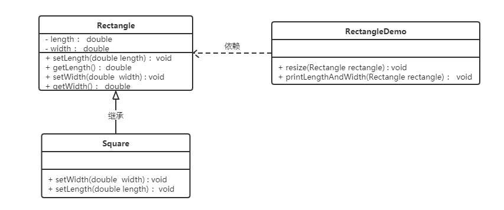

<h1 style="color:skyblue;text-align:center">java设计模式学习笔记</h1>


---


# 概述

## 软件设计模式的概念

软件设计模式（Software Design Pattern），又称设计模式，是一套被反复使用、多数人知晓的、经过分类编目的、代码设计经验的总结。它描述了在软件设计过程中的一些不断重复发生的问题，以及该问题的解决方案。也就是说，它是解决特定问题的一系列套路，是前辈们的代码设计经验的总结，具有一定的普遍性，可以反复使用。


## 学习设计模式的必要性

设计模式的本质是面向对象设计原则的实际运用，是对类的封装性、继承性和多态性以及类的关联关系和组合关系的充分理解。

正确使用设计模式具有以下优点。

- 可以提高程序员的思维能力、编程能力和设计能力。
- 使程序设计更加标准化、代码编制更加工程化，使软件开发效率大大提高，从而缩短软件的开发周期。
- 使设计的代码可重用性高、可读性强、可靠性高、灵活性好、可维护性强。


## 分类

* **创建型模式**

  * 用于描述“怎样创建对象”，它的主要特点是“将对象的创建与使用分离”。GoF（四人组）书中提供了单例、原型、工厂方法、抽象工厂、建造者等 5 种创建型模式。
* **结构型模式**

  * 用于描述如何将类或对象按某种布局组成更大的结构，GoF（四人组）书中提供了代理、适配器、桥接、装饰、外观、享元、组合等 7 种结构型模式。
* **行为型模式**

  * 用于描述类或对象之间怎样相互协作共同完成单个对象无法单独完成的任务，以及怎样分配职责。GoF（四人组）书中提供了模板方法、策略、命令、职责链、状态、观察者、中介者、迭代器、访问者、备忘录、解释器等 11 种行为型模式。


# UML图

统一建模语言（Unified Modeling Language，UML）是用来设计软件的可视化建模语言。它的特点是简单、统一、图形化、能表达软件设计中的动态与静态信息。

UML 从目标系统的不同角度出发，定义了用例图、类图、对象图、状态图、活动图、时序图、协作图、构件图、部署图等 9 种图。


## 概述

类图(Class diagram)是显示了模型的静态结构，特别是模型中存在的类、类的内部结构以及它们与其他类的关系等。类图不显示暂时性的信息。类图是面向对象建模的主要组成部分。


## 作用

* 在软件工程中，类图是一种静态的结构图，描述了系统的类的集合，类的属性和类之间的关系，可以简化了人们对系统的理解；
* 类图是系统分析和设计阶段的重要产物，是系统编码和测试的重要模型。


## 类的表示方式


在UML类图中，类使用包含类名、属性(field) 和方法(method) 且带有分割线的矩形来表示，比如下图表示一个Employee类，它包含name,age和address这3个属性，以及work()方法。 


属性/方法名称前加的加号和减号表示了这个属性/方法的可见性，UML类图中表示可见性的符号有三种：

* +：表示public

* -：表示private

* #：表示protected

属性的完整表示方式是： **可见性  名称 ：类型 [ = 缺省值]**  

方法的完整表示方式是： **可见性  名称(参数列表) [ ： 返回类型]**


## 类与类之间关系的表示方式


### 关联关系

关联关系是对象之间的一种引用关系，用于表示一类对象与另一类对象之间的联系，如老师和学生、师傅和徒弟、丈夫和妻子等。关联关系是类与类之间最常用的一种关系，分为一般关联关系、聚合关系和组合关系。

关联又可以分为单向关联，双向关联，自关联


#### 单向关联

在UML类图中单向关联用一个带箭头的实线表示。


#### 双向关联

双向关联就是双方各自持有对方类型的成员变量

在UML类图中，双向关联用一个不带箭头的直线表示。

在Customer类中维护一个List\<Product>，表示一个顾客可以购买多个商品；在Product类中维护一个Customer类型的成员变量表示这个产品被哪个顾客所购买


#### 自关联

自关联在UML类图中用一个带有箭头且指向自身的线表示。


### 聚合关系

聚合关系是关联关系的一种，是强关联关系，是整体和部分之间的关系。

聚合关系也是通过成员对象来实现的，其中成员对象是整体对象的一部分，但是成员对象可以脱离整体对象而独立存在。例如，学校与老师的关系，学校包含老师，但如果学校停办了，老师依然存在。


### 组合关系

组合表示类之间的整体与部分的关系，但它是一种更强烈的聚合关系。

在组合关系中，整体对象可以控制部分对象的生命周期，一旦整体对象不存在，部分对象也将不存在，部分对象不能脱离整体对象而存在。例如，头和嘴的关系，没有了头，嘴也就不存在了。

在 UML 类图中，组合关系用带实心菱形的实线来表示，菱形指向整体。


### 依赖关系

依赖关系是一种使用关系，它是对象之间耦合度最弱的一种关联方式，是临时性的关联。在代码中，某个类的方法通过局部变量、方法的参数或者对静态方法的调用来访问另一个类（被依赖类）中的某些方法来完成一些职责。

在 UML 类图中，依赖关系使用带箭头的虚线来表示，箭头从使用类指向被依赖的类。


### 继承关系

继承关系是对象之间耦合度最大的一种关系，表示一般与特殊的关系，是父类与子类之间的关系，是一种继承关系。

在 UML 类图中，泛化关系用带空心三角箭头的实线来表示，箭头从子类指向父类。在代码实现时，使用面向对象的继承机制来实现泛化关系。


### 实现关系

实现关系是接口与实现类之间的关系。在这种关系中，类实现了接口，类中的操作实现了接口中所声明的所有的抽象操作。

在 UML 类图中，实现关系使用带空心三角箭头的虚线来表示，箭头从实现类指向接口。


# 软件设计原则

在软件开发中，为了提高软件系统的可维护性和可复用性，增加软件的可扩展性和灵活性，程序员要尽量根据6条原则来开发程序，从而提高软件开发效率、节约软件开发成本和维护成本。


## 开闭原则

### 概念

**对扩展开放，对修改关闭**。在程序需要进行拓展的时候，不能去修改原有的代码，实现一个热插拔的效果。简言之，是为了使程序的扩展性好，易于维护和升级。

想要达到这样的效果，我们需要使用接口和抽象类。

因为抽象灵活性好，适应性广，只要抽象的合理，可以基本保持软件架构的稳定。而软件中易变的细节可以从抽象派生来的实现类来进行扩展，当软件需要发生变化时，只需要根据需求重新派生一个实现类来扩展就可以了。


### 示例

示例：搜狗输入法的皮肤设计


搜狗输入法的皮肤是输入法背景图片、窗口颜色和声音等元素的组合。用户可以根据自己的喜爱更换自己的输入法的皮肤，也可以从网上下载新的皮肤。这些皮肤有共同的特点，可以为其定义一个抽象类（AbstractSkin），而每个具体的皮肤是其子类。用户窗体可以根据需要选择或者增加新的主题，而不需要修改原代码，所以它是满足开闭原则的。


```java
package mao;

/**
 * Project name(项目名称)：java设计模式_开闭原则
 * Package(包名): mao
 * Class(类名): AbstractSkin
 * Author(作者）: mao
 * Author QQ：1296193245
 * GitHub：https://github.com/maomao124/
 * Date(创建日期)： 2022/8/9
 * Time(创建时间)： 20:27
 * Version(版本): 1.0
 * Description(描述)： 无
 */

public abstract class AbstractSkin
{
    public abstract void display();
}
```


```java
package mao;

/**
 * Project name(项目名称)：java设计模式_开闭原则
 * Package(包名): mao
 * Class(类名): SouGouInput
 * Author(作者）: mao
 * Author QQ：1296193245
 * GitHub：https://github.com/maomao124/
 * Date(创建日期)： 2022/8/9
 * Time(创建时间)： 20:28
 * Version(版本): 1.0
 * Description(描述)： 无
 */


public class SouGouInput
{
    private AbstractSkin skin;

    /**
     * Instantiates a new Sou gou input.
     *
     * @param skin the skin
     */
    public SouGouInput(AbstractSkin skin)
    {
        this.skin = skin;
    }

    /**
     * Gets skin.
     *
     * @return the skin
     */
    public AbstractSkin getSkin()
    {
        return skin;
    }

    /**
     * Sets skin.
     *
     * @param skin the skin
     */
    public void setSkin(AbstractSkin skin)
    {
        this.skin = skin;
    }

    /**
     * Display.
     */
    public void display()
    {
        skin.display();
    }
}
```


```java
package mao;

/**
 * Project name(项目名称)：java设计模式_开闭原则
 * Package(包名): mao
 * Class(类名): DefaultSkin
 * Author(作者）: mao
 * Author QQ：1296193245
 * GitHub：https://github.com/maomao124/
 * Date(创建日期)： 2022/8/9
 * Time(创建时间)： 20:35
 * Version(版本): 1.0
 * Description(描述)： 无
 */

public class DefaultSkin extends AbstractSkin
{

    @Override
    public void display()
    {
        System.out.println("默认皮肤");
    }
}
```


```java
package mao;

/**
 * Project name(项目名称)：java设计模式_开闭原则
 * Package(包名): mao
 * Class(类名): Skin1
 * Author(作者）: mao
 * Author QQ：1296193245
 * GitHub：https://github.com/maomao124/
 * Date(创建日期)： 2022/8/9
 * Time(创建时间)： 20:36
 * Version(版本): 1.0
 * Description(描述)： 无
 */

public class Skin1 extends AbstractSkin
{

    @Override
    public void display()
    {
        System.out.println("皮肤1");
    }
}
```


```java
package mao;

/**
 * Project name(项目名称)：java设计模式_开闭原则
 * Package(包名): mao
 * Class(类名): Skin2
 * Author(作者）: mao
 * Author QQ：1296193245
 * GitHub：https://github.com/maomao124/
 * Date(创建日期)： 2022/8/9
 * Time(创建时间)： 20:37
 * Version(版本): 1.0
 * Description(描述)： 无
 */

public class Skin2 extends AbstractSkin
{

    @Override
    public void display()
    {
        System.out.println("皮肤2");
    }
}
```


```java
package mao;

/**
 * Project name(项目名称)：java设计模式_开闭原则
 * Package(包名): mao
 * Class(类名): Test
 * Author(作者）: mao
 * Author QQ：1296193245
 * GitHub：https://github.com/maomao124/
 * Date(创建日期)： 2022/8/9
 * Time(创建时间)： 20:37
 * Version(版本): 1.0
 * Description(描述)： 无
 */

public class Test
{
    public static void main(String[] args)
    {
        SouGouInput souGouInput = new SouGouInput(new DefaultSkin());
        souGouInput.display();
        souGouInput = new SouGouInput(new Skin1());
        souGouInput.display();
        souGouInput = new SouGouInput(new Skin2());
        souGouInput.display();
    }
}
```


添加皮肤


```java
package mao.add;

import mao.AbstractSkin;

/**
 * Project name(项目名称)：java设计模式_开闭原则
 * Package(包名): mao.add
 * Class(类名): Skin3
 * Author(作者）: mao
 * Author QQ：1296193245
 * GitHub：https://github.com/maomao124/
 * Date(创建日期)： 2022/8/9
 * Time(创建时间)： 20:42
 * Version(版本): 1.0
 * Description(描述)： 无
 */

public class Skin3 extends AbstractSkin
{

    @Override
    public void display()
    {
        System.out.println("添加皮肤3，没有对原来代码进行修改");
    }
}
```


```java
package mao.add;

import mao.SouGouInput;

/**
 * Project name(项目名称)：java设计模式_开闭原则
 * Package(包名): mao.add
 * Class(类名): Test
 * Author(作者）: mao
 * Author QQ：1296193245
 * GitHub：https://github.com/maomao124/
 * Date(创建日期)： 2022/8/9
 * Time(创建时间)： 20:42
 * Version(版本): 1.0
 * Description(描述)： 无
 */

public class Test
{
    public static void main(String[] args)
    {
        SouGouInput souGouInput = new SouGouInput(new Skin3());
        souGouInput.display();
    }
}
```


## 里氏代换原则

### 概念

里氏代换原则是面向对象设计的基本原则之一。

里氏代换原则：任何基类可以出现的地方，子类一定可以出现。通俗理解：子类可以扩展父类的功能，但不能改变父类原有的功能。换句话说，子类继承父类时，除添加新的方法完成新增功能外，尽量不要重写父类的方法。

如果通过重写父类的方法来完成新的功能，这样写起来虽然简单，但是整个继承体系的可复用性会比较差，特别是运用多态比较频繁时，程序运行出错的概率会非常大。


### 示例

示例：正方形不是长方形

在数学领域里，正方形毫无疑问是长方形，它是一个长宽相等的长方形。所以，我们开发的一个与几何图形相关的软件系统，就可以顺理成章的让正方形继承自长方形。





```java
package mao.before;

/**
 * Project name(项目名称)：java设计模式_里氏代换原则
 * Package(包名): mao.before
 * Class(类名): Rectangle
 * Author(作者）: mao
 * Author QQ：1296193245
 * GitHub：https://github.com/maomao124/
 * Date(创建日期)： 2022/8/9
 * Time(创建时间)： 20:57
 * Version(版本): 1.0
 * Description(描述)： 无
 */
public class Rectangle
{
    private double length;
    private double width;

    /**
     * Instantiates a new Rectangle.
     *
     * @param length the length
     * @param width  the width
     */
    public Rectangle(double length, double width)
    {
        this.length = length;
        this.width = width;
    }

    /**
     * Instantiates a new Rectangle.
     */
    public Rectangle()
    {

    }

    /**
     * Gets length.
     *
     * @return the length
     */
    public double getLength()
    {
        return length;
    }

    /**
     * Sets length.
     *
     * @param length the length
     */
    public void setLength(double length)
    {
        this.length = length;
    }

    /**
     * Gets width.
     *
     * @return the width
     */
    public double getWidth()
    {
        return width;
    }

    /**
     * Sets width.
     *
     * @param width the width
     */
    public void setWidth(double width)
    {
        this.width = width;
    }


}
```


由于正方形的长和宽相同，所以在方法setLength和setWidth中，对长度和宽度都需要赋相同值。


```java
package mao.before;

/**
 * Project name(项目名称)：java设计模式_里氏代换原则
 * Package(包名): mao.before
 * Class(类名): Square
 * Author(作者）: mao
 * Author QQ：1296193245
 * GitHub：https://github.com/maomao124/
 * Date(创建日期)： 2022/8/9
 * Time(创建时间)： 20:57
 * Version(版本): 1.0
 * Description(描述)： 无
 */

public class Square extends Rectangle
{
    @Override
    public void setWidth(double width)
    {
        super.setLength(width);
        super.setWidth(width);
    }

    @Override
    public void setLength(double length)
    {
        super.setLength(length);
        super.setWidth(length);
    }
}
```


类RectangleDemo是我们的软件系统中的一个组件，它有一个resize方法依赖基类Rectangle，resize方法是RectandleDemo类中的一个方法，用来实现宽度逐渐增长的效果。


```java
package mao.before;

/**
 * Project name(项目名称)：java设计模式_里氏代换原则
 * Package(包名): mao.before
 * Class(类名): RectangleDemo
 * Author(作者）: mao
 * Author QQ：1296193245
 * GitHub：https://github.com/maomao124/
 * Date(创建日期)： 2022/8/9
 * Time(创建时间)： 21:00
 * Version(版本): 1.0
 * Description(描述)： 类RectangleDemo是我们的软件系统中的一个组件，它有一个resize方法依赖基类Rectangle，resize方法是RectangleDemo类中的一个方法，用来实现宽度逐渐增长的效果。
 */

public class RectangleDemo
{
    /**
     * 拓宽，直到宽度比长度还大，正方形会死循环
     *
     * @param rectangle Rectangle对象
     */
    public static void resize(Rectangle rectangle)
    {
        while (rectangle.getWidth() <= rectangle.getLength())
        {
            rectangle.setWidth(rectangle.getWidth() + 1);
        }
    }

    /**
     * 打印长和宽
     *
     * @param rectangle Rectangle对象
     */
    public static void printf(Rectangle rectangle)
    {
        System.out.println("长度：" + rectangle.getLength());
        System.out.println("宽度：" + rectangle.getWidth());
    }

    public static void main(String[] args)
    {
        Rectangle rectangle = new Rectangle(12, 8);
        printf(rectangle);
        resize(rectangle);
        printf(rectangle);

        //-------
        rectangle = new Square();
        rectangle.setLength(9);
        printf(rectangle);
        resize(rectangle);
        printf(rectangle);
    }
}
```


我们运行一下这段代码就会发现，假如我们把一个普通长方形作为参数传入resize方法，就会看到长方形宽度逐渐增长的效果，当宽度大于长度,代码就会停止，这种行为的结果符合我们的预期；假如我们再把一个正方形作为参数传入resize方法后，就会看到正方形的宽度和长度都在不断增长，代码会一直运行下去，直至系统产生溢出错误。所以，普通的长方形是适合这段代码的，正方形不适合。
我们得出结论：在resize方法中，Rectangle类型的参数是不能被Square类型的参数所代替，如果进行了替换就得不到预期结果。因此，Square类和Rectangle类之间的继承关系违反了里氏代换原则，它们之间的继承关系不成立，正方形不是长方形。


**改进：**

抽象出来一个四边形接口(Quadrilateral)，让Rectangle类和Square类实现Quadrilateral接口


```java
package mao.after;

/**
 * Project name(项目名称)：java设计模式_里氏代换原则
 * Package(包名): mao.after
 * Interface(接口名): Quadrilateral
 * Author(作者）: mao
 * Author QQ：1296193245
 * GitHub：https://github.com/maomao124/
 * Date(创建日期)： 2022/8/9
 * Time(创建时间)： 21:13
 * Version(版本): 1.0
 * Description(描述)： 四边形接口
 */

public interface Quadrilateral
{
    /**
     * Gets length.
     *
     * @return the length
     */
    double getLength();

    /**
     * Gets width.
     *
     * @return the width
     */
    double getWidth();
}
```


```java
package mao.after;

/**
 * Project name(项目名称)：java设计模式_里氏代换原则
 * Package(包名): mao.after
 * Class(类名): Rectangle
 * Author(作者）: mao
 * Author QQ：1296193245
 * GitHub：https://github.com/maomao124/
 * Date(创建日期)： 2022/8/9
 * Time(创建时间)： 21:15
 * Version(版本): 1.0
 * Description(描述)： 无
 */

public class Rectangle implements Quadrilateral
{

    private double length;
    private double width;

    /**
     * Instantiates a new Rectangle.
     */
    public Rectangle()
    {

    }

    /**
     * Instantiates a new Rectangle.
     *
     * @param length the length
     * @param width  the width
     */
    public Rectangle(double length, double width)
    {
        this.length = length;
        this.width = width;
    }

    @Override
    public double getLength()
    {
        return length;
    }

    /**
     * Sets length.
     *
     * @param length the length
     */
    public void setLength(double length)
    {
        this.length = length;
    }

    @Override
    public double getWidth()
    {
        return width;
    }

    /**
     * Sets width.
     *
     * @param width the width
     */
    public void setWidth(double width)
    {
        this.width = width;
    }
}
```


```java
package mao.after;

/**
 * Project name(项目名称)：java设计模式_里氏代换原则
 * Package(包名): mao.after
 * Class(类名): Square
 * Author(作者）: mao
 * Author QQ：1296193245
 * GitHub：https://github.com/maomao124/
 * Date(创建日期)： 2022/8/9
 * Time(创建时间)： 21:16
 * Version(版本): 1.0
 * Description(描述)： 无
 */


public class Square implements Quadrilateral
{
    private double side;

    /**
     * Instantiates a new Square.
     */
    public Square()
    {

    }

    /**
     * Instantiates a new Square.
     *
     * @param side the side
     */
    public Square(double side)
    {
        this.side = side;
    }

    /**
     * Sets side.
     *
     * @param side the side
     */
    public void setSide(double side)
    {
        this.side = side;
    }

    @Override
    public double getLength()
    {
        return side;
    }

    @Override
    public double getWidth()
    {
        return side;
    }
}
```


```java
package mao.after;


/**
 * Project name(项目名称)：java设计模式_里氏代换原则
 * Package(包名): mao.after
 * Class(类名): RectangleDemo
 * Author(作者）: mao
 * Author QQ：1296193245
 * GitHub：https://github.com/maomao124/
 * Date(创建日期)： 2022/8/9
 * Time(创建时间)： 21:18
 * Version(版本): 1.0
 * Description(描述)： 无
 */

public class RectangleDemo
{
    /**
     * 拓宽，直到宽度比长度还大，正方形会死循环
     *
     * @param rectangle Rectangle对象
     */
    public static void resize(Rectangle rectangle)
    {
        while (rectangle.getWidth() <= rectangle.getLength())
        {
            rectangle.setWidth(rectangle.getWidth() + 1);
        }
    }

    /**
     * 打印长和宽
     *
     * @param quadrilateral Quadrilateral实现类对象
     */
    public static void printf(Quadrilateral quadrilateral)
    {
        System.out.println("长度：" + quadrilateral.getLength());
        System.out.println("宽度：" + quadrilateral.getWidth());
    }


    public static void main(String[] args)
    {
        Rectangle rectangle = new Rectangle(9, 3);
        printf(rectangle);
        resize(rectangle);
        printf(rectangle);

        //----

        Square square = new Square();
        square.setSide(13);
        printf(square);
        //因为无法使用resize(square)，解决了此问题
        //resize(square);
    }
}
```


## 依赖倒转原则

### 概念

高层模块不应该依赖低层模块，两者都应该依赖其抽象；抽象不应该依赖细节，细节应该依赖抽象。简单的说就是要求对抽象进行编程，不要对实现进行编程，这样就降低了客户与实现模块间的耦合。


### 示例

示例：组装电脑


现要组装一台电脑，需要配件cpu，硬盘，内存条。只有这些配置都有了，计算机才能正常的运行。选择cpu有很多选择，如Intel，AMD等，硬盘可以选择希捷，西数等，内存条可以选择金士顿，海盗船等。


代码如下


```java
package mao.before;

/**
 * Project name(项目名称)：java设计模式_依赖倒转原则
 * Package(包名): mao.before
 * Class(类名): IntelCpu
 * Author(作者）: mao
 * Author QQ：1296193245
 * GitHub：https://github.com/maomao124/
 * Date(创建日期)： 2022/8/9
 * Time(创建时间)： 21:45
 * Version(版本): 1.0
 * Description(描述)： 无
 */

public class IntelCpu
{
    public void run()
    {
        System.out.println("使用Intel处理器");
    }
}
```


```java
package mao.before;

/**
 * Project name(项目名称)：java设计模式_依赖倒转原则
 * Package(包名): mao.before
 * Class(类名): KingstonMemory
 * Author(作者）: mao
 * Author QQ：1296193245
 * GitHub：https://github.com/maomao124/
 * Date(创建日期)： 2022/8/9
 * Time(创建时间)： 21:45
 * Version(版本): 1.0
 * Description(描述)： 无
 */

public class KingstonMemory
{
    public void save()
    {
        System.out.println("使用金士顿作为内存条");
    }
}
```


```java
package mao.before;

/**
 * Project name(项目名称)：java设计模式_依赖倒转原则
 * Package(包名): mao.before
 * Class(类名): XiJieHardDisk
 * Author(作者）: mao
 * Author QQ：1296193245
 * GitHub：https://github.com/maomao124/
 * Date(创建日期)： 2022/8/9
 * Time(创建时间)： 21:44
 * Version(版本): 1.0
 * Description(描述)： 无
 */

public class XiJieHardDisk
{
    public void save(String data)
    {
        System.out.println("使用希捷硬盘存储数据" + data);
    }

    public String get()
    {
        System.out.println("使用希捷希捷硬盘取数据");
        return "数据";
    }
}
```


```java
package mao.before;

/**
 * Project name(项目名称)：java设计模式_依赖倒转原则
 * Package(包名): mao.before
 * Class(类名): Computer
 * Author(作者）: mao
 * Author QQ：1296193245
 * GitHub：https://github.com/maomao124/
 * Date(创建日期)： 2022/8/9
 * Time(创建时间)： 21:46
 * Version(版本): 1.0
 * Description(描述)： 无
 */


public class Computer
{
    private IntelCpu intelCpu;
    private KingstonMemory kingstonMemory;
    private XiJieHardDisk xiJieHardDisk;

    /**
     * Instantiates a new Computer.
     */
    public Computer()
    {

    }

    /**
     * Instantiates a new Computer.
     *
     * @param intelCpu       the intel cpu
     * @param kingstonMemory the kingston memory
     * @param xiJieHardDisk  the xi jie hard disk
     */
    public Computer(IntelCpu intelCpu, KingstonMemory kingstonMemory, XiJieHardDisk xiJieHardDisk)
    {
        this.intelCpu = intelCpu;
        this.kingstonMemory = kingstonMemory;
        this.xiJieHardDisk = xiJieHardDisk;
    }

    /**
     * Gets intel cpu.
     *
     * @return the intel cpu
     */
    public IntelCpu getIntelCpu()
    {
        return intelCpu;
    }

    /**
     * Sets intel cpu.
     *
     * @param intelCpu the intel cpu
     */
    public void setIntelCpu(IntelCpu intelCpu)
    {
        this.intelCpu = intelCpu;
    }

    /**
     * Gets kingston memory.
     *
     * @return the kingston memory
     */
    public KingstonMemory getKingstonMemory()
    {
        return kingstonMemory;
    }

    /**
     * Sets kingston memory.
     *
     * @param kingstonMemory the kingston memory
     */
    public void setKingstonMemory(KingstonMemory kingstonMemory)
    {
        this.kingstonMemory = kingstonMemory;
    }

    /**
     * Gets xi jie hard disk.
     *
     * @return the xi jie hard disk
     */
    public XiJieHardDisk getXiJieHardDisk()
    {
        return xiJieHardDisk;
    }

    /**
     * Sets xi jie hard disk.
     *
     * @param xiJieHardDisk the xi jie hard disk
     */
    public void setXiJieHardDisk(XiJieHardDisk xiJieHardDisk)
    {
        this.xiJieHardDisk = xiJieHardDisk;
    }

    /**
     * Run.
     */
    public void run()
    {
        System.out.println("计算机工作");
        intelCpu.run();
        kingstonMemory.save();
        String data = xiJieHardDisk.get();
        System.out.println("从硬盘中获取的数据为：" + data);
    }
}

```


```java
package mao.before;

/**
 * Project name(项目名称)：java设计模式_依赖倒转原则
 * Package(包名): mao.before
 * Class(类名): Test
 * Author(作者）: mao
 * Author QQ：1296193245
 * GitHub：https://github.com/maomao124/
 * Date(创建日期)： 2022/8/9
 * Time(创建时间)： 21:49
 * Version(版本): 1.0
 * Description(描述)： 无
 */

public class Test
{
    public static void main(String[] args)
    {
        IntelCpu intelCpu = new IntelCpu();
        XiJieHardDisk xiJieHardDisk = new XiJieHardDisk();
        KingstonMemory kingstonMemory = new KingstonMemory();

        Computer computer = new Computer();
        computer.setIntelCpu(intelCpu);
        computer.setKingstonMemory(kingstonMemory);
        computer.setXiJieHardDisk(xiJieHardDisk);

        computer.run();
    }
}
```


上面代码可以看到已经组装了一台电脑，但是似乎组装的电脑的cpu只能是Intel的，内存条只能是金士顿的，硬盘只能是希捷的，这对用户肯定是不友好的，用户有了机箱肯定是想按照自己的喜好，选择自己喜欢的配件。

如果想要装AMD的CPU，那必须更改源码，也不满足开闭原则


**改进：**


Computer类，让Computer类依赖抽象（各个配件的接口），而不是依赖于各个组件具体的实现类


```java
package mao.after;

/**
 * Project name(项目名称)：java设计模式_依赖倒转原则
 * Package(包名): mao.after
 * Interface(接口名): Cpu
 * Author(作者）: mao
 * Author QQ：1296193245
 * GitHub：https://github.com/maomao124/
 * Date(创建日期)： 2022/8/9
 * Time(创建时间)： 21:56
 * Version(版本): 1.0
 * Description(描述)： 无
 */

public interface Cpu
{
    /**
     * Run.
     */
    void run();
}
```


```java
package mao.after;

/**
 * Project name(项目名称)：java设计模式_依赖倒转原则
 * Package(包名): mao.after
 * Interface(接口名): HardDisk
 * Author(作者）: mao
 * Author QQ：1296193245
 * GitHub：https://github.com/maomao124/
 * Date(创建日期)： 2022/8/9
 * Time(创建时间)： 21:57
 * Version(版本): 1.0
 * Description(描述)： 无
 */

public interface HardDisk
{
    /**
     * Save.
     *
     * @param data the data
     */
    void save(String data);

    /**
     * Get string.
     *
     * @return the string
     */
    String get();
}
```


```java
package mao.after;

/**
 * Project name(项目名称)：java设计模式_依赖倒转原则
 * Package(包名): mao.after
 * Interface(接口名): Memory
 * Author(作者）: mao
 * Author QQ：1296193245
 * GitHub：https://github.com/maomao124/
 * Date(创建日期)： 2022/8/9
 * Time(创建时间)： 21:57
 * Version(版本): 1.0
 * Description(描述)： 无
 */

public interface Memory
{
    /**
     * Save.
     */
    void save();
}
```


```java
package mao.after;

/**
 * Project name(项目名称)：java设计模式_依赖倒转原则
 * Package(包名): mao.after
 * Class(类名): IntelCpu
 * Author(作者）: mao
 * Author QQ：1296193245
 * GitHub：https://github.com/maomao124/
 * Date(创建日期)： 2022/8/9
 * Time(创建时间)： 22:01
 * Version(版本): 1.0
 * Description(描述)： 无
 */

public class IntelCpu implements Cpu
{

    @Override
    public void run()
    {
        System.out.println("使用Intel处理器");
    }
}
```


```java
package mao.after;

/**
 * Project name(项目名称)：java设计模式_依赖倒转原则
 * Package(包名): mao.after
 * Class(类名): KingstonMemory
 * Author(作者）: mao
 * Author QQ：1296193245
 * GitHub：https://github.com/maomao124/
 * Date(创建日期)： 2022/8/9
 * Time(创建时间)： 22:01
 * Version(版本): 1.0
 * Description(描述)： 无
 */

public class KingstonMemory implements Memory
{

    @Override
    public void save()
    {
        System.out.println("使用金士顿作为内存条");
    }
}
```


```java
package mao.after;

/**
 * Project name(项目名称)：java设计模式_依赖倒转原则
 * Package(包名): mao.after
 * Class(类名): XiJieHardDisk
 * Author(作者）: mao
 * Author QQ：1296193245
 * GitHub：https://github.com/maomao124/
 * Date(创建日期)： 2022/8/9
 * Time(创建时间)： 22:02
 * Version(版本): 1.0
 * Description(描述)： 无
 */

public class XiJieHardDisk implements HardDisk
{

    @Override
    public void save(String data)
    {
        System.out.println("使用希捷硬盘存储数据" + data);
    }

    @Override
    public String get()
    {
        System.out.println("使用希捷希捷硬盘取数据");
        return "数据";
    }
}
```


```java
package mao.after;

/**
 * Project name(项目名称)：java设计模式_依赖倒转原则
 * Package(包名): mao.after
 * Class(类名): Computer
 * Author(作者）: mao
 * Author QQ：1296193245
 * GitHub：https://github.com/maomao124/
 * Date(创建日期)： 2022/8/9
 * Time(创建时间)： 22:02
 * Version(版本): 1.0
 * Description(描述)： 无
 */


public class Computer
{
    private Cpu cpu;
    private HardDisk hardDisk;
    private Memory memory;

    /**
     * Instantiates a new Computer.
     */
    public Computer()
    {

    }

    /**
     * Instantiates a new Computer.
     *
     * @param cpu      the cpu
     * @param hardDisk the hard disk
     * @param memory   the memory
     */
    public Computer(Cpu cpu, HardDisk hardDisk, Memory memory)
    {
        this.cpu = cpu;
        this.hardDisk = hardDisk;
        this.memory = memory;
    }

    /**
     * Gets cpu.
     *
     * @return the cpu
     */
    public Cpu getCpu()
    {
        return cpu;
    }

    /**
     * Sets cpu.
     *
     * @param cpu the cpu
     */
    public void setCpu(Cpu cpu)
    {
        this.cpu = cpu;
    }

    /**
     * Gets hard disk.
     *
     * @return the hard disk
     */
    public HardDisk getHardDisk()
    {
        return hardDisk;
    }

    /**
     * Sets hard disk.
     *
     * @param hardDisk the hard disk
     */
    public void setHardDisk(HardDisk hardDisk)
    {
        this.hardDisk = hardDisk;
    }

    /**
     * Gets memory.
     *
     * @return the memory
     */
    public Memory getMemory()
    {
        return memory;
    }

    /**
     * Sets memory.
     *
     * @param memory the memory
     */
    public void setMemory(Memory memory)
    {
        this.memory = memory;
    }

    /**
     * Run.
     */
    public void run()
    {
        System.out.println("计算机工作");
        cpu.run();
        memory.save();
        String data = hardDisk.get();
        System.out.println("从硬盘中获取的数据为：" + data);
    }
}
```


```java
package mao.after;


/**
 * Project name(项目名称)：java设计模式_依赖倒转原则
 * Package(包名): mao.after
 * Class(类名): Test
 * Author(作者）: mao
 * Author QQ：1296193245
 * GitHub：https://github.com/maomao124/
 * Date(创建日期)： 2022/8/9
 * Time(创建时间)： 22:04
 * Version(版本): 1.0
 * Description(描述)： 无
 */

public class Test
{
    public static void main(String[] args)
    {
        Cpu cpu = new IntelCpu();
        HardDisk hardDisk = new XiJieHardDisk();
        Memory memory = new KingstonMemory();

        Computer computer = new Computer();
        computer.setCpu(cpu);
        computer.setHardDisk(hardDisk);
        computer.setMemory(memory);

        computer.run();
    }
}
```


面向对象的开发很好的解决了这个问题，一般情况下抽象的变化概率很小，让用户程序依赖于抽象，实现的细节也依赖于抽象。即使实现细节不断变动，只要抽象不变，客户程序就不需要变化。这大大降低了客户程序与实现细节的耦合度。


当需要使用AMD更改配件时，比如使用AMD处理器，实现CPU接口


```java
package mao.after;

/**
 * Project name(项目名称)：java设计模式_依赖倒转原则
 * Package(包名): mao.after
 * Class(类名): AMDCpu
 * Author(作者）: mao
 * Author QQ：1296193245
 * GitHub：https://github.com/maomao124/
 * Date(创建日期)： 2022/8/9
 * Time(创建时间)： 22:09
 * Version(版本): 1.0
 * Description(描述)： 无
 */

public class AMDCpu implements Cpu
{

    @Override
    public void run()
    {
        System.out.println("使用AMD处理器");
    }
}
```


```java
package mao.after;

/**
 * Project name(项目名称)：java设计模式_依赖倒转原则
 * Package(包名): mao.after
 * Class(类名): CorsairMemory
 * Author(作者）: mao
 * Author QQ：1296193245
 * GitHub：https://github.com/maomao124/
 * Date(创建日期)： 2022/8/9
 * Time(创建时间)： 22:12
 * Version(版本): 1.0
 * Description(描述)： 无
 */

public class CorsairMemory implements Memory
{

    @Override
    public void save()
    {
        System.out.println("使用海盗船作为内存条");
    }
}
```


```java
package mao.after;

/**
 * Project name(项目名称)：java设计模式_依赖倒转原则
 * Package(包名): mao.after
 * Class(类名): Test2
 * Author(作者）: mao
 * Author QQ：1296193245
 * GitHub：https://github.com/maomao124/
 * Date(创建日期)： 2022/8/9
 * Time(创建时间)： 22:14
 * Version(版本): 1.0
 * Description(描述)： 无
 */

public class Test2
{
    public static void main(String[] args)
    {
        Cpu cpu = new AMDCpu();
        HardDisk hardDisk = new XiJieHardDisk();
        Memory memory = new CorsairMemory();

        Computer computer = new Computer();
        computer.setCpu(cpu);
        computer.setHardDisk(hardDisk);
        computer.setMemory(memory);

        computer.run();
    }
}
```


## 接口隔离原则

### 概念

客户端不应该被迫依赖于它不使用的方法；一个类对另一个类的依赖应该建立在最小的接口上


### 示例

接口有三个方法

```java
package mao.before;

/**
 * Project name(项目名称)：java设计模式_接口隔离原则
 * Package(包名): mao.before
 * Interface(接口名): Interface_s
 * Author(作者）: mao
 * Author QQ：1296193245
 * GitHub：https://github.com/maomao124/
 * Date(创建日期)： 2022/8/10
 * Time(创建时间)： 21:33
 * Version(版本): 1.0
 * Description(描述)： 接口
 */

public interface Interface_s
{
    void a();

    void b();

    void c();
}
```


实现类Impl1需要重写三个方法，没问题

```java
package mao.before;

/**
 * Project name(项目名称)：java设计模式_接口隔离原则
 * Package(包名): mao.before
 * Class(类名): Impl1
 * Author(作者）: mao
 * Author QQ：1296193245
 * GitHub：https://github.com/maomao124/
 * Date(创建日期)： 2022/8/10
 * Time(创建时间)： 21:34
 * Version(版本): 1.0
 * Description(描述)： Impl1类，需要实现Interface_s接口的三个方法
 */

public class Impl1 implements Interface_s
{

    @Override
    public void a()
    {
        System.out.println("Impl1重写方法a");
    }

    @Override
    public void b()
    {
        System.out.println("Impl1重写方法b");
    }

    @Override
    public void c()
    {
        System.out.println("Impl1重写方法c");
    }
}
```


现在实现类Impl2只需要重写两个方法，第三个方法不需要重写，有问题，实现的接口必须重写全部方法


```java
package mao.before;

/**
 * Project name(项目名称)：java设计模式_接口隔离原则
 * Package(包名): mao.before
 * Class(类名): Impl2
 * Author(作者）: mao
 * Author QQ：1296193245
 * GitHub：https://github.com/maomao124/
 * Date(创建日期)： 2022/8/10
 * Time(创建时间)： 21:36
 * Version(版本): 1.0
 * Description(描述)： Impl2类，需求：只需要实现a和b方法，c方法不需要实现，做不到
 */

public class Impl2 implements Interface_s
{

    @Override
    public void a()
    {
        System.out.println("Impl2重写方法a");
    }

    @Override
    public void b()
    {
        System.out.println("Impl2重写方法b");
    }

    @Override
    public void c()
    {
        
    }
}
```


**改进：**

一个类对另一个类的依赖应该建立在最小的接口上


```java
package mao.after;

/**
 * Project name(项目名称)：java设计模式_接口隔离原则
 * Package(包名): mao.after
 * Interface(接口名): Interface_a
 * Author(作者）: mao
 * Author QQ：1296193245
 * GitHub：https://github.com/maomao124/
 * Date(创建日期)： 2022/8/10
 * Time(创建时间)： 21:42
 * Version(版本): 1.0
 * Description(描述)： 无
 */

public interface Interface_a
{
    void a();
}
```


```java
package mao.after;

/**
 * Project name(项目名称)：java设计模式_接口隔离原则
 * Package(包名): mao.after
 * Interface(接口名): Interface_b
 * Author(作者）: mao
 * Author QQ：1296193245
 * GitHub：https://github.com/maomao124/
 * Date(创建日期)： 2022/8/10
 * Time(创建时间)： 21:43
 * Version(版本): 1.0
 * Description(描述)： 无
 */

public interface Interface_b
{
    void b();
}
```


```java
package mao.after;

/**
 * Project name(项目名称)：java设计模式_接口隔离原则
 * Package(包名): mao.after
 * Interface(接口名): Interface_c
 * Author(作者）: mao
 * Author QQ：1296193245
 * GitHub：https://github.com/maomao124/
 * Date(创建日期)： 2022/8/10
 * Time(创建时间)： 21:43
 * Version(版本): 1.0
 * Description(描述)： 无
 */

public interface Interface_c
{
    void c();
}
```


```java
package mao.after;

/**
 * Project name(项目名称)：java设计模式_接口隔离原则
 * Package(包名): mao.after
 * Class(类名): Impl1
 * Author(作者）: mao
 * Author QQ：1296193245
 * GitHub：https://github.com/maomao124/
 * Date(创建日期)： 2022/8/10
 * Time(创建时间)： 21:43
 * Version(版本): 1.0
 * Description(描述)： 无
 */

public class Impl1 implements Interface_a, Interface_b, Interface_c
{

    @Override
    public void a()
    {
        System.out.println("Impl1重写方法a");
    }

    @Override
    public void b()
    {
        System.out.println("Impl1重写方法b");
    }

    @Override
    public void c()
    {
        System.out.println("Impl1重写方法c");
    }
}
```


```java
package mao.after;

/**
 * Project name(项目名称)：java设计模式_接口隔离原则
 * Package(包名): mao.after
 * Class(类名): Impl2
 * Author(作者）: mao
 * Author QQ：1296193245
 * GitHub：https://github.com/maomao124/
 * Date(创建日期)： 2022/8/10
 * Time(创建时间)： 21:45
 * Version(版本): 1.0
 * Description(描述)： 无
 */

public class Impl2 implements Interface_a, Interface_b
{

    @Override
    public void a()
    {
        System.out.println("Impl2重写方法a");
    }

    @Override
    public void b()
    {
        System.out.println("Impl2重写方法b");
    }
}
```


## 迪米特法则

### 概念

迪米特法则又叫最少知识原则。

只和你的直接朋友交谈，不跟“陌生人”说话（Talk only to your immediate friends and not to strangers）。

其含义是：如果两个软件实体无须直接通信，那么就不应当发生直接的相互调用，可以通过第三方转发该调用。其目的是降低类之间的耦合度，提高模块的相对独立性。

迪米特法则中的“朋友”是指：当前对象本身、当前对象的成员对象、当前对象所创建的对象、当前对象的方法参数等，这些对象同当前对象存在关联、聚合或组合关系，可以直接访问这些对象的方法。


### 示例

明星与经纪人的关系实例

明星由于全身心投入艺术，所以许多日常事务由经纪人负责处理，如和粉丝的见面会，和媒体公司的业务洽淡等。这里的经纪人是明星的朋友，而粉丝和媒体公司是陌生人，所以适合使用迪米特法则。


```java
package mao;

/**
 * Project name(项目名称)：java设计模式_迪米特法则
 * Package(包名): mao
 * Class(类名): Star
 * Author(作者）: mao
 * Author QQ：1296193245
 * GitHub：https://github.com/maomao124/
 * Date(创建日期)： 2022/8/10
 * Time(创建时间)： 21:59
 * Version(版本): 1.0
 * Description(描述)： 无
 */

public class Star
{
    private String name;

    /**
     * Instantiates a new Star.
     */
    public Star()
    {
    }

    /**
     * Instantiates a new Star.
     *
     * @param name the name
     */
    public Star(String name)
    {
        this.name = name;
    }

    /**
     * Gets name.
     *
     * @return the name
     */
    public String getName()
    {
        return name;
    }

    /**
     * Sets name.
     *
     * @param name the name
     */
    public void setName(String name)
    {
        this.name = name;
    }
}
```


```java
package mao;

/**
 * Project name(项目名称)：java设计模式_迪米特法则
 * Package(包名): mao
 * Class(类名): Fans
 * Author(作者）: mao
 * Author QQ：1296193245
 * GitHub：https://github.com/maomao124/
 * Date(创建日期)： 2022/8/10
 * Time(创建时间)： 22:00
 * Version(版本): 1.0
 * Description(描述)： 无
 */


public class Fans
{
    private String name;

    /**
     * Instantiates a new Fans.
     */
    public Fans()
    {

    }

    /**
     * Instantiates a new Fans.
     *
     * @param name the name
     */
    public Fans(String name)
    {
        this.name = name;
    }

    /**
     * Gets name.
     *
     * @return the name
     */
    public String getName()
    {
        return name;
    }

    /**
     * Sets name.
     *
     * @param name the name
     */
    public void setName(String name)
    {
        this.name = name;
    }
}
```


```java
package mao;

/**
 * Project name(项目名称)：java设计模式_迪米特法则
 * Package(包名): mao
 * Class(类名): Company
 * Author(作者）: mao
 * Author QQ：1296193245
 * GitHub：https://github.com/maomao124/
 * Date(创建日期)： 2022/8/10
 * Time(创建时间)： 22:01
 * Version(版本): 1.0
 * Description(描述)： 媒体公司类
 */


public class Company
{
    private String name;

    /**
     * Instantiates a new Company.
     */
    public Company()
    {

    }

    /**
     * Instantiates a new Company.
     *
     * @param name the name
     */
    public Company(String name)
    {
        this.name = name;
    }

    /**
     * Gets name.
     *
     * @return the name
     */
    public String getName()
    {
        return name;
    }

    /**
     * Sets name.
     *
     * @param name the name
     */
    public void setName(String name)
    {
        this.name = name;
    }
}
```


```java
package mao;

/**
 * Project name(项目名称)：java设计模式_迪米特法则
 * Package(包名): mao
 * Class(类名): Agent
 * Author(作者）: mao
 * Author QQ：1296193245
 * GitHub：https://github.com/maomao124/
 * Date(创建日期)： 2022/8/10
 * Time(创建时间)： 22:02
 * Version(版本): 1.0
 * Description(描述)： 经纪人类
 */


public class Agent
{
    private Star star;
    private Fans fans;
    private Company company;

    /**
     * Instantiates a new Agent.
     */
    public Agent()
    {

    }

    /**
     * Instantiates a new Agent.
     *
     * @param star    the star
     * @param fans    the fans
     * @param company the company
     */
    public Agent(Star star, Fans fans, Company company)
    {
        this.star = star;
        this.fans = fans;
        this.company = company;
    }

    /**
     * Sets star.
     *
     * @param star the star
     */
    public void setStar(Star star)
    {
        this.star = star;
    }

    /**
     * Sets fans.
     *
     * @param fans the fans
     */
    public void setFans(Fans fans)
    {
        this.fans = fans;
    }

    /**
     * Sets company.
     *
     * @param company the company
     */
    public void setCompany(Company company)
    {
        this.company = company;
    }

    /**
     * Meeting.
     */
    public void meeting()
    {
        System.out.println(fans.getName() + "与明星" + star.getName() + "见面了");
    }

    /**
     * Business.
     */
    public void business()
    {
        System.out.println(company.getName() + "与明星" + star.getName() + "洽淡业务");
    }
}
```


```java
package mao;

/**
 * Project name(项目名称)：java设计模式_迪米特法则
 * Package(包名): mao
 * Class(类名): Test
 * Author(作者）: mao
 * Author QQ：1296193245
 * GitHub：https://github.com/maomao124/
 * Date(创建日期)： 2022/8/10
 * Time(创建时间)： 22:04
 * Version(版本): 1.0
 * Description(描述)： 无
 */

public class Test
{
    public static void main(String[] args)
    {
        Agent agent = new Agent();
        agent.setCompany(new Company("某公司"));
        agent.setFans(new Fans("粉丝李四"));
        agent.setStar(new Star("赵六"));

        agent.business();
        agent.meeting();
    }
}
```


## 合成复用原则

### 概念

合成复用原则是指：尽量先使用组合或者聚合等关联关系来实现，其次才考虑使用继承关系来实现。


通常类的复用分为继承复用和合成复用两种。


继承复用虽然有简单和易实现的优点，但它也存在以下缺点：

1. 继承复用破坏了类的封装性。因为继承会将父类的实现细节暴露给子类，父类对子类是透明的，所以这种复用又称为“白箱”复用。
2. 子类与父类的耦合度高。父类的实现的任何改变都会导致子类的实现发生变化，这不利于类的扩展与维护。
3. 它限制了复用的灵活性。从父类继承而来的实现是静态的，在编译时已经定义，所以在运行时不可能发生变化。


采用组合或聚合复用时，可以将已有对象纳入新对象中，使之成为新对象的一部分，新对象可以调用已有对象的功能，它有以下优点：

1. 它维持了类的封装性。因为成分对象的内部细节是新对象看不见的，所以这种复用又称为“黑箱”复用。
2. 对象间的耦合度低。可以在类的成员位置声明抽象。
3. 复用的灵活性高。这种复用可以在运行时动态进行，新对象可以动态地引用与成分对象类型相同的对象。


### 示例

汽车分类管理程序

汽车按“动力源”划分可分为汽油汽车、电动汽车等；按“颜色”划分可分为白色汽车、黑色汽车和红色汽车等。如果同时考虑这两种分类，其组合就很多。类图如下： 


```java
package mao.before;

/**
 * Project name(项目名称)：java设计模式_合成复用原则
 * Package(包名): mao.before
 * Class(类名): Car
 * Author(作者）: mao
 * Author QQ：1296193245
 * GitHub：https://github.com/maomao124/
 * Date(创建日期)： 2022/8/11
 * Time(创建时间)： 20:20
 * Version(版本): 1.0
 * Description(描述)： 无
 */

public class Car
{
    public void move()
    {
        System.out.println("汽车移动");
    }
}
```


```java
package mao.before;

/**
 * Project name(项目名称)：java设计模式_合成复用原则
 * Package(包名): mao.before
 * Class(类名): ElectricCar
 * Author(作者）: mao
 * Author QQ：1296193245
 * GitHub：https://github.com/maomao124/
 * Date(创建日期)： 2022/8/11
 * Time(创建时间)： 20:23
 * Version(版本): 1.0
 * Description(描述)： 无
 */

public class ElectricCar extends Car
{
    @Override
    public void move()
    {
        System.out.println("电动汽车移动");
    }
}
```


```java
package mao.before;

/**
 * Project name(项目名称)：java设计模式_合成复用原则
 * Package(包名): mao.before
 * Class(类名): PetrolCar
 * Author(作者）: mao
 * Author QQ：1296193245
 * GitHub：https://github.com/maomao124/
 * Date(创建日期)： 2022/8/11
 * Time(创建时间)： 20:21
 * Version(版本): 1.0
 * Description(描述)： 无
 */

public class PetrolCar extends Car
{
    @Override
    public void move()
    {
        System.out.println("汽油汽车移动");
    }
}
```


```java
package mao.before;

/**
 * Project name(项目名称)：java设计模式_合成复用原则
 * Package(包名): mao.before
 * Class(类名): RedElectricCar
 * Author(作者）: mao
 * Author QQ：1296193245
 * GitHub：https://github.com/maomao124/
 * Date(创建日期)： 2022/8/11
 * Time(创建时间)： 20:26
 * Version(版本): 1.0
 * Description(描述)： 无
 */

public class RedElectricCar extends ElectricCar
{
    @Override
    public void move()
    {
        System.out.println("红色电动汽车移动");
    }
}
```


```java
package mao.before;

/**
 * Project name(项目名称)：java设计模式_合成复用原则
 * Package(包名): mao.before
 * Class(类名): RedPetrolCar
 * Author(作者）: mao
 * Author QQ：1296193245
 * GitHub：https://github.com/maomao124/
 * Date(创建日期)： 2022/8/11
 * Time(创建时间)： 20:23
 * Version(版本): 1.0
 * Description(描述)： 无
 */

public class RedPetrolCar extends PetrolCar
{
    @Override
    public void move()
    {
        System.out.println("红色汽油汽车移动");
    }
}
```


```java
package mao.before;

/**
 * Project name(项目名称)：java设计模式_合成复用原则
 * Package(包名): mao.before
 * Class(类名): WhiteElectricCar
 * Author(作者）: mao
 * Author QQ：1296193245
 * GitHub：https://github.com/maomao124/
 * Date(创建日期)： 2022/8/11
 * Time(创建时间)： 20:26
 * Version(版本): 1.0
 * Description(描述)： 无
 */

public class WhiteElectricCar extends ElectricCar
{
    @Override
    public void move()
    {
        System.out.println("红色电动汽车移动");
    }
}
```


```java
package mao.before;

/**
 * Project name(项目名称)：java设计模式_合成复用原则
 * Package(包名): mao.before
 * Class(类名): WhitePetrolCar
 * Author(作者）: mao
 * Author QQ：1296193245
 * GitHub：https://github.com/maomao124/
 * Date(创建日期)： 2022/8/11
 * Time(创建时间)： 20:25
 * Version(版本): 1.0
 * Description(描述)： 无
 */

public class WhitePetrolCar extends PetrolCar
{
    @Override
    public void move()
    {
        System.out.println("白色汽油汽车移动");
    }
}
```


```java
package mao.before;

/**
 * Project name(项目名称)：java设计模式_合成复用原则
 * Package(包名): mao.before
 * Class(类名): Test
 * Author(作者）: mao
 * Author QQ：1296193245
 * GitHub：https://github.com/maomao124/
 * Date(创建日期)： 2022/8/11
 * Time(创建时间)： 20:27
 * Version(版本): 1.0
 * Description(描述)： 无
 */

public class Test
{
    public static void main(String[] args)
    {
        Car car=new RedElectricCar();
        car.move();
    }
}
```


**改进：**

我们可以看到使用继承复用产生了很多子类，如果现在又有新的动力源或者新的颜色的话，就需要再定义新的类

将继承复用改为聚合复用


```java
package mao.after;

/**
 * Project name(项目名称)：java设计模式_合成复用原则
 * Package(包名): mao.after
 * Class(类名): Car
 * Author(作者）: mao
 * Author QQ：1296193245
 * GitHub：https://github.com/maomao124/
 * Date(创建日期)： 2022/8/11
 * Time(创建时间)： 20:31
 * Version(版本): 1.0
 * Description(描述)： 无
 */


public class Car
{
    /**
     * The Color.
     */
    protected Color color;

    /**
     * Instantiates a new Car.
     *
     * @param color the color
     */
    public Car(Color color)
    {
        this.color = color;
    }

    /**
     * Gets color.
     *
     * @return the color
     */
    public Color getColor()
    {
        return color;
    }

    /**
     * Sets color.
     *
     * @param color the color
     */
    public void setColor(Color color)
    {
        this.color = color;
    }

    /**
     * Move.
     */
    public void move()
    {
        System.out.println(color.getColor() + "汽车移动");
    }
}
```


```java
package mao.after;

/**
 * Project name(项目名称)：java设计模式_合成复用原则
 * Package(包名): mao.after
 * Interface(接口名): Color
 * Author(作者）: mao
 * Author QQ：1296193245
 * GitHub：https://github.com/maomao124/
 * Date(创建日期)： 2022/8/11
 * Time(创建时间)： 20:32
 * Version(版本): 1.0
 * Description(描述)： 无
 */

public interface Color
{
    String getColor();
}
```


```java
package mao.after;

/**
 * Project name(项目名称)：java设计模式_合成复用原则
 * Package(包名): mao.after
 * Class(类名): ElectricCar
 * Author(作者）: mao
 * Author QQ：1296193245
 * GitHub：https://github.com/maomao124/
 * Date(创建日期)： 2022/8/11
 * Time(创建时间)： 20:33
 * Version(版本): 1.0
 * Description(描述)： 无
 */

public class ElectricCar extends Car
{

    public ElectricCar(Color color)
    {
        super(color);
    }

    @Override
    public void move()
    {
        System.out.println(color.getColor() + "电动汽车移动");
    }
}
```


```java
package mao.after;

/**
 * Project name(项目名称)：java设计模式_合成复用原则
 * Package(包名): mao.after
 * Class(类名): PetrolCar
 * Author(作者）: mao
 * Author QQ：1296193245
 * GitHub：https://github.com/maomao124/
 * Date(创建日期)： 2022/8/11
 * Time(创建时间)： 20:37
 * Version(版本): 1.0
 * Description(描述)： 无
 */

public class PetrolCar extends Car
{

    public PetrolCar(Color color)
    {
        super(color);
    }

    @Override
    public void move()
    {
        System.out.println(color.getColor() + "汽油汽车移动");
    }
}
```


```java
package mao.after;

/**
 * Project name(项目名称)：java设计模式_合成复用原则
 * Package(包名): mao.after
 * Class(类名): Red
 * Author(作者）: mao
 * Author QQ：1296193245
 * GitHub：https://github.com/maomao124/
 * Date(创建日期)： 2022/8/11
 * Time(创建时间)： 20:38
 * Version(版本): 1.0
 * Description(描述)： 无
 */

public class Red implements Color
{

    @Override
    public String getColor()
    {
        return "红色";
    }
}
```


```java
package mao.after;

/**
 * Project name(项目名称)：java设计模式_合成复用原则
 * Package(包名): mao.after
 * Class(类名): White
 * Author(作者）: mao
 * Author QQ：1296193245
 * GitHub：https://github.com/maomao124/
 * Date(创建日期)： 2022/8/11
 * Time(创建时间)： 20:39
 * Version(版本): 1.0
 * Description(描述)： 无
 */

public class White implements Color
{

    @Override
    public String getColor()
    {
        return "白色";
    }
}
```


```java
package mao.after;

/**
 * Project name(项目名称)：java设计模式_合成复用原则
 * Package(包名): mao.after
 * Class(类名): Test
 * Author(作者）: mao
 * Author QQ：1296193245
 * GitHub：https://github.com/maomao124/
 * Date(创建日期)： 2022/8/11
 * Time(创建时间)： 20:39
 * Version(版本): 1.0
 * Description(描述)： 无
 */

public class Test
{
    public static void main(String[] args)
    {
        Car car = new ElectricCar(new White());
        car.move();
        car = new ElectricCar(new Red());
        car.move();
        car = new PetrolCar(new Red());
        car.move();
        car = new PetrolCar(new White());
        car.move();
    }
}
```


# 创建者模式

创建型模式的主要关注点是“怎样创建对象？”，它的主要特点是“将对象的创建与使用分离”。

这样可以降低系统的耦合度，使用者不需要关注对象的创建细节。


创建型模式分为：

* 单例模式
* 工厂方法模式
* 抽象工厂模式
* 原型模式
* 建造者模式


## 单例模式

单例模式（Singleton Pattern）是 Java 中最简单的设计模式之一。这种类型的设计模式属于创建型模式，它提供了一种创建对象的最佳方式。

这种模式涉及到一个单一的类，该类负责创建自己的对象，同时确保只有单个对象被创建。这个类提供了一种访问其唯一的对象的方式，可以直接访问，不需要实例化该类的对象。


### 结构

单例模式的主要有以下角色：

* 单例类。只能创建一个实例的类
* 访问类。使用单例类


### 实现

单例设计模式分类两种：

* 饿汉式：类加载就会导致该单实例对象被创建	

* 懒汉式：类加载不会导致该单实例对象被创建，而是首次使用该对象时才会创建


#### 饿汉式-静态变量方式


```java
package mao.m1;

/**
 * Project name(项目名称)：java设计模式_单例模式
 * Package(包名): mao.m1
 * Class(类名): Singleton
 * Author(作者）: mao
 * Author QQ：1296193245
 * GitHub：https://github.com/maomao124/
 * Date(创建日期)： 2022/8/11
 * Time(创建时间)： 20:56
 * Version(版本): 1.0
 * Description(描述)： 饿汉式-方式1（静态变量方式）
 */

public class Singleton
{
    public String str = "hello world";

    public String show()
    {
        return "show";
    }

    /**
     * 私有化构造方法
     */
    private Singleton()
    {
        System.out.println("实例私有化构造方法");
    }

    private static final Singleton instance = new Singleton();

    /**
     * 对外提供静态方法获取该对象
     *
     * @return Singleton对象
     */
    public static Singleton getInstance()
    {
        return instance;
    }
}

```


```java
package mao.m1;

/**
 * Project name(项目名称)：java设计模式_单例模式
 * Package(包名): mao.m1
 * Class(类名): Test
 * Author(作者）: mao
 * Author QQ：1296193245
 * GitHub：https://github.com/maomao124/
 * Date(创建日期)： 2022/8/11
 * Time(创建时间)： 20:59
 * Version(版本): 1.0
 * Description(描述)： 无
 */

public class Test
{
    public static void main(String[] args)
    {
        System.out.println(Singleton.getInstance().str);
        System.out.println(Singleton.getInstance().show());
        //打印的内存地址都一样，单例
        System.out.println(Singleton.getInstance());
        System.out.println(Singleton.getInstance());
        System.out.println(Singleton.getInstance());
    }
}
```


该方式在成员位置声明Singleton类型的静态变量，并创建Singleton类的对象instance。instance对象是随着类的加载而创建的。如果该对象足够大的话，而一直没有使用就会造成内存的浪费。


#### 饿汉式-静态代码块方式


```java
package mao.m2;

/**
 * Project name(项目名称)：java设计模式_单例模式
 * Package(包名): mao.m2
 * Class(类名): Singleton
 * Author(作者）: mao
 * Author QQ：1296193245
 * GitHub：https://github.com/maomao124/
 * Date(创建日期)： 2022/8/11
 * Time(创建时间)： 21:08
 * Version(版本): 1.0
 * Description(描述)： 饿汉式-方式2（静态代码块方式）
 */

public class Singleton
{
    public String str = "hello world";

    public String show()
    {
        return "show";
    }

    /**
     * 私有化构造方法
     */
    private Singleton()
    {
        System.out.println("实例私有化构造方法");
    }

    private static final Singleton instance;


    static
    {
        System.out.println("创建单例对象实例");
        instance = new Singleton();
    }

    /**
     * 对外提供静态方法获取该对象
     *
     * @return Singleton对象
     */
    public static Singleton getInstance()
    {
        return instance;
    }
}

```


```java
package mao.m2;


/**
 * Project name(项目名称)：java设计模式_单例模式
 * Package(包名): mao.m2
 * Class(类名): Test
 * Author(作者）: mao
 * Author QQ：1296193245
 * GitHub：https://github.com/maomao124/
 * Date(创建日期)： 2022/8/11
 * Time(创建时间)： 21:10
 * Version(版本): 1.0
 * Description(描述)： 无
 */

public class Test
{
    public static void main(String[] args) throws InterruptedException, ClassNotFoundException
    {
        Class.forName("mao.m2.Singleton");
        Thread.sleep(1000);
        System.out.println(Singleton.getInstance().str);
        System.out.println(Singleton.getInstance().show());
        //打印的内存地址都一样，单例
        System.out.println(Singleton.getInstance());
        System.out.println(Singleton.getInstance());
        System.out.println(Singleton.getInstance());
    }
}
```


在成员位置声明Singleton类型的静态变量，而对象的创建是在静态代码块中，也是对着类的加载而创建。所以和饿汉式的方式1基本上一样，当然该方式也存在内存浪费问题


#### 懒汉式-方式1


```java
package mao.m3;

/**
 * Project name(项目名称)：java设计模式_单例模式
 * Package(包名): mao.m3
 * Class(类名): Singleton
 * Author(作者）: mao
 * Author QQ：1296193245
 * GitHub：https://github.com/maomao124/
 * Date(创建日期)： 2022/8/11
 * Time(创建时间)： 21:14
 * Version(版本): 1.0
 * Description(描述)： 懒汉式-方式1（线程不安全）
 */

public class Singleton
{
    public String str = "hello world";

    public String show()
    {
        return "show";
    }

    /**
     * 私有化构造方法
     */
    private Singleton()
    {
        System.out.println("实例私有化构造方法");
    }

    private static Singleton instance;

    /**
     * 对外提供方法获取该对象
     * 线程不安全
     *
     * @return Singleton对象
     */
    public static Singleton getInstance()
    {
        if (instance == null)
        {
            //线程1运行到这里，进行上下文切换，切换到线程2，线程2进行判空，并进行赋值，
            //赋值后，线程2切换到线程1，由于判空已经执行，直接创建对象，对象创建两次
            System.out.println("创建对象实例");
            instance = new Singleton();
        }
        return instance;
    }
}

```


```java
package mao.m3;


/**
 * Project name(项目名称)：java设计模式_单例模式
 * Package(包名): mao.m3
 * Class(类名): Test
 * Author(作者）: mao
 * Author QQ：1296193245
 * GitHub：https://github.com/maomao124/
 * Date(创建日期)： 2022/8/11
 * Time(创建时间)： 21:20
 * Version(版本): 1.0
 * Description(描述)： 无
 */

public class Test
{
    public static void main(String[] args) throws ClassNotFoundException, InterruptedException
    {
        Class.forName("mao.m3.Singleton");
        Thread.sleep(1000);
        System.out.println(Singleton.getInstance().str);
        System.out.println(Singleton.getInstance().show());
        //打印的内存地址都一样，单例
        System.out.println(Singleton.getInstance());
        System.out.println(Singleton.getInstance());
        System.out.println(Singleton.getInstance());
    }
}

```


```java
package mao.m3;

/**
 * Project name(项目名称)：java设计模式_单例模式
 * Package(包名): mao.m3
 * Class(类名): Test2
 * Author(作者）: mao
 * Author QQ：1296193245
 * GitHub：https://github.com/maomao124/
 * Date(创建日期)： 2022/8/11
 * Time(创建时间)： 21:31
 * Version(版本): 1.0
 * Description(描述)： 无
 */

public class Test2
{
    public static void main(String[] args)
    {
        Thread[] threads = new Thread[100];
        for (int i = 0; i < 100; i++)
        {
            //可简写为：new Thread(Singleton::getInstance);
            threads[i] = new Thread(new Runnable()
            {
                @Override
                public void run()
                {
                    System.out.println(Singleton.getInstance());
                }
            });
        }
        for (int i = 0; i < 100; i++)
        {
            threads[i].start();
        }
    }
}
```


test2运行结果：

```sh
创建对象实例
创建对象实例
实例私有化构造方法
创建对象实例
实例私有化构造方法
创建对象实例
实例私有化构造方法
创建对象实例
实例私有化构造方法
创建对象实例
创建对象实例
实例私有化构造方法
创建对象实例
实例私有化构造方法
mao.m3.Singleton@44919543
mao.m3.Singleton@44919543
创建对象实例
实例私有化构造方法
mao.m3.Singleton@44919543
创建对象实例
实例私有化构造方法
创建对象实例
实例私有化构造方法
mao.m3.Singleton@eeed4d4
mao.m3.Singleton@47b3f5dd
mao.m3.Singleton@47b3f5dd
mao.m3.Singleton@44919543
mao.m3.Singleton@150a7ec8
mao.m3.Singleton@13a6f77f
mao.m3.Singleton@150a7ec8
实例私有化构造方法
mao.m3.Singleton@13a6f77f
mao.m3.Singleton@13a6f77f
mao.m3.Singleton@283642b1
mao.m3.Singleton@180dfe73
mao.m3.Singleton@180dfe73
mao.m3.Singleton@5f57cf75
mao.m3.Singleton@5f57cf75
创建对象实例
实例私有化构造方法
实例私有化构造方法
创建对象实例
实例私有化构造方法
mao.m3.Singleton@2d34897e
mao.m3.Singleton@2d34897e
mao.m3.Singleton@4e202e1f
mao.m3.Singleton@ed99c76
mao.m3.Singleton@6de48836
mao.m3.Singleton@6de48836
mao.m3.Singleton@ed99c76
mao.m3.Singleton@ed99c76
mao.m3.Singleton@ed99c76
mao.m3.Singleton@ed99c76
mao.m3.Singleton@6de48836
mao.m3.Singleton@ed99c76
mao.m3.Singleton@451669b0
mao.m3.Singleton@ed99c76
mao.m3.Singleton@451669b0
mao.m3.Singleton@451669b0
mao.m3.Singleton@451669b0
mao.m3.Singleton@451669b0
mao.m3.Singleton@451669b0
mao.m3.Singleton@eeed4d4
mao.m3.Singleton@6de48836
mao.m3.Singleton@6de48836
mao.m3.Singleton@6de48836
mao.m3.Singleton@6de48836
mao.m3.Singleton@6de48836
mao.m3.Singleton@6de48836
mao.m3.Singleton@6de48836
mao.m3.Singleton@6de48836
mao.m3.Singleton@6de48836
mao.m3.Singleton@6de48836
mao.m3.Singleton@6de48836
mao.m3.Singleton@6de48836
mao.m3.Singleton@6de48836
mao.m3.Singleton@6de48836
mao.m3.Singleton@6de48836
mao.m3.Singleton@6de48836
mao.m3.Singleton@6de48836
mao.m3.Singleton@6de48836
mao.m3.Singleton@6de48836
mao.m3.Singleton@6de48836
mao.m3.Singleton@6de48836
mao.m3.Singleton@6de48836
mao.m3.Singleton@6de48836
mao.m3.Singleton@6de48836
mao.m3.Singleton@6de48836
mao.m3.Singleton@6de48836
mao.m3.Singleton@6de48836
mao.m3.Singleton@6de48836
mao.m3.Singleton@6de48836
mao.m3.Singleton@6de48836
mao.m3.Singleton@6de48836
mao.m3.Singleton@6de48836
mao.m3.Singleton@6de48836
mao.m3.Singleton@6de48836
mao.m3.Singleton@6de48836
mao.m3.Singleton@6de48836
mao.m3.Singleton@6de48836
mao.m3.Singleton@6de48836
mao.m3.Singleton@6de48836
mao.m3.Singleton@6de48836
mao.m3.Singleton@6de48836
mao.m3.Singleton@6de48836
mao.m3.Singleton@6de48836
mao.m3.Singleton@6de48836
mao.m3.Singleton@6de48836
mao.m3.Singleton@6de48836
mao.m3.Singleton@6de48836	
mao.m3.Singleton@6de48836
mao.m3.Singleton@6de48836
mao.m3.Singleton@6de48836
mao.m3.Singleton@6de48836
mao.m3.Singleton@6de48836
mao.m3.Singleton@6de48836
mao.m3.Singleton@6de48836
mao.m3.Singleton@6de48836
mao.m3.Singleton@6de48836
mao.m3.Singleton@6de48836
mao.m3.Singleton@6de48836
mao.m3.Singleton@6de48836
mao.m3.Singleton@6de48836
mao.m3.Singleton@6de48836
mao.m3.Singleton@6de48836
mao.m3.Singleton@6de48836
```


该方式在成员位置声明Singleton类型的静态变量，并没有进行对象的赋值操作，当调用getInstance()方法获取Singleton类的对象的时候才创建Singleton类的对象，这样就实现了懒加载的效果。但是，如果是多线程环境，会出现线程安全问题


#### 懒汉式-方式2


