<h1 style="color:skyblue;text-align:center">java设计模式学习笔记</h1>


---


# 概述

## 软件设计模式的概念

软件设计模式（Software Design Pattern），又称设计模式，是一套被反复使用、多数人知晓的、经过分类编目的、代码设计经验的总结。它描述了在软件设计过程中的一些不断重复发生的问题，以及该问题的解决方案。也就是说，它是解决特定问题的一系列套路，是前辈们的代码设计经验的总结，具有一定的普遍性，可以反复使用。


## 学习设计模式的必要性

设计模式的本质是面向对象设计原则的实际运用，是对类的封装性、继承性和多态性以及类的关联关系和组合关系的充分理解。

正确使用设计模式具有以下优点。

- 可以提高程序员的思维能力、编程能力和设计能力。
- 使程序设计更加标准化、代码编制更加工程化，使软件开发效率大大提高，从而缩短软件的开发周期。
- 使设计的代码可重用性高、可读性强、可靠性高、灵活性好、可维护性强。


## 分类

* **创建型模式**

  * 用于描述“怎样创建对象”，它的主要特点是“将对象的创建与使用分离”。GoF（四人组）书中提供了单例、原型、工厂方法、抽象工厂、建造者等 5 种创建型模式。
* **结构型模式**

  * 用于描述如何将类或对象按某种布局组成更大的结构，GoF（四人组）书中提供了代理、适配器、桥接、装饰、外观、享元、组合等 7 种结构型模式。
* **行为型模式**

  * 用于描述类或对象之间怎样相互协作共同完成单个对象无法单独完成的任务，以及怎样分配职责。GoF（四人组）书中提供了模板方法、策略、命令、职责链、状态、观察者、中介者、迭代器、访问者、备忘录、解释器等 11 种行为型模式。


# UML图

统一建模语言（Unified Modeling Language，UML）是用来设计软件的可视化建模语言。它的特点是简单、统一、图形化、能表达软件设计中的动态与静态信息。

UML 从目标系统的不同角度出发，定义了用例图、类图、对象图、状态图、活动图、时序图、协作图、构件图、部署图等 9 种图。


## 概述

类图(Class diagram)是显示了模型的静态结构，特别是模型中存在的类、类的内部结构以及它们与其他类的关系等。类图不显示暂时性的信息。类图是面向对象建模的主要组成部分。


## 作用

* 在软件工程中，类图是一种静态的结构图，描述了系统的类的集合，类的属性和类之间的关系，可以简化了人们对系统的理解；
* 类图是系统分析和设计阶段的重要产物，是系统编码和测试的重要模型。


## 类的表示方式


在UML类图中，类使用包含类名、属性(field) 和方法(method) 且带有分割线的矩形来表示，比如下图表示一个Employee类，它包含name,age和address这3个属性，以及work()方法。 


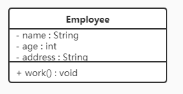


属性/方法名称前加的加号和减号表示了这个属性/方法的可见性，UML类图中表示可见性的符号有三种：

* +：表示public

* -：表示private

* #：表示protected

属性的完整表示方式是： **可见性  名称 ：类型 [ = 缺省值]**  

方法的完整表示方式是： **可见性  名称(参数列表) [ ： 返回类型]**


## 类与类之间关系的表示方式


### 关联关系

关联关系是对象之间的一种引用关系，用于表示一类对象与另一类对象之间的联系，如老师和学生、师傅和徒弟、丈夫和妻子等。关联关系是类与类之间最常用的一种关系，分为一般关联关系、聚合关系和组合关系。

关联又可以分为单向关联，双向关联，自关联


#### 单向关联

在UML类图中单向关联用一个带箭头的实线表示。


#### 双向关联

双向关联就是双方各自持有对方类型的成员变量

在UML类图中，双向关联用一个不带箭头的直线表示。

在Customer类中维护一个List\<Product>，表示一个顾客可以购买多个商品；在Product类中维护一个Customer类型的成员变量表示这个产品被哪个顾客所购买


#### 自关联

自关联在UML类图中用一个带有箭头且指向自身的线表示。


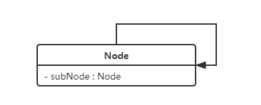


### 聚合关系

聚合关系是关联关系的一种，是强关联关系，是整体和部分之间的关系。

聚合关系也是通过成员对象来实现的，其中成员对象是整体对象的一部分，但是成员对象可以脱离整体对象而独立存在。例如，学校与老师的关系，学校包含老师，但如果学校停办了，老师依然存在。


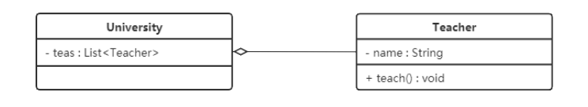


### 组合关系

组合表示类之间的整体与部分的关系，但它是一种更强烈的聚合关系。

在组合关系中，整体对象可以控制部分对象的生命周期，一旦整体对象不存在，部分对象也将不存在，部分对象不能脱离整体对象而存在。例如，头和嘴的关系，没有了头，嘴也就不存在了。

在 UML 类图中，组合关系用带实心菱形的实线来表示，菱形指向整体。


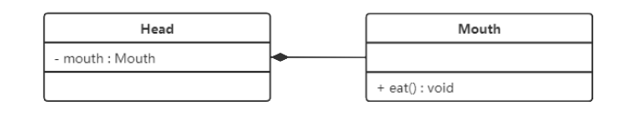


### 依赖关系

依赖关系是一种使用关系，它是对象之间耦合度最弱的一种关联方式，是临时性的关联。在代码中，某个类的方法通过局部变量、方法的参数或者对静态方法的调用来访问另一个类（被依赖类）中的某些方法来完成一些职责。

在 UML 类图中，依赖关系使用带箭头的虚线来表示，箭头从使用类指向被依赖的类。


### 继承关系

继承关系是对象之间耦合度最大的一种关系，表示一般与特殊的关系，是父类与子类之间的关系，是一种继承关系。

在 UML 类图中，泛化关系用带空心三角箭头的实线来表示，箭头从子类指向父类。在代码实现时，使用面向对象的继承机制来实现泛化关系。


### 实现关系

实现关系是接口与实现类之间的关系。在这种关系中，类实现了接口，类中的操作实现了接口中所声明的所有的抽象操作。

在 UML 类图中，实现关系使用带空心三角箭头的虚线来表示，箭头从实现类指向接口。


# 软件设计原则

在软件开发中，为了提高软件系统的可维护性和可复用性，增加软件的可扩展性和灵活性，程序员要尽量根据6条原则来开发程序，从而提高软件开发效率、节约软件开发成本和维护成本。


## 开闭原则

### 概念

**对扩展开放，对修改关闭**。在程序需要进行拓展的时候，不能去修改原有的代码，实现一个热插拔的效果。简言之，是为了使程序的扩展性好，易于维护和升级。

想要达到这样的效果，我们需要使用接口和抽象类。

因为抽象灵活性好，适应性广，只要抽象的合理，可以基本保持软件架构的稳定。而软件中易变的细节可以从抽象派生来的实现类来进行扩展，当软件需要发生变化时，只需要根据需求重新派生一个实现类来扩展就可以了。


### 示例

示例：搜狗输入法的皮肤设计


搜狗输入法的皮肤是输入法背景图片、窗口颜色和声音等元素的组合。用户可以根据自己的喜爱更换自己的输入法的皮肤，也可以从网上下载新的皮肤。这些皮肤有共同的特点，可以为其定义一个抽象类（AbstractSkin），而每个具体的皮肤是其子类。用户窗体可以根据需要选择或者增加新的主题，而不需要修改原代码，所以它是满足开闭原则的。


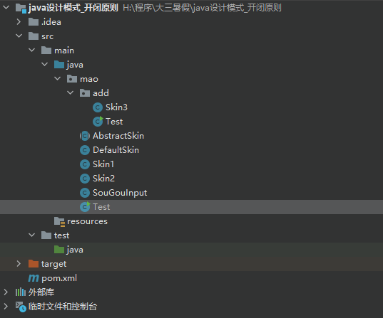


```java
package mao;

/**
 * Project name(项目名称)：java设计模式_开闭原则
 * Package(包名): mao
 * Class(类名): AbstractSkin
 * Author(作者）: mao
 * Author QQ：1296193245
 * GitHub：https://github.com/maomao124/
 * Date(创建日期)： 2022/8/9
 * Time(创建时间)： 20:27
 * Version(版本): 1.0
 * Description(描述)： 无
 */

public abstract class AbstractSkin
{
    public abstract void display();
}
```


```java
package mao;

/**
 * Project name(项目名称)：java设计模式_开闭原则
 * Package(包名): mao
 * Class(类名): SouGouInput
 * Author(作者）: mao
 * Author QQ：1296193245
 * GitHub：https://github.com/maomao124/
 * Date(创建日期)： 2022/8/9
 * Time(创建时间)： 20:28
 * Version(版本): 1.0
 * Description(描述)： 无
 */


public class SouGouInput
{
    private AbstractSkin skin;

    /**
     * Instantiates a new Sou gou input.
     *
     * @param skin the skin
     */
    public SouGouInput(AbstractSkin skin)
    {
        this.skin = skin;
    }

    /**
     * Gets skin.
     *
     * @return the skin
     */
    public AbstractSkin getSkin()
    {
        return skin;
    }

    /**
     * Sets skin.
     *
     * @param skin the skin
     */
    public void setSkin(AbstractSkin skin)
    {
        this.skin = skin;
    }

    /**
     * Display.
     */
    public void display()
    {
        skin.display();
    }
}
```


```java
package mao;

/**
 * Project name(项目名称)：java设计模式_开闭原则
 * Package(包名): mao
 * Class(类名): DefaultSkin
 * Author(作者）: mao
 * Author QQ：1296193245
 * GitHub：https://github.com/maomao124/
 * Date(创建日期)： 2022/8/9
 * Time(创建时间)： 20:35
 * Version(版本): 1.0
 * Description(描述)： 无
 */

public class DefaultSkin extends AbstractSkin
{

    @Override
    public void display()
    {
        System.out.println("默认皮肤");
    }
}
```


```java
package mao;

/**
 * Project name(项目名称)：java设计模式_开闭原则
 * Package(包名): mao
 * Class(类名): Skin1
 * Author(作者）: mao
 * Author QQ：1296193245
 * GitHub：https://github.com/maomao124/
 * Date(创建日期)： 2022/8/9
 * Time(创建时间)： 20:36
 * Version(版本): 1.0
 * Description(描述)： 无
 */

public class Skin1 extends AbstractSkin
{

    @Override
    public void display()
    {
        System.out.println("皮肤1");
    }
}
```


```java
package mao;

/**
 * Project name(项目名称)：java设计模式_开闭原则
 * Package(包名): mao
 * Class(类名): Skin2
 * Author(作者）: mao
 * Author QQ：1296193245
 * GitHub：https://github.com/maomao124/
 * Date(创建日期)： 2022/8/9
 * Time(创建时间)： 20:37
 * Version(版本): 1.0
 * Description(描述)： 无
 */

public class Skin2 extends AbstractSkin
{

    @Override
    public void display()
    {
        System.out.println("皮肤2");
    }
}
```


```java
package mao;

/**
 * Project name(项目名称)：java设计模式_开闭原则
 * Package(包名): mao
 * Class(类名): Test
 * Author(作者）: mao
 * Author QQ：1296193245
 * GitHub：https://github.com/maomao124/
 * Date(创建日期)： 2022/8/9
 * Time(创建时间)： 20:37
 * Version(版本): 1.0
 * Description(描述)： 无
 */

public class Test
{
    public static void main(String[] args)
    {
        SouGouInput souGouInput = new SouGouInput(new DefaultSkin());
        souGouInput.display();
        souGouInput = new SouGouInput(new Skin1());
        souGouInput.display();
        souGouInput = new SouGouInput(new Skin2());
        souGouInput.display();
    }
}
```


添加皮肤


```java
package mao.add;

import mao.AbstractSkin;

/**
 * Project name(项目名称)：java设计模式_开闭原则
 * Package(包名): mao.add
 * Class(类名): Skin3
 * Author(作者）: mao
 * Author QQ：1296193245
 * GitHub：https://github.com/maomao124/
 * Date(创建日期)： 2022/8/9
 * Time(创建时间)： 20:42
 * Version(版本): 1.0
 * Description(描述)： 无
 */

public class Skin3 extends AbstractSkin
{

    @Override
    public void display()
    {
        System.out.println("添加皮肤3，没有对原来代码进行修改");
    }
}
```


```java
package mao.add;

import mao.SouGouInput;

/**
 * Project name(项目名称)：java设计模式_开闭原则
 * Package(包名): mao.add
 * Class(类名): Test
 * Author(作者）: mao
 * Author QQ：1296193245
 * GitHub：https://github.com/maomao124/
 * Date(创建日期)： 2022/8/9
 * Time(创建时间)： 20:42
 * Version(版本): 1.0
 * Description(描述)： 无
 */

public class Test
{
    public static void main(String[] args)
    {
        SouGouInput souGouInput = new SouGouInput(new Skin3());
        souGouInput.display();
    }
}
```


## 里氏代换原则

### 概念

里氏代换原则是面向对象设计的基本原则之一。

里氏代换原则：任何基类可以出现的地方，子类一定可以出现。通俗理解：子类可以扩展父类的功能，但不能改变父类原有的功能。换句话说，子类继承父类时，除添加新的方法完成新增功能外，尽量不要重写父类的方法。

如果通过重写父类的方法来完成新的功能，这样写起来虽然简单，但是整个继承体系的可复用性会比较差，特别是运用多态比较频繁时，程序运行出错的概率会非常大。


### 示例

示例：正方形不是长方形

在数学领域里，正方形毫无疑问是长方形，它是一个长宽相等的长方形。所以，我们开发的一个与几何图形相关的软件系统，就可以顺理成章的让正方形继承自长方形。


```java
package mao.before;

/**
 * Project name(项目名称)：java设计模式_里氏代换原则
 * Package(包名): mao.before
 * Class(类名): Rectangle
 * Author(作者）: mao
 * Author QQ：1296193245
 * GitHub：https://github.com/maomao124/
 * Date(创建日期)： 2022/8/9
 * Time(创建时间)： 20:57
 * Version(版本): 1.0
 * Description(描述)： 无
 */
public class Rectangle
{
    private double length;
    private double width;

    /**
     * Instantiates a new Rectangle.
     *
     * @param length the length
     * @param width  the width
     */
    public Rectangle(double length, double width)
    {
        this.length = length;
        this.width = width;
    }

    /**
     * Instantiates a new Rectangle.
     */
    public Rectangle()
    {

    }

    /**
     * Gets length.
     *
     * @return the length
     */
    public double getLength()
    {
        return length;
    }

    /**
     * Sets length.
     *
     * @param length the length
     */
    public void setLength(double length)
    {
        this.length = length;
    }

    /**
     * Gets width.
     *
     * @return the width
     */
    public double getWidth()
    {
        return width;
    }

    /**
     * Sets width.
     *
     * @param width the width
     */
    public void setWidth(double width)
    {
        this.width = width;
    }


}
```


由于正方形的长和宽相同，所以在方法setLength和setWidth中，对长度和宽度都需要赋相同值。


```java
package mao.before;

/**
 * Project name(项目名称)：java设计模式_里氏代换原则
 * Package(包名): mao.before
 * Class(类名): Square
 * Author(作者）: mao
 * Author QQ：1296193245
 * GitHub：https://github.com/maomao124/
 * Date(创建日期)： 2022/8/9
 * Time(创建时间)： 20:57
 * Version(版本): 1.0
 * Description(描述)： 无
 */

public class Square extends Rectangle
{
    @Override
    public void setWidth(double width)
    {
        super.setLength(width);
        super.setWidth(width);
    }

    @Override
    public void setLength(double length)
    {
        super.setLength(length);
        super.setWidth(length);
    }
}
```


类RectangleDemo是我们的软件系统中的一个组件，它有一个resize方法依赖基类Rectangle，resize方法是RectandleDemo类中的一个方法，用来实现宽度逐渐增长的效果。


```java
package mao.before;

/**
 * Project name(项目名称)：java设计模式_里氏代换原则
 * Package(包名): mao.before
 * Class(类名): RectangleDemo
 * Author(作者）: mao
 * Author QQ：1296193245
 * GitHub：https://github.com/maomao124/
 * Date(创建日期)： 2022/8/9
 * Time(创建时间)： 21:00
 * Version(版本): 1.0
 * Description(描述)： 类RectangleDemo是我们的软件系统中的一个组件，它有一个resize方法依赖基类Rectangle，resize方法是RectangleDemo类中的一个方法，用来实现宽度逐渐增长的效果。
 */

public class RectangleDemo
{
    /**
     * 拓宽，直到宽度比长度还大，正方形会死循环
     *
     * @param rectangle Rectangle对象
     */
    public static void resize(Rectangle rectangle)
    {
        while (rectangle.getWidth() <= rectangle.getLength())
        {
            rectangle.setWidth(rectangle.getWidth() + 1);
        }
    }

    /**
     * 打印长和宽
     *
     * @param rectangle Rectangle对象
     */
    public static void printf(Rectangle rectangle)
    {
        System.out.println("长度：" + rectangle.getLength());
        System.out.println("宽度：" + rectangle.getWidth());
    }

    public static void main(String[] args)
    {
        Rectangle rectangle = new Rectangle(12, 8);
        printf(rectangle);
        resize(rectangle);
        printf(rectangle);

        //-------
        rectangle = new Square();
        rectangle.setLength(9);
        printf(rectangle);
        resize(rectangle);
        printf(rectangle);
    }
}
```


我们运行一下这段代码就会发现，假如我们把一个普通长方形作为参数传入resize方法，就会看到长方形宽度逐渐增长的效果，当宽度大于长度,代码就会停止，这种行为的结果符合我们的预期；假如我们再把一个正方形作为参数传入resize方法后，就会看到正方形的宽度和长度都在不断增长，代码会一直运行下去，直至系统产生溢出错误。所以，普通的长方形是适合这段代码的，正方形不适合。
我们得出结论：在resize方法中，Rectangle类型的参数是不能被Square类型的参数所代替，如果进行了替换就得不到预期结果。因此，Square类和Rectangle类之间的继承关系违反了里氏代换原则，它们之间的继承关系不成立，正方形不是长方形。


**改进：**

抽象出来一个四边形接口(Quadrilateral)，让Rectangle类和Square类实现Quadrilateral接口


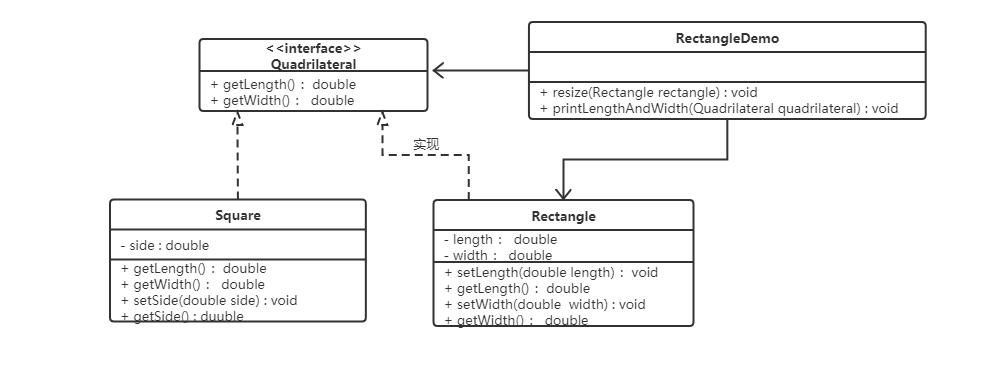


```java
package mao.after;

/**
 * Project name(项目名称)：java设计模式_里氏代换原则
 * Package(包名): mao.after
 * Interface(接口名): Quadrilateral
 * Author(作者）: mao
 * Author QQ：1296193245
 * GitHub：https://github.com/maomao124/
 * Date(创建日期)： 2022/8/9
 * Time(创建时间)： 21:13
 * Version(版本): 1.0
 * Description(描述)： 四边形接口
 */

public interface Quadrilateral
{
    /**
     * Gets length.
     *
     * @return the length
     */
    double getLength();

    /**
     * Gets width.
     *
     * @return the width
     */
    double getWidth();
}
```


```java
package mao.after;

/**
 * Project name(项目名称)：java设计模式_里氏代换原则
 * Package(包名): mao.after
 * Class(类名): Rectangle
 * Author(作者）: mao
 * Author QQ：1296193245
 * GitHub：https://github.com/maomao124/
 * Date(创建日期)： 2022/8/9
 * Time(创建时间)： 21:15
 * Version(版本): 1.0
 * Description(描述)： 无
 */

public class Rectangle implements Quadrilateral
{

    private double length;
    private double width;

    /**
     * Instantiates a new Rectangle.
     */
    public Rectangle()
    {

    }

    /**
     * Instantiates a new Rectangle.
     *
     * @param length the length
     * @param width  the width
     */
    public Rectangle(double length, double width)
    {
        this.length = length;
        this.width = width;
    }

    @Override
    public double getLength()
    {
        return length;
    }

    /**
     * Sets length.
     *
     * @param length the length
     */
    public void setLength(double length)
    {
        this.length = length;
    }

    @Override
    public double getWidth()
    {
        return width;
    }

    /**
     * Sets width.
     *
     * @param width the width
     */
    public void setWidth(double width)
    {
        this.width = width;
    }
}
```


```java
package mao.after;

/**
 * Project name(项目名称)：java设计模式_里氏代换原则
 * Package(包名): mao.after
 * Class(类名): Square
 * Author(作者）: mao
 * Author QQ：1296193245
 * GitHub：https://github.com/maomao124/
 * Date(创建日期)： 2022/8/9
 * Time(创建时间)： 21:16
 * Version(版本): 1.0
 * Description(描述)： 无
 */


public class Square implements Quadrilateral
{
    private double side;

    /**
     * Instantiates a new Square.
     */
    public Square()
    {

    }

    /**
     * Instantiates a new Square.
     *
     * @param side the side
     */
    public Square(double side)
    {
        this.side = side;
    }

    /**
     * Sets side.
     *
     * @param side the side
     */
    public void setSide(double side)
    {
        this.side = side;
    }

    @Override
    public double getLength()
    {
        return side;
    }

    @Override
    public double getWidth()
    {
        return side;
    }
}
```


```java
package mao.after;


/**
 * Project name(项目名称)：java设计模式_里氏代换原则
 * Package(包名): mao.after
 * Class(类名): RectangleDemo
 * Author(作者）: mao
 * Author QQ：1296193245
 * GitHub：https://github.com/maomao124/
 * Date(创建日期)： 2022/8/9
 * Time(创建时间)： 21:18
 * Version(版本): 1.0
 * Description(描述)： 无
 */

public class RectangleDemo
{
    /**
     * 拓宽，直到宽度比长度还大，正方形会死循环
     *
     * @param rectangle Rectangle对象
     */
    public static void resize(Rectangle rectangle)
    {
        while (rectangle.getWidth() <= rectangle.getLength())
        {
            rectangle.setWidth(rectangle.getWidth() + 1);
        }
    }

    /**
     * 打印长和宽
     *
     * @param quadrilateral Quadrilateral实现类对象
     */
    public static void printf(Quadrilateral quadrilateral)
    {
        System.out.println("长度：" + quadrilateral.getLength());
        System.out.println("宽度：" + quadrilateral.getWidth());
    }


    public static void main(String[] args)
    {
        Rectangle rectangle = new Rectangle(9, 3);
        printf(rectangle);
        resize(rectangle);
        printf(rectangle);

        //----

        Square square = new Square();
        square.setSide(13);
        printf(square);
        //因为无法使用resize(square)，解决了此问题
        //resize(square);
    }
}
```


## 依赖倒转原则

### 概念

高层模块不应该依赖低层模块，两者都应该依赖其抽象；抽象不应该依赖细节，细节应该依赖抽象。简单的说就是要求对抽象进行编程，不要对实现进行编程，这样就降低了客户与实现模块间的耦合。


### 示例

示例：组装电脑


现要组装一台电脑，需要配件cpu，硬盘，内存条。只有这些配置都有了，计算机才能正常的运行。选择cpu有很多选择，如Intel，AMD等，硬盘可以选择希捷，西数等，内存条可以选择金士顿，海盗船等。


代码如下


```java
package mao.before;

/**
 * Project name(项目名称)：java设计模式_依赖倒转原则
 * Package(包名): mao.before
 * Class(类名): IntelCpu
 * Author(作者）: mao
 * Author QQ：1296193245
 * GitHub：https://github.com/maomao124/
 * Date(创建日期)： 2022/8/9
 * Time(创建时间)： 21:45
 * Version(版本): 1.0
 * Description(描述)： 无
 */

public class IntelCpu
{
    public void run()
    {
        System.out.println("使用Intel处理器");
    }
}
```


```java
package mao.before;

/**
 * Project name(项目名称)：java设计模式_依赖倒转原则
 * Package(包名): mao.before
 * Class(类名): KingstonMemory
 * Author(作者）: mao
 * Author QQ：1296193245
 * GitHub：https://github.com/maomao124/
 * Date(创建日期)： 2022/8/9
 * Time(创建时间)： 21:45
 * Version(版本): 1.0
 * Description(描述)： 无
 */

public class KingstonMemory
{
    public void save()
    {
        System.out.println("使用金士顿作为内存条");
    }
}
```


```java
package mao.before;

/**
 * Project name(项目名称)：java设计模式_依赖倒转原则
 * Package(包名): mao.before
 * Class(类名): XiJieHardDisk
 * Author(作者）: mao
 * Author QQ：1296193245
 * GitHub：https://github.com/maomao124/
 * Date(创建日期)： 2022/8/9
 * Time(创建时间)： 21:44
 * Version(版本): 1.0
 * Description(描述)： 无
 */

public class XiJieHardDisk
{
    public void save(String data)
    {
        System.out.println("使用希捷硬盘存储数据" + data);
    }

    public String get()
    {
        System.out.println("使用希捷希捷硬盘取数据");
        return "数据";
    }
}
```


```java
package mao.before;

/**
 * Project name(项目名称)：java设计模式_依赖倒转原则
 * Package(包名): mao.before
 * Class(类名): Computer
 * Author(作者）: mao
 * Author QQ：1296193245
 * GitHub：https://github.com/maomao124/
 * Date(创建日期)： 2022/8/9
 * Time(创建时间)： 21:46
 * Version(版本): 1.0
 * Description(描述)： 无
 */


public class Computer
{
    private IntelCpu intelCpu;
    private KingstonMemory kingstonMemory;
    private XiJieHardDisk xiJieHardDisk;

    /**
     * Instantiates a new Computer.
     */
    public Computer()
    {

    }

    /**
     * Instantiates a new Computer.
     *
     * @param intelCpu       the intel cpu
     * @param kingstonMemory the kingston memory
     * @param xiJieHardDisk  the xi jie hard disk
     */
    public Computer(IntelCpu intelCpu, KingstonMemory kingstonMemory, XiJieHardDisk xiJieHardDisk)
    {
        this.intelCpu = intelCpu;
        this.kingstonMemory = kingstonMemory;
        this.xiJieHardDisk = xiJieHardDisk;
    }

    /**
     * Gets intel cpu.
     *
     * @return the intel cpu
     */
    public IntelCpu getIntelCpu()
    {
        return intelCpu;
    }

    /**
     * Sets intel cpu.
     *
     * @param intelCpu the intel cpu
     */
    public void setIntelCpu(IntelCpu intelCpu)
    {
        this.intelCpu = intelCpu;
    }

    /**
     * Gets kingston memory.
     *
     * @return the kingston memory
     */
    public KingstonMemory getKingstonMemory()
    {
        return kingstonMemory;
    }

    /**
     * Sets kingston memory.
     *
     * @param kingstonMemory the kingston memory
     */
    public void setKingstonMemory(KingstonMemory kingstonMemory)
    {
        this.kingstonMemory = kingstonMemory;
    }

    /**
     * Gets xi jie hard disk.
     *
     * @return the xi jie hard disk
     */
    public XiJieHardDisk getXiJieHardDisk()
    {
        return xiJieHardDisk;
    }

    /**
     * Sets xi jie hard disk.
     *
     * @param xiJieHardDisk the xi jie hard disk
     */
    public void setXiJieHardDisk(XiJieHardDisk xiJieHardDisk)
    {
        this.xiJieHardDisk = xiJieHardDisk;
    }

    /**
     * Run.
     */
    public void run()
    {
        System.out.println("计算机工作");
        intelCpu.run();
        kingstonMemory.save();
        String data = xiJieHardDisk.get();
        System.out.println("从硬盘中获取的数据为：" + data);
    }
}

```


```java
package mao.before;

/**
 * Project name(项目名称)：java设计模式_依赖倒转原则
 * Package(包名): mao.before
 * Class(类名): Test
 * Author(作者）: mao
 * Author QQ：1296193245
 * GitHub：https://github.com/maomao124/
 * Date(创建日期)： 2022/8/9
 * Time(创建时间)： 21:49
 * Version(版本): 1.0
 * Description(描述)： 无
 */

public class Test
{
    public static void main(String[] args)
    {
        IntelCpu intelCpu = new IntelCpu();
        XiJieHardDisk xiJieHardDisk = new XiJieHardDisk();
        KingstonMemory kingstonMemory = new KingstonMemory();

        Computer computer = new Computer();
        computer.setIntelCpu(intelCpu);
        computer.setKingstonMemory(kingstonMemory);
        computer.setXiJieHardDisk(xiJieHardDisk);

        computer.run();
    }
}
```


上面代码可以看到已经组装了一台电脑，但是似乎组装的电脑的cpu只能是Intel的，内存条只能是金士顿的，硬盘只能是希捷的，这对用户肯定是不友好的，用户有了机箱肯定是想按照自己的喜好，选择自己喜欢的配件。

如果想要装AMD的CPU，那必须更改源码，也不满足开闭原则


**改进：**


Computer类，让Computer类依赖抽象（各个配件的接口），而不是依赖于各个组件具体的实现类


```java
package mao.after;

/**
 * Project name(项目名称)：java设计模式_依赖倒转原则
 * Package(包名): mao.after
 * Interface(接口名): Cpu
 * Author(作者）: mao
 * Author QQ：1296193245
 * GitHub：https://github.com/maomao124/
 * Date(创建日期)： 2022/8/9
 * Time(创建时间)： 21:56
 * Version(版本): 1.0
 * Description(描述)： 无
 */

public interface Cpu
{
    /**
     * Run.
     */
    void run();
}
```


```java
package mao.after;

/**
 * Project name(项目名称)：java设计模式_依赖倒转原则
 * Package(包名): mao.after
 * Interface(接口名): HardDisk
 * Author(作者）: mao
 * Author QQ：1296193245
 * GitHub：https://github.com/maomao124/
 * Date(创建日期)： 2022/8/9
 * Time(创建时间)： 21:57
 * Version(版本): 1.0
 * Description(描述)： 无
 */

public interface HardDisk
{
    /**
     * Save.
     *
     * @param data the data
     */
    void save(String data);

    /**
     * Get string.
     *
     * @return the string
     */
    String get();
}
```


```java
package mao.after;

/**
 * Project name(项目名称)：java设计模式_依赖倒转原则
 * Package(包名): mao.after
 * Interface(接口名): Memory
 * Author(作者）: mao
 * Author QQ：1296193245
 * GitHub：https://github.com/maomao124/
 * Date(创建日期)： 2022/8/9
 * Time(创建时间)： 21:57
 * Version(版本): 1.0
 * Description(描述)： 无
 */

public interface Memory
{
    /**
     * Save.
     */
    void save();
}
```


```java
package mao.after;

/**
 * Project name(项目名称)：java设计模式_依赖倒转原则
 * Package(包名): mao.after
 * Class(类名): IntelCpu
 * Author(作者）: mao
 * Author QQ：1296193245
 * GitHub：https://github.com/maomao124/
 * Date(创建日期)： 2022/8/9
 * Time(创建时间)： 22:01
 * Version(版本): 1.0
 * Description(描述)： 无
 */

public class IntelCpu implements Cpu
{

    @Override
    public void run()
    {
        System.out.println("使用Intel处理器");
    }
}
```


```java
package mao.after;

/**
 * Project name(项目名称)：java设计模式_依赖倒转原则
 * Package(包名): mao.after
 * Class(类名): KingstonMemory
 * Author(作者）: mao
 * Author QQ：1296193245
 * GitHub：https://github.com/maomao124/
 * Date(创建日期)： 2022/8/9
 * Time(创建时间)： 22:01
 * Version(版本): 1.0
 * Description(描述)： 无
 */

public class KingstonMemory implements Memory
{

    @Override
    public void save()
    {
        System.out.println("使用金士顿作为内存条");
    }
}
```


```java
package mao.after;

/**
 * Project name(项目名称)：java设计模式_依赖倒转原则
 * Package(包名): mao.after
 * Class(类名): XiJieHardDisk
 * Author(作者）: mao
 * Author QQ：1296193245
 * GitHub：https://github.com/maomao124/
 * Date(创建日期)： 2022/8/9
 * Time(创建时间)： 22:02
 * Version(版本): 1.0
 * Description(描述)： 无
 */

public class XiJieHardDisk implements HardDisk
{

    @Override
    public void save(String data)
    {
        System.out.println("使用希捷硬盘存储数据" + data);
    }

    @Override
    public String get()
    {
        System.out.println("使用希捷希捷硬盘取数据");
        return "数据";
    }
}
```


```java
package mao.after;

/**
 * Project name(项目名称)：java设计模式_依赖倒转原则
 * Package(包名): mao.after
 * Class(类名): Computer
 * Author(作者）: mao
 * Author QQ：1296193245
 * GitHub：https://github.com/maomao124/
 * Date(创建日期)： 2022/8/9
 * Time(创建时间)： 22:02
 * Version(版本): 1.0
 * Description(描述)： 无
 */


public class Computer
{
    private Cpu cpu;
    private HardDisk hardDisk;
    private Memory memory;

    /**
     * Instantiates a new Computer.
     */
    public Computer()
    {

    }

    /**
     * Instantiates a new Computer.
     *
     * @param cpu      the cpu
     * @param hardDisk the hard disk
     * @param memory   the memory
     */
    public Computer(Cpu cpu, HardDisk hardDisk, Memory memory)
    {
        this.cpu = cpu;
        this.hardDisk = hardDisk;
        this.memory = memory;
    }

    /**
     * Gets cpu.
     *
     * @return the cpu
     */
    public Cpu getCpu()
    {
        return cpu;
    }

    /**
     * Sets cpu.
     *
     * @param cpu the cpu
     */
    public void setCpu(Cpu cpu)
    {
        this.cpu = cpu;
    }

    /**
     * Gets hard disk.
     *
     * @return the hard disk
     */
    public HardDisk getHardDisk()
    {
        return hardDisk;
    }

    /**
     * Sets hard disk.
     *
     * @param hardDisk the hard disk
     */
    public void setHardDisk(HardDisk hardDisk)
    {
        this.hardDisk = hardDisk;
    }

    /**
     * Gets memory.
     *
     * @return the memory
     */
    public Memory getMemory()
    {
        return memory;
    }

    /**
     * Sets memory.
     *
     * @param memory the memory
     */
    public void setMemory(Memory memory)
    {
        this.memory = memory;
    }

    /**
     * Run.
     */
    public void run()
    {
        System.out.println("计算机工作");
        cpu.run();
        memory.save();
        String data = hardDisk.get();
        System.out.println("从硬盘中获取的数据为：" + data);
    }
}
```


```java
package mao.after;


/**
 * Project name(项目名称)：java设计模式_依赖倒转原则
 * Package(包名): mao.after
 * Class(类名): Test
 * Author(作者）: mao
 * Author QQ：1296193245
 * GitHub：https://github.com/maomao124/
 * Date(创建日期)： 2022/8/9
 * Time(创建时间)： 22:04
 * Version(版本): 1.0
 * Description(描述)： 无
 */

public class Test
{
    public static void main(String[] args)
    {
        Cpu cpu = new IntelCpu();
        HardDisk hardDisk = new XiJieHardDisk();
        Memory memory = new KingstonMemory();

        Computer computer = new Computer();
        computer.setCpu(cpu);
        computer.setHardDisk(hardDisk);
        computer.setMemory(memory);

        computer.run();
    }
}
```


面向对象的开发很好的解决了这个问题，一般情况下抽象的变化概率很小，让用户程序依赖于抽象，实现的细节也依赖于抽象。即使实现细节不断变动，只要抽象不变，客户程序就不需要变化。这大大降低了客户程序与实现细节的耦合度。


当需要使用AMD更改配件时，比如使用AMD处理器，实现CPU接口


```java
package mao.after;

/**
 * Project name(项目名称)：java设计模式_依赖倒转原则
 * Package(包名): mao.after
 * Class(类名): AMDCpu
 * Author(作者）: mao
 * Author QQ：1296193245
 * GitHub：https://github.com/maomao124/
 * Date(创建日期)： 2022/8/9
 * Time(创建时间)： 22:09
 * Version(版本): 1.0
 * Description(描述)： 无
 */

public class AMDCpu implements Cpu
{

    @Override
    public void run()
    {
        System.out.println("使用AMD处理器");
    }
}
```


```java
package mao.after;

/**
 * Project name(项目名称)：java设计模式_依赖倒转原则
 * Package(包名): mao.after
 * Class(类名): CorsairMemory
 * Author(作者）: mao
 * Author QQ：1296193245
 * GitHub：https://github.com/maomao124/
 * Date(创建日期)： 2022/8/9
 * Time(创建时间)： 22:12
 * Version(版本): 1.0
 * Description(描述)： 无
 */

public class CorsairMemory implements Memory
{

    @Override
    public void save()
    {
        System.out.println("使用海盗船作为内存条");
    }
}
```


```java
package mao.after;

/**
 * Project name(项目名称)：java设计模式_依赖倒转原则
 * Package(包名): mao.after
 * Class(类名): Test2
 * Author(作者）: mao
 * Author QQ：1296193245
 * GitHub：https://github.com/maomao124/
 * Date(创建日期)： 2022/8/9
 * Time(创建时间)： 22:14
 * Version(版本): 1.0
 * Description(描述)： 无
 */

public class Test2
{
    public static void main(String[] args)
    {
        Cpu cpu = new AMDCpu();
        HardDisk hardDisk = new XiJieHardDisk();
        Memory memory = new CorsairMemory();

        Computer computer = new Computer();
        computer.setCpu(cpu);
        computer.setHardDisk(hardDisk);
        computer.setMemory(memory);

        computer.run();
    }
}
```


## 接口隔离原则

### 概念

客户端不应该被迫依赖于它不使用的方法；一个类对另一个类的依赖应该建立在最小的接口上


### 示例

接口有三个方法

```java
package mao.before;

/**
 * Project name(项目名称)：java设计模式_接口隔离原则
 * Package(包名): mao.before
 * Interface(接口名): Interface_s
 * Author(作者）: mao
 * Author QQ：1296193245
 * GitHub：https://github.com/maomao124/
 * Date(创建日期)： 2022/8/10
 * Time(创建时间)： 21:33
 * Version(版本): 1.0
 * Description(描述)： 接口
 */

public interface Interface_s
{
    void a();

    void b();

    void c();
}
```


实现类Impl1需要重写三个方法，没问题

```java
package mao.before;

/**
 * Project name(项目名称)：java设计模式_接口隔离原则
 * Package(包名): mao.before
 * Class(类名): Impl1
 * Author(作者）: mao
 * Author QQ：1296193245
 * GitHub：https://github.com/maomao124/
 * Date(创建日期)： 2022/8/10
 * Time(创建时间)： 21:34
 * Version(版本): 1.0
 * Description(描述)： Impl1类，需要实现Interface_s接口的三个方法
 */

public class Impl1 implements Interface_s
{

    @Override
    public void a()
    {
        System.out.println("Impl1重写方法a");
    }

    @Override
    public void b()
    {
        System.out.println("Impl1重写方法b");
    }

    @Override
    public void c()
    {
        System.out.println("Impl1重写方法c");
    }
}
```


现在实现类Impl2只需要重写两个方法，第三个方法不需要重写，有问题，实现的接口必须重写全部方法


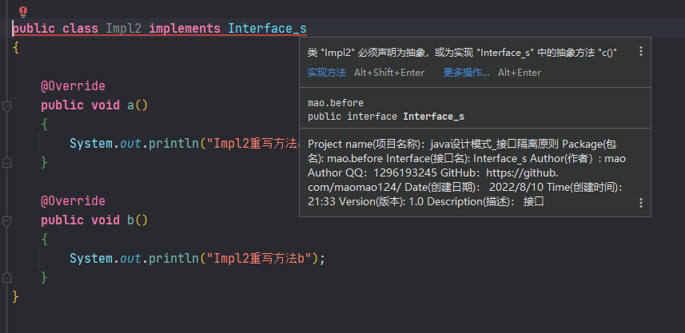


```java
package mao.before;

/**
 * Project name(项目名称)：java设计模式_接口隔离原则
 * Package(包名): mao.before
 * Class(类名): Impl2
 * Author(作者）: mao
 * Author QQ：1296193245
 * GitHub：https://github.com/maomao124/
 * Date(创建日期)： 2022/8/10
 * Time(创建时间)： 21:36
 * Version(版本): 1.0
 * Description(描述)： Impl2类，需求：只需要实现a和b方法，c方法不需要实现，做不到
 */

public class Impl2 implements Interface_s
{

    @Override
    public void a()
    {
        System.out.println("Impl2重写方法a");
    }

    @Override
    public void b()
    {
        System.out.println("Impl2重写方法b");
    }

    @Override
    public void c()
    {
        
    }
}
```


**改进：**

一个类对另一个类的依赖应该建立在最小的接口上


```java
package mao.after;

/**
 * Project name(项目名称)：java设计模式_接口隔离原则
 * Package(包名): mao.after
 * Interface(接口名): Interface_a
 * Author(作者）: mao
 * Author QQ：1296193245
 * GitHub：https://github.com/maomao124/
 * Date(创建日期)： 2022/8/10
 * Time(创建时间)： 21:42
 * Version(版本): 1.0
 * Description(描述)： 无
 */

public interface Interface_a
{
    void a();
}
```


```java
package mao.after;

/**
 * Project name(项目名称)：java设计模式_接口隔离原则
 * Package(包名): mao.after
 * Interface(接口名): Interface_b
 * Author(作者）: mao
 * Author QQ：1296193245
 * GitHub：https://github.com/maomao124/
 * Date(创建日期)： 2022/8/10
 * Time(创建时间)： 21:43
 * Version(版本): 1.0
 * Description(描述)： 无
 */

public interface Interface_b
{
    void b();
}
```


```java
package mao.after;

/**
 * Project name(项目名称)：java设计模式_接口隔离原则
 * Package(包名): mao.after
 * Interface(接口名): Interface_c
 * Author(作者）: mao
 * Author QQ：1296193245
 * GitHub：https://github.com/maomao124/
 * Date(创建日期)： 2022/8/10
 * Time(创建时间)： 21:43
 * Version(版本): 1.0
 * Description(描述)： 无
 */

public interface Interface_c
{
    void c();
}
```


```java
package mao.after;

/**
 * Project name(项目名称)：java设计模式_接口隔离原则
 * Package(包名): mao.after
 * Class(类名): Impl1
 * Author(作者）: mao
 * Author QQ：1296193245
 * GitHub：https://github.com/maomao124/
 * Date(创建日期)： 2022/8/10
 * Time(创建时间)： 21:43
 * Version(版本): 1.0
 * Description(描述)： 无
 */

public class Impl1 implements Interface_a, Interface_b, Interface_c
{

    @Override
    public void a()
    {
        System.out.println("Impl1重写方法a");
    }

    @Override
    public void b()
    {
        System.out.println("Impl1重写方法b");
    }

    @Override
    public void c()
    {
        System.out.println("Impl1重写方法c");
    }
}
```


```java
package mao.after;

/**
 * Project name(项目名称)：java设计模式_接口隔离原则
 * Package(包名): mao.after
 * Class(类名): Impl2
 * Author(作者）: mao
 * Author QQ：1296193245
 * GitHub：https://github.com/maomao124/
 * Date(创建日期)： 2022/8/10
 * Time(创建时间)： 21:45
 * Version(版本): 1.0
 * Description(描述)： 无
 */

public class Impl2 implements Interface_a, Interface_b
{

    @Override
    public void a()
    {
        System.out.println("Impl2重写方法a");
    }

    @Override
    public void b()
    {
        System.out.println("Impl2重写方法b");
    }
}
```


## 迪米特法则

### 概念

迪米特法则又叫最少知识原则。

只和你的直接朋友交谈，不跟“陌生人”说话（Talk only to your immediate friends and not to strangers）。

其含义是：如果两个软件实体无须直接通信，那么就不应当发生直接的相互调用，可以通过第三方转发该调用。其目的是降低类之间的耦合度，提高模块的相对独立性。

迪米特法则中的“朋友”是指：当前对象本身、当前对象的成员对象、当前对象所创建的对象、当前对象的方法参数等，这些对象同当前对象存在关联、聚合或组合关系，可以直接访问这些对象的方法。


### 示例

明星与经纪人的关系实例

明星由于全身心投入艺术，所以许多日常事务由经纪人负责处理，如和粉丝的见面会，和媒体公司的业务洽淡等。这里的经纪人是明星的朋友，而粉丝和媒体公司是陌生人，所以适合使用迪米特法则。


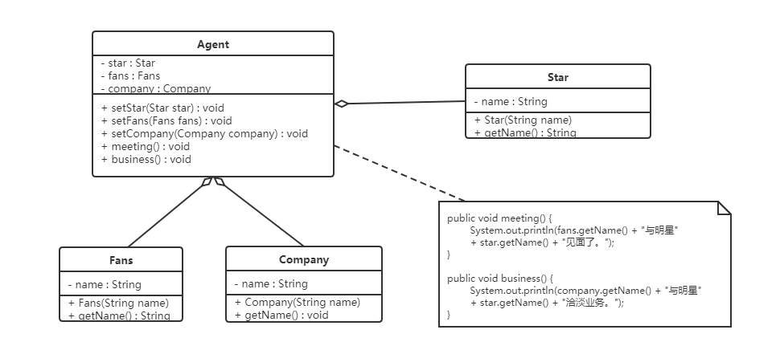


```java
package mao;

/**
 * Project name(项目名称)：java设计模式_迪米特法则
 * Package(包名): mao
 * Class(类名): Star
 * Author(作者）: mao
 * Author QQ：1296193245
 * GitHub：https://github.com/maomao124/
 * Date(创建日期)： 2022/8/10
 * Time(创建时间)： 21:59
 * Version(版本): 1.0
 * Description(描述)： 无
 */

public class Star
{
    private String name;

    /**
     * Instantiates a new Star.
     */
    public Star()
    {
    }

    /**
     * Instantiates a new Star.
     *
     * @param name the name
     */
    public Star(String name)
    {
        this.name = name;
    }

    /**
     * Gets name.
     *
     * @return the name
     */
    public String getName()
    {
        return name;
    }

    /**
     * Sets name.
     *
     * @param name the name
     */
    public void setName(String name)
    {
        this.name = name;
    }
}
```


```java
package mao;

/**
 * Project name(项目名称)：java设计模式_迪米特法则
 * Package(包名): mao
 * Class(类名): Fans
 * Author(作者）: mao
 * Author QQ：1296193245
 * GitHub：https://github.com/maomao124/
 * Date(创建日期)： 2022/8/10
 * Time(创建时间)： 22:00
 * Version(版本): 1.0
 * Description(描述)： 无
 */


public class Fans
{
    private String name;

    /**
     * Instantiates a new Fans.
     */
    public Fans()
    {

    }

    /**
     * Instantiates a new Fans.
     *
     * @param name the name
     */
    public Fans(String name)
    {
        this.name = name;
    }

    /**
     * Gets name.
     *
     * @return the name
     */
    public String getName()
    {
        return name;
    }

    /**
     * Sets name.
     *
     * @param name the name
     */
    public void setName(String name)
    {
        this.name = name;
    }
}
```


```java
package mao;

/**
 * Project name(项目名称)：java设计模式_迪米特法则
 * Package(包名): mao
 * Class(类名): Company
 * Author(作者）: mao
 * Author QQ：1296193245
 * GitHub：https://github.com/maomao124/
 * Date(创建日期)： 2022/8/10
 * Time(创建时间)： 22:01
 * Version(版本): 1.0
 * Description(描述)： 媒体公司类
 */


public class Company
{
    private String name;

    /**
     * Instantiates a new Company.
     */
    public Company()
    {

    }

    /**
     * Instantiates a new Company.
     *
     * @param name the name
     */
    public Company(String name)
    {
        this.name = name;
    }

    /**
     * Gets name.
     *
     * @return the name
     */
    public String getName()
    {
        return name;
    }

    /**
     * Sets name.
     *
     * @param name the name
     */
    public void setName(String name)
    {
        this.name = name;
    }
}
```


```java
package mao;

/**
 * Project name(项目名称)：java设计模式_迪米特法则
 * Package(包名): mao
 * Class(类名): Agent
 * Author(作者）: mao
 * Author QQ：1296193245
 * GitHub：https://github.com/maomao124/
 * Date(创建日期)： 2022/8/10
 * Time(创建时间)： 22:02
 * Version(版本): 1.0
 * Description(描述)： 经纪人类
 */


public class Agent
{
    private Star star;
    private Fans fans;
    private Company company;

    /**
     * Instantiates a new Agent.
     */
    public Agent()
    {

    }

    /**
     * Instantiates a new Agent.
     *
     * @param star    the star
     * @param fans    the fans
     * @param company the company
     */
    public Agent(Star star, Fans fans, Company company)
    {
        this.star = star;
        this.fans = fans;
        this.company = company;
    }

    /**
     * Sets star.
     *
     * @param star the star
     */
    public void setStar(Star star)
    {
        this.star = star;
    }

    /**
     * Sets fans.
     *
     * @param fans the fans
     */
    public void setFans(Fans fans)
    {
        this.fans = fans;
    }

    /**
     * Sets company.
     *
     * @param company the company
     */
    public void setCompany(Company company)
    {
        this.company = company;
    }

    /**
     * Meeting.
     */
    public void meeting()
    {
        System.out.println(fans.getName() + "与明星" + star.getName() + "见面了");
    }

    /**
     * Business.
     */
    public void business()
    {
        System.out.println(company.getName() + "与明星" + star.getName() + "洽淡业务");
    }
}
```


```java
package mao;

/**
 * Project name(项目名称)：java设计模式_迪米特法则
 * Package(包名): mao
 * Class(类名): Test
 * Author(作者）: mao
 * Author QQ：1296193245
 * GitHub：https://github.com/maomao124/
 * Date(创建日期)： 2022/8/10
 * Time(创建时间)： 22:04
 * Version(版本): 1.0
 * Description(描述)： 无
 */

public class Test
{
    public static void main(String[] args)
    {
        Agent agent = new Agent();
        agent.setCompany(new Company("某公司"));
        agent.setFans(new Fans("粉丝李四"));
        agent.setStar(new Star("赵六"));

        agent.business();
        agent.meeting();
    }
}
```


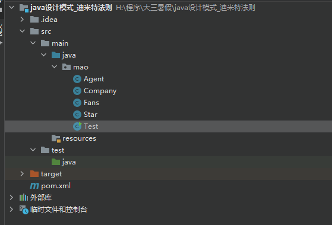


## 合成复用原则

### 概念

合成复用原则是指：尽量先使用组合或者聚合等关联关系来实现，其次才考虑使用继承关系来实现。


通常类的复用分为继承复用和合成复用两种。


继承复用虽然有简单和易实现的优点，但它也存在以下缺点：

1. 继承复用破坏了类的封装性。因为继承会将父类的实现细节暴露给子类，父类对子类是透明的，所以这种复用又称为“白箱”复用。
2. 子类与父类的耦合度高。父类的实现的任何改变都会导致子类的实现发生变化，这不利于类的扩展与维护。
3. 它限制了复用的灵活性。从父类继承而来的实现是静态的，在编译时已经定义，所以在运行时不可能发生变化。


采用组合或聚合复用时，可以将已有对象纳入新对象中，使之成为新对象的一部分，新对象可以调用已有对象的功能，它有以下优点：

1. 它维持了类的封装性。因为成分对象的内部细节是新对象看不见的，所以这种复用又称为“黑箱”复用。
2. 对象间的耦合度低。可以在类的成员位置声明抽象。
3. 复用的灵活性高。这种复用可以在运行时动态进行，新对象可以动态地引用与成分对象类型相同的对象。


### 示例

汽车分类管理程序

汽车按“动力源”划分可分为汽油汽车、电动汽车等；按“颜色”划分可分为白色汽车、黑色汽车和红色汽车等。如果同时考虑这两种分类，其组合就很多。类图如下： 


```java
package mao.before;

/**
 * Project name(项目名称)：java设计模式_合成复用原则
 * Package(包名): mao.before
 * Class(类名): Car
 * Author(作者）: mao
 * Author QQ：1296193245
 * GitHub：https://github.com/maomao124/
 * Date(创建日期)： 2022/8/11
 * Time(创建时间)： 20:20
 * Version(版本): 1.0
 * Description(描述)： 无
 */

public class Car
{
    public void move()
    {
        System.out.println("汽车移动");
    }
}
```


```java
package mao.before;

/**
 * Project name(项目名称)：java设计模式_合成复用原则
 * Package(包名): mao.before
 * Class(类名): ElectricCar
 * Author(作者）: mao
 * Author QQ：1296193245
 * GitHub：https://github.com/maomao124/
 * Date(创建日期)： 2022/8/11
 * Time(创建时间)： 20:23
 * Version(版本): 1.0
 * Description(描述)： 无
 */

public class ElectricCar extends Car
{
    @Override
    public void move()
    {
        System.out.println("电动汽车移动");
    }
}
```


```java
package mao.before;

/**
 * Project name(项目名称)：java设计模式_合成复用原则
 * Package(包名): mao.before
 * Class(类名): PetrolCar
 * Author(作者）: mao
 * Author QQ：1296193245
 * GitHub：https://github.com/maomao124/
 * Date(创建日期)： 2022/8/11
 * Time(创建时间)： 20:21
 * Version(版本): 1.0
 * Description(描述)： 无
 */

public class PetrolCar extends Car
{
    @Override
    public void move()
    {
        System.out.println("汽油汽车移动");
    }
}
```


```java
package mao.before;

/**
 * Project name(项目名称)：java设计模式_合成复用原则
 * Package(包名): mao.before
 * Class(类名): RedElectricCar
 * Author(作者）: mao
 * Author QQ：1296193245
 * GitHub：https://github.com/maomao124/
 * Date(创建日期)： 2022/8/11
 * Time(创建时间)： 20:26
 * Version(版本): 1.0
 * Description(描述)： 无
 */

public class RedElectricCar extends ElectricCar
{
    @Override
    public void move()
    {
        System.out.println("红色电动汽车移动");
    }
}
```


```java
package mao.before;

/**
 * Project name(项目名称)：java设计模式_合成复用原则
 * Package(包名): mao.before
 * Class(类名): RedPetrolCar
 * Author(作者）: mao
 * Author QQ：1296193245
 * GitHub：https://github.com/maomao124/
 * Date(创建日期)： 2022/8/11
 * Time(创建时间)： 20:23
 * Version(版本): 1.0
 * Description(描述)： 无
 */

public class RedPetrolCar extends PetrolCar
{
    @Override
    public void move()
    {
        System.out.println("红色汽油汽车移动");
    }
}
```


```java
package mao.before;

/**
 * Project name(项目名称)：java设计模式_合成复用原则
 * Package(包名): mao.before
 * Class(类名): WhiteElectricCar
 * Author(作者）: mao
 * Author QQ：1296193245
 * GitHub：https://github.com/maomao124/
 * Date(创建日期)： 2022/8/11
 * Time(创建时间)： 20:26
 * Version(版本): 1.0
 * Description(描述)： 无
 */

public class WhiteElectricCar extends ElectricCar
{
    @Override
    public void move()
    {
        System.out.println("红色电动汽车移动");
    }
}
```


```java
package mao.before;

/**
 * Project name(项目名称)：java设计模式_合成复用原则
 * Package(包名): mao.before
 * Class(类名): WhitePetrolCar
 * Author(作者）: mao
 * Author QQ：1296193245
 * GitHub：https://github.com/maomao124/
 * Date(创建日期)： 2022/8/11
 * Time(创建时间)： 20:25
 * Version(版本): 1.0
 * Description(描述)： 无
 */

public class WhitePetrolCar extends PetrolCar
{
    @Override
    public void move()
    {
        System.out.println("白色汽油汽车移动");
    }
}
```


```java
package mao.before;

/**
 * Project name(项目名称)：java设计模式_合成复用原则
 * Package(包名): mao.before
 * Class(类名): Test
 * Author(作者）: mao
 * Author QQ：1296193245
 * GitHub：https://github.com/maomao124/
 * Date(创建日期)： 2022/8/11
 * Time(创建时间)： 20:27
 * Version(版本): 1.0
 * Description(描述)： 无
 */

public class Test
{
    public static void main(String[] args)
    {
        Car car=new RedElectricCar();
        car.move();
    }
}
```


**改进：**

我们可以看到使用继承复用产生了很多子类，如果现在又有新的动力源或者新的颜色的话，就需要再定义新的类

将继承复用改为聚合复用


```java
package mao.after;

/**
 * Project name(项目名称)：java设计模式_合成复用原则
 * Package(包名): mao.after
 * Class(类名): Car
 * Author(作者）: mao
 * Author QQ：1296193245
 * GitHub：https://github.com/maomao124/
 * Date(创建日期)： 2022/8/11
 * Time(创建时间)： 20:31
 * Version(版本): 1.0
 * Description(描述)： 无
 */


public class Car
{
    /**
     * The Color.
     */
    protected Color color;

    /**
     * Instantiates a new Car.
     *
     * @param color the color
     */
    public Car(Color color)
    {
        this.color = color;
    }

    /**
     * Gets color.
     *
     * @return the color
     */
    public Color getColor()
    {
        return color;
    }

    /**
     * Sets color.
     *
     * @param color the color
     */
    public void setColor(Color color)
    {
        this.color = color;
    }

    /**
     * Move.
     */
    public void move()
    {
        System.out.println(color.getColor() + "汽车移动");
    }
}
```


```java
package mao.after;

/**
 * Project name(项目名称)：java设计模式_合成复用原则
 * Package(包名): mao.after
 * Interface(接口名): Color
 * Author(作者）: mao
 * Author QQ：1296193245
 * GitHub：https://github.com/maomao124/
 * Date(创建日期)： 2022/8/11
 * Time(创建时间)： 20:32
 * Version(版本): 1.0
 * Description(描述)： 无
 */

public interface Color
{
    String getColor();
}
```


```java
package mao.after;

/**
 * Project name(项目名称)：java设计模式_合成复用原则
 * Package(包名): mao.after
 * Class(类名): ElectricCar
 * Author(作者）: mao
 * Author QQ：1296193245
 * GitHub：https://github.com/maomao124/
 * Date(创建日期)： 2022/8/11
 * Time(创建时间)： 20:33
 * Version(版本): 1.0
 * Description(描述)： 无
 */

public class ElectricCar extends Car
{

    public ElectricCar(Color color)
    {
        super(color);
    }

    @Override
    public void move()
    {
        System.out.println(color.getColor() + "电动汽车移动");
    }
}
```


```java
package mao.after;

/**
 * Project name(项目名称)：java设计模式_合成复用原则
 * Package(包名): mao.after
 * Class(类名): PetrolCar
 * Author(作者）: mao
 * Author QQ：1296193245
 * GitHub：https://github.com/maomao124/
 * Date(创建日期)： 2022/8/11
 * Time(创建时间)： 20:37
 * Version(版本): 1.0
 * Description(描述)： 无
 */

public class PetrolCar extends Car
{

    public PetrolCar(Color color)
    {
        super(color);
    }

    @Override
    public void move()
    {
        System.out.println(color.getColor() + "汽油汽车移动");
    }
}
```


```java
package mao.after;

/**
 * Project name(项目名称)：java设计模式_合成复用原则
 * Package(包名): mao.after
 * Class(类名): Red
 * Author(作者）: mao
 * Author QQ：1296193245
 * GitHub：https://github.com/maomao124/
 * Date(创建日期)： 2022/8/11
 * Time(创建时间)： 20:38
 * Version(版本): 1.0
 * Description(描述)： 无
 */

public class Red implements Color
{

    @Override
    public String getColor()
    {
        return "红色";
    }
}
```


```java
package mao.after;

/**
 * Project name(项目名称)：java设计模式_合成复用原则
 * Package(包名): mao.after
 * Class(类名): White
 * Author(作者）: mao
 * Author QQ：1296193245
 * GitHub：https://github.com/maomao124/
 * Date(创建日期)： 2022/8/11
 * Time(创建时间)： 20:39
 * Version(版本): 1.0
 * Description(描述)： 无
 */

public class White implements Color
{

    @Override
    public String getColor()
    {
        return "白色";
    }
}
```


```java
package mao.after;

/**
 * Project name(项目名称)：java设计模式_合成复用原则
 * Package(包名): mao.after
 * Class(类名): Test
 * Author(作者）: mao
 * Author QQ：1296193245
 * GitHub：https://github.com/maomao124/
 * Date(创建日期)： 2022/8/11
 * Time(创建时间)： 20:39
 * Version(版本): 1.0
 * Description(描述)： 无
 */

public class Test
{
    public static void main(String[] args)
    {
        Car car = new ElectricCar(new White());
        car.move();
        car = new ElectricCar(new Red());
        car.move();
        car = new PetrolCar(new Red());
        car.move();
        car = new PetrolCar(new White());
        car.move();
    }
}
```


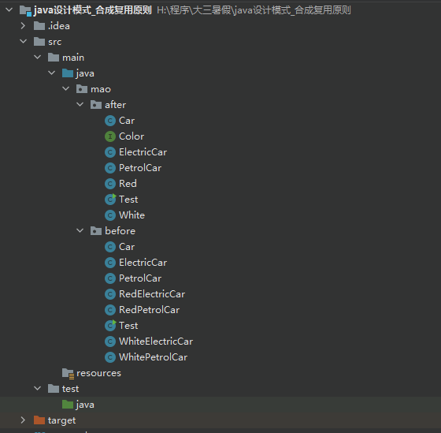


# 创建者模式

创建型模式的主要关注点是“怎样创建对象？”，它的主要特点是“将对象的创建与使用分离”。

这样可以降低系统的耦合度，使用者不需要关注对象的创建细节。


创建型模式分为：

* 单例模式
* 工厂方法模式
* 抽象工厂模式
* 原型模式
* 建造者模式


## 单例模式

单例模式（Singleton Pattern）是 Java 中最简单的设计模式之一。这种类型的设计模式属于创建型模式，它提供了一种创建对象的最佳方式。

这种模式涉及到一个单一的类，该类负责创建自己的对象，同时确保只有单个对象被创建。这个类提供了一种访问其唯一的对象的方式，可以直接访问，不需要实例化该类的对象。


### 结构

单例模式的主要有以下角色：

* 单例类。只能创建一个实例的类
* 访问类。使用单例类


### 实现

单例设计模式分类两种：

* 饿汉式：类加载就会导致该单实例对象被创建	

* 懒汉式：类加载不会导致该单实例对象被创建，而是首次使用该对象时才会创建


#### 饿汉式-静态变量方式


```java
package mao.m1;

/**
 * Project name(项目名称)：java设计模式_单例模式
 * Package(包名): mao.m1
 * Class(类名): Singleton
 * Author(作者）: mao
 * Author QQ：1296193245
 * GitHub：https://github.com/maomao124/
 * Date(创建日期)： 2022/8/11
 * Time(创建时间)： 20:56
 * Version(版本): 1.0
 * Description(描述)： 饿汉式-方式1（静态变量方式）
 */

public class Singleton
{
    public String str = "hello world";

    public String show()
    {
        return "show";
    }

    /**
     * 私有化构造方法
     */
    private Singleton()
    {
        System.out.println("实例私有化构造方法");
    }

    private static final Singleton instance = new Singleton();

    /**
     * 对外提供静态方法获取该对象
     *
     * @return Singleton对象
     */
    public static Singleton getInstance()
    {
        return instance;
    }
}

```


```java
package mao.m1;

/**
 * Project name(项目名称)：java设计模式_单例模式
 * Package(包名): mao.m1
 * Class(类名): Test
 * Author(作者）: mao
 * Author QQ：1296193245
 * GitHub：https://github.com/maomao124/
 * Date(创建日期)： 2022/8/11
 * Time(创建时间)： 20:59
 * Version(版本): 1.0
 * Description(描述)： 无
 */

public class Test
{
    public static void main(String[] args)
    {
        System.out.println(Singleton.getInstance().str);
        System.out.println(Singleton.getInstance().show());
        //打印的内存地址都一样，单例
        System.out.println(Singleton.getInstance());
        System.out.println(Singleton.getInstance());
        System.out.println(Singleton.getInstance());
    }
}
```


该方式在成员位置声明Singleton类型的静态变量，并创建Singleton类的对象instance。instance对象是随着类的加载而创建的。如果该对象足够大的话，而一直没有使用就会造成内存的浪费。


#### 饿汉式-静态代码块方式


```java
package mao.m2;

/**
 * Project name(项目名称)：java设计模式_单例模式
 * Package(包名): mao.m2
 * Class(类名): Singleton
 * Author(作者）: mao
 * Author QQ：1296193245
 * GitHub：https://github.com/maomao124/
 * Date(创建日期)： 2022/8/11
 * Time(创建时间)： 21:08
 * Version(版本): 1.0
 * Description(描述)： 饿汉式-方式2（静态代码块方式）
 */

public class Singleton
{
    public String str = "hello world";

    public String show()
    {
        return "show";
    }

    /**
     * 私有化构造方法
     */
    private Singleton()
    {
        System.out.println("实例私有化构造方法");
    }

    private static final Singleton instance;


    static
    {
        System.out.println("创建单例对象实例");
        instance = new Singleton();
    }

    /**
     * 对外提供静态方法获取该对象
     *
     * @return Singleton对象
     */
    public static Singleton getInstance()
    {
        return instance;
    }
}

```


```java
package mao.m2;


/**
 * Project name(项目名称)：java设计模式_单例模式
 * Package(包名): mao.m2
 * Class(类名): Test
 * Author(作者）: mao
 * Author QQ：1296193245
 * GitHub：https://github.com/maomao124/
 * Date(创建日期)： 2022/8/11
 * Time(创建时间)： 21:10
 * Version(版本): 1.0
 * Description(描述)： 无
 */

public class Test
{
    public static void main(String[] args) throws InterruptedException, ClassNotFoundException
    {
        Class.forName("mao.m2.Singleton");
        Thread.sleep(1000);
        System.out.println(Singleton.getInstance().str);
        System.out.println(Singleton.getInstance().show());
        //打印的内存地址都一样，单例
        System.out.println(Singleton.getInstance());
        System.out.println(Singleton.getInstance());
        System.out.println(Singleton.getInstance());
    }
}
```


在成员位置声明Singleton类型的静态变量，而对象的创建是在静态代码块中，也是对着类的加载而创建。所以和饿汉式的方式1基本上一样，当然该方式也存在内存浪费问题


#### 懒汉式-方式1


```java
package mao.m3;

/**
 * Project name(项目名称)：java设计模式_单例模式
 * Package(包名): mao.m3
 * Class(类名): Singleton
 * Author(作者）: mao
 * Author QQ：1296193245
 * GitHub：https://github.com/maomao124/
 * Date(创建日期)： 2022/8/11
 * Time(创建时间)： 21:14
 * Version(版本): 1.0
 * Description(描述)： 懒汉式-方式1（线程不安全）
 */

public class Singleton
{
    public String str = "hello world";

    public String show()
    {
        return "show";
    }

    /**
     * 私有化构造方法
     */
    private Singleton()
    {
        System.out.println("实例私有化构造方法");
    }

    private static Singleton instance;

    /**
     * 对外提供方法获取该对象
     * 线程不安全
     *
     * @return Singleton对象
     */
    public static Singleton getInstance()
    {
        if (instance == null)
        {
            //线程1运行到这里，进行上下文切换，切换到线程2，线程2进行判空，并进行赋值，
            //赋值后，线程2切换到线程1，由于判空已经执行，直接创建对象，对象创建两次
            System.out.println("创建对象实例");
            instance = new Singleton();
        }
        return instance;
    }
}

```


```java
package mao.m3;


/**
 * Project name(项目名称)：java设计模式_单例模式
 * Package(包名): mao.m3
 * Class(类名): Test
 * Author(作者）: mao
 * Author QQ：1296193245
 * GitHub：https://github.com/maomao124/
 * Date(创建日期)： 2022/8/11
 * Time(创建时间)： 21:20
 * Version(版本): 1.0
 * Description(描述)： 无
 */

public class Test
{
    public static void main(String[] args) throws ClassNotFoundException, InterruptedException
    {
        Class.forName("mao.m3.Singleton");
        Thread.sleep(1000);
        System.out.println(Singleton.getInstance().str);
        System.out.println(Singleton.getInstance().show());
        //打印的内存地址都一样，单例
        System.out.println(Singleton.getInstance());
        System.out.println(Singleton.getInstance());
        System.out.println(Singleton.getInstance());
    }
}

```


```java
package mao.m3;

/**
 * Project name(项目名称)：java设计模式_单例模式
 * Package(包名): mao.m3
 * Class(类名): Test2
 * Author(作者）: mao
 * Author QQ：1296193245
 * GitHub：https://github.com/maomao124/
 * Date(创建日期)： 2022/8/11
 * Time(创建时间)： 21:31
 * Version(版本): 1.0
 * Description(描述)： 无
 */

public class Test2
{
    public static void main(String[] args)
    {
        Thread[] threads = new Thread[100];
        for (int i = 0; i < 100; i++)
        {
            //可简写为：new Thread(Singleton::getInstance);
            threads[i] = new Thread(new Runnable()
            {
                @Override
                public void run()
                {
                    System.out.println(Singleton.getInstance());
                }
            });
        }
        for (int i = 0; i < 100; i++)
        {
            threads[i].start();
        }
    }
}
```


test2运行结果：

```sh
创建对象实例
创建对象实例
实例私有化构造方法
创建对象实例
实例私有化构造方法
创建对象实例
实例私有化构造方法
创建对象实例
实例私有化构造方法
创建对象实例
创建对象实例
实例私有化构造方法
创建对象实例
实例私有化构造方法
mao.m3.Singleton@44919543
mao.m3.Singleton@44919543
创建对象实例
实例私有化构造方法
mao.m3.Singleton@44919543
创建对象实例
实例私有化构造方法
创建对象实例
实例私有化构造方法
mao.m3.Singleton@eeed4d4
mao.m3.Singleton@47b3f5dd
mao.m3.Singleton@47b3f5dd
mao.m3.Singleton@44919543
mao.m3.Singleton@150a7ec8
mao.m3.Singleton@13a6f77f
mao.m3.Singleton@150a7ec8
实例私有化构造方法
mao.m3.Singleton@13a6f77f
mao.m3.Singleton@13a6f77f
mao.m3.Singleton@283642b1
mao.m3.Singleton@180dfe73
mao.m3.Singleton@180dfe73
mao.m3.Singleton@5f57cf75
mao.m3.Singleton@5f57cf75
创建对象实例
实例私有化构造方法
实例私有化构造方法
创建对象实例
实例私有化构造方法
mao.m3.Singleton@2d34897e
mao.m3.Singleton@2d34897e
mao.m3.Singleton@4e202e1f
mao.m3.Singleton@ed99c76
mao.m3.Singleton@6de48836
mao.m3.Singleton@6de48836
mao.m3.Singleton@ed99c76
mao.m3.Singleton@ed99c76
mao.m3.Singleton@ed99c76
mao.m3.Singleton@ed99c76
mao.m3.Singleton@6de48836
mao.m3.Singleton@ed99c76
mao.m3.Singleton@451669b0
mao.m3.Singleton@ed99c76
mao.m3.Singleton@451669b0
mao.m3.Singleton@451669b0
mao.m3.Singleton@451669b0
mao.m3.Singleton@451669b0
mao.m3.Singleton@451669b0
mao.m3.Singleton@eeed4d4
mao.m3.Singleton@6de48836
mao.m3.Singleton@6de48836
mao.m3.Singleton@6de48836
mao.m3.Singleton@6de48836
mao.m3.Singleton@6de48836
mao.m3.Singleton@6de48836
mao.m3.Singleton@6de48836
mao.m3.Singleton@6de48836
mao.m3.Singleton@6de48836
mao.m3.Singleton@6de48836
mao.m3.Singleton@6de48836
mao.m3.Singleton@6de48836
mao.m3.Singleton@6de48836
mao.m3.Singleton@6de48836
mao.m3.Singleton@6de48836
mao.m3.Singleton@6de48836
mao.m3.Singleton@6de48836
mao.m3.Singleton@6de48836
mao.m3.Singleton@6de48836
mao.m3.Singleton@6de48836
mao.m3.Singleton@6de48836
mao.m3.Singleton@6de48836
mao.m3.Singleton@6de48836
mao.m3.Singleton@6de48836
mao.m3.Singleton@6de48836
mao.m3.Singleton@6de48836
mao.m3.Singleton@6de48836
mao.m3.Singleton@6de48836
mao.m3.Singleton@6de48836
mao.m3.Singleton@6de48836
mao.m3.Singleton@6de48836
mao.m3.Singleton@6de48836
mao.m3.Singleton@6de48836
mao.m3.Singleton@6de48836
mao.m3.Singleton@6de48836
mao.m3.Singleton@6de48836
mao.m3.Singleton@6de48836
mao.m3.Singleton@6de48836
mao.m3.Singleton@6de48836
mao.m3.Singleton@6de48836
mao.m3.Singleton@6de48836
mao.m3.Singleton@6de48836
mao.m3.Singleton@6de48836
mao.m3.Singleton@6de48836
mao.m3.Singleton@6de48836
mao.m3.Singleton@6de48836
mao.m3.Singleton@6de48836	
mao.m3.Singleton@6de48836
mao.m3.Singleton@6de48836
mao.m3.Singleton@6de48836
mao.m3.Singleton@6de48836
mao.m3.Singleton@6de48836
mao.m3.Singleton@6de48836
mao.m3.Singleton@6de48836
mao.m3.Singleton@6de48836
mao.m3.Singleton@6de48836
mao.m3.Singleton@6de48836
mao.m3.Singleton@6de48836
mao.m3.Singleton@6de48836
mao.m3.Singleton@6de48836
mao.m3.Singleton@6de48836
mao.m3.Singleton@6de48836
mao.m3.Singleton@6de48836
```


该方式在成员位置声明Singleton类型的静态变量，并没有进行对象的赋值操作，当调用getInstance()方法获取Singleton类的对象的时候才创建Singleton类的对象，这样就实现了懒加载的效果。但是，如果是多线程环境，会出现线程安全问题


#### 懒汉式-方式2

加同步锁


```java
package mao.m4;

/**
 * Project name(项目名称)：java设计模式_单例模式
 * Package(包名): mao.m4
 * Class(类名): Singleton
 * Author(作者）: mao
 * Author QQ：1296193245
 * GitHub：https://github.com/maomao124/
 * Date(创建日期)： 2022/8/11
 * Time(创建时间)： 22:10
 * Version(版本): 1.0
 * Description(描述)： 懒汉式-方式2（线程安全）
 */

public class Singleton
{
    public String str = "hello world";

    public String show()
    {
        return "show";
    }

    /**
     * 私有化构造方法
     */
    private Singleton()
    {
        System.out.println("实例私有化构造方法");
    }

    private static Singleton instance;

    /**
     * 对外提供方法获取该对象
     * 线程安全
     *
     * @return Singleton对象
     */
    public synchronized static Singleton getInstance()
    {
        if (instance == null)
        {
            System.out.println("创建对象实例");
            instance = new Singleton();
        }
        return instance;
    }
}
```


```java
package mao.m4;


/**
 * Project name(项目名称)：java设计模式_单例模式
 * Package(包名): mao.m4
 * Class(类名): Test
 * Author(作者）: mao
 * Author QQ：1296193245
 * GitHub：https://github.com/maomao124/
 * Date(创建日期)： 2022/8/11
 * Time(创建时间)： 22:11
 * Version(版本): 1.0
 * Description(描述)： 无
 */

public class Test
{
    public static void main(String[] args) throws ClassNotFoundException, InterruptedException
    {
        Class.forName("mao.m4.Singleton");
        Thread.sleep(1000);
        System.out.println(Singleton.getInstance().str);
        System.out.println(Singleton.getInstance().show());
        //打印的内存地址都一样，单例
        System.out.println(Singleton.getInstance());
        System.out.println(Singleton.getInstance());
        System.out.println(Singleton.getInstance());
    }
}
```


```java
package mao.m4;

/**
 * Project name(项目名称)：java设计模式_单例模式
 * Package(包名): mao.m4
 * Class(类名): Test2
 * Author(作者）: mao
 * Author QQ：1296193245
 * GitHub：https://github.com/maomao124/
 * Date(创建日期)： 2022/8/11
 * Time(创建时间)： 22:12
 * Version(版本): 1.0
 * Description(描述)： 无
 */

public class Test2
{
    public static void main(String[] args)
    {
        Thread[] threads = new Thread[100];
        for (int i = 0; i < 100; i++)
        {
            //可简写为：new Thread(Singleton::getInstance);
            threads[i] = new Thread(new Runnable()
            {
                @Override
                public void run()
                {
                    System.out.println(Singleton.getInstance());
                }
            });
        }
        for (int i = 0; i < 100; i++)
        {
            threads[i].start();
        }
    }
}
```


Tets2运行结果：

```sh
创建对象实例
实例私有化构造方法
mao.m4.Singleton@6abb6ab
mao.m4.Singleton@6abb6ab
mao.m4.Singleton@6abb6ab
mao.m4.Singleton@6abb6ab
mao.m4.Singleton@6abb6ab
mao.m4.Singleton@6abb6ab
mao.m4.Singleton@6abb6ab
mao.m4.Singleton@6abb6ab
mao.m4.Singleton@6abb6ab
mao.m4.Singleton@6abb6ab
mao.m4.Singleton@6abb6ab
mao.m4.Singleton@6abb6ab
mao.m4.Singleton@6abb6ab
mao.m4.Singleton@6abb6ab
mao.m4.Singleton@6abb6ab
mao.m4.Singleton@6abb6ab
mao.m4.Singleton@6abb6ab
mao.m4.Singleton@6abb6ab
mao.m4.Singleton@6abb6ab
mao.m4.Singleton@6abb6ab
mao.m4.Singleton@6abb6ab
mao.m4.Singleton@6abb6ab
mao.m4.Singleton@6abb6ab
mao.m4.Singleton@6abb6ab
mao.m4.Singleton@6abb6ab
mao.m4.Singleton@6abb6ab
mao.m4.Singleton@6abb6ab
mao.m4.Singleton@6abb6ab
mao.m4.Singleton@6abb6ab
mao.m4.Singleton@6abb6ab
mao.m4.Singleton@6abb6ab
mao.m4.Singleton@6abb6ab
mao.m4.Singleton@6abb6ab
mao.m4.Singleton@6abb6ab
mao.m4.Singleton@6abb6ab
mao.m4.Singleton@6abb6ab
mao.m4.Singleton@6abb6ab
mao.m4.Singleton@6abb6ab
mao.m4.Singleton@6abb6ab
mao.m4.Singleton@6abb6ab
mao.m4.Singleton@6abb6ab
mao.m4.Singleton@6abb6ab
mao.m4.Singleton@6abb6ab
mao.m4.Singleton@6abb6ab
mao.m4.Singleton@6abb6ab
mao.m4.Singleton@6abb6ab
mao.m4.Singleton@6abb6ab
mao.m4.Singleton@6abb6ab
mao.m4.Singleton@6abb6ab
mao.m4.Singleton@6abb6ab
mao.m4.Singleton@6abb6ab
mao.m4.Singleton@6abb6ab
mao.m4.Singleton@6abb6ab
mao.m4.Singleton@6abb6ab
mao.m4.Singleton@6abb6ab
mao.m4.Singleton@6abb6ab
mao.m4.Singleton@6abb6ab
mao.m4.Singleton@6abb6ab
mao.m4.Singleton@6abb6ab
mao.m4.Singleton@6abb6ab
mao.m4.Singleton@6abb6ab
mao.m4.Singleton@6abb6ab
mao.m4.Singleton@6abb6ab
mao.m4.Singleton@6abb6ab
mao.m4.Singleton@6abb6ab
mao.m4.Singleton@6abb6ab
mao.m4.Singleton@6abb6ab
mao.m4.Singleton@6abb6ab
mao.m4.Singleton@6abb6ab
mao.m4.Singleton@6abb6ab
mao.m4.Singleton@6abb6ab
mao.m4.Singleton@6abb6ab
mao.m4.Singleton@6abb6ab
mao.m4.Singleton@6abb6ab
mao.m4.Singleton@6abb6ab
mao.m4.Singleton@6abb6ab
mao.m4.Singleton@6abb6ab
mao.m4.Singleton@6abb6ab
mao.m4.Singleton@6abb6ab
mao.m4.Singleton@6abb6ab
mao.m4.Singleton@6abb6ab
mao.m4.Singleton@6abb6ab
mao.m4.Singleton@6abb6ab
mao.m4.Singleton@6abb6ab
mao.m4.Singleton@6abb6ab
mao.m4.Singleton@6abb6ab
mao.m4.Singleton@6abb6ab
mao.m4.Singleton@6abb6ab
mao.m4.Singleton@6abb6ab
mao.m4.Singleton@6abb6ab
mao.m4.Singleton@6abb6ab
mao.m4.Singleton@6abb6ab
mao.m4.Singleton@6abb6ab
mao.m4.Singleton@6abb6ab
mao.m4.Singleton@6abb6ab
mao.m4.Singleton@6abb6ab
mao.m4.Singleton@6abb6ab
mao.m4.Singleton@6abb6ab
mao.m4.Singleton@6abb6ab
mao.m4.Singleton@6abb6ab
```


该方式也实现了懒加载效果，同时又解决了线程安全问题。但是在getInstance()方法上添加了synchronized关键字，导致该方法的执行效果特别低。


#### 懒汉式-方式3

使用双重检查锁

对于 `getInstance()` 方法来说，绝大部分的操作都是读操作，读操作是线程安全的，所以我们没必让每个线程必须持有锁才能调用该方法，我们需要调整加锁的时机。由此也产生了一种新的实现模式：双重检查锁模式


```java
package mao.m5;

/**
 * Project name(项目名称)：java设计模式_单例模式
 * Package(包名): mao.m5
 * Class(类名): Singleton
 * Author(作者）: mao
 * Author QQ：1296193245
 * GitHub：https://github.com/maomao124/
 * Date(创建日期)： 2022/8/11
 * Time(创建时间)： 22:28
 * Version(版本): 1.0
 * Description(描述)： 懒汉式-方式3（双重检查锁）
 */

public class Singleton
{
    public String str = "hello world";

    public String show()
    {
        return "show";
    }

    /**
     * 私有化构造方法
     */
    private Singleton()
    {
        System.out.println("实例私有化构造方法");
    }

    private static Singleton instance;

    /**
     * 对外提供方法获取该对象
     * 线程安全
     *
     * @return Singleton对象
     */
    public static Singleton getInstance()
    {
        //第一次判断，如果instance不为null，不进入抢锁阶段，直接返回实例
        if (instance == null)
        {
            synchronized (Singleton.class)
            {
                //抢到锁之后再次判断是否为null
                if (instance == null)
                {
                    System.out.println("创建对象实例");
                    instance = new Singleton();
                }
            }
        }
        return instance;
    }
}
```


```java
package mao.m5;


/**
 * Project name(项目名称)：java设计模式_单例模式
 * Package(包名): mao.m5
 * Class(类名): Test
 * Author(作者）: mao
 * Author QQ：1296193245
 * GitHub：https://github.com/maomao124/
 * Date(创建日期)： 2022/8/11
 * Time(创建时间)： 22:34
 * Version(版本): 1.0
 * Description(描述)： 无
 */

public class Test
{
    public static void main(String[] args) throws ClassNotFoundException, InterruptedException
    {
        Class.forName("mao.m5.Singleton");
        Thread.sleep(1000);
        System.out.println(Singleton.getInstance().str);
        System.out.println(Singleton.getInstance().show());
        //打印的内存地址都一样，单例
        System.out.println(Singleton.getInstance());
        System.out.println(Singleton.getInstance());
        System.out.println(Singleton.getInstance());
    }
}
```


```java
package mao.m5;


/**
 * Project name(项目名称)：java设计模式_单例模式
 * Package(包名): mao.m5
 * Class(类名): Test2
 * Author(作者）: mao
 * Author QQ：1296193245
 * GitHub：https://github.com/maomao124/
 * Date(创建日期)： 2022/8/11
 * Time(创建时间)： 22:35
 * Version(版本): 1.0
 * Description(描述)： 无
 */

public class Test2
{
    public static void main(String[] args)
    {
        Thread[] threads = new Thread[100];
        for (int i = 0; i < 100; i++)
        {
            //可简写为：new Thread(Singleton::getInstance);
            threads[i] = new Thread(new Runnable()
            {
                @Override
                public void run()
                {
                    System.out.println(Singleton.getInstance());
                }
            });
        }
        for (int i = 0; i < 100; i++)
        {
            threads[i].start();
        }
    }
}
```


双重检查锁模式是一种非常好的单例实现模式，解决了单例、性能、线程安全问题，上面的双重检测锁模式看上去完美无缺，其实是存在问题，在多线程的情况下，可能会出现空指针问题，出现问题的原因是JVM在实例化对象的时候会进行优化和指令重排序操作。

要解决双重检查锁模式带来空指针异常的问题，只需要使用 `volatile` 关键字, `volatile` 关键字可以保证可见性和有序性。


```java
package mao.m5;

/**
 * Project name(项目名称)：java设计模式_单例模式
 * Package(包名): mao.m5
 * Class(类名): Singleton
 * Author(作者）: mao
 * Author QQ：1296193245
 * GitHub：https://github.com/maomao124/
 * Date(创建日期)： 2022/8/11
 * Time(创建时间)： 22:28
 * Version(版本): 1.0
 * Description(描述)： 懒汉式-方式3（双重检查锁）
 * <p>
 * 在多线程的情况下，可能会出现空指针问题，出现问题的原因是JVM在实例化对象的时候会进行优化和指令重排序操作。
 * 要解决双重检查锁模式带来空指针异常的问题，只需要使用 `volatile` 关键字, `volatile` 关键字可以保证可见性和有序性。
 */

public class Singleton
{
    public String str = "hello world";

    public String show()
    {
        return "show";
    }

    /**
     * 私有化构造方法
     */
    private Singleton()
    {
        System.out.println("实例私有化构造方法");
    }

    private static volatile Singleton instance;

    /**
     * 对外提供方法获取该对象
     * 线程安全
     *
     * @return Singleton对象
     */
    public static Singleton getInstance()
    {
        //第一次判断，如果instance不为null，不进入抢锁阶段，直接返回实例
        if (instance == null)
        {
            synchronized (Singleton.class)
            {
                //抢到锁之后再次判断是否为null
                if (instance == null)
                {
                    System.out.println("创建对象实例");
                    instance = new Singleton();
                }
            }
        }
        return instance;
    }
}
```


#### 懒汉式-方式4

静态内部类方式


静态内部类单例模式中实例由内部类创建，由于 JVM 在加载外部类的过程中, 是不会加载静态内部类的, 只有内部类的属性/方法被调用时才会被加载, 并初始化其静态属性。静态属性由于被 `static` 修饰，保证只被实例化一次，并且严格保证实例化顺序


```java
package mao.m6;

/**
 * Project name(项目名称)：java设计模式_单例模式
 * Package(包名): mao.m6
 * Class(类名): Singleton
 * Author(作者）: mao
 * Author QQ：1296193245
 * GitHub：https://github.com/maomao124/
 * Date(创建日期)： 2022/8/11
 * Time(创建时间)： 22:47
 * Version(版本): 1.0
 * Description(描述)： 懒汉式-方式4（静态内部类方式）
 */

public class Singleton
{
    public String str = "hello world";

    public String show()
    {
        return "show";
    }

    /**
     * 私有化构造方法
     */
    private Singleton()
    {
        System.out.println("实例私有化构造方法");
    }

    private static class SingletonHolder
    {
        //内部类里创建对象
        private static final Singleton INSTANCE = new Singleton();
    }

    /**
     * 对外提供方法获取该对象
     * 线程安全
     *
     * @return Singleton对象
     */
    public static Singleton getInstance()
    {
        return SingletonHolder.INSTANCE;
    }
}
```


第一次加载Singleton类时不会去初始化INSTANCE，只有第一次调用getInstance，虚拟机加载SingletonHolder并初始化INSTANCE，这样不仅能确保线程安全，也能保证 Singleton 类的唯一性。


静态内部类单例模式是一种优秀的单例模式，是开源项目中比较常用的一种单例模式。在没有加任何锁的情况下，保证了多线程下的安全，并且没有任何性能影响和空间的浪费。


```java
package mao.m6;


/**
 * Project name(项目名称)：java设计模式_单例模式
 * Package(包名): mao.m6
 * Class(类名): Test
 * Author(作者）: mao
 * Author QQ：1296193245
 * GitHub：https://github.com/maomao124/
 * Date(创建日期)： 2022/8/11
 * Time(创建时间)： 22:51
 * Version(版本): 1.0
 * Description(描述)： 无
 */

public class Test
{
    public static void main(String[] args) throws ClassNotFoundException, InterruptedException
    {
        Class.forName("mao.m6.Singleton");
        Thread.sleep(1000);
        System.out.println(Singleton.getInstance().str);
        System.out.println(Singleton.getInstance().show());
        //打印的内存地址都一样，单例
        System.out.println(Singleton.getInstance());
        System.out.println(Singleton.getInstance());
        System.out.println(Singleton.getInstance());
    }
}
```


```java
package mao.m6;


/**
 * Project name(项目名称)：java设计模式_单例模式
 * Package(包名): mao.m6
 * Class(类名): Test2
 * Author(作者）: mao
 * Author QQ：1296193245
 * GitHub：https://github.com/maomao124/
 * Date(创建日期)： 2022/8/11
 * Time(创建时间)： 22:52
 * Version(版本): 1.0
 * Description(描述)： 无
 */

public class Test2
{
    public static void main(String[] args)
    {
        Thread[] threads = new Thread[100];
        for (int i = 0; i < 100; i++)
        {
            //可简写为：new Thread(Singleton::getInstance);
            threads[i] = new Thread(new Runnable()
            {
                @Override
                public void run()
                {
                    System.out.println(Singleton.getInstance());
                }
            });
        }
        for (int i = 0; i < 100; i++)
        {
            threads[i].start();
        }
    }
}
```


#### 枚举方式

枚举类实现单例模式是极力推荐的单例实现模式，因为枚举类型是线程安全的，并且只会装载一次，设计者充分的利用了枚举的这个特性来实现单例模式，枚举的写法非常简单，而且枚举类型是所用单例实现中唯一一种不会被破坏的单例实现模式。


```java
package mao.m7;

/**
 * Project name(项目名称)：java设计模式_单例模式
 * Package(包名): mao.m7
 * Enum(枚举名): Singleton
 * Author(作者）: mao
 * Author QQ：1296193245
 * GitHub：https://github.com/maomao124/
 * Date(创建日期)： 2022/8/11
 * Time(创建时间)： 22:57
 * Version(版本): 1.0
 * Description(描述)： 无
 */

public enum Singleton
{
    INSTANCE;

    public String str = "hello world";

    public String show()
    {
        return "show";
    }

    Singleton()
    {
        System.out.println("实例私有化构造方法");
    }
}
```


```java
package mao.m7;


/**
 * Project name(项目名称)：java设计模式_单例模式
 * Package(包名): mao.m7
 * Class(类名): Test
 * Author(作者）: mao
 * Author QQ：1296193245
 * GitHub：https://github.com/maomao124/
 * Date(创建日期)： 2022/8/11
 * Time(创建时间)： 22:57
 * Version(版本): 1.0
 * Description(描述)： 无
 */

public class Test
{
    @SuppressWarnings("all")
    public static void main(String[] args) throws InterruptedException, ClassNotFoundException
    {
        Class.forName("mao.m7.Singleton");
        Thread.sleep(1000);
        System.out.println(Singleton.INSTANCE.str);
        System.out.println(Singleton.INSTANCE.show());
        System.out.println(Singleton.INSTANCE == Singleton.INSTANCE);
        System.out.println(Singleton.INSTANCE);
    }
}
```


```java
package mao.m7;


/**
 * Project name(项目名称)：java设计模式_单例模式
 * Package(包名): mao.m7
 * Class(类名): Test2
 * Author(作者）: mao
 * Author QQ：1296193245
 * GitHub：https://github.com/maomao124/
 * Date(创建日期)： 2022/8/11
 * Time(创建时间)： 23:06
 * Version(版本): 1.0
 * Description(描述)： 无
 */

public class Test2
{
    @SuppressWarnings("all")
    public static void main(String[] args)
    {
        Thread[] threads = new Thread[100];
        for (int i = 0; i < 100; i++)
        {
            //可简写为：new Thread(Singleton::getInstance);
            threads[i] = new Thread(new Runnable()
            {
                @Override
                public void run()
                {
                    System.out.println(Singleton.INSTANCE == Singleton.INSTANCE);
                }
            });
        }
        for (int i = 0; i < 100; i++)
        {
            threads[i].start();
        }
    }
}
```


枚举方式属于恶汉式方式


### 破坏单例模式


使上面定义的单例类（Singleton）可以创建多个对象，枚举方式除外。有两种方式，分别是序列化和反射。


#### 序列化反序列化

拿懒汉式-方式3举例


先实现Serializable接口


```java
package mao.m5;

import java.io.Serializable;

/**
 * Project name(项目名称)：java设计模式_单例模式
 * Package(包名): mao.m5
 * Class(类名): Singleton
 * Author(作者）: mao
 * Author QQ：1296193245
 * GitHub：https://github.com/maomao124/
 * Date(创建日期)： 2022/8/11
 * Time(创建时间)： 22:28
 * Version(版本): 1.0
 * Description(描述)： 懒汉式-方式3（双重检查锁）
 * <p>
 * 在多线程的情况下，可能会出现空指针问题，出现问题的原因是JVM在实例化对象的时候会进行优化和指令重排序操作。
 * 要解决双重检查锁模式带来空指针异常的问题，只需要使用 `volatile` 关键字, `volatile` 关键字可以保证可见性和有序性。
 */

public class Singleton implements Serializable
{
    public String str = "hello world";

    public String show()
    {
        return "show";
    }

    /**
     * 私有化构造方法
     */
    private Singleton()
    {
        System.out.println("实例私有化构造方法");
    }

    private static volatile Singleton instance;

    /**
     * 对外提供方法获取该对象
     * 线程安全
     *
     * @return Singleton对象
     */
    public static Singleton getInstance()
    {
        //第一次判断，如果instance不为null，不进入抢锁阶段，直接返回实例
        if (instance == null)
        {
            synchronized (Singleton.class)
            {
                //抢到锁之后再次判断是否为null
                if (instance == null)
                {
                    System.out.println("创建对象实例");
                    instance = new Singleton();
                }
            }
        }
        return instance;
    }
}
```


```java
package mao.serialization;


import mao.m5.Singleton;

import java.awt.*;
import java.io.*;

/**
 * Project name(项目名称)：java设计模式_破坏单例模式
 * Package(包名): mao.serialization
 * Class(类名): SingletonIO
 * Author(作者）: mao
 * Author QQ：1296193245
 * GitHub：https://github.com/maomao124/
 * Date(创建日期)： 2022/8/12
 * Time(创建时间)： 19:38
 * Version(版本): 1.0
 * Description(描述)： 无
 */

public class SingletonIO
{
    private SingletonIO()
    {

    }

    /**
     * 将对象写入文件
     *
     * @param singleton mao.m5.Singleton
     * @param path      文件的路径
     */
    public static void write(mao.m5.Singleton singleton, String path)
    {
        File file = null;
        FileOutputStream fileOutputStream = null;
        ObjectOutputStream objectOutputStream = null;
        try                                  //文件流打开，文件读写
        {
            file = new File(path);
            fileOutputStream = new FileOutputStream(file);
            objectOutputStream = new ObjectOutputStream(fileOutputStream);
            objectOutputStream.writeObject(singleton);
        }
        catch (FileNotFoundException e)      //文件未找到
        {
            Toolkit.getDefaultToolkit().beep();
            System.err.println("文件未找到！！！  " + "\n错误内容：" + e.toString());
        }
        catch (Exception e)                  //其它异常
        {
            Toolkit.getDefaultToolkit().beep();
            e.printStackTrace();
        }
        finally
        {
            try                              //关闭流
            {
                if (fileOutputStream != null)
                {
                    fileOutputStream.close();
                }

            }
            catch (NullPointerException e)    //空指针异常
            {
                Toolkit.getDefaultToolkit().beep();
                System.err.println("文件已经被关闭，无法再次关闭！！！");
            }
            catch (Exception e)              //其它异常
            {
                Toolkit.getDefaultToolkit().beep();
                e.printStackTrace();
            }

            try                              //关闭流
            {
                if (objectOutputStream != null)
                {
                    objectOutputStream.close();
                }
            }
            catch (NullPointerException e)    //空指针异常
            {
                Toolkit.getDefaultToolkit().beep();
                System.err.println("文件已经被关闭，无法再次关闭！！！");
            }
            catch (Exception e)              //其它异常
            {
                Toolkit.getDefaultToolkit().beep();
                e.printStackTrace();
            }
        }
    }

    /**
     * 从文件里读对象
     *
     * @param path 文件路径
     * @return mao.m5.Singleton
     */
    public static mao.m5.Singleton read(String path)
    {
        File file = null;
        FileInputStream fileInputStream = null;
        ObjectInputStream objectInputStream = null;
        try                                  //文件流打开，文件读写
        {
            file = new File(path);
            fileInputStream = new FileInputStream(file);
            objectInputStream = new ObjectInputStream(fileInputStream);
            Object object = objectInputStream.readObject();
            return (Singleton) object;
        }
        catch (FileNotFoundException e)      //文件未找到
        {
            Toolkit.getDefaultToolkit().beep();
            System.err.println("文件未找到！！！  " + "\n错误内容：" + e.toString());
        }
        catch (Exception e)                  //其它异常
        {
            Toolkit.getDefaultToolkit().beep();
            e.printStackTrace();
        }
        finally
        {
            try                              //关闭流
            {
                if (fileInputStream != null)
                {
                    fileInputStream.close();
                }
            }
            catch (NullPointerException e)    //空指针异常
            {
                Toolkit.getDefaultToolkit().beep();
                System.err.println("文件已经被关闭，无法再次关闭！！！");
            }
            catch (Exception e)              //其它异常
            {
                Toolkit.getDefaultToolkit().beep();
                e.printStackTrace();
            }
            try                              //关闭流
            {
                if (objectInputStream != null)
                {
                    objectInputStream.close();
                }
            }
            catch (NullPointerException e)    //空指针异常
            {
                Toolkit.getDefaultToolkit().beep();
                System.err.println("文件已经被关闭，无法再次关闭！！！");
            }
            catch (Exception e)              //其它异常
            {
                Toolkit.getDefaultToolkit().beep();
                e.printStackTrace();
            }
        }
        return null;
    }
}
```


```java
package mao.serialization;

import mao.m5.Singleton;

/**
 * Project name(项目名称)：java设计模式_破坏单例模式
 * Package(包名): mao.serialization
 * Class(类名): Test
 * Author(作者）: mao
 * Author QQ：1296193245
 * GitHub：https://github.com/maomao124/
 * Date(创建日期)： 2022/8/12
 * Time(创建时间)： 19:49
 * Version(版本): 1.0
 * Description(描述)： 无
 */

public class Test
{
    private static final String PATH = "./Singleton.txt";

    public static void main(String[] args)
    {
        System.out.println(Singleton.getInstance());
        System.out.println(Singleton.getInstance());
        System.out.println("-----");
        SingletonIO.write(Singleton.getInstance(), PATH);
        System.out.println(SingletonIO.read(PATH));
        System.out.println(SingletonIO.read(PATH));
        System.out.println(SingletonIO.read(PATH));
        System.out.println(SingletonIO.read(PATH));
        System.out.println(SingletonIO.read(PATH));
    }
}
```


测试结果：

```sh
创建对象实例
实例私有化构造方法
mao.m5.Singleton@776ec8df
mao.m5.Singleton@776ec8df
-----
mao.m5.Singleton@45ff54e6
mao.m5.Singleton@2328c243
mao.m5.Singleton@bebdb06
mao.m5.Singleton@7a4f0f29
mao.m5.Singleton@45283ce2
```


后面打印的内存地址都不一样，序列化和反序列化已经破坏了单例设计模式


#### 反射

拿mao.m5.Singleton举例


```java
package mao.reflex;

import mao.m5.Singleton;

import java.lang.reflect.Constructor;
import java.lang.reflect.InvocationTargetException;

/**
 * Project name(项目名称)：java设计模式_破坏单例模式
 * Package(包名): mao.reflex
 * Class(类名): Test
 * Author(作者）: mao
 * Author QQ：1296193245
 * GitHub：https://github.com/maomao124/
 * Date(创建日期)： 2022/8/12
 * Time(创建时间)： 19:58
 * Version(版本): 1.0
 * Description(描述)： 反射破坏单例模式
 */

public class Test
{
    public static void main(String[] args)
            throws NoSuchMethodException, InvocationTargetException, InstantiationException, IllegalAccessException
    {
        System.out.println(Singleton.getInstance());
        System.out.println(Singleton.getInstance());
        System.out.println("-----");
        Class<Singleton> singletonClass = Singleton.class;
        //获取Singleton类的私有无参构造方法对象
        Constructor<Singleton> declaredConstructor = singletonClass.getDeclaredConstructor();
        //取消访问检查
        declaredConstructor.setAccessible(true);
        //创建对象
        System.out.println(declaredConstructor.newInstance());
        System.out.println(declaredConstructor.newInstance());
        System.out.println(declaredConstructor.newInstance());
        System.out.println(declaredConstructor.newInstance());
        System.out.println(declaredConstructor.newInstance());
    }
}
```


运行结果：

```sh
创建对象实例
实例私有化构造方法
mao.m5.Singleton@776ec8df
mao.m5.Singleton@776ec8df
-----
实例私有化构造方法
mao.m5.Singleton@4eec7777
实例私有化构造方法
mao.m5.Singleton@3b07d329
实例私有化构造方法
mao.m5.Singleton@41629346
实例私有化构造方法
mao.m5.Singleton@404b9385
实例私有化构造方法
mao.m5.Singleton@6d311334
```


反射破坏了单例设计模式


### 解决破坏单例模式的问题

#### 序列化反序列化

在Singleton类中添加`readResolve()`方法，在反序列化时被反射调用，如果定义了这个方法，就返回这个方法的值，如果没有定义，则返回新new出来的对象。


```java
package mao.serialization_resolve;

import java.io.Serial;
import java.io.Serializable;

/**
 * Project name(项目名称)：java设计模式_破坏单例模式
 * Package(包名): mao.serialization_resolve
 * Class(类名): Singleton
 * Author(作者）: mao
 * Author QQ：1296193245
 * GitHub：https://github.com/maomao124/
 * Date(创建日期)： 2022/8/12
 * Time(创建时间)： 20:06
 * Version(版本): 1.0
 * Description(描述)： 无
 */

public class Singleton implements Serializable
{
    public String str = "hello world";

    public String show()
    {
        return "show";
    }

    /**
     * 私有化构造方法
     */
    private Singleton()
    {
        System.out.println("实例私有化构造方法");
    }

    private static volatile Singleton instance;

    /**
     * 对外提供方法获取该对象
     * 线程安全
     *
     * @return Singleton对象
     */
    public static Singleton getInstance()
    {
        //第一次判断，如果instance不为null，不进入抢锁阶段，直接返回实例
        if (instance == null)
        {
            synchronized (Singleton.class)
            {
                //抢到锁之后再次判断是否为null
                if (instance == null)
                {
                    System.out.println("创建对象实例");
                    instance = new Singleton();
                }
            }
        }
        return instance;
    }

    /**
     * readResolve方法
     *
     * @return Singleton对象
     */
    @Serial
    private Object readResolve()
    {
        System.out.println("调用readResolve方法");
        return getInstance();
    }
}
```


```java
package mao.serialization_resolve;

import java.awt.*;
import java.io.*;

/**
 * Project name(项目名称)：java设计模式_破坏单例模式
 * Package(包名): mao.serialization_resolve
 * Class(类名): SingletonIO
 * Author(作者）: mao
 * Author QQ：1296193245
 * GitHub：https://github.com/maomao124/
 * Date(创建日期)： 2022/8/12
 * Time(创建时间)： 20:10
 * Version(版本): 1.0
 * Description(描述)： 无
 */

public class SingletonIO
{
    private SingletonIO()
    {

    }

    /**
     * 将对象写入文件
     *
     * @param singleton Singleton
     * @param path      文件的路径
     */
    public static void write(Singleton singleton, String path)
    {
        File file = null;
        FileOutputStream fileOutputStream = null;
        ObjectOutputStream objectOutputStream = null;
        try                                  //文件流打开，文件读写
        {
            file = new File(path);
            fileOutputStream = new FileOutputStream(file);
            objectOutputStream = new ObjectOutputStream(fileOutputStream);
            objectOutputStream.writeObject(singleton);
        }
        catch (FileNotFoundException e)      //文件未找到
        {
            Toolkit.getDefaultToolkit().beep();
            System.err.println("文件未找到！！！  " + "\n错误内容：" + e.toString());
        }
        catch (Exception e)                  //其它异常
        {
            Toolkit.getDefaultToolkit().beep();
            e.printStackTrace();
        }
        finally
        {
            try                              //关闭流
            {
                if (fileOutputStream != null)
                {
                    fileOutputStream.close();
                }

            }
            catch (NullPointerException e)    //空指针异常
            {
                Toolkit.getDefaultToolkit().beep();
                System.err.println("文件已经被关闭，无法再次关闭！！！");
            }
            catch (Exception e)              //其它异常
            {
                Toolkit.getDefaultToolkit().beep();
                e.printStackTrace();
            }

            try                              //关闭流
            {
                if (objectOutputStream != null)
                {
                    objectOutputStream.close();
                }
            }
            catch (NullPointerException e)    //空指针异常
            {
                Toolkit.getDefaultToolkit().beep();
                System.err.println("文件已经被关闭，无法再次关闭！！！");
            }
            catch (Exception e)              //其它异常
            {
                Toolkit.getDefaultToolkit().beep();
                e.printStackTrace();
            }
        }
    }

    /**
     * 从文件里读对象
     *
     * @param path 文件路径
     * @return Singleton
     */
    public static Singleton read(String path)
    {
        File file = null;
        FileInputStream fileInputStream = null;
        ObjectInputStream objectInputStream = null;
        try                                  //文件流打开，文件读写
        {
            file = new File(path);
            fileInputStream = new FileInputStream(file);
            objectInputStream = new ObjectInputStream(fileInputStream);
            Object object = objectInputStream.readObject();
            return (Singleton) object;
        }
        catch (FileNotFoundException e)      //文件未找到
        {
            Toolkit.getDefaultToolkit().beep();
            System.err.println("文件未找到！！！  " + "\n错误内容：" + e.toString());
        }
        catch (Exception e)                  //其它异常
        {
            Toolkit.getDefaultToolkit().beep();
            e.printStackTrace();
        }
        finally
        {
            try                              //关闭流
            {
                if (fileInputStream != null)
                {
                    fileInputStream.close();
                }
            }
            catch (NullPointerException e)    //空指针异常
            {
                Toolkit.getDefaultToolkit().beep();
                System.err.println("文件已经被关闭，无法再次关闭！！！");
            }
            catch (Exception e)              //其它异常
            {
                Toolkit.getDefaultToolkit().beep();
                e.printStackTrace();
            }
            try                              //关闭流
            {
                if (objectInputStream != null)
                {
                    objectInputStream.close();
                }
            }
            catch (NullPointerException e)    //空指针异常
            {
                Toolkit.getDefaultToolkit().beep();
                System.err.println("文件已经被关闭，无法再次关闭！！！");
            }
            catch (Exception e)              //其它异常
            {
                Toolkit.getDefaultToolkit().beep();
                e.printStackTrace();
            }
        }
        return null;
    }
}
```


```java
package mao.serialization_resolve;

/**
 * Project name(项目名称)：java设计模式_破坏单例模式
 * Package(包名): mao.serialization_resolve
 * Class(类名): Test
 * Author(作者）: mao
 * Author QQ：1296193245
 * GitHub：https://github.com/maomao124/
 * Date(创建日期)： 2022/8/12
 * Time(创建时间)： 20:09
 * Version(版本): 1.0
 * Description(描述)： 无
 */

public class Test
{
    private static final String PATH = "./Singleton.txt";

    public static void main(String[] args)
    {
        System.out.println(Singleton.getInstance());
        System.out.println(Singleton.getInstance());
        System.out.println("-----");
        SingletonIO.write(Singleton.getInstance(), PATH);
        System.out.println(SingletonIO.read(PATH));
        System.out.println(SingletonIO.read(PATH));
        System.out.println(SingletonIO.read(PATH));
        System.out.println(SingletonIO.read(PATH));
        System.out.println(SingletonIO.read(PATH));
    }
}
```


运行结果：

```sh
创建对象实例
实例私有化构造方法
mao.serialization_resolve.Singleton@776ec8df
mao.serialization_resolve.Singleton@776ec8df
-----
调用readResolve方法
mao.serialization_resolve.Singleton@776ec8df
调用readResolve方法
mao.serialization_resolve.Singleton@776ec8df
调用readResolve方法
mao.serialization_resolve.Singleton@776ec8df
调用readResolve方法
mao.serialization_resolve.Singleton@776ec8df
调用readResolve方法
mao.serialization_resolve.Singleton@776ec8df
```


**源码解析：**

ObjectInputStream类


```java
public final Object readObject() throws IOException, ClassNotFoundException{
    ...
    // if nested read, passHandle contains handle of enclosing object
    int outerHandle = passHandle;
    try {
        Object obj = readObject0(false);//重点查看readObject0方法
    .....
}
    
private Object readObject0(boolean unshared) throws IOException {
	...
    try {
		switch (tc) {
			...
			case TC_OBJECT:
				return checkResolve(readOrdinaryObject(unshared));//重点查看readOrdinaryObject方法
			...
        }
    } finally {
        depth--;
        bin.setBlockDataMode(oldMode);
    }    
}
    
private Object readOrdinaryObject(boolean unshared) throws IOException {
	...
	//isInstantiable 返回true，执行 desc.newInstance()，通过反射创建新的单例类，
    obj = desc.isInstantiable() ? desc.newInstance() : null; 
    ...
    // 在Singleton类中添加 readResolve 方法后 desc.hasReadResolveMethod() 方法执行结果为true
    if (obj != null && handles.lookupException(passHandle) == null && desc.hasReadResolveMethod()) {
    	// 通过反射调用 Singleton 类中的 readResolve 方法，将返回值赋值给rep变量
    	// 这样多次调用ObjectInputStream类中的readObject方法，继而就会调用我们定义的readResolve方法，所以返回的是同一个对象。
    	Object rep = desc.invokeReadResolve(obj);
     	...
    }
    return obj;
}
```


#### 反射

当通过反射方式调用构造方法进行创建创建时，直接抛异常。


```java
package mao.reflex_resolve;

/**
 * Project name(项目名称)：java设计模式_破坏单例模式
 * Package(包名): mao.reflex_resolve
 * Class(类名): Singleton
 * Author(作者）: mao
 * Author QQ：1296193245
 * GitHub：https://github.com/maomao124/
 * Date(创建日期)： 2022/8/12
 * Time(创建时间)： 20:18
 * Version(版本): 1.0
 * Description(描述)： 无
 */

public class Singleton
{
    public String str = "hello world";

    public String show()
    {
        return "show";
    }

    /**
     * 私有化构造方法
     */
    private Singleton()
    {
        if (instance != null)
        {
            throw new RuntimeException("此类的对象单例！");
        }
        System.out.println("实例私有化构造方法");
    }

    private static volatile Singleton instance;

    /**
     * 对外提供方法获取该对象
     * 线程安全
     *
     * @return Singleton对象
     */
    public static Singleton getInstance()
    {
        //第一次判断，如果instance不为null，不进入抢锁阶段，直接返回实例
        if (instance == null)
        {
            synchronized (Singleton.class)
            {
                //抢到锁之后再次判断是否为null
                if (instance == null)
                {
                    System.out.println("创建对象实例");
                    instance = new Singleton();
                }
            }
        }
        return instance;
    }
}
```


```java
package mao.reflex_resolve;

import java.lang.reflect.Constructor;
import java.lang.reflect.InvocationTargetException;

/**
 * Project name(项目名称)：java设计模式_破坏单例模式
 * Package(包名): mao.reflex_resolve
 * Class(类名): Test
 * Author(作者）: mao
 * Author QQ：1296193245
 * GitHub：https://github.com/maomao124/
 * Date(创建日期)： 2022/8/12
 * Time(创建时间)： 20:19
 * Version(版本): 1.0
 * Description(描述)： 无
 */

public class Test
{
    public static void main(String[] args)
            throws NoSuchMethodException, InvocationTargetException, InstantiationException, IllegalAccessException
    {
        System.out.println(Singleton.getInstance());
        System.out.println(Singleton.getInstance());
        System.out.println("-----");
        Class<Singleton> singletonClass = Singleton.class;
        //获取Singleton类的私有无参构造方法对象
        Constructor<Singleton> declaredConstructor = singletonClass.getDeclaredConstructor();
        //取消访问检查
        declaredConstructor.setAccessible(true);
        //创建对象
        System.out.println(declaredConstructor.newInstance());
        System.out.println(declaredConstructor.newInstance());
        System.out.println(declaredConstructor.newInstance());
        System.out.println(declaredConstructor.newInstance());
        System.out.println(declaredConstructor.newInstance());
    }
}
```


运行结果：

```sh
创建对象实例
实例私有化构造方法
mao.reflex_resolve.Singleton@776ec8df
mao.reflex_resolve.Singleton@776ec8df
-----
Exception in thread "main" java.lang.reflect.InvocationTargetException
	at java.base/jdk.internal.reflect.NativeConstructorAccessorImpl.newInstance0(Native Method)
	at java.base/jdk.internal.reflect.NativeConstructorAccessorImpl.newInstance(NativeConstructorAccessorImpl.java:78)
	at java.base/jdk.internal.reflect.DelegatingConstructorAccessorImpl.newInstance(DelegatingConstructorAccessorImpl.java:45)
	at java.base/java.lang.reflect.Constructor.newInstanceWithCaller(Constructor.java:499)
	at java.base/java.lang.reflect.Constructor.newInstance(Constructor.java:480)
	at mao.reflex_resolve.Test.main(Test.java:33)
Caused by: java.lang.RuntimeException: 此类的对象单例！
	at mao.reflex_resolve.Singleton.<init>(Singleton.java:32)
	... 6 more
```


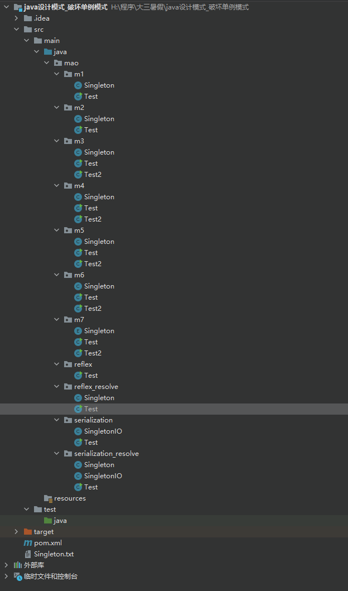


### 单例模式的使用场景

Runtime类就是使用的单例设计模式


```java
public class Runtime {
    private static final Runtime currentRuntime = new Runtime();

    private static Version version;

    /**
     * Returns the runtime object associated with the current Java application.
     * Most of the methods of class {@code Runtime} are instance
     * methods and must be invoked with respect to the current runtime object.
     *
     * @return  the {@code Runtime} object associated with the current
     *          Java application.
     */
    public static Runtime getRuntime() {
        return currentRuntime;
    }

    /** Don't let anyone else instantiate this class */
    private Runtime() {}
    
    ...
```


使用：

```java
package mao;


import java.io.BufferedReader;
import java.io.IOException;
import java.io.InputStream;
import java.io.InputStreamReader;

/**
 * Project name(项目名称)：java设计模式_破坏单例模式
 * Package(包名): mao
 * Class(类名): RuntimeTest
 * Author(作者）: mao
 * Author QQ：1296193245
 * GitHub：https://github.com/maomao124/
 * Date(创建日期)： 2022/8/12
 * Time(创建时间)： 20:29
 * Version(版本): 1.0
 * Description(描述)： 无
 */

public class RuntimeTest
{
    public static void main(String[] args) throws IOException
    {


        System.out.println(Runtime.getRuntime());
        System.out.println(Runtime.getRuntime());
        System.out.println(Runtime.getRuntime());
        Runtime runtime = Runtime.getRuntime();

        //注册一个新的虚拟机关闭挂钩
        runtime.addShutdownHook(new Thread(new Runnable()
        {
            @Override
            public void run()
            {
                System.out.println("java虚拟机即将关闭!!!");
            }
        }));

        Process process = runtime.exec("java --help");
        InputStream inputStream = process.getInputStream();
        InputStreamReader inputStreamReader = new InputStreamReader(inputStream, "GBK");
        BufferedReader bufferedReader = new BufferedReader(inputStreamReader);
        String str;
        while ((str = bufferedReader.readLine()) != null)
        {
            System.out.println(str);
        }

        long totalMemory = runtime.totalMemory();
        System.out.println(totalMemory);
        long freeMemory = runtime.freeMemory();
        System.out.println(freeMemory);
        long maxMemory = runtime.maxMemory();
        System.out.println(maxMemory);
    }
}
```


运行结果：

```sh
java.lang.Runtime@119d7047
java.lang.Runtime@119d7047
java.lang.Runtime@119d7047
用法：java [options] <主类> [args...]
           （执行类）
   或  java [options] -jar <jar 文件> [args...]
           （执行 jar 文件）
   或  java [options] -m <模块>[/<主类>] [args...]
       java [options] --module <模块>[/<主类>] [args...]
           （执行模块中的主类）
   或  java [options] <源文件> [args]
           （执行单个源文件程序）

 将主类、源文件、-jar <jar 文件>、-m 或
 --module <模块>/<主类> 后的参数作为参数
 传递到主类。

 其中，选项包括：

    -cp <目录和 zip/jar 文件的类搜索路径>
    -classpath <目录和 zip/jar 文件的类搜索路径>
    --class-path <目录和 zip/jar 文件的类搜索路径>
                  使用 ; 分隔的, 用于搜索类文件的目录, JAR 档案
                  和 ZIP 档案列表。
    -p <模块路径>
    --module-path <模块路径>...
                  用 ; 分隔的目录列表, 每个目录
                  都是一个包含模块的目录。
    --upgrade-module-path <模块路径>...
                  用 ; 分隔的目录列表, 每个目录
                  都是一个包含模块的目录, 这些模块
                  用于替换运行时映像中的可升级模块
    --add-modules <模块名称>[,<模块名称>...]
                  除了初始模块之外要解析的根模块。
                  <模块名称> 还可以为 ALL-DEFAULT, ALL-SYSTEM,
                  ALL-MODULE-PATH.
    --list-modules
                  列出可观察模块并退出
    -d <module name>
    --describe-module <模块名称>
                  描述模块并退出
    --dry-run     创建 VM 并加载主类, 但不执行 main 方法。
                  此 --dry-run 选项对于验证诸如
                  模块系统配置这样的命令行选项可能非常有用。
    --validate-modules
                  验证所有模块并退出
                  --validate-modules 选项对于查找
                  模块路径中模块的冲突及其他错误可能非常有用。
    -D<名称>=<值>
                  设置系统属性
    -verbose:[class|module|gc|jni]
                  为给定子系统启用详细输出
    -version      将产品版本输出到错误流并退出
    --version     将产品版本输出到输出流并退出
    -showversion  将产品版本输出到错误流并继续
    --show-version
                  将产品版本输出到输出流并继续
    --show-module-resolution
                  在启动过程中显示模块解析输出
    -? -h -help
                  将此帮助消息输出到错误流
    --help        将此帮助消息输出到输出流
    -X            将额外选项的帮助输出到错误流
    --help-extra  将额外选项的帮助输出到输出流
    -ea[:<程序包名称>...|:<类名>]
    -enableassertions[:<程序包名称>...|:<类名>]
                  按指定的粒度启用断言
    -da[:<程序包名称>...|:<类名>]
    -disableassertions[:<程序包名称>...|:<类名>]
                  按指定的粒度禁用断言
    -esa | -enablesystemassertions
                  启用系统断言
    -dsa | -disablesystemassertions
                  禁用系统断言
    -agentlib:<库名>[=<选项>]
                  加载本机代理库 <库名>, 例如 -agentlib:jdwp
                  另请参阅 -agentlib:jdwp=help
    -agentpath:<路径名>[=<选项>]
                  按完整路径名加载本机代理库
    -javaagent:<jar 路径>[=<选项>]
                  加载 Java 编程语言代理, 请参阅 java.lang.instrument
    -splash:<图像路径>
                  使用指定的图像显示启动屏幕
                  自动支持和使用 HiDPI 缩放图像
                  (如果可用)。应始终将未缩放的图像文件名 (例如, image.ext)
                  作为参数传递给 -splash 选项。
                  将自动选取提供的最合适的缩放
                  图像。
                  有关详细信息, 请参阅 SplashScreen API 文档
    @argument 文件
                  一个或多个包含选项的参数文件
    -disable-@files
                  阻止进一步扩展参数文件
    --enable-preview
                  允许类依赖于此发行版的预览功能
要为长选项指定参数, 可以使用 --<名称>=<值> 或
--<名称> <值>。

268435456
264951872
4280287232
java虚拟机即将关闭!!!
```


## 简单工厂模式

### 概念

简单工厂不是一种设计模式，反而比较像是一种编程习惯。


### 结构

简单工厂包含如下角色：

* 抽象产品 ：定义了产品的规范，描述了产品的主要特性和功能。
* 具体产品 ：实现或者继承抽象产品的子类
* 具体工厂 ：提供了创建产品的方法，调用者通过该方法来获取产品。


### 示例

需求：设计一个咖啡店点餐系统。

设计一个咖啡类（Coffee），并定义其两个子类（美式咖啡【AmericanCoffee】和拿铁咖啡【LatteCoffee】）；再设计一个咖啡店类（CoffeeStore），咖啡店具有点咖啡的功能。


在java中，万物皆对象，这些对象都需要创建，如果创建的时候直接new该对象，就会对该对象耦合严重，假如我们要更换对象，所有new对象的地方都需要修改一遍，这显然违背了软件设计的开闭原则。如果我们使用工厂来生产对象，我们就只和工厂打交道就可以了，彻底和对象解耦，如果要更换对象，直接在工厂里更换该对象即可，达到了与对象解耦的目的；所以说，工厂模式最大的优点就是：**解耦**。


```java
package mao.before;

/**
 * Project name(项目名称)：java设计模式_简单工厂模式
 * Package(包名): mao.before
 * Class(类名): Coffee
 * Author(作者）: mao
 * Author QQ：1296193245
 * GitHub：https://github.com/maomao124/
 * Date(创建日期)： 2022/8/12
 * Time(创建时间)： 21:11
 * Version(版本): 1.0
 * Description(描述)： 无
 */


public class Coffee
{
    /**
     * Gets name.
     *
     * @return the name
     */
    public String getName()
    {
        return "咖啡";
    }

    /**
     * Add milk.
     */
    public void addMilk()
    {
        System.out.println("添加牛奶");
    }

    /**
     * Add sugar.
     */
    public void addSugar()
    {
        System.out.println("添加糖");
    }
}
```


```java
package mao.before;

/**
 * Project name(项目名称)：java设计模式_简单工厂模式
 * Package(包名): mao.before
 * Class(类名): CoffeeStore
 * Author(作者）: mao
 * Author QQ：1296193245
 * GitHub：https://github.com/maomao124/
 * Date(创建日期)： 2022/8/12
 * Time(创建时间)： 21:12
 * Version(版本): 1.0
 * Description(描述)： 无
 */

public class CoffeeStore
{
    public Coffee orderCoffee(String type)
    {
        if (type == null)
        {
            throw new RuntimeException("type不能为null");
        }
        Coffee coffee = null;
        if (type.equals("latte"))
        {
            coffee = new LatteCoffee();
        }
        else if (type.equals("american"))
        {
            coffee = new AmericanCoffee();
        }
        else
        {
            throw new RuntimeException("type没有匹配到如何一种");
        }
        coffee.addMilk();
        coffee.addSugar();
        return coffee;
    }
}
```


```java
package mao.before;

/**
 * Project name(项目名称)：java设计模式_简单工厂模式
 * Package(包名): mao.before
 * Class(类名): LatteCoffee
 * Author(作者）: mao
 * Author QQ：1296193245
 * GitHub：https://github.com/maomao124/
 * Date(创建日期)： 2022/8/12
 * Time(创建时间)： 21:16
 * Version(版本): 1.0
 * Description(描述)： 无
 */

public class LatteCoffee extends Coffee
{
    @Override
    public String getName()
    {
        return "拿铁咖啡";
    }

    @Override
    public void addMilk()
    {
        System.out.println("拿铁咖啡添加牛奶");
    }

    @Override
    public void addSugar()
    {
        System.out.println("拿铁咖啡添加糖");
    }
}
```


```java
package mao.before;

/**
 * Project name(项目名称)：java设计模式_简单工厂模式
 * Package(包名): mao.before
 * Class(类名): AmericanCoffee
 * Author(作者）: mao
 * Author QQ：1296193245
 * GitHub：https://github.com/maomao124/
 * Date(创建日期)： 2022/8/12
 * Time(创建时间)： 21:17
 * Version(版本): 1.0
 * Description(描述)： 无
 */

public class AmericanCoffee extends Coffee
{
    @Override
    public String getName()
    {
        return "美式咖啡";
    }

    @Override
    public void addMilk()
    {
        System.out.println("美式咖啡添加牛奶");
    }

    @Override
    public void addSugar()
    {
        System.out.println("美式咖啡添加糖");
    }
}
```


```java
package mao.before;

/**
 * Project name(项目名称)：java设计模式_简单工厂模式
 * Package(包名): mao.before
 * Class(类名): Test
 * Author(作者）: mao
 * Author QQ：1296193245
 * GitHub：https://github.com/maomao124/
 * Date(创建日期)： 2022/8/12
 * Time(创建时间)： 21:23
 * Version(版本): 1.0
 * Description(描述)： 无
 */

public class Test
{
    public static void main(String[] args)
    {
        CoffeeStore coffeeStore = new CoffeeStore();
        Coffee coffee = coffeeStore.orderCoffee("latte");
        System.out.println(coffee.getName());
        coffee = coffeeStore.orderCoffee("american");
        System.out.println(coffee.getName());
    }
}
```


**改进：**


```java
package mao.after;


/**
 * Project name(项目名称)：java设计模式_简单工厂模式
 * Package(包名): mao.after
 * Class(类名): SimpleCoffeeFactory
 * Author(作者）: mao
 * Author QQ：1296193245
 * GitHub：https://github.com/maomao124/
 * Date(创建日期)： 2022/8/12
 * Time(创建时间)： 21:49
 * Version(版本): 1.0
 * Description(描述)： 无
 */

public class SimpleCoffeeFactory
{
    public Coffee createCoffee(String type)
    {
        if (type == null)
        {
            throw new RuntimeException("type不能为null");
        }
        Coffee coffee = null;
        if (type.equals("latte"))
        {
            coffee = new LatteCoffee();
        }
        else if (type.equals("american"))
        {
            coffee = new AmericanCoffee();
        }
        else
        {
            throw new RuntimeException("type没有匹配到如何一种");
        }
        coffee.addMilk();
        coffee.addSugar();
        return coffee;
    }
}
```


```java
package mao.after;


/**
 * Project name(项目名称)：java设计模式_简单工厂模式
 * Package(包名): mao.after
 * Class(类名): CoffeeStore
 * Author(作者）: mao
 * Author QQ：1296193245
 * GitHub：https://github.com/maomao124/
 * Date(创建日期)： 2022/8/12
 * Time(创建时间)： 21:51
 * Version(版本): 1.0
 * Description(描述)： 无
 */

public class CoffeeStore
{
    private static final SimpleCoffeeFactory simpleCoffeeFactory = new SimpleCoffeeFactory();

    public Coffee orderCoffee(String type)
    {
        return simpleCoffeeFactory.createCoffee(type);
    }
}
```


```java
package mao.after;


/**
 * Project name(项目名称)：java设计模式_简单工厂模式
 * Package(包名): mao.after
 * Class(类名): Test
 * Author(作者）: mao
 * Author QQ：1296193245
 * GitHub：https://github.com/maomao124/
 * Date(创建日期)： 2022/8/12
 * Time(创建时间)： 21:53
 * Version(版本): 1.0
 * Description(描述)： 无
 */

public class Test
{
    public static void main(String[] args)
    {
        CoffeeStore coffeeStore = new CoffeeStore();
        Coffee coffee = coffeeStore.orderCoffee("latte");
        System.out.println(coffee.getName());
        coffee = coffeeStore.orderCoffee("american");
        System.out.println(coffee.getName());
    }
}
```


工厂（factory）处理创建对象的细节，一旦有了SimpleCoffeeFactory，CoffeeStore类中的orderCoffee()就变成此对象的客户，后期如果需要Coffee对象直接从工厂中获取即可。这样也就解除了和Coffee实现类的耦合，同时又产生了新的耦合，CoffeeStore对象和SimpleCoffeeFactory工厂对象的耦合，工厂对象和商品对象的耦合。

后期如果再加新品种的咖啡，我们势必要需求修改SimpleCoffeeFactory的代码，违反了开闭原则。工厂类的客户端可能有很多，比如创建美团外卖等，这样只需要修改工厂类的代码，省去其他的修改操作。


### 优缺点

**优点：**

封装了创建对象的过程，可以通过参数直接获取对象。把对象的创建和业务逻辑层分开，这样以后就避免了修改客户代码，如果要实现新产品直接修改工厂类，而不需要在原代码中修改，这样就降低了客户代码修改的可能性，更加容易扩展。

**缺点：**

增加新产品时还是需要修改工厂类的代码，违背了“开闭原则”。


### 扩展


静态工厂


在开发中也有一部分人将工厂类中的创建对象的功能定义为静态的，这个就是静态工厂模式


```java
package mao.static_factory;


/**
 * Project name(项目名称)：java设计模式_简单工厂模式
 * Package(包名): mao.after
 * Class(类名): SimpleCoffeeFactory
 * Author(作者）: mao
 * Author QQ：1296193245
 * GitHub：https://github.com/maomao124/
 * Date(创建日期)： 2022/8/12
 * Time(创建时间)： 21:49
 * Version(版本): 1.0
 * Description(描述)： 无
 */

public class SimpleCoffeeFactory
{
    public static Coffee createCoffee(String type)
    {
        if (type == null)
        {
            throw new RuntimeException("type不能为null");
        }
        Coffee coffee = null;
        if (type.equals("latte"))
        {
            coffee = new LatteCoffee();
        }
        else if (type.equals("american"))
        {
            coffee = new AmericanCoffee();
        }
        else
        {
            throw new RuntimeException("type没有匹配到如何一种");
        }
        coffee.addMilk();
        coffee.addSugar();
        return coffee;
    }
}
```


```java
package mao.static_factory;


/**
 * Project name(项目名称)：java设计模式_简单工厂模式
 * Package(包名): mao.after
 * Class(类名): CoffeeStore
 * Author(作者）: mao
 * Author QQ：1296193245
 * GitHub：https://github.com/maomao124/
 * Date(创建日期)： 2022/8/12
 * Time(创建时间)： 21:51
 * Version(版本): 1.0
 * Description(描述)： 无
 */

public class CoffeeStore
{
    public static Coffee orderCoffee(String type)
    {
        return SimpleCoffeeFactory.createCoffee(type);
    }
}
```


```java
package mao.static_factory;

/**
 * Project name(项目名称)：java设计模式_简单工厂模式
 * Package(包名): mao.static_factory
 * Class(类名): Test
 * Author(作者）: mao
 * Author QQ：1296193245
 * GitHub：https://github.com/maomao124/
 * Date(创建日期)： 2022/8/12
 * Time(创建时间)： 22:00
 * Version(版本): 1.0
 * Description(描述)： 无
 */

public class Test
{
    public static void main(String[] args)
    {
        Coffee latte = CoffeeStore.orderCoffee("latte");
        System.out.println(latte.getName());
        Coffee american = CoffeeStore.orderCoffee("american");
        System.out.println(american.getName());
    }
}
```


## 工厂方法模式


### 概念

定义一个用于创建对象的接口，让子类决定实例化哪个产品类对象。工厂方法使一个产品类的实例化延迟到其工厂的子类。


### 结构

工厂方法模式的主要角色：

* 抽象工厂（Abstract Factory）：提供了创建产品的接口，调用者通过它访问具体工厂的工厂方法来创建产品。
* 具体工厂（ConcreteFactory）：主要是实现抽象工厂中的抽象方法，完成具体产品的创建。
* 抽象产品（Product）：定义了产品的规范，描述了产品的主要特性和功能。
* 具体产品（ConcreteProduct）：实现了抽象产品角色所定义的接口，由具体工厂来创建，它同具体工厂之间一一对应。


### 示例


```java
package mao;

/**
 * Project name(项目名称)：java设计模式_工厂方法模式
 * Package(包名): mao
 * Interface(接口名): CoffeeFactory
 * Author(作者）: mao
 * Author QQ：1296193245
 * GitHub：https://github.com/maomao124/
 * Date(创建日期)： 2022/8/12
 * Time(创建时间)： 22:42
 * Version(版本): 1.0
 * Description(描述)： 抽象工厂
 */

public interface CoffeeFactory
{
    /**
     * Create coffee.
     *
     * @return the coffee
     */
    Coffee createCoffee();
}
```


```java
package mao;

/**
 * Project name(项目名称)：java设计模式_工厂方法模式
 * Package(包名): mao
 * Class(类名): LatteCoffeeFactory
 * Author(作者）: mao
 * Author QQ：1296193245
 * GitHub：https://github.com/maomao124/
 * Date(创建日期)： 2022/8/12
 * Time(创建时间)： 22:43
 * Version(版本): 1.0
 * Description(描述)： 具体工厂
 */

public class LatteCoffeeFactory implements CoffeeFactory
{

    @Override
    public Coffee createCoffee()
    {
        return new LatteCoffee();
    }
}
```


```java
package mao;

/**
 * Project name(项目名称)：java设计模式_工厂方法模式
 * Package(包名): mao
 * Class(类名): AmericanCoffeeFactory
 * Author(作者）: mao
 * Author QQ：1296193245
 * GitHub：https://github.com/maomao124/
 * Date(创建日期)： 2022/8/12
 * Time(创建时间)： 22:44
 * Version(版本): 1.0
 * Description(描述)： 具体工厂
 */

public class AmericanCoffeeFactory implements CoffeeFactory
{

    @Override
    public Coffee createCoffee()
    {
        return new AmericanCoffee();
    }
}
```


```java
package mao;

/**
 * Project name(项目名称)：java设计模式_工厂方法模式
 * Package(包名): mao
 * Class(类名): CoffeeStore
 * Author(作者）: mao
 * Author QQ：1296193245
 * GitHub：https://github.com/maomao124/
 * Date(创建日期)： 2022/8/12
 * Time(创建时间)： 22:09
 * Version(版本): 1.0
 * Description(描述)： 无
 */

public class CoffeeStore
{
    private final CoffeeFactory factory;

    public CoffeeStore(CoffeeFactory factory)
    {
        this.factory = factory;
    }

    public Coffee orderCoffee()
    {
        Coffee coffee = factory.createCoffee();
        coffee.addMilk();
        coffee.addSugar();
        return coffee;
    }
}
```


```java
package mao;

/**
 * Project name(项目名称)：java设计模式_工厂方法模式
 * Package(包名): mao
 * Class(类名): Test
 * Author(作者）: mao
 * Author QQ：1296193245
 * GitHub：https://github.com/maomao124/
 * Date(创建日期)： 2022/8/12
 * Time(创建时间)： 22:48
 * Version(版本): 1.0
 * Description(描述)： 无
 */

public class Test
{
    public static void main(String[] args)
    {
        Coffee coffee = new CoffeeStore(new AmericanCoffeeFactory()).orderCoffee();
        System.out.println(coffee.getName());
        coffee = new CoffeeStore(new LatteCoffeeFactory()).orderCoffee();
        System.out.println(coffee.getName());
    }
}
```


要增加产品类时也要相应地增加工厂类，不需要修改工厂类的代码了，这样就解决了简单工厂模式的缺点。

工厂方法模式是简单工厂模式的进一步抽象。由于使用了多态性，工厂方法模式保持了简单工厂模式的优点，而且克服了它的缺点


### 优缺点

**优点：**

- 用户只需要知道具体工厂的名称就可得到所要的产品，无须知道产品的具体创建过程；
- 在系统增加新的产品时只需要添加具体产品类和对应的具体工厂类，无须对原工厂进行任何修改，满足开闭原则；

**缺点：**

* 每增加一个产品就要增加一个具体产品类和一个对应的具体工厂类，这增加了系统的复杂度。


## 抽象工厂模式

工厂方法模式中考虑的是一类产品的生产，如畜牧场只养动物、电视机厂只生产电视机

这些工厂只生产同种类产品，同种类产品称为同等级产品，也就是说：工厂方法模式只考虑生产同等级的产品，但是在现实生活中许多工厂是综合型的工厂，能生产多等级（种类） 的产品，如电器厂既生产电视机又生产洗衣机或空调等


抽象工厂模式将考虑多等级产品的生产，将同一个具体工厂所生产的位于不同等级的一组产品称为一个产品族，下图所示横轴是产品等级，也就是同一类产品；纵轴是产品族，也就是同一品牌的产品，同一品牌的产品产自同一个工厂。


举例：

* 同一级别：华为手机、小米手机、OPPO手机...
* 同一产品族：华为手机、华为笔记本电脑、华为路由器...


### 概念

是一种为访问类提供一个创建一组相关或相互依赖对象的接口，且访问类无须指定所要产品的具体类就能得到同族的不同等级的产品的模式结构。

抽象工厂模式是工厂方法模式的升级版本，工厂方法模式只生产一个等级的产品，而抽象工厂模式可生产多个等级的产品


### 结构

抽象工厂模式的主要角色如下：

* 抽象工厂（Abstract Factory）：提供了创建产品的接口，它包含多个创建产品的方法，可以创建多个不同等级的产品。
* 具体工厂（Concrete Factory）：主要是实现抽象工厂中的多个抽象方法，完成具体产品的创建。
* 抽象产品（Product）：定义了产品的规范，描述了产品的主要特性和功能，抽象工厂模式有多个抽象产品。
* 具体产品（ConcreteProduct）：实现了抽象产品角色所定义的接口，由具体工厂来创建，它同具体工厂之间是多对一的关系。


### 示例

现咖啡店业务发生改变，不仅要生产咖啡还要生产甜点，如提拉米苏、抹茶慕斯等，要是按照工厂方法模式，需要定义提拉米苏类、抹茶慕斯类、提拉米苏工厂、抹茶慕斯工厂、甜点工厂类，很容易发生类爆炸情况。其中拿铁咖啡、美式咖啡是一个产品等级，都是咖啡；提拉米苏、抹茶慕斯也是一个产品等级；拿铁咖啡和提拉米苏是同一产品族（也就是都属于意大利风味），美式咖啡和抹茶慕斯是同一产品族（也就是都属于美式风味）。所以这个案例可以使用抽象工厂模式实现。


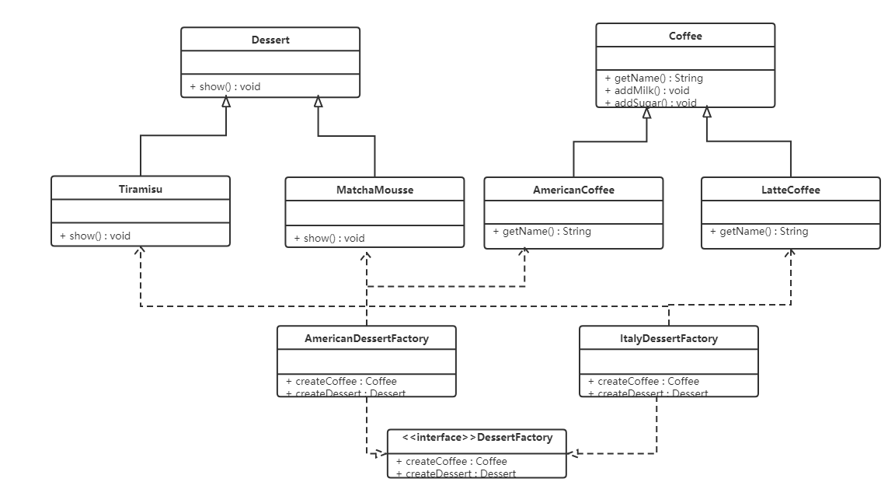


```java
package mao;

/**
 * Project name(项目名称)：java设计模式_抽象工厂模式
 * Package(包名): mao
 * Class(类名): Coffee
 * Author(作者）: mao
 * Author QQ：1296193245
 * GitHub：https://github.com/maomao124/
 * Date(创建日期)： 2022/8/12
 * Time(创建时间)： 23:12
 * Version(版本): 1.0
 * Description(描述)： 无
 */

public class Coffee
{
    /**
     * Gets name.
     *
     * @return the name
     */
    public String getName()
    {
        return "咖啡";
    }

    /**
     * Add milk.
     */
    public void addMilk()
    {
        System.out.println("添加牛奶");
    }

    /**
     * Add sugar.
     */
    public void addSugar()
    {
        System.out.println("添加糖");
    }
}
```


```java
package mao;

/**
 * Project name(项目名称)：java设计模式_抽象工厂模式
 * Package(包名): mao
 * Class(类名): LatteCoffee
 * Author(作者）: mao
 * Author QQ：1296193245
 * GitHub：https://github.com/maomao124/
 * Date(创建日期)： 2022/8/12
 * Time(创建时间)： 23:13
 * Version(版本): 1.0
 * Description(描述)： 无
 */

public class LatteCoffee extends Coffee
{
    @Override
    public String getName()
    {
        return "拿铁咖啡";
    }

    @Override
    public void addMilk()
    {
        System.out.println("拿铁咖啡添加牛奶");
    }

    @Override
    public void addSugar()
    {
        System.out.println("拿铁咖啡添加糖");
    }
}
```


```java
package mao;

/**
 * Project name(项目名称)：java设计模式_抽象工厂模式
 * Package(包名): mao
 * Class(类名): AmericanCoffee
 * Author(作者）: mao
 * Author QQ：1296193245
 * GitHub：https://github.com/maomao124/
 * Date(创建日期)： 2022/8/12
 * Time(创建时间)： 23:13
 * Version(版本): 1.0
 * Description(描述)： 无
 */

public class AmericanCoffee extends Coffee
{
    @Override
    public String getName()
    {
        return "美式咖啡";
    }

    @Override
    public void addMilk()
    {
        System.out.println("美式咖啡添加牛奶");
    }

    @Override
    public void addSugar()
    {
        System.out.println("美式咖啡添加糖");
    }
}
```


```java
package mao;

/**
 * Project name(项目名称)：java设计模式_抽象工厂模式
 * Package(包名): mao
 * Class(类名): Dessert
 * Author(作者）: mao
 * Author QQ：1296193245
 * GitHub：https://github.com/maomao124/
 * Date(创建日期)： 2022/8/13
 * Time(创建时间)： 21:02
 * Version(版本): 1.0
 * Description(描述)： 无
 */

public class Dessert
{
    public void show()
    {
        System.out.println("甜点");
    }
}
```


```java
package mao;

/**
 * Project name(项目名称)：java设计模式_抽象工厂模式
 * Package(包名): mao
 * Class(类名): MatchaMousse
 * Author(作者）: mao
 * Author QQ：1296193245
 * GitHub：https://github.com/maomao124/
 * Date(创建日期)： 2022/8/13
 * Time(创建时间)： 21:04
 * Version(版本): 1.0
 * Description(描述)： 无
 */

public class MatchaMousse extends Dessert
{
    @Override
    public void show()
    {
        System.out.println("抹茶慕斯");
    }
}
```


```java
package mao;

/**
 * Project name(项目名称)：java设计模式_抽象工厂模式
 * Package(包名): mao
 * Class(类名): Tiramisu
 * Author(作者）: mao
 * Author QQ：1296193245
 * GitHub：https://github.com/maomao124/
 * Date(创建日期)： 2022/8/13
 * Time(创建时间)： 21:03
 * Version(版本): 1.0
 * Description(描述)： 无
 */

public class Tiramisu extends Dessert
{
    @Override
    public void show()
    {
        System.out.println("提拉米苏");
    }
}
```


```java
package mao;

/**
 * Project name(项目名称)：java设计模式_抽象工厂模式
 * Package(包名): mao
 * Interface(接口名): DessertFactory
 * Author(作者）: mao
 * Author QQ：1296193245
 * GitHub：https://github.com/maomao124/
 * Date(创建日期)： 2022/8/13
 * Time(创建时间)： 21:08
 * Version(版本): 1.0
 * Description(描述)： 抽象工厂
 */

public interface DessertFactory
{
    Coffee createCoffee();

    Dessert createDessert();
}
```


```java
package mao;

/**
 * Project name(项目名称)：java设计模式_抽象工厂模式
 * Package(包名): mao
 * Class(类名): AmericanDessertFactory
 * Author(作者）: mao
 * Author QQ：1296193245
 * GitHub：https://github.com/maomao124/
 * Date(创建日期)： 2022/8/13
 * Time(创建时间)： 21:09
 * Version(版本): 1.0
 * Description(描述)： 具体工厂,美式甜点工厂
 */

public class AmericanDessertFactory implements DessertFactory
{

    @Override
    public Coffee createCoffee()
    {
        return new AmericanCoffee();
    }

    @Override
    public Dessert createDessert()
    {
        return new MatchaMousse();
    }
}
```


```java
package mao;

/**
 * Project name(项目名称)：java设计模式_抽象工厂模式
 * Package(包名): mao
 * Class(类名): ItalyDessertFactory
 * Author(作者）: mao
 * Author QQ：1296193245
 * GitHub：https://github.com/maomao124/
 * Date(创建日期)： 2022/8/13
 * Time(创建时间)： 21:09
 * Version(版本): 1.0
 * Description(描述)： 具体工厂,意大利风味甜点工厂
 */

public class ItalyDessertFactory implements DessertFactory
{

    @Override
    public Coffee createCoffee()
    {
        return new LatteCoffee();
    }

    @Override
    public Dessert createDessert()
    {
        return new Tiramisu();
    }
}
```


```java
package mao;

/**
 * Project name(项目名称)：java设计模式_抽象工厂模式
 * Package(包名): mao
 * Class(类名): Test
 * Author(作者）: mao
 * Author QQ：1296193245
 * GitHub：https://github.com/maomao124/
 * Date(创建日期)： 2022/8/13
 * Time(创建时间)： 21:10
 * Version(版本): 1.0
 * Description(描述)： 无
 */

public class Test
{
    public static void main(String[] args)
    {
        DessertFactory dessertFactory = new AmericanDessertFactory();
        Dessert dessert = dessertFactory.createDessert();
        dessert.show();
        Coffee coffee = dessertFactory.createCoffee();
        System.out.println(coffee.getName());

        dessertFactory = new ItalyDessertFactory();
        Dessert dessert1 = dessertFactory.createDessert();
        dessert1.show();
        Coffee coffee1 = dessertFactory.createCoffee();
        System.out.println(coffee1.getName());
    }
}
```


如果要加同一个产品族的话，只需要再加一个对应的工厂类即可，不需要修改其他的类。


### 优缺点

**优点：**

当一个产品族中的多个对象被设计成一起工作时，它能保证客户端始终只使用同一个产品族中的对象。

**缺点：**

当产品族中需要增加一个新的产品时，所有的工厂类都需要进行修改。


### 使用场景

* 当需要创建的对象是一系列相互关联或相互依赖的产品族时，如电器工厂中的电视机、洗衣机、空调等。
* 系统中有多个产品族，但每次只使用其中的某一族产品。如有人只喜欢穿某一个品牌的衣服和鞋。
* 系统中提供了产品的类库，且所有产品的接口相同，客户端不依赖产品实例的创建细节和内部结构。


### 模式扩展


可以通过工厂模式+配置文件的方式解除工厂对象和产品对象的耦合。在工厂类中加载配置文件中的全类名，并创建对象进行存储，客户端如果需要对象，直接进行获取即可。


**创建配置文件**

名称为bean.properties

```properties
american=mao.AmericanCoffee
latte=mao.LatteCoffee
```


**创建CoffeeFactory类**


```java
package mao.config;

import mao.Coffee;

import java.io.InputStream;
import java.util.HashMap;
import java.util.Map;
import java.util.Properties;
import java.util.Set;

/**
 * Project name(项目名称)：java设计模式_抽象工厂模式
 * Package(包名): mao.config
 * Class(类名): CoffeeFactory
 * Author(作者）: mao
 * Author QQ：1296193245
 * GitHub：https://github.com/maomao124/
 * Date(创建日期)： 2022/8/13
 * Time(创建时间)： 21:24
 * Version(版本): 1.0
 * Description(描述)： 无
 */

public class CoffeeFactory
{
    private static final Map<String, Coffee> map = new HashMap<>();

    static
    {
        Properties properties = new Properties();
        InputStream inputStream = CoffeeFactory.class.getClassLoader().getResourceAsStream("bean.properties");
        try
        {
            properties.load(inputStream);
            Set<Object> keys = properties.keySet();
            for (Object key : keys)
            {
                String property = properties.getProperty((String) key);
                Class<?> clazz = Class.forName(property);
                Object o = clazz.newInstance();
                map.put((String) key, (Coffee) o);
            }
        }
        catch (Exception e)
        {
            e.printStackTrace();
        }
    }

    public static Coffee createCoffee(String name)
    {

        return map.get(name);
    }
}
```


**创建测试类**


```java
package mao.config;

import mao.Coffee;

/**
 * Project name(项目名称)：java设计模式_抽象工厂模式
 * Package(包名): mao.config
 * Class(类名): Test
 * Author(作者）: mao
 * Author QQ：1296193245
 * GitHub：https://github.com/maomao124/
 * Date(创建日期)： 2022/8/13
 * Time(创建时间)： 21:31
 * Version(版本): 1.0
 * Description(描述)： 无
 */

public class Test
{
    public static void main(String[] args)
    {
        Coffee american = CoffeeFactory.createCoffee("american");
        System.out.println(american.getName());
        System.out.println(american);
        Coffee latte = CoffeeFactory.createCoffee("latte");
        System.out.println(latte.getName());
        System.out.println(latte);
    }
}
```


静态成员变量用来存储创建的对象（键存储的是名称，值存储的是对应的对象），而读取配置文件以及创建对象写在静态代码块中，目的就是只需要执行一次。


### 工厂模式的使用场景

Collection.iterator方法


Collection接口是抽象工厂类，

ArrayList是具体的工厂类；

Iterator接口是抽象商品类，

ArrayList类中的Iter内部类是具体的商品类。

在具体的工厂类中iterator()方法创建具体的商品类的对象。


DateForamt类中的getInstance()方法使用的是工厂模式

Calendar类中的getInstance()方法使用的是工厂模式


## 原型模式

### 概念

用一个已经创建的实例作为原型，通过复制该原型对象来创建一个和原型对象相同的新对象。


### 结构

原型模式包含如下角色：

* 抽象原型类：规定了具体原型对象必须实现的的 clone() 方法。
* 具体原型类：实现抽象原型类的 clone() 方法，它是可被复制的对象。
* 访问类：使用具体原型类中的 clone() 方法来复制新的对象。


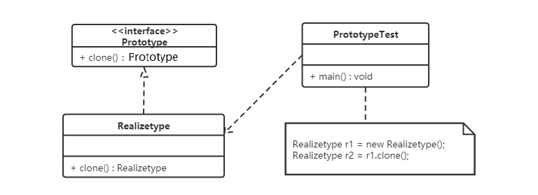


### 浅克隆和深克隆

原型模式的克隆分为浅克隆和深克隆


* 浅克隆：创建一个新对象，新对象的属性和原来对象完全相同，对于非基本类型属性，仍指向原有属性所指向的对象的内存地址
* 深克隆：创建一个新对象，属性中引用的其他对象也会被克隆，不再指向原有对象地址


Java中的Object类中提供了 `clone()` 方法来实现浅克隆。 Cloneable 接口是上面的类图中的抽象原型类，而实现了Cloneable接口的子实现类就是具体的原型类。


### 示例


```java
package mao.test;

/**
 * Project name(项目名称)：java设计模式_原型模式
 * Package(包名): mao.test
 * Class(类名): RealizeType
 * Author(作者）: mao
 * Author QQ：1296193245
 * GitHub：https://github.com/maomao124/
 * Date(创建日期)： 2022/8/13
 * Time(创建时间)： 21:54
 * Version(版本): 1.0
 * Description(描述)： 无
 */

public class RealizeType implements Cloneable
{
    public RealizeType()
    {
        System.out.println("具体的原型对象创建完成！");
    }

    @Override
    protected RealizeType clone() throws CloneNotSupportedException
    {
        System.out.println("具体原型复制成功！");
        return (RealizeType) super.clone();
    }
}
```


```java
package mao.test;

/**
 * Project name(项目名称)：java设计模式_原型模式
 * Package(包名): mao.test
 * Class(类名): PrototypeTest
 * Author(作者）: mao
 * Author QQ：1296193245
 * GitHub：https://github.com/maomao124/
 * Date(创建日期)： 2022/8/13
 * Time(创建时间)： 21:54
 * Version(版本): 1.0
 * Description(描述)： 无
 */

public class PrototypeTest
{
    public static void main(String[] args) throws CloneNotSupportedException
    {
        RealizeType realizeType1 = new RealizeType();
        System.out.println(realizeType1);
        RealizeType realizeType2 = realizeType1.clone();
        System.out.println(realizeType2);
        RealizeType realizeType3 = realizeType1.clone();
        System.out.println(realizeType3);
    }
}
```


运行结果：

```sh
具体的原型对象创建完成！
mao.test.RealizeType@776ec8df
具体原型复制成功！
mao.test.RealizeType@4eec7777
具体原型复制成功！
mao.test.RealizeType@3b07d329
```


### 浅克隆示例

**用原型模式生成“三好学生”奖状**


同一学校的“三好学生”奖状除了获奖人姓名不同，其他都相同，可以使用原型模式复制多个“三好学生”奖状出来，然后在修改奖状上的名字即可。


```java
package mao.shallowClone;

/**
 * Project name(项目名称)：java设计模式_原型模式
 * Package(包名): mao.shallowClone
 * Class(类名): Citation
 * Author(作者）: mao
 * Author QQ：1296193245
 * GitHub：https://github.com/maomao124/
 * Date(创建日期)： 2022/8/13
 * Time(创建时间)： 22:03
 * Version(版本): 1.0
 * Description(描述)： 无
 */


public class Citation implements Cloneable
{
    private String name;

    /**
     * Instantiates a new Citation.
     *
     * @param name the name
     */
    public Citation(String name)
    {
        this.name = name;
    }

    /**
     * Instantiates a new Citation.
     */
    public Citation()
    {

    }

    /**
     * Gets name.
     *
     * @return the name
     */
    public String getName()
    {
        return name;
    }

    /**
     * Sets name.
     *
     * @param name the name
     */
    public void setName(String name)
    {
        this.name = name;
    }

    /**
     * Show.
     */
    public void show()
    {
        System.out.println(getName() + "同学：在2022学年第一学期中表现优秀，被评为三好学生。特发此状！");
    }

    @Override
    protected Citation clone() throws CloneNotSupportedException
    {
        return (Citation) super.clone();
    }
}
```


```java
package mao.shallowClone;

/**
 * Project name(项目名称)：java设计模式_原型模式
 * Package(包名): mao.shallowClone
 * Class(类名): CitationTest
 * Author(作者）: mao
 * Author QQ：1296193245
 * GitHub：https://github.com/maomao124/
 * Date(创建日期)： 2022/8/13
 * Time(创建时间)： 22:05
 * Version(版本): 1.0
 * Description(描述)： 无
 */

public class CitationTest
{
    public static void main(String[] args) throws CloneNotSupportedException
    {
        Citation citation1 = new Citation("张三");
        //复制
        Citation citation2 = citation1.clone();
        citation2.setName("李四");
        Citation citation3 = citation2.clone();
        citation3.setName("王五");
        //显示
        citation1.show();
        citation2.show();
        citation3.show();
    }
}
```


### 浅克隆使用场景

* 对象的创建非常复杂，可以使用原型模式快捷的创建对象。
* 性能和安全要求比较高。


### 深克隆示例

将上面的“三好学生”奖状的案例中Citation类的name属性修改为Student类型的属性。


```java
package mao.deepClone;

/**
 * Project name(项目名称)：java设计模式_原型模式
 * Package(包名): mao.deepClone
 * Class(类名): Student
 * Author(作者）: mao
 * Author QQ：1296193245
 * GitHub：https://github.com/maomao124/
 * Date(创建日期)： 2022/8/13
 * Time(创建时间)： 22:10
 * Version(版本): 1.0
 * Description(描述)： 无
 */


public class Student
{
    //名字
    private String name;
    //住址
    private String address;

    /**
     * Instantiates a new Student.
     */
    public Student()
    {

    }

    /**
     * Instantiates a new Student.
     *
     * @param name    the name
     * @param address the address
     */
    public Student(String name, String address)
    {
        this.name = name;
        this.address = address;
    }

    /**
     * Gets name.
     *
     * @return the name
     */
    public String getName()
    {
        return name;
    }

    /**
     * Sets name.
     *
     * @param name the name
     */
    public void setName(String name)
    {
        this.name = name;
    }

    /**
     * Gets address.
     *
     * @return the address
     */
    public String getAddress()
    {
        return address;
    }

    /**
     * Sets address.
     *
     * @param address the address
     */
    public void setAddress(String address)
    {
        this.address = address;
    }

    @Override
    @SuppressWarnings("all")
    public String toString()
    {
        final StringBuilder stringbuilder = new StringBuilder();
        stringbuilder.append("name：").append(name).append('\n');
        stringbuilder.append("address：").append(address).append('\n');
        return stringbuilder.toString();
    }
}
```


```java
package mao.deepClone;

/**
 * Project name(项目名称)：java设计模式_原型模式
 * Package(包名): mao.deepClone
 * Class(类名): Citation
 * Author(作者）: mao
 * Author QQ：1296193245
 * GitHub：https://github.com/maomao124/
 * Date(创建日期)： 2022/8/13
 * Time(创建时间)： 22:11
 * Version(版本): 1.0
 * Description(描述)： 无
 */


public class Citation implements Cloneable
{
    private Student student;

    /**
     * Instantiates a new Citation.
     */
    public Citation()
    {

    }

    /**
     * Instantiates a new Citation.
     *
     * @param student the student
     */
    public Citation(Student student)
    {
        this.student = student;
    }

    /**
     * Gets student.
     *
     * @return the student
     */
    public Student getStudent()
    {
        return student;
    }

    /**
     * Sets student.
     *
     * @param student the student
     */
    public void setStudent(Student student)
    {
        this.student = student;
    }

    /**
     * Show.
     */
    void show()
    {
        System.out.println(student.getName() + "同学：在2022学年第一学期中表现优秀，被评为三好学生。特发此状！");
    }

    @Override
    protected Citation clone() throws CloneNotSupportedException
    {
        return (Citation) super.clone();
    }
}
```


```java
package mao.deepClone;

/**
 * Project name(项目名称)：java设计模式_原型模式
 * Package(包名): mao.deepClone
 * Class(类名): CitationTest
 * Author(作者）: mao
 * Author QQ：1296193245
 * GitHub：https://github.com/maomao124/
 * Date(创建日期)： 2022/8/13
 * Time(创建时间)： 22:13
 * Version(版本): 1.0
 * Description(描述)： 无
 */

public class CitationTest
{
    public static void main(String[] args) throws CloneNotSupportedException
    {
        Citation citation1 = new Citation();
        Student student = new Student("张三", "北京");
        citation1.setStudent(student);
        //复制
        Citation citation2 = citation1.clone();
        citation2.getStudent().setName("李四");
        //打印
        citation1.show();
        citation2.show();
        System.out.println(citation1);
        System.out.println(citation2);
        System.out.println(citation1.getStudent());
        System.out.println(citation2.getStudent());
        System.out.println(citation1 == citation2);
        System.out.println(citation1.getStudent() == citation2.getStudent());
    }
}
```


运行结果：

```sh
李四同学：在2022学年第一学期中表现优秀，被评为三好学生。特发此状！
李四同学：在2022学年第一学期中表现优秀，被评为三好学生。特发此状！
mao.deepClone.Citation@6d311334
mao.deepClone.Citation@682a0b20
name：李四
address：北京

name：李四
address：北京

false
true
```


citation1.getStudent()对象和citation2.getStudent()对象是同一个对象，就会产生将citation2.getStudent()对象中name属性值改为“李四”，两个Citation（奖状）对象中显示的都是李四。这就是浅克隆的效果，对具体原型类（Citation）中的引用类型的属性进行引用的复制。这种情况需要使用深克隆，而进行深克隆需要使用对象流。


**Student和Citation都需要实现Serializable接口**


```java
package mao.deepClone;

import java.awt.*;
import java.io.*;

/**
 * Project name(项目名称)：java设计模式_原型模式
 * Package(包名): mao.deepClone
 * Class(类名): CitationIO
 * Author(作者）: mao
 * Author QQ：1296193245
 * GitHub：https://github.com/maomao124/
 * Date(创建日期)： 2022/8/13
 * Time(创建时间)： 22:23
 * Version(版本): 1.0
 * Description(描述)： 无
 */

public class CitationIO
{
    /**
     * 将 Citation对象写入到文件里
     *
     * @param citation Citation
     * @param path     文件路径
     */
    public static boolean write(Citation citation, String path)
    {
        File file = null;
        FileOutputStream fileOutputStream = null;
        ObjectOutputStream objectOutputStream = null;
        try                                  //文件流打开，文件读写
        {
            file = new File(path);
            fileOutputStream = new FileOutputStream(file);
            objectOutputStream = new ObjectOutputStream(fileOutputStream);
            objectOutputStream.writeObject(citation);
            return true;
        }
        catch (FileNotFoundException e)      //文件未找到
        {
            Toolkit.getDefaultToolkit().beep();
            System.err.println("文件未找到！！！  " + "\n错误内容：" + e.toString());
            return false;
        }
        catch (Exception e)                  //其它异常
        {
            Toolkit.getDefaultToolkit().beep();
            e.printStackTrace();
            return false;
        }
        finally
        {
            try                              //关闭流
            {
                if (fileOutputStream != null)
                {
                    fileOutputStream.close();
                }
            }
            catch (NullPointerException e)    //空指针异常
            {
                Toolkit.getDefaultToolkit().beep();
                System.err.println("文件已经被关闭，无法再次关闭！！！");
            }
            catch (Exception e)              //其它异常
            {
                Toolkit.getDefaultToolkit().beep();
                e.printStackTrace();
            }
            try                              //关闭流
            {
                if (objectOutputStream != null)
                {
                    objectOutputStream.close();
                }
            }
            catch (NullPointerException e)    //空指针异常
            {
                Toolkit.getDefaultToolkit().beep();
                System.err.println("文件已经被关闭，无法再次关闭！！！");
            }
            catch (Exception e)              //其它异常
            {
                Toolkit.getDefaultToolkit().beep();
                e.printStackTrace();
            }
        }
    }

    /**
     * 从文件里读对象
     *
     * @param path 文件路径
     * @return Citation对象
     */
    public static Citation read(String path)
    {
        File file = null;
        FileInputStream fileInputStream = null;
        ObjectInputStream objectInputStream = null;
        try                                  //文件流打开，文件读写
        {
            file = new File(path);
            fileInputStream = new FileInputStream(file);
            objectInputStream = new ObjectInputStream(fileInputStream);
            Object o = objectInputStream.readObject();
            return (Citation) o;
        }
        catch (FileNotFoundException e)      //文件未找到
        {
            Toolkit.getDefaultToolkit().beep();
            System.err.println("文件未找到！！！  " + "\n错误内容：" + e.toString());
            return null;
        }
        catch (Exception e)                  //其它异常
        {
            Toolkit.getDefaultToolkit().beep();
            e.printStackTrace();
            return null;
        }
        finally
        {
            try                              //关闭流
            {
                if (fileInputStream != null)
                {
                    fileInputStream.close();
                }
            }
            catch (NullPointerException e)    //空指针异常
            {
                Toolkit.getDefaultToolkit().beep();
                System.err.println("文件已经被关闭，无法再次关闭！！！");
            }
            catch (Exception e)              //其它异常
            {
                Toolkit.getDefaultToolkit().beep();
                e.printStackTrace();
            }

            try                              //关闭流
            {
                if (objectInputStream != null)
                {
                    objectInputStream.close();
                }
            }
            catch (NullPointerException e)    //空指针异常
            {
                Toolkit.getDefaultToolkit().beep();
                System.err.println("文件已经被关闭，无法再次关闭！！！");
            }
            catch (Exception e)              //其它异常
            {
                Toolkit.getDefaultToolkit().beep();
                e.printStackTrace();
            }
        }
    }
}
```


```java
package mao.deepClone;

/**
 * Project name(项目名称)：java设计模式_原型模式
 * Package(包名): mao.deepClone
 * Class(类名): CitationTest2
 * Author(作者）: mao
 * Author QQ：1296193245
 * GitHub：https://github.com/maomao124/
 * Date(创建日期)： 2022/8/13
 * Time(创建时间)： 22:23
 * Version(版本): 1.0
 * Description(描述)： 无
 */

public class CitationTest2
{
    public static final String PATH = "./Citation.txt";

    public static void main(String[] args)
    {
        Citation citation1 = new Citation();
        Student student = new Student("张三", "北京");
        citation1.setStudent(student);
        //写到文件里
        System.out.println(CitationIO.write(citation1, PATH));
        //从文件里读
        Citation citation2 = CitationIO.read(PATH);
        assert citation2 != null;
        citation2.getStudent().setName("李四");
        //打印
        citation1.show();
        citation2.show();
        System.out.println(citation1);
        System.out.println(citation2);
        System.out.println(citation1.getStudent());
        System.out.println(citation2.getStudent());
        System.out.println(citation1 == citation2);
        System.out.println(citation1.getStudent() == citation2.getStudent());
    }
}
```


运行结果：

```sh
true
张三同学：在2022学年第一学期中表现优秀，被评为三好学生。特发此状！
李四同学：在2022学年第一学期中表现优秀，被评为三好学生。特发此状！
mao.deepClone.Citation@7aec35a
mao.deepClone.Citation@4ccabbaa
name：张三
address：北京

name：李四
address：北京

false
false
```


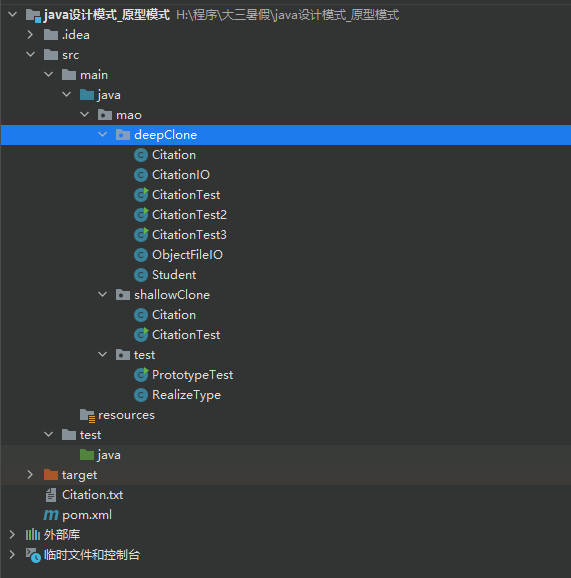


## 建造者模式

### 概念

将一个复杂对象的构建与表示分离，使得同样的构建过程可以创建不同的表示。


* 分离了部件的构造(由Builder来负责)和装配(由Director负责)。 从而可以构造出复杂的对象。这个模式适用于：某个对象的构建过程复杂的情况。
* 由于实现了构建和装配的解耦。不同的构建器，相同的装配，也可以做出不同的对象；相同的构建器，不同的装配顺序也可以做出不同的对象。也就是实现了构建算法、装配算法的解耦，实现了更好的复用。
* 建造者模式可以将部件和其组装过程分开，一步一步创建一个复杂的对象。用户只需要指定复杂对象的类型就可以得到该对象，而无须知道其内部的具体构造细节。


### 结构

建造者（Builder）模式包含如下角色：

* 抽象建造者类（Builder）：这个接口规定要实现复杂对象的那些部分的创建，并不涉及具体的部件对象的创建。 
* 具体建造者类（ConcreteBuilder）：实现 Builder 接口，完成复杂产品的各个部件的具体创建方法。在构造过程完成后，提供产品的实例。 
* 产品类（Product）：要创建的复杂对象。
* 指挥者类（Director）：调用具体建造者来创建复杂对象的各个部分，在指导者中不涉及具体产品的信息，只负责保证对象各部分完整创建或按某种顺序创建。 


### 示例

创建共享单车

生产自行车是一个复杂的过程，它包含了车架，车座等组件的生产。而车架又有碳纤维，铝合金等材质的，车座有橡胶，真皮等材质。对于自行车的生产就可以使用建造者模式。

这里Bike是产品，包含车架，车座等组件；Builder是抽象建造者，MobikeBuilder和OfoBuilder是具体的建造者；Director是指挥者。


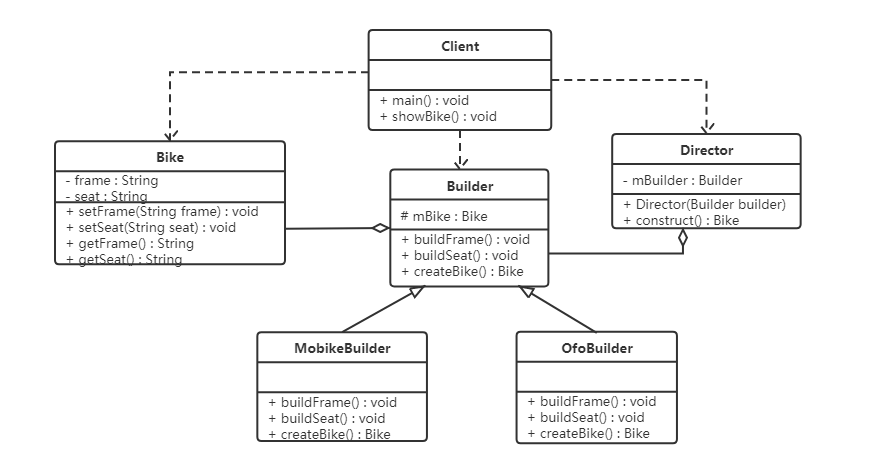


```java
package mao.builder_mode;

/**
 * Project name(项目名称)：java设计模式_建造者模式
 * Package(包名): mao.builder_mode
 * Class(类名): Bike
 * Author(作者）: mao
 * Author QQ：1296193245
 * GitHub：https://github.com/maomao124/
 * Date(创建日期)： 2022/8/14
 * Time(创建时间)： 13:34
 * Version(版本): 1.0
 * Description(描述)： 无
 */
public class Bike
{
    //车架
    private String frame;
    //车座
    private String seat;

    /**
     * Instantiates a new Bike.
     */
    public Bike()
    {

    }

    /**
     * Instantiates a new Bike.
     *
     * @param frame the frame
     * @param seat  the seat
     */
    public Bike(String frame, String seat)
    {
        this.frame = frame;
        this.seat = seat;
    }

    /**
     * Gets frame.
     *
     * @return the frame
     */
    public String getFrame()
    {
        return frame;
    }

    /**
     * Sets frame.
     *
     * @param frame the frame
     */
    public void setFrame(String frame)
    {
        this.frame = frame;
    }

    /**
     * Gets seat.
     *
     * @return the seat
     */
    public String getSeat()
    {
        return seat;
    }

    /**
     * Sets seat.
     *
     * @param seat the seat
     */
    public void setSeat(String seat)
    {
        this.seat = seat;
    }
}
```


```java
package mao.builder_mode;

/**
 * Project name(项目名称)：java设计模式_建造者模式
 * Package(包名): mao.builder_mode
 * Class(类名): Builder
 * Author(作者）: mao
 * Author QQ：1296193245
 * GitHub：https://github.com/maomao124/
 * Date(创建日期)： 2022/8/14
 * Time(创建时间)： 13:35
 * Version(版本): 1.0
 * Description(描述)： 抽象 builder 类
 */

public abstract class Builder
{
    /**
     * The Bike.
     */
    protected Bike bike = new Bike();

    /**
     * Build frame.
     */
    public abstract void buildFrame();

    /**
     * Build seat.
     */
    public abstract void buildSeat();

    /**
     * Create bike.
     *
     * @return the bike
     */
    public abstract Bike createBike();
}
```


```java
package mao.builder_mode;

/**
 * Project name(项目名称)：java设计模式_建造者模式
 * Package(包名): mao.builder_mode
 * Class(类名): MobikeBuilder
 * Author(作者）: mao
 * Author QQ：1296193245
 * GitHub：https://github.com/maomao124/
 * Date(创建日期)： 2022/8/14
 * Time(创建时间)： 13:37
 * Version(版本): 1.0
 * Description(描述)： 摩拜单车Builder类
 */

public class MobikeBuilder extends Builder
{

    @Override
    public void buildFrame()
    {
        bike.setFrame("铝合金车架");
    }

    @Override
    public void buildSeat()
    {
        bike.setSeat("真皮车座");
    }

    @Override
    public Bike createBike()
    {
        return bike;
    }
}
```


```java
package mao.builder_mode;

/**
 * Project name(项目名称)：java设计模式_建造者模式
 * Package(包名): mao.builder_mode
 * Class(类名): OfoBuilder
 * Author(作者）: mao
 * Author QQ：1296193245
 * GitHub：https://github.com/maomao124/
 * Date(创建日期)： 2022/8/14
 * Time(创建时间)： 13:38
 * Version(版本): 1.0
 * Description(描述)： ofo单车Builder类
 */

public class OfoBuilder extends Builder
{

    @Override
    public void buildFrame()
    {
        bike.setFrame("碳纤维车架");
    }

    @Override
    public void buildSeat()
    {
        bike.setSeat("橡胶车座");
    }

    @Override
    public Bike createBike()
    {
        return bike;
    }
}
```


```java
package mao.builder_mode;

/**
 * Project name(项目名称)：java设计模式_建造者模式
 * Package(包名): mao.builder_mode
 * Class(类名): Director
 * Author(作者）: mao
 * Author QQ：1296193245
 * GitHub：https://github.com/maomao124/
 * Date(创建日期)： 2022/8/14
 * Time(创建时间)： 13:39
 * Version(版本): 1.0
 * Description(描述)： 指挥者类
 */


public class Director
{
    private final Builder builder;

    /**
     * Instantiates a new Director.
     *
     * @param builder the builder
     */
    public Director(Builder builder)
    {
        this.builder = builder;
    }

    /**
     * Construct bike.
     *
     * @return the bike
     */
    public Bike construct()
    {
        builder.buildFrame();
        builder.buildSeat();
        return builder.createBike();
    }
}
```


```java
package mao.builder_mode;

/**
 * Project name(项目名称)：java设计模式_建造者模式
 * Package(包名): mao.builder_mode
 * Class(类名): Test
 * Author(作者）: mao
 * Author QQ：1296193245
 * GitHub：https://github.com/maomao124/
 * Date(创建日期)： 2022/8/14
 * Time(创建时间)： 13:42
 * Version(版本): 1.0
 * Description(描述)： 无
 */

public class Test
{
    public static void main(String[] args)
    {
        {
            Director director=new Director(new MobikeBuilder());
            Bike bike = director.construct();
            System.out.println(bike.getFrame());
            System.out.println(bike.getSeat());
        }

        {
            Director director=new Director(new OfoBuilder());
            Bike bike = director.construct();
            System.out.println(bike.getFrame());
            System.out.println(bike.getSeat());
        }

    }
}
```


运行结果：

```sh
铝合金车架
真皮车座
碳纤维车架
橡胶车座
```


上面示例是 Builder模式的常规用法，指挥者类 Director 在建造者模式中具有很重要的作用，它用于指导具体构建者如何构建产品，控制调用先后次序，并向调用者返回完整的产品类，但是有些情况下需要简化系统结构，可以把指挥者类和抽象建造者进行结合


```java
package mao.builder_mode2;


/**
 * Project name(项目名称)：java设计模式_建造者模式
 * Package(包名): mao.builder_mode2
 * Class(类名): Builder
 * Author(作者）: mao
 * Author QQ：1296193245
 * GitHub：https://github.com/maomao124/
 * Date(创建日期)： 2022/8/14
 * Time(创建时间)： 13:48
 * Version(版本): 1.0
 * Description(描述)： 无
 */


public abstract class Builder
{
    /**
     * The Bike.
     */
    protected Bike bike = new Bike();

    /**
     * Build frame.
     */
    public abstract void buildFrame();

    /**
     * Build seat.
     */
    public abstract void buildSeat();

    /**
     * Create bike.
     *
     * @return the bike
     */
    public abstract Bike createBike();

    /**
     * Construct bike.
     *
     * @return the bike
     */
    public Bike construct()
    {
        this.buildFrame();
        this.buildSeat();
        return this.createBike();
    }
}
```


```java
package mao.builder_mode2;

/**
 * Project name(项目名称)：java设计模式_建造者模式
 * Package(包名): mao.builder_mode2
 * Class(类名): Test
 * Author(作者）: mao
 * Author QQ：1296193245
 * GitHub：https://github.com/maomao124/
 * Date(创建日期)： 2022/8/14
 * Time(创建时间)： 13:51
 * Version(版本): 1.0
 * Description(描述)： 无
 */

public class Test
{
    public static void main(String[] args)
    {
        {
            Builder builder = new MobikeBuilder();
            Bike bike = builder.construct();
            System.out.println(bike.getFrame());
            System.out.println(bike.getSeat());
        }

        {
            Builder builder = new OfoBuilder();
            Bike bike = builder.construct();
            System.out.println(bike.getFrame());
            System.out.println(bike.getSeat());
        }
    }
}
```


这样做确实简化了系统结构，但同时也加重了抽象建造者类的职责，也不是太符合单一职责原则，如果construct() 过于复杂，建议还是封装到 Director 中。


### 优缺点

**优点：**

- 建造者模式的封装性很好。使用建造者模式可以有效的封装变化，在使用建造者模式的场景中，一般产品类和建造者类是比较稳定的，因此，将主要的业务逻辑封装在指挥者类中对整体而言可以取得比较好的稳定性。
- 在建造者模式中，客户端不必知道产品内部组成的细节，将产品本身与产品的创建过程解耦，使得相同的创建过程可以创建不同的产品对象。
- 可以更加精细地控制产品的创建过程 。将复杂产品的创建步骤分解在不同的方法中，使得创建过程更加清晰，也更方便使用程序来控制创建过程。
- 建造者模式很容易进行扩展。如果有新的需求，通过实现一个新的建造者类就可以完成，基本上不用修改之前已经测试通过的代码，因此也就不会对原有功能引入风险。符合开闭原则。


**缺点：**

造者模式所创建的产品一般具有较多的共同点，其组成部分相似，如果产品之间的差异性很大，则不适合使用建造者模式，因此其使用范围受到一定的限制。


### 使用场景

建造者（Builder）模式创建的是复杂对象，其产品的各个部分经常面临着剧烈的变化，但将它们组合在一起的算法却相对稳定，所以它通常在以下场合使用。

- 创建的对象较复杂，由多个部件构成，各部件面临着复杂的变化，但构件间的建造顺序是稳定的。
- 创建复杂对象的算法独立于该对象的组成部分以及它们的装配方式，即产品的构建过程和最终的表示是独立的。


### 模式扩展

建造者模式除了上面的用途外，在开发中还有一个常用的使用方式，就是当一个类构造器需要传入很多参数时，如果创建这个类的实例，代码可读性会非常差，而且很容易引入错误，此时就可以利用建造者模式进行重构。


```java
package mao.builder_mode3;

/**
 * Project name(项目名称)：java设计模式_建造者模式
 * Package(包名): mao.builder_mode3
 * Class(类名): Phone
 * Author(作者）: mao
 * Author QQ：1296193245
 * GitHub：https://github.com/maomao124/
 * Date(创建日期)： 2022/8/14
 * Time(创建时间)： 14:00
 * Version(版本): 1.0
 * Description(描述)： 无
 */


public class Phone
{
    private String cpu;
    private String screen;
    private String memory;
    private String motherboard;
    private String frontCamera;
    private String rearCamera;
    private String speaker;

    /**
     * Instantiates a new Phone.
     */
    public Phone()
    {

    }

    /**
     * Instantiates a new Phone.
     *
     * @param cpu         the cpu
     * @param screen      the screen
     * @param memory      the memory
     * @param motherboard the motherboard
     * @param frontCamera the front camera
     * @param rearCamera  the rear camera
     * @param speaker     the speaker
     */
    public Phone(String cpu, String screen, String memory, String motherboard, String frontCamera, String rearCamera, String speaker)
    {
        this.cpu = cpu;
        this.screen = screen;
        this.memory = memory;
        this.motherboard = motherboard;
        this.frontCamera = frontCamera;
        this.rearCamera = rearCamera;
        this.speaker = speaker;
    }

    /**
     * Instantiates a new Phone.
     *
     * @param builder the builder
     */
    public Phone(Builder builder)
    {
        this.cpu = builder.cpu;
        this.screen = builder.screen;
        this.memory = builder.memory;
        this.motherboard = builder.motherboard;
        this.frontCamera = builder.frontCamera;
        this.rearCamera = builder.rearCamera;
        this.speaker = builder.speaker;
    }

    /**
     * Gets cpu.
     *
     * @return the cpu
     */
    public String getCpu()
    {
        return cpu;
    }

    /**
     * Sets cpu.
     *
     * @param cpu the cpu
     */
    public void setCpu(String cpu)
    {
        this.cpu = cpu;
    }

    /**
     * Gets screen.
     *
     * @return the screen
     */
    public String getScreen()
    {
        return screen;
    }

    /**
     * Sets screen.
     *
     * @param screen the screen
     */
    public void setScreen(String screen)
    {
        this.screen = screen;
    }

    /**
     * Gets memory.
     *
     * @return the memory
     */
    public String getMemory()
    {
        return memory;
    }

    /**
     * Sets memory.
     *
     * @param memory the memory
     */
    public void setMemory(String memory)
    {
        this.memory = memory;
    }

    /**
     * Gets motherboard.
     *
     * @return the motherboard
     */
    public String getMotherboard()
    {
        return motherboard;
    }

    /**
     * Sets motherboard.
     *
     * @param motherboard the motherboard
     */
    public void setMotherboard(String motherboard)
    {
        this.motherboard = motherboard;
    }

    /**
     * Gets front camera.
     *
     * @return the front camera
     */
    public String getFrontCamera()
    {
        return frontCamera;
    }

    /**
     * Sets front camera.
     *
     * @param frontCamera the front camera
     */
    public void setFrontCamera(String frontCamera)
    {
        this.frontCamera = frontCamera;
    }

    /**
     * Gets rear camera.
     *
     * @return the rear camera
     */
    public String getRearCamera()
    {
        return rearCamera;
    }

    /**
     * Sets rear camera.
     *
     * @param rearCamera the rear camera
     */
    public void setRearCamera(String rearCamera)
    {
        this.rearCamera = rearCamera;
    }

    /**
     * Gets speaker.
     *
     * @return the speaker
     */
    public String getSpeaker()
    {
        return speaker;
    }

    /**
     * Sets speaker.
     *
     * @param speaker the speaker
     */
    public void setSpeaker(String speaker)
    {
        this.speaker = speaker;
    }

    @Override
    public boolean equals(Object o)
    {
        if (this == o)
        {
            return true;
        }
        if (o == null || getClass() != o.getClass())
        {
            return false;
        }

        Phone phone = (Phone) o;

        if (getCpu() != null ? !getCpu().equals(phone.getCpu()) : phone.getCpu() != null)
        {
            return false;
        }
        if (getScreen() != null ? !getScreen().equals(phone.getScreen()) : phone.getScreen() != null)
        {
            return false;
        }
        if (getMemory() != null ? !getMemory().equals(phone.getMemory()) : phone.getMemory() != null)
        {
            return false;
        }
        if (getMotherboard() != null ? !getMotherboard().equals(phone.getMotherboard()) : phone.getMotherboard() != null)
        {
            return false;
        }
        if (getFrontCamera() != null ? !getFrontCamera().equals(phone.getFrontCamera()) : phone.getFrontCamera() != null)
        {
            return false;
        }
        if (getRearCamera() != null ? !getRearCamera().equals(phone.getRearCamera()) : phone.getRearCamera() != null)
        {
            return false;
        }
        return getSpeaker() != null ? getSpeaker().equals(phone.getSpeaker()) : phone.getSpeaker() == null;
    }

    @Override
    public int hashCode()
    {
        int result = getCpu() != null ? getCpu().hashCode() : 0;
        result = 31 * result + (getScreen() != null ? getScreen().hashCode() : 0);
        result = 31 * result + (getMemory() != null ? getMemory().hashCode() : 0);
        result = 31 * result + (getMotherboard() != null ? getMotherboard().hashCode() : 0);
        result = 31 * result + (getFrontCamera() != null ? getFrontCamera().hashCode() : 0);
        result = 31 * result + (getRearCamera() != null ? getRearCamera().hashCode() : 0);
        result = 31 * result + (getSpeaker() != null ? getSpeaker().hashCode() : 0);
        return result;
    }

    @Override
    @SuppressWarnings("all")
    public String toString()
    {
        final StringBuilder stringbuilder = new StringBuilder();
        stringbuilder.append("cpu：").append(cpu).append('\n');
        stringbuilder.append("screen：").append(screen).append('\n');
        stringbuilder.append("memory：").append(memory).append('\n');
        stringbuilder.append("motherboard：").append(motherboard).append('\n');
        stringbuilder.append("frontCamera：").append(frontCamera).append('\n');
        stringbuilder.append("rearCamera：").append(rearCamera).append('\n');
        stringbuilder.append("speaker：").append(speaker).append('\n');
        return stringbuilder.toString();
    }

    /**
     * The type Builder.
     */
    public static final class Builder
    {
        private String cpu;
        private String screen;
        private String memory;
        private String motherboard;
        private String frontCamera;
        private String rearCamera;
        private String speaker;

        /**
         * Instantiates a new Builder.
         */
        public Builder()
        {

        }

        /**
         * Sets cpu.
         *
         * @param cpu the cpu
         * @return the cpu
         */
        public Builder setCpu(String cpu)
        {
            this.cpu = cpu;
            return this;
        }

        /**
         * Sets screen.
         *
         * @param screen the screen
         * @return the screen
         */
        public Builder setScreen(String screen)
        {
            this.screen = screen;
            return this;
        }

        /**
         * Sets memory.
         *
         * @param memory the memory
         * @return the memory
         */
        public Builder setMemory(String memory)
        {
            this.memory = memory;
            return this;
        }

        /**
         * Sets motherboard.
         *
         * @param motherboard the motherboard
         * @return the motherboard
         */
        public Builder setMotherboard(String motherboard)
        {
            this.motherboard = motherboard;
            return this;
        }

        /**
         * Sets front camera.
         *
         * @param frontCamera the front camera
         * @return the front camera
         */
        public Builder setFrontCamera(String frontCamera)
        {
            this.frontCamera = frontCamera;
            return this;
        }

        /**
         * Sets rear camera.
         *
         * @param rearCamera the rear camera
         * @return the rear camera
         */
        public Builder setRearCamera(String rearCamera)
        {
            this.rearCamera = rearCamera;
            return this;
        }

        /**
         * Sets speaker.
         *
         * @param speaker the speaker
         * @return the speaker
         */
        public Builder setSpeaker(String speaker)
        {
            this.speaker = speaker;
            return this;
        }

        /**
         * Build phone.
         *
         * @return the phone
         */
        public Phone build()
        {
            return new Phone(this);
        }
    }
}
```


```java
package mao.builder_mode3;

/**
 * Project name(项目名称)：java设计模式_建造者模式
 * Package(包名): mao.builder_mode3
 * Class(类名): Test
 * Author(作者）: mao
 * Author QQ：1296193245
 * GitHub：https://github.com/maomao124/
 * Date(创建日期)： 2022/8/14
 * Time(创建时间)： 14:13
 * Version(版本): 1.0
 * Description(描述)： 无
 */

public class Test
{
    public static void main(String[] args)
    {
        Phone phone = new Phone.Builder()
                .setCpu("CPU")
                .setMemory("memory")
                .setScreen("screen")
                .build();
        System.out.println(phone);

        Phone phone1 = new Phone.Builder()
                .setFrontCamera("FrontCamera")
                .setSpeaker("speaker")
                .build();
        System.out.println(phone1);
    }
}
```


重构后的代码在使用起来更方便，某种程度上也可以提高开发效率。从软件设计上，对程序员的要求比较高。


另一种方式：


```java
package mao.builder_mode4;

/**
 * Project name(项目名称)：java设计模式_建造者模式
 * Package(包名): mao.builder_mode4
 * Class(类名): Phone
 * Author(作者）: mao
 * Author QQ：1296193245
 * GitHub：https://github.com/maomao124/
 * Date(创建日期)： 2022/8/14
 * Time(创建时间)： 14:22
 * Version(版本): 1.0
 * Description(描述)： 无
 */


public class Phone
{
    private String cpu;
    private String screen;
    private String memory;
    private String motherboard;
    private String frontCamera;
    private String rearCamera;
    private String speaker;

    /**
     * Instantiates a new Phone.
     */
    public Phone()
    {

    }

    /**
     * Instantiates a new Phone.
     *
     * @param cpu         the cpu
     * @param screen      the screen
     * @param memory      the memory
     * @param motherboard the motherboard
     * @param frontCamera the front camera
     * @param rearCamera  the rear camera
     * @param speaker     the speaker
     */
    public Phone(String cpu, String screen, String memory, String motherboard, String frontCamera, String rearCamera, String speaker)
    {
        this.cpu = cpu;
        this.screen = screen;
        this.memory = memory;
        this.motherboard = motherboard;
        this.frontCamera = frontCamera;
        this.rearCamera = rearCamera;
        this.speaker = speaker;
    }

    /**
     * Gets cpu.
     *
     * @return the cpu
     */
    public String getCpu()
    {
        return cpu;
    }

    /**
     * Sets cpu.
     *
     * @param cpu the cpu
     */
    public void setCpu(String cpu)
    {
        this.cpu = cpu;
    }

    /**
     * Gets screen.
     *
     * @return the screen
     */
    public String getScreen()
    {
        return screen;
    }

    /**
     * Sets screen.
     *
     * @param screen the screen
     */
    public void setScreen(String screen)
    {
        this.screen = screen;
    }

    /**
     * Gets memory.
     *
     * @return the memory
     */
    public String getMemory()
    {
        return memory;
    }

    /**
     * Sets memory.
     *
     * @param memory the memory
     */
    public void setMemory(String memory)
    {
        this.memory = memory;
    }

    /**
     * Gets motherboard.
     *
     * @return the motherboard
     */
    public String getMotherboard()
    {
        return motherboard;
    }

    /**
     * Sets motherboard.
     *
     * @param motherboard the motherboard
     */
    public void setMotherboard(String motherboard)
    {
        this.motherboard = motherboard;
    }

    /**
     * Gets front camera.
     *
     * @return the front camera
     */
    public String getFrontCamera()
    {
        return frontCamera;
    }

    /**
     * Sets front camera.
     *
     * @param frontCamera the front camera
     */
    public void setFrontCamera(String frontCamera)
    {
        this.frontCamera = frontCamera;
    }

    /**
     * Gets rear camera.
     *
     * @return the rear camera
     */
    public String getRearCamera()
    {
        return rearCamera;
    }

    /**
     * Sets rear camera.
     *
     * @param rearCamera the rear camera
     */
    public void setRearCamera(String rearCamera)
    {
        this.rearCamera = rearCamera;
    }

    /**
     * Gets speaker.
     *
     * @return the speaker
     */
    public String getSpeaker()
    {
        return speaker;
    }

    /**
     * Sets speaker.
     *
     * @param speaker the speaker
     */
    public void setSpeaker(String speaker)
    {
        this.speaker = speaker;
    }

    @Override
    public boolean equals(Object o)
    {
        if (this == o)
        {
            return true;
        }
        if (o == null || getClass() != o.getClass())
        {
            return false;
        }

        Phone phone = (Phone) o;

        if (getCpu() != null ? !getCpu().equals(phone.getCpu()) : phone.getCpu() != null)
        {
            return false;
        }
        if (getScreen() != null ? !getScreen().equals(phone.getScreen()) : phone.getScreen() != null)
        {
            return false;
        }
        if (getMemory() != null ? !getMemory().equals(phone.getMemory()) : phone.getMemory() != null)
        {
            return false;
        }
        if (getMotherboard() != null ? !getMotherboard().equals(phone.getMotherboard()) : phone.getMotherboard() != null)
        {
            return false;
        }
        if (getFrontCamera() != null ? !getFrontCamera().equals(phone.getFrontCamera()) : phone.getFrontCamera() != null)
        {
            return false;
        }
        if (getRearCamera() != null ? !getRearCamera().equals(phone.getRearCamera()) : phone.getRearCamera() != null)
        {
            return false;
        }
        return getSpeaker() != null ? getSpeaker().equals(phone.getSpeaker()) : phone.getSpeaker() == null;
    }

    @Override
    public int hashCode()
    {
        int result = getCpu() != null ? getCpu().hashCode() : 0;
        result = 31 * result + (getScreen() != null ? getScreen().hashCode() : 0);
        result = 31 * result + (getMemory() != null ? getMemory().hashCode() : 0);
        result = 31 * result + (getMotherboard() != null ? getMotherboard().hashCode() : 0);
        result = 31 * result + (getFrontCamera() != null ? getFrontCamera().hashCode() : 0);
        result = 31 * result + (getRearCamera() != null ? getRearCamera().hashCode() : 0);
        result = 31 * result + (getSpeaker() != null ? getSpeaker().hashCode() : 0);
        return result;
    }

    @Override
    @SuppressWarnings("all")
    public String toString()
    {
        final StringBuilder stringbuilder = new StringBuilder();
        stringbuilder.append("cpu：").append(cpu).append('\n');
        stringbuilder.append("screen：").append(screen).append('\n');
        stringbuilder.append("memory：").append(memory).append('\n');
        stringbuilder.append("motherboard：").append(motherboard).append('\n');
        stringbuilder.append("frontCamera：").append(frontCamera).append('\n');
        stringbuilder.append("rearCamera：").append(rearCamera).append('\n');
        stringbuilder.append("speaker：").append(speaker).append('\n');
        return stringbuilder.toString();
    }
}
```


```java
package mao.builder_mode4;

/**
 * Project name(项目名称)：java设计模式_建造者模式
 * Package(包名): mao.builder_mode4
 * Class(类名): PhoneBuilder
 * Author(作者）: mao
 * Author QQ：1296193245
 * GitHub：https://github.com/maomao124/
 * Date(创建日期)： 2022/8/14
 * Time(创建时间)： 14:23
 * Version(版本): 1.0
 * Description(描述)： 无
 */


public class PhoneBuilder
{
    private String cpu;
    private String screen;
    private String memory;
    private String motherboard;
    private String frontCamera;
    private String rearCamera;
    private String speaker;

    /**
     * Instantiates a new Phone builder.
     */
    public PhoneBuilder()
    {

    }

    /**
     * Sets cpu.
     *
     * @param cpu the cpu
     * @return the cpu
     */
    public PhoneBuilder setCpu(String cpu)
    {
        this.cpu = cpu;
        return this;
    }

    /**
     * Sets screen.
     *
     * @param screen the screen
     * @return the screen
     */
    public PhoneBuilder setScreen(String screen)
    {
        this.screen = screen;
        return this;
    }

    /**
     * Sets memory.
     *
     * @param memory the memory
     * @return the memory
     */
    public PhoneBuilder setMemory(String memory)
    {
        this.memory = memory;
        return this;
    }

    /**
     * Sets motherboard.
     *
     * @param motherboard the motherboard
     * @return the motherboard
     */
    public PhoneBuilder setMotherboard(String motherboard)
    {
        this.motherboard = motherboard;
        return this;
    }

    /**
     * Sets front camera.
     *
     * @param frontCamera the front camera
     * @return the front camera
     */
    public PhoneBuilder setFrontCamera(String frontCamera)
    {
        this.frontCamera = frontCamera;
        return this;
    }

    /**
     * Sets rear camera.
     *
     * @param rearCamera the rear camera
     * @return the rear camera
     */
    public PhoneBuilder setRearCamera(String rearCamera)
    {
        this.rearCamera = rearCamera;
        return this;
    }

    /**
     * Sets speaker.
     *
     * @param speaker the speaker
     * @return the speaker
     */
    public PhoneBuilder setSpeaker(String speaker)
    {
        this.speaker = speaker;
        return this;
    }

    /**
     * Build phone.
     *
     * @return the phone
     */
    public Phone build()
    {
        Phone phone = new Phone();
        phone.setCpu(this.cpu);
        phone.setScreen(this.screen);
        phone.setMemory(this.memory);
        phone.setMotherboard(this.motherboard);
        phone.setFrontCamera(this.frontCamera);
        phone.setRearCamera(this.rearCamera);
        phone.setSpeaker(this.speaker);
        return phone;
    }
}
```


```java
package mao.builder_mode4;

/**
 * Project name(项目名称)：java设计模式_建造者模式
 * Package(包名): mao.builder_mode4
 * Class(类名): Test
 * Author(作者）: mao
 * Author QQ：1296193245
 * GitHub：https://github.com/maomao124/
 * Date(创建日期)： 2022/8/14
 * Time(创建时间)： 14:28
 * Version(版本): 1.0
 * Description(描述)： 无
 */

public class Test
{
    public static void main(String[] args)
    {
        PhoneBuilder phoneBuilder = new PhoneBuilder();
        Phone phone = phoneBuilder.setCpu("cpu")
                .setScreen("Screen")
                .setRearCamera("RearCamera")
                .build();
        System.out.println(phone);

        Phone phone1 = new PhoneBuilder()
                .setMemory("Memory")
                .build();
        System.out.println(phone1);
    }
}
```


## 创建者模式对比

### 工厂方法模式VS建造者模式

工厂方法模式注重的是整体对象的创建方式；而建造者模式注重的是部件构建的过程，意在通过一步一步地精确构造创建出一个复杂的对象。

我们举个简单例子来说明两者的差异，如要制造一个超人，如果使用工厂方法模式，直接产生出来的就是一个力大无穷、能够飞翔、内裤外穿的超人；而如果使用建造者模式，则需要组装手、头、脚、躯干等部分，然后再把内裤外穿，于是一个超人就诞生了。


### 抽象工厂模式VS建造者模式

抽象工厂模式实现对产品家族的创建，一个产品家族是这样的一系列产品：具有不同分类维度的产品组合，采用抽象工厂模式则是不需要关心构建过程，只关心什么产品由什么工厂生产即可。

建造者模式则是要求按照指定的蓝图建造产品，它的主要目的是通过组装零配件而产生一个新产品。

如果将抽象工厂模式看成汽车配件生产工厂，生产一个产品族的产品，那么建造者模式就是一个汽车组装工厂，通过对部件的组装可以返回一辆完整的汽车。


# 结构型模式

结构型模式描述如何将类或对象按某种布局组成更大的结构。它分为类结构型模式和对象结构型模式，前者采用继承机制来组织接口和类，后者釆用组合或聚合来组合对象。

由于组合关系或聚合关系比继承关系耦合度低，满足“合成复用原则”，所以对象结构型模式比类结构型模式具有更大的灵活性。

结构型模式分为以下 7 种：

* 代理模式
* 适配器模式
* 装饰者模式
* 桥接模式
* 外观模式
* 组合模式
* 享元模式


## 代理模式

### 概念

由于某些原因需要给某对象提供一个代理以控制对该对象的访问。这时，访问对象不适合或者不能直接引用目标对象，代理对象作为访问对象和目标对象之间的中介。

Java中的代理按照代理类生成时机不同又分为静态代理和动态代理。静态代理代理类在编译期就生成，而动态代理代理类则是在Java运行时动态生成。动态代理又有JDK代理和CGLib代理两种。


### 结构

代理（Proxy）模式分为三种角色：

* 抽象主题（Subject）类： 通过接口或抽象类声明真实主题和代理对象实现的业务方法。
* 真实主题（Real Subject）类： 实现了抽象主题中的具体业务，是代理对象所代表的真实对象，是最终要引用的对象。
* 代理（Proxy）类 ： 提供了与真实主题相同的接口，其内部含有对真实主题的引用，它可以访问、控制或扩展真实主题的功能。


### 静态代理

静态代理代理类在编译期生成


**示例：火车站卖票**

如果要买火车票的话，需要去火车站买票，坐车到火车站，排队等一系列的操作，显然比较麻烦。而火车站在多个地方都有代售点，我们去代售点买票就方便很多了。这个例子其实就是典型的代理模式，火车站是目标对象，代售点是代理对象。


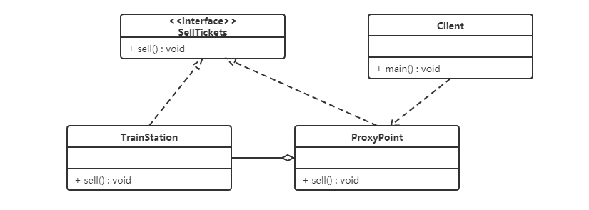


```java
package static_proxy;

/**
 * Project name(项目名称)：java设计模式_代理模式
 * Package(包名): static_proxy
 * Interface(接口名): SellTickets
 * Author(作者）: mao
 * Author QQ：1296193245
 * GitHub：https://github.com/maomao124/
 * Date(创建日期)： 2022/8/14
 * Time(创建时间)： 22:00
 * Version(版本): 1.0
 * Description(描述)： 卖票接口
 */

public interface SellTickets
{
    void sell();
}
```


```java
package static_proxy;

/**
 * Project name(项目名称)：java设计模式_代理模式
 * Package(包名): static_proxy
 * Class(类名): TrainStation
 * Author(作者）: mao
 * Author QQ：1296193245
 * GitHub：https://github.com/maomao124/
 * Date(创建日期)： 2022/8/14
 * Time(创建时间)： 22:01
 * Version(版本): 1.0
 * Description(描述)： 火车站  火车站具有卖票功能
 */

public class TrainStation implements SellTickets
{

    @Override
    public void sell()
    {
        System.out.println("火车站卖票");
    }
}
```


```java
package static_proxy;

/**
 * Project name(项目名称)：java设计模式_代理模式
 * Package(包名): static_proxy
 * Class(类名): ProxyPoint
 * Author(作者）: mao
 * Author QQ：1296193245
 * GitHub：https://github.com/maomao124/
 * Date(创建日期)： 2022/8/14
 * Time(创建时间)： 22:01
 * Version(版本): 1.0
 * Description(描述)： 无
 */

public class ProxyPoint implements SellTickets
{

    private final TrainStation station = new TrainStation();

    @Override
    public void sell()
    {
        System.out.println("代理点收取一些服务费用");
        station.sell();
    }
}
```


```java
package static_proxy;

/**
 * Project name(项目名称)：java设计模式_代理模式
 * Package(包名): static_proxy
 * Class(类名): Test
 * Author(作者）: mao
 * Author QQ：1296193245
 * GitHub：https://github.com/maomao124/
 * Date(创建日期)： 2022/8/14
 * Time(创建时间)： 22:04
 * Version(版本): 1.0
 * Description(描述)： 无
 */

public class Test
{
    public static void main(String[] args)
    {
        SellTickets sellTickets = new ProxyPoint();
        sellTickets.sell();
    }
}
```


ProxyPoint作为访问对象和目标对象的中介。同时也对sell方法进行了增强


### JDK动态代理

Java中提供了一个动态代理类Proxy，提供了一个创建代理对象的静态方法（newProxyInstance方法）来获取代理对象


```java
package jdk_proxy;

/**
 * Project name(项目名称)：java设计模式_代理模式
 * Package(包名): jdk_proxy
 * Interface(接口名): SellTickets
 * Author(作者）: mao
 * Author QQ：1296193245
 * GitHub：https://github.com/maomao124/
 * Date(创建日期)： 2022/8/14
 * Time(创建时间)： 22:07
 * Version(版本): 1.0
 * Description(描述)： 无
 */

public interface SellTickets
{
    void sell();
}
```


```java
package jdk_proxy;

/**
 * Project name(项目名称)：java设计模式_代理模式
 * Package(包名): jdk_proxy
 * Class(类名): TrainStation
 * Author(作者）: mao
 * Author QQ：1296193245
 * GitHub：https://github.com/maomao124/
 * Date(创建日期)： 2022/8/14
 * Time(创建时间)： 22:08
 * Version(版本): 1.0
 * Description(描述)： 无
 */

public class TrainStation implements SellTickets
{

    @Override
    public void sell()
    {
        System.out.println("火车站卖票");
    }
}
```


```java
package jdk_proxy;

import java.lang.reflect.InvocationHandler;
import java.lang.reflect.Method;
import java.lang.reflect.Proxy;

/**
 * Project name(项目名称)：java设计模式_代理模式
 * Package(包名): jdk_proxy
 * Class(类名): ProxyFactory
 * Author(作者）: mao
 * Author QQ：1296193245
 * GitHub：https://github.com/maomao124/
 * Date(创建日期)： 2022/8/14
 * Time(创建时间)： 22:08
 * Version(版本): 1.0
 * Description(描述)： 无
 */

public class ProxyFactory
{
    TrainStation trainStation = new TrainStation();

    public SellTickets getProxy()
    {
        return (SellTickets) Proxy.newProxyInstance(trainStation.getClass().getClassLoader(), new Class[]{SellTickets.class}, new InvocationHandler()
        {
            @Override
            public Object invoke(Object proxy1, Method method, Object[] args) throws Throwable
            {
                if (method.getName().equals("sell"))
                {
                    System.out.println("代理点收取一些服务费用");
                    return method.invoke(trainStation, args);
                }
                else
                {
                    return method.invoke(trainStation, args);
                }
            }
        });
    }
}
```


```java
package jdk_proxy;

/**
 * Project name(项目名称)：java设计模式_代理模式
 * Package(包名): jdk_proxy
 * Class(类名): Test
 * Author(作者）: mao
 * Author QQ：1296193245
 * GitHub：https://github.com/maomao124/
 * Date(创建日期)： 2022/8/14
 * Time(创建时间)： 22:17
 * Version(版本): 1.0
 * Description(描述)： 无
 */

public class Test
{
    public static void main(String[] args)
    {
        SellTickets sellTickets = new ProxyFactory().getProxy();
        sellTickets.sell();
    }
}
```


### JDK动态代理原理

ProxyFactory不是代理模式中所说的代理类，而代理类是程序在运行过程中动态的在内存中生成的类。通过阿里巴巴开源的 Java 诊断工具（Arthas【阿尔萨斯】）查看代理类的结构


```java
public final class $Proxy0 extends Proxy implements SellTickets {
    private static Method m1;
    private static Method m2;
    private static Method m3;
    private static Method m0;

    public $Proxy0(InvocationHandler invocationHandler) {
        super(invocationHandler);
    }

    static {
        try {
            m1 = Class.forName("java.lang.Object").getMethod("equals", Class.forName("java.lang.Object"));
            m2 = Class.forName("java.lang.Object").getMethod("toString", new Class[0]);
            m3 = Class.forName("com.itheima.proxy.dynamic.jdk.SellTickets").getMethod("sell", new Class[0]);
            m0 = Class.forName("java.lang.Object").getMethod("hashCode", new Class[0]);
            return;
        }
        catch (NoSuchMethodException noSuchMethodException) {
            throw new NoSuchMethodError(noSuchMethodException.getMessage());
        }
        catch (ClassNotFoundException classNotFoundException) {
            throw new NoClassDefFoundError(classNotFoundException.getMessage());
        }
    }

    public final boolean equals(Object object) {
        try {
            return (Boolean)this.h.invoke(this, m1, new Object[]{object});
        }
        catch (Error | RuntimeException throwable) {
            throw throwable;
        }
        catch (Throwable throwable) {
            throw new UndeclaredThrowableException(throwable);
        }
    }

    public final String toString() {
        try {
            return (String)this.h.invoke(this, m2, null);
        }
        catch (Error | RuntimeException throwable) {
            throw throwable;
        }
        catch (Throwable throwable) {
            throw new UndeclaredThrowableException(throwable);
        }
    }

    public final int hashCode() {
        try {
            return (Integer)this.h.invoke(this, m0, null);
        }
        catch (Error | RuntimeException throwable) {
            throw throwable;
        }
        catch (Throwable throwable) {
            throw new UndeclaredThrowableException(throwable);
        }
    }

    public final void sell() {
        try {
            this.h.invoke(this, m3, null);
            return;
        }
        catch (Error | RuntimeException throwable) {
            throw throwable;
        }
        catch (Throwable throwable) {
            throw new UndeclaredThrowableException(throwable);
        }
    }
}
```


* 代理类（$Proxy0）实现了SellTickets。这也就印证了我们之前说的真实类和代理类实现同样的接口。
* 代理类（$Proxy0）将我们提供了的匿名内部类对象传递给了父类。


执行流程如下：

    1. 在测试类中通过代理对象调用sell()方法
    2. 根据多态的特性，执行的是代理类（$Proxy0）中的sell()方法
    3. 代理类（$Proxy0）中的sell()方法中又调用了InvocationHandler接口的子实现类对象的invoke方法
    4. invoke方法通过反射执行了真实对象所属类(TrainStation)中的sell()方法


### CGLIB动态代理

SellTickets接口，只定义了TrainStation(火车站类)。很显然JDK代理是无法使用了，因为JDK动态代理要求必须定义接口，对接口进行代理。

CGLIB是一个功能强大，高性能的代码生成包。它为没有实现接口的类提供代理，为JDK的动态代理提供了很好的补充。


需要导入依赖：

```xml
<dependencies>
        <dependency>
            <groupId>cglib</groupId>
            <artifactId>cglib</artifactId>
            <version>3.3.0</version>
        </dependency>
    </dependencies>
```


**如果java8以上，运行时需要加jvm参数**

**--add-opens java.base/java.lang=ALL-UNNAMED**


```java
package cglib_proxy;

/**
 * Project name(项目名称)：java设计模式_代理模式
 * Package(包名): cglib_proxy
 * Class(类名): TrainStation
 * Author(作者）: mao
 * Author QQ：1296193245
 * GitHub：https://github.com/maomao124/
 * Date(创建日期)： 2022/8/15
 * Time(创建时间)： 20:34
 * Version(版本): 1.0
 * Description(描述)： 无
 */

public class TrainStation
{
    public void sell()
    {
        System.out.println("火车站卖票");
    }
}
```


```java
package cglib_proxy;

import net.sf.cglib.proxy.Enhancer;
import net.sf.cglib.proxy.MethodInterceptor;
import net.sf.cglib.proxy.MethodProxy;

import java.lang.reflect.Method;

/**
 * Project name(项目名称)：java设计模式_代理模式
 * Package(包名): cglib_proxy
 * Class(类名): ProxyFactory
 * Author(作者）: mao
 * Author QQ：1296193245
 * GitHub：https://github.com/maomao124/
 * Date(创建日期)： 2022/8/15
 * Time(创建时间)： 20:34
 * Version(版本): 1.0
 * Description(描述)： 无
 */

public class ProxyFactory implements MethodInterceptor
{

    private final TrainStation trainStation = new TrainStation();

    /**
     * @param o           代理对象
     * @param method      真实对象中的方法的Method实例
     * @param objects     实际参数
     * @param methodProxy 代理对象中的方法的method实例
     * @return TrainStation对象
     * @throws Throwable Throwable
     */
    @Override
    public TrainStation intercept(Object o, Method method, Object[] objects, MethodProxy methodProxy) throws Throwable
    {
        System.out.println("代理点收取一些服务费用");
        Object result = methodProxy.invokeSuper(o, objects);
        return (TrainStation) result;
    }

    /**
     * 获得代理对象
     *
     * @return TrainStation对象
     */
    public TrainStation getProxyObject()
    {
        //创建Enhancer对象
        Enhancer enhancer = new Enhancer();
        //设置父类的字节码对象
        enhancer.setSuperclass(trainStation.getClass());
        //设置回调函数
        enhancer.setCallback(this);
        Object o = enhancer.create();
        return (TrainStation) o;
    }
}
```


```java
package cglib_proxy;

/**
 * Project name(项目名称)：java设计模式_代理模式
 * Package(包名): cglib_proxy
 * Class(类名): Test
 * Author(作者）: mao
 * Author QQ：1296193245
 * GitHub：https://github.com/maomao124/
 * Date(创建日期)： 2022/8/15
 * Time(创建时间)： 20:41
 * Version(版本): 1.0
 * Description(描述)： 无
 */

public class Test
{
    public static void main(String[] args)
    {
        ProxyFactory proxyFactory = new ProxyFactory();
        TrainStation trainStation = proxyFactory.getProxyObject();
        trainStation.sell();
    }
}
```


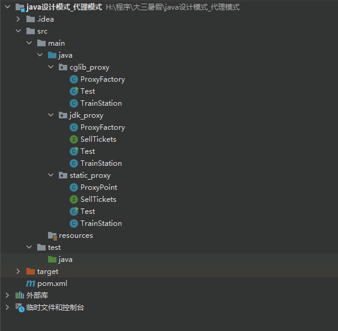


### 三种代理对比

* jdk代理和CGLIB代理

  使用CGLib实现动态代理，CGLib底层采用ASM字节码生成框架，使用字节码技术生成代理类，在JDK1.6之前比使用Java反射效率要高。唯一需要注意的是，CGLib不能对声明为final的类或者方法进行代理，因为CGLib原理是动态生成被代理类的子类。

  在JDK1.6、JDK1.7、JDK1.8逐步对JDK动态代理优化之后，在调用次数较少的情况下，JDK代理效率高于CGLib代理效率，只有当进行大量调用的时候，JDK1.6和JDK1.7比CGLib代理效率低一点，但是到JDK1.8的时候，JDK代理效率高于CGLib代理。所以如果有接口使用JDK动态代理，如果没有接口使用CGLIB代理。

* 动态代理和静态代理

  动态代理与静态代理相比较，最大的好处是接口中声明的所有方法都被转移到调用处理器一个集中的方法中处理（InvocationHandler.invoke）。这样，在接口方法数量比较多的时候，我们可以进行灵活处理，而不需要像静态代理那样每一个方法进行中转。

  如果接口增加一个方法，静态代理模式除了所有实现类需要实现这个方法外，所有代理类也需要实现此方法。增加了代码维护的复杂度。而动态代理不会出现该问题


### 优缺点

**优点：**

- 代理模式在客户端与目标对象之间起到一个中介作用和保护目标对象的作用；
- 代理对象可以扩展目标对象的功能；
- 代理模式能将客户端与目标对象分离，在一定程度上降低了系统的耦合度；

**缺点：**

* 增加了系统的复杂度；


### 使用场景 

* 远程（Remote）代理

  本地服务通过网络请求远程服务。为了实现本地到远程的通信，我们需要实现网络通信，处理其中可能的异常。为良好的代码设计和可维护性，我们将网络通信部分隐藏起来，只暴露给本地服务一个接口，通过该接口即可访问远程服务提供的功能，而不必过多关心通信部分的细节。

* 防火墙（Firewall）代理

  当你将浏览器配置成使用代理功能时，防火墙就将你的浏览器的请求转给互联网；当互联网返回响应时，代理服务器再把它转给你的浏览器。

* 保护（Protect or Access）代理

  控制对一个对象的访问，如果需要，可以给不同的用户提供不同级别的使用权限。


## 适配器模式

### 概念

如果去欧洲国家去旅游的话，他们的插座是欧洲标准。而我们使用的插头如下图最右边的。因此我们的笔记本电脑，手机在当地不能直接充电。所以就需要一个插座转换器，转换器第1面插入当地的插座，第2面供我们充电，这样使得我们的插头在当地能使用。生活中这样的例子很多，手机充电器（将220v转换为5v的电压），读卡器等，其实就是使用到了适配器模式。


**将一个类的接口转换成客户希望的另外一个接口，使得原本由于接口不兼容而不能一起工作的那些类能一起工作。**

适配器模式分为类适配器模式和对象适配器模式，前者类之间的耦合度比后者高，且要求程序员了解现有组件库中的相关组件的内部结构，所以应用相对较少些。


### 结构

适配器模式（Adapter）包含以下主要角色：

* 目标（Target）接口：当前系统业务所期待的接口，它可以是抽象类或接口。
* 适配者（Adaptee）类：它是被访问和适配的现存组件库中的组件接口。
* 适配器（Adapter）类：它是一个转换器，通过继承或引用适配者的对象，把适配者接口转换成目标接口，让客户按目标接口的格式访问适配者。


### 类适配器模式

实现方式：定义一个适配器类来实现当前系统的业务接口，同时又继承现有组件库中已经存在的组件。


**示例：读卡器**

现有一台电脑只能读取SD卡，而要读取TF卡中的内容的话就需要使用到适配器模式。创建一个读卡器，将TF卡中的内容读取出来。


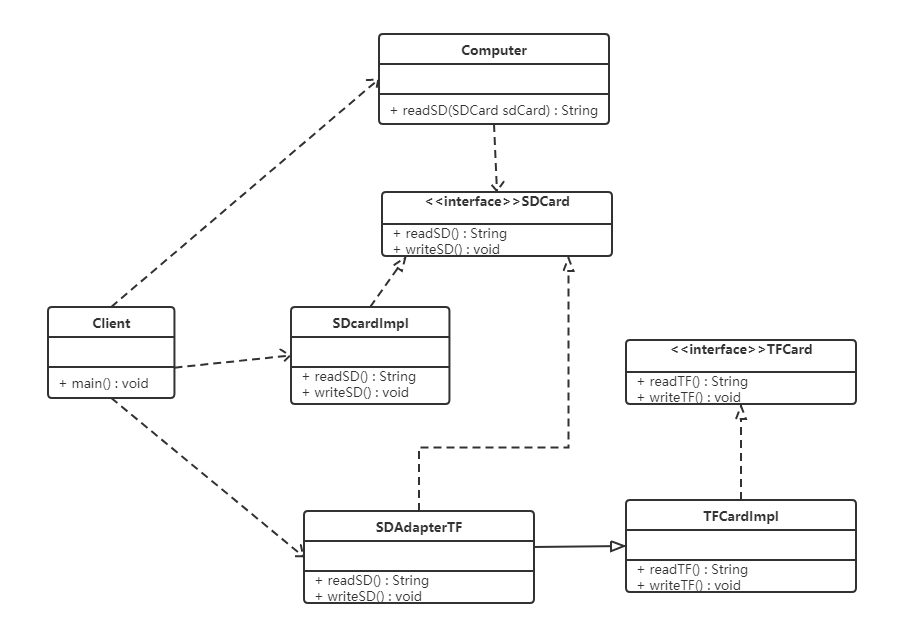


```java
package mao.class_adapter;

/**
 * Project name(项目名称)：java设计模式_适配器模式
 * Package(包名): mao.class_adapter
 * Interface(接口名): SDCard
 * Author(作者）: mao
 * Author QQ：1296193245
 * GitHub：https://github.com/maomao124/
 * Date(创建日期)： 2022/8/15
 * Time(创建时间)： 21:09
 * Version(版本): 1.0
 * Description(描述)： SD卡的接口
 */

public interface SDCard
{
    /**
     * 读取SD卡
     *
     * @return String
     */
    String readSD();

    /**
     * 写入SD卡
     *
     * @param msg 写入的数据
     */
    void writeSD(String msg);

}

```


```java
package mao.class_adapter;

/**
 * Project name(项目名称)：java设计模式_适配器模式
 * Package(包名): mao.class_adapter
 * Class(类名): SDCardImpl
 * Author(作者）: mao
 * Author QQ：1296193245
 * GitHub：https://github.com/maomao124/
 * Date(创建日期)： 2022/8/15
 * Time(创建时间)： 21:10
 * Version(版本): 1.0
 * Description(描述)： SD卡实现类
 */

public class SDCardImpl implements SDCard
{

    @Override
    public String readSD()
    {
        return "读取SD卡";
    }

    @Override
    public void writeSD(String msg)
    {
        System.out.println("写入SD卡：" + msg);
    }
}
```


```java
package mao.class_adapter;

/**
 * Project name(项目名称)：java设计模式_适配器模式
 * Package(包名): mao.class_adapter
 * Class(类名): Computer
 * Author(作者）: mao
 * Author QQ：1296193245
 * GitHub：https://github.com/maomao124/
 * Date(创建日期)： 2022/8/15
 * Time(创建时间)： 21:11
 * Version(版本): 1.0
 * Description(描述)： 无
 */

public class Computer
{
    public String readSD(SDCard sdCard)
    {
        if (sdCard == null)
        {
            throw new NullPointerException("sd card is null!");
        }
        return sdCard.readSD();
    }

    public void writeSD(SDCard sdCard, String msg)
    {
        if (sdCard == null)
        {
            throw new NullPointerException("sd card is null!");
        }
        sdCard.writeSD(msg);
    }
}
```


```java
package mao.class_adapter;

/**
 * Project name(项目名称)：java设计模式_适配器模式
 * Package(包名): mao.class_adapter
 * Interface(接口名): TFCard
 * Author(作者）: mao
 * Author QQ：1296193245
 * GitHub：https://github.com/maomao124/
 * Date(创建日期)： 2022/8/15
 * Time(创建时间)： 21:15
 * Version(版本): 1.0
 * Description(描述)： TF卡接口
 */

public interface TFCard
{
    /**
     * 读取TF卡
     *
     * @return String
     */
    String readTF();

    /**
     * 写入TF卡
     *
     * @param msg 数据
     */
    void writeTF(String msg);

}
```


```java
package mao.class_adapter;

/**
 * Project name(项目名称)：java设计模式_适配器模式
 * Package(包名): mao.class_adapter
 * Class(类名): TFCardImpl
 * Author(作者）: mao
 * Author QQ：1296193245
 * GitHub：https://github.com/maomao124/
 * Date(创建日期)： 2022/8/15
 * Time(创建时间)： 21:16
 * Version(版本): 1.0
 * Description(描述)： TF卡实现类
 */

public class TFCardImpl implements TFCard
{

    @Override
    public String readTF()
    {
        return "读取TF卡";
    }

    @Override
    public void writeTF(String msg)
    {
        System.out.println("写入TF卡：" + msg);
    }
}
```


```java
package mao.class_adapter;

/**
 * Project name(项目名称)：java设计模式_适配器模式
 * Package(包名): mao.class_adapter
 * Class(类名): SDAdapterTF
 * Author(作者）: mao
 * Author QQ：1296193245
 * GitHub：https://github.com/maomao124/
 * Date(创建日期)： 2022/8/15
 * Time(创建时间)： 21:17
 * Version(版本): 1.0
 * Description(描述)： 适配器类（SD兼容TF）
 */

public class SDAdapterTF extends TFCardImpl implements SDCard
{

    @Override
    public String readSD()
    {
        return this.readTF();
    }

    @Override
    public void writeSD(String msg)
    {
        this.writeTF(msg);
    }
}
```


```java
package mao.class_adapter;

/**
 * Project name(项目名称)：java设计模式_适配器模式
 * Package(包名): mao.class_adapter
 * Class(类名): Test
 * Author(作者）: mao
 * Author QQ：1296193245
 * GitHub：https://github.com/maomao124/
 * Date(创建日期)： 2022/8/15
 * Time(创建时间)： 21:19
 * Version(版本): 1.0
 * Description(描述)： 无
 */

public class Test
{
    public static void main(String[] args)
    {
        Computer computer = new Computer();
        SDCard sdCard = new SDCardImpl();
        System.out.println(computer.readSD(sdCard));
        computer.writeSD(sdCard, "hello");

        SDCard sdCard1 = new SDAdapterTF();
        System.out.println(computer.readSD(sdCard1));
        computer.writeSD(sdCard1, "hello");
    }
}
```


类适配器模式违背了合成复用原则。类适配器是客户类有一个接口规范的情况下可用，反之不可用。


### 对象适配器模式

实现方式：对象适配器模式可釆用将现有组件库中已经实现的组件引入适配器类中，该类同时实现当前系统的业务接口。


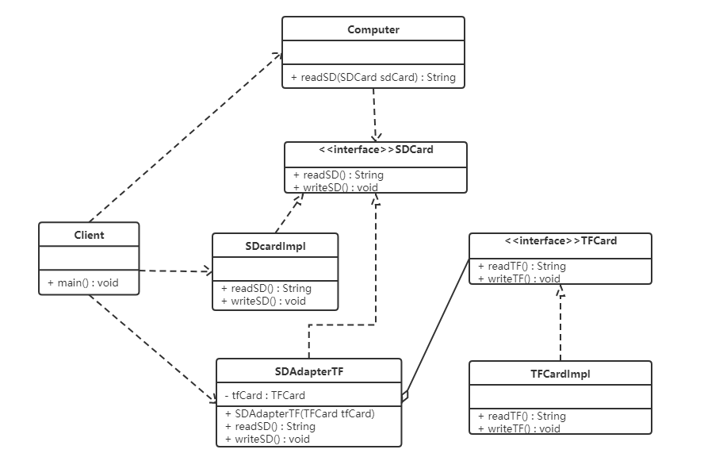


```java
package mao.object_adapter;

/**
 * Project name(项目名称)：java设计模式_适配器模式
 * Package(包名): mao.object_adapter
 * Class(类名): SDAdapterTF
 * Author(作者）: mao
 * Author QQ：1296193245
 * GitHub：https://github.com/maomao124/
 * Date(创建日期)： 2022/8/15
 * Time(创建时间)： 21:30
 * Version(版本): 1.0
 * Description(描述)： 无
 */

public class SDAdapterTF implements SDCard
{
    private final TFCard tfCard;

    public SDAdapterTF(TFCard tfCard)
    {
        this.tfCard = tfCard;
    }

    @Override
    public String readSD()
    {
        return tfCard.readTF();
    }

    @Override
    public void writeSD(String msg)
    {
        tfCard.writeTF(msg);
    }
}
```


```java
package mao.object_adapter;

/**
 * Project name(项目名称)：java设计模式_适配器模式
 * Package(包名): mao.object_adapter
 * Class(类名): Test
 * Author(作者）: mao
 * Author QQ：1296193245
 * GitHub：https://github.com/maomao124/
 * Date(创建日期)： 2022/8/15
 * Time(创建时间)： 21:33
 * Version(版本): 1.0
 * Description(描述)： 无
 */

public class Test
{
    public static void main(String[] args)
    {
        Computer computer = new Computer();
        SDCard sdCard = new SDCardImpl();
        System.out.println(computer.readSD(sdCard));
        computer.writeSD(sdCard, "hello");

        SDAdapterTF sdAdapterTF = new SDAdapterTF(new TFCardImpl());
        System.out.println(computer.readSD(sdAdapterTF));
        computer.writeSD(sdAdapterTF, "hello");
    }
}
```


### 接口适配器模式

当不希望实现一个接口中所有的方法时，可以创建一个抽象类Adapter ，实现所有方法。而此时我们只需要继承该抽象类即可。


```java
package mao.interface_adapter;

/**
 * Project name(项目名称)：java设计模式_适配器模式
 * Package(包名): mao.interface_adapter
 * Interface(接口名): interface_s
 * Author(作者）: mao
 * Author QQ：1296193245
 * GitHub：https://github.com/maomao124/
 * Date(创建日期)： 2022/8/15
 * Time(创建时间)： 21:39
 * Version(版本): 1.0
 * Description(描述)： 无
 */

public interface interface_s
{
    void a();

    void b();

    void c();

    void d();

    void e();

    void f();

}
```


```java
package mao.interface_adapter;

/**
 * Project name(项目名称)：java设计模式_适配器模式
 * Package(包名): mao.interface_adapter
 * Class(类名): interfaceAdapter
 * Author(作者）: mao
 * Author QQ：1296193245
 * GitHub：https://github.com/maomao124/
 * Date(创建日期)： 2022/8/15
 * Time(创建时间)： 21:41
 * Version(版本): 1.0
 * Description(描述)： 无
 */

public abstract class interfaceAdapter implements interface_s
{
    @Override
    public void a()
    {
        
    }

    @Override
    public void b()
    {

    }

    @Override
    public void c()
    {

    }

    @Override
    public void d()
    {

    }

    @Override
    public void e()
    {

    }

    @Override
    public void f()
    {

    }
}
```


```java
package mao.interface_adapter;

/**
 * Project name(项目名称)：java设计模式_适配器模式
 * Package(包名): mao.interface_adapter
 * Class(类名): Run
 * Author(作者）: mao
 * Author QQ：1296193245
 * GitHub：https://github.com/maomao124/
 * Date(创建日期)： 2022/8/15
 * Time(创建时间)： 21:44
 * Version(版本): 1.0
 * Description(描述)： 无
 */

public class Run
{
    private final interface_s s;

    public Run(interface_s s)
    {
        this.s = s;
    }

    public void run()
    {
        s.a();
        s.b();
        s.c();
        s.d();
        s.e();
        s.f();
    }
}
```


```java
package mao.interface_adapter;

/**
 * Project name(项目名称)：java设计模式_适配器模式
 * Package(包名): mao.interface_adapter
 * Class(类名): Test
 * Author(作者）: mao
 * Author QQ：1296193245
 * GitHub：https://github.com/maomao124/
 * Date(创建日期)： 2022/8/15
 * Time(创建时间)： 21:41
 * Version(版本): 1.0
 * Description(描述)： 无
 */

public class Test
{
    public static void main(String[] args)
    {
        {
            Run run = new Run(new interface_s()
            {
                @Override
                public void a()
                {
                    System.out.println("a方法运行");
                }

                @Override
                public void b()
                {
                    System.out.println("b方法运行");
                }

                @Override
                public void c()
                {
                    System.out.println("c方法运行");
                }

                @Override
                public void d()
                {
                    System.out.println("d方法运行");
                }

                @Override
                public void e()
                {
                    System.out.println("e方法运行");
                }

                @Override
                public void f()
                {
                    System.out.println("f方法运行");
                }
            });
            run.run();
        }

        System.out.println("---------------");

        {
            Run run = new Run(new interfaceAdapter()
            {
                @Override
                public void a()
                {
                    System.out.println("a方法运行");
                }

                @Override
                public void c()
                {
                    System.out.println("c方法运行");
                }

                @Override
                public void f()
                {
                    System.out.println("f方法运行");
                }
            });
            run.run();
        }

    }
}
```


运行结果：

```sh
a方法运行
b方法运行
c方法运行
d方法运行
e方法运行
f方法运行
---------------
a方法运行
c方法运行
f方法运行
```


在swing中的Listener中用到了大量的接口适配器模式


```java
package mao.interface_adapter;

import javax.swing.*;
import java.awt.*;
import java.awt.event.KeyEvent;
import java.awt.event.KeyListener;
import java.awt.event.WindowEvent;
import java.awt.event.WindowListener;

/**
 * Project name(项目名称)：java设计模式_适配器模式
 * Package(包名): mao.interface_adapter
 * Class(类名): Test2
 * Author(作者）: mao
 * Author QQ：1296193245
 * GitHub：https://github.com/maomao124/
 * Date(创建日期)： 2022/8/15
 * Time(创建时间)： 21:50
 * Version(版本): 1.0
 * Description(描述)： 无
 */

public class Test2
{
    public static void main(String[] args)
    {
        JFrame jFrame = new JFrame("接口适配器模式");                            //初始化顶层面板
        jFrame.setSize(1280, 720);
        int screenWidth = Toolkit.getDefaultToolkit().getScreenSize().width;       //获取屏幕宽度
        int screenHeight = Toolkit.getDefaultToolkit().getScreenSize().height;     //获取屏幕高度
        jFrame.setLocation(screenWidth / 2 - jFrame.getWidth() / 2, screenHeight / 2 - jFrame.getHeight() / 2);  //位于屏幕中央
        jFrame.setDefaultCloseOperation(WindowConstants.DO_NOTHING_ON_CLOSE);

        jFrame.addWindowListener(new WindowListener()
        {
            @Override
            public void windowOpened(WindowEvent e)
            {

            }

            @Override
            public void windowClosing(WindowEvent e)
            {
                System.out.println("窗口即将关闭...");
                System.exit(0);
            }

            @Override
            public void windowClosed(WindowEvent e)
            {

            }

            @Override
            public void windowIconified(WindowEvent e)
            {

            }

            @Override
            public void windowDeiconified(WindowEvent e)
            {

            }

            @Override
            public void windowActivated(WindowEvent e)
            {

            }

            @Override
            public void windowDeactivated(WindowEvent e)
            {

            }
        });

        jFrame.addKeyListener(new KeyListener()
        {
            @Override
            public void keyTyped(KeyEvent e)
            {

            }

            @Override
            public void keyPressed(KeyEvent e)
            {
                System.out.println("按下按键："+e.getKeyChar());
            }

            @Override
            public void keyReleased(KeyEvent e)
            {

            }
        });
        jFrame.setVisible(true);
    }
}
```


改成抽象类


```java
package mao.interface_adapter;

import javax.swing.*;
import java.awt.*;
import java.awt.event.KeyAdapter;
import java.awt.event.KeyEvent;
import java.awt.event.WindowAdapter;
import java.awt.event.WindowEvent;

/**
 * Project name(项目名称)：java设计模式_适配器模式
 * Package(包名): mao.interface_adapter
 * Class(类名): Test3
 * Author(作者）: mao
 * Author QQ：1296193245
 * GitHub：https://github.com/maomao124/
 * Date(创建日期)： 2022/8/15
 * Time(创建时间)： 21:59
 * Version(版本): 1.0
 * Description(描述)： 无
 */

public class Test3
{
    public static void main(String[] args)
    {
        JFrame jFrame = new JFrame("接口适配器模式");                          //初始化顶层面板
        jFrame.setSize(1280, 720);
        int screenWidth = Toolkit.getDefaultToolkit().getScreenSize().width;       //获取屏幕宽度
        int screenHeight = Toolkit.getDefaultToolkit().getScreenSize().height;     //获取屏幕高度
        jFrame.setLocation(screenWidth / 2 - jFrame.getWidth() / 2, screenHeight / 2 - jFrame.getHeight() / 2);  //位于屏幕中央
        jFrame.setDefaultCloseOperation(WindowConstants.DO_NOTHING_ON_CLOSE);

        jFrame.addWindowListener(new WindowAdapter()
        {
            @Override
            public void windowClosing(WindowEvent e)
            {
                System.out.println("窗口即将关闭...");
                System.exit(0);
            }
        });

        jFrame.addKeyListener(new KeyAdapter()
        {
            @Override
            public void keyPressed(KeyEvent e)
            {
                System.out.println("按下按键：" + e.getKeyChar());
            }
        });
        jFrame.setVisible(true);
    }
}
```


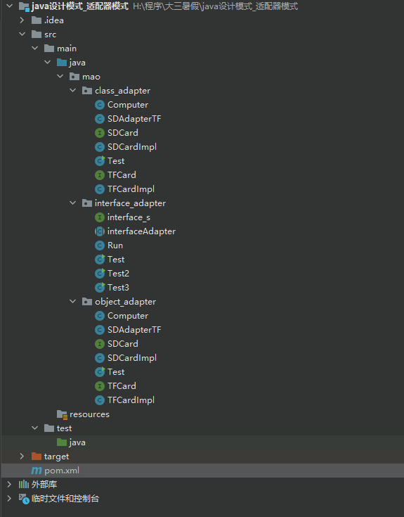


### 应用场景

* 以前开发的系统存在满足新系统功能需求的类，但其接口同新系统的接口不一致。
* 使用第三方提供的组件，但组件接口定义和自己要求的接口定义不同。


### JDK源码


Reader（字符流）、InputStream（字节流）的适配使用的是InputStreamReader。

InputStreamReader继承自java.io包中的Reader，对他中的抽象的未实现的方法给出实现。


```java
public int read() throws IOException 
{
    return sd.read();
}

public int read(char cbuf[], int offset, int length) throws IOException 
{
    return sd.read(cbuf, offset, length);
}
```


* InputStreamReader是对同样实现了Reader的StreamDecoder的封装。
* StreamDecoder不是Java SE API中的内容，是Sun  JDK给出的自身实现。但我们知道他们对构造方法中的字节流类（InputStream）进行封装，并通过该类进行了字节流和字符流之间的解码转换。

从表层来看，InputStreamReader做了InputStream字节流类到Reader字符流之间的转换。而从如上Sun JDK中的实现类关系结构中可以看出，是StreamDecoder的设计实现在实际上采用了适配器模式


## 装饰者模式

### 概念

先来看一个快餐店的例子

快餐店有炒面、炒饭这些快餐，可以额外附加鸡蛋、火腿、培根这些配菜，当然加配菜需要额外加钱，每个配菜的价钱通常不太一样，那么计算总价就会显得比较麻烦。


使用继承的方式存在的问题：

* 扩展性不好

  如果要再加一种配料（火腿肠），我们就会发现需要给FriedRice和FriedNoodles分别定义一个子类。如果要新增一个快餐品类（炒河粉）的话，就需要定义更多的子类。

* 产生过多的子类


**定义：**

​	指在不改变现有对象结构的情况下，动态地给该对象增加一些职责（即增加其额外功能）的模式。


### 结构

装饰（Decorator）模式中的角色：

* 抽象构件（Component）角色 ：定义一个抽象接口以规范准备接收附加责任的对象。
* 具体构件（Concrete  Component）角色 ：实现抽象构件，通过装饰角色为其添加一些职责。
* 抽象装饰（Decorator）角色 ： 继承或实现抽象构件，并包含具体构件的实例，可以通过其子类扩展具体构件的功能。
* 具体装饰（ConcreteDecorator）角色 ：实现抽象装饰的相关方法，并给具体构件对象添加附加的责任。


### 示例

我们使用装饰者模式对快餐店案例进行改进


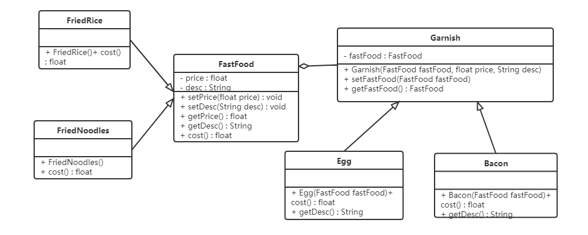


```java
package mao;

/**
 * Project name(项目名称)：java设计模式_装饰者模式
 * Package(包名): mao
 * Class(类名): FastFood
 * Author(作者）: mao
 * Author QQ：1296193245
 * GitHub：https://github.com/maomao124/
 * Date(创建日期)： 2022/8/15
 * Time(创建时间)： 22:25
 * Version(版本): 1.0
 * Description(描述)： 炒面
 */

public abstract class FastFood
{
    //基础价格
    private float price;
    //描述
    private String desc;

    /**
     * Instantiates a new Fast food.
     */
    public FastFood()
    {
    }

    /**
     * Instantiates a new Fast food.
     *
     * @param price the price
     * @param desc  the desc
     */
    public FastFood(float price, String desc)
    {
        this.price = price;
        this.desc = desc;
    }

    /**
     * Gets price.
     *
     * @return the price
     */
    public float getPrice()
    {
        return price;
    }

    /**
     * Sets price.
     *
     * @param price the price
     */
    public void setPrice(float price)
    {
        this.price = price;
    }

    /**
     * Gets desc.
     *
     * @return the desc
     */
    public String getDesc()
    {
        return desc;
    }

    /**
     * Sets desc.
     *
     * @param desc the desc
     */
    public void setDesc(String desc)
    {
        this.desc = desc;
    }

    /**
     * 获取价格的抽象方法
     *
     * @return 价格 float
     */
    public abstract float cost();


}
```


```java
package mao;

/**
 * Project name(项目名称)：java设计模式_装饰者模式
 * Package(包名): mao
 * Class(类名): FriedRice
 * Author(作者）: mao
 * Author QQ：1296193245
 * GitHub：https://github.com/maomao124/
 * Date(创建日期)： 2022/8/15
 * Time(创建时间)： 22:26
 * Version(版本): 1.0
 * Description(描述)： 炒饭
 */

public class FriedRice extends FastFood
{
    public FriedRice()
    {
        super(10, "炒饭");
    }

    @Override
    public float cost()
    {
        return this.getPrice();
    }
}
```


```java
package mao;

/**
 * Project name(项目名称)：java设计模式_装饰者模式
 * Package(包名): mao
 * Class(类名): FriedNoodles
 * Author(作者）: mao
 * Author QQ：1296193245
 * GitHub：https://github.com/maomao124/
 * Date(创建日期)： 2022/8/15
 * Time(创建时间)： 22:28
 * Version(版本): 1.0
 * Description(描述)： 无
 */

public class FriedNoodles extends FastFood
{

    public FriedNoodles()
    {
        super(12, "炒面");
    }

    @Override
    public float cost()
    {
        return this.getPrice();
    }
}
```


```java
package mao;

/**
 * Project name(项目名称)：java设计模式_装饰者模式
 * Package(包名): mao
 * Class(类名): Garnish
 * Author(作者）: mao
 * Author QQ：1296193245
 * GitHub：https://github.com/maomao124/
 * Date(创建日期)： 2022/8/15
 * Time(创建时间)： 22:29
 * Version(版本): 1.0
 * Description(描述)： 配料类
 */

public abstract class Garnish extends FastFood
{
    private FastFood fastFood;

    /**
     * Gets fast food.
     *
     * @return the fast food
     */
    public FastFood getFastFood()
    {
        return fastFood;
    }

    /**
     * Sets fast food.
     *
     * @param fastFood the fast food
     */
    public void setFastFood(FastFood fastFood)
    {
        this.fastFood = fastFood;
    }

    /**
     * Instantiates a new Garnish.
     *
     * @param price    the price
     * @param desc     the desc
     * @param fastFood the fast food
     */
    public Garnish(float price, String desc, FastFood fastFood)
    {
        super(price, desc);
        this.fastFood = fastFood;
    }
}
```


```java
package mao;

/**
 * Project name(项目名称)：java设计模式_装饰者模式
 * Package(包名): mao
 * Class(类名): Egg
 * Author(作者）: mao
 * Author QQ：1296193245
 * GitHub：https://github.com/maomao124/
 * Date(创建日期)： 2022/8/15
 * Time(创建时间)： 22:31
 * Version(版本): 1.0
 * Description(描述)： 鸡蛋配料
 */

public class Egg extends Garnish
{
    public Egg(FastFood fastFood)
    {
        super(1, "鸡蛋", fastFood);
    }

    @Override
    public float cost()
    {
        return super.getPrice() + getFastFood().cost();
    }

    @Override
    public String getDesc()
    {
        return super.getDesc() + getFastFood().getDesc();
    }
}
```


```java
package mao;

/**
 * Project name(项目名称)：java设计模式_装饰者模式
 * Package(包名): mao
 * Class(类名): Bacon
 * Author(作者）: mao
 * Author QQ：1296193245
 * GitHub：https://github.com/maomao124/
 * Date(创建日期)： 2022/8/15
 * Time(创建时间)： 22:35
 * Version(版本): 1.0
 * Description(描述)： 无
 */

public class Bacon extends Garnish
{

    public Bacon(FastFood fastFood)
    {
        super(2, "培根", fastFood);
    }

    @Override
    public float cost()
    {
        return getPrice() + getFastFood().cost();
    }

    @Override
    public String getDesc()
    {
        return super.getDesc() + getFastFood().getDesc();
    }
}
```


```java
package mao;

/**
 * Project name(项目名称)：java设计模式_装饰者模式
 * Package(包名): mao
 * Class(类名): Test
 * Author(作者）: mao
 * Author QQ：1296193245
 * GitHub：https://github.com/maomao124/
 * Date(创建日期)： 2022/8/15
 * Time(创建时间)： 22:38
 * Version(版本): 1.0
 * Description(描述)： 无
 */

public class Test
{
    public static void main(String[] args)
    {
        {
            //炒饭
            FastFood fastFood = new FriedRice();
            //花费的价格
            System.out.println(fastFood.getDesc() + "：" + fastFood.cost() + "元");
            //加鸡蛋
            fastFood = new Egg(fastFood);
            //花费的价格
            System.out.println(fastFood.getDesc() + "：" + fastFood.cost() + "元");
            //加培根
            fastFood = new Bacon(fastFood);
            //花费的价格
            System.out.println(fastFood.getDesc() + "：" + fastFood.cost() + "元");
            //再加鸡蛋
            fastFood = new Egg(fastFood);
            //花费的价格
            System.out.println(fastFood.getDesc() + "：" + fastFood.cost() + "元");
        }
        System.out.println("----------------");
        {
            //炒面
            FastFood fastFood = new FriedNoodles();
            //花费的价格
            System.out.println(fastFood.getDesc() + "：" + fastFood.cost() + "元");
            //加鸡蛋
            fastFood = new Egg(fastFood);
            //花费的价格
            System.out.println(fastFood.getDesc() + "：" + fastFood.cost() + "元");
            //加培根
            fastFood = new Bacon(fastFood);
            //花费的价格
            System.out.println(fastFood.getDesc() + "：" + fastFood.cost() + "元");
            //再加鸡蛋
            fastFood = new Egg(fastFood);
            //花费的价格
            System.out.println(fastFood.getDesc() + "：" + fastFood.cost() + "元");
            //加培根
            fastFood = new Bacon(fastFood);
            //花费的价格
            System.out.println(fastFood.getDesc() + "：" + fastFood.cost() + "元");
        }
    }
}

```


运行结果：

```sh
炒饭：10.0元
鸡蛋炒饭：11.0元
培根鸡蛋炒饭：13.0元
鸡蛋培根鸡蛋炒饭：14.0元
----------------
炒面：12.0元
鸡蛋炒面：13.0元
培根鸡蛋炒面：15.0元
鸡蛋培根鸡蛋炒面：16.0元
培根鸡蛋培根鸡蛋炒面：18.0元
```


### 优点

* 饰者模式可以带来比继承更加灵活性的扩展功能，使用更加方便，可以通过组合不同的装饰者对象来获取具有不同行为状态的多样化的结果。装饰者模式比继承更具良好的扩展性，完美的遵循开闭原则，继承是静态的附加责任，装饰者则是动态的附加责任。
* 装饰类和被装饰类可以独立发展，不会相互耦合，装饰模式是继承的一个替代模式，装饰模式可以动态扩展一个实现类的功能。


### 使用场景

* 当不能采用继承的方式对系统进行扩充或者采用继承不利于系统扩展和维护时。

  不能采用继承的情况主要有两类：

  * 第一类是系统中存在大量独立的扩展，为支持每一种组合将产生大量的子类，使得子类数目呈爆炸性增长；
  * 第二类是因为类定义不能继承（如final类）

* 在不影响其他对象的情况下，以动态、透明的方式给单个对象添加职责。

* 当对象的功能要求可以动态地添加，也可以再动态地撤销时。


### JDK源码


IO流中的包装类使用到了装饰者模式。BufferedInputStream，BufferedOutputStream，BufferedReader，BufferedWriter。


BufferedWriter使用装饰者模式对Writer子实现类进行了增强，添加了缓冲区，提高了写数据的效率。


### 代理和装饰者的区别

静态代理和装饰者模式的区别：

* 相同点：
  * 都要实现与目标类相同的业务接口
  * 在两个类中都要声明目标对象
  * 都可以在不修改目标类的前提下增强目标方法
* 不同点：
  * 目的不同
    装饰者是为了增强目标对象
    静态代理是为了保护和隐藏目标对象
  * 获取目标对象构建的地方不同
    装饰者是由外界传递进来，可以通过构造方法传递
    静态代理是在代理类内部创建，以此来隐藏目标对象


## 桥接模式

### 概念

现在有一个需求，需要创建不同的图形，并且每个图形都有可能会有不同的颜色。我们可以利用继承的方式来设计类的关系


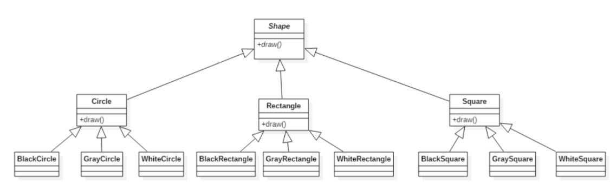


我们可以发现有很多的类，假如我们再增加一个形状或再增加一种颜色，就需要创建更多的类。

试想，在一个有多种可能会变化的维度的系统中，用继承方式会造成类爆炸，扩展起来不灵活。每次在一个维度上新增一个具体实现都要增加多个子类。为了更加灵活的设计系统，我们此时可以考虑使用桥接模式。

**定义：**

​	将抽象与实现分离，使它们可以独立变化。它是用组合关系代替继承关系来实现，从而降低了抽象和实现这两个可变维度的耦合度。


### 结构

桥接（Bridge）模式包含以下主要角色：

* 抽象化（Abstraction）角色 ：定义抽象类，并包含一个对实现化对象的引用。
* 扩展抽象化（Refined  Abstraction）角色 ：是抽象化角色的子类，实现父类中的业务方法，并通过组合关系调用实现化角色中的业务方法。
* 实现化（Implementor）角色 ：定义实现化角色的接口，供扩展抽象化角色调用。
* 具体实现化（Concrete Implementor）角色 ：给出实现化角色接口的具体实现。


### 示例

**视频播放器**

需要开发一个跨平台视频播放器，可以在不同操作系统平台（如Windows、Mac、Linux等）上播放多种格式的视频文件，常见的视频格式包括RMVB、AVI、WMV等。该播放器包含了两个维度，适合使用桥接模式。


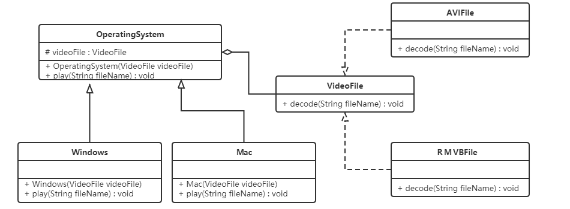


```java
package mao.video_player;

/**
 * Project name(项目名称)：java设计模式_桥接模式
 * Package(包名): mao.video_player
 * Interface(接口名): VideoFile
 * Author(作者）: mao
 * Author QQ：1296193245
 * GitHub：https://github.com/maomao124/
 * Date(创建日期)： 2022/8/16
 * Time(创建时间)： 13:31
 * Version(版本): 1.0
 * Description(描述)： 视频文件
 */

public interface VideoFile
{
    /**
     * 解码操作
     *
     * @param fileName 文件名
     */
    void decode(String fileName);
}
```


```java
package mao.video_player;

/**
 * Project name(项目名称)：java设计模式_桥接模式
 * Package(包名): mao.video_player
 * Class(类名): AVIFile
 * Author(作者）: mao
 * Author QQ：1296193245
 * GitHub：https://github.com/maomao124/
 * Date(创建日期)： 2022/8/16
 * Time(创建时间)： 13:31
 * Version(版本): 1.0
 * Description(描述)： 无
 */

public class AVIFile implements VideoFile
{

    @Override
    public void decode(String fileName)
    {
        System.out.println("avi视频文件：" + fileName);
    }
}
```


```java
package mao.video_player;

/**
 * Project name(项目名称)：java设计模式_桥接模式
 * Package(包名): mao.video_player
 * Class(类名): RMVBFile
 * Author(作者）: mao
 * Author QQ：1296193245
 * GitHub：https://github.com/maomao124/
 * Date(创建日期)： 2022/8/16
 * Time(创建时间)： 13:43
 * Version(版本): 1.0
 * Description(描述)： 无
 */

public class RMVBFile implements VideoFile
{

    @Override
    public void decode(String fileName)
    {
        System.out.println("rmvb文件：" + fileName);
    }
}
```


```java
package mao.video_player;

/**
 * Project name(项目名称)：java设计模式_桥接模式
 * Package(包名): mao.video_player
 * Class(类名): OperatingSystem
 * Author(作者）: mao
 * Author QQ：1296193245
 * GitHub：https://github.com/maomao124/
 * Date(创建日期)： 2022/8/16
 * Time(创建时间)： 13:33
 * Version(版本): 1.0
 * Description(描述)： 操作系统
 */

public abstract class OperatingSystem
{
    protected VideoFile videoFile;

    public OperatingSystem(VideoFile videoFile)
    {
        this.videoFile = videoFile;
    }

    public abstract void play(String fileName);
}
```


```java
package mao.video_player;

/**
 * Project name(项目名称)：java设计模式_桥接模式
 * Package(包名): mao.video_player
 * Class(类名): Windows
 * Author(作者）: mao
 * Author QQ：1296193245
 * GitHub：https://github.com/maomao124/
 * Date(创建日期)： 2022/8/16
 * Time(创建时间)： 13:34
 * Version(版本): 1.0
 * Description(描述)： windows操作系统
 */

public class Windows extends OperatingSystem
{

    public Windows(VideoFile videoFile)
    {
        super(videoFile);
    }

    @Override
    public void play(String fileName)
    {
        System.out.println("windows操作系统播放视频");
        videoFile.decode(fileName);
    }
}
```


```java
package mao.video_player;

/**
 * Project name(项目名称)：java设计模式_桥接模式
 * Package(包名): mao.video_player
 * Class(类名): Mac
 * Author(作者）: mao
 * Author QQ：1296193245
 * GitHub：https://github.com/maomao124/
 * Date(创建日期)： 2022/8/16
 * Time(创建时间)： 13:35
 * Version(版本): 1.0
 * Description(描述)： Mac操作系统
 */

public class Mac extends OperatingSystem
{

    public Mac(VideoFile videoFile)
    {
        super(videoFile);
    }

    @Override
    public void play(String fileName)
    {
        System.out.println("mac操作系统播放视频");
        videoFile.decode(fileName);
    }
}
```


```java
package mao.video_player;

/**
 * Project name(项目名称)：java设计模式_桥接模式
 * Package(包名): mao.video_player
 * Class(类名): Test
 * Author(作者）: mao
 * Author QQ：1296193245
 * GitHub：https://github.com/maomao124/
 * Date(创建日期)： 2022/8/16
 * Time(创建时间)： 13:35
 * Version(版本): 1.0
 * Description(描述)： 无
 */

public class Test
{
    public static void main(String[] args)
    {
        OperatingSystem windows = new Windows(new AVIFile());
        windows.play("./hello.avi");
        windows = new Windows(new RMVBFile());
        windows.play("./hello.rmvb");

        System.out.println("-------");

        OperatingSystem mac = new Mac(new AVIFile());
        mac.play("./hello.avi");
        mac = new Mac(new RMVBFile());
        mac.play("./hello.rmvb");
    }
}
```


**概念中的示例**


```java
package mao.shape;

/**
 * Project name(项目名称)：java设计模式_桥接模式
 * Package(包名): mao.shape
 * Interface(接口名): Shape
 * Author(作者）: mao
 * Author QQ：1296193245
 * GitHub：https://github.com/maomao124/
 * Date(创建日期)： 2022/8/16
 * Time(创建时间)： 13:46
 * Version(版本): 1.0
 * Description(描述)： 无
 */

public interface Shape
{
    /**
     * 画图形
     */
    void draw();
}
```


```java
package mao.shape;

/**
 * Project name(项目名称)：java设计模式_桥接模式
 * Package(包名): mao.shape
 * Interface(接口名): Color
 * Author(作者）: mao
 * Author QQ：1296193245
 * GitHub：https://github.com/maomao124/
 * Date(创建日期)： 2022/8/16
 * Time(创建时间)： 13:47
 * Version(版本): 1.0
 * Description(描述)： 颜色接口
 */

public interface Color
{
    /**
     * 获得颜色
     *
     * @return 颜色
     */
    String getColor();
}
```


```java
package mao.shape;

/**
 * Project name(项目名称)：java设计模式_桥接模式
 * Package(包名): mao.shape
 * Class(类名): Black
 * Author(作者）: mao
 * Author QQ：1296193245
 * GitHub：https://github.com/maomao124/
 * Date(创建日期)： 2022/8/16
 * Time(创建时间)： 13:48
 * Version(版本): 1.0
 * Description(描述)： 无
 */

public class Black implements Color
{

    @Override
    public String getColor()
    {
        return "黑色";
    }
}
```


```java
package mao.shape;

/**
 * Project name(项目名称)：java设计模式_桥接模式
 * Package(包名): mao.shape
 * Class(类名): White
 * Author(作者）: mao
 * Author QQ：1296193245
 * GitHub：https://github.com/maomao124/
 * Date(创建日期)： 2022/8/16
 * Time(创建时间)： 13:49
 * Version(版本): 1.0
 * Description(描述)： 无
 */

public class White implements Color
{

    @Override
    public String getColor()
    {
        return "白色";
    }
}
```


```java
package mao.shape;

/**
 * Project name(项目名称)：java设计模式_桥接模式
 * Package(包名): mao.shape
 * Class(类名): Gray
 * Author(作者）: mao
 * Author QQ：1296193245
 * GitHub：https://github.com/maomao124/
 * Date(创建日期)： 2022/8/16
 * Time(创建时间)： 13:49
 * Version(版本): 1.0
 * Description(描述)： 无
 */

public class Gray implements Color
{

    @Override
    public String getColor()
    {
        return "灰色";
    }
}
```


```java
package mao.shape;

/**
 * Project name(项目名称)：java设计模式_桥接模式
 * Package(包名): mao.shape
 * Class(类名): Circle
 * Author(作者）: mao
 * Author QQ：1296193245
 * GitHub：https://github.com/maomao124/
 * Date(创建日期)： 2022/8/16
 * Time(创建时间)： 13:50
 * Version(版本): 1.0
 * Description(描述)： 无
 */

public class Circle implements Shape
{
    private final Color color;

    public Circle(Color color)
    {
        this.color = color;
    }

    @Override
    public void draw()
    {
        System.out.println("画一个颜色为" + color.getColor() + "的圆");
    }
}
```


```java
package mao.shape;

/**
 * Project name(项目名称)：java设计模式_桥接模式
 * Package(包名): mao.shape
 * Class(类名): Rectangle
 * Author(作者）: mao
 * Author QQ：1296193245
 * GitHub：https://github.com/maomao124/
 * Date(创建日期)： 2022/8/16
 * Time(创建时间)： 13:52
 * Version(版本): 1.0
 * Description(描述)： 无
 */

public class Rectangle implements Shape
{
    private final Color color;

    public Rectangle(Color color)
    {
        this.color = color;
    }

    @Override
    public void draw()
    {
        System.out.println("画一个颜色为" + color.getColor() + "的长方形");
    }
}
```


```java
package mao.shape;

/**
 * Project name(项目名称)：java设计模式_桥接模式
 * Package(包名): mao.shape
 * Class(类名): Square
 * Author(作者）: mao
 * Author QQ：1296193245
 * GitHub：https://github.com/maomao124/
 * Date(创建日期)： 2022/8/16
 * Time(创建时间)： 13:53
 * Version(版本): 1.0
 * Description(描述)： 无
 */

public class Square implements Shape
{
    private final Color color;

    public Square(Color color)
    {
        this.color = color;
    }

    @Override
    public void draw()
    {
        System.out.println("画一个颜色为" + color.getColor() + "的正方形");
    }
}
```


```java
package mao.shape;

/**
 * Project name(项目名称)：java设计模式_桥接模式
 * Package(包名): mao.shape
 * Class(类名): Test
 * Author(作者）: mao
 * Author QQ：1296193245
 * GitHub：https://github.com/maomao124/
 * Date(创建日期)： 2022/8/16
 * Time(创建时间)： 13:54
 * Version(版本): 1.0
 * Description(描述)： 无
 */

public class Test
{
    public static void main(String[] args)
    {
        Shape shape = new Circle(new Black());
        shape.draw();
        shape = new Circle(new Gray());
        shape.draw();
        shape = new Circle(new White());
        shape.draw();
        System.out.println("--------");
        shape = new Rectangle(new Black());
        shape.draw();
        shape = new Rectangle(new Gray());
        shape.draw();
        shape = new Rectangle(new White());
        shape.draw();
        System.out.println("--------");
        shape = new Square(new Black());
        shape.draw();
        shape = new Square(new Gray());
        shape.draw();
        shape = new Square(new White());
        shape.draw();
    }
}
```


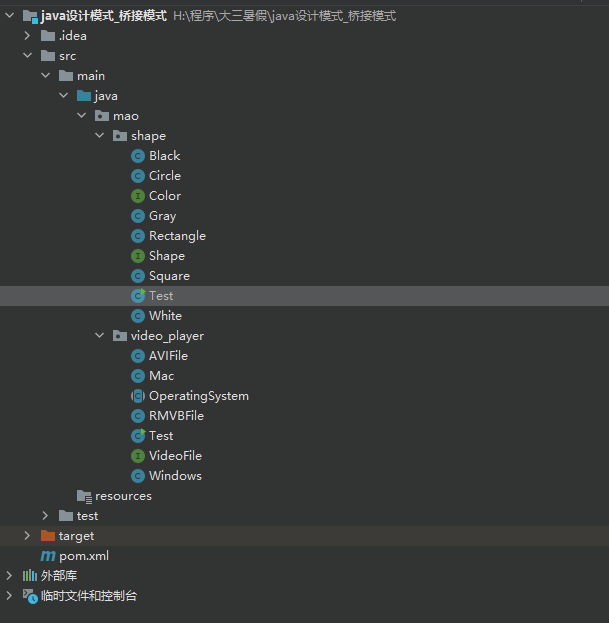


### 优点

* 桥接模式提高了系统的可扩充性，在两个变化维度中任意扩展一个维度，都不需要修改原有系统。

  如：如果现在还有一种视频文件类型wmv，我们只需要再定义一个类实现VideoFile接口即可，其他类不需要发生变化。

* 实现细节对客户透明


### 使用场景

* 当一个类存在两个独立变化的维度，且这两个维度都需要进行扩展时。
* 当一个系统不希望使用继承或因为多层次继承导致系统类的个数急剧增加时。
* 当一个系统需要在构件的抽象化角色和具体化角色之间增加更多的灵活性时。避免在两个层次之间建立静态的继承联系，通过桥接模式可以使它们在抽象层建立一个关联关系。


## 外观模式

### 概念

**定义：**

又名门面模式，是一种通过为多个复杂的子系统提供一个一致的接口，而使这些子系统更加容易被访问的模式。该模式对外有一个统一接口，外部应用程序不用关心内部子系统的具体的细节，这样会大大降低应用程序的复杂度，提高了程序的可维护性。

外观（Facade）模式是“迪米特法则”的典型应用


### 结构

外观（Facade）模式包含以下主要角色：

* 外观（Facade）角色：为多个子系统对外提供一个共同的接口。
* 子系统（Sub System）角色：实现系统的部分功能，客户可以通过外观角色访问它。


### 示例

**智能家电控制**

需求：小明的爷爷已经60岁了，一个人在家生活：每次都需要打开灯、打开电视、打开空调；睡觉时关闭灯、关闭电视、关闭空调；操作起来都比较麻烦。所以小明给爷爷买了智能音箱，可以通过语音直接控制这些智能家电的开启和关闭。


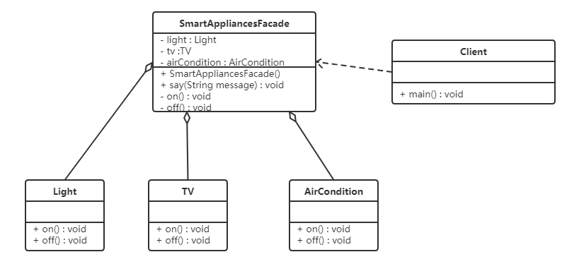


```java
package mao;

/**
 * Project name(项目名称)：java设计模式_外观模式
 * Package(包名): mao
 * Interface(接口名): HouseholdEquipment
 * Author(作者）: mao
 * Author QQ：1296193245
 * GitHub：https://github.com/maomao124/
 * Date(创建日期)： 2022/8/16
 * Time(创建时间)： 20:41
 * Version(版本): 1.0
 * Description(描述)： 家用设备
 */

public interface HouseholdEquipment
{
    /**
     * 打开某个设备
     */
    void on();

    /**
     * 关闭某个设备
     */
    void off();
}
```


```java
package mao;

/**
 * Project name(项目名称)：java设计模式_外观模式
 * Package(包名): mao
 * Class(类名): Light
 * Author(作者）: mao
 * Author QQ：1296193245
 * GitHub：https://github.com/maomao124/
 * Date(创建日期)： 2022/8/16
 * Time(创建时间)： 20:39
 * Version(版本): 1.0
 * Description(描述)： 灯
 */

public class Light implements HouseholdEquipment
{
    @Override
    public void on()
    {
        System.out.println("打开了灯....");
    }

    @Override
    public void off()
    {
        System.out.println("关闭了灯....");
    }
}
```


```java
package mao;

/**
 * Project name(项目名称)：java设计模式_外观模式
 * Package(包名): mao
 * Class(类名): TV
 * Author(作者）: mao
 * Author QQ：1296193245
 * GitHub：https://github.com/maomao124/
 * Date(创建日期)： 2022/8/16
 * Time(创建时间)： 20:43
 * Version(版本): 1.0
 * Description(描述)： 电视机
 */

public class TV implements HouseholdEquipment
{

    @Override
    public void on()
    {
        System.out.println("打开了电视....");
    }

    @Override
    public void off()
    {
        System.out.println("关闭了电视....");
    }
}
```


```java
package mao;

/**
 * Project name(项目名称)：java设计模式_外观模式
 * Package(包名): mao
 * Class(类名): AirCondition
 * Author(作者）: mao
 * Author QQ：1296193245
 * GitHub：https://github.com/maomao124/
 * Date(创建日期)： 2022/8/16
 * Time(创建时间)： 20:43
 * Version(版本): 1.0
 * Description(描述)： 空调
 */

public class AirCondition implements HouseholdEquipment
{

    @Override
    public void on()
    {
        System.out.println("打开了空调....");
    }

    @Override
    public void off()
    {
        System.out.println("关闭了空调....");
    }
}
```


```java
package mao;

/**
 * Project name(项目名称)：java设计模式_外观模式
 * Package(包名): mao
 * Class(类名): SmartAppliancesFacade
 * Author(作者）: mao
 * Author QQ：1296193245
 * GitHub：https://github.com/maomao124/
 * Date(创建日期)： 2022/8/16
 * Time(创建时间)： 20:45
 * Version(版本): 1.0
 * Description(描述)： 无
 */

public class SmartAppliancesFacade
{
    private final Light light;
    private final TV tv;
    private final AirCondition airCondition;

    /**
     * Instantiates a new Smart appliances facade.
     */
    public SmartAppliancesFacade()
    {
        light = new Light();
        tv = new TV();
        airCondition = new AirCondition();
    }

    /**
     * Say.
     *
     * @param message the message
     */
    public void say(String message)
    {
        assert message != null;
        if (message.contains("打开"))
        {
            on(message);
        }
        else if (message.contains("关闭"))
        {
            off(message);
        }
        else
        {
            System.out.println("未知");
        }
    }

    private void on(String message)
    {
        if (message.contains("电视"))
        {
            tv.on();
        }
        else if (message.contains("灯"))
        {
            light.on();
        }
        else if (message.contains("空调"))
        {
            airCondition.on();
        }
        else if (message.contains("所有"))
        {
            tv.on();
            light.on();
            airCondition.on();
        }
        else
        {
            System.out.println("打开失败");
        }
    }

    private void off(String message)
    {
        if (message.contains("电视"))
        {
            tv.off();
        }
        else if (message.contains("灯"))
        {
            light.off();
        }
        else if (message.contains("空调"))
        {
            airCondition.off();
        }
        else if (message.contains("所有"))
        {
            tv.off();
            light.off();
            airCondition.off();
        }
        else
        {
            System.out.println("关闭失败");
        }
    }
}
```


```java
package mao;

/**
 * Project name(项目名称)：java设计模式_外观模式
 * Package(包名): mao
 * Class(类名): Test
 * Author(作者）: mao
 * Author QQ：1296193245
 * GitHub：https://github.com/maomao124/
 * Date(创建日期)： 2022/8/16
 * Time(创建时间)： 20:52
 * Version(版本): 1.0
 * Description(描述)： 无
 */

public class Test
{
    public static void main(String[] args)
    {
        SmartAppliancesFacade smartAppliancesFacade = new SmartAppliancesFacade();
        smartAppliancesFacade.say("打开电视");
        smartAppliancesFacade.say("打开空调");
        smartAppliancesFacade.say("打开灯");
        smartAppliancesFacade.say("关闭电视");
        System.out.println("-----");
        smartAppliancesFacade.say("关闭所有设备");
        smartAppliancesFacade.say("打开所有设备");
        smartAppliancesFacade.say("关闭灯");
        smartAppliancesFacade.say("关闭空调");
    }
}
```


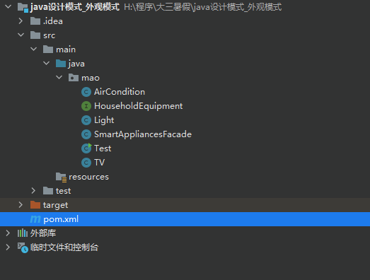


### 优点和缺点


**优点：**

* 降低了子系统与客户端之间的耦合度，使得子系统的变化不会影响调用它的客户类。
* 对客户屏蔽了子系统组件，减少了客户处理的对象数目，并使得子系统使用起来更加容易。

**缺点：**

* 不符合开闭原则，修改很麻烦


### 使用场景

* 对分层结构系统构建时，使用外观模式定义子系统中每层的入口点可以简化子系统之间的依赖关系。
* 当一个复杂系统的子系统很多时，外观模式可以为系统设计一个简单的接口供外界访问。
* 当客户端与多个子系统之间存在很大的联系时，引入外观模式可将它们分离，从而提高子系统的独立性和可移植性。


### 源码解析

使用tomcat作为web容器时，接收浏览器发送过来的请求，tomcat会将请求信息封装成ServletRequest对象，如下图①处对象。但是大家想想ServletRequest是一个接口，它还有一个子接口HttpServletRequest，而我们知道该request对象肯定是一个HttpServletRequest对象的子实现类对象，到底是哪个类的对象呢？可以通过输出request对象，我们就会发现是一个名为RequestFacade的类的对象。

RequestFacade类就使用了外观模式


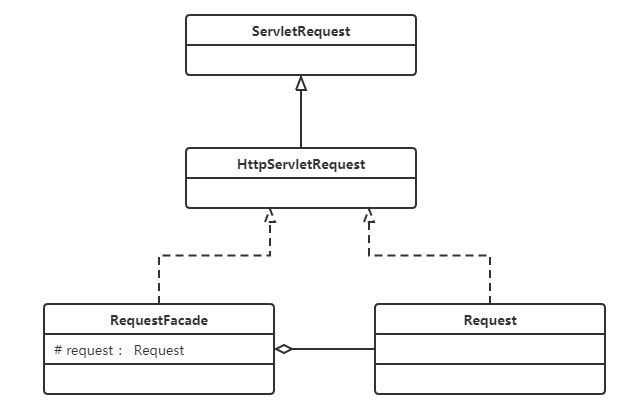


定义 RequestFacade 类，分别实现 ServletRequest ，同时定义私有成员变量 Request ，并且方法的实现调用 Request  的实现。然后，将 RequestFacade上转为 ServletRequest  传给 servlet 的 service 方法，这样即使在 servlet 中被下转为 RequestFacade ，也不能访问私有成员变量对象中的方法。既用了 Request ，又能防止其中方法被不合理的访问。


## 组合模式

### 概念

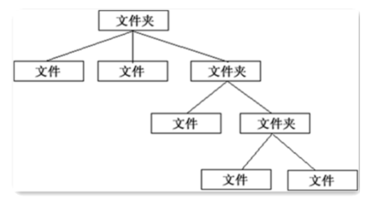


上图我们可以看做是一个文件系统，对于这样的结构我们称之为树形结构。在树形结构中可以通过调用某个方法来遍历整个树，当我们找到某个叶子节点后，就可以对叶子节点进行相关的操作。可以将这颗树理解成一个大的容器，容器里面包含很多的成员对象，这些成员对象即可是容器对象也可以是叶子对象。但是由于容器对象和叶子对象在功能上面的区别，使得我们在使用的过程中必须要区分容器对象和叶子对象，但是这样就会给客户带来不必要的麻烦，作为客户而已，它始终希望能够一致的对待容器对象和叶子对象。


**定义：**

组合模式又名部分整体模式，是用于把一组相似的对象当作一个单一的对象。组合模式依据树形结构来组合对象，用来表示部分以及整体层次。这种类型的设计模式属于结构型模式，它创建了对象组的树形结构。


### 结构

组合模式主要包含三种角色：

* 抽象根节点（Component）：定义系统各层次对象的共有方法和属性，可以预先定义一些默认行为和属性。
* 树枝节点（Composite）：定义树枝节点的行为，存储子节点，组合树枝节点和叶子节点形成一个树形结构。
* 叶子节点（Leaf）：叶子节点对象，其下再无分支，是系统层次遍历的最小单位。


### 示例

**软件菜单**

我们在访问别的一些管理系统时，经常可以看到类似的菜单。一个菜单可以包含菜单项（菜单项是指不再包含其他内容的菜单条目），也可以包含带有其他菜单项的菜单，因此使用组合模式描述菜单就很恰当，我们的需求是针对一个菜单，打印出其包含的所有菜单以及菜单项的名称。


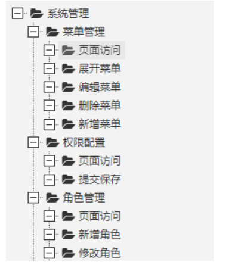


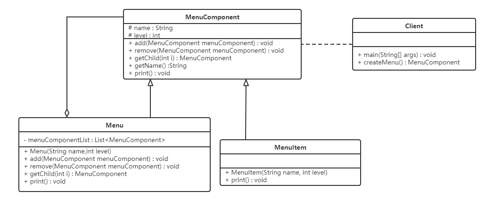


```java
package mao;

/**
 * Project name(项目名称)：java设计模式_组合模式
 * Package(包名): mao
 * Class(类名): MenuComponent
 * Author(作者）: mao
 * Author QQ：1296193245
 * GitHub：https://github.com/maomao124/
 * Date(创建日期)： 2022/8/17
 * Time(创建时间)： 20:29
 * Version(版本): 1.0
 * Description(描述)： 无
 */

public abstract class MenuComponent
{
    //菜单或者菜单项的名字
    protected String name;
    //菜单级别
    protected int level;

    /**
     * 添加菜单，子类可以重写方法
     *
     * @param menuComponent MenuComponent对象，传入的是子实现类，菜单或者菜单项
     */
    public void add(MenuComponent menuComponent)
    {
        throw new UnsupportedOperationException();
    }

    /**
     * 移除菜单
     *
     * @param menuComponent MenuComponent对象
     */
    public void remove(MenuComponent menuComponent)
    {
        throw new UnsupportedOperationException();
    }

    /**
     * 获取指定的子菜单
     *
     * @param i 子菜单的索引
     * @return MenuComponent对象
     */
    public MenuComponent getChild(int i)
    {
        throw new UnsupportedOperationException();
    }

    /**
     * 获取菜单的名称
     *
     * @return 菜单的名称
     */
    public String getName()
    {
        return name;
    }

    /**
     * 打印菜单
     */
    public void print()
    {
        throw new UnsupportedOperationException();
    }

}
```


这里的MenuComponent定义为抽象类，因为有一些共有的属性和行为要在该类中实现，Menu和MenuItem类就可以只覆盖自己感兴趣的方法，而不用搭理不需要或者不感兴趣的方法，举例来说，Menu类可以包含子菜单，因此需要覆盖add()、remove()、getChild()方法，但是MenuItem就不应该有这些方法。这里给出的默认实现是抛出异常，你也可以根据自己的需要改写默认实现。


```java
package mao;

import java.util.ArrayList;
import java.util.List;

/**
 * Project name(项目名称)：java设计模式_组合模式
 * Package(包名): mao
 * Class(类名): Menu
 * Author(作者）: mao
 * Author QQ：1296193245
 * GitHub：https://github.com/maomao124/
 * Date(创建日期)： 2022/8/17
 * Time(创建时间)： 20:35
 * Version(版本): 1.0
 * Description(描述)： 无
 */

public class Menu extends MenuComponent
{
    private final List<MenuComponent> menuComponentList;

    public Menu(String name, int level)
    {
        this.level = level;
        this.name = name;
        menuComponentList = new ArrayList<>();
    }

    @Override
    public void add(MenuComponent menuComponent)
    {
        menuComponentList.add(menuComponent);
    }

    @Override
    public void remove(MenuComponent menuComponent)
    {
        menuComponentList.remove(menuComponent);
    }

    @Override
    public MenuComponent getChild(int i)
    {
        return menuComponentList.get(i);
    }

    @Override
    public void print()
    {
        System.out.print("+");
        for (int i = 1; i < this.level; i++)
        {
            System.out.print("---");
        }
        System.out.println(this.name);
        for (MenuComponent menuComponent : menuComponentList)
        {
            menuComponent.print();
        }
    }
}
```


```java
package mao;

/**
 * Project name(项目名称)：java设计模式_组合模式
 * Package(包名): mao
 * Class(类名): MenuItem
 * Author(作者）: mao
 * Author QQ：1296193245
 * GitHub：https://github.com/maomao124/
 * Date(创建日期)： 2022/8/17
 * Time(创建时间)： 20:40
 * Version(版本): 1.0
 * Description(描述)： 无
 */

public class MenuItem extends MenuComponent
{
    public MenuItem(String name, int level)
    {
        this.name = name;
        this.level = level;
    }

    @Override
    public void print()
    {
        System.out.print("|");
        for (int i = 1; i < this.level; i++)
        {
            System.out.print("---");
        }
        System.out.println(this.name);
    }
}
```


```java
package mao;

/**
 * Project name(项目名称)：java设计模式_组合模式
 * Package(包名): mao
 * Class(类名): Test
 * Author(作者）: mao
 * Author QQ：1296193245
 * GitHub：https://github.com/maomao124/
 * Date(创建日期)： 2022/8/17
 * Time(创建时间)： 20:41
 * Version(版本): 1.0
 * Description(描述)： 无
 */

public class Test
{
    public static void main(String[] args)
    {
        MenuComponent menuComponent = new Menu("系统管理", 1);
        MenuComponent menuComponent1 = new Menu("菜单管理", 2);
        MenuComponent menuComponent2 = new Menu("权限设置", 2);
        MenuComponent menuComponent3 = new Menu("角色管理", 2);

        menuComponent.add(menuComponent1);
        menuComponent.add(menuComponent2);
        menuComponent.add(menuComponent3);

        MenuComponent menuComponent4 = new MenuItem("页面访问", 3);
        MenuComponent menuComponent5 = new MenuItem("展开菜单", 3);
        MenuComponent menuComponent6 = new MenuItem("编辑菜单", 3);
        MenuComponent menuComponent7 = new MenuItem("删除菜单", 3);
        MenuComponent menuComponent8 = new MenuItem("新增菜单", 3);

        menuComponent1.add(menuComponent4);
        menuComponent1.add(menuComponent5);
        menuComponent1.add(menuComponent6);
        menuComponent1.add(menuComponent7);
        menuComponent1.add(menuComponent8);

        MenuComponent menuComponent9 = new MenuItem("权限设置", 3);
        MenuComponent menuComponent10 = new MenuItem("新增菜单", 3);

        menuComponent2.add(menuComponent9);
        menuComponent2.add(menuComponent10);

        MenuComponent menuComponent11 = new MenuItem("页面访问", 3);
        MenuComponent menuComponent12 = new MenuItem("新增角色", 3);
        MenuComponent menuComponent13 = new MenuItem("修改角色", 3);

        menuComponent3.add(menuComponent11);
        menuComponent3.add(menuComponent12);
        menuComponent3.add(menuComponent13);

        menuComponent.print();

    }
}
```


运行结果：

```sh
+系统管理
+---菜单管理
|------页面访问
|------展开菜单
|------编辑菜单
|------删除菜单
|------新增菜单
+---权限设置
|------权限设置
|------新增菜单
+---角色管理
|------页面访问
|------新增角色
|------修改角色
```


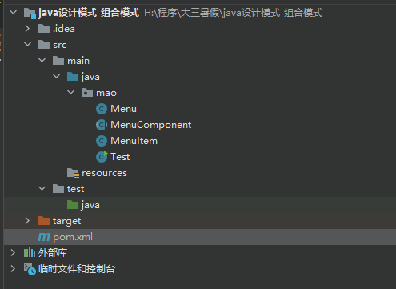


### 组合模式的分类


在使用组合模式时，根据抽象构件类的定义形式，我们可将组合模式分为透明组合模式和安全组合模式两种形式。

* 透明组合模式

  透明组合模式中，抽象根节点角色中声明了所有用于管理成员对象的方法，比如在示例中 `MenuComponent` 声明了 `add`、`remove` 、`getChild` 方法，这样做的好处是确保所有的构件类都有相同的接口。透明组合模式也是组合模式的标准形式。

  透明组合模式的缺点是不够安全，因为叶子对象和容器对象在本质上是有区别的，叶子对象不可能有下一个层次的对象，即不可能包含成员对象，因此为其提供 add()、remove() 等方法是没有意义的，这在编译阶段不会出错，但在运行阶段如果调用这些方法可能会出错（如果没有提供相应的错误处理代码）

* 安全组合模式

  在安全组合模式中，在抽象构件角色中没有声明任何用于管理成员对象的方法，而是在树枝节点 `Menu` 类中声明并实现这些方法。安全组合模式的缺点是不够透明，因为叶子构件和容器构件具有不同的方法，且容器构件中那些用于管理成员对象的方法没有在抽象构件类中定义，因此客户端不能完全针对抽象编程，必须有区别地对待叶子构件和容器构件。


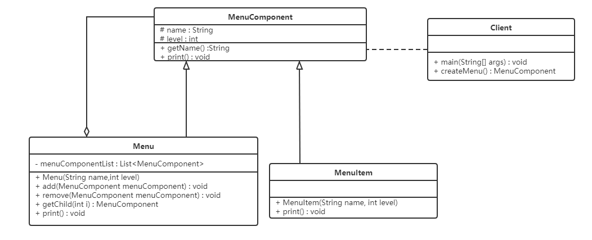


### 优点

* 组合模式可以清楚地定义分层次的复杂对象，表示对象的全部或部分层次，它让客户端忽略了层次的差异，方便对整个层次结构进行控制。
* 客户端可以一致地使用一个组合结构或其中单个对象，不必关心处理的是单个对象还是整个组合结构，简化了客户端代码。
* 在组合模式中增加新的树枝节点和叶子节点都很方便，无须对现有类库进行任何修改，符合“开闭原则”。
* 组合模式为树形结构的面向对象实现提供了一种灵活的解决方案，通过叶子节点和树枝节点的递归组合，可以形成复杂的树形结构，但对树形结构的控制却非常简单。


### 使用场景

组合模式正是应树形结构而生，所以组合模式的使用场景就是出现树形结构的地方。比如：文件目录显示，多级目录呈现等树形结构数据的操作。


## 享元模式

### 概念

运用共享技术来有效地支持大量细粒度对象的复用。它通过共享已经存在的对象来大幅度减少需要创建的对象数量、避免大量相似对象的开销，从而提高系统资源的利用率。


### 结构

享元（Flyweight ）模式中存在以下两种状态：

1. 内部状态，即不会随着环境的改变而改变的可共享部分。
2. 外部状态，指随环境改变而改变的不可以共享的部分。享元模式的实现要领就是区分应用中的这两种状态，并将外部状态外部化。

享元模式的主要有以下角色：

* 抽象享元角色（Flyweight）：通常是一个接口或抽象类，在抽象享元类中声明了具体享元类公共的方法，这些方法可以向外界提供享元对象的内部数据（内部状态），同时也可以通过这些方法来设置外部数据（外部状态）。
* 具体享元（Concrete Flyweight）角色 ：它实现了抽象享元类，称为享元对象；在具体享元类中为内部状态提供了存储空间。通常我们可以结合单例模式来设计具体享元类，为每一个具体享元类提供唯一的享元对象。
* 非享元（Unsharable Flyweight)角色 ：并不是所有的抽象享元类的子类都需要被共享，不能被共享的子类可设计为非共享具体享元类；当需要一个非共享具体享元类的对象时可以直接通过实例化创建。
* 享元工厂（Flyweight Factory）角色 ：负责创建和管理享元角色。当客户对象请求一个享元对象时，享元工厂检査系统中是否存在符合要求的享元对象，如果存在则提供给客户；如果不存在的话，则创建一个新的享元对象。


### 示例

**俄罗斯方块**

下面的图片是众所周知的俄罗斯方块中的一个个方块，如果在俄罗斯方块这个游戏中，每个不同的方块都是一个实例对象，这些对象就要占用很多的内存空间，下面利用享元模式进行实现。


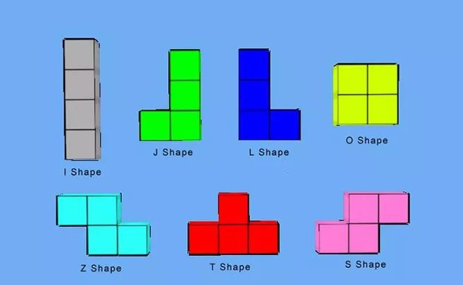


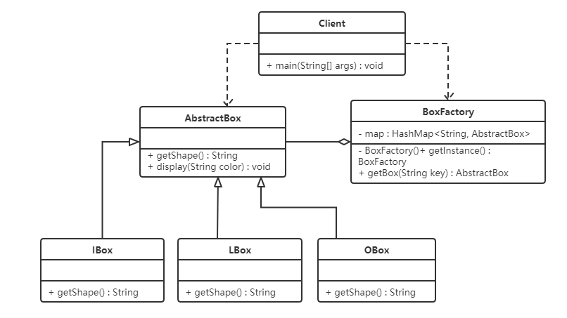


```java
package mao;

/**
 * Project name(项目名称)：java设计模式_享元模式
 * Package(包名): mao
 * Class(类名): AbstractBox
 * Author(作者）: mao
 * Author QQ：1296193245
 * GitHub：https://github.com/maomao124/
 * Date(创建日期)： 2022/8/17
 * Time(创建时间)： 21:13
 * Version(版本): 1.0
 * Description(描述)： 无
 */

public abstract class AbstractBox
{
    /**
     * 获得一个形状
     *
     * @return 形状
     */
    public abstract String getShape();

    /**
     * 显示
     *
     * @param color 颜色
     */
    public void display(String color)
    {
        System.out.println("方块形状：" + this.getShape() + "，颜色：" + color);
    }
}
```


```java
package mao;

/**
 * Project name(项目名称)：java设计模式_享元模式
 * Package(包名): mao
 * Class(类名): IBox
 * Author(作者）: mao
 * Author QQ：1296193245
 * GitHub：https://github.com/maomao124/
 * Date(创建日期)： 2022/8/17
 * Time(创建时间)： 21:14
 * Version(版本): 1.0
 * Description(描述)： 无
 */

public class IBox extends AbstractBox
{

    @Override
    public String getShape()
    {
        return "I";
    }
}
```


```java
package mao;

/**
 * Project name(项目名称)：java设计模式_享元模式
 * Package(包名): mao
 * Class(类名): LBox
 * Author(作者）: mao
 * Author QQ：1296193245
 * GitHub：https://github.com/maomao124/
 * Date(创建日期)： 2022/8/17
 * Time(创建时间)： 21:15
 * Version(版本): 1.0
 * Description(描述)： 无
 */

public class LBox extends AbstractBox
{

    @Override
    public String getShape()
    {
        return "L";
    }
}
```


```java
package mao;

/**
 * Project name(项目名称)：java设计模式_享元模式
 * Package(包名): mao
 * Class(类名): OBox
 * Author(作者）: mao
 * Author QQ：1296193245
 * GitHub：https://github.com/maomao124/
 * Date(创建日期)： 2022/8/17
 * Time(创建时间)： 21:15
 * Version(版本): 1.0
 * Description(描述)： 无
 */

public class OBox extends AbstractBox
{

    @Override
    public String getShape()
    {
        return "O";
    }
}
```


```java
package mao;


import java.util.Map;
import java.util.concurrent.ConcurrentHashMap;

/**
 * Project name(项目名称)：java设计模式_享元模式
 * Package(包名): mao
 * Class(类名): BoxFactory
 * Author(作者）: mao
 * Author QQ：1296193245
 * GitHub：https://github.com/maomao124/
 * Date(创建日期)： 2022/8/17
 * Time(创建时间)： 21:15
 * Version(版本): 1.0
 * Description(描述)： 无
 */


public class BoxFactory
{
    private static volatile BoxFactory boxFactory;

    private static Map<String, AbstractBox> map;


    /**
     * Instantiates a new Box factory.
     */
    public BoxFactory()
    {
        map = new ConcurrentHashMap<>();
    }

    /**
     * Gets instance.
     *
     * @return the instance
     */
    public static BoxFactory getInstance()
    {
        if (boxFactory == null)
        {
            synchronized (BoxFactory.class)
            {
                if (boxFactory == null)
                {
                    boxFactory = new BoxFactory();
                }
            }
        }
        return boxFactory;
    }

    /**
     * 获取Box
     *
     * @param key String
     * @return AbstractBox box
     */
    public AbstractBox getBox(String key)
    {
        if (key == null)
        {
            return null;
        }
        if (key.equals("I"))
        {
            return IBox(key);
        }
        if (key.equals("L"))
        {
            return LBox(key);
        }
        if (key.equals("O"))
        {
            return OBox(key);
        }
        return null;
    }

    /**
     * Box abstract box.
     *
     * @param key the key
     * @return the abstract box
     */
    private AbstractBox IBox(String key)
    {
        AbstractBox abstractBox = map.get(key);
        if (abstractBox == null)
        {
            IBox iBox = new IBox();
            map.put("I", iBox);
            return iBox;
        }
        return abstractBox;
    }

    /**
     * L box abstract box.
     *
     * @param key the key
     * @return the abstract box
     */
    private AbstractBox LBox(String key)
    {
        AbstractBox abstractBox = map.get(key);
        if (abstractBox == null)
        {
            LBox lBox = new LBox();
            map.put("L", lBox);
            return lBox;
        }
        return abstractBox;
    }

    /**
     * O box abstract box.
     *
     * @param key the key
     * @return the abstract box
     */
    private AbstractBox OBox(String key)
    {
        AbstractBox abstractBox = map.get(key);
        if (abstractBox == null)
        {
            OBox oBox = new OBox();
            map.put("O", oBox);
            return oBox;
        }
        return abstractBox;
    }

}
```


```java
package mao;

/**
 * Project name(项目名称)：java设计模式_享元模式
 * Package(包名): mao
 * Class(类名): Test
 * Author(作者）: mao
 * Author QQ：1296193245
 * GitHub：https://github.com/maomao124/
 * Date(创建日期)： 2022/8/17
 * Time(创建时间)： 21:31
 * Version(版本): 1.0
 * Description(描述)： 无
 */

public class Test
{
    public static void main(String[] args)
    {
        BoxFactory boxFactory = BoxFactory.getInstance();

        System.out.println(boxFactory.getBox("L"));
        System.out.println(boxFactory.getBox("L"));
        System.out.println(boxFactory.getBox("L"));
        boxFactory.getBox("L").display("绿色");

        System.out.println(boxFactory.getBox("O"));
        System.out.println(boxFactory.getBox("O"));
        System.out.println(boxFactory.getBox("O"));
        boxFactory.getBox("O").display("绿色");

        System.out.println(boxFactory.getBox("I"));
        System.out.println(boxFactory.getBox("I"));
        System.out.println(boxFactory.getBox("I"));
        boxFactory.getBox("I").display("绿色");

        System.out.println(boxFactory.getBox("L"));
    }


}
```


运行结果：

```sh
mao.LBox@3b07d329
mao.LBox@3b07d329
mao.LBox@3b07d329
方块形状：L，颜色：绿色
mao.OBox@27d6c5e0
mao.OBox@27d6c5e0
mao.OBox@27d6c5e0
方块形状：O，颜色：绿色
mao.IBox@15aeb7ab
mao.IBox@15aeb7ab
mao.IBox@15aeb7ab
方块形状：I，颜色：绿色
mao.LBox@3b07d329
```


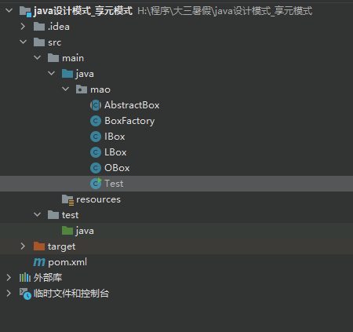


### 优缺点

**优点**

- 极大减少内存中相似或相同对象数量，节约系统资源，提供系统性能
- 享元模式中的外部状态相对独立，且不影响内部状态

**缺点：**

为了使对象可以共享，需要将享元对象的部分状态外部化，分离内部状态和外部状态，使程序逻辑复杂


### 使用场景

- 一个系统有大量相同或者相似的对象，造成内存的大量耗费。
- 对象的大部分状态都可以外部化，可以将这些外部状态传入对象中。
- 在使用享元模式时需要维护一个存储享元对象的享元池，而这需要耗费一定的系统资源，因此，应当在需要多次重复使用享元对象时才值得使用享元模式。


### JDK源码解析

Integer类使用了享元模式。


```java
package mao.jdk;

/**
 * Project name(项目名称)：java设计模式_享元模式
 * Package(包名): mao.jdk
 * Class(类名): IntegerTest
 * Author(作者）: mao
 * Author QQ：1296193245
 * GitHub：https://github.com/maomao124/
 * Date(创建日期)： 2022/8/17
 * Time(创建时间)： 21:47
 * Version(版本): 1.0
 * Description(描述)： 无
 */

public class IntegerTest
{
    @SuppressWarnings("all")
    public static void main(String[] args)
    {
        Integer i1 = 127;
        Integer i2 = 127;

        Integer i3 = 128;
        Integer i4 = 128;

        System.out.println("i1和i2对象是否是同一个对象？" + (i1 == i2));
        System.out.println("i3和i4对象是否是同一个对象？" + (i3 == i4));
    }
}
```


运行结果：

```sh
i1和i2对象是否是同一个对象？true
i3和i4对象是否是同一个对象？false
```


因为直接给Integer类型的变量赋值基本数据类型数据的操作底层使用的是 `valueOf()`


```java
public final class Integer extends Number
        implements Comparable<Integer>, Constable, ConstantDesc 
{
...
/**
 * Returns an {@code Integer} object holding the value
 * extracted from the specified {@code String} when parsed
 * with the radix given by the second argument. The first argument
 * is interpreted as representing a signed integer in the radix
 * specified by the second argument, exactly as if the arguments
 * were given to the {@link #parseInt(java.lang.String, int)}
 * method. The result is an {@code Integer} object that
 * represents the integer value specified by the string.
 *
 * <p>In other words, this method returns an {@code Integer}
 * object equal to the value of:
 *
 * <blockquote>
 *  {@code new Integer(Integer.parseInt(s, radix))}
 * </blockquote>
 *
 * @param      s   the string to be parsed.
 * @param      radix the radix to be used in interpreting {@code s}
 * @return     an {@code Integer} object holding the value
 *             represented by the string argument in the specified
 *             radix.
 * @throws    NumberFormatException if the {@code String}
 *            does not contain a parsable {@code int}.
 */
public static Integer valueOf(String s, int radix) throws NumberFormatException {
    return Integer.valueOf(parseInt(s,radix));
}

/**
 * Returns an {@code Integer} object holding the
 * value of the specified {@code String}. The argument is
 * interpreted as representing a signed decimal integer, exactly
 * as if the argument were given to the {@link
 * #parseInt(java.lang.String)} method. The result is an
 * {@code Integer} object that represents the integer value
 * specified by the string.
 *
 * <p>In other words, this method returns an {@code Integer}
 * object equal to the value of:
 *
 * <blockquote>
 *  {@code new Integer(Integer.parseInt(s))}
 * </blockquote>
 *
 * @param      s   the string to be parsed.
 * @return     an {@code Integer} object holding the value
 *             represented by the string argument.
 * @throws     NumberFormatException  if the string cannot be parsed
 *             as an integer.
 */
public static Integer valueOf(String s) throws NumberFormatException {
    return Integer.valueOf(parseInt(s, 10));
}

/**
 * Cache to support the object identity semantics of autoboxing for values between
 * -128 and 127 (inclusive) as required by JLS.
 *
 * The cache is initialized on first usage.  The size of the cache
 * may be controlled by the {@code -XX:AutoBoxCacheMax=<size>} option.
 * During VM initialization, java.lang.Integer.IntegerCache.high property
 * may be set and saved in the private system properties in the
 * jdk.internal.misc.VM class.
 *
 * WARNING: The cache is archived with CDS and reloaded from the shared
 * archive at runtime. The archived cache (Integer[]) and Integer objects
 * reside in the closed archive heap regions. Care should be taken when
 * changing the implementation and the cache array should not be assigned
 * with new Integer object(s) after initialization.
 */

private static class IntegerCache {
    static final int low = -128;
    static final int high;
    static final Integer[] cache;
    static Integer[] archivedCache;

    static {
        // high value may be configured by property
        int h = 127;
        String integerCacheHighPropValue =
            VM.getSavedProperty("java.lang.Integer.IntegerCache.high");
        if (integerCacheHighPropValue != null) {
            try {
                h = Math.max(parseInt(integerCacheHighPropValue), 127);
                // Maximum array size is Integer.MAX_VALUE
                h = Math.min(h, Integer.MAX_VALUE - (-low) -1);
            } catch( NumberFormatException nfe) {
                // If the property cannot be parsed into an int, ignore it.
            }
        }
        high = h;

        // Load IntegerCache.archivedCache from archive, if possible
        CDS.initializeFromArchive(IntegerCache.class);
        int size = (high - low) + 1;

        // Use the archived cache if it exists and is large enough
        if (archivedCache == null || size > archivedCache.length) {
            Integer[] c = new Integer[size];
            int j = low;
            for(int i = 0; i < c.length; i++) {
                c[i] = new Integer(j++);
            }
            archivedCache = c;
        }
        cache = archivedCache;
        // range [-128, 127] must be interned (JLS7 5.1.7)
        assert IntegerCache.high >= 127;
    }

    private IntegerCache() {}
}

/**
 * Returns an {@code Integer} instance representing the specified
 * {@code int} value.  If a new {@code Integer} instance is not
 * required, this method should generally be used in preference to
 * the constructor {@link #Integer(int)}, as this method is likely
 * to yield significantly better space and time performance by
 * caching frequently requested values.
 *
 * This method will always cache values in the range -128 to 127,
 * inclusive, and may cache other values outside of this range.
 *
 * @param  i an {@code int} value.
 * @return an {@code Integer} instance representing {@code i}.
 * @since  1.5
 */
@IntrinsicCandidate
public static Integer valueOf(int i) {
    if (i >= IntegerCache.low && i <= IntegerCache.high)
        return IntegerCache.cache[i + (-IntegerCache.low)];
    return new Integer(i);
}

/**
 * The value of the {@code Integer}.
 *
 * @serial
 */
private final int value;
    
...
...
...
```


`Integer` 默认先创建并缓存 `-128 ~ 127` 之间数的 `Integer` 对象，当调用 `valueOf` 时如果参数在 `-128 ~ 127` 之间则计算下标并从缓存中返回，否则创建一个新的 `Integer` 对象。


# 行为型模式

行为型模式用于描述程序在运行时复杂的流程控制，即描述多个类或对象之间怎样相互协作共同完成单个对象都无法单独完成的任务，它涉及算法与对象间职责的分配。

行为型模式分为类行为模式和对象行为模式，前者采用继承机制来在类间分派行为，后者采用组合或聚合在对象间分配行为。由于组合关系或聚合关系比继承关系耦合度低，满足“合成复用原则”，所以对象行为模式比类行为模式具有更大的灵活性。

行为型模式分为：

* 模板方法模式
* 策略模式
* 命令模式
* 职责链模式
* 状态模式
* 观察者模式
* 中介者模式
* 迭代器模式
* 访问者模式
* 备忘录模式
* 解释器模式

以上 11 种行为型模式，除了模板方法模式和解释器模式是类行为型模式，其他的全部属于对象行为型模式。


## 模板方法模式

### 概念

在面向对象程序设计过程中，程序员常常会遇到这种情况：设计一个系统时知道了算法所需的关键步骤，而且确定了这些步骤的执行顺序，但某些步骤的具体实现还未知，或者说某些步骤的实现与具体的环境相关。

例如，去银行办理业务一般要经过以下4个流程：取号、排队、办理具体业务、对银行工作人员进行评分等，其中取号、排队和对银行工作人员进行评分的业务对每个客户是一样的，可以在父类中实现，但是办理具体业务却因人而异，它可能是存款、取款或者转账等，可以延迟到子类中实现。

**定义：**

定义一个操作中的算法骨架，而将算法的一些步骤延迟到子类中，使得子类可以不改变该算法结构的情况下重定义该算法的某些特定步骤。


### 结构

模板方法（Template Method）模式包含以下主要角色：

* 抽象类（Abstract Class）：负责给出一个算法的轮廓和骨架。它由一个模板方法和若干个基本方法构成。

  * 模板方法：定义了算法的骨架，按某种顺序调用其包含的基本方法。

  * 基本方法：是实现算法各个步骤的方法，是模板方法的组成部分。基本方法又可以分为三种：

    * 抽象方法(Abstract Method) ：一个抽象方法由抽象类声明、由其具体子类实现。

    * 具体方法(Concrete Method) ：一个具体方法由一个抽象类或具体类声明并实现，其子类可以进行覆盖也可以直接继承。

    * 钩子方法(Hook Method) ：在抽象类中已经实现，包括用于判断的逻辑方法和需要子类重写的空方法两种。

      一般钩子方法是用于判断的逻辑方法，这类方法名一般为isXxx，返回值类型为boolean类型。

* 具体子类（Concrete Class）：实现抽象类中所定义的抽象方法和钩子方法，它们是一个顶级逻辑的组成步骤。


### 示例

**炒菜**

炒菜的步骤是固定的，分为倒油、热油、倒蔬菜、倒调料品、翻炒等步骤。现通过模板方法模式来用代码模拟。


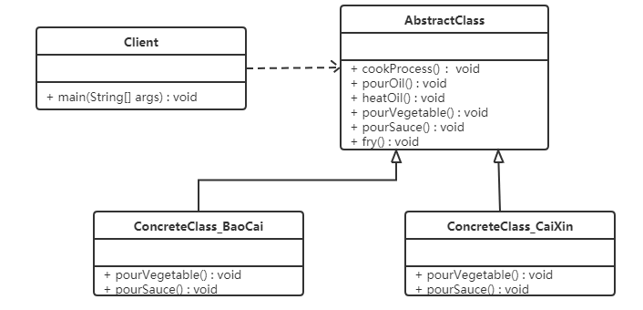


```java
package mao;

/**
 * Project name(项目名称)：java设计模式_模板方法模式
 * Package(包名): mao
 * Class(类名): AbstractClass
 * Author(作者）: mao
 * Author QQ：1296193245
 * GitHub：https://github.com/maomao124/
 * Date(创建日期)： 2022/8/18
 * Time(创建时间)： 19:52
 * Version(版本): 1.0
 * Description(描述)： 无
 */

public abstract class AbstractClass
{
    /**
     * 模板方法。定义了算法的骨架，按某种顺序调用其包含的基本方法
     */
    public final void cookProcess()
    {
        //第一步：倒油
        this.pourOil();
        //第二步：热油
        this.heatOil();
        //第三步：倒蔬菜
        this.pourVegetable();
        //第四步：倒调味料
        this.pourSauce();
        //第五步：翻炒
        this.fry();
    }

    public void pourOil()
    {
        System.out.println("倒油");
    }

    public void heatOil()
    {
        System.out.println("热油");
    }

    /**
     * 倒蔬菜
     */
    public abstract void pourVegetable();

    /**
     * 倒调味料
     */
    public abstract void pourSauce();

    public void fry()
    {
        System.out.println("翻炒");
    }

}
```


```java
package mao;

/**
 * Project name(项目名称)：java设计模式_模板方法模式
 * Package(包名): mao
 * Class(类名): ConcreteClass_BaoCai
 * Author(作者）: mao
 * Author QQ：1296193245
 * GitHub：https://github.com/maomao124/
 * Date(创建日期)： 2022/8/18
 * Time(创建时间)： 19:55
 * Version(版本): 1.0
 * Description(描述)： 无
 */

public class ConcreteClass_BaoCai extends AbstractClass
{

    @Override
    public void pourVegetable()
    {
        System.out.println("下包菜");
    }

    @Override
    public void pourSauce()
    {
        System.out.println("倒辣椒");
    }
}
```


```java
package mao;

/**
 * Project name(项目名称)：java设计模式_模板方法模式
 * Package(包名): mao
 * Class(类名): ConcreteClass_CaiXin
 * Author(作者）: mao
 * Author QQ：1296193245
 * GitHub：https://github.com/maomao124/
 * Date(创建日期)： 2022/8/18
 * Time(创建时间)： 19:56
 * Version(版本): 1.0
 * Description(描述)： 无
 */

public class ConcreteClass_CaiXin extends AbstractClass
{

    @Override
    public void pourVegetable()
    {
        System.out.println("下菜心");
    }

    @Override
    public void pourSauce()
    {
        System.out.println("下蒜蓉");
    }
}
```


```java
package mao;

/**
 * Project name(项目名称)：java设计模式_模板方法模式
 * Package(包名): mao
 * Class(类名): Test
 * Author(作者）: mao
 * Author QQ：1296193245
 * GitHub：https://github.com/maomao124/
 * Date(创建日期)： 2022/8/18
 * Time(创建时间)： 19:57
 * Version(版本): 1.0
 * Description(描述)： 无
 */

public class Test
{
    public static void main(String[] args)
    {
        AbstractClass abstractClass = new ConcreteClass_BaoCai();
        abstractClass.cookProcess();
        System.out.println("-----");
        abstractClass = new ConcreteClass_CaiXin();
        abstractClass.cookProcess();
    }
}
```


运行结果：

```sh
倒油
热油
下包菜
倒辣椒
翻炒
-----
倒油
热油
下菜心
下蒜蓉
翻炒
```


为防止恶意操作，一般模板方法都加上 final 关键词。


### 优缺点

**优点：**

* 提高代码复用性

  将相同部分的代码放在抽象的父类中，而将不同的代码放入不同的子类中。

* 实现了反向控制

  通过一个父类调用其子类的操作，通过对子类的具体实现扩展不同的行为，实现了反向控制 ，并符合“开闭原则”。

**缺点：**

* 对每个不同的实现都需要定义一个子类，这会导致类的个数增加，系统更加庞大，设计也更加抽象。
* 父类中的抽象方法由子类实现，子类执行的结果会影响父类的结果，这导致一种反向的控制结构，它提高了代码阅读的难度。


### 适用场景

* 算法的整体步骤很固定，但其中个别部分易变时，这时候可以使用模板方法模式，将容易变的部分抽象出来，供子类实现。
* 需要通过子类来决定父类算法中某个步骤是否执行，实现子类对父类的反向控制。


### JDK源码解析

InputStream类就使用了模板方法模式。在InputStream类中定义了多个 `read()` 方法


```java
public abstract class InputStream implements Closeable {
    //抽象方法，要求子类必须重写
    public abstract int read() throws IOException;

    public int read(byte b[]) throws IOException {
        return read(b, 0, b.length);
    }

    public int read(byte b[], int off, int len) throws IOException {
        if (b == null) {
            throw new NullPointerException();
        } else if (off < 0 || len < 0 || len > b.length - off) {
            throw new IndexOutOfBoundsException();
        } else if (len == 0) {
            return 0;
        }

        int c = read(); //调用了无参的read方法，该方法是每次读取一个字节数据
        if (c == -1) {
            return -1;
        }
        b[off] = (byte)c;

        int i = 1;
        try {
            for (; i < len ; i++) {
                c = read();
                if (c == -1) {
                    break;
                }
                b[off + i] = (byte)c;
            }
        } catch (IOException ee) {
        }
        return i;
    }
}
```

无参的 `read()` 方法是抽象方法，要求子类必须实现。而 `read(byte b[])` 方法调用了 `read(byte b[], int off, int len)` 方法

在InputStream父类中已经定义好了读取一个字节数组数据的方法是每次读取一个字节，并将其存储到数组的第一个索引位置，读取len个字节数据。具体如何读取一个字节数据呢？由子类实现


## 策略模式

### 概念

该模式定义了一系列算法，并将每个算法封装起来，使它们可以相互替换，且算法的变化不会影响使用算法的客户。策略模式属于对象行为模式，它通过对算法进行封装，把使用算法的责任和算法的实现分割开来，并委派给不同的对象对这些算法进行管理。

如满减活动中，可以有满30减5元、满50减10元等，
如购物系统中针对不通过用户等级进行不同的折扣，原价（普通顾客），九折（会员），八折（超级会员）和七折（金牌会员）等，这些策略相互排斥、可替换。


### 结构

策略模式的主要角色如下：

* 抽象策略（Strategy）类：这是一个抽象角色，通常由一个接口或抽象类实现。此角色给出所有的具体策略类所需的接口。
* 具体策略（Concrete Strategy）类：实现了抽象策略定义的接口，提供具体的算法实现或行为。
* 环境（Context）类：持有一个策略类的引用，最终给客户端调用。


### 示例

**促销活动**

一家百货公司在定年度的促销活动。针对不同的节日（春节、中秋节、圣诞节）推出不同的促销活动，由促销员将促销活动展示给客户


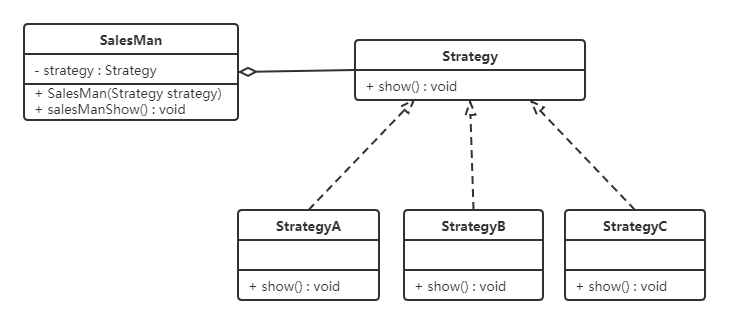


```java
package mao.t1;

/**
 * Project name(项目名称)：java设计模式_策略模式
 * Package(包名): mao.t1
 * Interface(接口名): Strategy
 * Author(作者）: mao
 * Author QQ：1296193245
 * GitHub：https://github.com/maomao124/
 * Date(创建日期)： 2022/8/18
 * Time(创建时间)： 20:16
 * Version(版本): 1.0
 * Description(描述)： 抽象策略（Strategy）类
 */

public interface Strategy
{
    void show();
}
```


```java
package mao.t1;

/**
 * Project name(项目名称)：java设计模式_策略模式
 * Package(包名): mao.t1
 * Class(类名): StrategyA
 * Author(作者）: mao
 * Author QQ：1296193245
 * GitHub：https://github.com/maomao124/
 * Date(创建日期)： 2022/8/18
 * Time(创建时间)： 20:17
 * Version(版本): 1.0
 * Description(描述)： 为春节准备的促销活动A
 */

public class StrategyA implements Strategy
{

    @Override
    public void show()
    {
        System.out.println("买一送一");
    }
}
```


```java
package mao.t1;

/**
 * Project name(项目名称)：java设计模式_策略模式
 * Package(包名): mao.t1
 * Class(类名): StrategyB
 * Author(作者）: mao
 * Author QQ：1296193245
 * GitHub：https://github.com/maomao124/
 * Date(创建日期)： 2022/8/18
 * Time(创建时间)： 20:17
 * Version(版本): 1.0
 * Description(描述)： 为中秋准备的促销活动B
 */

public class StrategyB implements Strategy
{

    @Override
    public void show()
    {
        System.out.println("满200元减50元");
    }
}
```


```java
package mao.t1;

/**
 * Project name(项目名称)：java设计模式_策略模式
 * Package(包名): mao.t1
 * Class(类名): StrategyC
 * Author(作者）: mao
 * Author QQ：1296193245
 * GitHub：https://github.com/maomao124/
 * Date(创建日期)： 2022/8/18
 * Time(创建时间)： 20:18
 * Version(版本): 1.0
 * Description(描述)： 为圣诞准备的促销活动C
 */

public class StrategyC implements Strategy
{

    @Override
    public void show()
    {
        System.out.println("满1000元加一元换购任意200元以下商品");
    }
}
```


```java
package mao.t1;

/**
 * Project name(项目名称)：java设计模式_策略模式
 * Package(包名): mao.t1
 * Class(类名): SalesMan
 * Author(作者）: mao
 * Author QQ：1296193245
 * GitHub：https://github.com/maomao124/
 * Date(创建日期)： 2022/8/18
 * Time(创建时间)： 20:19
 * Version(版本): 1.0
 * Description(描述)： 环境角色类
 */

public class SalesMan
{
    //抽象策略角色的引用
    private final Strategy strategy;

    public SalesMan(Strategy strategy)
    {
        this.strategy = strategy;
    }

    public void salesManShow()
    {
        strategy.show();
    }
}
```


```java
package mao.t1;

/**
 * Project name(项目名称)：java设计模式_策略模式
 * Package(包名): mao.t1
 * Class(类名): Test
 * Author(作者）: mao
 * Author QQ：1296193245
 * GitHub：https://github.com/maomao124/
 * Date(创建日期)： 2022/8/18
 * Time(创建时间)： 20:20
 * Version(版本): 1.0
 * Description(描述)： 无
 */

public class Test
{
    public static void main(String[] args)
    {
        SalesMan salesMan = new SalesMan(new StrategyA());
        salesMan.salesManShow();
        salesMan = new SalesMan(new StrategyB());
        salesMan.salesManShow();
        salesMan = new SalesMan(new StrategyC());
        salesMan.salesManShow();
    }
}
```


运行结果：

```sh
买一送一
满200元减50元
满1000元加一元换购任意200元以下商品
```


**实现加减乘除**


```java
package mao.t2;

/**
 * Project name(项目名称)：java设计模式_策略模式
 * Package(包名): mao.t2
 * Interface(接口名): Strategy
 * Author(作者）: mao
 * Author QQ：1296193245
 * GitHub：https://github.com/maomao124/
 * Date(创建日期)： 2022/8/18
 * Time(创建时间)： 20:25
 * Version(版本): 1.0
 * Description(描述)： 无
 */

public interface Strategy
{
    int doOperation(int num1, int num2);
}
```


```java
package mao.t2;

/**
 * Project name(项目名称)：java设计模式_策略模式
 * Package(包名): mao.t2
 * Class(类名): OperationAdd
 * Author(作者）: mao
 * Author QQ：1296193245
 * GitHub：https://github.com/maomao124/
 * Date(创建日期)： 2022/8/18
 * Time(创建时间)： 20:26
 * Version(版本): 1.0
 * Description(描述)： 无
 */

public class OperationAdd implements Strategy
{

    @Override
    public int doOperation(int num1, int num2)
    {
        return num1 + num2;
    }
}
```


```java
package mao.t2;

/**
 * Project name(项目名称)：java设计模式_策略模式
 * Package(包名): mao.t2
 * Class(类名): OperationSubtract
 * Author(作者）: mao
 * Author QQ：1296193245
 * GitHub：https://github.com/maomao124/
 * Date(创建日期)： 2022/8/18
 * Time(创建时间)： 20:27
 * Version(版本): 1.0
 * Description(描述)： 无
 */

public class OperationSubtract implements Strategy
{

    @Override
    public int doOperation(int num1, int num2)
    {
        return num1 - num2;
    }
}
```


```java
package mao.t2;

/**
 * Project name(项目名称)：java设计模式_策略模式
 * Package(包名): mao.t2
 * Class(类名): OperationMultiply
 * Author(作者）: mao
 * Author QQ：1296193245
 * GitHub：https://github.com/maomao124/
 * Date(创建日期)： 2022/8/18
 * Time(创建时间)： 20:27
 * Version(版本): 1.0
 * Description(描述)： 无
 */

public class OperationMultiply implements Strategy
{

    @Override
    public int doOperation(int num1, int num2)
    {
        return num1 * num2;
    }

}
```


```java
package mao.t2;

/**
 * Project name(项目名称)：java设计模式_策略模式
 * Package(包名): mao.t2
 * Class(类名): OperationDivision
 * Author(作者）: mao
 * Author QQ：1296193245
 * GitHub：https://github.com/maomao124/
 * Date(创建日期)： 2022/8/18
 * Time(创建时间)： 20:28
 * Version(版本): 1.0
 * Description(描述)： 无
 */

public class OperationDivision implements Strategy
{

    @Override
    public int doOperation(int num1, int num2)
    {
        return num1 / num2;
    }
}
```


```java
package mao.t2;

/**
 * Project name(项目名称)：java设计模式_策略模式
 * Package(包名): mao.t2
 * Class(类名): Context
 * Author(作者）: mao
 * Author QQ：1296193245
 * GitHub：https://github.com/maomao124/
 * Date(创建日期)： 2022/8/18
 * Time(创建时间)： 20:29
 * Version(版本): 1.0
 * Description(描述)： 无
 */

public class Context
{
    private final Strategy strategy;

    public Context(Strategy strategy)
    {
        this.strategy = strategy;
    }

    public int executeStrategy(int num1, int num2)
    {
        return strategy.doOperation(num1, num2);
    }
}
```


```java
package mao.t2;

/**
 * Project name(项目名称)：java设计模式_策略模式
 * Package(包名): mao.t2
 * Class(类名): Test
 * Author(作者）: mao
 * Author QQ：1296193245
 * GitHub：https://github.com/maomao124/
 * Date(创建日期)： 2022/8/18
 * Time(创建时间)： 20:29
 * Version(版本): 1.0
 * Description(描述)： 无
 */

public class Test
{
    public static void main(String[] args)
    {
        {
            Context context = new Context(new OperationAdd());
            System.out.println(context.executeStrategy(3, 8));
            System.out.println(context.executeStrategy(45, 4));
            System.out.println(context.executeStrategy(40, 20));
        }

        {
            Context context = new Context(new OperationSubtract());
            System.out.println(context.executeStrategy(3, 8));
            System.out.println(context.executeStrategy(45, 4));
            System.out.println(context.executeStrategy(40, 20));
        }

        {
            Context context = new Context(new OperationMultiply());
            System.out.println(context.executeStrategy(3, 8));
            System.out.println(context.executeStrategy(45, 4));
            System.out.println(context.executeStrategy(40, 20));
        }

        {
            Context context = new Context(new OperationDivision());
            System.out.println(context.executeStrategy(3, 8));
            System.out.println(context.executeStrategy(45, 4));
            System.out.println(context.executeStrategy(40, 20));
        }
    }
}
```


运行结果：

```sh
11
49
60
-5
41
20
24
180
800
0
11
2
```


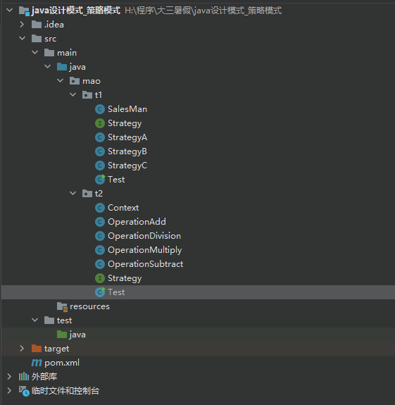


### 优缺点

**优点：**

* 策略类之间可以自由切换

  由于策略类都实现同一个接口，所以使它们之间可以自由切换。

* 易于扩展

  增加一个新的策略只需要添加一个具体的策略类即可，基本不需要改变原有的代码，符合“开闭原则“

* 避免使用多重条件选择语句（if else），充分体现面向对象设计思想。


**缺点：**

* 客户端必须知道所有的策略类，并自行决定使用哪一个策略类。
* 策略模式将造成产生很多策略类，可以通过使用享元模式在一定程度上减少对象的数量。


### 使用场景

* 一个系统需要动态地在几种算法中选择一种时，可将每个算法封装到策略类中。
* 一个类定义了多种行为，并且这些行为在这个类的操作中以多个条件语句的形式出现，可将每个条件分支移入它们各自的策略类中以代替这些条件语句。
* 系统中各算法彼此完全独立，且要求对客户隐藏具体算法的实现细节时。
* 系统要求使用算法的客户不应该知道其操作的数据时，可使用策略模式来隐藏与算法相关的数据结构。
* 多个类只区别在表现行为不同，可以使用策略模式，在运行时动态选择具体要执行的行为。


### JDK源码解析

`Comparator` 中的策略模式。在Arrays类中有一个 `sort()` 方法

```java
public class Arrays{
    public static <T> void sort(T[] a, Comparator<? super T> c) {
        if (c == null) {
            sort(a);
        } else {
            if (LegacyMergeSort.userRequested)
                legacyMergeSort(a, c);
            else
                TimSort.sort(a, 0, a.length, c, null, 0, 0);
        }
    }
}
```


Arrays就是一个环境角色类，这个sort方法可以传一个新策略让Arrays根据这个策略来进行排序


```java
package mao.jdk;

import java.util.Arrays;
import java.util.Comparator;

/**
 * Project name(项目名称)：java设计模式_策略模式
 * Package(包名): mao.jdk
 * Class(类名): Test
 * Author(作者）: mao
 * Author QQ：1296193245
 * GitHub：https://github.com/maomao124/
 * Date(创建日期)： 2022/8/18
 * Time(创建时间)： 21:06
 * Version(版本): 1.0
 * Description(描述)： 无
 */

public class Test
{
    public static int getIntRandom(int min, int max)
    {
        if (min > max)
        {
            min = max;
        }
        return min + (int) (Math.random() * (max - min + 1));
    }


    public static void main(String[] args)
    {
        Integer[] integers = new Integer[20];
        for (int i = 0; i < 20; i++)
        {
            integers[i] = getIntRandom(50, 100);
        }

        System.out.println(Arrays.stream(integers).toList());

        Arrays.sort(integers, new Comparator<Integer>()
        {
            @Override
            public int compare(Integer o1, Integer o2)
            {
                return o2 - o1;
            }
        });

        System.out.println(Arrays.stream(integers).toList());
    }

}
```


运行结果：

```sh
[96, 52, 99, 96, 79, 94, 82, 99, 74, 90, 98, 62, 72, 85, 82, 53, 79, 67, 97, 88]
[99, 99, 98, 97, 96, 96, 94, 90, 88, 85, 82, 82, 79, 79, 74, 72, 67, 62, 53, 52]
```


在调用Arrays的sort方法时，第二个参数传递的是Comparator接口的子实现类对象。所以Comparator充当的是抽象策略角色，而具体的子实现类充当的是具体策略角色。环境角色类（Arrays）应该持有抽象策略的引用来调用。那么，Arrays类的sort方法到底有没有使用Comparator子实现类中的 `compare()` 方法吗？让我们继续查看TimSort类的 `sort()` 方法


```java
class TimSort<T> {
    static <T> void sort(T[] a, int lo, int hi, Comparator<? super T> c,
                         T[] work, int workBase, int workLen) {
        assert c != null && a != null && lo >= 0 && lo <= hi && hi <= a.length;

        int nRemaining  = hi - lo;
        if (nRemaining < 2)
            return;  // Arrays of size 0 and 1 are always sorted

        // If array is small, do a "mini-TimSort" with no merges
        if (nRemaining < MIN_MERGE) {
            int initRunLen = countRunAndMakeAscending(a, lo, hi, c);
            binarySort(a, lo, hi, lo + initRunLen, c);
            return;
        }
        ...
    }   
        
    private static <T> int countRunAndMakeAscending(T[] a, int lo, int hi,Comparator<? super T> c) {
        assert lo < hi;
        int runHi = lo + 1;
        if (runHi == hi)
            return 1;

        // Find end of run, and reverse range if descending
        if (c.compare(a[runHi++], a[lo]) < 0) { // Descending
            while (runHi < hi && c.compare(a[runHi], a[runHi - 1]) < 0)
                runHi++;
            reverseRange(a, lo, runHi);
        } else {                              // Ascending
            while (runHi < hi && c.compare(a[runHi], a[runHi - 1]) >= 0)
                runHi++;
        }

        return runHi - lo;
    }
}
```


代码中最终会跑到 `countRunAndMakeAscending()` 这个方法中。我们可以看见，只用了compare方法，所以在调用Arrays.sort方法只传具体compare重写方法的类对象就行，这也是Comparator接口中必须要子类实现的一个方法


## 命令模式

### 概念

将一个请求封装为一个对象，使发出请求的责任和执行请求的责任分割开。这样两者之间通过命令对象进行沟通，这样方便将命令对象进行存储、传递、调用、增加与管理。


比如：

* 我们买了一套智能家电，有照明灯、风扇、冰箱、洗衣机，我们只要在手机上安装app 就可以控制对这些家电工作。
* 这些智能家电来自不同的厂家，我们不想针对每一种家电都安装一个App ，分别控制，我们希望只要一个app 就可以控制全部智能家电。
* 要实现一个app 控制所有智能家电的需要，则每个智能家电厂家都要提供一个统一的接口给app 调用，这时 就可以考虑使用命令模式。
* 命令模式可将“动作的请求者”从“动作的执行者”对象中解耦出来.
* 在我们的例子中，动作请求者是手机app，动作的执行者是每个厂商的一个家电产品


### 结构

命令模式包含以下主要角色：

* 抽象命令类（Command）角色： 定义命令的接口，声明执行的方法。
* 具体命令（Concrete  Command）角色：具体的命令，实现命令接口；通常会持有接收者，并调用接收者的功能来完成命令要执行的操作。
* 实现者/接收者（Receiver）角色： 接收者，真正执行命令的对象。任何类都可能成为一个接收者，只要它能够实现命令要求实现的相应功能。
* 调用者/请求者（Invoker）角色： 要求命令对象执行请求，通常会持有命令对象，可以持有很多的命令对象。这个是客户端真正触发命令并要求命令执行相应操作的地方，也就是说相当于使用命令对象的入口。


### 示例

**智能家电项目**


```java
package mao.t1;

/**
 * Project name(项目名称)：java设计模式_命令模式
 * Package(包名): mao.t1
 * Interface(接口名): Command
 * Author(作者）: mao
 * Author QQ：1296193245
 * GitHub：https://github.com/maomao124/
 * Date(创建日期)： 2022/8/18
 * Time(创建时间)： 21:29
 * Version(版本): 1.0
 * Description(描述)： 无
 */

public interface Command
{
    /**
     * 命令执行
     */
    void execute();

    /**
     * 命令撤销
     */
    void undo();
}
```


```java
package mao.t1;

import java.awt.*;

/**
 * Project name(项目名称)：java设计模式_命令模式
 * Package(包名): mao.t1
 * Class(类名): LightReceiver
 * Author(作者）: mao
 * Author QQ：1296193245
 * GitHub：https://github.com/maomao124/
 * Date(创建日期)： 2022/8/18
 * Time(创建时间)： 21:30
 * Version(版本): 1.0
 * Description(描述)： 无
 */

public class LightReceiver
{
    public void on()
    {
        Toolkit.getDefaultToolkit().beep();
        System.out.println("电灯打开了");
    }

    public void off()
    {
        Toolkit.getDefaultToolkit().beep();
        System.out.println("电灯关闭了");
    }
}

```


```java
package mao.t1;

/**
 * Project name(项目名称)：java设计模式_命令模式
 * Package(包名): mao.t1
 * Class(类名): LightOnCommand
 * Author(作者）: mao
 * Author QQ：1296193245
 * GitHub：https://github.com/maomao124/
 * Date(创建日期)： 2022/8/18
 * Time(创建时间)： 21:31
 * Version(版本): 1.0
 * Description(描述)： 无
 */

public class LightOnCommand implements Command
{
    private final LightReceiver light;

    /**
     * Instantiates a new Light on command.
     */
    public LightOnCommand()
    {
        light = new LightReceiver();
    }

    /**
     * Instantiates a new Light on command.
     *
     * @param light the light
     */
    public LightOnCommand(LightReceiver light)
    {
        this.light = light;
    }

    @Override
    public void execute()
    {
        light.on();
    }

    @Override
    public void undo()
    {
        light.off();
    }
}

```


```java
package mao.t1;

/**
 * Project name(项目名称)：java设计模式_命令模式
 * Package(包名): mao.t1
 * Class(类名): LightOffCommand
 * Author(作者）: mao
 * Author QQ：1296193245
 * GitHub：https://github.com/maomao124/
 * Date(创建日期)： 2022/8/18
 * Time(创建时间)： 21:33
 * Version(版本): 1.0
 * Description(描述)： 无
 */

public class LightOffCommand implements Command
{
    private final LightReceiver light;

    /**
     * Instantiates a new Light off command.
     */
    public LightOffCommand()
    {
        light = new LightReceiver();
    }

    /**
     * Instantiates a new Light off command.
     *
     * @param light the light
     */
    public LightOffCommand(LightReceiver light)
    {
        this.light = light;
    }

    @Override
    public void execute()
    {
        light.off();
    }

    @Override
    public void undo()
    {
        light.on();
    }
}
```


```java
package mao.t1;

/**
 * Project name(项目名称)：java设计模式_命令模式
 * Package(包名): mao.t1
 * Class(类名): NoCommand
 * Author(作者）: mao
 * Author QQ：1296193245
 * GitHub：https://github.com/maomao124/
 * Date(创建日期)： 2022/8/18
 * Time(创建时间)： 21:34
 * Version(版本): 1.0
 * Description(描述)： 没有任何命令，即空执行: 用于初始化每个按钮, 当调用空命令时，对象什么都不做
 * 其实，这样是一种设计模式, 可以省掉对空判断
 */

public class NoCommand implements Command
{

    @Override
    public void execute()
    {

    }

    @Override
    public void undo()
    {

    }
}
```


```java
package mao.t1;

import java.awt.*;

/**
 * Project name(项目名称)：java设计模式_命令模式
 * Package(包名): mao.t1
 * Class(类名): TVReceiver
 * Author(作者）: mao
 * Author QQ：1296193245
 * GitHub：https://github.com/maomao124/
 * Date(创建日期)： 2022/8/18
 * Time(创建时间)： 21:50
 * Version(版本): 1.0
 * Description(描述)： 无
 */

public class TVReceiver
{
    public void on()
    {
        Toolkit.getDefaultToolkit().beep();
        System.out.println("电视机打开");
    }

    public void off()
    {
        Toolkit.getDefaultToolkit().beep();
        System.out.println("电视机关闭");
    }
}
```


```java
package mao.t1;

/**
 * Project name(项目名称)：java设计模式_命令模式
 * Package(包名): mao.t1
 * Class(类名): TVOnCommand
 * Author(作者）: mao
 * Author QQ：1296193245
 * GitHub：https://github.com/maomao124/
 * Date(创建日期)： 2022/8/18
 * Time(创建时间)： 21:52
 * Version(版本): 1.0
 * Description(描述)： 无
 */

public class TVOnCommand implements Command
{
    private final TVReceiver tvReceiver;

    /**
     * Instantiates a new Tv on command.
     */
    public TVOnCommand()
    {
        tvReceiver = new TVReceiver();
    }

    /**
     * Instantiates a new Tv on command.
     *
     * @param tvReceiver the tv receiver
     */
    public TVOnCommand(TVReceiver tvReceiver)
    {
        this.tvReceiver = tvReceiver;
    }

    @Override
    public void execute()
    {
        tvReceiver.on();
    }

    @Override
    public void undo()
    {
        tvReceiver.off();
    }
}
```


```java
package mao.t1;

/**
 * Project name(项目名称)：java设计模式_命令模式
 * Package(包名): mao.t1
 * Class(类名): TVOffCommand
 * Author(作者）: mao
 * Author QQ：1296193245
 * GitHub：https://github.com/maomao124/
 * Date(创建日期)： 2022/8/18
 * Time(创建时间)： 21:53
 * Version(版本): 1.0
 * Description(描述)： 无
 */

public class TVOffCommand implements Command
{
    private final TVReceiver tvReceiver;

    /**
     * Instantiates a new Tv off command.
     */
    public TVOffCommand()
    {
        this.tvReceiver = new TVReceiver();
    }

    /**
     * Instantiates a new Tv off command.
     *
     * @param tvReceiver the tv receiver
     */
    public TVOffCommand(TVReceiver tvReceiver)
    {
        this.tvReceiver = tvReceiver;
    }

    @Override
    public void execute()
    {
        tvReceiver.off();
    }

    @Override
    public void undo()
    {
        tvReceiver.on();
    }
}
```


```java
package mao.t1;

import java.awt.*;

/**
 * Project name(项目名称)：java设计模式_命令模式
 * Package(包名): mao.t1
 * Class(类名): AirConditionerReceiver
 * Author(作者）: mao
 * Author QQ：1296193245
 * GitHub：https://github.com/maomao124/
 * Date(创建日期)： 2022/8/18
 * Time(创建时间)： 21:59
 * Version(版本): 1.0
 * Description(描述)： 无
 */

public class AirConditionerReceiver
{
    public void on()
    {
        Toolkit.getDefaultToolkit().beep();
        System.out.println("空调打开");
    }

    public void off()
    {
        Toolkit.getDefaultToolkit().beep();
        System.out.println("空调关闭");
    }
}
```


```java
package mao.t1;

/**
 * Project name(项目名称)：java设计模式_命令模式
 * Package(包名): mao.t1
 * Class(类名): AirConditionerOnCommand
 * Author(作者）: mao
 * Author QQ：1296193245
 * GitHub：https://github.com/maomao124/
 * Date(创建日期)： 2022/8/18
 * Time(创建时间)： 21:59
 * Version(版本): 1.0
 * Description(描述)： 无
 */

public class AirConditionerOnCommand implements Command
{
    private final AirConditionerReceiver airConditionerReceiver;

    /**
     * Instantiates a new Air conditioner on command.
     */
    public AirConditionerOnCommand()
    {
        this.airConditionerReceiver = new AirConditionerReceiver();
    }

    /**
     * Instantiates a new Air conditioner on command.
     *
     * @param airConditionerReceiver the air conditioner receiver
     */
    public AirConditionerOnCommand(AirConditionerReceiver airConditionerReceiver)
    {
        this.airConditionerReceiver = airConditionerReceiver;
    }

    @Override
    public void execute()
    {
        airConditionerReceiver.on();
    }

    @Override
    public void undo()
    {
        airConditionerReceiver.off();
    }
}
```


```java
package mao.t1;

/**
 * Project name(项目名称)：java设计模式_命令模式
 * Package(包名): mao.t1
 * Class(类名): AirConditionerOffCommand
 * Author(作者）: mao
 * Author QQ：1296193245
 * GitHub：https://github.com/maomao124/
 * Date(创建日期)： 2022/8/18
 * Time(创建时间)： 22:01
 * Version(版本): 1.0
 * Description(描述)： 无
 */

public class AirConditionerOffCommand implements Command
{
    private final AirConditionerReceiver airConditionerReceiver;

    /**
     * Instantiates a new Air conditioner off command.
     */
    public AirConditionerOffCommand()
    {
        this.airConditionerReceiver = new AirConditionerReceiver();
    }

    /**
     * Instantiates a new Air conditioner off command.
     *
     * @param airConditionerReceiver the air conditioner receiver
     */
    public AirConditionerOffCommand(AirConditionerReceiver airConditionerReceiver)
    {
        this.airConditionerReceiver = airConditionerReceiver;
    }

    @Override
    public void execute()
    {
        airConditionerReceiver.off();
    }

    @Override
    public void undo()
    {
        airConditionerReceiver.on();
    }
}
```


```java
package mao.t1;

/**
 * Project name(项目名称)：java设计模式_命令模式
 * Package(包名): mao.t1
 * Class(类名): RemoteController
 * Author(作者）: mao
 * Author QQ：1296193245
 * GitHub：https://github.com/maomao124/
 * Date(创建日期)： 2022/8/18
 * Time(创建时间)： 21:37
 * Version(版本): 1.0
 * Description(描述)： 遥控器
 */

public class RemoteController
{
    private final Command[] onCommands;
    private final Command[] offCommands;

    //撤销命令
    private Command undoCommand;

    /**
     * 构造方法，初始化操作，默认的命令总数为5
     */
    public RemoteController()
    {
        onCommands = new Command[5];
        offCommands = new Command[5];

        //初始化命令
        for (int i = 0; i < 5; i++)
        {
            onCommands[i] = new NoCommand();
            offCommands[i] = new NoCommand();
        }
    }

    /**
     * 构造方法，初始化操作
     *
     * @param total 命令的总数
     */
    public RemoteController(int total)
    {
        onCommands = new Command[total];
        offCommands = new Command[total];

        //初始化命令
        for (int i = 0; i < total; i++)
        {
            onCommands[i] = new NoCommand();
            offCommands[i] = new NoCommand();
        }
    }

    /**
     * 获得命令的总数
     *
     * @return int型
     */
    public int getCommandsTotal()
    {
        return onCommands.length;
    }

    /**
     * 设置命令
     *
     * @param no         命令号
     * @param onCommand  打开的命令
     * @param offCommand 关闭的命令
     */
    public void setCommand(int no, Command onCommand, Command offCommand)
    {
        onCommands[no] = onCommand;
        offCommands[no] = offCommand;
    }

    /**
     * 按下按钮，执行打开操作
     *
     * @param no 要执行打开操作的命令号
     */
    public void onButtonWasPushed(int no)
    {
        onCommands[no].execute();
        //记录这次的操作，用于撤销
        undoCommand = onCommands[no];
    }

    /**
     * 按下按钮，执行关闭操作
     *
     * @param no 要执行打开操作的命令号
     */
    public void offButtonWasPushed(int no)
    {
        offCommands[no].execute();
        //记录这次的操作，用于撤销
        undoCommand = offCommands[no];
    }

    /**
     * 按下撤销按钮
     */
    public void undoButtonWasPushed()
    {
        undoCommand.undo();
    }
}
```


```java
package mao.t1;

/**
 * Project name(项目名称)：java设计模式_命令模式
 * Package(包名): mao.t1
 * Class(类名): Test
 * Author(作者）: mao
 * Author QQ：1296193245
 * GitHub：https://github.com/maomao124/
 * Date(创建日期)： 2022/8/18
 * Time(创建时间)： 22:05
 * Version(版本): 1.0
 * Description(描述)： 无
 */

public class Test
{
    private static void sleep()
    {
        try
        {
            Thread.sleep(1000);
        }
        catch (InterruptedException e)
        {
            e.printStackTrace();
        }
    }

    public static void main(String[] args)
    {
        RemoteController remoteController = new RemoteController(3);
        System.out.println(remoteController.getCommandsTotal());
        remoteController.setCommand(0, new LightOnCommand(), new LightOffCommand());
        remoteController.setCommand(1, new TVOnCommand(), new TVOffCommand());
        remoteController.setCommand(2, new AirConditionerOnCommand(), new AirConditionerOffCommand());

        System.out.println("开始发送命令");

        remoteController.onButtonWasPushed(0);
        sleep();
        remoteController.offButtonWasPushed(0);
        sleep();
        remoteController.onButtonWasPushed(1);
        sleep();
        remoteController.offButtonWasPushed(1);
        sleep();
        remoteController.onButtonWasPushed(2);
        sleep();
        remoteController.offButtonWasPushed(2);
        sleep();
        System.out.println("执行撤销操作");
        remoteController.undoButtonWasPushed();
    }
}
```


运行结果：

```sh
3
开始发送命令
电灯打开了
电灯关闭了
电视机打开
电视机关闭
空调打开
空调关闭
执行撤销操作
空调打开
```


swing界面


```java
package mao.t1;

import javax.swing.*;
import java.awt.*;
import java.awt.event.ActionEvent;
import java.awt.event.ActionListener;
import java.awt.event.WindowAdapter;
import java.awt.event.WindowEvent;

/**
 * Project name(项目名称)：java设计模式_命令模式
 * Package(包名): mao.t1
 * Class(类名): SwingRemoteController
 * Author(作者）: mao
 * Author QQ：1296193245
 * GitHub：https://github.com/maomao124/
 * Date(创建日期)： 2022/8/18
 * Time(创建时间)： 22:16
 * Version(版本): 1.0
 * Description(描述)： 无
 */

public class SwingRemoteController
{
    private JButton LightOnButton;
    private JButton LightOffButton;

    private JButton TVOnButton;
    private JButton TVOffButton;

    private JButton AirConditionerOnButton;
    private JButton AirConditionerOffButton;

    private JButton UndoButton;

    //遥控器对象
    private RemoteController remoteController;


    public SwingRemoteController()
    {
        //初始化顶层面板
        JFrame jFrame = new JFrame("遥控器");
        jFrame.setSize(540, 720);
        //获取屏幕宽度
        int screenWidth = Toolkit.getDefaultToolkit().getScreenSize().width;
        //获取屏幕高度
        int screenHeight = Toolkit.getDefaultToolkit().getScreenSize().height;
        //位于屏幕中央
        jFrame.setLocation(screenWidth / 2 - jFrame.getWidth() / 2, screenHeight / 2 - jFrame.getHeight() / 2);
        jFrame.setDefaultCloseOperation(WindowConstants.DO_NOTHING_ON_CLOSE);

        //注册虚拟机关闭挂钩
        addShutdownHook();

        //初始化按钮
        initButton();

        //个性化
        setPersonalise();

        //初始化遥控器对象
        initRemoteController();

        //设置布局
        setLayout(jFrame);

        //设置关闭的监听器
        setCloseListener(jFrame);

        //给按钮添加监听器
        setButtonListener();


        jFrame.setVisible(true);

    }

    /**
     * 给按钮添加监听器
     */
    private void setButtonListener()
    {
        UndoButton.addActionListener(new ActionListener()
        {
            @Override
            public void actionPerformed(ActionEvent e)
            {
                try
                {
                    remoteController.undoButtonWasPushed();
                }
                catch (NullPointerException ex)
                {
                    Toolkit.getDefaultToolkit().beep();
                    System.err.println(ex.getMessage());
                    JOptionPane.showMessageDialog(null, "还未进行如何操作，无法撤销", "提示", JOptionPane.ERROR_MESSAGE);
                }
            }
        });

        LightOnButton.addActionListener(new ActionListener()
        {
            @Override
            public void actionPerformed(ActionEvent e)
            {
                remoteController.onButtonWasPushed(0);
            }
        });

        LightOffButton.addActionListener(new ActionListener()
        {
            @Override
            public void actionPerformed(ActionEvent e)
            {
                remoteController.offButtonWasPushed(0);
            }
        });

        TVOnButton.addActionListener(new ActionListener()
        {
            @Override
            public void actionPerformed(ActionEvent e)
            {
                remoteController.onButtonWasPushed(1);
            }
        });

        TVOffButton.addActionListener(new ActionListener()
        {
            @Override
            public void actionPerformed(ActionEvent e)
            {
                remoteController.offButtonWasPushed(1);
            }
        });

        AirConditionerOnButton.addActionListener(new ActionListener()
        {
            @Override
            public void actionPerformed(ActionEvent e)
            {
                remoteController.onButtonWasPushed(2);
            }
        });

        AirConditionerOffButton.addActionListener(new ActionListener()
        {
            @Override
            public void actionPerformed(ActionEvent e)
            {
                remoteController.offButtonWasPushed(2);
            }
        });
    }

    /**
     * 初始化遥控器对象
     */
    private void initRemoteController()
    {
        remoteController = new RemoteController(3);
        remoteController.setCommand(0, new LightOnCommand(), new LightOffCommand());
        remoteController.setCommand(1, new TVOnCommand(), new TVOffCommand());
        remoteController.setCommand(2, new AirConditionerOnCommand(), new AirConditionerOffCommand());
    }

    /**
     * 设个性化
     */
    private void setPersonalise()
    {
        Font font = new Font("宋体", Font.BOLD, 32);
        //字体设置
        UndoButton.setFont(font);
        LightOnButton.setFont(font);
        LightOffButton.setFont(font);
        TVOnButton.setFont(font);
        TVOffButton.setFont(font);
        AirConditionerOnButton.setFont(font);
        AirConditionerOffButton.setFont(font);

        //颜色设置
        UndoButton.setForeground(Color.red);
        LightOnButton.setForeground(Color.green);
        LightOffButton.setForeground(new Color(50, 200, 0));
        TVOnButton.setForeground(Color.green);
        TVOffButton.setForeground(new Color(50, 200, 0));
        AirConditionerOnButton.setForeground(Color.green);
        AirConditionerOffButton.setForeground(new Color(50, 200, 0));

        //设置背景
        UndoButton.setBackground(new Color(20, 40, 100));
        LightOnButton.setBackground(new Color(20, 50, 130));
        LightOffButton.setBackground(new Color(20, 50, 130));
        TVOnButton.setBackground(new Color(20, 50, 130));
        TVOffButton.setBackground(new Color(20, 50, 130));
        AirConditionerOnButton.setBackground(new Color(20, 50, 130));
        AirConditionerOffButton.setBackground(new Color(20, 50, 130));
    }

    /**
     * 设置布局
     *
     * @param jFrame JFrame
     */
    private void setLayout(JFrame jFrame)
    {
        JPanel jPanel = new JPanel();
        jPanel.setLayout(new GridLayout(4, 1));
        jPanel.add(UndoButton);
        {
            JPanel jPanel1 = new JPanel();
            jPanel1.setLayout(new GridLayout(1, 2));
            jPanel1.add(LightOnButton);
            jPanel1.add(LightOffButton);
            jPanel.add(jPanel1);
        }

        {
            JPanel jPanel1 = new JPanel();
            jPanel1.setLayout(new GridLayout(1, 2));
            jPanel1.add(TVOnButton);
            jPanel1.add(TVOffButton);
            jPanel.add(jPanel1);
        }

        {
            JPanel jPanel1 = new JPanel();
            jPanel1.setLayout(new GridLayout(1, 2));
            jPanel1.add(AirConditionerOnButton);
            jPanel1.add(AirConditionerOffButton);
            jPanel.add(jPanel1);
        }

        jFrame.add(jPanel);
    }

    /**
     * 初始化按钮
     */
    private void initButton()
    {
        LightOnButton = new JButton("打开电灯");
        LightOffButton = new JButton("关闭电灯");
        TVOnButton = new JButton("打开电视机");
        TVOffButton = new JButton("关闭电视机");
        AirConditionerOnButton = new JButton("打开空调");
        AirConditionerOffButton = new JButton("关闭空调");
        UndoButton = new JButton("撤销操作");
    }

    /**
     * 设置关闭的监听器
     *
     * @param jFrame JFrame
     */
    private void setCloseListener(JFrame jFrame)
    {
        jFrame.addWindowListener(new WindowAdapter()
        {
            @Override
            public void windowClosing(WindowEvent e)
            {
                Toolkit.getDefaultToolkit().beep();
                int result = JOptionPane.showConfirmDialog(null, "是否退出？", "退出提示", JOptionPane.OK_CANCEL_OPTION);
                if (result == 0)
                {
                    System.exit(0);
                }
            }
        });
    }

    /**
     * 注册虚拟机关闭挂钩
     */
    private void addShutdownHook()
    {
        Runtime runtime = Runtime.getRuntime();
        runtime.addShutdownHook(new Thread(new Runnable()
        {
            @Override
            public void run()
            {
                System.out.println("程序退出");
            }
        }));
    }


    public static void main(String[] args)
    {
        new SwingRemoteController();
    }
}
```


运行测试


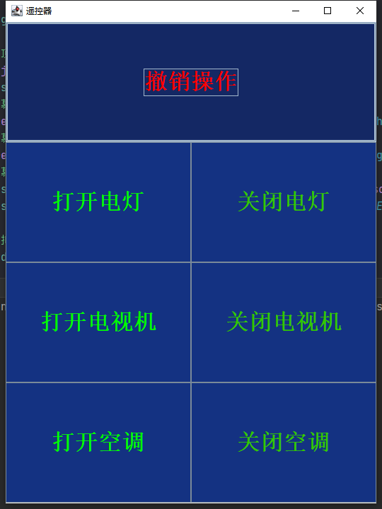


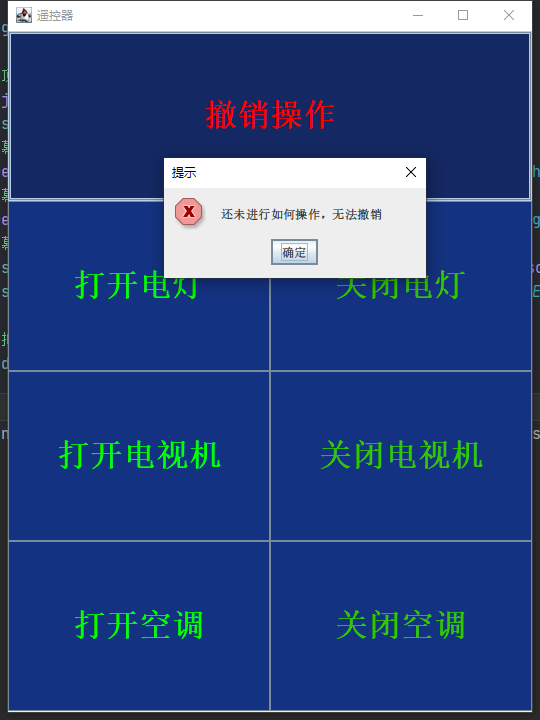


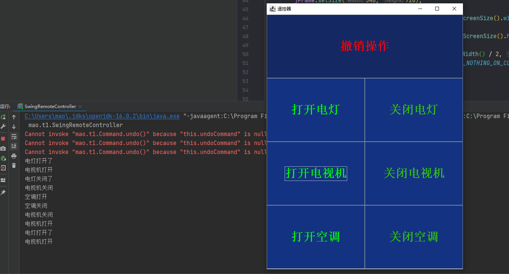


**示例2：餐厅点菜**


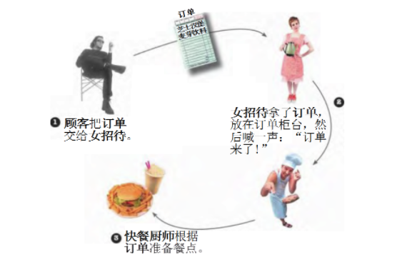


服务员： 就是调用者角色，由她来发起命令。

资深大厨： 就是接收者角色，真正命令执行的对象。

订单： 命令中包含订单。


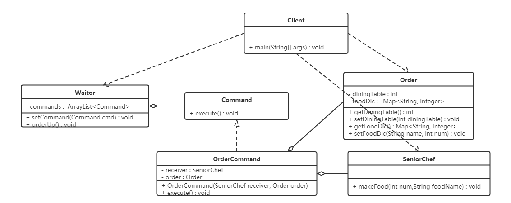


```java
package mao.t2;

/**
 * Project name(项目名称)：java设计模式_命令模式
 * Package(包名): mao.t2
 * Interface(接口名): Command
 * Author(作者）: mao
 * Author QQ：1296193245
 * GitHub：https://github.com/maomao124/
 * Date(创建日期)： 2022/8/18
 * Time(创建时间)： 23:46
 * Version(版本): 1.0
 * Description(描述)： 无
 */


public interface Command
{
    /**
     * Execute.
     */
    void execute();
}
```


```java
package mao.t2;

import java.util.HashMap;
import java.util.Map;

/**
 * Project name(项目名称)：java设计模式_命令模式
 * Package(包名): mao.t2
 * Class(类名): Order
 * Author(作者）: mao
 * Author QQ：1296193245
 * GitHub：https://github.com/maomao124/
 * Date(创建日期)： 2022/8/19
 * Time(创建时间)： 13:52
 * Version(版本): 1.0
 * Description(描述)： 无
 */

public class Order
{
    // 餐桌号码
    private int diningTable;

    // 用来存储餐名并记录份数
    private Map<String, Integer> foodDic = new HashMap<>();

    public int getDiningTable()
    {
        return diningTable;
    }

    public void setDiningTable(int diningTable)
    {
        this.diningTable = diningTable;
    }

    public Map<String, Integer> getFoodDic()
    {
        return foodDic;
    }

    public void setFoodDic(Map<String, Integer> foodDic)
    {
        this.foodDic = foodDic;
    }

    public void addFoodDic(String name, int num)
    {
        foodDic.put(name, num);
    }
}
```


```java
package mao.t2;

/**
 * Project name(项目名称)：java设计模式_命令模式
 * Package(包名): mao.t2
 * Class(类名): SeniorChef
 * Author(作者）: mao
 * Author QQ：1296193245
 * GitHub：https://github.com/maomao124/
 * Date(创建日期)： 2022/8/19
 * Time(创建时间)： 13:55
 * Version(版本): 1.0
 * Description(描述)： 命令的Receiver
 */

public class SeniorChef
{
    /**
     * Make food.
     *
     * @param num      the num
     * @param foodName the food name
     */
    public void makeFood(int num, String foodName)
    {
        System.out.println(num + "份" + foodName);
        try
        {
            Thread.sleep(500);
        }
        catch (InterruptedException e)
        {
            e.printStackTrace();
        }
    }
}
```


```java
package mao.t2;

import java.util.Set;

/**
 * Project name(项目名称)：java设计模式_命令模式
 * Package(包名): mao.t2
 * Class(类名): OrderCommand
 * Author(作者）: mao
 * Author QQ：1296193245
 * GitHub：https://github.com/maomao124/
 * Date(创建日期)： 2022/8/19
 * Time(创建时间)： 13:52
 * Version(版本): 1.0
 * Description(描述)： 无
 */

public class OrderCommand implements Command
{
    private final SeniorChef receiver;
    private final Order order;

    public OrderCommand(SeniorChef receiver, Order order)
    {
        this.receiver = receiver;
        this.order = order;
    }

    public OrderCommand(Order order)
    {
        this.receiver = new SeniorChef();
        this.order = order;

    }

    @Override
    public void execute()
    {
        System.out.println(order.getDiningTable() + "桌的订单：");
        Set<String> keys = order.getFoodDic().keySet();
        for (String key : keys)
        {
            System.out.print("-->");
            receiver.makeFood(order.getFoodDic().get(key), key);
        }
        System.out.println(order.getDiningTable() + "桌的饭制作完毕");
    }


}
```


```java
package mao.t2;

import java.util.ArrayList;
import java.util.List;

/**
 * Project name(项目名称)：java设计模式_命令模式
 * Package(包名): mao.t2
 * Class(类名): Waitor
 * Author(作者）: mao
 * Author QQ：1296193245
 * GitHub：https://github.com/maomao124/
 * Date(创建日期)： 2022/8/19
 * Time(创建时间)： 13:59
 * Version(版本): 1.0
 * Description(描述)： 无
 */

public class Waitor
{
    private final List<Command> commands;

    /**
     * Instantiates a new Waitor.
     */
    public Waitor()
    {
        commands = new ArrayList<>();
    }

    /**
     * Sets command.
     *
     * @param cmd the cmd
     */
    public void setCommand(Command cmd)
    {
        commands.add(cmd);
    }

    /**
     * Order up.
     */
    public void orderUp()
    {
        for (Command command : commands)
        {
            if (command != null)
            {
                System.out.println();
                command.execute();
            }
        }
        commands.clear();
    }
}
```


```java
package mao.t2;

/**
 * Project name(项目名称)：java设计模式_命令模式
 * Package(包名): mao.t2
 * Class(类名): Test
 * Author(作者）: mao
 * Author QQ：1296193245
 * GitHub：https://github.com/maomao124/
 * Date(创建日期)： 2022/8/19
 * Time(创建时间)： 14:05
 * Version(版本): 1.0
 * Description(描述)： 无
 */

public class Test
{
    public static void main(String[] args)
    {
        Order order1 = new Order();
        order1.setDiningTable(1);
        order1.getFoodDic().put("西红柿鸡蛋面", 1);
        order1.getFoodDic().put("小杯可乐", 2);

        Order order2 = new Order();
        order2.setDiningTable(3);
        order2.getFoodDic().put("尖椒肉丝盖饭", 1);
        order2.addFoodDic("小杯雪碧", 1);

        OrderCommand orderCommand1 = new OrderCommand(order1);
        OrderCommand orderCommand2 = new OrderCommand(order2);

        Waitor waitor = new Waitor();
        waitor.setCommand(orderCommand1);
        waitor.setCommand(orderCommand2);
        waitor.orderUp();
        waitor.orderUp();

        Order order3 = new Order();
        order3.setDiningTable(4);
        order3.addFoodDic("马铃薯炒土豆", 2);
        OrderCommand orderCommand3 = new OrderCommand(order3);

        waitor.setCommand(orderCommand3);

        waitor.orderUp();
    }
}
```


运行结果：

```sh
1桌的订单：
-->1份西红柿鸡蛋面
-->2份小杯可乐
1桌的饭制作完毕

3桌的订单：
-->1份尖椒肉丝盖饭
-->1份小杯雪碧
3桌的饭制作完毕

4桌的订单：
-->2份马铃薯炒土豆
4桌的饭制作完毕
```


### 优缺点

**优点：**

* 降低系统的耦合度。命令模式能将调用操作的对象与实现该操作的对象解耦。
* 增加或删除命令非常方便。采用命令模式增加与删除命令不会影响其他类，它满足“开闭原则”，对扩展比较灵活。
* 可以实现宏命令。命令模式可以与组合模式结合，将多个命令装配成一个组合命令，即宏命令。
* 方便实现 Undo 和 Redo 操作。命令模式可以与备忘录模式结合，实现命令的撤销与恢复。

**缺点：**

* 使用命令模式可能会导致某些系统有过多的具体命令类。
* 系统结构更加复杂。


### 使用场景

* 系统需要将请求调用者和请求接收者解耦，使得调用者和接收者不直接交互。
* 系统需要在不同的时间指定请求、将请求排队和执行请求。
* 系统需要支持命令的撤销(Undo)操作和恢复(Redo)操作。


### JDK源码解析

Runable是一个典型命令模式，Runnable担当命令的角色，Thread充当的是调用者，start方法就是其执行方法


```java
@FunctionalInterface
public interface Runnable {
    /**
     * When an object implementing interface {@code Runnable} is used
     * to create a thread, starting the thread causes the object's
     * {@code run} method to be called in that separately executing
     * thread.
     * <p>
     * The general contract of the method {@code run} is that it may
     * take any action whatsoever.
     *
     * @see     java.lang.Thread#run()
     */
    public abstract void run();
}
```


```java
public class Thread implements Runnable {
    private Runnable target;
    
    public synchronized void start() {
        if (threadStatus != 0)
            throw new IllegalThreadStateException();

        group.add(this);

        boolean started = false;
        try {
            start0();
            started = true;
        } finally {
            try {
                if (!started) {
                    group.threadStartFailed(this);
                }
            } catch (Throwable ignore) {
            }
        }
    }
    
    private native void start0();
}
```


会调用一个native方法start0(),调用系统方法，开启一个线程。而接收者是对程序员开放的，可以自己定义接收者


```java
package mao.jdk;

/**
 * Project name(项目名称)：java设计模式_命令模式
 * Package(包名): mao.jdk
 * Class(类名): Test
 * Author(作者）: mao
 * Author QQ：1296193245
 * GitHub：https://github.com/maomao124/
 * Date(创建日期)： 2022/8/19
 * Time(创建时间)： 14:21
 * Version(版本): 1.0
 * Description(描述)： 无
 */

public class Test
{
    public static void main(String[] args)
    {
        new Thread(new Runnable()
        {
            @Override
            public void run()
            {
                System.out.println("hello");
            }
        }).start();
    }
}
```


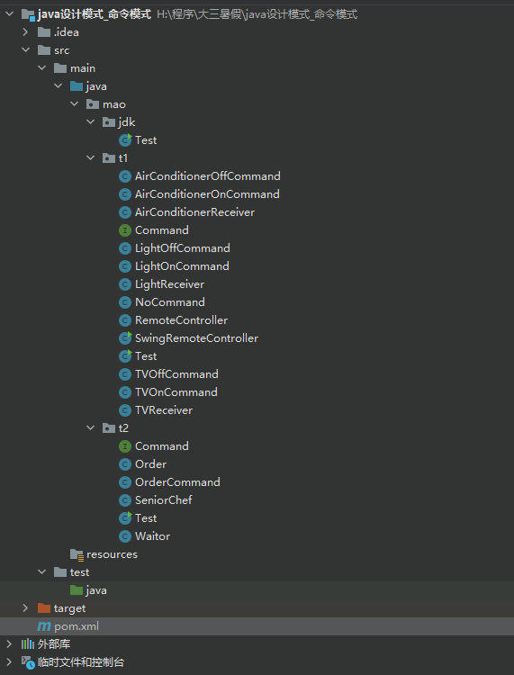


## 责任链模式

### 概念

在现实生活中，常常会出现这样的事例：一个请求有多个对象可以处理，但每个对象的处理条件或权限不同。例如，公司员工请假，可批假的领导有部门负责人、副总经理、总经理等，但每个领导能批准的天数不同，员工必须根据自己要请假的天数去找不同的领导签名，也就是说员工必须记住每个领导的姓名、电话和地址等信息，这增加了难度。这样的例子还有很多，如找领导出差报销、生活中的“击鼓传花”游戏等。


**定义：**

又名职责链模式，为了避免请求发送者与多个请求处理者耦合在一起，将所有请求的处理者通过前一对象记住其下一个对象的引用而连成一条链；当有请求发生时，可将请求沿着这条链传递，直到有对象处理它为止。


### 结构

职责链模式主要包含以下角色:

* 抽象处理者（Handler）角色：定义一个处理请求的接口，包含抽象处理方法和一个后继连接。
* 具体处理者（Concrete Handler）角色：实现抽象处理者的处理方法，判断能否处理本次请求，如果可以处理请求则处理，否则将该请求转给它的后继者。
* 客户类（Client）角色：创建处理链，并向链头的具体处理者对象提交请求，它不关心处理细节和请求的传递过程。


### 示例

**请假流程控制系统**

现需要开发一个请假流程控制系统。请假一天以下的假只需要小组长同意即可；请假1天到3天的假还需要部门经理同意；请求3天到7天还需要总经理同意才行


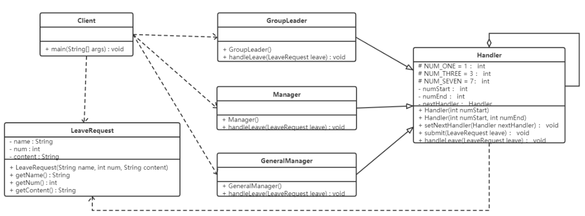


```java
package mao;

/**
 * Project name(项目名称)：java设计模式_责任链模式
 * Package(包名): mao
 * Class(类名): LeaveRequest
 * Author(作者）: mao
 * Author QQ：1296193245
 * GitHub：https://github.com/maomao124/
 * Date(创建日期)： 2022/8/19
 * Time(创建时间)： 20:09
 * Version(版本): 1.0
 * Description(描述)： 无
 */

public class LeaveRequest
{
    //请假人姓名
    private String name;
    //请假天数
    private int num;
    //请假内容
    private String content;

    /**
     * Instantiates a new Leave request.
     *
     * @param name    the name
     * @param num     the num
     * @param content the content
     */
    public LeaveRequest(String name, int num, String content)
    {
        this.name = name;
        this.num = num;
        this.content = content;
    }

    /**
     * Gets name.
     *
     * @return the name
     */
    public String getName()
    {
        return name;
    }

    /**
     * Gets num.
     *
     * @return the num
     */
    public int getNum()
    {
        return num;
    }

    /**
     * Gets content.
     *
     * @return the content
     */
    public String getContent()
    {
        return content;
    }

    @Override
    @SuppressWarnings("all")
    public String toString()
    {
        final StringBuilder stringbuilder = new StringBuilder();
        stringbuilder.append("name：").append(name).append('\n');
        stringbuilder.append("num：").append(num).append('\n');
        stringbuilder.append("content：").append(content).append('\n');
        return stringbuilder.toString();
    }
}
```


```java
package mao;

/**
 * Project name(项目名称)：java设计模式_责任链模式
 * Package(包名): mao
 * Class(类名): Handler
 * Author(作者）: mao
 * Author QQ：1296193245
 * GitHub：https://github.com/maomao124/
 * Date(创建日期)： 2022/8/19
 * Time(创建时间)： 20:11
 * Version(版本): 1.0
 * Description(描述)： 抽象处理者（Handler）角色
 */

public abstract class Handler
{
    protected final static int NUM_ONE = 1;
    protected final static int NUM_THREE = 3;
    protected final static int NUM_SEVEN = 7;

    //该领导处理的请假天数区间
    private int numStart;
    private int numEnd;

    private Handler nextHandler;

    public Handler(int numStart)
    {
        this.numStart = numStart;
    }

    public Handler(int numStart, int numEnd)
    {
        this.numStart = numStart;
        this.numEnd = numEnd;
    }

    /**
     * 设置上级领导
     *
     * @param nextHandler Handler对象
     */
    public void setNextHandler(Handler nextHandler)
    {
        this.nextHandler = nextHandler;
    }

    /**
     * 提交请假条
     *
     * @param leave LeaveRequest对象
     */
    public final void submit(LeaveRequest leave)
    {
        if (this.numStart == 0)
        {
            return;
        }
        if (leave.getNum() >= this.numStart)
        {
            //需要都同意才能通过，假设请假9天，需要小组长、部门经理和总经理都同意才行，并不是只需要总经理同意就行了
            this.handleLeave(leave);
            if (this.nextHandler != null && leave.getNum() > numEnd)
            {
                this.nextHandler.submit(leave);
            }
            else
            {
                System.out.println("流程结束");
            }
        }
    }

    /**
     * 领导处理请假条的方法
     *
     * @param leave LeaveRequest对象
     */
    protected abstract void handleLeave(LeaveRequest leave);
}
```


```java
package mao;

/**
 * Project name(项目名称)：java设计模式_责任链模式
 * Package(包名): mao
 * Class(类名): GroupLeader
 * Author(作者）: mao
 * Author QQ：1296193245
 * GitHub：https://github.com/maomao124/
 * Date(创建日期)： 2022/8/19
 * Time(创建时间)： 20:18
 * Version(版本): 1.0
 * Description(描述)： 无
 */

public class GroupLeader extends Handler
{

    public GroupLeader()
    {
        super(Handler.NUM_ONE, Handler.NUM_THREE);
    }

    @Override
    protected void handleLeave(LeaveRequest leave)
    {
        System.out.println(leave.getName() + "请假" + leave.getNum() + "天,");
        System.out.println("请假内容：" + leave.getContent());
        System.out.println("小组长审批：同意");
    }
}
```


```java
package mao;

/**
 * Project name(项目名称)：java设计模式_责任链模式
 * Package(包名): mao
 * Class(类名): Manager
 * Author(作者）: mao
 * Author QQ：1296193245
 * GitHub：https://github.com/maomao124/
 * Date(创建日期)： 2022/8/19
 * Time(创建时间)： 20:20
 * Version(版本): 1.0
 * Description(描述)： 无
 */

public class Manager extends Handler
{

    public Manager()
    {
        super(Handler.NUM_THREE, Handler.NUM_SEVEN);
    }

    @Override
    protected void handleLeave(LeaveRequest leave)
    {
        System.out.println(leave.getName() + "请假" + leave.getNum() + "天,");
        System.out.println("请假内容：" + leave.getContent());
        System.out.println("部门经理审批：同意");
    }
}
```


```java
package mao;

/**
 * Project name(项目名称)：java设计模式_责任链模式
 * Package(包名): mao
 * Class(类名): GeneralManager
 * Author(作者）: mao
 * Author QQ：1296193245
 * GitHub：https://github.com/maomao124/
 * Date(创建日期)： 2022/8/19
 * Time(创建时间)： 20:21
 * Version(版本): 1.0
 * Description(描述)： 无
 */

public class GeneralManager extends Handler
{

    public GeneralManager()
    {
        super(Handler.NUM_SEVEN);
    }

    @Override
    protected void handleLeave(LeaveRequest leave)
    {
        System.out.println(leave.getName() + "请假" + leave.getNum() + "天,");
        System.out.println("请假内容：" + leave.getContent());
        System.out.println("总经理审批：同意");
    }
}
```


```java
package mao;

/**
 * Project name(项目名称)：java设计模式_责任链模式
 * Package(包名): mao
 * Class(类名): Test
 * Author(作者）: mao
 * Author QQ：1296193245
 * GitHub：https://github.com/maomao124/
 * Date(创建日期)： 2022/8/19
 * Time(创建时间)： 20:23
 * Version(版本): 1.0
 * Description(描述)： 无
 */

public class Test
{
    public static void main(String[] args)
    {
        LeaveRequest leaveRequest = new LeaveRequest("小明", 2, "医院看病");

        GroupLeader groupLeader = new GroupLeader();
        Manager manager = new Manager();
        GeneralManager generalManager = new GeneralManager();

        groupLeader.setNextHandler(manager);
        manager.setNextHandler(generalManager);

        groupLeader.submit(leaveRequest);

        System.out.println("--------------");

        leaveRequest = new LeaveRequest("小红", 4, "车祸");
        groupLeader.submit(leaveRequest);

        System.out.println("--------------");

        leaveRequest = new LeaveRequest("小亮", 9, "结婚");
        groupLeader.submit(leaveRequest);
    }
}
```


运行结果：

```sh
小明请假2天,
请假内容：医院看病
小组长审批：同意
流程结束
--------------
小红请假4天,
请假内容：车祸
小组长审批：同意
小红请假4天,
请假内容：车祸
部门经理审批：同意
流程结束
--------------
小亮请假9天,
请假内容：结婚
小组长审批：同意
小亮请假9天,
请假内容：结婚
部门经理审批：同意
小亮请假9天,
请假内容：结婚
总经理审批：同意
流程结束
```


### 优缺点

**优点：**

* 降低了对象之间的耦合度

  该模式降低了请求发送者和接收者的耦合度。

* 增强了系统的可扩展性

  可以根据需要增加新的请求处理类，满足开闭原则。

* 增强了给对象指派职责的灵活性

  当工作流程发生变化，可以动态地改变链内的成员或者修改它们的次序，也可动态地新增或者删除责任。

* 责任链简化了对象之间的连接

  一个对象只需保持一个指向其后继者的引用，不需保持其他所有处理者的引用，这避免了使用众多的 if 或者 if···else 语句。

* 责任分担

  每个类只需要处理自己该处理的工作，不能处理的传递给下一个对象完成，明确各类的责任范围，符合类的单一职责原则。

**缺点：**

* 不能保证每个请求一定被处理。由于一个请求没有明确的接收者，所以不能保证它一定会被处理，该请求可能一直传到链的末端都得不到处理。
* 对比较长的职责链，请求的处理可能涉及多个处理对象，系统性能将受到一定影响。
* 职责链建立的合理性要靠客户端来保证，增加了客户端的复杂性，可能会由于职责链的错误设置而导致系统出错，如可能会造成循环调用。


循环调用：

```java
package mao;

/**
 * Project name(项目名称)：java设计模式_责任链模式
 * Package(包名): mao
 * Class(类名): Test3
 * Author(作者）: mao
 * Author QQ：1296193245
 * GitHub：https://github.com/maomao124/
 * Date(创建日期)： 2022/8/19
 * Time(创建时间)： 20:39
 * Version(版本): 1.0
 * Description(描述)： 无
 */

public class Test3
{
    public static void main(String[] args)
    {
        LeaveRequest leaveRequest = new LeaveRequest("小明", 9, "医院看病");

        GroupLeader groupLeader = new GroupLeader();
        Manager manager = new Manager();
        GeneralManager generalManager = new GeneralManager();

        groupLeader.setNextHandler(manager);
        manager.setNextHandler(generalManager);
        generalManager.setNextHandler(groupLeader);

        groupLeader.submit(leaveRequest);
    }
}
```


### 源码解析

在javaWeb应用开发中，FilterChain是职责链（过滤器）模式的典型应用


模拟web请求Request以及web响应Response

```java
public interface Request
{
 
}
```


```java
public interface Response
{
 
}
```


```java
package mao.javaweb;

/**
 * Project name(项目名称)：java设计模式_责任链模式
 * Package(包名): mao.javaweb
 * Interface(接口名): Filter
 * Author(作者）: mao
 * Author QQ：1296193245
 * GitHub：https://github.com/maomao124/
 * Date(创建日期)： 2022/8/19
 * Time(创建时间)： 20:48
 * Version(版本): 1.0
 * Description(描述)： 无
 */

public interface Filter
{
    void doFilter(Request request,Response response,FilterChain c);
}
```


```java
package mao.javaweb;

/**
 * Project name(项目名称)：java设计模式_责任链模式
 * Package(包名): mao.javaweb
 * Class(类名): FirstFilter
 * Author(作者）: mao
 * Author QQ：1296193245
 * GitHub：https://github.com/maomao124/
 * Date(创建日期)： 2022/8/19
 * Time(创建时间)： 20:51
 * Version(版本): 1.0
 * Description(描述)： 无
 */

public class FirstFilter implements Filter
{

    @Override
    public void doFilter(Request request, Response response, FilterChain c)
    {
        System.out.println("过滤器1 前置处理");
        c.doFilter(request, response);
        System.out.println("过滤器1 后置处理");
    }
}
```


```java
package mao.javaweb;

/**
 * Project name(项目名称)：java设计模式_责任链模式
 * Package(包名): mao.javaweb
 * Class(类名): SecondFilter
 * Author(作者）: mao
 * Author QQ：1296193245
 * GitHub：https://github.com/maomao124/
 * Date(创建日期)： 2022/8/19
 * Time(创建时间)： 20:55
 * Version(版本): 1.0
 * Description(描述)： 无
 */

public class SecondFilter implements Filter
{

    @Override
    public void doFilter(Request request, Response response, FilterChain c)
    {
        System.out.println("过滤器2 前置处理");
        c.doFilter(request,response);
        System.out.println("过滤器2 后置处理");
    }
}
```


```java
package mao.javaweb;

/**
 * Project name(项目名称)：java设计模式_责任链模式
 * Package(包名): mao.javaweb
 * Class(类名): ThirdFilter
 * Author(作者）: mao
 * Author QQ：1296193245
 * GitHub：https://github.com/maomao124/
 * Date(创建日期)： 2022/8/19
 * Time(创建时间)： 20:56
 * Version(版本): 1.0
 * Description(描述)： 无
 */

public class ThirdFilter implements Filter
{

    @Override
    public void doFilter(Request request, Response response, FilterChain c)
    {
        System.out.println("过滤器3 前置处理");
        c.doFilter(request,response);
        System.out.println("过滤器3 后置处理");
    }
}
```


```java
package mao.javaweb;

import java.util.ArrayList;
import java.util.List;

/**
 * Project name(项目名称)：java设计模式_责任链模式
 * Package(包名): mao.javaweb
 * Class(类名): FilterChain
 * Author(作者）: mao
 * Author QQ：1296193245
 * GitHub：https://github.com/maomao124/
 * Date(创建日期)： 2022/8/19
 * Time(创建时间)： 20:49
 * Version(版本): 1.0
 * Description(描述)： 过滤器链
 */

public class FilterChain
{
    private int index = 0;
    private final List<Filter> filters = new ArrayList<>();

    public FilterChain addFilter(Filter filter)
    {
        this.filters.add(filter);
        return this;
    }

    public void doFilter(Request request, Response response)
    {
        if (index == filters.size())
        {
            return;
        }
        Filter filter = filters.get(index);
        index++;
        filter.doFilter(request, response, this);
    }
}
```


```java
package mao.javaweb;

/**
 * Project name(项目名称)：java设计模式_责任链模式
 * Package(包名): mao.javaweb
 * Class(类名): Test
 * Author(作者）: mao
 * Author QQ：1296193245
 * GitHub：https://github.com/maomao124/
 * Date(创建日期)： 2022/8/19
 * Time(创建时间)： 20:57
 * Version(版本): 1.0
 * Description(描述)： 无
 */

public class Test
{
    public static void main(String[] args)
    {
        Request request = null;
        Response response = null;

        FilterChain filterChain = new FilterChain();
        filterChain.addFilter(new FirstFilter())
                .addFilter(new SecondFilter())
                .addFilter(new ThirdFilter());

        filterChain.doFilter(request, response);
    }
}
```


运行结果：

```sh
过滤器1 前置处理
过滤器2 前置处理
过滤器3 前置处理
过滤器3 后置处理
过滤器2 后置处理
过滤器1 后置处理
```


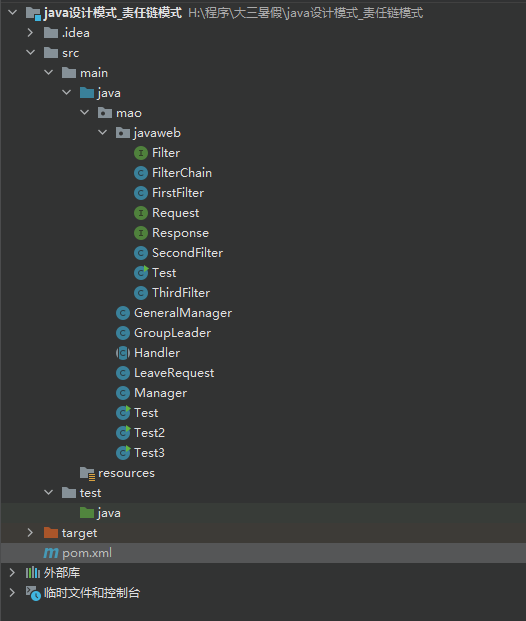


## 状态模式

### 概念

对有状态的对象，把复杂的“判断逻辑”提取到不同的状态对象中，允许状态对象在其内部状态发生改变时改变其行为。


### 结构

状态模式包含以下主要角色。

* 环境（Context）角色：也称为上下文，它定义了客户程序需要的接口，维护一个当前状态，并将与状态相关的操作委托给当前状态对象来处理。
* 抽象状态（State）角色：定义一个接口，用以封装环境对象中的特定状态所对应的行为。
* 具体状态（Concrete  State）角色：实现抽象状态所对应的行为。


### 示例

**电梯控制**

通过按钮来控制一个电梯的状态，一个电梯有开门状态，关门状态，停止状态，运行状态。每一种状态改变，都有可能要根据其他状态来更新处理。例如，如果电梯门现在处于运行时状态，就不能进行开门操作，而如果电梯门是停止状态，就可以执行开门操作


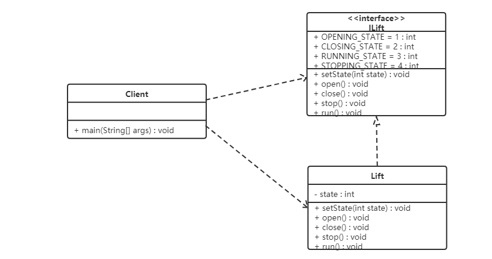


```java
package mao.before;

/**
 * Project name(项目名称)：java设计模式_状态模式
 * Package(包名): mao.before
 * Interface(接口名): ILift
 * Author(作者）: mao
 * Author QQ：1296193245
 * GitHub：https://github.com/maomao124/
 * Date(创建日期)： 2022/8/20
 * Time(创建时间)： 19:22
 * Version(版本): 1.0
 * Description(描述)： 无
 */

public interface ILift
{
    //开门状态
    public final static int OPENING_STATE = 1;
    //关门状态
    public final static int CLOSING_STATE = 2;
    //运行状态
    public final static int RUNNING_STATE = 3;
    //停止状态
    public final static int STOPPING_STATE = 4;

    /**
     * 设置电梯的状态
     *
     * @param state 状态数字
     */
    void setState(int state);

    /**
     * 获取状态
     *
     * @return 状态数字
     */
    int getState();

    /**
     * 获得对应的状态字符串
     *
     * @param state 状态数字
     * @return 字符串
     */
    String getStateString(int state);

    /**
     * 开门
     */
    void open();

    /**
     * 关门
     */
    void close();

    /**
     * 电梯运行
     */
    void run();

    /**
     * 电梯停止
     */
    void stop();
}
```


```java
package mao.before;

/**
 * Project name(项目名称)：java设计模式_状态模式
 * Package(包名): mao.before
 * Class(类名): Lift
 * Author(作者）: mao
 * Author QQ：1296193245
 * GitHub：https://github.com/maomao124/
 * Date(创建日期)： 2022/8/20
 * Time(创建时间)： 19:24
 * Version(版本): 1.0
 * Description(描述)： 无
 */

public class Lift implements ILift
{

    private int state;

    @Override
    public void setState(int state)
    {
        String beforeState = getStateString(this.state);
        String afterState = getStateString(state);
        this.state = state;
        System.out.println("电梯由" + beforeState + "更改为" + afterState);
    }

    @Override
    public int getState()
    {
        return state;
    }

    /**
     * 获得对应的状态字符串
     *
     * @param state 状态数字
     * @return 字符串
     */
    @Override
    public String getStateString(int state)
    {
        if (state == OPENING_STATE)
        {
            return "打开状态";
        }
        else if (state == CLOSING_STATE)
        {
            return "关闭状态";
        }
        else if (state == RUNNING_STATE)
        {
            return "运行状态";
        }
        else if (state == STOPPING_STATE)
        {
            return "停止状态";
        }
        else
        {
            return "未知状态";
        }
    }

    @Override
    public void open()
    {
        if (this.state == OPENING_STATE)
        {
            //当前为打开电梯状态
        }
        else if (this.state == CLOSING_STATE)
        {
            //当前为关闭电梯状态
            this.setState(OPENING_STATE);
        }
        else if (this.state == RUNNING_STATE)
        {
            //当前为运行电梯状态
            //运行状态禁止开门
        }
        else if (this.state == STOPPING_STATE)
        {
            //当前为电梯停止状态
            this.setState(OPENING_STATE);
        }
        else
        {
            throw new RuntimeException("电梯程序运行异常");
        }
    }

    @Override
    public void close()
    {
        if (this.state == OPENING_STATE)
        {
            //当前为打开电梯状态
            this.setState(CLOSING_STATE);
        }
        else if (this.state == CLOSING_STATE)
        {
            //当前为关闭电梯状态
        }
        else if (this.state == RUNNING_STATE)
        {
            //当前为运行电梯状态
        }
        else if (this.state == STOPPING_STATE)
        {
            //当前为电梯停止状态
            this.setState(CLOSING_STATE);
        }
        else
        {
            throw new RuntimeException("电梯程序运行异常");
        }
    }

    @Override
    public void run()
    {
        if (this.state == OPENING_STATE)
        {
            //当前为打开电梯状态
        }
        else if (this.state == CLOSING_STATE)
        {
            //当前为关闭电梯状态
            this.setState(RUNNING_STATE);
        }
        else if (this.state == RUNNING_STATE)
        {
            //当前为运行电梯状态
        }
        else if (this.state == STOPPING_STATE)
        {
            //当前为电梯停止状态
            this.setState(RUNNING_STATE);
        }
        else
        {
            throw new RuntimeException("电梯程序运行异常");
        }
    }

    @Override
    public void stop()
    {
        if (this.state == OPENING_STATE)
        {
            //当前为打开电梯状态
        }
        else if (this.state == CLOSING_STATE)
        {
            //当前为关闭电梯状态
        }
        else if (this.state == RUNNING_STATE)
        {
            //当前为运行电梯状态
            this.setState(STOPPING_STATE);
        }
        else if (this.state == STOPPING_STATE)
        {
            //当前为电梯停止状态
        }
        else
        {
            throw new RuntimeException("电梯程序运行异常");
        }
    }
}
```


```java
package mao.before;

/**
 * Project name(项目名称)：java设计模式_状态模式
 * Package(包名): mao.before
 * Class(类名): Test
 * Author(作者）: mao
 * Author QQ：1296193245
 * GitHub：https://github.com/maomao124/
 * Date(创建日期)： 2022/8/20
 * Time(创建时间)： 19:52
 * Version(版本): 1.0
 * Description(描述)： 无
 */

public class Test
{
    public static void main(String[] args)
    {
        ILift lift = new Lift();

        lift.setState(ILift.RUNNING_STATE);

        lift.run();
        lift.close();
        lift.open();
        lift.stop();
        lift.open();
        lift.run();
        lift.stop();
        lift.close();
    }
}
```


运行结果：

```sh
电梯由未知状态更改为运行状态
电梯由运行状态更改为停止状态
电梯由停止状态更改为打开状态
电梯由打开状态更改为关闭状态
```


swing界面：

```java
package mao.before;

import javax.swing.*;
import java.awt.*;
import java.awt.event.ActionEvent;
import java.awt.event.ActionListener;
import java.awt.event.WindowAdapter;
import java.awt.event.WindowEvent;

/**
 * Project name(项目名称)：java设计模式_状态模式
 * Package(包名): mao.before
 * Class(类名): SwingTest
 * Author(作者）: mao
 * Author QQ：1296193245
 * GitHub：https://github.com/maomao124/
 * Date(创建日期)： 2022/8/20
 * Time(创建时间)： 19:56
 * Version(版本): 1.0
 * Description(描述)： 无
 */

public class SwingTest
{
    private JButton openButton;
    private JButton closeButton;

    private JButton runButton;
    private JButton stopButton;

    private JTextField state;

    private ILift lift;

    public SwingTest()
    {
        //初始化顶层面板
        JFrame jFrame = new JFrame("电梯系统");
        jFrame.setSize(540, 720);
        //获取屏幕宽度
        int screenWidth = Toolkit.getDefaultToolkit().getScreenSize().width;
        //获取屏幕高度
        int screenHeight = Toolkit.getDefaultToolkit().getScreenSize().height;
        //位于屏幕中央
        jFrame.setLocation(screenWidth / 2 - jFrame.getWidth() / 2, screenHeight / 2 - jFrame.getHeight() / 2);
        jFrame.setDefaultCloseOperation(WindowConstants.DO_NOTHING_ON_CLOSE);

        //注册虚拟机关闭挂钩
        addShutdownHook();

        //初始化按钮
        initButton();

        //个性化
        setPersonalise();

        //初始化电梯对象
        initILeft();

        //设置布局
        setLayout(jFrame);

        //设置关闭的监听器
        setCloseListener(jFrame);

        //给按钮添加监听器
        setButtonListener();


        jFrame.setVisible(true);

    }

    /**
     * 给按钮添加监听器
     */
    private void setButtonListener()
    {
        openButton.addActionListener(new ActionListener()
        {
            @Override
            public void actionPerformed(ActionEvent e)
            {
                lift.open();
                state.setText(lift.getStateString(lift.getState()));
            }
        });

        closeButton.addActionListener(new ActionListener()
        {
            @Override
            public void actionPerformed(ActionEvent e)
            {
                lift.close();
                state.setText(lift.getStateString(lift.getState()));
            }
        });

        runButton.addActionListener(new ActionListener()
        {
            @Override
            public void actionPerformed(ActionEvent e)
            {
                lift.run();
                state.setText(lift.getStateString(lift.getState()));
            }
        });

        stopButton.addActionListener(new ActionListener()
        {
            @Override
            public void actionPerformed(ActionEvent e)
            {
                lift.stop();
                state.setText(lift.getStateString(lift.getState()));
            }
        });
    }

    /**
     * 初始化遥控器对象
     */
    private void initILeft()
    {
        this.lift = new Lift();
        lift.setState(ILift.STOPPING_STATE);
    }

    /**
     * 设个性化
     */
    private void setPersonalise()
    {
        Font font = new Font("宋体", Font.BOLD, 32);
        //字体设置
        openButton.setFont(font);
        closeButton.setFont(font);
        runButton.setFont(font);
        stopButton.setFont(font);

        //颜色设置
        openButton.setForeground(Color.green);
        closeButton.setForeground(new Color(50, 200, 0));
        runButton.setForeground(Color.green);
        stopButton.setForeground(new Color(50, 200, 0));

        //设置背景
        openButton.setBackground(new Color(20, 50, 130));
        closeButton.setBackground(new Color(20, 50, 130));
        runButton.setBackground(new Color(20, 50, 130));
        stopButton.setBackground(new Color(20, 50, 130));

        state.setFont(font);
        state.setForeground(Color.cyan);
        state.setBackground(new Color(20, 30, 100));
        state.setHorizontalAlignment(JTextField.CENTER);
        state.setEditable(false);
    }

    /**
     * 设置布局
     *
     * @param jFrame JFrame
     */
    private void setLayout(JFrame jFrame)
    {
        JPanel jPanel = new JPanel();
        jPanel.setLayout(new GridLayout(3, 1));
        jPanel.add(state);
        {
            JPanel jPanel1 = new JPanel();
            jPanel1.setLayout(new GridLayout(1, 2));
            jPanel1.add(openButton);
            jPanel1.add(closeButton);
            jPanel.add(jPanel1);
        }

        {
            JPanel jPanel1 = new JPanel();
            jPanel1.setLayout(new GridLayout(1, 2));
            jPanel1.add(runButton);
            jPanel1.add(stopButton);
            jPanel.add(jPanel1);
        }


        jFrame.add(jPanel);
    }

    /**
     * 初始化按钮
     */
    private void initButton()
    {
        openButton = new JButton("打开电梯门");
        closeButton = new JButton("关闭电梯门");
        runButton = new JButton("运行");
        stopButton = new JButton("停止");
        state = new JTextField("停止状态");
    }

    /**
     * 设置关闭的监听器
     *
     * @param jFrame JFrame
     */
    private void setCloseListener(JFrame jFrame)
    {
        jFrame.addWindowListener(new WindowAdapter()
        {
            @Override
            public void windowClosing(WindowEvent e)
            {
                Toolkit.getDefaultToolkit().beep();
                int result = JOptionPane.showConfirmDialog(null, "是否退出？", "退出提示", JOptionPane.OK_CANCEL_OPTION);
                if (result == 0)
                {
                    System.exit(0);
                }
            }
        });
    }

    /**
     * 注册虚拟机关闭挂钩
     */
    private void addShutdownHook()
    {
        Runtime runtime = Runtime.getRuntime();
        runtime.addShutdownHook(new Thread(new Runnable()
        {
            @Override
            public void run()
            {
                System.out.println("程序退出");
            }
        }));
    }


    public static void main(String[] args)
    {
        new SwingTest();
    }
}
```


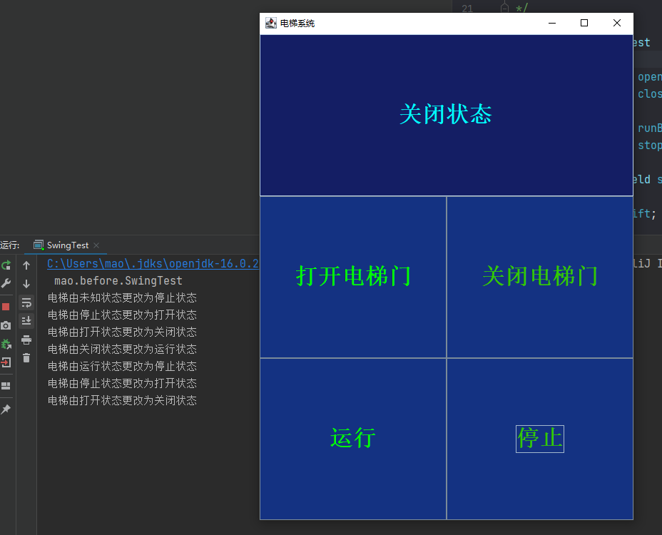


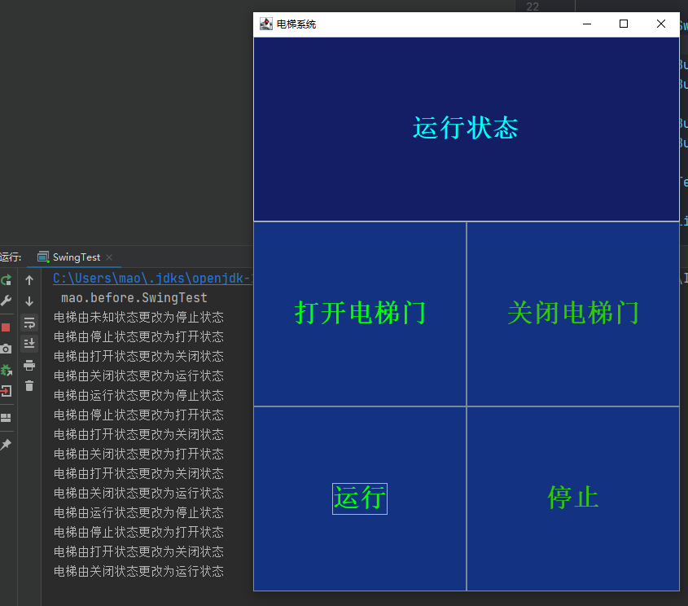


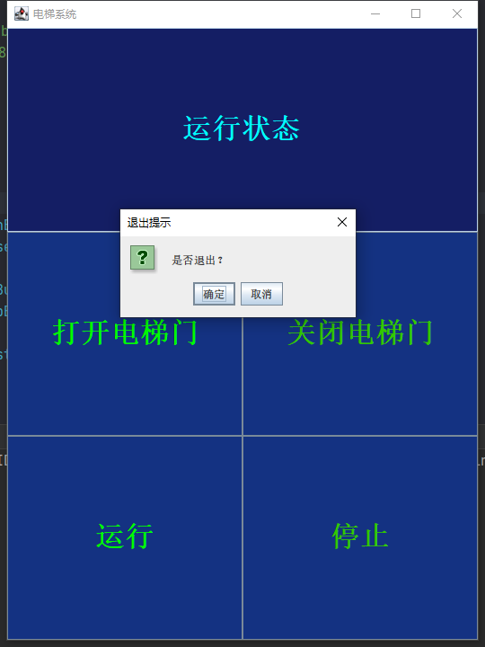


问题分析：

* 使用了大量的条件的判断，使程序的可阅读性变差。
* 扩展性很差。如果新加了断电的状态，我们需要修改上面判断逻辑


**改进：**


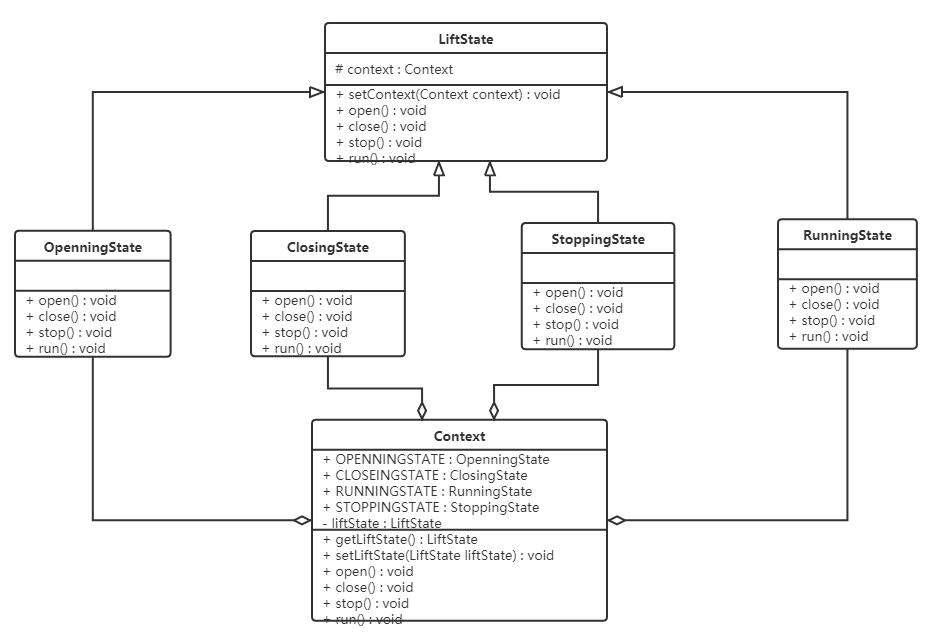


```java
package mao.after;

/**
 * Project name(项目名称)：java设计模式_状态模式
 * Package(包名): mao.after
 * Class(类名): LiftState
 * Author(作者）: mao
 * Author QQ：1296193245
 * GitHub：https://github.com/maomao124/
 * Date(创建日期)： 2022/8/20
 * Time(创建时间)： 20:32
 * Version(版本): 1.0
 * Description(描述)： 无
 */

public abstract class LiftState
{
    protected Context context;

    public void setContext(Context context)
    {
        this.context = context;
    }


    /**
     * 电梯开门动作
     */
    public abstract void open();


    /**
     * 电梯关门动作
     */
    public abstract void close();


    /**
     * 电梯运行动作
     */
    public abstract void run();


    /**
     * 电梯停止动作
     */
    public abstract void stop();
}
```


```java
package mao.after;

/**
 * Project name(项目名称)：java设计模式_状态模式
 * Package(包名): mao.after
 * Class(类名): OpenningState
 * Author(作者）: mao
 * Author QQ：1296193245
 * GitHub：https://github.com/maomao124/
 * Date(创建日期)： 2022/8/20
 * Time(创建时间)： 20:34
 * Version(版本): 1.0
 * Description(描述)： 无
 */

public class OpenningState extends LiftState
{

    @Override
    public void open()
    {

    }

    @Override
    public void close()
    {
        context.setLiftState(Context.closingState);
        System.out.println("电梯门关闭");
        context.stateString = "关闭状态";
    }

    @Override
    public void run()
    {

    }

    @Override
    public void stop()
    {

    }
}
```


```java
package mao.after;

/**
 * Project name(项目名称)：java设计模式_状态模式
 * Package(包名): mao.after
 * Class(类名): ClosingState
 * Author(作者）: mao
 * Author QQ：1296193245
 * GitHub：https://github.com/maomao124/
 * Date(创建日期)： 2022/8/20
 * Time(创建时间)： 20:34
 * Version(版本): 1.0
 * Description(描述)： 无
 */

public class ClosingState extends LiftState
{

    @Override
    public void open()
    {
        context.setLiftState(Context.openningState);
        System.out.println("电梯门打开");
        context.stateString = "打开状态";
    }

    @Override
    public void close()
    {

    }

    @Override
    public void run()
    {
        context.setLiftState(Context.runningState);
        System.out.println("电梯运行");
        context.stateString = "运行状态";
    }

    @Override
    public void stop()
    {

    }
}
```


```java
package mao.after;

/**
 * Project name(项目名称)：java设计模式_状态模式
 * Package(包名): mao.after
 * Class(类名): RunningState
 * Author(作者）: mao
 * Author QQ：1296193245
 * GitHub：https://github.com/maomao124/
 * Date(创建日期)： 2022/8/20
 * Time(创建时间)： 20:35
 * Version(版本): 1.0
 * Description(描述)： 无
 */

public class RunningState extends LiftState
{

    @Override
    public void open()
    {

    }

    @Override
    public void close()
    {

    }

    @Override
    public void run()
    {

    }

    @Override
    public void stop()
    {
        context.setLiftState(Context.stoppingState);
        System.out.println("电梯停止");
        context.stateString = "停止状态";
    }
}
```


```java
package mao.after;

/**
 * Project name(项目名称)：java设计模式_状态模式
 * Package(包名): mao.after
 * Class(类名): StoppingState
 * Author(作者）: mao
 * Author QQ：1296193245
 * GitHub：https://github.com/maomao124/
 * Date(创建日期)： 2022/8/20
 * Time(创建时间)： 20:35
 * Version(版本): 1.0
 * Description(描述)： 无
 */

public class StoppingState extends LiftState
{

    @Override
    public void open()
    {
        context.setLiftState(Context.openningState);
        System.out.println("电梯门打开");
        context.stateString = "打开状态";
    }

    @Override
    public void close()
    {
        context.setLiftState(Context.closingState);
        System.out.println("电梯门关闭");
        context.stateString = "关闭状态";
    }

    @Override
    public void run()
    {
        context.setLiftState(Context.runningState);
        System.out.println("电梯运行");
        context.stateString = "运行状态";
    }

    @Override
    public void stop()
    {

    }
}
```


```java
package mao.after;

/**
 * Project name(项目名称)：java设计模式_状态模式
 * Package(包名): mao.after
 * Class(类名): Context
 * Author(作者）: mao
 * Author QQ：1296193245
 * GitHub：https://github.com/maomao124/
 * Date(创建日期)： 2022/8/20
 * Time(创建时间)： 20:35
 * Version(版本): 1.0
 * Description(描述)： 无
 */

public class Context
{
    //定义出所有的电梯状态
    public final static OpenningState openningState;
    public final static ClosingState closingState;
    public final static RunningState runningState;
    public final static StoppingState stoppingState;

    public String stateString = "未知状态";

    static
    {
        openningState = new OpenningState();//开门状态，这时候电梯只能关闭
        closingState = new ClosingState();//关闭状态，这时候电梯可以运行和开门
        runningState = new RunningState();//运行状态，这时候电梯只能停止
        stoppingState = new StoppingState();//停止状态，这时候电梯可以开门、运行
    }

    //定义一个当前电梯状态
    private LiftState liftState;

    public LiftState getLiftState()
    {
        return this.liftState;
    }

    public void setLiftState(LiftState liftState)
    {
        //当前环境改变
        this.liftState = liftState;
        //把当前的环境通知到各个实现类中
        this.liftState.setContext(this);
    }

    public void open()
    {
        this.liftState.open();
    }

    public void close()
    {
        this.liftState.close();
    }

    public void run()
    {
        this.liftState.run();
    }

    public void stop()
    {
        this.liftState.stop();
    }
}
```


```java
package mao.after;

/**
 * Project name(项目名称)：java设计模式_状态模式
 * Package(包名): mao.after
 * Class(类名): Test
 * Author(作者）: mao
 * Author QQ：1296193245
 * GitHub：https://github.com/maomao124/
 * Date(创建日期)： 2022/8/20
 * Time(创建时间)： 21:01
 * Version(版本): 1.0
 * Description(描述)： 无
 */

public class Test
{
    public static void main(String[] args)
    {
        Context context = new Context();
        context.setLiftState(Context.stoppingState);

        context.open();
        context.close();
        context.run();
        context.stop();
        context.close();
        context.run();
        context.open();
    }
}
```


运行结果：

```sh
电梯门打开
电梯门关闭
电梯运行
电梯停止
电梯门关闭
电梯运行
```


swing界面：


```java
package mao.after;

import javax.swing.*;
import java.awt.*;
import java.awt.event.ActionEvent;
import java.awt.event.ActionListener;
import java.awt.event.WindowAdapter;
import java.awt.event.WindowEvent;

/**
 * Project name(项目名称)：java设计模式_状态模式
 * Package(包名): mao.after
 * Class(类名): SwingTest
 * Author(作者）: mao
 * Author QQ：1296193245
 * GitHub：https://github.com/maomao124/
 * Date(创建日期)： 2022/8/20
 * Time(创建时间)： 21:08
 * Version(版本): 1.0
 * Description(描述)： 无
 */

public class SwingTest
{
    private JButton openButton;
    private JButton closeButton;

    private JButton runButton;
    private JButton stopButton;

    private JTextField state;

    private Context context;

    public SwingTest()
    {
        //初始化顶层面板
        JFrame jFrame = new JFrame("电梯系统");
        jFrame.setSize(540, 720);
        //获取屏幕宽度
        int screenWidth = Toolkit.getDefaultToolkit().getScreenSize().width;
        //获取屏幕高度
        int screenHeight = Toolkit.getDefaultToolkit().getScreenSize().height;
        //位于屏幕中央
        jFrame.setLocation(screenWidth / 2 - jFrame.getWidth() / 2, screenHeight / 2 - jFrame.getHeight() / 2);
        jFrame.setDefaultCloseOperation(WindowConstants.DO_NOTHING_ON_CLOSE);

        //注册虚拟机关闭挂钩
        addShutdownHook();

        //初始化按钮
        initButton();

        //个性化
        setPersonalise();

        //初始化电梯对象
        initContext();

        //设置布局
        setLayout(jFrame);

        //设置关闭的监听器
        setCloseListener(jFrame);

        //给按钮添加监听器
        setButtonListener();


        jFrame.setVisible(true);

    }

    /**
     * 给按钮添加监听器
     */
    private void setButtonListener()
    {
        openButton.addActionListener(new ActionListener()
        {
            @Override
            public void actionPerformed(ActionEvent e)
            {
                context.open();
                state.setText(context.stateString);
            }
        });

        closeButton.addActionListener(new ActionListener()
        {
            @Override
            public void actionPerformed(ActionEvent e)
            {
                context.close();
                state.setText(context.stateString);
            }
        });

        runButton.addActionListener(new ActionListener()
        {
            @Override
            public void actionPerformed(ActionEvent e)
            {
                context.run();
                state.setText(context.stateString);
            }
        });

        stopButton.addActionListener(new ActionListener()
        {
            @Override
            public void actionPerformed(ActionEvent e)
            {
                context.stop();
                state.setText(context.stateString);
            }
        });
    }

    /**
     * 初始化对象
     */
    private void initContext()
    {
        this.context = new Context();
        context.setLiftState(Context.stoppingState);
    }

    /**
     * 设个性化
     */
    private void setPersonalise()
    {
        Font font = new Font("宋体", Font.BOLD, 32);
        //字体设置
        openButton.setFont(font);
        closeButton.setFont(font);
        runButton.setFont(font);
        stopButton.setFont(font);

        //颜色设置
        openButton.setForeground(Color.green);
        closeButton.setForeground(new Color(50, 200, 0));
        runButton.setForeground(Color.green);
        stopButton.setForeground(new Color(50, 200, 0));

        //设置背景
        openButton.setBackground(new Color(20, 50, 130));
        closeButton.setBackground(new Color(20, 50, 130));
        runButton.setBackground(new Color(20, 50, 130));
        stopButton.setBackground(new Color(20, 50, 130));

        state.setFont(new Font("宋体", Font.BOLD, 48));
        state.setForeground(Color.cyan);
        state.setBackground(new Color(20, 30, 100));
        state.setHorizontalAlignment(JTextField.CENTER);
        state.setEditable(false);
    }

    /**
     * 设置布局
     *
     * @param jFrame JFrame
     */
    private void setLayout(JFrame jFrame)
    {
        JPanel jPanel = new JPanel();
        jPanel.setLayout(new GridLayout(3, 1));
        jPanel.add(state);
        {
            JPanel jPanel1 = new JPanel();
            jPanel1.setLayout(new GridLayout(1, 2));
            jPanel1.add(openButton);
            jPanel1.add(closeButton);
            jPanel.add(jPanel1);
        }

        {
            JPanel jPanel1 = new JPanel();
            jPanel1.setLayout(new GridLayout(1, 2));
            jPanel1.add(runButton);
            jPanel1.add(stopButton);
            jPanel.add(jPanel1);
        }


        jFrame.add(jPanel);
    }

    /**
     * 初始化按钮
     */
    private void initButton()
    {
        openButton = new JButton("打开电梯门");
        closeButton = new JButton("关闭电梯门");
        runButton = new JButton("运行");
        stopButton = new JButton("停止");
        state = new JTextField("停止状态");
    }

    /**
     * 设置关闭的监听器
     *
     * @param jFrame JFrame
     */
    private void setCloseListener(JFrame jFrame)
    {
        jFrame.addWindowListener(new WindowAdapter()
        {
            @Override
            public void windowClosing(WindowEvent e)
            {
                Toolkit.getDefaultToolkit().beep();
                int result = JOptionPane.showConfirmDialog(null, "是否退出？", "退出提示", JOptionPane.OK_CANCEL_OPTION);
                if (result == 0)
                {
                    System.exit(0);
                }
            }
        });
    }

    /**
     * 注册虚拟机关闭挂钩
     */
    private void addShutdownHook()
    {
        Runtime runtime = Runtime.getRuntime();
        runtime.addShutdownHook(new Thread(new Runnable()
        {
            @Override
            public void run()
            {
                System.out.println("程序退出");
            }
        }));
    }


    public static void main(String[] args)
    {
        new SwingTest();
    }
}
```


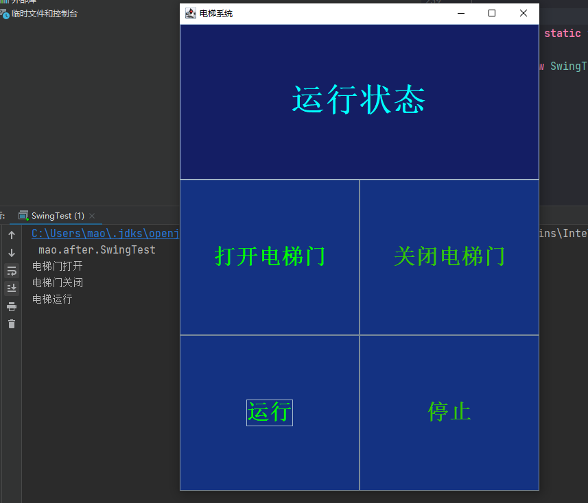


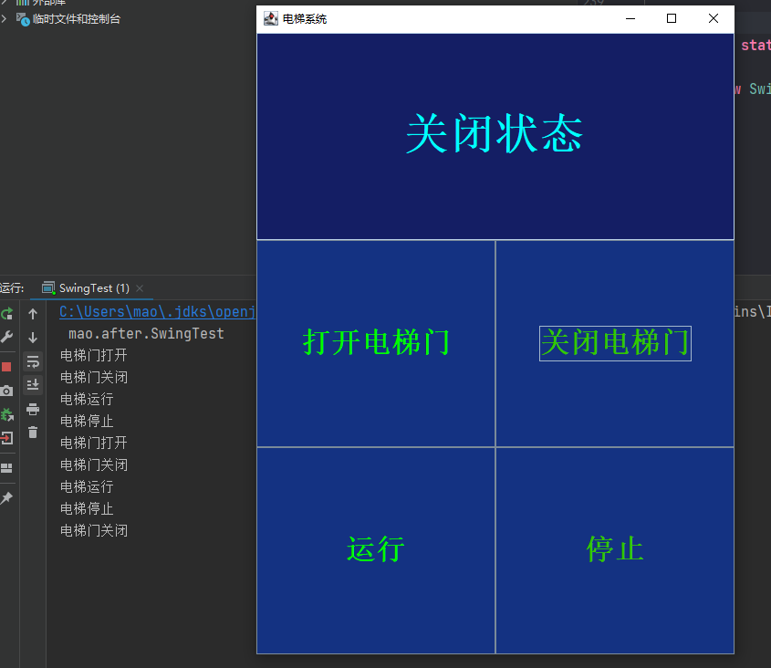


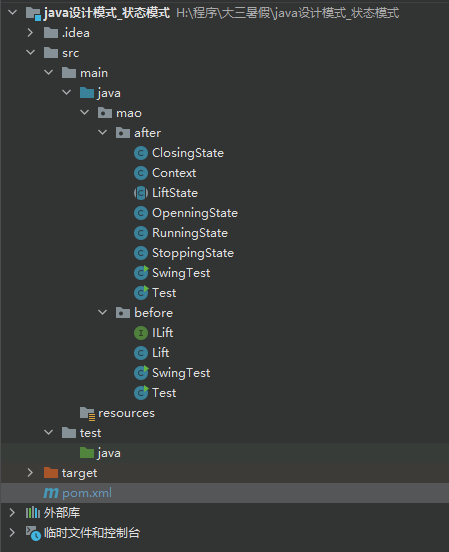


### 优缺点

**优点：**

* 将所有与某个状态有关的行为放到一个类中，并且可以方便地增加新的状态，只需要改变对象状态即可改变对象的行为。
* 允许状态转换逻辑与状态对象合成一体，而不是某一个巨大的条件语句块。

**缺点：**

* 状态模式的使用必然会增加系统类和对象的个数。 
* 状态模式的结构与实现都较为复杂，如果使用不当将导致程序结构和代码的混乱。
* 状态模式对"开闭原则"的支持并不太好。


### 使用场景

- 当一个对象的行为取决于它的状态，并且它必须在运行时根据状态改变它的行为时，就可以考虑使用状态模式。
- 一个操作中含有庞大的分支结构，并且这些分支决定于对象的状态时。


## 观察者模式

### 概念

观察者模式又被称为发布-订阅（Publish/Subscribe）模式，它定义了一种一对多的依赖关系，让多个观察者对象同时监听某一个主题对象。这个主题对象在状态变化时，会通知所有的观察者对象，使他们能够自动更新自己。


### 结构

在观察者模式中有如下角色：

* Subject：抽象主题（抽象被观察者），抽象主题角色把所有观察者对象保存在一个集合里，每个主题都可以有任意数量的观察者，抽象主题提供一个接口，可以增加和删除观察者对象。
* ConcreteSubject：具体主题（具体被观察者），该角色将有关状态存入具体观察者对象，在具体主题的内部状态发生改变时，给所有注册过的观察者发送通知。
* Observer：抽象观察者，是观察者的抽象类，它定义了一个更新接口，使得在得到主题更改通知时更新自己。
* ConcrereObserver：具体观察者，实现抽象观察者定义的更新接口，以便在得到主题更改通知时更新自身的状态。


### 示例

**微信公众号**

在使用微信公众号时，大家都会有这样的体验，当你关注的公众号中有新内容更新的话，它就会推送给关注公众号的微信用户端。我们使用观察者模式来模拟这样的场景，微信用户就是观察者，微信公众号是被观察者，有多个的微信用户关注了程序猿这个公众号


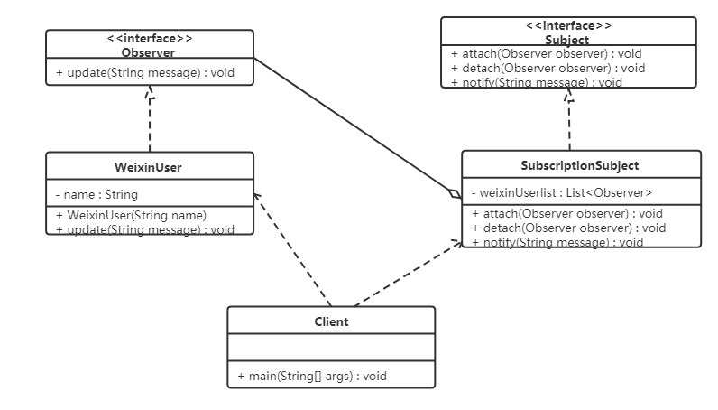


```java
package mao.t1;

/**
 * Project name(项目名称)：java设计模式_观察者模式
 * Package(包名): mao.t1
 * Interface(接口名): Observer
 * Author(作者）: mao
 * Author QQ：1296193245
 * GitHub：https://github.com/maomao124/
 * Date(创建日期)： 2022/8/21
 * Time(创建时间)： 13:10
 * Version(版本): 1.0
 * Description(描述)： 观察者类
 */

public interface Observer
{
    /**
     * 更新方法
     *
     * @param message     消息
     * @param subjectName 主题名称，这里主要指公众号的名称
     */
    void update(String message, String subjectName);
}
```


```java
package mao.t1;

/**
 * Project name(项目名称)：java设计模式_观察者模式
 * Package(包名): mao.t1
 * Class(类名): WechatUser
 * Author(作者）: mao
 * Author QQ：1296193245
 * GitHub：https://github.com/maomao124/
 * Date(创建日期)： 2022/8/21
 * Time(创建时间)： 13:12
 * Version(版本): 1.0
 * Description(描述)： 微信用户，具体观察者类
 */

public class WechatUser implements Observer
{
    //微信用户名
    private final String name;

    public WechatUser(String name)
    {
        this.name = name;
    }

    public String getName()
    {
        return name;
    }

    @Override
    public void update(String message, String subjectName)
    {
        System.out.println("微信用户" + name + "接收到" + subjectName + "公众号的消息：" + message);
    }

}
```


```java
package mao.t1;

/**
 * Project name(项目名称)：java设计模式_观察者模式
 * Package(包名): mao.t1
 * Interface(接口名): Subject
 * Author(作者）: mao
 * Author QQ：1296193245
 * GitHub：https://github.com/maomao124/
 * Date(创建日期)： 2022/8/21
 * Time(创建时间)： 13:15
 * Version(版本): 1.0
 * Description(描述)： 抽象主题类
 */

public interface Subject
{

    /**
     * 添加订阅者
     *
     * @param observer Observer
     */
    void attach(Observer observer);

    /**
     * 删除订阅者
     *
     * @param observer Observer
     */
    void detach(Observer observer);

    /**
     * 通知或者发送消息给订阅者
     *
     * @param message String
     */
    void notify(String message);
}
```


```java
package mao.t1;

import java.util.ArrayList;
import java.util.List;

/**
 * Project name(项目名称)：java设计模式_观察者模式
 * Package(包名): mao.t1
 * Class(类名): SubscriptionSubject
 * Author(作者）: mao
 * Author QQ：1296193245
 * GitHub：https://github.com/maomao124/
 * Date(创建日期)： 2022/8/21
 * Time(创建时间)： 13:17
 * Version(版本): 1.0
 * Description(描述)： 具体主题（具体被观察者）
 */

public class SubscriptionSubject implements Subject
{
    //公众号的名称
    private final String name;

    private final List<Observer> userList;

    public SubscriptionSubject(String name)
    {
        this.name = name;
        userList = new ArrayList<>();
    }

    @Override
    public void attach(Observer observer)
    {
        userList.add(observer);
    }

    @Override
    public void detach(Observer observer)
    {
        userList.remove(observer);
    }

    @Override
    public void notify(String message)
    {
        for (Observer observer : userList)
        {
            observer.update(message, name);
        }
    }
}
```


```java
package mao.t1;

/**
 * Project name(项目名称)：java设计模式_观察者模式
 * Package(包名): mao.t1
 * Class(类名): Test
 * Author(作者）: mao
 * Author QQ：1296193245
 * GitHub：https://github.com/maomao124/
 * Date(创建日期)： 2022/8/21
 * Time(创建时间)： 13:19
 * Version(版本): 1.0
 * Description(描述)： 无
 */

public class Test
{
    public static void main(String[] args)
    {
        Observer observer1 = new WechatUser("张三");
        Observer observer2 = new WechatUser("李四");
        Observer observer3 = new WechatUser("王五");
        Observer observer4 = new WechatUser("赵六");
        Observer observer5 = new WechatUser("王八");

        Subject subject1 = new SubscriptionSubject("腾讯新闻官方公众号");

        subject1.attach(observer1);
        subject1.attach(observer2);
        subject1.attach(observer3);
        subject1.attach(observer4);
        subject1.attach(observer5);

        Observer observer6 = new WechatUser("张里");
        Observer observer7 = new WechatUser("李五");
        Observer observer8 = new WechatUser("王久");

        Subject subject2 = new SubscriptionSubject("百度地图");
        subject2.attach(observer6);
        subject2.attach(observer7);
        subject2.attach(observer8);
        subject2.attach(observer3);

        //通知
        subject1.notify("你好，欢迎关注");

        System.out.println("-------");

        subject2.notify("欢迎关注━(*｀∀´*)ノ亻!");

        System.out.println("-------");

        subject1.notify("震惊！鸡蛋和石头竟然不能一起吃！原因竟然是......");
    }
}
```


运行结果：

```sh
微信用户张三接收到腾讯新闻官方公众号公众号的消息：你好，欢迎关注
微信用户李四接收到腾讯新闻官方公众号公众号的消息：你好，欢迎关注
微信用户王五接收到腾讯新闻官方公众号公众号的消息：你好，欢迎关注
微信用户赵六接收到腾讯新闻官方公众号公众号的消息：你好，欢迎关注
微信用户王八接收到腾讯新闻官方公众号公众号的消息：你好，欢迎关注
-------
微信用户张里接收到百度地图公众号的消息：欢迎关注━(*｀∀´*)ノ亻!
微信用户李五接收到百度地图公众号的消息：欢迎关注━(*｀∀´*)ノ亻!
微信用户王久接收到百度地图公众号的消息：欢迎关注━(*｀∀´*)ノ亻!
微信用户王五接收到百度地图公众号的消息：欢迎关注━(*｀∀´*)ノ亻!
-------
微信用户张三接收到腾讯新闻官方公众号公众号的消息：震惊！鸡蛋和石头竟然不能一起吃！原因竟然是......
微信用户李四接收到腾讯新闻官方公众号公众号的消息：震惊！鸡蛋和石头竟然不能一起吃！原因竟然是......
微信用户王五接收到腾讯新闻官方公众号公众号的消息：震惊！鸡蛋和石头竟然不能一起吃！原因竟然是......
微信用户赵六接收到腾讯新闻官方公众号公众号的消息：震惊！鸡蛋和石头竟然不能一起吃！原因竟然是......
微信用户王八接收到腾讯新闻官方公众号公众号的消息：震惊！鸡蛋和石头竟然不能一起吃！原因竟然是......
```


**示例2：石油涨跌**

当原油价格上涨时，空方伤心，多方局兴；当油价下跌时，空方局兴，多方伤心


```java
package mao.t2;

/**
 * Project name(项目名称)：java设计模式_观察者模式
 * Package(包名): mao.t2
 * Interface(接口名): Observer
 * Author(作者）: mao
 * Author QQ：1296193245
 * GitHub：https://github.com/maomao124/
 * Date(创建日期)： 2022/8/21
 * Time(创建时间)： 13:42
 * Version(版本): 1.0
 * Description(描述)： 无
 */

public interface Observer
{
    /**
     * 通知
     *
     * @param price 价格的涨跌
     */
    void update(float price);
}
```


```java
package mao.t2;

/**
 * Project name(项目名称)：java设计模式_观察者模式
 * Package(包名): mao.t2
 * Interface(接口名): Observable
 * Author(作者）: mao
 * Author QQ：1296193245
 * GitHub：https://github.com/maomao124/
 * Date(创建日期)： 2022/8/21
 * Time(创建时间)： 13:48
 * Version(版本): 1.0
 * Description(描述)： 无
 */

public interface Observable
{
    /**
     * 设置价格
     *
     * @param price 价格
     */
    void setPrice(float price);
}
```


```java
package mao.t2;

/**
 * Project name(项目名称)：java设计模式_观察者模式
 * Package(包名): mao.t2
 * Class(类名): Bear
 * Author(作者）: mao
 * Author QQ：1296193245
 * GitHub：https://github.com/maomao124/
 * Date(创建日期)： 2022/8/21
 * Time(创建时间)： 13:46
 * Version(版本): 1.0
 * Description(描述)： 无
 */

public class Bear implements Observer
{
    @Override
    public void update(float price)
    {
        if (price > 0)
        {
            System.out.println("油价上涨" + price + "元，空方伤心了！");
        }
        else
        {
            System.out.println("油价下跌" + (-price) + "元，空方高兴了！");
        }
    }
}
```


```java
package mao.t2;

/**
 * Project name(项目名称)：java设计模式_观察者模式
 * Package(包名): mao.t2
 * Class(类名): Bull
 * Author(作者）: mao
 * Author QQ：1296193245
 * GitHub：https://github.com/maomao124/
 * Date(创建日期)： 2022/8/21
 * Time(创建时间)： 13:45
 * Version(版本): 1.0
 * Description(描述)： 具体观察者类：多方
 */

public class Bull implements Observer
{
    @Override
    public void update(float price)
    {
        if (price > 0)
        {
            System.out.println("油价上涨" + price + "元，多方高兴了！");
        }
        else
        {
            System.out.println("油价下跌" + (-price) + "元，多方伤心了！");
        }
    }
}
```


```java
package mao.t2;

import java.util.ArrayList;
import java.util.List;

/**
 * Project name(项目名称)：java设计模式_观察者模式
 * Package(包名): mao.t2
 * Class(类名): OilFutures
 * Author(作者）: mao
 * Author QQ：1296193245
 * GitHub：https://github.com/maomao124/
 * Date(创建日期)： 2022/8/21
 * Time(创建时间)： 13:49
 * Version(版本): 1.0
 * Description(描述)： 无
 */

public class OilFutures implements Observable
{
    private float price;

    List<Observer> list;

    public OilFutures(float price)
    {
        this.price = price;
        list = new ArrayList<>(2);
        list.add(new Bear());
        list.add(new Bull());
    }

    @Override
    public void setPrice(float price)
    {
        float beforePrice = this.price;
        this.price = price;
        for (Observer observer : list)
        {
            observer.update(price - beforePrice);
        }
    }
}
```


```java
package mao.t2;

/**
 * Project name(项目名称)：java设计模式_观察者模式
 * Package(包名): mao.t2
 * Class(类名): Test
 * Author(作者）: mao
 * Author QQ：1296193245
 * GitHub：https://github.com/maomao124/
 * Date(创建日期)： 2022/8/21
 * Time(创建时间)： 13:55
 * Version(版本): 1.0
 * Description(描述)： 无
 */

public class Test
{
    public static void main(String[] args)
    {
        Observable observable = new OilFutures(29);
        observable.setPrice(28);
        observable.setPrice(25);
        observable.setPrice(26);
        observable.setPrice(30);
    }
}
```


运行结果：

```sh
油价下跌1.0元，空方高兴了！
油价下跌1.0元，多方伤心了！
油价下跌3.0元，空方高兴了！
油价下跌3.0元，多方伤心了！
油价上涨1.0元，空方伤心了！
油价上涨1.0元，多方高兴了！
油价上涨4.0元，空方伤心了！
油价上涨4.0元，多方高兴了！
```


### 优缺点

**优点：**

* 降低了目标与观察者之间的耦合关系，两者之间是抽象耦合关系。
* 被观察者发送通知，所有注册的观察者都会收到信息【可以实现广播机制】

**缺点：**

* 如果观察者非常多的话，那么所有的观察者收到被观察者发送的通知会耗时
* 如果被观察者有循环依赖的话，那么被观察者发送通知会使观察者循环调用，会导致系统崩溃


### 使用场景

* 对象间存在一对多关系，一个对象的状态发生改变会影响其他对象。
* 当一个抽象模型有两个方面，其中一个方面依赖于另一方面时。


### 基于jdk实现

在 Java 中，通过 java.util.Observable 类和 java.util.Observer 接口定义了观察者模式，只要实现它们的子类就可以编写观察者模式实例


**Observable类**

Observable 类是抽象目标类（被观察者），它有一个 Vector 集合成员变量，用于保存所有要通知的观察者对象

* void addObserver(Observer o) 方法：用于将新的观察者对象添加到集合中。
* void notifyObservers(Object arg) 方法：调用集合中的所有观察者对象的 update方法，通知它们数据发生改变。通常越晚加入集合的观察者越先得到通知。
* void setChange() 方法：用来设置一个 boolean 类型的内部标志，注明目标对象发生了变化。当它为true时，notifyObservers() 才会通知观察者。


```java
package java.util;

/**
 * This class represents an observable object, or "data"
 * in the model-view paradigm. It can be subclassed to represent an
 * object that the application wants to have observed.
 * <p>
 * An observable object can have one or more observers. An observer
 * may be any object that implements interface {@code Observer}. After an
 * observable instance changes, an application calling the
 * {@code Observable}'s {@code notifyObservers} method
 * causes all of its observers to be notified of the change by a call
 * to their {@code update} method.
 * <p>
 * The order in which notifications will be delivered is unspecified.
 * The default implementation provided in the Observable class will
 * notify Observers in the order in which they registered interest, but
 * subclasses may change this order, use no guaranteed order, deliver
 * notifications on separate threads, or may guarantee that their
 * subclass follows this order, as they choose.
 * <p>
 * Note that this notification mechanism has nothing to do with threads
 * and is completely separate from the {@code wait} and {@code notify}
 * mechanism of class {@code Object}.
 * <p>
 * When an observable object is newly created, its set of observers is
 * empty. Two observers are considered the same if and only if the
 * {@code equals} method returns true for them.
 *
 * @author  Chris Warth
 * @see     java.util.Observable#notifyObservers()
 * @see     java.util.Observable#notifyObservers(java.lang.Object)
 * @see     java.util.Observer
 * @see     java.util.Observer#update(java.util.Observable, java.lang.Object)
 * @since   1.0
 *
 * @deprecated
 * This class and the {@link Observer} interface have been deprecated.
 * The event model supported by {@code Observer} and {@code Observable}
 * is quite limited, the order of notifications delivered by
 * {@code Observable} is unspecified, and state changes are not in
 * one-for-one correspondence with notifications.
 * For a richer event model, consider using the
 * {@link java.beans} package.  For reliable and ordered
 * messaging among threads, consider using one of the concurrent data
 * structures in the {@link java.util.concurrent} package.
 * For reactive streams style programming, see the
 * {@link java.util.concurrent.Flow} API.
 */
@Deprecated(since="9")
public class Observable {
    private boolean changed = false;
    private Vector<Observer> obs;

    /** Construct an Observable with zero Observers. */

    public Observable() {
        obs = new Vector<>();
    }

    /**
     * Adds an observer to the set of observers for this object, provided
     * that it is not the same as some observer already in the set.
     * The order in which notifications will be delivered to multiple
     * observers is not specified. See the class comment.
     *
     * @param   o   an observer to be added.
     * @throws NullPointerException   if the parameter o is null.
     */
    public synchronized void addObserver(Observer o) {
        if (o == null)
            throw new NullPointerException();
        if (!obs.contains(o)) {
            obs.addElement(o);
        }
    }

    /**
     * Deletes an observer from the set of observers of this object.
     * Passing {@code null} to this method will have no effect.
     * @param   o   the observer to be deleted.
     */
    public synchronized void deleteObserver(Observer o) {
        obs.removeElement(o);
    }

    /**
     * If this object has changed, as indicated by the
     * {@code hasChanged} method, then notify all of its observers
     * and then call the {@code clearChanged} method to
     * indicate that this object has no longer changed.
     * <p>
     * Each observer has its {@code update} method called with two
     * arguments: this observable object and {@code null}. In other
     * words, this method is equivalent to:
     * <blockquote>{@code
     * notifyObservers(null)}</blockquote>
     *
     * @see     java.util.Observable#clearChanged()
     * @see     java.util.Observable#hasChanged()
     * @see     java.util.Observer#update(java.util.Observable, java.lang.Object)
     */
    public void notifyObservers() {
        notifyObservers(null);
    }

    /**
     * If this object has changed, as indicated by the
     * {@code hasChanged} method, then notify all of its observers
     * and then call the {@code clearChanged} method to indicate
     * that this object has no longer changed.
     * <p>
     * Each observer has its {@code update} method called with two
     * arguments: this observable object and the {@code arg} argument.
     *
     * @param   arg   any object.
     * @see     java.util.Observable#clearChanged()
     * @see     java.util.Observable#hasChanged()
     * @see     java.util.Observer#update(java.util.Observable, java.lang.Object)
     */
    public void notifyObservers(Object arg) {
        /*
         * a temporary array buffer, used as a snapshot of the state of
         * current Observers.
         */
        Object[] arrLocal;

        synchronized (this) {
            /* We don't want the Observer doing callbacks into
             * arbitrary code while holding its own Monitor.
             * The code where we extract each Observable from
             * the Vector and store the state of the Observer
             * needs synchronization, but notifying observers
             * does not (should not).  The worst result of any
             * potential race-condition here is that:
             * 1) a newly-added Observer will miss a
             *   notification in progress
             * 2) a recently unregistered Observer will be
             *   wrongly notified when it doesn't care
             */
            if (!changed)
                return;
            arrLocal = obs.toArray();
            clearChanged();
        }

        for (int i = arrLocal.length-1; i>=0; i--)
            ((Observer)arrLocal[i]).update(this, arg);
    }

    /**
     * Clears the observer list so that this object no longer has any observers.
     */
    public synchronized void deleteObservers() {
        obs.removeAllElements();
    }

    /**
     * Marks this {@code Observable} object as having been changed; the
     * {@code hasChanged} method will now return {@code true}.
     */
    protected synchronized void setChanged() {
        changed = true;
    }

    /**
     * Indicates that this object has no longer changed, or that it has
     * already notified all of its observers of its most recent change,
     * so that the {@code hasChanged} method will now return {@code false}.
     * This method is called automatically by the
     * {@code notifyObservers} methods.
     *
     * @see     java.util.Observable#notifyObservers()
     * @see     java.util.Observable#notifyObservers(java.lang.Object)
     */
    protected synchronized void clearChanged() {
        changed = false;
    }

    /**
     * Tests if this object has changed.
     *
     * @return  {@code true} if and only if the {@code setChanged}
     *          method has been called more recently than the
     *          {@code clearChanged} method on this object;
     *          {@code false} otherwise.
     * @see     java.util.Observable#clearChanged()
     * @see     java.util.Observable#setChanged()
     */
    public synchronized boolean hasChanged() {
        return changed;
    }

    /**
     * Returns the number of observers of this {@code Observable} object.
     *
     * @return  the number of observers of this object.
     */
    public synchronized int countObservers() {
        return obs.size();
    }
}
```


**Observer 接口**

Observer 接口是抽象观察者，它监视目标对象的变化，当目标对象发生变化时，观察者得到通知，并调用 update 方法，进行相应的工作


```java
package java.util;

/**
 * A class can implement the {@code Observer} interface when it
 * wants to be informed of changes in observable objects.
 *
 * @author  Chris Warth
 * @see     java.util.Observable
 * @since   1.0
 *
 * @deprecated
 * This interface has been deprecated. See the {@link Observable}
 * class for further information.
 */
@Deprecated(since="9")
public interface Observer {
    /**
     * This method is called whenever the observed object is changed. An
     * application calls an {@code Observable} object's
     * {@code notifyObservers} method to have all the object's
     * observers notified of the change.
     *
     * @param   o     the observable object.
     * @param   arg   an argument passed to the {@code notifyObservers}
     *                 method.
     */
    void update(Observable o, Object arg);
}
```


**具体实现**

微信公众号示例


```java
package mao.t3;

/**
 * Project name(项目名称)：java设计模式_观察者模式
 * Package(包名): mao.t3
 * Class(类名): Message
 * Author(作者）: mao
 * Author QQ：1296193245
 * GitHub：https://github.com/maomao124/
 * Date(创建日期)： 2022/8/21
 * Time(创建时间)： 14:08
 * Version(版本): 1.0
 * Description(描述)： 消息对象
 */


public class Message
{
    private String message;
    private String subjectName;


    /**
     * Instantiates a new Message.
     */
    public Message()
    {
    }

    /**
     * Instantiates a new Message.
     *
     * @param message     the message
     * @param subjectName the subject name
     */
    public Message(String message, String subjectName)
    {
        this.message = message;
        this.subjectName = subjectName;
    }

    /**
     * Gets message.
     *
     * @return the message
     */
    public String getMessage()
    {
        return message;
    }

    /**
     * Sets message.
     *
     * @param message the message
     * @return the message
     */
    public Message setMessage(String message)
    {
        this.message = message;
        return this;
    }

    /**
     * Gets subject name.
     *
     * @return the subject name
     */
    public String getSubjectName()
    {
        return subjectName;
    }

    /**
     * Sets subject name.
     *
     * @param subjectName the subject name
     * @return the subject name
     */
    public Message setSubjectName(String subjectName)
    {
        this.subjectName = subjectName;
        return this;
    }

    @Override
    @SuppressWarnings("all")
    public String toString()
    {
        final StringBuilder stringbuilder = new StringBuilder();
        stringbuilder.append("message：").append(message).append('\n');
        stringbuilder.append("subjectName：").append(subjectName).append('\n');
        return stringbuilder.toString();
    }
}
```


```java
package mao.t3;

import java.util.Observable;
import java.util.Observer;

/**
 * Project name(项目名称)：java设计模式_观察者模式
 * Package(包名): mao.t3
 * Class(类名): WechatUser
 * Author(作者）: mao
 * Author QQ：1296193245
 * GitHub：https://github.com/maomao124/
 * Date(创建日期)： 2022/8/21
 * Time(创建时间)： 14:03
 * Version(版本): 1.0
 * Description(描述)： 无
 */

public class WechatUser implements Observer
{
    //微信用户名
    private final String name;

    public WechatUser(String name)
    {
        this.name = name;
    }

    @Override
    public void update(Observable o, Object arg)
    {
        Message message = (Message) arg;
        System.out.println("微信用户" + name + "接收到" + message.getSubjectName() + "公众号的消息：" + message.getMessage());
    }
}
```


```java
package mao.t3;

import java.util.Observable;

/**
 * Project name(项目名称)：java设计模式_观察者模式
 * Package(包名): mao.t3
 * Class(类名): SubscriptionSubject
 * Author(作者）: mao
 * Author QQ：1296193245
 * GitHub：https://github.com/maomao124/
 * Date(创建日期)： 2022/8/21
 * Time(创建时间)： 14:05
 * Version(版本): 1.0
 * Description(描述)： 无
 */

public class SubscriptionSubject extends Observable
{
    //公众号名称
    private final String name;

    public SubscriptionSubject(String name)
    {
        this.name = name;
    }

    public String getName()
    {
        return name;
    }

    /**
     * 通知消息
     *
     * @param message 消息
     */
    public void sendNotify(String message)
    {
        Message msg = new Message()
                .setMessage(message)
                .setSubjectName(this.getName());
        this.setChanged();
        this.notifyObservers(msg);
        this.clearChanged();
    }
}
```


```java
package mao.t3;

import java.util.Observer;

/**
 * Project name(项目名称)：java设计模式_观察者模式
 * Package(包名): mao.t3
 * Class(类名): Test
 * Author(作者）: mao
 * Author QQ：1296193245
 * GitHub：https://github.com/maomao124/
 * Date(创建日期)： 2022/8/21
 * Time(创建时间)： 14:13
 * Version(版本): 1.0
 * Description(描述)： 无
 */

public class Test
{
    public static void main(String[] args)
    {
        Observer observer1 = new WechatUser("张三");
        Observer observer2 = new WechatUser("李四");
        Observer observer3 = new WechatUser("王五");
        Observer observer4 = new WechatUser("赵六");
        Observer observer5 = new WechatUser("王八");

        SubscriptionSubject observable1 = new SubscriptionSubject("腾讯新闻官方公众号");

        observable1.addObserver(observer1);
        observable1.addObserver(observer2);
        observable1.addObserver(observer3);
        observable1.addObserver(observer4);
        observable1.addObserver(observer5);

        Observer observer6 = new WechatUser("张里");
        Observer observer7 = new WechatUser("李五");
        Observer observer8 = new WechatUser("王久");

        SubscriptionSubject observable2 = new SubscriptionSubject("百度地图");
        observable2.addObserver(observer6);
        observable2.addObserver(observer7);
        observable2.addObserver(observer8);
        observable2.addObserver(observer3);

        observable1.sendNotify("你好，欢迎关注");

        System.out.println("-------");

        observable2.sendNotify("欢迎关注━(*｀∀´*)ノ亻!");

        System.out.println("-------");

        observable1.sendNotify("震惊！鸡蛋和石头竟然不能一起吃！原因竟然是......");
    }
}
```


运行结果：

```sh
微信用户王八接收到腾讯新闻官方公众号公众号的消息：你好，欢迎关注
微信用户赵六接收到腾讯新闻官方公众号公众号的消息：你好，欢迎关注
微信用户王五接收到腾讯新闻官方公众号公众号的消息：你好，欢迎关注
微信用户李四接收到腾讯新闻官方公众号公众号的消息：你好，欢迎关注
微信用户张三接收到腾讯新闻官方公众号公众号的消息：你好，欢迎关注
-------
微信用户王五接收到百度地图公众号的消息：欢迎关注━(*｀∀´*)ノ亻!
微信用户王久接收到百度地图公众号的消息：欢迎关注━(*｀∀´*)ノ亻!
微信用户李五接收到百度地图公众号的消息：欢迎关注━(*｀∀´*)ノ亻!
微信用户张里接收到百度地图公众号的消息：欢迎关注━(*｀∀´*)ノ亻!
-------
微信用户王八接收到腾讯新闻官方公众号公众号的消息：震惊！鸡蛋和石头竟然不能一起吃！原因竟然是......
微信用户赵六接收到腾讯新闻官方公众号公众号的消息：震惊！鸡蛋和石头竟然不能一起吃！原因竟然是......
微信用户王五接收到腾讯新闻官方公众号公众号的消息：震惊！鸡蛋和石头竟然不能一起吃！原因竟然是......
微信用户李四接收到腾讯新闻官方公众号公众号的消息：震惊！鸡蛋和石头竟然不能一起吃！原因竟然是......
微信用户张三接收到腾讯新闻官方公众号公众号的消息：震惊！鸡蛋和石头竟然不能一起吃！原因竟然是......
```


**示例2：警察抓小偷**

警察抓小偷也可以使用观察者模式来实现，警察是观察者，小偷是被观察者。


```java
package mao.t4;

import java.util.Observable;
import java.util.Observer;

/**
 * Project name(项目名称)：java设计模式_观察者模式
 * Package(包名): mao.t4
 * Class(类名): Policemen
 * Author(作者）: mao
 * Author QQ：1296193245
 * GitHub：https://github.com/maomao124/
 * Date(创建日期)： 2022/8/21
 * Time(创建时间)： 14:32
 * Version(版本): 1.0
 * Description(描述)： 无
 */

public class Policemen implements Observer
{
    private String name;

    public Policemen(String name)
    {
        this.name = name;
    }

    public void setName(String name)
    {
        this.name = name;
    }

    public String getName()
    {
        return name;
    }

    @Override
    public void update(Observable o, Object arg)
    {
        System.out.println("警察：" + ((Thief) o).getName() + "，我在" + arg.toString() + "已经盯你很久了，你可以保持沉默，但你所说的将成为呈堂证供");
    }
}
```


```java
package mao.t4;

import java.util.Observable;

/**
 * Project name(项目名称)：java设计模式_观察者模式
 * Package(包名): mao.t4
 * Class(类名): Thief
 * Author(作者）: mao
 * Author QQ：1296193245
 * GitHub：https://github.com/maomao124/
 * Date(创建日期)： 2022/8/21
 * Time(创建时间)： 14:33
 * Version(版本): 1.0
 * Description(描述)： 无
 */

public class Thief extends Observable
{
    private String name;

    public Thief(String name)
    {
        this.name = name;
    }

    public void setName(String name)
    {
        this.name = name;
    }

    public String getName()
    {
        return name;
    }

    public void sendMessage(String message)
    {
        System.out.println("小偷：本人在" + message + "偷东西，有本事来抓我");
        this.setChanged();
        this.notifyObservers(message);
        this.clearChanged();
    }
}
```


```java
package mao.t4;

/**
 * Project name(项目名称)：java设计模式_观察者模式
 * Package(包名): mao.t4
 * Class(类名): Test
 * Author(作者）: mao
 * Author QQ：1296193245
 * GitHub：https://github.com/maomao124/
 * Date(创建日期)： 2022/8/21
 * Time(创建时间)： 14:37
 * Version(版本): 1.0
 * Description(描述)： 无
 */

public class Test
{
    public static void main(String[] args)
    {
        Thief thief = new Thief("法外狂徒张三");

        Policemen policemen1 = new Policemen("警察1");
        Policemen policemen2 = new Policemen("警察2");
        Policemen policemen3 = new Policemen("警察3");
        Policemen policemen4 = new Policemen("警察4");

        thief.addObserver(policemen1);
        thief.addObserver(policemen2);
        thief.addObserver(policemen3);
        thief.addObserver(policemen4);

        thief.sendMessage("北京故宫旁边");
    }
}
```


运行结果：

```sh
小偷：本人在北京故宫旁边偷东西，有本事来抓我
警察：法外狂徒张三，我在北京故宫旁边已经盯你很久了，你可以保持沉默，但你所说的将成为呈堂证供
警察：法外狂徒张三，我在北京故宫旁边已经盯你很久了，你可以保持沉默，但你所说的将成为呈堂证供
警察：法外狂徒张三，我在北京故宫旁边已经盯你很久了，你可以保持沉默，但你所说的将成为呈堂证供
警察：法外狂徒张三，我在北京故宫旁边已经盯你很久了，你可以保持沉默，但你所说的将成为呈堂证供
```


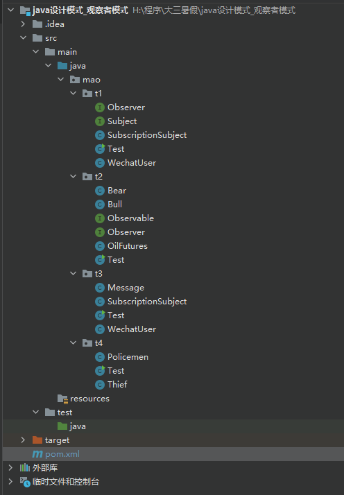


## 中介者模式

### 概念

一般来说，同事类之间的关系是比较复杂的，多个同事类之间互相关联时，他们之间的关系会呈现为复杂的网状结构，这是一种过度耦合的架构，即不利于类的复用，也不稳定。例如在下左图中，有六个同事类对象，假如对象1发生变化，那么将会有4个对象受到影响。如果对象2发生变化，那么将会有5个对象受到影响。也就是说，同事类之间直接关联的设计是不好的。

如果引入中介者模式，那么同事类之间的关系将变为星型结构，从下右图中可以看到，任何一个类的变动，只会影响的类本身，以及中介者，这样就减小了系统的耦合。一个好的设计，必定不会把所有的对象关系处理逻辑封装在本类中，而是使用一个专门的类来管理那些不属于自己的行为。


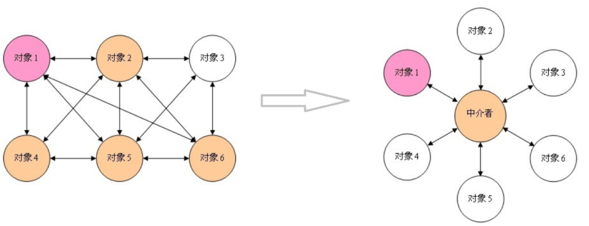


**定义：**

中介者模式又叫调停模式，定义一个中介角色来封装一系列对象之间的交互，使原有对象之间的耦合松散，且可以独立地改变它们之间的交互。


### 结构

* 抽象中介者（Mediator）角色：它是中介者的接口，提供了同事对象注册与转发同事对象信息的抽象方法。
* 具体中介者（ConcreteMediator）角色：实现中介者接口，定义一个 List 来管理同事对象，协调各个同事角色之间的交互关系，因此它依赖于同事角色。
* 抽象同事类（Colleague）角色：定义同事类的接口，保存中介者对象，提供同事对象交互的抽象方法，实现所有相互影响的同事类的公共功能。
* 具体同事类（Concrete Colleague）角色：是抽象同事类的实现者，当需要与其他同事对象交互时，由中介者对象负责后续的交互。


### 示例

**租房**

现在租房基本都是通过房屋中介，房主将房屋托管给房屋中介，而租房者从房屋中介获取房屋信息。房屋中介充当租房者与房屋所有者之间的中介者


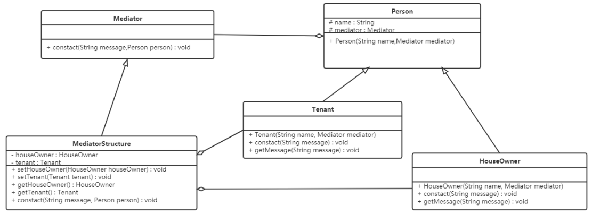


```java
package mao.t1;

/**
 * Project name(项目名称)：java设计模式_中介者模式
 * Package(包名): mao.t1
 * Class(类名): Person
 * Author(作者）: mao
 * Author QQ：1296193245
 * GitHub：https://github.com/maomao124/
 * Date(创建日期)： 2022/8/21
 * Time(创建时间)： 14:58
 * Version(版本): 1.0
 * Description(描述)： 抽象同事类
 */

public abstract class Person
{
    //名字
    protected String name;
    //中介者
    protected Mediator mediator;

    public Person(String name, Mediator mediator)
    {
        this.name = name;
        this.mediator = mediator;
    }

    public String getName()
    {
        return name;
    }

    /**
     * 联系中介
     *
     * @param message 消息
     */
    public abstract void constact(String message);

    /**
     * 接收中介的消息
     *
     * @param message 消息
     */
    public abstract void getMessage(String message);
}
```


```java
package mao.t1;

/**
 * Project name(项目名称)：java设计模式_中介者模式
 * Package(包名): mao.t1
 * Class(类名): Mediator
 * Author(作者）: mao
 * Author QQ：1296193245
 * GitHub：https://github.com/maomao124/
 * Date(创建日期)： 2022/8/21
 * Time(创建时间)： 14:56
 * Version(版本): 1.0
 * Description(描述)： 抽象中介者
 */

public abstract class Mediator
{
    /**
     * 中介者联络的方法
     *
     * @param message 消息
     * @param person  要联络的人(抽象同事类)
     */
    public abstract void constact(String message, Person person);
}
```


```java
package mao.t1;

/**
 * Project name(项目名称)：java设计模式_中介者模式
 * Package(包名): mao.t1
 * Class(类名): HouseOwner
 * Author(作者）: mao
 * Author QQ：1296193245
 * GitHub：https://github.com/maomao124/
 * Date(创建日期)： 2022/8/21
 * Time(创建时间)： 14:59
 * Version(版本): 1.0
 * Description(描述)： 具体同事类 房屋拥有者
 */

public class HouseOwner extends Person
{
    public HouseOwner(String name, Mediator mediator)
    {
        super(name, mediator);
    }

    @Override
    public void constact(String message)
    {
        mediator.constact(message, this);
    }

    @Override
    public void getMessage(String message)
    {
        System.out.println("房主" + name + "获取到中介的消息：" + message);
    }
}
```


```java
package mao.t1;

/**
 * Project name(项目名称)：java设计模式_中介者模式
 * Package(包名): mao.t1
 * Class(类名): Tenant
 * Author(作者）: mao
 * Author QQ：1296193245
 * GitHub：https://github.com/maomao124/
 * Date(创建日期)： 2022/8/21
 * Time(创建时间)： 15:05
 * Version(版本): 1.0
 * Description(描述)： 具体同事类 承租人
 */

public class Tenant extends Person
{

    public Tenant(String name, Mediator mediator)
    {
        super(name, mediator);
    }

    @Override
    public void constact(String message)
    {
        mediator.constact(message, this);
    }

    @Override
    public void getMessage(String message)
    {
        System.out.println("租房者" + name + "获取到中介的消息：" + message);
    }
}
```


```java
package mao.t1;

import java.util.ArrayList;
import java.util.List;

/**
 * Project name(项目名称)：java设计模式_中介者模式
 * Package(包名): mao.t1
 * Class(类名): MediatorStructure
 * Author(作者）: mao
 * Author QQ：1296193245
 * GitHub：https://github.com/maomao124/
 * Date(创建日期)： 2022/8/21
 * Time(创建时间)： 15:07
 * Version(版本): 1.0
 * Description(描述)： 无
 */


public class MediatorStructure extends Mediator
{
    private final List<Tenant> tenants;
    private final List<HouseOwner> houseOwners;

    /**
     * Instantiates a new Mediator structure.
     */
    public MediatorStructure()
    {
        tenants = new ArrayList<>();
        houseOwners = new ArrayList<>();
    }

    /**
     * Add tenants mediator structure.
     *
     * @param tenant the tenant
     * @return the mediator structure
     */
    public MediatorStructure addTenants(Tenant tenant)
    {
        this.tenants.add(tenant);
        return this;
    }

    /**
     * Add house owners mediator structure.
     *
     * @param houseOwner the house owner
     * @return the mediator structure
     */
    public MediatorStructure addHouseOwners(HouseOwner houseOwner)
    {
        this.houseOwners.add(houseOwner);
        return this;
    }

    /**
     * Gets tenants.
     *
     * @return the tenants
     */
    public List<Tenant> getTenants()
    {
        return tenants;
    }

    /**
     * Gets house owners.
     *
     * @return the house owners
     */
    public List<HouseOwner> getHouseOwners()
    {
        return houseOwners;
    }

    @Override
    public void constact(String message, Person person)
    {
        if (person instanceof Tenant)
        {
            //租房者发出的消息，应该发给所有的房屋拥有者
            for (HouseOwner houseOwner : houseOwners)
            {
                houseOwner.getMessage(message);
            }
        }
        else if (person instanceof HouseOwner)
        {
            //房屋拥有者发出的消息，应该发给所有的租房者
            for (Tenant tenant : tenants)
            {
                tenant.getMessage(message);
            }
        }
    }
}
```


```java
package mao.t1;

/**
 * Project name(项目名称)：java设计模式_中介者模式
 * Package(包名): mao.t1
 * Class(类名): Test
 * Author(作者）: mao
 * Author QQ：1296193245
 * GitHub：https://github.com/maomao124/
 * Date(创建日期)： 2022/8/21
 * Time(创建时间)： 15:11
 * Version(版本): 1.0
 * Description(描述)： 无
 */

public class Test
{
    public static void main(String[] args)
    {
        MediatorStructure mediator = new MediatorStructure();

        HouseOwner houseOwner1 = new HouseOwner("张三", mediator);
        HouseOwner houseOwner2 = new HouseOwner("李四", mediator);
        HouseOwner houseOwner3 = new HouseOwner("王五", mediator);

        Tenant tenant1 = new Tenant("赵六", mediator);
        Tenant tenant2 = new Tenant("张九", mediator);
        Tenant tenant3 = new Tenant("王四", mediator);
        Tenant tenant4 = new Tenant("钱七", mediator);

        //添加
        mediator.addHouseOwners(houseOwner1);
        mediator.addHouseOwners(houseOwner2);
        mediator.addHouseOwners(houseOwner3);

        mediator.addTenants(tenant1);
        mediator.addTenants(tenant2);
        mediator.addTenants(tenant3);
        mediator.addTenants(tenant4);

        tenant2.constact("我需要一套30平的房子,联系人：" + tenant2.getName());
        System.out.println("----");
        tenant4.constact("我需要一套70平的房子,联系人：" + tenant4.getName());
        System.out.println("----");
        tenant1.constact("我需要一套100平的房子,价格3000一个月以上的,联系人：" + tenant1.getName());

        System.out.println("----");
        System.out.println("----");

        houseOwner1.constact("现有一套120平的房子出租，价格为4000元一个月,出租人：" + houseOwner1.getName());
        System.out.println("----");
        houseOwner3.constact("现有一套40平的房子出租，价格为1300元一个月,出租人：" + houseOwner3.getName());


    }
}
```


运行结果：

```sh
房主张三获取到中介的消息：我需要一套30平的房子,联系人：张九
房主李四获取到中介的消息：我需要一套30平的房子,联系人：张九
房主王五获取到中介的消息：我需要一套30平的房子,联系人：张九
----
房主张三获取到中介的消息：我需要一套70平的房子,联系人：钱七
房主李四获取到中介的消息：我需要一套70平的房子,联系人：钱七
房主王五获取到中介的消息：我需要一套70平的房子,联系人：钱七
----
房主张三获取到中介的消息：我需要一套100平的房子,价格3000一个月以上的,联系人：赵六
房主李四获取到中介的消息：我需要一套100平的房子,价格3000一个月以上的,联系人：赵六
房主王五获取到中介的消息：我需要一套100平的房子,价格3000一个月以上的,联系人：赵六
----
----
租房者赵六获取到中介的消息：现有一套120平的房子出租，价格为4000元一个月,出租人：张三
租房者张九获取到中介的消息：现有一套120平的房子出租，价格为4000元一个月,出租人：张三
租房者王四获取到中介的消息：现有一套120平的房子出租，价格为4000元一个月,出租人：张三
租房者钱七获取到中介的消息：现有一套120平的房子出租，价格为4000元一个月,出租人：张三
----
租房者赵六获取到中介的消息：现有一套40平的房子出租，价格为1300元一个月,出租人：王五
租房者张九获取到中介的消息：现有一套40平的房子出租，价格为1300元一个月,出租人：王五
租房者王四获取到中介的消息：现有一套40平的房子出租，价格为1300元一个月,出租人：王五
租房者钱七获取到中介的消息：现有一套40平的房子出租，价格为1300元一个月,出租人：王五
```


**示例2：班级同学之间谈话**

模拟一个班级上同学之间的谈话。班上有三个女生A、B和C，有三个男生D、E和F。女生A想说一些话，只想让女生知道。男生D则想说一些话，让所有的人都可以听到。


```java
package mao.t2;

/**
 * Project name(项目名称)：java设计模式_中介者模式
 * Package(包名): mao.t2
 * Class(类名): Student
 * Author(作者）: mao
 * Author QQ：1296193245
 * GitHub：https://github.com/maomao124/
 * Date(创建日期)： 2022/8/21
 * Time(创建时间)： 15:44
 * Version(版本): 1.0
 * Description(描述)： 无
 */


public class Student
{
    //名字
    private final String name;
    //性别。性别应该要定义一个枚举
    private final String sex;

    /**
     * Instantiates a new Student.
     *
     * @param name the name
     * @param sex  the sex
     */
    public Student(String name, String sex)
    {
        this.name = name;
        this.sex = sex;
        Mediator.add(this);
    }

    /**
     * Gets sex.
     *
     * @return the sex
     */
    public String getSex()
    {
        return sex;
    }

    /**
     * Gets name.
     *
     * @return the name
     */
    public String getName()
    {
        return name;
    }

    /**
     * Send message to all.
     *
     * @param message the message
     */
    public void sendMessageToAll(String message)
    {
        Mediator.sendMessageToAll(this, message);
    }

    /**
     * Send message to same sex.
     *
     * @param message the message
     */
    public void sendMessageToSameSex(String message)
    {
        Mediator.sendMessageToSameSex(this, message);
    }

    /**
     * Receive message.
     *
     * @param message the message
     */
    public void receiveMessage(String message)
    {
        System.out.println(name + "收到了消息。" + message);
    }
}
```


```java
package mao.t2;

import java.util.ArrayList;
import java.util.List;

/**
 * Project name(项目名称)：java设计模式_中介者模式
 * Package(包名): mao.t2
 * Class(类名): Mediator
 * Author(作者）: mao
 * Author QQ：1296193245
 * GitHub：https://github.com/maomao124/
 * Date(创建日期)： 2022/8/21
 * Time(创建时间)： 15:46
 * Version(版本): 1.0
 * Description(描述)： 无
 */

public class Mediator
{
    private static final List<Student> maleStudents = new ArrayList<>();
    private static final List<Student> femaleStudents = new ArrayList<>();

    /**
     * 添加学生
     *
     * @param student Student对象
     */
    public static void add(Student student)
    {
        if ("male".equals(student.getSex()))
        {
            maleStudents.add(student);
        }
        else
        {
            femaleStudents.add(student);
        }
    }

    /**
     * 发送消息给所有学生
     *
     * @param student Student对象
     * @param message 消息
     */
    public static void sendMessageToAll(Student student, String message)
    {
        for (Student stu : maleStudents)
        {
            if (student.getName().equals(stu.getName()))
            {
                continue;
            }
            stu.receiveMessage(student.getName() + ":" + message);
        }
        for (Student stu : femaleStudents)
        {
            if (student.getName().equals(stu.getName()))
            {
                continue;
            }
            stu.receiveMessage(student.getName() + ":" + message);
        }
    }

    /**
     * 发送消息给同性别的学生
     *
     * @param student Student对象
     * @param message 消息
     */
    public static void sendMessageToSameSex(Student student, String message)
    {
        List<Student> tempList = "male".equals(student.getSex()) ? maleStudents : femaleStudents;
        for (Student stu : tempList)
        {
            if (student.getName().equals(stu.getName()))
            {
                continue;
            }
            stu.receiveMessage(student.getName() + ":" + message);
        }
    }
}
```


```java
package mao.t2;

/**
 * Project name(项目名称)：java设计模式_中介者模式
 * Package(包名): mao.t2
 * Class(类名): Test
 * Author(作者）: mao
 * Author QQ：1296193245
 * GitHub：https://github.com/maomao124/
 * Date(创建日期)： 2022/8/21
 * Time(创建时间)： 15:52
 * Version(版本): 1.0
 * Description(描述)： 无
 */

public class Test
{
    public static void main(String[] args)
    {
        Student femaleStudentA = new Student("小红", "female");
        Student femaleStudentB = new Student("小美", "female");
        Student femaleStudentC = new Student("小花", "female");

        Student maleStudentA = new Student("小明", "male");
        Student maleStudentB = new Student("小亮", "male");
        Student maleStudentC = new Student("小绿", "male");

        maleStudentB.sendMessageToAll("干饭");
        System.out.println("-------");
        maleStudentA.sendMessageToAll("睡觉");
        System.out.println("-------");
        maleStudentC.sendMessageToAll("明天放假！！！");

        System.out.println("-------");
        System.out.println("-------");

        femaleStudentA.sendMessageToSameSex("一起去厕所吗？");
        System.out.println("-------");
        femaleStudentB.sendMessageToSameSex("大家好！");
        System.out.println("-------");
        femaleStudentC.sendMessageToSameSex("明天一起去玩吧");

    }
}
```


运行结果：

```sh
小明收到了消息。小亮:干饭
小绿收到了消息。小亮:干饭
小红收到了消息。小亮:干饭
小美收到了消息。小亮:干饭
小花收到了消息。小亮:干饭
-------
小亮收到了消息。小明:睡觉
小绿收到了消息。小明:睡觉
小红收到了消息。小明:睡觉
小美收到了消息。小明:睡觉
小花收到了消息。小明:睡觉
-------
小明收到了消息。小绿:明天放假！！！
小亮收到了消息。小绿:明天放假！！！
小红收到了消息。小绿:明天放假！！！
小美收到了消息。小绿:明天放假！！！
小花收到了消息。小绿:明天放假！！！
-------
-------
小美收到了消息。小红:一起去厕所吗？
小花收到了消息。小红:一起去厕所吗？
-------
小红收到了消息。小美:大家好！
小花收到了消息。小美:大家好！
-------
小红收到了消息。小花:明天一起去玩吧
小美收到了消息。小花:明天一起去玩吧
```


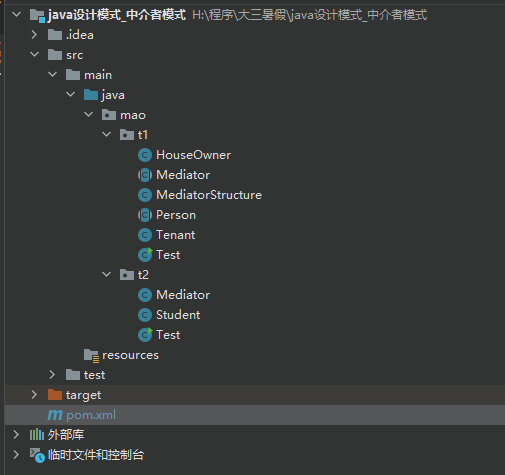


### 优缺点

**优点：**

* 松散耦合

  中介者模式通过把多个同事对象之间的交互封装到中介者对象里面，从而使得同事对象之间松散耦合，基本上可以做到互补依赖。这样一来，同事对象就可以独立地变化和复用，而不再像以前那样“牵一处而动全身”了。

* 集中控制交互

  多个同事对象的交互，被封装在中介者对象里面集中管理，使得这些交互行为发生变化的时候，只需要修改中介者对象就可以了，当然如果是已经做好的系统，那么就扩展中介者对象，而各个同事类不需要做修改。

* 一对多关联转变为一对一的关联

  没有使用中介者模式的时候，同事对象之间的关系通常是一对多的，引入中介者对象以后，中介者对象和同事对象的关系通常变成双向的一对一，这会让对象的关系更容易理解和实现。

**缺点：**

当同事类太多时，中介者的职责将很大，它会变得复杂而庞大，以至于系统难以维护。


### 使用场景

* 系统中对象之间存在复杂的引用关系，系统结构混乱且难以理解。
* 当想创建一个运行于多个类之间的对象，又不想生成新的子类时。


## 迭代器模式

### 概念

提供一个对象来顺序访问聚合对象中的一系列数据，而不暴露聚合对象的内部表示。 


### 结构

迭代器模式主要包含以下角色：

* 抽象聚合（Aggregate）角色：定义存储、添加、删除聚合元素以及创建迭代器对象的接口。
* 具体聚合（ConcreteAggregate）角色：实现抽象聚合类，返回一个具体迭代器的实例。
* 抽象迭代器（Iterator）角色：定义访问和遍历聚合元素的接口，通常包含 hasNext()、next() 等方法。
* 具体迭代器（Concretelterator）角色：实现抽象迭代器接口中所定义的方法，完成对聚合对象的遍历，记录遍历的当前位置。


### 示例

定义一个可以存储学生对象的容器对象，将遍历该容器的功能交由迭代器实现


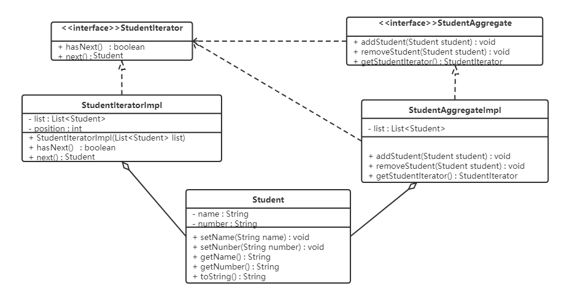


```java
package mao.t1;

/**
 * Project name(项目名称)：java设计模式_迭代器模式
 * Package(包名): mao.t1
 * Class(类名): Student
 * Author(作者）: mao
 * Author QQ：1296193245
 * GitHub：https://github.com/maomao124/
 * Date(创建日期)： 2022/8/22
 * Time(创建时间)： 19:53
 * Version(版本): 1.0
 * Description(描述)： 无
 */
public class Student
{
    private Long id;
    private String name;
    private String sex;
    private Integer age;

    /**
     * Instantiates a new Student.
     */
    public Student()
    {

    }

    /**
     * Instantiates a new Student.
     *
     * @param id   the id
     * @param name the name
     * @param sex  the sex
     * @param age  the age
     */
    public Student(Long id, String name, String sex, Integer age)
    {
        this.id = id;
        this.name = name;
        this.sex = sex;
        this.age = age;
    }

    /**
     * Gets id.
     *
     * @return the id
     */
    public Long getId()
    {
        return id;
    }

    /**
     * Sets id.
     *
     * @param id the id
     */
    public void setId(Long id)
    {
        this.id = id;
    }

    /**
     * Gets name.
     *
     * @return the name
     */
    public String getName()
    {
        return name;
    }

    /**
     * Sets name.
     *
     * @param name the name
     */
    public void setName(String name)
    {
        this.name = name;
    }

    /**
     * Gets sex.
     *
     * @return the sex
     */
    public String getSex()
    {
        return sex;
    }

    /**
     * Sets sex.
     *
     * @param sex the sex
     */
    public void setSex(String sex)
    {
        this.sex = sex;
    }

    /**
     * Gets age.
     *
     * @return the age
     */
    public Integer getAge()
    {
        return age;
    }

    /**
     * Sets age.
     *
     * @param age the age
     */
    public void setAge(Integer age)
    {
        this.age = age;
    }

    @Override
    @SuppressWarnings("all")
    public String toString()
    {
        final StringBuilder stringbuilder = new StringBuilder();
        stringbuilder.append("id：").append(id).append('\n');
        stringbuilder.append("name：").append(name).append('\n');
        stringbuilder.append("sex：").append(sex).append('\n');
        stringbuilder.append("age：").append(age).append('\n');
        return stringbuilder.toString();
    }
}
```


```java
package mao.t1;

/**
 * Project name(项目名称)：java设计模式_迭代器模式
 * Package(包名): mao.t1
 * Class(类名): StudentBuilder
 * Author(作者）: mao
 * Author QQ：1296193245
 * GitHub：https://github.com/maomao124/
 * Date(创建日期)： 2022/8/22
 * Time(创建时间)： 19:56
 * Version(版本): 1.0
 * Description(描述)： 无
 */

public class StudentBuilder
{
    private Long id;
    private String name;
    private String sex;
    private Integer age;

    /**
     * Sets id.
     *
     * @param id the id
     * @return the id
     */
    public StudentBuilder setId(Long id)
    {
        this.id = id;
        return this;
    }

    /**
     * Sets name.
     *
     * @param name the name
     * @return the name
     */
    public StudentBuilder setName(String name)
    {
        this.name = name;
        return this;
    }

    /**
     * Sets sex.
     *
     * @param sex the sex
     * @return the sex
     */
    public StudentBuilder setSex(String sex)
    {
        this.sex = sex;
        return this;
    }

    /**
     * Sets age.
     *
     * @param age the age
     * @return the age
     */
    public StudentBuilder setAge(Integer age)
    {
        this.age = age;
        return this;
    }

    /**
     * Build student.
     *
     * @return the student
     */
    public Student build()
    {
        return new Student(id, name, sex, age);
    }
}
```


```java
package mao.t1;

/**
 * Project name(项目名称)：java设计模式_迭代器模式
 * Package(包名): mao.t1
 * Interface(接口名): StudentIterator
 * Author(作者）: mao
 * Author QQ：1296193245
 * GitHub：https://github.com/maomao124/
 * Date(创建日期)： 2022/8/22
 * Time(创建时间)： 19:52
 * Version(版本): 1.0
 * Description(描述)： 无
 */

public interface StudentIterator
{
    /**
     * Has next boolean.
     *
     * @return the boolean
     */
    boolean hasNext();

    /**
     * Next student.
     *
     * @return the student
     */
    Student next();
}
```


```java
package mao.t1;

import java.util.List;

/**
 * Project name(项目名称)：java设计模式_迭代器模式
 * Package(包名): mao.t1
 * Class(类名): StudentIteratorImpl1
 * Author(作者）: mao
 * Author QQ：1296193245
 * GitHub：https://github.com/maomao124/
 * Date(创建日期)： 2022/8/22
 * Time(创建时间)： 19:58
 * Version(版本): 1.0
 * Description(描述)： 升序
 */

public class StudentIteratorImpl1 implements StudentIterator
{
    private final List<Student> list;
    private int position = 0;

    /**
     * Instantiates a new Student iterator impl 1.
     *
     * @param list the list
     */
    public StudentIteratorImpl1(List<Student> list)
    {
        this.list = list;
    }

    @Override
    public boolean hasNext()
    {
        return position < list.size();
    }

    @Override
    public Student next()
    {
        Student student = list.get(position);
        position++;
        return student;
    }
}
```


```java
package mao.t1;

import java.util.List;

/**
 * Project name(项目名称)：java设计模式_迭代器模式
 * Package(包名): mao.t1
 * Class(类名): StudentIteratorImpl2
 * Author(作者）: mao
 * Author QQ：1296193245
 * GitHub：https://github.com/maomao124/
 * Date(创建日期)： 2022/8/22
 * Time(创建时间)： 20:00
 * Version(版本): 1.0
 * Description(描述)： 降序
 */

public class StudentIteratorImpl2 implements StudentIterator
{
    private final List<Student> list;
    private int position;

    /**
     * Instantiates a new Student iterator impl 2.
     *
     * @param list the list
     */
    public StudentIteratorImpl2(List<Student> list)
    {
        this.list = list;
        position = list.size() - 1;
    }


    @Override
    public boolean hasNext()
    {
        return position >= 0;
    }

    @Override
    public Student next()
    {
        Student student = list.get(position);
        position--;
        return student;
    }
}
```


```java
package mao.t1;

/**
 * Project name(项目名称)：java设计模式_迭代器模式
 * Package(包名): mao.t1
 * Interface(接口名): StudentAggregate
 * Author(作者）: mao
 * Author QQ：1296193245
 * GitHub：https://github.com/maomao124/
 * Date(创建日期)： 2022/8/22
 * Time(创建时间)： 20:04
 * Version(版本): 1.0
 * Description(描述)： 无
 */

public interface StudentAggregate
{
    /**
     * 添加学生
     *
     * @param student Student
     */
    void addStudent(Student student);

    /**
     * 移除学生
     *
     * @param student Student
     */
    void removeStudent(Student student);

    /**
     * 获取迭代器对象
     *
     * @param asc_or_desc 升序或者将序，输入0为升序，输入1为降序
     * @return StudentIterator实现类
     */
    StudentIterator getStudentIterator(int asc_or_desc);
}
```


```java
package mao.t1;

import java.util.ArrayList;
import java.util.List;

/**
 * Project name(项目名称)：java设计模式_迭代器模式
 * Package(包名): mao.t1
 * Class(类名): StudentAggregateImpl
 * Author(作者）: mao
 * Author QQ：1296193245
 * GitHub：https://github.com/maomao124/
 * Date(创建日期)： 2022/8/22
 * Time(创建时间)： 20:07
 * Version(版本): 1.0
 * Description(描述)： 无
 */

public class StudentAggregateImpl implements StudentAggregate
{
    private final List<Student> studentList;

    public StudentAggregateImpl()
    {
        this.studentList = new ArrayList<>();
    }

    @Override
    public void addStudent(Student student)
    {
        studentList.add(student);
    }

    @Override
    public void removeStudent(Student student)
    {
        studentList.remove(student);
    }

    @Override
    public StudentIterator getStudentIterator(int asc_or_desc)
    {
        if (asc_or_desc == 0)
        {
            return new StudentIteratorImpl1(studentList);
        }
        else if (asc_or_desc == 1)
        {
            return new StudentIteratorImpl2(studentList);
        }
        else
        {
            throw new RuntimeException("输入的数字不合法！ 当前参数asc_or_desc的值为" + asc_or_desc + "，此产参数值只能为0或者1");
        }
    }
}
```


```java
package mao.t1;

/**
 * Project name(项目名称)：java设计模式_迭代器模式
 * Package(包名): mao.t1
 * Class(类名): Test
 * Author(作者）: mao
 * Author QQ：1296193245
 * GitHub：https://github.com/maomao124/
 * Date(创建日期)： 2022/8/22
 * Time(创建时间)： 20:11
 * Version(版本): 1.0
 * Description(描述)： 无
 */

public class Test
{
    public static void main(String[] args)
    {
        StudentAggregate studentAggregate = new StudentAggregateImpl();

        Student student = new StudentBuilder().setId(1L).build();
        Student student1 = new StudentBuilder().setId(2L)
                .setName("张珊珊")
                .setAge(18)
                .setSex("女").
                build();

        Student student2 = new StudentBuilder()
                .setId(3L)
                .setName("王五")
                .build();

        Student student3 = new StudentBuilder()
                .setId(4L)
                .setName("张八")
                .setSex("男")
                .setAge(19)
                .build();

        studentAggregate.addStudent(student);
        studentAggregate.addStudent(student1);
        studentAggregate.addStudent(student2);
        studentAggregate.addStudent(student3);

        StudentIterator studentIterator = studentAggregate.getStudentIterator(0);
        while (studentIterator.hasNext())
        {
            Student next = studentIterator.next();
            System.out.println(next);
        }

        System.out.println("----------");

        studentIterator = studentAggregate.getStudentIterator(1);
        while (studentIterator.hasNext())
        {
            Student next = studentIterator.next();
            System.out.println(next);
        }

        System.out.println("----------");

        //测试异常
        studentAggregate.getStudentIterator(3);
    }
}
```


运行结果：

```sh
id：1
name：null
sex：null
age：null

id：2
name：张珊珊
sex：女
age：18

id：3
name：王五
sex：null
age：null

id：4
name：张八
sex：男
age：19

----------
id：4
name：张八
sex：男
age：19

id：3
name：王五
sex：null
age：null

id：2
name：张珊珊
sex：女
age：18

id：1
name：null
sex：null
age：null

----------
Exception in thread "main" java.lang.RuntimeException: 输入的数字不合法！ 当前参数asc_or_desc的值为3，此产参数值只能为0或者1
	at mao.t1.StudentAggregateImpl.getStudentIterator(StudentAggregateImpl.java:53)
	at mao.t1.Test.main(Test.java:65)
```


### 优缺点

**优点：**

* 它支持以不同的方式遍历一个聚合对象，在同一个聚合对象上可以定义多种遍历方式。在迭代器模式中只需要用一个不同的迭代器来替换原有迭代器即可改变遍历算法，我们也可以自己定义迭代器的子类以支持新的遍历方式。
* 迭代器简化了聚合类。由于引入了迭代器，在原有的聚合对象中不需要再自行提供数据遍历等方法，这样可以简化聚合类的设计。
* 在迭代器模式中，由于引入了抽象层，增加新的聚合类和迭代器类都很方便，无须修改原有代码，满足 “开闭原则” 的要求。


**缺点：**

增加了类的个数，这在一定程度上增加了系统的复杂性。


### 使用场景

* 当需要为聚合对象提供多种遍历方式时。
* 当需要为遍历不同的聚合结构提供一个统一的接口时。
* 当访问一个聚合对象的内容而无须暴露其内部细节的表示时。


### JDK源码解析

迭代器模式在JAVA的很多集合类中被广泛应用


```java
package mao.jdk;

import mao.t1.Student;
import mao.t1.StudentBuilder;

import java.util.ArrayList;
import java.util.Iterator;
import java.util.List;

/**
 * Project name(项目名称)：java设计模式_迭代器模式
 * Package(包名): mao.jdk
 * Class(类名): Test
 * Author(作者）: mao
 * Author QQ：1296193245
 * GitHub：https://github.com/maomao124/
 * Date(创建日期)： 2022/8/22
 * Time(创建时间)： 20:25
 * Version(版本): 1.0
 * Description(描述)： 无
 */

public class Test
{
    public static void main(String[] args)
    {
        List<Student> list = new ArrayList<>();

        Student student = new StudentBuilder().setId(1L).build();
        Student student1 = new StudentBuilder().setId(2L)
                .setName("张珊珊")
                .setAge(18)
                .setSex("女").
                build();

        Student student2 = new StudentBuilder()
                .setId(3L)
                .setName("王五")
                .build();

        Student student3 = new StudentBuilder()
                .setId(4L)
                .setName("张八")
                .setSex("男")
                .setAge(19)
                .build();

        list.add(student);
        list.add(student1);
        list.add(student2);
        list.add(student3);

        Iterator<Student> iterator = list.iterator();
        while (iterator.hasNext())
        {
            Student next = iterator.next();
            System.out.println(next);
        }
    }
}
```


运行结果：

```sh
id：1
name：null
sex：null
age：null

id：2
name：张珊珊
sex：女
age：18

id：3
name：王五
sex：null
age：null

id：4
name：张八
sex：男
age：19
```


- List：抽象聚合类
- ArrayList：具体的聚合类
- Iterator：抽象迭代器
- list.iterator()：返回的是实现了 `Iterator` 接口的具体迭代器对象


```java
public class ArrayList<E> extends AbstractList<E>
        implements List<E>, RandomAccess, Cloneable, java.io.Serializable {
    
     /**
     * Returns an iterator over the elements in this list in proper sequence.
     *
     * <p>The returned iterator is <a href="#fail-fast"><i>fail-fast</i></a>.
     *
     * @return an iterator over the elements in this list in proper sequence
     */
    public Iterator<E> iterator() {
        return new Itr();
    }
    
    private class Itr implements Iterator<E> {
        int cursor;       // 下一个要返回元素的索引
        int lastRet = -1; // 上一个返回元素的索引
        int expectedModCount = modCount;

        Itr() {}
		
        //判断是否还有元素
        public boolean hasNext() {
            return cursor != size;
        }

        //获取下一个元素
        public E next() {
            checkForComodification();
            int i = cursor;
            if (i >= size)
                throw new NoSuchElementException();
            Object[] elementData = ArrayList.this.elementData;
            if (i >= elementData.length)
                throw new ConcurrentModificationException();
            cursor = i + 1;
            return (E) elementData[lastRet = i];
        }
        ...
}
```


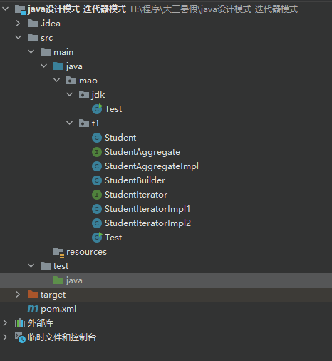


## 访问者模式

### 概念

封装一些作用于某种数据结构中的各元素的操作，它可以在不改变这个数据结构的前提下定义作用于这些元素的新的操作。


### 结构

访问者模式包含以下主要角色:

* 抽象访问者（Visitor）角色：定义了对每一个元素`（Element）`访问的行为，它的参数就是可以访问的元素，它的方法个数理论上来讲与元素类个数（Element的实现类个数）是一样的，从这点不难看出，访问者模式要求元素类的个数不能改变。
* 具体访问者（ConcreteVisitor）角色：给出对每一个元素类访问时所产生的具体行为。
* 抽象元素（Element）角色：定义了一个接受访问者的方法（`accept`），其意义是指，每一个元素都要可以被访问者访问。
* 具体元素（ConcreteElement）角色： 提供接受访问方法的具体实现，而这个具体的实现，通常情况下是使用访问者提供的访问该元素类的方法。
* 对象结构（Object Structure）角色：定义当中所提到的对象结构，对象结构是一个抽象表述，具体点可以理解为一个具有容器性质或者复合对象特性的类，它会含有一组元素（`Element`），并且可以迭代这些元素，供访问者访问。


### 示例

**给宠物喂食**

- 访问者角色：给宠物喂食的人
- 具体访问者角色：主人、其他人
- 抽象元素角色：动物抽象类
- 具体元素角色：宠物狗、宠物猫
- 结构对象角色：主人家


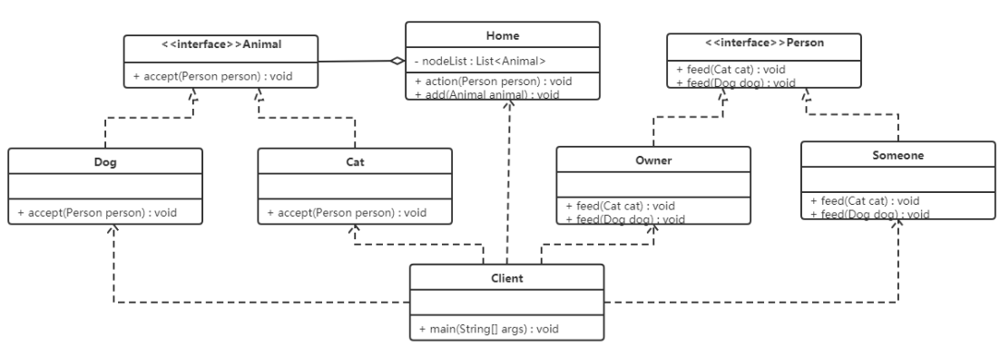


```java
package mao.t1;

/**
 * Project name(项目名称)：java设计模式_访问者模式
 * Package(包名): mao.t1
 * Interface(接口名): Animal
 * Author(作者）: mao
 * Author QQ：1296193245
 * GitHub：https://github.com/maomao124/
 * Date(创建日期)： 2022/8/22
 * Time(创建时间)： 20:43
 * Version(版本): 1.0
 * Description(描述)： 抽象节点 -宠物
 */

public interface Animal
{
    void accept(Person person);
}
```


```java
package mao.t1;

/**
 * Project name(项目名称)：java设计模式_访问者模式
 * Package(包名): mao.t1
 * Class(类名): Cat
 * Author(作者）: mao
 * Author QQ：1296193245
 * GitHub：https://github.com/maomao124/
 * Date(创建日期)： 2022/8/22
 * Time(创建时间)： 20:45
 * Version(版本): 1.0
 * Description(描述)： 无
 */

public class Cat implements Animal
{

    @Override
    public void accept(Person person)
    {
        person.feed(this);
        System.out.println("猫被喂食");
    }
}
```


```java
package mao.t1;

/**
 * Project name(项目名称)：java设计模式_访问者模式
 * Package(包名): mao.t1
 * Class(类名): Dog
 * Author(作者）: mao
 * Author QQ：1296193245
 * GitHub：https://github.com/maomao124/
 * Date(创建日期)： 2022/8/22
 * Time(创建时间)： 20:44
 * Version(版本): 1.0
 * Description(描述)： 无
 */

public class Dog implements Animal
{

    @Override
    public void accept(Person person)
    {
        person.feed(this);
        System.out.println("狗被喂食");
    }
}
```


```java
package mao.t1;

/**
 * Project name(项目名称)：java设计模式_访问者模式
 * Package(包名): mao.t1
 * Interface(接口名): Person
 * Author(作者）: mao
 * Author QQ：1296193245
 * GitHub：https://github.com/maomao124/
 * Date(创建日期)： 2022/8/22
 * Time(创建时间)： 20:43
 * Version(版本): 1.0
 * Description(描述)： 无
 */

public interface Person
{
    void feed(Cat cat);

    void feed(Dog dog);
}
```


```java
package mao.t1;

/**
 * Project name(项目名称)：java设计模式_访问者模式
 * Package(包名): mao.t1
 * Class(类名): Owner
 * Author(作者）: mao
 * Author QQ：1296193245
 * GitHub：https://github.com/maomao124/
 * Date(创建日期)： 2022/8/22
 * Time(创建时间)： 20:46
 * Version(版本): 1.0
 * Description(描述)： 无
 */

public class Owner implements Person
{

    @Override
    public void feed(Cat cat)
    {
        System.out.println("主人喂食猫");
    }

    @Override
    public void feed(Dog dog)
    {
        System.out.println("主人喂食狗");
    }
}
```


```java
package mao.t1;

/**
 * Project name(项目名称)：java设计模式_访问者模式
 * Package(包名): mao.t1
 * Class(类名): Someone
 * Author(作者）: mao
 * Author QQ：1296193245
 * GitHub：https://github.com/maomao124/
 * Date(创建日期)： 2022/8/22
 * Time(创建时间)： 20:48
 * Version(版本): 1.0
 * Description(描述)： 无
 */

public class Someone implements Person
{

    @Override
    public void feed(Cat cat)
    {
        System.out.println("其他人喂食猫");
    }

    @Override
    public void feed(Dog dog)
    {
        System.out.println("其他人喂食狗");
    }
}
```


```java
package mao.t1;

import java.util.ArrayList;
import java.util.List;

/**
 * Project name(项目名称)：java设计模式_访问者模式
 * Package(包名): mao.t1
 * Class(类名): Home
 * Author(作者）: mao
 * Author QQ：1296193245
 * GitHub：https://github.com/maomao124/
 * Date(创建日期)： 2022/8/22
 * Time(创建时间)： 20:48
 * Version(版本): 1.0
 * Description(描述)： 无
 */

public class Home
{
    private final List<Animal> nodeList = new ArrayList<>();

    public void add(Animal animal)
    {
        nodeList.add(animal);
    }

    public void action(Person person)
    {
        for (Animal animal : nodeList)
        {
            animal.accept(person);
        }
    }
}
```


```java
package mao.t1;

/**
 * Project name(项目名称)：java设计模式_访问者模式
 * Package(包名): mao.t1
 * Class(类名): Test
 * Author(作者）: mao
 * Author QQ：1296193245
 * GitHub：https://github.com/maomao124/
 * Date(创建日期)： 2022/8/22
 * Time(创建时间)： 20:51
 * Version(版本): 1.0
 * Description(描述)： 无
 */

public class Test
{
    public static void main(String[] args)
    {
        Home home = new Home();
        home.add(new Cat());
        home.add(new Dog());

        Owner owner = new Owner();
        Someone someone = new Someone();
        home.action(owner);
        System.out.println("------------");
        home.action(someone);
    }
}
```


运行结果：

```sh
主人喂食猫
猫被喂食
主人喂食狗
狗被喂食
------------
其他人喂食猫
猫被喂食
其他人喂食狗
狗被喂食
```


**示例2**

年底，CEO和CTO开始评定员工一年的工作绩效，员工分为工程师和经理，CTO关注工程师的代码量、经理的新产品数量；CEO关注的是工程师的KPI和经理的KPI以及新产品数量。


由于CEO和CTO对于不同员工的关注点是不一样的，这就需要对不同员工类型进行不同的处理。访问者模式此时可以派上用场了。


```java
package mao.t2;

import java.util.Random;

/**
 * Project name(项目名称)：java设计模式_访问者模式
 * Package(包名): mao.t2
 * Class(类名): Staff
 * Author(作者）: mao
 * Author QQ：1296193245
 * GitHub：https://github.com/maomao124/
 * Date(创建日期)： 2022/8/22
 * Time(创建时间)： 21:09
 * Version(版本): 1.0
 * Description(描述)： 员工基类
 */

public abstract class Staff
{
    //员工姓名
    public String name;
    //员工KPI
    public int kpi;

    public Staff(String name)
    {
        this.name = name;
        //随机
        kpi = new Random().nextInt(10);
    }

    //核心方法，接受Visitor的访问
    public abstract void accept(Visitor visitor);
}
```


```java
package mao.t2;

import java.util.Random;

/**
 * Project name(项目名称)：java设计模式_访问者模式
 * Package(包名): mao.t2
 * Class(类名): Engineer
 * Author(作者）: mao
 * Author QQ：1296193245
 * GitHub：https://github.com/maomao124/
 * Date(创建日期)： 2022/8/22
 * Time(创建时间)： 21:10
 * Version(版本): 1.0
 * Description(描述)： 工程师类
 */

public class Engineer extends Staff
{

    public Engineer(String name)
    {
        super(name);
    }

    @Override
    public void accept(Visitor visitor)
    {
        visitor.visit(this);
    }

    /**
     * 获得工程师的代码行数
     *
     * @return 代码行数
     */
    public int getCodeLines()
    {
        //这里随机
        return new Random().nextInt(10 * 10000);
    }
}
```


```java
package mao.t2;

import java.util.Random;

/**
 * Project name(项目名称)：java设计模式_访问者模式
 * Package(包名): mao.t2
 * Class(类名): Manager
 * Author(作者）: mao
 * Author QQ：1296193245
 * GitHub：https://github.com/maomao124/
 * Date(创建日期)： 2022/8/22
 * Time(创建时间)： 21:12
 * Version(版本): 1.0
 * Description(描述)： 经理
 */

public class Manager extends Staff
{

    public Manager(String name)
    {
        super(name);
    }

    @Override
    public void accept(Visitor visitor)
    {
        visitor.visit(this);
    }

    /**
     * 获得经理一年的产品数量
     *
     * @return 产品数量
     */
    public int getProducts()
    {
        //这里也是随机
        return new Random().nextInt(10);
    }

}
```


```java
package mao.t2;

/**
 * Project name(项目名称)：java设计模式_访问者模式
 * Package(包名): mao.t2
 * Interface(接口名): Visitor
 * Author(作者）: mao
 * Author QQ：1296193245
 * GitHub：https://github.com/maomao124/
 * Date(创建日期)： 2022/8/22
 * Time(创建时间)： 21:13
 * Version(版本): 1.0
 * Description(描述)： 无
 */

public interface Visitor
{
    /**
     * 访问工程师
     *
     * @param engineer Engineer
     */
    void visit(Engineer engineer);

    /**
     * 访问经理
     *
     * @param manager Engineer
     */
    void visit(Manager manager);
}
```


```java
package mao.t2;

/**
 * Project name(项目名称)：java设计模式_访问者模式
 * Package(包名): mao.t2
 * Class(类名): CEOVisitor
 * Author(作者）: mao
 * Author QQ：1296193245
 * GitHub：https://github.com/maomao124/
 * Date(创建日期)： 2022/8/22
 * Time(创建时间)： 21:14
 * Version(版本): 1.0
 * Description(描述)： 无
 */

public class CEOVisitor implements Visitor
{

    @Override
    public void visit(Engineer engineer)
    {
        System.out.println("工程师: " + engineer.name + ", KPI: " + engineer.kpi);
    }

    @Override
    public void visit(Manager manager)
    {
        System.out.println("经理: " + manager.name + ", KPI: " + manager.kpi +
                ", 新产品数量: " + manager.getProducts());
    }
}
```


```java
package mao.t2;

/**
 * Project name(项目名称)：java设计模式_访问者模式
 * Package(包名): mao.t2
 * Class(类名): CTOVisitor
 * Author(作者）: mao
 * Author QQ：1296193245
 * GitHub：https://github.com/maomao124/
 * Date(创建日期)： 2022/8/22
 * Time(创建时间)： 21:20
 * Version(版本): 1.0
 * Description(描述)： 无
 */

public class CTOVisitor implements Visitor
{

    @Override
    public void visit(Engineer engineer)
    {
        System.out.println("工程师: " + engineer.name + ", 代码行数: " + engineer.getCodeLines());
    }

    @Override
    public void visit(Manager manager)
    {
        System.out.println("经理: " + manager.name + ", 产品数量: " + manager.getProducts());
    }
}
```


```java
package mao.t2;

import java.util.LinkedList;
import java.util.List;

/**
 * Project name(项目名称)：java设计模式_访问者模式
 * Package(包名): mao.t2
 * Class(类名): BusinessReport
 * Author(作者）: mao
 * Author QQ：1296193245
 * GitHub：https://github.com/maomao124/
 * Date(创建日期)： 2022/8/22
 * Time(创建时间)： 21:15
 * Version(版本): 1.0
 * Description(描述)： 无
 */

public class BusinessReport
{
    private final List<Staff> mStaffs = new LinkedList<>();

    /**
     * Instantiates a new Business report.
     */
    public BusinessReport()
    {
        mStaffs.add(new Manager("经理-A"));
        mStaffs.add(new Engineer("工程师-A"));
        mStaffs.add(new Engineer("工程师-B"));
        mStaffs.add(new Engineer("工程师-C"));
        mStaffs.add(new Manager("经理-B"));
        mStaffs.add(new Engineer("工程师-D"));
    }

    /**
     * 展示报表
     *
     * @param visitor Visitor 实现类
     */
    public void showReport(Visitor visitor)
    {
        for (Staff staff : mStaffs)
        {
            staff.accept(visitor);
        }
    }
}
```


```java
package mao.t2;

/**
 * Project name(项目名称)：java设计模式_访问者模式
 * Package(包名): mao.t2
 * Class(类名): Test
 * Author(作者）: mao
 * Author QQ：1296193245
 * GitHub：https://github.com/maomao124/
 * Date(创建日期)： 2022/8/22
 * Time(创建时间)： 21:21
 * Version(版本): 1.0
 * Description(描述)： 无
 */

public class Test
{
    public static void main(String[] args)
    {
        BusinessReport businessReport = new BusinessReport();
        System.out.println("=========== CEO报表 ===========");
        businessReport.showReport(new CEOVisitor());
        System.out.println("=========== CTO报表 ===========");
        businessReport.showReport(new CTOVisitor());
    }
}
```


运行结果：

```sh
=========== CEO报表 ===========
经理: 经理-A, KPI: 6, 新产品数量: 4
工程师: 工程师-A, KPI: 0
工程师: 工程师-B, KPI: 8
工程师: 工程师-C, KPI: 3
经理: 经理-B, KPI: 5, 新产品数量: 4
工程师: 工程师-D, KPI: 4
=========== CTO报表 ===========
经理: 经理-A, 产品数量: 5
工程师: 工程师-A, 代码行数: 66077
工程师: 工程师-B, 代码行数: 18528
工程师: 工程师-C, 代码行数: 40260
经理: 经理-B, 产品数量: 2
工程师: 工程师-D, 代码行数: 79623
```

结果不唯一


### 优缺点

**优点：**

* 扩展性好

  在不修改对象结构中的元素的情况下，为对象结构中的元素添加新的功能。

* 复用性好

  通过访问者来定义整个对象结构通用的功能，从而提高复用程度。

* 分离无关行为

  通过访问者来分离无关的行为，把相关的行为封装在一起，构成一个访问者，这样每一个访问者的功能都比较单一。

**缺点：**

* 对象结构变化很困难

  在访问者模式中，每增加一个新的元素类，都要在每一个具体访问者类中增加相应的具体操作，这违背了“开闭原则”。

* 违反了依赖倒置原则

  访问者模式依赖了具体类，而没有依赖抽象类。


### 使用场景

* 对象结构相对稳定，但其操作算法经常变化的程序。
* 对象结构中的对象需要提供多种不同且不相关的操作，而且要避免让这些操作的变化影响对象的结构。


### 分派

访问者模式用到了一种双分派的技术


变量被声明时的类型叫做变量的静态类型，有些人又把静态类型叫做明显类型；而变量所引用的对象的真实类型又叫做变量的实际类型。比如 `Map map = new HashMap()` ，map变量的静态类型是 `Map` ，实际类型是 `HashMap` 。根据对象的类型而对方法进行的选择，就是分派(Dispatch)，分派(Dispatch)又分为两种，即静态分派和动态分派。

**静态分派(Static Dispatch)** 发生在编译时期，分派根据静态类型信息发生。静态分派对于我们来说并不陌生，方法重载就是静态分派。

**动态分派(Dynamic Dispatch)** 发生在运行时期，动态分派动态地置换掉某个方法。Java通过方法的重写支持动态分派。


### 静态分派

通过方法的重写支持动态分派


```java
package mao.dynamic_dispatch;

/**
 * Project name(项目名称)：java设计模式_访问者模式
 * Package(包名): mao.dynamic_dispatch
 * Class(类名): Animal
 * Author(作者）: mao
 * Author QQ：1296193245
 * GitHub：https://github.com/maomao124/
 * Date(创建日期)： 2022/8/22
 * Time(创建时间)： 21:36
 * Version(版本): 1.0
 * Description(描述)： 无
 */

public class Animal
{
    public void execute()
    {
        System.out.println("Animal");
    }
}
```


```java
package mao.dynamic_dispatch;

/**
 * Project name(项目名称)：java设计模式_访问者模式
 * Package(包名): mao.dynamic_dispatch
 * Class(类名): Cat
 * Author(作者）: mao
 * Author QQ：1296193245
 * GitHub：https://github.com/maomao124/
 * Date(创建日期)： 2022/8/22
 * Time(创建时间)： 21:36
 * Version(版本): 1.0
 * Description(描述)： 无
 */

public class Cat extends Animal
{
    @Override
    public void execute()
    {
        System.out.println("cat");
    }
}
```


```java
package mao.dynamic_dispatch;

/**
 * Project name(项目名称)：java设计模式_访问者模式
 * Package(包名): mao.dynamic_dispatch
 * Class(类名): Dog
 * Author(作者）: mao
 * Author QQ：1296193245
 * GitHub：https://github.com/maomao124/
 * Date(创建日期)： 2022/8/22
 * Time(创建时间)： 21:36
 * Version(版本): 1.0
 * Description(描述)： 无
 */

public class Dog extends Animal
{
    @Override
    public void execute()
    {
        System.out.println("dog");
    }
}
```


```java
package mao.dynamic_dispatch;

/**
 * Project name(项目名称)：java设计模式_访问者模式
 * Package(包名): mao.dynamic_dispatch
 * Class(类名): Test
 * Author(作者）: mao
 * Author QQ：1296193245
 * GitHub：https://github.com/maomao124/
 * Date(创建日期)： 2022/8/22
 * Time(创建时间)： 21:37
 * Version(版本): 1.0
 * Description(描述)： 无
 */

public class Test
{
    public static void main(String[] args)
    {
        Animal animal1 = new Dog();
        Animal animal2 = new Cat();
        Animal animal3 = new Animal();

        animal1.execute();
        animal2.execute();
        animal3.execute();
    }
}
```


运行结果：

```sh
dog
cat
Animal
```


Java编译器在编译时期并不总是知道哪些代码会被执行，因为编译器仅仅知道对象的静态类型，而不知道对象的真实类型；而方法的调用则是根据对象的真实类型，而不是静态类型。


### 静态分派

通过方法重载支持静态分派


```java
package mao.static_dispatch;

/**
 * Project name(项目名称)：java设计模式_访问者模式
 * Package(包名): mao.static_dispatch
 * Class(类名): Animal
 * Author(作者）: mao
 * Author QQ：1296193245
 * GitHub：https://github.com/maomao124/
 * Date(创建日期)： 2022/8/22
 * Time(创建时间)： 22:20
 * Version(版本): 1.0
 * Description(描述)： 无
 */

public class Animal
{

}
```


```java
package mao.static_dispatch;

/**
 * Project name(项目名称)：java设计模式_访问者模式
 * Package(包名): mao.static_dispatch
 * Class(类名): Cat
 * Author(作者）: mao
 * Author QQ：1296193245
 * GitHub：https://github.com/maomao124/
 * Date(创建日期)： 2022/8/22
 * Time(创建时间)： 22:20
 * Version(版本): 1.0
 * Description(描述)： 无
 */

public class Cat extends Animal
{

}
```


```java
package mao.static_dispatch;

/**
 * Project name(项目名称)：java设计模式_访问者模式
 * Package(包名): mao.static_dispatch
 * Class(类名): Dog
 * Author(作者）: mao
 * Author QQ：1296193245
 * GitHub：https://github.com/maomao124/
 * Date(创建日期)： 2022/8/22
 * Time(创建时间)： 22:20
 * Version(版本): 1.0
 * Description(描述)： 无
 */

public class Dog extends Animal
{

}
```


```java
package mao.static_dispatch;

/**
 * Project name(项目名称)：java设计模式_访问者模式
 * Package(包名): mao.static_dispatch
 * Class(类名): Execute
 * Author(作者）: mao
 * Author QQ：1296193245
 * GitHub：https://github.com/maomao124/
 * Date(创建日期)： 2022/8/22
 * Time(创建时间)： 22:20
 * Version(版本): 1.0
 * Description(描述)： 无
 */

public class Execute
{
    /**
     * Execute.
     *
     * @param animal the animal
     */
    public void execute(Animal animal)
    {
        System.out.println("Animal");
    }

    /**
     * Execute.
     *
     * @param dog the dog
     */
    public void execute(Dog dog)
    {
        System.out.println("dog");
    }

    /**
     * Execute.
     *
     * @param cat the cat
     */
    public void execute(Cat cat)
    {
        System.out.println("cat");
    }
}
```


```java
package mao.static_dispatch;

/**
 * Project name(项目名称)：java设计模式_访问者模式
 * Package(包名): mao.static_dispatch
 * Class(类名): Test
 * Author(作者）: mao
 * Author QQ：1296193245
 * GitHub：https://github.com/maomao124/
 * Date(创建日期)： 2022/8/22
 * Time(创建时间)： 22:21
 * Version(版本): 1.0
 * Description(描述)： 无
 */

public class Test
{
    public static void main(String[] args)
    {
        Animal animal1 = new Dog();
        Animal animal2 = new Cat();
        Animal animal3 = new Animal();

        Execute execute = new Execute();
        execute.execute(animal1);
        execute.execute(animal2);
        execute.execute(animal3);
    }
}
```


运行结果：

```sh
Animal
Animal
Animal
```


重载方法的分派是根据静态类型进行的，这个分派过程在编译时期就完成了，所以输出的全部都是Animal


### 双分派

所谓双分派技术就是在选择一个方法的时候，不仅仅要根据消息接收者（receiver）的运行时区别，还要根据参数的运行时区别


```java
package mao.double_dispatch;

/**
 * Project name(项目名称)：java设计模式_访问者模式
 * Package(包名): mao.double_dispatch
 * Class(类名): Animal
 * Author(作者）: mao
 * Author QQ：1296193245
 * GitHub：https://github.com/maomao124/
 * Date(创建日期)： 2022/8/22
 * Time(创建时间)： 22:25
 * Version(版本): 1.0
 * Description(描述)： 无
 */

public class Animal
{
    public void accept(IExecute exe)
    {
        exe.execute(this);
    }
}
```


```java
package mao.double_dispatch;

/**
 * Project name(项目名称)：java设计模式_访问者模式
 * Package(包名): mao.double_dispatch
 * Class(类名): Cat
 * Author(作者）: mao
 * Author QQ：1296193245
 * GitHub：https://github.com/maomao124/
 * Date(创建日期)： 2022/8/22
 * Time(创建时间)： 22:26
 * Version(版本): 1.0
 * Description(描述)： 无
 */

public class Cat extends Animal
{
    public void accept(IExecute exe)
    {
        exe.execute(this);
    }
}
```


```java
package mao.double_dispatch;

/**
 * Project name(项目名称)：java设计模式_访问者模式
 * Package(包名): mao.double_dispatch
 * Class(类名): Dog
 * Author(作者）: mao
 * Author QQ：1296193245
 * GitHub：https://github.com/maomao124/
 * Date(创建日期)： 2022/8/22
 * Time(创建时间)： 22:25
 * Version(版本): 1.0
 * Description(描述)： 无
 */

public class Dog extends Animal
{
    public void accept(IExecute exe)
    {
        exe.execute(this);
    }
}
```


```java
package mao.double_dispatch;

/**
 * Project name(项目名称)：java设计模式_访问者模式
 * Package(包名): mao.double_dispatch
 * Interface(接口名): IExecute
 * Author(作者）: mao
 * Author QQ：1296193245
 * GitHub：https://github.com/maomao124/
 * Date(创建日期)： 2022/8/22
 * Time(创建时间)： 22:27
 * Version(版本): 1.0
 * Description(描述)： 无
 */

public interface IExecute
{
    /**
     * Execute.
     *
     * @param animal the animal
     */
    void execute(Animal animal);

    /**
     * Execute.
     *
     * @param dog the dog
     */
    void execute(Dog dog);

    /**
     * Execute.
     *
     * @param cat the cat
     */
    void execute(Cat cat);
}
```


```java
package mao.double_dispatch;

/**
 * Project name(项目名称)：java设计模式_访问者模式
 * Package(包名): mao.double_dispatch
 * Class(类名): Execute
 * Author(作者）: mao
 * Author QQ：1296193245
 * GitHub：https://github.com/maomao124/
 * Date(创建日期)： 2022/8/22
 * Time(创建时间)： 22:27
 * Version(版本): 1.0
 * Description(描述)： 无
 */

public class Execute implements IExecute
{
    @Override
    public void execute(Animal animal)
    {
        System.out.println("animal");
    }

    @Override
    public void execute(Dog dog)
    {
        System.out.println("dog");
    }

    @Override
    public void execute(Cat cat)
    {
        System.out.println("cat");
    }
}
```


```java
package mao.double_dispatch;

/**
 * Project name(项目名称)：java设计模式_访问者模式
 * Package(包名): mao.double_dispatch
 * Class(类名): Test
 * Author(作者）: mao
 * Author QQ：1296193245
 * GitHub：https://github.com/maomao124/
 * Date(创建日期)： 2022/8/22
 * Time(创建时间)： 22:30
 * Version(版本): 1.0
 * Description(描述)： 无
 */

public class Test
{
    public static void main(String[] args)
    {
        IExecute execute = new Execute();
        Animal animal = new Animal();
        Animal animal1 = new Cat();
        Animal animal2 = new Dog();

        animal.accept(execute);
        animal1.accept(execute);
        animal2.accept(execute);
    }
}
```


运行结果：

```sh
animal
cat
dog
```


客户端将Execute对象做为参数传递给Animal类型的变量调用的方法，这里完成第一次分派，这里是方法重写，所以是动态分派，也就是执行实际类型中的方法，同时也`将自己this作为参数传递进去，这里就完成了第二次分派`，这里的Execute类中有多个重载的方法，而传递进行的是this，就是具体的实际类型的对象。


**双分派实现动态绑定的本质，就是在重载方法委派的前面加上了继承体系中覆盖的环节，由于覆盖是动态的，所以重载就是动态的了**


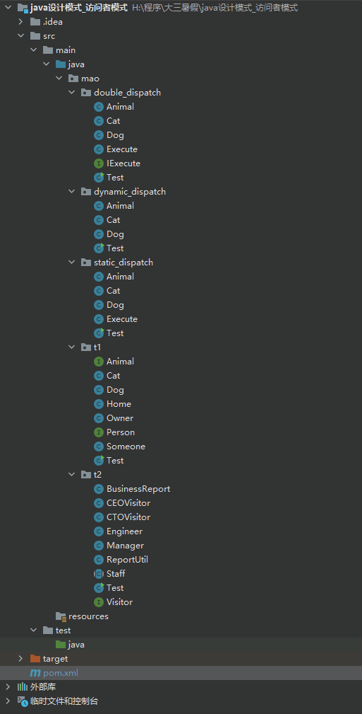


## 备忘录模式

### 概念

备忘录模式提供了一种状态恢复的实现机制，使得用户可以方便地回到一个特定的历史步骤，当新的状态无效或者存在问题时，可以使用暂时存储起来的备忘录将状态复原，很多软件都提供了撤销（Undo）操作，如 Word、记事本、Photoshop、IDEA等软件在编辑时按 Ctrl+Z 组合键时能撤销当前操作，使文档恢复到之前的状态；还有在 浏览器 中的后退键、数据库事务管理中的回滚操作、玩游戏时的中间结果存档功能、数据库与操作系统的备份操作、棋类游戏中的悔棋功能等都属于这类。

**定义：**

备忘录模式又叫快照模式，在不破坏封装性的前提下，捕获一个对象的内部状态，并在该对象之外保存这个状态，以便以后当需要时能将该对象恢复到原先保存的状态。


### 结构

备忘录模式的主要角色如下：

* 发起人（Originator）角色：记录当前时刻的内部状态信息，提供创建备忘录和恢复备忘录数据的功能，实现其他业务功能，它可以访问备忘录里的所有信息。
* 备忘录（Memento）角色：负责存储发起人的内部状态，在需要的时候提供这些内部状态给发起人。
* 管理者（Caretaker）角色：对备忘录进行管理，提供保存与获取备忘录的功能，但其不能对备忘录的内容进行访问与修改。


备忘录有两个等效的接口：

* **窄接口**：管理者(Caretaker)对象（和其他发起人对象之外的任何对象）看到的是备忘录的窄接口(narror Interface)，这个窄接口只允许他把备忘录对象传给其他的对象。
* **宽接口**：与管理者看到的窄接口相反，发起人对象可以看到一个宽接口(wide Interface)，这个宽接口允许它读取所有的数据，以便根据这些数据恢复这个发起人对象的内部状态。


### 示例

**游戏挑战BOSS**

游戏中的某个场景，一游戏角色有生命力、攻击力、防御力等数据，在打Boss前和后一定会不一样的，我们允许玩家如果感觉与Boss决斗的效果不理想可以让游戏恢复到决斗之前的状态。


要实现上述案例，有两种方式：

* “白箱”备忘录模式
* “黑箱”备忘录模式


#### “白箱”备忘录模式

备忘录角色对任何对象都提供一个接口，即宽接口，备忘录角色的内部所存储的状态就对所有对象公开。


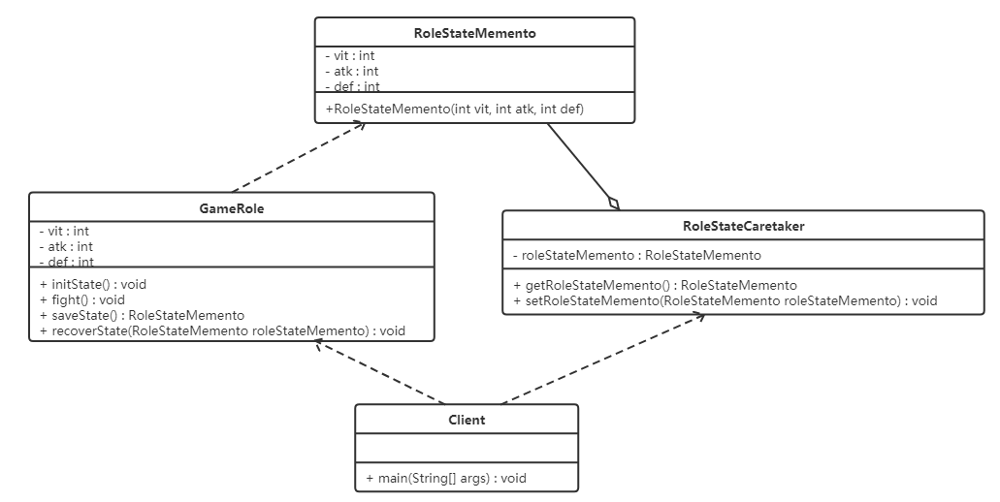


```java
package mao.white_box;


/**
 * Project name(项目名称)：java设计模式_备忘录模式
 * Package(包名): mao.white_box
 * Class(类名): GameRole
 * Author(作者）: mao
 * Author QQ：1296193245
 * GitHub：https://github.com/maomao124/
 * Date(创建日期)： 2022/8/23
 * Time(创建时间)： 19:36
 * Version(版本): 1.0
 * Description(描述)： 游戏角色类
 */

public class GameRole
{
    //生命力
    private int vit;
    //攻击力
    private int atk;
    //防御力
    private int def;

    /**
     * 初始化游戏角色的状态
     */
    public void initState()
    {
        this.vit = 100;
        this.atk = 100;
        this.def = 100;
    }

    /**
     * Instantiates a new Game role.
     */
    public GameRole()
    {
        this.initState();
    }

    /**
     * 获取随机数
     *
     * @param min 最小值
     * @param max 最大值
     * @return 一个随机数 int random
     */
    private int getIntRandom(int min, int max)
    {
        if (min > max)
        {
            min = max;
        }
        return min + (int) (Math.random() * (max - min + 1));
    }

    /**
     * 战斗方法，随机
     */
    public void fight()
    {
        this.vit = this.vit - getIntRandom(2, 15);
        if (Math.random() > 0.5)
        {
            this.atk = this.atk + getIntRandom(3, 10);
        }
        else
        {
            this.atk = this.atk - getIntRandom(5, 15);
        }
        if (Math.random() > 0.5)
        {
            this.def = this.def + getIntRandom(3, 10);
        }
        else
        {
            this.def = this.def - getIntRandom(5, 15);
        }
    }

    /**
     * 保存游戏的状态
     *
     * @return RoleStateMemento对象 role state memento
     */
    public RoleStateMemento saveState()
    {
        return new RoleStateMemento(vit, atk, def);
    }

    /**
     * 恢复状态
     *
     * @param roleStateMemento RoleStateMemento对象
     */
    public void recoverState(RoleStateMemento roleStateMemento)
    {
        this.vit = roleStateMemento.getVit();
        this.atk = roleStateMemento.getAtk();
        this.def = roleStateMemento.getDef();
    }

    /**
     * 显示当前状态
     */
    public void stateDisplay()
    {
        System.out.println("当前角色生命力：" + vit);
        System.out.println("当前角色攻击力：" + atk);
        System.out.println("当前角色防御力：" + def);
    }

    /**
     * Gets vit.
     *
     * @return the vit
     */
    public int getVit()
    {
        return vit;
    }

    /**
     * Gets atk.
     *
     * @return the atk
     */
    public int getAtk()
    {
        return atk;
    }

    /**
     * Gets def.
     *
     * @return the def
     */
    public int getDef()
    {
        return def;
    }
}
```


```java
package mao.white_box;

/**
 * Project name(项目名称)：java设计模式_备忘录模式
 * Package(包名): mao.white_box
 * Class(类名): RoleStateMemento
 * Author(作者）: mao
 * Author QQ：1296193245
 * GitHub：https://github.com/maomao124/
 * Date(创建日期)： 2022/8/23
 * Time(创建时间)： 19:43
 * Version(版本): 1.0
 * Description(描述)： 游戏状态存储类(备忘录类)
 */

public class RoleStateMemento
{
    private int vit;
    private int atk;
    private int def;

    /**
     * Instantiates a new Role state memento.
     *
     * @param vit the vit
     * @param atk the atk
     * @param def the def
     */
    public RoleStateMemento(int vit, int atk, int def)
    {
        this.vit = vit;
        this.atk = atk;
        this.def = def;
    }

    /**
     * Gets vit.
     *
     * @return the vit
     */
    public int getVit()
    {
        return vit;
    }

    /**
     * Sets vit.
     *
     * @param vit the vit
     * @return the vit
     */
    public RoleStateMemento setVit(int vit)
    {
        this.vit = vit;
        return this;
    }

    /**
     * Gets atk.
     *
     * @return the atk
     */
    public int getAtk()
    {
        return atk;
    }

    /**
     * Sets atk.
     *
     * @param atk the atk
     * @return the atk
     */
    public RoleStateMemento setAtk(int atk)
    {
        this.atk = atk;
        return this;
    }

    /**
     * Gets def.
     *
     * @return the def
     */
    public int getDef()
    {
        return def;
    }

    /**
     * Sets def.
     *
     * @param def the def
     * @return the def
     */
    public RoleStateMemento setDef(int def)
    {
        this.def = def;
        return this;
    }
}
```


```java
package mao.white_box;

/**
 * Project name(项目名称)：java设计模式_备忘录模式
 * Package(包名): mao.white_box
 * Class(类名): RoleStateCaretaker
 * Author(作者）: mao
 * Author QQ：1296193245
 * GitHub：https://github.com/maomao124/
 * Date(创建日期)： 2022/8/23
 * Time(创建时间)： 19:48
 * Version(版本): 1.0
 * Description(描述)： 角色状态管理者类
 */

public class RoleStateCaretaker
{
    private RoleStateMemento roleStateMemento;

    public RoleStateMemento getRoleStateMemento()
    {
        return roleStateMemento;
    }

    public void setRoleStateMemento(RoleStateMemento roleStateMemento)
    {
        this.roleStateMemento = roleStateMemento;
    }
}
```


```java
package mao.white_box;

/**
 * Project name(项目名称)：java设计模式_备忘录模式
 * Package(包名): mao.white_box
 * Class(类名): Test
 * Author(作者）: mao
 * Author QQ：1296193245
 * GitHub：https://github.com/maomao124/
 * Date(创建日期)： 2022/8/23
 * Time(创建时间)： 19:50
 * Version(版本): 1.0
 * Description(描述)： 无
 */

public class Test
{
    public static void main(String[] args)
    {
        GameRole gameRole = new GameRole();
        gameRole.stateDisplay();
        RoleStateMemento roleStateMemento = gameRole.saveState();
        RoleStateCaretaker roleStateCaretaker = new RoleStateCaretaker();
        roleStateCaretaker.setRoleStateMemento(roleStateMemento);
        System.out.println("------------");
        gameRole.fight();
        gameRole.stateDisplay();
        System.out.println("------------");
        gameRole.fight();
        gameRole.stateDisplay();
        System.out.println("------------");
        gameRole.fight();
        gameRole.stateDisplay();
        System.out.println("------------");
        //恢复
        gameRole.recoverState(roleStateCaretaker.getRoleStateMemento());
        gameRole.stateDisplay();
    }
}
```


运行结果：

```sh
当前角色生命力：100
当前角色攻击力：100
当前角色防御力：100
------------
当前角色生命力：94
当前角色攻击力：109
当前角色防御力：95
------------
当前角色生命力：82
当前角色攻击力：94
当前角色防御力：84
------------
当前角色生命力：68
当前角色攻击力：82
当前角色防御力：76
------------
当前角色生命力：100
当前角色攻击力：100
当前角色防御力：100
```

结果不唯一


**白箱备忘录模式是破坏封装性的**


#### “黑箱”备忘录模式


备忘录角色对发起人对象提供一个宽接口，而为其他对象提供一个窄接口。在Java语言中，实现双重接口的办法就是将**备忘录类**设计成**发起人类**的内部成员类。

将 `RoleStateMemento` 设为 `GameRole` 的内部类，从而将 `RoleStateMemento` 对象封装在 `GameRole` 里面；在外面提供一个标识接口 `Memento` 给 `RoleStateCaretaker` 及其他对象使用。这样 `GameRole` 类看到的是 `RoleStateMemento` 所有的接口，而`RoleStateCaretaker`  及其他对象看到的仅仅是标识接口 `Memento` 所暴露出来的接口，从而维护了封装型。


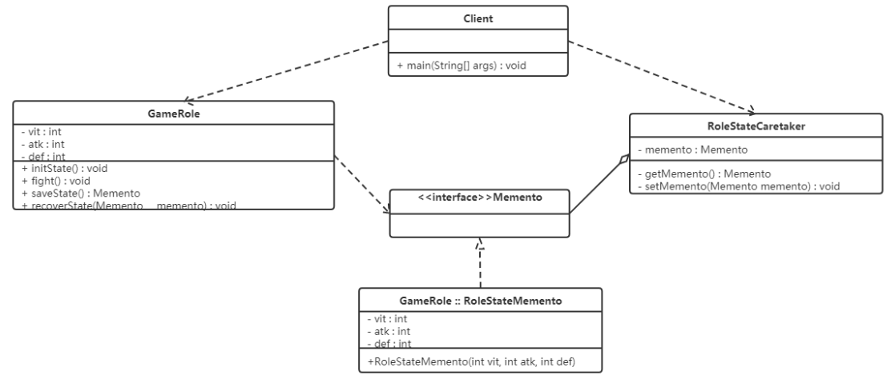


```java
package mao.black_box;

/**
 * Project name(项目名称)：java设计模式_备忘录模式
 * Package(包名): mao.black_box
 * Interface(接口名): Memento
 * Author(作者）: mao
 * Author QQ：1296193245
 * GitHub：https://github.com/maomao124/
 * Date(创建日期)： 2022/8/23
 * Time(创建时间)： 20:24
 * Version(版本): 1.0
 * Description(描述)： 无
 */

public interface Memento
{

}
```


```java
package mao.black_box;

/**
 * Project name(项目名称)：java设计模式_备忘录模式
 * Package(包名): mao.black_box
 * Class(类名): GameRole
 * Author(作者）: mao
 * Author QQ：1296193245
 * GitHub：https://github.com/maomao124/
 * Date(创建日期)： 2022/8/23
 * Time(创建时间)： 20:24
 * Version(版本): 1.0
 * Description(描述)： 无
 */


public class GameRole
{
    //生命力
    private int vit;
    //攻击力
    private int atk;
    //防御力
    private int def;

    /**
     * 初始化游戏角色的状态
     */
    public void initState()
    {
        this.vit = 100;
        this.atk = 100;
        this.def = 100;
    }

    /**
     * Instantiates a new Game role.
     */
    public GameRole()
    {
        this.initState();
    }

    /**
     * 获取随机数
     *
     * @param min 最小值
     * @param max 最大值
     * @return 一个随机数 int random
     */
    private int getIntRandom(int min, int max)
    {
        if (min > max)
        {
            min = max;
        }
        return min + (int) (Math.random() * (max - min + 1));
    }

    /**
     * 战斗方法，随机
     */
    public void fight()
    {
        this.vit = this.vit - getIntRandom(2, 15);
        if (Math.random() > 0.5)
        {
            this.atk = this.atk + getIntRandom(3, 10);
        }
        else
        {
            this.atk = this.atk - getIntRandom(5, 15);
        }
        if (Math.random() > 0.5)
        {
            this.def = this.def + getIntRandom(3, 10);
        }
        else
        {
            this.def = this.def - getIntRandom(5, 15);
        }
    }

    /**
     * 保存游戏的状态
     *
     * @return RoleStateMemento对象 role state memento
     */
    public RoleStateMemento saveState()
    {
        return new RoleStateMemento(vit, atk, def);
    }

    /**
     * 恢复状态
     *
     * @param memento Memento对象
     */
    public void recoverState(Memento memento)
    {
        RoleStateMemento roleStateMemento = (RoleStateMemento) memento;
        this.vit = roleStateMemento.getVit();
        this.atk = roleStateMemento.getAtk();
        this.def = roleStateMemento.getDef();
    }

    /**
     * 显示当前状态
     */
    public void stateDisplay()
    {
        System.out.println("当前角色生命力：" + vit);
        System.out.println("当前角色攻击力：" + atk);
        System.out.println("当前角色防御力：" + def);
    }

    /**
     * Gets vit.
     *
     * @return the vit
     */
    public int getVit()
    {
        return vit;
    }

    /**
     * Gets atk.
     *
     * @return the atk
     */
    public int getAtk()
    {
        return atk;
    }

    /**
     * Gets def.
     *
     * @return the def
     */
    public int getDef()
    {
        return def;
    }

    private class RoleStateMemento implements Memento
    {
        private int vit;
        private int atk;
        private int def;

        /**
         * Instantiates a new Role state memento.
         *
         * @param vit the vit
         * @param atk the atk
         * @param def the def
         */
        public RoleStateMemento(int vit, int atk, int def)
        {
            this.vit = vit;
            this.atk = atk;
            this.def = def;
        }

        /**
         * Gets vit.
         *
         * @return the vit
         */
        public int getVit()
        {
            return vit;
        }

        /**
         * Sets vit.
         *
         * @param vit the vit
         */
        public void setVit(int vit)
        {
            this.vit = vit;
        }

        /**
         * Gets atk.
         *
         * @return the atk
         */
        public int getAtk()
        {
            return atk;
        }

        /**
         * Sets atk.
         *
         * @param atk the atk
         */
        public void setAtk(int atk)
        {
            this.atk = atk;
        }

        /**
         * Gets def.
         *
         * @return the def
         */
        public int getDef()
        {
            return def;
        }

        /**
         * Sets def.
         *
         * @param def the def
         */
        public void setDef(int def)
        {
            this.def = def;
        }
    }
}
```


```java
package mao.black_box;

/**
 * Project name(项目名称)：java设计模式_备忘录模式
 * Package(包名): mao.black_box
 * Class(类名): RoleStateCaretaker
 * Author(作者）: mao
 * Author QQ：1296193245
 * GitHub：https://github.com/maomao124/
 * Date(创建日期)： 2022/8/23
 * Time(创建时间)： 20:26
 * Version(版本): 1.0
 * Description(描述)： 无
 */

public class RoleStateCaretaker
{
    private Memento memento;

    public Memento getMemento()
    {
        return memento;
    }

    public void setMemento(Memento memento)
    {
        this.memento = memento;
    }
}
```


```java
package mao.black_box;

/**
 * Project name(项目名称)：java设计模式_备忘录模式
 * Package(包名): mao.black_box
 * Class(类名): Test
 * Author(作者）: mao
 * Author QQ：1296193245
 * GitHub：https://github.com/maomao124/
 * Date(创建日期)： 2022/8/23
 * Time(创建时间)： 20:26
 * Version(版本): 1.0
 * Description(描述)： 无
 */

public class Test
{
    public static void main(String[] args)
    {
        GameRole gameRole = new GameRole();
        gameRole.stateDisplay();
        RoleStateCaretaker roleStateCaretaker = new RoleStateCaretaker();
        roleStateCaretaker.setMemento(gameRole.saveState());
        System.out.println("------------");
        gameRole.fight();
        gameRole.stateDisplay();
        System.out.println("------------");
        gameRole.fight();
        gameRole.stateDisplay();
        System.out.println("------------");
        gameRole.fight();
        gameRole.stateDisplay();
        System.out.println("------------");
        //恢复
        gameRole.recoverState(roleStateCaretaker.getMemento());
        gameRole.stateDisplay();
    }
}
```


运行结果：

```sh
当前角色生命力：100
当前角色攻击力：100
当前角色防御力：100
------------
当前角色生命力：94
当前角色攻击力：103
当前角色防御力：89
------------
当前角色生命力：91
当前角色攻击力：111
当前角色防御力：95
------------
当前角色生命力：88
当前角色攻击力：105
当前角色防御力：89
------------
当前角色生命力：100
当前角色攻击力：100
当前角色防御力：100
```


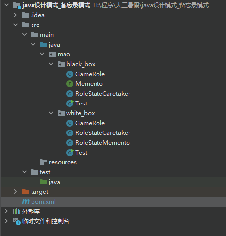


### 优缺点

**优点：**

- 提供了一种可以恢复状态的机制。当用户需要时能够比较方便地将数据恢复到某个历史的状态。
- 实现了内部状态的封装。除了创建它的发起人之外，其他对象都不能够访问这些状态信息。
- 简化了发起人类。发起人不需要管理和保存其内部状态的各个备份，所有状态信息都保存在备忘录中，并由管理者进行管理，这符合单一职责原则。

**缺点：**

* 资源消耗大。如果要保存的内部状态信息过多或者特别频繁，将会占用比较大的内存资源。


### 使用场景

* 需要保存与恢复数据的场景，如玩游戏时的中间结果的存档功能。
* 需要提供一个可回滚操作的场景，如 Word、记事本、Photoshop，idea等软件在编辑时按 Ctrl+Z 组合键，还有数据库中事务操作。


## 解释器模式

### 概念

设计一个软件用来进行加减计算：

```java
//用于两个整数相加
public static int add(int a,int b)
{
    return a + b;
}

//用于两个整数相加
public static int add(int a,int b,int c)
{
    return a + b + c;
}

//用于n个整数相加
public static int add(Integer ... arr) 
{
    int sum = 0;
    for (Integer i : arr) 
    {
        sum += i;
    }
    return sum;
}
```


上面的形式比较单一、有限，如果形式变化非常多，这就不符合要求，因为加法和减法运算，两个运算符与数值可以有无限种组合方式。比如 1+2+3+4+5、1+2+3-4等等。   

显然，现在需要一种翻译识别机器，能够解析由数字以及 + - 符号构成的合法的运算序列。如果把运算符和数字都看作节点的话，能够逐个节点的进行读取解析运算，这就是解释器模式的思维


定义：

给定一个语言，定义它的文法表示，并定义一个解释器，这个解释器使用该标识来解释语言中的句子


在解释器模式中，我们需要将待解决的问题，提取出规则，抽象为一种“语言”。比如加减法运算，规则为：由数值和+-符号组成的合法序列，“1+3-2” 就是这种语言的句子


**文法（语法）规则：**

文法是用于描述语言的语法结构的形式规则。

```
expression ::= value | plus | minus
plus ::= expression ‘+’ expression   
minus ::= expression ‘-’ expression  
value ::= integer
```


 这里的符号“::=”表示“定义为”的意思，竖线 | 表示或，左右的其中一个，引号内为字符本身，引号外为语法

上面规则描述为 ：

表达式可以是一个值，也可以是plus或者minus运算，而plus和minus又是由表达式结合运算符构成，值的类型为整型数


**抽象语法树：**

在计算机科学中，抽象语法树（AbstractSyntaxTree，AST），或简称语法树（Syntax tree），是源代码语法结构的一种抽象表示。它以树状的形式表现编程语言的语法结构，树上的每个节点都表示源代码中的一种结构。


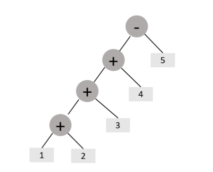


### 结构

解释器模式包含以下主要角色。

* 抽象表达式（Abstract Expression）角色：定义解释器的接口，约定解释器的解释操作，主要包含解释方法 interpret()。
* 终结符表达式（Terminal  Expression）角色：是抽象表达式的子类，用来实现文法中与终结符相关的操作，文法中的每一个终结符都有一个具体终结表达式与之相对应。
* 非终结符表达式（Nonterminal Expression）角色：也是抽象表达式的子类，用来实现文法中与非终结符相关的操作，文法中的每条规则都对应于一个非终结符表达式。
* 环境（Context）角色：通常包含各个解释器需要的数据或是公共的功能，一般用来传递被所有解释器共享的数据，后面的解释器可以从这里获取这些值。
* 客户端（Client）：主要任务是将需要分析的句子或表达式转换成使用解释器对象描述的抽象语法树，然后调用解释器的解释方法，当然也可以通过环境角色间接访问解释器的解释方法。


### 示例

设计实现加减法的软件


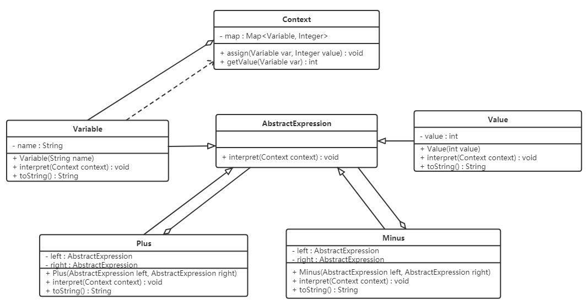


```java
package mao;

/**
 * Project name(项目名称)：java设计模式_解释器模式
 * Package(包名): mao
 * Class(类名): AbstractExpression
 * Author(作者）: mao
 * Author QQ：1296193245
 * GitHub：https://github.com/maomao124/
 * Date(创建日期)： 2022/8/24
 * Time(创建时间)： 12:18
 * Version(版本): 1.0
 * Description(描述)： 无
 */

public abstract class AbstractExpression
{
    public abstract int interpret(Context context);
}
```


```java
package mao;

/**
 * Project name(项目名称)：java设计模式_解释器模式
 * Package(包名): mao
 * Class(类名): Plus
 * Author(作者）: mao
 * Author QQ：1296193245
 * GitHub：https://github.com/maomao124/
 * Date(创建日期)： 2022/8/24
 * Time(创建时间)： 12:20
 * Version(版本): 1.0
 * Description(描述)： 非终结符表达式角色  加法表达式
 */

public class Plus extends AbstractExpression
{
    private final AbstractExpression left;
    private final AbstractExpression right;

    public Plus(AbstractExpression left, AbstractExpression right)
    {
        this.left = left;
        this.right = right;
    }

    @Override
    public int interpret(Context context)
    {
        return left.interpret(context) + right.interpret(context);
    }

    @Override
    public String toString()
    {
        return "(" + left.toString() + " + " + right.toString() + ")";
    }
}
```


```java
package mao;

/**
 * Project name(项目名称)：java设计模式_解释器模式
 * Package(包名): mao
 * Class(类名): Minus
 * Author(作者）: mao
 * Author QQ：1296193245
 * GitHub：https://github.com/maomao124/
 * Date(创建日期)： 2022/8/24
 * Time(创建时间)： 12:21
 * Version(版本): 1.0
 * Description(描述)： 非终结符表达式角色 减法表达式
 */

public class Minus extends AbstractExpression
{
    private final AbstractExpression left;
    private final AbstractExpression right;

    public Minus(AbstractExpression left, AbstractExpression right)
    {
        this.left = left;
        this.right = right;
    }

    @Override
    public int interpret(Context context)
    {
        return left.interpret(context) - right.interpret(context);
    }

    @Override
    public String toString()
    {
        return "(" + left.toString() + " - " + right.toString() + ")";
    }
}
```


```java
package mao;

/**
 * Project name(项目名称)：java设计模式_解释器模式
 * Package(包名): mao
 * Class(类名): Value
 * Author(作者）: mao
 * Author QQ：1296193245
 * GitHub：https://github.com/maomao124/
 * Date(创建日期)： 2022/8/24
 * Time(创建时间)： 12:18
 * Version(版本): 1.0
 * Description(描述)： 无
 */

public class Value extends AbstractExpression
{
    private final int value;

    public Value(int value)
    {
        this.value = value;
    }

    @Override
    public int interpret(Context context)
    {
        return value;
    }

    @Override
    public String toString()
    {
        return String.valueOf(value);
    }
}
```


```java
package mao;

/**
 * Project name(项目名称)：java设计模式_解释器模式
 * Package(包名): mao
 * Class(类名): Variable
 * Author(作者）: mao
 * Author QQ：1296193245
 * GitHub：https://github.com/maomao124/
 * Date(创建日期)： 2022/8/24
 * Time(创建时间)： 12:22
 * Version(版本): 1.0
 * Description(描述)： 终结符表达式角色 变量表达式
 */

public class Variable extends AbstractExpression
{
    private final String name;

    public Variable(String name)
    {
        this.name = name;
    }

    @Override
    public int interpret(Context context)
    {
        return context.getValue(this);
    }

    @Override
    public String toString()
    {
        return name;
    }
}
```


```java
package mao;

import java.util.HashMap;
import java.util.Map;

/**
 * Project name(项目名称)：java设计模式_解释器模式
 * Package(包名): mao
 * Class(类名): Context
 * Author(作者）: mao
 * Author QQ：1296193245
 * GitHub：https://github.com/maomao124/
 * Date(创建日期)： 2022/8/24
 * Time(创建时间)： 12:23
 * Version(版本): 1.0
 * Description(描述)： 环境类
 */

public class Context
{
    private final Map<Variable, Integer> map;

    public Context()
    {
        this.map = new HashMap<>();
    }

    public void assign(Variable var, Integer value)
    {
        map.put(var, value);
    }

    public int getValue(Variable var)
    {
        return map.get(var);
    }
}
```


```java
package mao;

/**
 * Project name(项目名称)：java设计模式_解释器模式
 * Package(包名): mao
 * Class(类名): Test
 * Author(作者）: mao
 * Author QQ：1296193245
 * GitHub：https://github.com/maomao124/
 * Date(创建日期)： 2022/8/24
 * Time(创建时间)： 12:26
 * Version(版本): 1.0
 * Description(描述)： 无
 */

public class Test
{
    public static void main(String[] args)
    {
        Context context = new Context();
        //变量
        Variable a = new Variable("a");
        Variable b = new Variable("b");
        Variable c = new Variable("c");
        Variable d = new Variable("d");
        Variable e = new Variable("e");

        context.assign(a, 1);
        context.assign(b, 2);
        context.assign(c, 3);
        context.assign(d, 4);
        context.assign(e, 5);

        //(a + ((b + (c - d)) - e))
        //(1 + ((2 + (3 - 4)) - 5))
        AbstractExpression abstractExpression = new Plus(a, new Minus(new Plus(b, new Minus(c, d)), e));
        int result = abstractExpression.interpret(context);
        System.out.println(abstractExpression);
        System.out.println(result);

        //(4 + (6 - 3))
        AbstractExpression abstractExpression1 = new Plus(new Value(4), new Minus(new Value(6), new Value(3)));
        System.out.println(abstractExpression1);
        int interpret = abstractExpression1.interpret(new Context());
        System.out.println(interpret);

    }
}
```


运行结果：

```sh
(a + ((b + (c - d)) - e))
-3
(4 + (6 - 3))
7
```


### 优缺点

**优点：**

* 易于改变和扩展文法。

  由于在解释器模式中使用类来表示语言的文法规则，因此可以通过继承等机制来改变或扩展文法。每一条文法规则都可以表示为一个类，因此可以方便地实现一个简单的语言。

* 实现文法较为容易。

  在抽象语法树中每一个表达式节点类的实现方式都是相似的，这些类的代码编写都不会特别复杂。

* 增加新的解释表达式较为方便。

  如果用户需要增加新的解释表达式只需要对应增加一个新的终结符表达式或非终结符表达式类，原有表达式类代码无须修改，符合 "开闭原则"。

**缺点：**

- 对于复杂文法难以维护。

  在解释器模式中，每一条规则至少需要定义一个类，因此如果一个语言包含太多文法规则，类的个数将会急剧增加，导致系统难以管理和维护。

* 执行效率较低。

  由于在解释器模式中使用了大量的循环和递归调用，因此在解释较为复杂的句子时其速度很慢，而且代码的调试过程也比较麻烦。


### 使用场景

* 当语言的文法较为简单，且执行效率不是关键问题时。
* 当问题重复出现，且可以用一种简单的语言来进行表达时。
* 当一个语言需要解释执行，并且语言中的句子可以表示为一个抽象语法树的时候。


# 自定义Spring框架


## 使用

**引入依赖：**

```xml
<dependencies>
        <!--Spring核心基础依赖-->
        <dependency>
            <groupId>org.springframework</groupId>
            <artifactId>spring-core</artifactId>
            <version>5.3.16</version>
        </dependency>
        <dependency>
            <groupId>org.springframework</groupId>
            <artifactId>spring-context</artifactId>
            <version>5.3.16</version>
        </dependency>
        <dependency>
            <groupId>org.springframework</groupId>
            <artifactId>spring-beans</artifactId>
            <version>5.3.16</version>
        </dependency>
        <dependency>
            <groupId>org.springframework</groupId>
            <artifactId>spring-expression</artifactId>
            <version>5.3.16</version>
        </dependency>
        <!--spring注解，初始化回调方法和销毁回调方法注解-->
        <dependency>
            <groupId>jakarta.annotation</groupId>
            <artifactId>jakarta.annotation-api</artifactId>
            <version>2.0.0</version>
        </dependency>
        <!--注解实现Spring自动装配-->
        <dependency>
            <groupId>org.springframework</groupId>
            <artifactId>spring-aop</artifactId>
            <version>5.3.16</version>
        </dependency>
        <!--spring-aspects-->
        <dependency>
            <groupId>org.springframework</groupId>
            <artifactId>spring-aspects</artifactId>
            <version>5.3.16</version>
        </dependency>
        <!--日志相关-->
        <dependency>
            <groupId>commons-logging</groupId>
            <artifactId>commons-logging</artifactId>
            <version>1.2</version>
        </dependency>
    </dependencies>
```


**编写业务代码：**


```java
package mao.use;

/**
 * Project name(项目名称)：java设计模式_自定义Spring框架
 * Package(包名): mao.use
 * Interface(接口名): UserDao
 * Author(作者）: mao
 * Author QQ：1296193245
 * GitHub：https://github.com/maomao124/
 * Date(创建日期)： 2022/8/24
 * Time(创建时间)： 20:47
 * Version(版本): 1.0
 * Description(描述)： 无
 */

public interface UserDao
{
    void add();
}
```


```java
package mao.use;


import org.apache.commons.logging.Log;
import org.apache.commons.logging.LogFactory;

/**
 * Project name(项目名称)：java设计模式_自定义Spring框架
 * Package(包名): mao.use
 * Class(类名): UserDaoImpl
 * Author(作者）: mao
 * Author QQ：1296193245
 * GitHub：https://github.com/maomao124/
 * Date(创建日期)： 2022/8/24
 * Time(创建时间)： 20:47
 * Version(版本): 1.0
 * Description(描述)： 无
 */

public class UserDaoImpl implements UserDao
{
    private static final Log log = LogFactory.getLog(UserDaoImpl.class);

    @Override
    public void add()
    {
        log.info("UserDaoImpl");
    }
}
```


```java
package mao.use;

/**
 * Project name(项目名称)：java设计模式_自定义Spring框架
 * Package(包名): mao.use
 * Interface(接口名): UserService
 * Author(作者）: mao
 * Author QQ：1296193245
 * GitHub：https://github.com/maomao124/
 * Date(创建日期)： 2022/8/24
 * Time(创建时间)： 20:49
 * Version(版本): 1.0
 * Description(描述)： 无
 */

public interface UserService
{
    void add();
}
```


```java
package mao.use;

import org.apache.commons.logging.Log;
import org.apache.commons.logging.LogFactory;

/**
 * Project name(项目名称)：java设计模式_自定义Spring框架
 * Package(包名): mao.use
 * Class(类名): UserServiceImpl
 * Author(作者）: mao
 * Author QQ：1296193245
 * GitHub：https://github.com/maomao124/
 * Date(创建日期)： 2022/8/24
 * Time(创建时间)： 20:49
 * Version(版本): 1.0
 * Description(描述)： 无
 */

public class UserServiceImpl implements UserService
{
    private UserDao userDao;

    private static final Log log = LogFactory.getLog(UserServiceImpl.class);

    public void setUserDao(UserDao userDao)
    {
        this.userDao = userDao;
    }

    @Override
    public void add()
    {
        log.info("UserServiceImpl");
        userDao.add();
    }
}
```


```java
package mao.use;

import org.springframework.context.ApplicationContext;
import org.springframework.context.support.ClassPathXmlApplicationContext;

/**
 * Project name(项目名称)：java设计模式_自定义Spring框架
 * Package(包名): mao.use
 * Class(类名): UserController
 * Author(作者）: mao
 * Author QQ：1296193245
 * GitHub：https://github.com/maomao124/
 * Date(创建日期)： 2022/8/24
 * Time(创建时间)： 20:51
 * Version(版本): 1.0
 * Description(描述)： 无
 */

public class UserController
{
    public static void main(String[] args)
    {
        ApplicationContext applicationContext = new ClassPathXmlApplicationContext("beans.xml");
        UserService userService = applicationContext.getBean(UserServiceImpl.class);
        userService.add();
    }
}
```


**在类路径下编写beans.xml文件**

```xml
<?xml version="1.0" encoding="UTF-8"?>
<beans xmlns="http://www.springframework.org/schema/beans"
       xmlns:xsi="http://www.w3.org/2001/XMLSchema-instance"
       xsi:schemaLocation="http://www.springframework.org/schema/beans http://www.springframework.org/schema/beans/spring-beans.xsd">

    <bean id="userDao" class="mao.use.UserDaoImpl"/>

    <bean id="userService" class="mao.use.UserServiceImpl">
        <property name="userDao" ref="userDao"/>
    </bean>

</beans>
```


**运行结果：**

```sh
8月 24, 2022 8:59:55 下午 mao.use.UserServiceImpl add
信息: UserServiceImpl
8月 24, 2022 8:59:55 下午 mao.use.UserDaoImpl add
信息: UserDaoImpl
```


该示例体现了Spring框架的IOC（Inversion of Control）和DI（Dependency Injection, DI）


## 核心功能结构

Spring大约有20个模块，由1300多个不同的文件构成。这些模块可以分为:

核心容器、AOP和设备支持、数据访问与集成、Web组件、通信报文和集成测试等


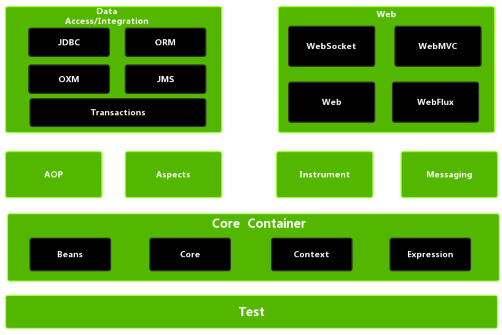


核心容器由 beans、core、context 和 expression（Spring Expression Language，SpEL）4个模块组成。

* spring-beans和spring-core模块是Spring框架的核心模块，包含了控制反转（Inversion of Control，IOC）和依赖注入（Dependency Injection，DI）。BeanFactory使用控制反转对应用程序的配置和依赖性规范与实际的应用程序代码进行了分离。BeanFactory属于延时加载，也就是说在实例化容器对象后并不会自动实例化Bean，只有当Bean被使用时，BeanFactory才会对该 Bean 进行实例化与依赖关系的装配。
* spring-context模块构架于核心模块之上，扩展了BeanFactory，为它添加了Bean生命周期控制、框架事件体系及资源加载透明化等功能。此外，该模块还提供了许多企业级支持，如邮件访问、远程访问、任务调度等，ApplicationContext 是该模块的核心接口，它的超类是 BeanFactory。与BeanFactory不同，ApplicationContext实例化后会自动对所有的单实例Bean进行实例化与依赖关系的装配，使之处于待用状态。
* spring-context-support模块是对Spring IoC容器及IoC子容器的扩展支持。
* spring-context-indexer模块是Spring的类管理组件和Classpath扫描组件。
* spring-expression 模块是统一表达式语言（EL）的扩展模块，可以查询、管理运行中的对象，同时也可以方便地调用对象方法，以及操作数组、集合等。它的语法类似于传统EL，但提供了额外的功能，最出色的要数函数调用和简单字符串的模板函数。EL的特性是基于Spring产品的需求而设计的，可以非常方便地同Spring IoC进行交互。


## Spring IOC相关接口

### BeanFactory

Spring中Bean的创建是典型的工厂模式，这一系列的Bean工厂，即IoC容器，为开发者管理对象之间的依赖关系提供了很多便利和基础服务，在Spring中有许多IoC容器的实现供用户选择


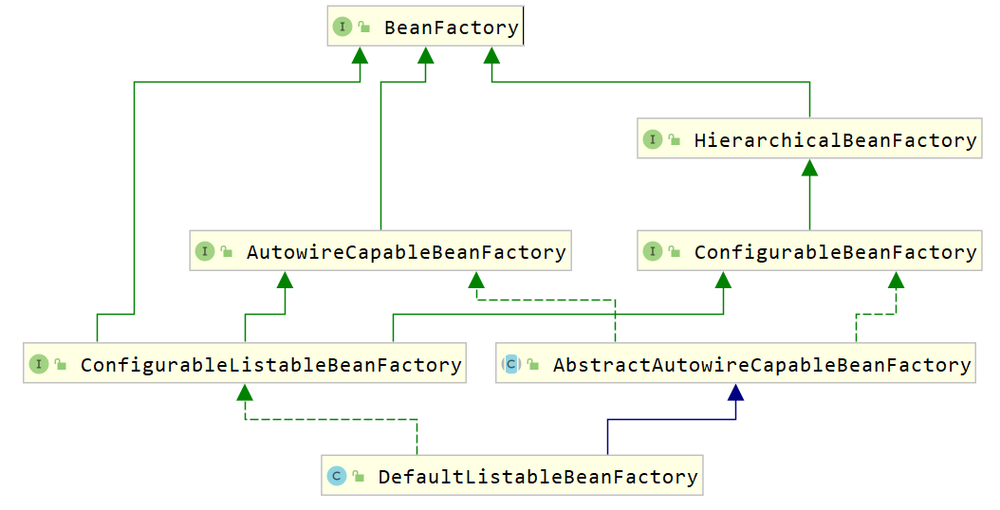


其中，BeanFactory作为最顶层的一个接口，定义了IoC容器的基本功能规范，BeanFactory有三个重要的子接口：ListableBeanFactory、HierarchicalBeanFactory和AutowireCapableBeanFactory。但是从类图中我们可以发现最终的默认实现类是DefaultListableBeanFactory，它实现了所有的接口。

那么为何要定义这么多层次的接口呢？

每个接口都有它的使用场合，主要是为了区分在Spring内部操作过程中对象的传递和转化，对对象的数据访问所做的限制。例如，

* ListableBeanFactory接口表示这些Bean可列表化。
* HierarchicalBeanFactory表示这些Bean 是有继承关系的，也就是每个 Bean 可能有父 Bean
* AutowireCapableBeanFactory 接口定义Bean的自动装配规则。


```java
public interface BeanFactory {

   /**
    * Used to dereference a {@link FactoryBean} instance and distinguish it from
    * beans <i>created</i> by the FactoryBean. For example, if the bean named
    * {@code myJndiObject} is a FactoryBean, getting {@code &myJndiObject}
    * will return the factory, not the instance returned by the factory.
    */
   String FACTORY_BEAN_PREFIX = "&";


   /**
    * Return an instance, which may be shared or independent, of the specified bean.
    * <p>This method allows a Spring BeanFactory to be used as a replacement for the
    * Singleton or Prototype design pattern. Callers may retain references to
    * returned objects in the case of Singleton beans.
    * <p>Translates aliases back to the corresponding canonical bean name.
    * <p>Will ask the parent factory if the bean cannot be found in this factory instance.
    * @param name the name of the bean to retrieve
    * @return an instance of the bean
    * @throws NoSuchBeanDefinitionException if there is no bean with the specified name
    * @throws BeansException if the bean could not be obtained
    */
   Object getBean(String name) throws BeansException;

   /**
    * Return an instance, which may be shared or independent, of the specified bean.
    * <p>Behaves the same as {@link #getBean(String)}, but provides a measure of type
    * safety by throwing a BeanNotOfRequiredTypeException if the bean is not of the
    * required type. This means that ClassCastException can't be thrown on casting
    * the result correctly, as can happen with {@link #getBean(String)}.
    * <p>Translates aliases back to the corresponding canonical bean name.
    * <p>Will ask the parent factory if the bean cannot be found in this factory instance.
    * @param name the name of the bean to retrieve
    * @param requiredType type the bean must match; can be an interface or superclass
    * @return an instance of the bean
    * @throws NoSuchBeanDefinitionException if there is no such bean definition
    * @throws BeanNotOfRequiredTypeException if the bean is not of the required type
    * @throws BeansException if the bean could not be created
    */
   <T> T getBean(String name, Class<T> requiredType) throws BeansException;

   /**
    * Return an instance, which may be shared or independent, of the specified bean.
    * <p>Allows for specifying explicit constructor arguments / factory method arguments,
    * overriding the specified default arguments (if any) in the bean definition.
    * @param name the name of the bean to retrieve
    * @param args arguments to use when creating a bean instance using explicit arguments
    * (only applied when creating a new instance as opposed to retrieving an existing one)
    * @return an instance of the bean
    * @throws NoSuchBeanDefinitionException if there is no such bean definition
    * @throws BeanDefinitionStoreException if arguments have been given but
    * the affected bean isn't a prototype
    * @throws BeansException if the bean could not be created
    * @since 2.5
    */
   Object getBean(String name, Object... args) throws BeansException;

   /**
    * Return the bean instance that uniquely matches the given object type, if any.
    * <p>This method goes into {@link ListableBeanFactory} by-type lookup territory
    * but may also be translated into a conventional by-name lookup based on the name
    * of the given type. For more extensive retrieval operations across sets of beans,
    * use {@link ListableBeanFactory} and/or {@link BeanFactoryUtils}.
    * @param requiredType type the bean must match; can be an interface or superclass
    * @return an instance of the single bean matching the required type
    * @throws NoSuchBeanDefinitionException if no bean of the given type was found
    * @throws NoUniqueBeanDefinitionException if more than one bean of the given type was found
    * @throws BeansException if the bean could not be created
    * @since 3.0
    * @see ListableBeanFactory
    */
   <T> T getBean(Class<T> requiredType) throws BeansException;

   /**
    * Return an instance, which may be shared or independent, of the specified bean.
    * <p>Allows for specifying explicit constructor arguments / factory method arguments,
    * overriding the specified default arguments (if any) in the bean definition.
    * <p>This method goes into {@link ListableBeanFactory} by-type lookup territory
    * but may also be translated into a conventional by-name lookup based on the name
    * of the given type. For more extensive retrieval operations across sets of beans,
    * use {@link ListableBeanFactory} and/or {@link BeanFactoryUtils}.
    * @param requiredType type the bean must match; can be an interface or superclass
    * @param args arguments to use when creating a bean instance using explicit arguments
    * (only applied when creating a new instance as opposed to retrieving an existing one)
    * @return an instance of the bean
    * @throws NoSuchBeanDefinitionException if there is no such bean definition
    * @throws BeanDefinitionStoreException if arguments have been given but
    * the affected bean isn't a prototype
    * @throws BeansException if the bean could not be created
    * @since 4.1
    */
   <T> T getBean(Class<T> requiredType, Object... args) throws BeansException;

   /**
    * Return a provider for the specified bean, allowing for lazy on-demand retrieval
    * of instances, including availability and uniqueness options.
    * <p>For matching a generic type, consider {@link #getBeanProvider(ResolvableType)}.
    * @param requiredType type the bean must match; can be an interface or superclass
    * @return a corresponding provider handle
    * @since 5.1
    * @see #getBeanProvider(ResolvableType)
    */
   <T> ObjectProvider<T> getBeanProvider(Class<T> requiredType);

   /**
    * Return a provider for the specified bean, allowing for lazy on-demand retrieval
    * of instances, including availability and uniqueness options. This variant allows
    * for specifying a generic type to match, similar to reflective injection points
    * with generic type declarations in method/constructor parameters.
    * <p>Note that collections of beans are not supported here, in contrast to reflective
    * injection points. For programmatically retrieving a list of beans matching a
    * specific type, specify the actual bean type as an argument here and subsequently
    * use {@link ObjectProvider#orderedStream()} or its lazy streaming/iteration options.
    * <p>Also, generics matching is strict here, as per the Java assignment rules.
    * For lenient fallback matching with unchecked semantics (similar to the ´unchecked´
    * Java compiler warning), consider calling {@link #getBeanProvider(Class)} with the
    * raw type as a second step if no full generic match is
    * {@link ObjectProvider#getIfAvailable() available} with this variant.
    * @return a corresponding provider handle
    * @param requiredType type the bean must match; can be a generic type declaration
    * @since 5.1
    * @see ObjectProvider#iterator()
    * @see ObjectProvider#stream()
    * @see ObjectProvider#orderedStream()
    */
   <T> ObjectProvider<T> getBeanProvider(ResolvableType requiredType);

   /**
    * Does this bean factory contain a bean definition or externally registered singleton
    * instance with the given name?
    * <p>If the given name is an alias, it will be translated back to the corresponding
    * canonical bean name.
    * <p>If this factory is hierarchical, will ask any parent factory if the bean cannot
    * be found in this factory instance.
    * <p>If a bean definition or singleton instance matching the given name is found,
    * this method will return {@code true} whether the named bean definition is concrete
    * or abstract, lazy or eager, in scope or not. Therefore, note that a {@code true}
    * return value from this method does not necessarily indicate that {@link #getBean}
    * will be able to obtain an instance for the same name.
    * @param name the name of the bean to query
    * @return whether a bean with the given name is present
    */
   boolean containsBean(String name);

   /**
    * Is this bean a shared singleton? That is, will {@link #getBean} always
    * return the same instance?
    * <p>Note: This method returning {@code false} does not clearly indicate
    * independent instances. It indicates non-singleton instances, which may correspond
    * to a scoped bean as well. Use the {@link #isPrototype} operation to explicitly
    * check for independent instances.
    * <p>Translates aliases back to the corresponding canonical bean name.
    * <p>Will ask the parent factory if the bean cannot be found in this factory instance.
    * @param name the name of the bean to query
    * @return whether this bean corresponds to a singleton instance
    * @throws NoSuchBeanDefinitionException if there is no bean with the given name
    * @see #getBean
    * @see #isPrototype
    */
   boolean isSingleton(String name) throws NoSuchBeanDefinitionException;

   /**
    * Is this bean a prototype? That is, will {@link #getBean} always return
    * independent instances?
    * <p>Note: This method returning {@code false} does not clearly indicate
    * a singleton object. It indicates non-independent instances, which may correspond
    * to a scoped bean as well. Use the {@link #isSingleton} operation to explicitly
    * check for a shared singleton instance.
    * <p>Translates aliases back to the corresponding canonical bean name.
    * <p>Will ask the parent factory if the bean cannot be found in this factory instance.
    * @param name the name of the bean to query
    * @return whether this bean will always deliver independent instances
    * @throws NoSuchBeanDefinitionException if there is no bean with the given name
    * @since 2.0.3
    * @see #getBean
    * @see #isSingleton
    */
   boolean isPrototype(String name) throws NoSuchBeanDefinitionException;

   /**
    * Check whether the bean with the given name matches the specified type.
    * More specifically, check whether a {@link #getBean} call for the given name
    * would return an object that is assignable to the specified target type.
    * <p>Translates aliases back to the corresponding canonical bean name.
    * <p>Will ask the parent factory if the bean cannot be found in this factory instance.
    * @param name the name of the bean to query
    * @param typeToMatch the type to match against (as a {@code ResolvableType})
    * @return {@code true} if the bean type matches,
    * {@code false} if it doesn't match or cannot be determined yet
    * @throws NoSuchBeanDefinitionException if there is no bean with the given name
    * @since 4.2
    * @see #getBean
    * @see #getType
    */
   boolean isTypeMatch(String name, ResolvableType typeToMatch) throws NoSuchBeanDefinitionException;

   /**
    * Check whether the bean with the given name matches the specified type.
    * More specifically, check whether a {@link #getBean} call for the given name
    * would return an object that is assignable to the specified target type.
    * <p>Translates aliases back to the corresponding canonical bean name.
    * <p>Will ask the parent factory if the bean cannot be found in this factory instance.
    * @param name the name of the bean to query
    * @param typeToMatch the type to match against (as a {@code Class})
    * @return {@code true} if the bean type matches,
    * {@code false} if it doesn't match or cannot be determined yet
    * @throws NoSuchBeanDefinitionException if there is no bean with the given name
    * @since 2.0.1
    * @see #getBean
    * @see #getType
    */
   boolean isTypeMatch(String name, Class<?> typeToMatch) throws NoSuchBeanDefinitionException;

   /**
    * Determine the type of the bean with the given name. More specifically,
    * determine the type of object that {@link #getBean} would return for the given name.
    * <p>For a {@link FactoryBean}, return the type of object that the FactoryBean creates,
    * as exposed by {@link FactoryBean#getObjectType()}. This may lead to the initialization
    * of a previously uninitialized {@code FactoryBean} (see {@link #getType(String, boolean)}).
    * <p>Translates aliases back to the corresponding canonical bean name.
    * <p>Will ask the parent factory if the bean cannot be found in this factory instance.
    * @param name the name of the bean to query
    * @return the type of the bean, or {@code null} if not determinable
    * @throws NoSuchBeanDefinitionException if there is no bean with the given name
    * @since 1.1.2
    * @see #getBean
    * @see #isTypeMatch
    */
   @Nullable
   Class<?> getType(String name) throws NoSuchBeanDefinitionException;

   /**
    * Determine the type of the bean with the given name. More specifically,
    * determine the type of object that {@link #getBean} would return for the given name.
    * <p>For a {@link FactoryBean}, return the type of object that the FactoryBean creates,
    * as exposed by {@link FactoryBean#getObjectType()}. Depending on the
    * {@code allowFactoryBeanInit} flag, this may lead to the initialization of a previously
    * uninitialized {@code FactoryBean} if no early type information is available.
    * <p>Translates aliases back to the corresponding canonical bean name.
    * <p>Will ask the parent factory if the bean cannot be found in this factory instance.
    * @param name the name of the bean to query
    * @param allowFactoryBeanInit whether a {@code FactoryBean} may get initialized
    * just for the purpose of determining its object type
    * @return the type of the bean, or {@code null} if not determinable
    * @throws NoSuchBeanDefinitionException if there is no bean with the given name
    * @since 5.2
    * @see #getBean
    * @see #isTypeMatch
    */
   @Nullable
   Class<?> getType(String name, boolean allowFactoryBeanInit) throws NoSuchBeanDefinitionException;

   /**
    * Return the aliases for the given bean name, if any.
    * <p>All of those aliases point to the same bean when used in a {@link #getBean} call.
    * <p>If the given name is an alias, the corresponding original bean name
    * and other aliases (if any) will be returned, with the original bean name
    * being the first element in the array.
    * <p>Will ask the parent factory if the bean cannot be found in this factory instance.
    * @param name the bean name to check for aliases
    * @return the aliases, or an empty array if none
    * @see #getBean
    */
   String[] getAliases(String name);

}
```


BeanFactory有一个很重要的子接口，就是ApplicationContext接口，该接口主要来规范容器中的bean对象是非延时加载，即在创建容器对象的时候就对象bean进行初始化，并存储到一个容器中。


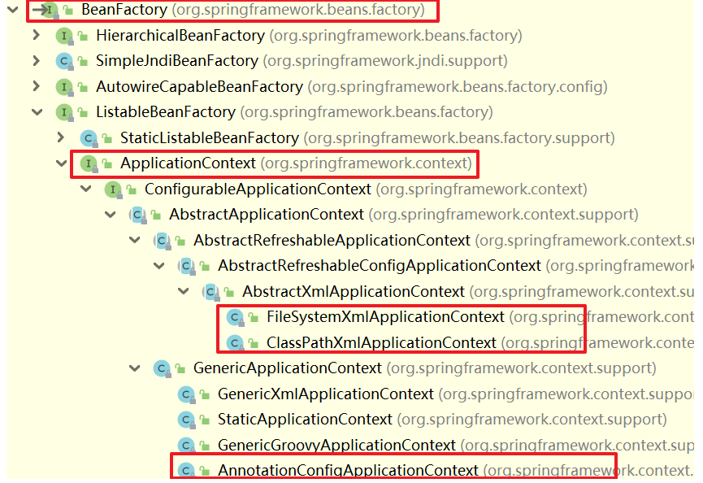


要知道工厂是如何产生对象的，我们需要看具体的IoC容器实现，Spring提供了许多IoC容器实现，比如：

* ClasspathXmlApplicationContext : 根据类路径加载xml配置文件，并创建IOC容器对象。
* FileSystemXmlApplicationContext ：根据系统路径加载xml配置文件，并创建IOC容器对象。
* AnnotationConfigApplicationContext ：加载注解类配置，并创建IOC容器。


### BeanDefinition

Spring IoC容器管理我们定义的各种Bean对象及其相互关系，而Bean对象在Spring实现中是以BeanDefinition来描述的

比如：

```xml
    <bean id="userService" class="mao.use.UserServiceImpl">
        <property name="userDao" ref="userDao"/>
    </bean>
```


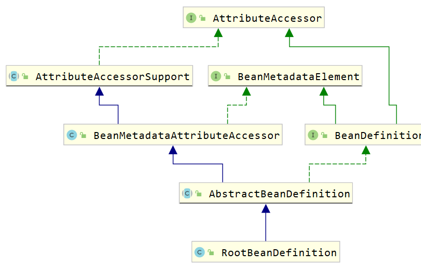


### BeanDefinitionReader

Bean的解析过程非常复杂，功能被分得很细，因为这里需要被扩展的地方很多，必须保证足够的灵活性，以应对可能的变化。Bean的解析主要就是对Spring配置文件的解析。这个解析过程主要通过BeanDefinitionReader来完成


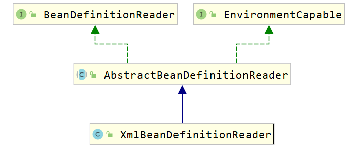


```java
public interface BeanDefinitionReader {

   /**
    * Return the bean factory to register the bean definitions with.
    * <p>The factory is exposed through the {@link BeanDefinitionRegistry} interface,
    * encapsulating the methods that are relevant for bean definition handling.
    */
   BeanDefinitionRegistry getRegistry();

   /**
    * Return the {@link ResourceLoader} to use for resource locations.
    * <p>Can be checked for the {@code ResourcePatternResolver} interface and cast
    * accordingly, for loading multiple resources for a given resource pattern.
    * <p>A {@code null} return value suggests that absolute resource loading
    * is not available for this bean definition reader.
    * <p>This is mainly meant to be used for importing further resources
    * from within a bean definition resource, for example via the "import"
    * tag in XML bean definitions. It is recommended, however, to apply
    * such imports relative to the defining resource; only explicit full
    * resource locations will trigger absolute path based resource loading.
    * <p>There is also a {@code loadBeanDefinitions(String)} method available,
    * for loading bean definitions from a resource location (or location pattern).
    * This is a convenience to avoid explicit {@code ResourceLoader} handling.
    * @see #loadBeanDefinitions(String)
    * @see org.springframework.core.io.support.ResourcePatternResolver
    */
   @Nullable
   ResourceLoader getResourceLoader();

   /**
    * Return the class loader to use for bean classes.
    * <p>{@code null} suggests to not load bean classes eagerly
    * but rather to just register bean definitions with class names,
    * with the corresponding classes to be resolved later (or never).
    */
   @Nullable
   ClassLoader getBeanClassLoader();

   /**
    * Return the {@link BeanNameGenerator} to use for anonymous beans
    * (without explicit bean name specified).
    */
   BeanNameGenerator getBeanNameGenerator();


   /**
    * Load bean definitions from the specified resource.
    * @param resource the resource descriptor
    * @return the number of bean definitions found
    * @throws BeanDefinitionStoreException in case of loading or parsing errors
    */
   int loadBeanDefinitions(Resource resource) throws BeanDefinitionStoreException;

   /**
    * Load bean definitions from the specified resources.
    * @param resources the resource descriptors
    * @return the number of bean definitions found
    * @throws BeanDefinitionStoreException in case of loading or parsing errors
    */
   int loadBeanDefinitions(Resource... resources) throws BeanDefinitionStoreException;

   /**
    * Load bean definitions from the specified resource location.
    * <p>The location can also be a location pattern, provided that the
    * {@link ResourceLoader} of this bean definition reader is a
    * {@code ResourcePatternResolver}.
    * @param location the resource location, to be loaded with the {@code ResourceLoader}
    * (or {@code ResourcePatternResolver}) of this bean definition reader
    * @return the number of bean definitions found
    * @throws BeanDefinitionStoreException in case of loading or parsing errors
    * @see #getResourceLoader()
    * @see #loadBeanDefinitions(org.springframework.core.io.Resource)
    * @see #loadBeanDefinitions(org.springframework.core.io.Resource[])
    */
   int loadBeanDefinitions(String location) throws BeanDefinitionStoreException;

   /**
    * Load bean definitions from the specified resource locations.
    * @param locations the resource locations, to be loaded with the {@code ResourceLoader}
    * (or {@code ResourcePatternResolver}) of this bean definition reader
    * @return the number of bean definitions found
    * @throws BeanDefinitionStoreException in case of loading or parsing errors
    */
   int loadBeanDefinitions(String... locations) throws BeanDefinitionStoreException;

}
```


### BeanDefinitionRegistry

BeanDefinitionReader用来解析bean定义，并封装BeanDefinition对象，而我们定义的配置文件中定义了很多bean标签，所以就有一个问题，解析的BeanDefinition对象存储到哪儿？答案就是BeanDefinition的注册中心，而该注册中心顶层接口就是BeanDefinitionRegistry


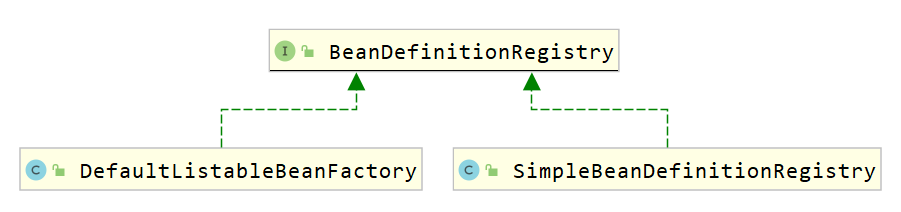


```java
public interface BeanDefinitionRegistry extends AliasRegistry {

   /**
    * Register a new bean definition with this registry.
    * Must support RootBeanDefinition and ChildBeanDefinition.
    * @param beanName the name of the bean instance to register
    * @param beanDefinition definition of the bean instance to register
    * @throws BeanDefinitionStoreException if the BeanDefinition is invalid
    * @throws BeanDefinitionOverrideException if there is already a BeanDefinition
    * for the specified bean name and we are not allowed to override it
    * @see GenericBeanDefinition
    * @see RootBeanDefinition
    * @see ChildBeanDefinition
    */
   void registerBeanDefinition(String beanName, BeanDefinition beanDefinition)
         throws BeanDefinitionStoreException;

   /**
    * Remove the BeanDefinition for the given name.
    * @param beanName the name of the bean instance to register
    * @throws NoSuchBeanDefinitionException if there is no such bean definition
    */
   void removeBeanDefinition(String beanName) throws NoSuchBeanDefinitionException;

   /**
    * Return the BeanDefinition for the given bean name.
    * @param beanName name of the bean to find a definition for
    * @return the BeanDefinition for the given name (never {@code null})
    * @throws NoSuchBeanDefinitionException if there is no such bean definition
    */
   BeanDefinition getBeanDefinition(String beanName) throws NoSuchBeanDefinitionException;

   /**
    * Check if this registry contains a bean definition with the given name.
    * @param beanName the name of the bean to look for
    * @return if this registry contains a bean definition with the given name
    */
   boolean containsBeanDefinition(String beanName);

   /**
    * Return the names of all beans defined in this registry.
    * @return the names of all beans defined in this registry,
    * or an empty array if none defined
    */
   String[] getBeanDefinitionNames();

   /**
    * Return the number of beans defined in the registry.
    * @return the number of beans defined in the registry
    */
   int getBeanDefinitionCount();

   /**
    * Determine whether the given bean name is already in use within this registry,
    * i.e. whether there is a local bean or alias registered under this name.
    * @param beanName the name to check
    * @return whether the given bean name is already in use
    */
   boolean isBeanNameInUse(String beanName);

}
```


BeanDefinitionRegistry接口的子实现类主要有以下几个：

* DefaultListableBeanFactory

  在该类中定义了如下代码，就是用来注册bean

  ```java
  private final Map<String, BeanDefinition> beanDefinitionMap = new ConcurrentHashMap<>(256);
  ```


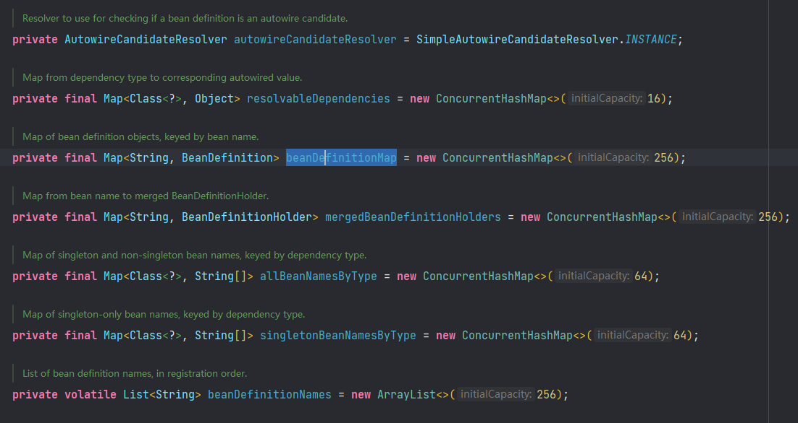


* SimpleBeanDefinitionRegistry

  在该类中定义了如下代码，就是用来注册bean

  ```java
  private final Map<String, BeanDefinition> beanDefinitionMap = new ConcurrentHashMap<>(64);
  ```


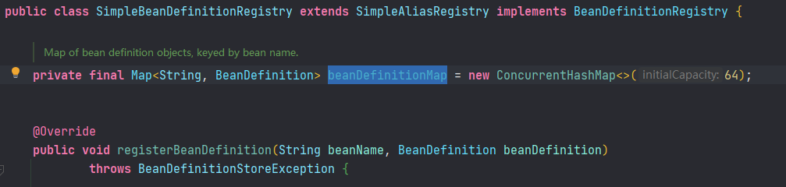


```java
public class SimpleBeanDefinitionRegistry extends SimpleAliasRegistry implements BeanDefinitionRegistry {

   /** Map of bean definition objects, keyed by bean name. */
   private final Map<String, BeanDefinition> beanDefinitionMap = new ConcurrentHashMap<>(64);


   @Override
   public void registerBeanDefinition(String beanName, BeanDefinition beanDefinition)
         throws BeanDefinitionStoreException {

      Assert.hasText(beanName, "'beanName' must not be empty");
      Assert.notNull(beanDefinition, "BeanDefinition must not be null");
      this.beanDefinitionMap.put(beanName, beanDefinition);
   }

   @Override
   public void removeBeanDefinition(String beanName) throws NoSuchBeanDefinitionException {
      if (this.beanDefinitionMap.remove(beanName) == null) {
         throw new NoSuchBeanDefinitionException(beanName);
      }
   }

   @Override
   public BeanDefinition getBeanDefinition(String beanName) throws NoSuchBeanDefinitionException {
      BeanDefinition bd = this.beanDefinitionMap.get(beanName);
      if (bd == null) {
         throw new NoSuchBeanDefinitionException(beanName);
      }
      return bd;
   }

   @Override
   public boolean containsBeanDefinition(String beanName) {
      return this.beanDefinitionMap.containsKey(beanName);
   }

   @Override
   public String[] getBeanDefinitionNames() {
      return StringUtils.toStringArray(this.beanDefinitionMap.keySet());
   }

   @Override
   public int getBeanDefinitionCount() {
      return this.beanDefinitionMap.size();
   }

   @Override
   public boolean isBeanNameInUse(String beanName) {
      return isAlias(beanName) || containsBeanDefinition(beanName);
   }

}
```


### 创建容器

ClassPathXmlApplicationContext对Bean配置资源的载入是从refresh（）方法开始的。refresh（）方法是一个模板方法，规定了 IoC 容器的启动流程，有些逻辑要交给其子类实现。它对 Bean 配置资源进行载入，ClassPathXmlApplicationContext通过调用其父类AbstractApplicationContext的refresh（）方法启动整个IoC容器对Bean定义的载入过程。


```java
public abstract class AbstractApplicationContext extends DefaultResourceLoader
		implements ConfigurableApplicationContext {
...

@Override
public void refresh() throws BeansException, IllegalStateException {
   synchronized (this.startupShutdownMonitor) {
      StartupStep contextRefresh = this.applicationStartup.start("spring.context.refresh");

      // Prepare this context for refreshing.
      prepareRefresh();

      // Tell the subclass to refresh the internal bean factory.
      ConfigurableListableBeanFactory beanFactory = obtainFreshBeanFactory();

      // Prepare the bean factory for use in this context.
      prepareBeanFactory(beanFactory);

      try {
         // Allows post-processing of the bean factory in context subclasses.
         postProcessBeanFactory(beanFactory);

         StartupStep beanPostProcess = this.applicationStartup.start("spring.context.beans.post-process");
         // Invoke factory processors registered as beans in the context.
         invokeBeanFactoryPostProcessors(beanFactory);

         // Register bean processors that intercept bean creation.
         registerBeanPostProcessors(beanFactory);
         beanPostProcess.end();

         // Initialize message source for this context.
         initMessageSource();

         // Initialize event multicaster for this context.
         initApplicationEventMulticaster();

         // Initialize other special beans in specific context subclasses.
         onRefresh();

         // Check for listener beans and register them.
         registerListeners();

         // Instantiate all remaining (non-lazy-init) singletons.
         finishBeanFactoryInitialization(beanFactory);

         // Last step: publish corresponding event.
         finishRefresh();
      }

      catch (BeansException ex) {
         if (logger.isWarnEnabled()) {
            logger.warn("Exception encountered during context initialization - " +
                  "cancelling refresh attempt: " + ex);
         }

         // Destroy already created singletons to avoid dangling resources.
         destroyBeans();

         // Reset 'active' flag.
         cancelRefresh(ex);

         // Propagate exception to caller.
         throw ex;
      }

      finally {
         // Reset common introspection caches in Spring's core, since we
         // might not ever need metadata for singleton beans anymore...
         resetCommonCaches();
         contextRefresh.end();
      }
   }
}
...
}

```


## 自定义SpringIOC

### PropertyValue类

用于封装bean的属性，体现到上面的配置文件就是封装bean标签的子标签property标签数据

比如：

```xml
<property name="userDao" ref="userDao"/>
```


```java
package mao.customize.pojo;

/**
 * Project name(项目名称)：java设计模式_自定义Spring框架
 * Package(包名): mao.customize.pojo
 * Class(类名): PropertyValue
 * Author(作者）: mao
 * Author QQ：1296193245
 * GitHub：https://github.com/maomao124/
 * Date(创建日期)： 2022/8/25
 * Time(创建时间)： 14:46
 * Version(版本): 1.0
 * Description(描述)： 用于封装bean的属性
 *
 * <property name="userDao" ref="userDao"/>
 */


public class PropertyValue
{
    //属性名称
    private String name;
    //引用
    private String ref;
    //值
    private String value;

    /**
     * Instantiates a new Property value.
     */
    public PropertyValue()
    {

    }

    /**
     * Instantiates a new Property value.
     *
     * @param name  the name
     * @param ref   the ref
     * @param value the value
     */
    public PropertyValue(String name, String ref, String value)
    {
        this.name = name;
        this.ref = ref;
        this.value = value;
    }

    /**
     * Gets name.
     *
     * @return the name
     */
    public String getName()
    {
        return name;
    }

    /**
     * Sets name.
     *
     * @param name the name
     */
    public void setName(String name)
    {
        this.name = name;
    }

    /**
     * Gets ref.
     *
     * @return the ref
     */
    public String getRef()
    {
        return ref;
    }

    /**
     * Sets ref.
     *
     * @param ref the ref
     */
    public void setRef(String ref)
    {
        this.ref = ref;
    }

    /**
     * Gets value.
     *
     * @return the value
     */
    public String getValue()
    {
        return value;
    }

    /**
     * Sets value.
     *
     * @param value the value
     */
    public void setValue(String value)
    {
        this.value = value;
    }
}
```


### MutablePropertyValues类

一个bean标签可以有多个property子标签，所以再定义一个MutablePropertyValues类，用来存储并管理多个PropertyValue对象


```java
package mao.customize.pojo;

import java.util.ArrayList;
import java.util.Iterator;
import java.util.List;

/**
 * Project name(项目名称)：java设计模式_自定义Spring框架
 * Package(包名): mao.customize.pojo
 * Class(类名): MutablePropertyValues
 * Author(作者）: mao
 * Author QQ：1296193245
 * GitHub：https://github.com/maomao124/
 * Date(创建日期)： 2022/8/25
 * Time(创建时间)： 14:49
 * Version(版本): 1.0
 * Description(描述)： 一个bean标签可以有多个property子标签，所以再定义一个MutablePropertyValues类，用来存储并管理多个PropertyValue对象
 */


public class MutablePropertyValues implements Iterable<PropertyValue>
{
    private final List<PropertyValue> propertyValueList;

    /**
     * Instantiates a new Mutable property values.
     */
    public MutablePropertyValues()
    {
        this.propertyValueList = new ArrayList<>();
    }

    /**
     * Instantiates a new Mutable property values.
     *
     * @param propertyValueList the property value list
     */
    public MutablePropertyValues(List<PropertyValue> propertyValueList)
    {
        //this.propertyValueList = Objects.requireNonNullElseGet(propertyValueList, ArrayList::new);
        if (propertyValueList != null)
        {
            this.propertyValueList = propertyValueList;
        }
        else
        {
            this.propertyValueList = new ArrayList<>();
        }
    }

    @Override
    public Iterator<PropertyValue> iterator()
    {
        //获取迭代器并返回
        return this.propertyValueList.iterator();
    }

    /**
     * 将List<PropertyValue>转数组后返回
     *
     * @return PropertyValue[] property value [ ]
     */
    public PropertyValue[] getPropertyValues()
    {
        return this.propertyValueList.toArray(new PropertyValue[0]);
    }

    /**
     * 根据属性的名称获取属性的值，也就是PropertyValue对象
     *
     * @param propertyName 属性的名称
     * @return PropertyValue对象 ，也可能会返回null
     */
    public PropertyValue getPropertyValue(String propertyName)
    {
        for (PropertyValue propertyValue : propertyValueList)
        {
            if (propertyValue.getName().equals(propertyName))
            {
                //获取到名字，直接返回
                return propertyValue;
            }
        }
        //没有获取到，返回null
        return null;
    }

    /**
     * 判断集合是否为空
     *
     * @return boolean类型 boolean
     */
    public boolean isEmpty()
    {
        return this.propertyValueList.isEmpty();
    }

    /**
     * 往集合里添加一个PropertyValue对象
     *
     * @param propertyValue PropertyValue对象
     * @return MutablePropertyValues （当前对象），链式调用
     */
    public MutablePropertyValues addPropertyValue(PropertyValue propertyValue)
    {
        if (propertyValue == null)
        {
            return this;
        }
        for (int i = 0; i < this.propertyValueList.size(); i++)
        {
            //从集合里获取，判断是否有名字冲突的，也就是属性的名称，名称对应一个set方法，应该唯一
            PropertyValue propertyValue1 = this.propertyValueList.get(i);
            if (propertyValue1.getName().equals(propertyValue.getName()))
            {
                //属性名称冲突
                //这里直接就替换
                this.propertyValueList.set(i, new PropertyValue(propertyValue.getName(), propertyValue.getRef(), propertyValue.getValue()));
            }
        }
        //没有名称冲突，直接添加
        this.propertyValueList.add(propertyValue);
        return this;
    }

    /**
     * 判断propertyName是否存在
     *
     * @param propertyName propertyName
     * @return boolean类型 boolean
     */
    public boolean contains(String propertyName)
    {
        return this.getPropertyValue(propertyName) != null;
    }
}

```


### BeanDefinition类

BeanDefinition类用来封装bean信息的，主要包含id（即bean对象的名称）、class（需要交由spring管理的类的全类名）及子标签property数据


```java
package mao.customize.pojo;

/**
 * Project name(项目名称)：java设计模式_自定义Spring框架
 * Package(包名): mao.customize.pojo
 * Class(类名): BeanDefinition
 * Author(作者）: mao
 * Author QQ：1296193245
 * GitHub：https://github.com/maomao124/
 * Date(创建日期)： 2022/8/25
 * Time(创建时间)： 15:09
 * Version(版本): 1.0
 * Description(描述)： BeanDefinition类用来封装bean信息的，主要包含id（即bean对象的名称）、class（需要交由spring管理的类的全类名）及子标签property数据。
 * <p>
 * 例如：
 * <br>
 *
 * <bean id="userService" class="mao.use.UserServiceImpl">
 * <property name="userDao" ref="userDao"/>
 * </bean>
 */


public class BeanDefinition
{
    //id，id唯一
    private String id;
    //类的全路径名称，String类型
    private String className;
    //MutablePropertyValues对象，也就是多个property数据
    private MutablePropertyValues propertyValues;

    /**
     * Instantiates a new Bean definition.
     */
    public BeanDefinition()
    {
        this.propertyValues = new MutablePropertyValues();
    }

    /**
     * Instantiates a new Bean definition.
     *
     * @param id             the id
     * @param className      the class name
     * @param propertyValues the property values
     */
    public BeanDefinition(String id, String className, MutablePropertyValues propertyValues)
    {
        this.id = id;
        this.className = className;
        this.propertyValues = propertyValues;
    }

    /**
     * Gets id.
     *
     * @return the id
     */
    public String getId()
    {
        return id;
    }

    /**
     * Sets id.
     *
     * @param id the id
     */
    public void setId(String id)
    {
        this.id = id;
    }

    /**
     * Gets class name.
     *
     * @return the class name
     */
    public String getClassName()
    {
        return className;
    }

    /**
     * Sets class name.
     *
     * @param className the class name
     */
    public void setClassName(String className)
    {
        this.className = className;
    }

    /**
     * Gets property values.
     *
     * @return the property values
     */
    public MutablePropertyValues getPropertyValues()
    {
        return propertyValues;
    }

    /**
     * Sets property values.
     *
     * @param propertyValues the property values
     */
    public void setPropertyValues(MutablePropertyValues propertyValues)
    {
        this.propertyValues = propertyValues;
    }
}
```


---


### BeanDefinitionRegistry接口

BeanDefinitionRegistry接口定义了注册表的相关操作，定义如下功能：

* 注册BeanDefinition对象到注册表中
* 从注册表中删除指定名称的BeanDefinition对象
* 根据名称从注册表中获取BeanDefinition对象
* 判断注册表中是否包含指定名称的BeanDefinition对象
* 获取注册表中BeanDefinition对象的个数
* 获取注册表中所有的BeanDefinition的名称


```java
package mao.customize.registry;

import mao.customize.pojo.BeanDefinition;

/**
 * Project name(项目名称)：java设计模式_自定义Spring框架
 * Package(包名): mao.customize.registry
 * Interface(接口名): BeanDefinitionRegistry
 * Author(作者）: mao
 * Author QQ：1296193245
 * GitHub：https://github.com/maomao124/
 * Date(创建日期)： 2022/8/25
 * Time(创建时间)： 15:16
 * Version(版本): 1.0
 * Description(描述)： BeanDefinitionRegistry接口定义了注册表的相关操作
 */

public interface BeanDefinitionRegistry
{
    /**
     * 注册BeanDefinition对象到注册表中
     *
     * @param beanName       bean的名称（bean的id属性）
     * @param beanDefinition BeanDefinition对象
     */
    void registerBeanDefinition(String beanName, BeanDefinition beanDefinition);

    /**
     * 从注册表中删除指定名称的BeanDefinition对象
     *
     * @param beanName bean的名称（bean的id属性）
     * @throws Exception 异常
     */
    void removeBeanDefinition(String beanName) throws Exception;

    /**
     * 根据名称从注册表中获取BeanDefinition对象
     *
     * @param beanName bean的名称（bean的id属性）
     * @return BeanDefinition对象
     * @throws Exception 异常
     */
    BeanDefinition getBeanDefinition(String beanName) throws Exception;

    /**
     * 根据bean的名称判断是否包含指定的BeanDefinition对象
     *
     * @param beanName bean的名称（bean的id属性）
     * @return boolean类型
     */
    boolean containsBeanDefinition(String beanName);

    /**
     * 返回BeanDefinition的个数
     *
     * @return BeanDefinition的个数，int型
     */
    int getBeanDefinitionCount();

    /**
     * 获取所有的名称列表
     *
     * @return String数组
     */
    String[] getBeanDefinitionNames();
}

```


### SimpleBeanDefinitionRegistry类

该类实现了BeanDefinitionRegistry接口，定义了Map集合作为注册表容器


```java
package mao.customize.registry;

import mao.customize.pojo.BeanDefinition;

import java.util.HashMap;
import java.util.Map;

/**
 * Project name(项目名称)：java设计模式_自定义Spring框架
 * Package(包名): mao.customize.registry
 * Class(类名): SimpleBeanDefinitionRegistry
 * Author(作者）: mao
 * Author QQ：1296193245
 * GitHub：https://github.com/maomao124/
 * Date(创建日期)： 2022/8/25
 * Time(创建时间)： 15:22
 * Version(版本): 1.0
 * Description(描述)： 无
 */


public class SimpleBeanDefinitionRegistry implements BeanDefinitionRegistry
{

    private final Map<String, BeanDefinition> beanDefinitionMap;

    /**
     * Instantiates a new Simple bean definition registry.
     */
    public SimpleBeanDefinitionRegistry()
    {
        this.beanDefinitionMap = new HashMap<>();
    }

    /**
     * Instantiates a new Simple bean definition registry.
     *
     * @param beanDefinitionMap the bean definition map
     */
    public SimpleBeanDefinitionRegistry(Map<String, BeanDefinition> beanDefinitionMap)
    {
        //this.beanDefinitionMap = Objects.requireNonNullElseGet(beanDefinitionMap, HashMap::new);
        if (beanDefinitionMap != null)
        {
            this.beanDefinitionMap = beanDefinitionMap;
        }
        else
        {
            this.beanDefinitionMap = new HashMap<>();
        }

    }

    @Override
    public void registerBeanDefinition(String beanName, BeanDefinition beanDefinition)
    {
        if (beanName == null)
        {
            return;
        }
        if (beanDefinition == null)
        {
            return;
        }
        //判断id是否唯一
        if (this.beanDefinitionMap.containsKey(beanName))
        {
            throw new RuntimeException("bean的id不唯一！！！ 不唯一的id为" + beanName);
        }
        beanDefinitionMap.put(beanName, beanDefinition);
    }

    @Override
    public void removeBeanDefinition(String beanName) throws Exception
    {
        if (beanName == null)
        {
            return;
        }
        beanDefinitionMap.remove(beanName);
    }

    @Override
    public BeanDefinition getBeanDefinition(String beanName) throws Exception
    {
        if (beanName == null)
        {
            return null;
        }
        return beanDefinitionMap.get(beanName);
    }

    @Override
    public boolean containsBeanDefinition(String beanName)
    {
        if (beanName == null)
        {
            return false;
        }
        return beanDefinitionMap.containsKey(beanName);
    }

    @Override
    public int getBeanDefinitionCount()
    {
        return beanDefinitionMap.size();
    }

    @Override
    public String[] getBeanDefinitionNames()
    {
        return beanDefinitionMap.keySet().toArray(new String[0]);
    }
}

```


---


### BeanDefinitionReader接口

BeanDefinitionReader是用来解析配置文件并在注册表中注册bean的信息。定义了两个规范：

* 获取注册表的功能，让外界可以通过该对象获取注册表对象。
* 加载配置文件，并注册bean数据。


```java
package mao.customize.reader;

import mao.customize.registry.BeanDefinitionRegistry;

/**
 * Project name(项目名称)：java设计模式_自定义Spring框架
 * Package(包名): mao.customize.reader
 * Interface(接口名): BeanDefinitionReader
 * Author(作者）: mao
 * Author QQ：1296193245
 * GitHub：https://github.com/maomao124/
 * Date(创建日期)： 2022/8/25
 * Time(创建时间)： 15:36
 * Version(版本): 1.0
 * Description(描述)：
 * BeanDefinitionReader是用来解析配置文件并在注册表中注册bean的信息。定义了两个规范：
 * <p>
 * 获取注册表的功能，让外界可以通过该对象获取注册表对象。
 * 加载配置文件，并注册bean数据。
 */

public interface BeanDefinitionReader
{
    /**
     * 获取注册表对象
     *
     * @return BeanDefinitionRegistry的子实现类
     */
    BeanDefinitionRegistry getRegistry();

    /**
     * 加载配置文件并在注册表中进行注册
     *
     * @param configLocation 文件的路径，一般都为类路径，具体看实现类
     * @throws Exception 异常
     */
    void loadBeanDefinitions(String configLocation) throws Exception;
}
```


### XmlBeanDefinitionReader类

XmlBeanDefinitionReader类是专门用来解析xml配置文件的。该类实现BeanDefinitionReader接口并实现接口中的两个功能


加载需要dom4j

需要在pom.xml导入dom4j的依赖

```xml
<!--dom4j依赖 解析xml文件-->
<dependency>
    <groupId>org.dom4j</groupId>
    <artifactId>dom4j</artifactId>
    <version>2.1.3</version>
</dependency>
```


|       Attribute       |                     定义了 XML 的属性。                      |
| :-------------------: | :----------------------------------------------------------: |
|        Branch         | 指能够包含子节点的节点。如XML元素(Element)和文档(Docuemnts)定义了一个公共的行为 |
|         CDATA         |                    定义了 XML CDATA 区域                     |
|     CharacterData     | 是一个标识接口，标识基于字符的节点。如CDATA，Comment, Text.  |
|        Comment        |                    定义了 XML 注释的行为                     |
|       Document        |                        定义了XML 文档                        |
|     DocumentType      |                    定义 XML DOCTYPE 声明                     |
|        Element        |                         定义XML 元素                         |
|    ElementHandler     |                  定义了Element 对象的处理器                  |
|      ElementPath      |  被 ElementHandler 使用，用于取得当前正在处理的路径层次信息  |
|        Entity         |                       定义 XML entity                        |
|         Node          |             为dom4j中所有的XML节点定义了多态行为             |
|      NodeFilter       | 定义了在dom4j 节点中产生的一个滤镜或谓词的行为（predicate）  |
| ProcessingInstruction |                      定义 XML 处理指令                       |
|         Text          |                      定义 XML 文本节点                       |
|        Visitor        |                     用于实现 Visitor模式                     |
|         XPath         |          在分析一个字符串后会提供一个 XPath 表达式           |


```java
package mao.customize.registry;

import mao.customize.pojo.BeanDefinition;

import java.util.HashMap;
import java.util.Map;

/**
 * Project name(项目名称)：java设计模式_自定义Spring框架
 * Package(包名): mao.customize.registry
 * Class(类名): SimpleBeanDefinitionRegistry
 * Author(作者）: mao
 * Author QQ：1296193245
 * GitHub：https://github.com/maomao124/
 * Date(创建日期)： 2022/8/25
 * Time(创建时间)： 15:22
 * Version(版本): 1.0
 * Description(描述)： 无
 */


public class SimpleBeanDefinitionRegistry implements BeanDefinitionRegistry
{

    private final Map<String, BeanDefinition> beanDefinitionMap;

    /**
     * Instantiates a new Simple bean definition registry.
     */
    public SimpleBeanDefinitionRegistry()
    {
        this.beanDefinitionMap = new HashMap<>();
    }

    /**
     * Instantiates a new Simple bean definition registry.
     *
     * @param beanDefinitionMap the bean definition map
     */
    public SimpleBeanDefinitionRegistry(Map<String, BeanDefinition> beanDefinitionMap)
    {
        //this.beanDefinitionMap = Objects.requireNonNullElseGet(beanDefinitionMap, HashMap::new);
        if (beanDefinitionMap != null)
        {
            this.beanDefinitionMap = beanDefinitionMap;
        }
        else
        {
            this.beanDefinitionMap = new HashMap<>();
        }

    }

    @Override
    public void registerBeanDefinition(String beanName, BeanDefinition beanDefinition)
    {
        if (beanName == null)
        {
            return;
        }
        if (beanDefinition == null)
        {
            return;
        }
        //判断id是否唯一
        if (this.beanDefinitionMap.containsKey(beanName))
        {
            throw new RuntimeException("bean的id不唯一！！！ 不唯一的id为" + beanName);
        }
        beanDefinitionMap.put(beanName, beanDefinition);
    }

    @Override
    public void removeBeanDefinition(String beanName) throws Exception
    {
        if (beanName == null)
        {
            return;
        }
        beanDefinitionMap.remove(beanName);
    }

    @Override
    public BeanDefinition getBeanDefinition(String beanName) throws Exception
    {
        if (beanName == null)
        {
            return null;
        }
        return beanDefinitionMap.get(beanName);
    }

    @Override
    public boolean containsBeanDefinition(String beanName)
    {
        if (beanName == null)
        {
            return false;
        }
        return beanDefinitionMap.containsKey(beanName);
    }

    @Override
    public int getBeanDefinitionCount()
    {
        return beanDefinitionMap.size();
    }

    @Override
    public String[] getBeanDefinitionNames()
    {
        return beanDefinitionMap.keySet().toArray(new String[0]);
    }
}
```


---


### BeanFactory接口

在该接口中定义IOC容器的统一规范即获取bean对象


```java
package mao.customize.context;

/**
 * Project name(项目名称)：java设计模式_自定义Spring框架
 * Package(包名): mao.customize.context
 * Interface(接口名): BeanFactory
 * Author(作者）: mao
 * Author QQ：1296193245
 * GitHub：https://github.com/maomao124/
 * Date(创建日期)： 2022/8/25
 * Time(创建时间)： 16:25
 * Version(版本): 1.0
 * Description(描述)： 在该接口中定义IOC容器的统一规范即获取bean对象
 */

public interface BeanFactory
{
    /**
     * 根据bean对象的名称获取bean对象
     *
     * @param name bean的名称，也就是bean标签的id
     * @return Object类型的对象
     * @throws Exception 异常
     */
    Object getBean(String name) throws Exception;

    /**
     * 根据bean对象的名称获取bean对象，并进行类型转换
     *
     * @param name  bean的名称，也就是bean标签的id
     * @param clazz 类的字节码
     * @param <T>   要转换的类型
     * @return 一个clazz类型的对象
     * @throws Exception 异常
     */
    <T> T getBean(String name, Class<? extends T> clazz) throws Exception;
}
```


### ApplicationContext接口


该接口的所以的子实现类对bean对象的创建都是非延时的，所以在该接口中定义 `refresh()` 方法，该方法主要完成以下两个功能：

* 加载配置文件。
* 根据注册表中的BeanDefinition对象封装的数据进行bean对象的创建。


```java
package mao.customize.context;

/**
 * Project name(项目名称)：java设计模式_自定义Spring框架
 * Package(包名): mao.customize.context
 * Interface(接口名): ApplicationContext
 * Author(作者）: mao
 * Author QQ：1296193245
 * GitHub：https://github.com/maomao124/
 * Date(创建日期)： 2022/8/25
 * Time(创建时间)： 16:28
 * Version(版本): 1.0
 * Description(描述)： 该接口的所以的子实现类对bean对象的创建都是非延时的，所以在该接口中定义 refresh() 方法
 */

public interface ApplicationContext extends BeanFactory
{
    /**
     * refresh方法
     * 进行配置文件加载并进行对象创建
     * 方法的功能：
     * <p>
     * 1. 加载配置文件
     * <p>
     * 2. 根据注册表中的BeanDefinition对象封装的数据进行bean对象的创建
     *
     * @throws IllegalStateException 非法状态异常
     * @throws Exception             异常
     */
    void refresh() throws IllegalStateException, Exception;
    
}
```


### AbstractApplicationContext类

* 作为ApplicationContext接口的子类，所以该类也是非延时加载，所以需要在该类中定义一个Map集合，作为bean对象存储的容器。

* 声明BeanDefinitionReader类型的变量，用来进行xml配置文件的解析，符合单一职责原则。

  BeanDefinitionReader类型的对象创建交由子类实现，因为只有子类明确到底创建BeanDefinitionReader哪儿个子实现类对象


```java
package mao.customize.context;

import mao.customize.pojo.BeanDefinition;
import mao.customize.reader.BeanDefinitionReader;
import mao.customize.registry.BeanDefinitionRegistry;

import java.util.HashMap;
import java.util.Map;

/**
 * Project name(项目名称)：java设计模式_自定义Spring框架
 * Package(包名): mao.customize.context
 * Class(类名): AbstractApplicationContext
 * Author(作者）: mao
 * Author QQ：1296193245
 * GitHub：https://github.com/maomao124/
 * Date(创建日期)： 2022/8/25
 * Time(创建时间)： 16:34
 * Version(版本): 1.0
 * Description(描述)： ApplicationContext接口的子类，该类也是非延时加载
 */

public abstract class AbstractApplicationContext implements ApplicationContext
{
    //BeanDefinitionReader对象，用于加载配置和获取注册表对象
    protected BeanDefinitionReader beanDefinitionReader;

    //存储bean对象的容器。key存储的是bean的id值，value存储的是bean对象
    protected Map<String, Object> singletonObjects = new HashMap<>();

    //存储配置文件的路径
    protected String configLocation;


    @Override
    public void refresh() throws IllegalStateException, Exception
    {
        //加载BeanDefinition
        //在此抽象类类调用会出现空指针异常？BeanDefinitionReader对象的创建要要交给子类，
        //而且此抽象类不能直接new，还有方法未重写，refresh由子类调用
        beanDefinitionReader.loadBeanDefinitions(configLocation);
        //初始化bean
        this.finishBeanInitialization();
    }

    /**
     * 初始化bean
     *
     * @throws Exception 异常
     */
    private void finishBeanInitialization() throws Exception
    {
        BeanDefinitionRegistry registry = beanDefinitionReader.getRegistry();
        String[] beanDefinitionNames = registry.getBeanDefinitionNames();
        for (String beanDefinitionName : beanDefinitionNames)
        {
            //BeanDefinition beanDefinition = registry.getBeanDefinition(beanDefinitionName);
            //此方法交给子类来实现，模板方法模式
            this.getBean(beanDefinitionName);
        }
    }
}

```


### StringUtils类

提供一个将属性名称转换为对应的set方法名称的方法


```java
package mao.customize.utils;

/**
 * Project name(项目名称)：java设计模式_自定义Spring框架
 * Package(包名): mao.customize.utils
 * Class(类名): StringUtils
 * Author(作者）: mao
 * Author QQ：1296193245
 * GitHub：https://github.com/maomao124/
 * Date(创建日期)： 2022/8/25
 * Time(创建时间)： 17:15
 * Version(版本): 1.0
 * Description(描述)： 无
 */

public class StringUtils
{
    /**
     * 将属性名称转换成对应的set方法的名称
     * <p>
     * 比如：
     * name -> setName
     * <p>
     * age -> setAge
     *
     * @param propertyName 属性的名称
     * @return 对应的set方法的名称
     */
    public static String toSetMethodName(String propertyName)
    {
        return "set" + propertyName.substring(0, 1).toUpperCase() + propertyName.substring(1);
    }

    public static void main(String[] args)
    {
        System.out.println(toSetMethodName("name"));
        System.out.println(toSetMethodName("age"));
        System.out.println(toSetMethodName("sex"));
        System.out.println(toSetMethodName("abc"));
    }
}
```


### ClassPathXmlApplicationContext类

该类主要是加载类路径下的配置文件，并进行bean对象的创建，主要完成以下功能：

* 在构造方法中，创建BeanDefinitionReader对象。
* 在构造方法中，调用refresh()方法，用于进行配置文件加载、创建bean对象并存储到容器中。
* 重写父接口中的getBean()方法，并实现依赖注入操作。


```java
package mao.customize.context;

import mao.customize.pojo.BeanDefinition;
import mao.customize.pojo.MutablePropertyValues;
import mao.customize.pojo.PropertyValue;
import mao.customize.reader.XmlBeanDefinitionReader;
import mao.customize.registry.BeanDefinitionRegistry;
import mao.customize.utils.StringUtils;

import java.lang.reflect.Method;

/**
 * Project name(项目名称)：java设计模式_自定义Spring框架
 * Package(包名): mao.customize.context
 * Class(类名): ClassPathXmlApplicationContext
 * Author(作者）: mao
 * Author QQ：1296193245
 * GitHub：https://github.com/maomao124/
 * Date(创建日期)： 2022/8/25
 * Time(创建时间)： 16:52
 * Version(版本): 1.0
 * Description(描述)： 该类主要是加载类路径下的配置文件，并进行bean对象的创建
 */

public class ClassPathXmlApplicationContext extends AbstractApplicationContext
{

    public ClassPathXmlApplicationContext(String configLocation)
    {
        if (configLocation == null)
        {
            throw new NullPointerException("configLocation不能为null!");
        }
        this.configLocation = configLocation;
        this.beanDefinitionReader = new XmlBeanDefinitionReader();
        try
        {
            //进行配置文件加载
            this.refresh();
        }
        catch (Exception e)
        {
            e.printStackTrace();
        }
    }

    @Override
    public Object getBean(String name) throws Exception
    {
        if (name == null)
        {
            throw new NullPointerException("name不能为null!");
        }
        Object o = this.singletonObjects.get(name);
        if (o != null)
        {
            //singletonObjects里存在，直接返回
            return o;
        }
        //singletonObjects里不存在，需要创建，并放入到singletonObjects里，再返回
        BeanDefinitionRegistry registry = beanDefinitionReader.getRegistry();
        //根据名字获取BeanDefinition对象
        BeanDefinition beanDefinition = registry.getBeanDefinition(name);
        if (beanDefinition == null)
        {
            //配置文件里不存在bean的id为name的标签，直接返回null
            return null;
        }
        //配置文件里存在bean的id为name的标签
        //获取类名称
        String className = beanDefinition.getClassName();
        //通过反射创建类的对象
        Class<?> aClass = Class.forName(className);
        //调用无参构造方法
        Object bean = aClass.getDeclaredConstructor().newInstance();
        //获取MutablePropertyValues对象，里面封装了多个bean的属性
        MutablePropertyValues mutablePropertyValues = beanDefinition.getPropertyValues();
        for (PropertyValue propertyValue : mutablePropertyValues)
        {
            //name
            String propertyName = propertyValue.getName();
            //引用
            String ref = propertyValue.getRef();
            //值
            String value = propertyValue.getValue();

            //标签有ref属性
            if (ref != null && !"".equals(ref))
            {
                //ref不为空
                //递归调用getBean方法
                Object bean1 = this.getBean(ref);
                //获取对应的set方法的名称
                String setMethodName = StringUtils.toSetMethodName(propertyName);
                //获取所有方法
                Method[] methods = aClass.getMethods();
                //遍历
                for (Method method : methods)
                {
                    if (method.getName().equals(setMethodName))
                    {
                        //方法名称一致
                        //执行bean对象的set方法，将对象bean1注入到bean对象中
                        method.invoke(bean, bean1);
                    }
                }
            }

            //标签有value属性，不用管既有ref又有value的情况，比如<property name="userDao" ref="userDao" value="hello"/>
            if (value != null && !"".equals(value))
            {
                //获取对应的set方法的名称
                String setMethodName = StringUtils.toSetMethodName(propertyName);
                //获取所有方法
                Method[] methods = aClass.getMethods();
                //遍历
                for (Method method : methods)
                {
                    if (method.getName().equals(setMethodName))
                    {
                        //方法名称一致
                        //执行bean对象的set方法，将value的值注入到bean对象中
                        method.invoke(bean, value);
                    }
                }
            }
        }
        //放入到map集合里
        this.singletonObjects.put(name, bean);
        //返回
        return bean;
    }

    @Override
    public <T> T getBean(String name, Class<? extends T> clazz) throws Exception
    {
        //获取bean
        Object bean = this.getBean(name);
        if (bean == null)
        {
            return null;
        }
        //转换再返回
        return clazz.cast(bean);
    }
}

```


## 测试
